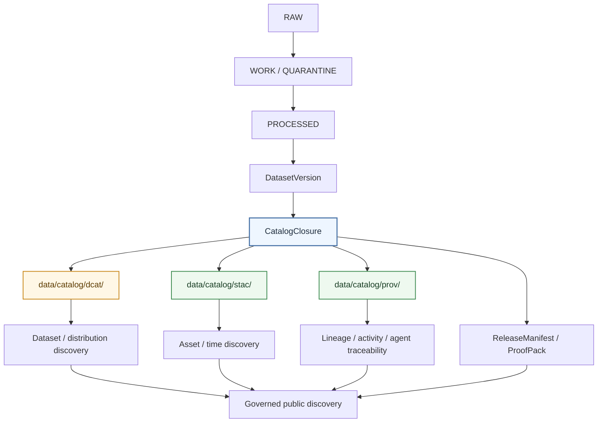

<!-- [KFM_META_BLOCK_V2]
doc_id: kfm://doc/TODO-UUID
title: data/catalog/dcat
type: standard
version: v1
status: draft
owners: @bartytime4life
created: TODO(YYYY-MM-DD; needs first-commit verification)
updated: 2026-04-14
policy_label: TODO(policy-label-needs-verification)
related: [
  ../../README.md,
  ../README.md,
  ../stac/README.md,
  ../prov/README.md,
  ../../../docs/standards/KFM_DCAT_PROFILE.md,
  ../../../contracts/README.md,
  ../../../policy/README.md,
  ../../../tests/README.md,
  ../../../tools/validators/README.md,
  ../../../tools/validators/promotion_gate/README.md,
  ../../../.github/CODEOWNERS
]
tags: [kfm, data, catalog, dcat, metadata, catalog-closure]
notes: [Current public main confirms this lane exists and is README-first; exact payload subtree, emitters, validators, creation date, and policy label remain NEEDS VERIFICATION.]
[/KFM_META_BLOCK_V2] -->

# `data/catalog/dcat/`

Outward **dataset and distribution discovery** lane for the KFM catalog-closure surface.

> [!NOTE]
> **Status:** experimental  
> **Document status:** draft  
> **Owners:** `@bartytime4life` *(broad `/data/` CODEOWNERS fallback)*  
> **Path:** `data/catalog/dcat/README.md`  
>        
> **Quick jumps:** [Scope](#scope) · [Repo fit](#repo-fit) · [Accepted inputs](#accepted-inputs) · [Exclusions](#exclusions) · [Directory tree](#directory-tree) · [Quickstart](#quickstart) · [Usage](#usage) · [Diagram](#diagram) · [Reference tables](#reference-tables) · [Task list](#task-list--release-gates) · [FAQ](#faq) · [Appendix](#appendix)

> [!IMPORTANT]
> Current public `main` resolves the visible catalog triplet as:
>
> - `data/catalog/dcat/`
> - `data/catalog/stac/`
> - `data/catalog/prov/`
>
> This lane currently shows a checked-in `README.md`, but the inspected public tree does **not** yet prove checked-in DCAT payload files, validators, or emitted public conformance for this lane.

> [!TIP]
> Keep the KFM trust split visible here:
>
> **receipt ≠ proof ≠ catalog ≠ publication**
>
> DCAT records in this lane should describe outward dataset/distribution discovery.  
> They must not quietly become canonical payload truth, release proof, process memory, or the act of publication itself.

> [!CAUTION]
> Use **profile-fit** language by default.  
> Do **not** claim mounted DCAT conformance unless emitted records, fixtures, validators, and release-gate evidence are checked in and reviewable.

---

## Scope

`data/catalog/dcat/` is KFM’s **dataset- and distribution-facing catalog lane**.

Its job is narrow and important: make released or release-candidate scope outwardly discoverable **without** replacing canonical truth, flattening policy, or bypassing release discipline. In KFM terms, this lane belongs to `CatalogClosure`, where outward `DCAT + STAC + PROV` metadata closes over release-backed truth after `PROCESSED` and before or alongside `PUBLISHED`.

In plain language, this directory exists so maintainers can keep dataset/distribution discovery:

- downstream of canonical processing
- linked to sibling STAC and PROV views
- explicit about rights and access posture
- aligned to release artifacts
- honest about what is confirmed now versus merely proposed

### What this README is for

Use this file to answer four questions quickly:

1. What belongs in `data/catalog/dcat/`?
2. What does **not** belong here?
3. What is **confirmed now** in the checked-in repo versus still **proposed**?
4. How should DCAT material stay downstream of processing, review, and release?

[Back to top](#datacatalogdcat)

---

## Repo fit

### Path and adjacency

| Relationship | Surface | Status | Why it matters |
|---|---|---|---|
| Parent lifecycle | [../../README.md](../../README.md) | **CONFIRMED** | Defines the wider `data/` truth path and explains where `CATALOG` sits between `PROCESSED` and `PUBLISHED` |
| Parent catalog lane | [../README.md](../README.md) | **CONFIRMED** | Defines the shared catalog boundary and the `DCAT + STAC + PROV` triplet |
| Sibling lane | [../stac/README.md](../stac/README.md) | **CONFIRMED** | STAC carries item/asset discovery and map/timeline-facing asset description |
| Sibling lane | [../prov/README.md](../prov/README.md) | **CONFIRMED** | PROV carries outward lineage, activity, and agent traceability |
| Upstream standards doc | [../../../docs/standards/KFM_DCAT_PROFILE.md](../../../docs/standards/KFM_DCAT_PROFILE.md) | **CONFIRMED** | Checked-in prose standard for KFM’s outward DCAT profile |
| Upstream contracts | [../../../contracts/README.md](../../../contracts/README.md) | **CONFIRMED path / INFERRED role** | Likely home for machine-facing schemas, vocabularies, and profile fixtures |
| Upstream policy | [../../../policy/README.md](../../../policy/README.md) | **CONFIRMED path / INFERRED role** | Rights, sensitivity, and fail-closed publication rules should live in executable policy as well as prose |
| Tooling / validation | [../../../tools/validators/README.md](../../../tools/validators/README.md), [../../../tools/validators/promotion_gate/README.md](../../../tools/validators/promotion_gate/README.md), [../../../tests/README.md](../../../tests/README.md) | **CONFIRMED path / NEEDS VERIFICATION entrypoints** | Root surfaces exist, but exact DCAT validator wiring is not yet proven from the inspected tree |
| Ownership surface | [../../../.github/CODEOWNERS](../../../.github/CODEOWNERS) | **CONFIRMED** | Current public CODEOWNERS gives `/data/` a broad fallback owner |

### Current verified snapshot

| Surface | Current public-main content | Reading rule |
|---|---|---|
| `data/catalog/` | `dcat/`, `stac/`, `prov/`, `README.md` | **CONFIRMED** checked-in parent catalog lane |
| `data/catalog/dcat/` | `README.md` | **CONFIRMED** lane existence; **UNKNOWN** deeper checked-in payload inventory |
| `data/catalog/stac/` | `README.md` | Confirms the sibling STAC lane exists now |
| `data/catalog/prov/` | `README.md` | Confirms the sibling PROV lane exists now |
| `docs/standards/KFM_DCAT_PROFILE.md` | checked-in standards doc | Confirms a prose DCAT profile exists and should inform this directory |
| Repo automation / gate proof | README surfaces and root directories are visible; exact lane-specific validators/workflows are not | Keep validator and conformance claims conservative |

### Repo-fit summary

Use this lane for **outward discovery metadata** that stays explicitly tied to release-backed scope.

Do **not** use it as:

- the canonical data payload
- the place where raw or quarantine material lives
- a substitute for review or proof artifacts
- a backdoor around governed APIs and release controls

[Back to top](#datacatalogdcat)

---

## Accepted inputs

The following content belongs here when it is release-linked, public-safe, and aligned to the checked-in standards posture.

| Accepted input | Belongs here when… | Status |
|---|---|---|
| `README.md` orientation material | it explains this lane honestly against current repo evidence | **CONFIRMED current pattern** |
| DCAT dataset records | they describe released or release-candidate dataset scope | **CONFIRMED doctrine / NEEDS VERIFICATION current-tree presence** |
| Distribution metadata | each public-safe artifact class or service endpoint needs outward discovery | **INFERRED from profile + doctrine** |
| Release linkage | the outward record points back to release-manifest, catalog-closure, or sibling proof artifacts | **CONFIRMED doctrine** |
| STAC / PROV cross-links | discovery must continue into asset and lineage views cleanly | **CONFIRMED doctrine** |
| Rights / access posture | public-safe license, rights, and access conditions must remain visible | **CONFIRMED doctrine / INFERRED field mapping** |
| Correction / supersession links | outward discovery must preserve visible lineage when releases change | **CONFIRMED doctrine** |

### What “accepted” means in KFM terms

Accepted material here should be:

- downstream of `PROCESSED`
- compatible with `CatalogClosure`
- explicit enough to support fail-closed discovery
- restrained enough that the catalog does not outrun upstream evidence

### Minimum bar for anything added here

- it is clearly **DCAT-shaped** rather than payload-shaped
- it resolves to a governed processed or released artifact
- it cross-links cleanly to sibling STAC and PROV records
- it preserves release identity instead of inventing a parallel naming universe
- it does not quietly become a proof pack, a process-memory receipt, or a runtime surface

[Back to top](#datacatalogdcat)

---

## Exclusions

| Not here | Goes instead | Why |
|---|---|---|
| Raw acquisitions and source-native dumps | `../../raw/` | Discovery is not intake |
| Scratch transforms or unreleased work | `../../work/` or `../../quarantine/` | This lane should not make provisional material look publishable |
| Canonical processed payloads | `../../processed/` | DCAT describes released scope; it does not replace the payload |
| STAC Items / Collections | `../stac/` | STAC remains the primary item/asset discovery carrier |
| PROV bundles | `../prov/` | PROV remains the primary lineage carrier |
| Internal-only policy bundles or reviewer workflows | `../../../policy/` and review artifacts | These may be linked, but should not be flattened into DCAT as sovereign truth |
| Runtime envelopes, resolver contracts, or feature APIs | contract / API surfaces outside this lane | DCAT is a catalog-edge vocabulary, not the runtime truth surface |
| Materialized outward copies as the primary release surface | `../../published/` | Published scope is adjacent, not identical, to dataset/distribution discovery |
| Release proof packs or attestations as the primary release record | `../../proofs/` | Proofs remain explicit and separately inspectable |
| Process-memory receipts as the primary record | `../../receipts/` | Discovery should point to process memory, not swallow it |

> [!WARNING]
> If a record would expose unresolved rights, exact-location-sensitive detail, unreleased scope, or a distribution that is not actually public-safe, it does **not** belong here.

[Back to top](#datacatalogdcat)

---

## Directory tree

### Current verified public-main shape

```text
data/catalog/dcat/
└── README.md
```

The inspected public tree currently proves the lane exists, but it does **not** yet prove a checked-in payload subtree under this path.

<details>
<summary><strong>Proposed starter shape for first payload-bearing adoption (NEEDS VERIFICATION)</strong></summary>

```text
data/catalog/dcat/
├── README.md
└── datasets/
    └── <dataset>__<version>.jsonld
```

Use a starter subtree like this only after the target branch, owner, and validator path are reverified.

</details>

[Back to top](#datacatalogdcat)

---

## Quickstart

### 1) Read the parent and standards surfaces first

```bash
sed -n '1,220p' data/catalog/README.md
sed -n '1,220p' data/catalog/dcat/README.md
sed -n '1,260p' docs/standards/KFM_DCAT_PROFILE.md
```

### 2) Confirm the checked-in catalog shape before adding payload files

```bash
git ls-files 'data/catalog/**'
```

### 3) Search the repo for DCAT/profile/closure references before inventing paths

```bash
git grep -n 'DCAT\|CatalogClosure\|dcat:Dataset\|dcat:Distribution' \
  docs/standards data/catalog contracts policy tools tests
```

### 4) Only introduce first payload files after subtree shape is verified

```bash
# PROPOSED starter pattern — verify on the target branch before using
mkdir -p data/catalog/dcat/datasets
$EDITOR data/catalog/dcat/datasets/<dataset>__<version>.jsonld
```

### 5) Treat validator wiring as branch-specific until proven

```bash
# Current public main confirms tools/, policy/, and tests/ exist,
# but does not yet prove the exact DCAT validator entrypoint.
# Reverify before claiming mounted conformance or merge-gate coverage.
```

> [!TIP]
> The safest first change in this lane is often a **doc + standards + fixtures** change set, not a bare JSON-LD payload dropped without profile, tests, or release linkage.

[Back to top](#datacatalogdcat)

---

## Usage

### When to touch this lane

Revise `data/catalog/dcat/` when you need to:

- clarify directory intent against current repo evidence
- introduce or update outward dataset/distribution discovery
- keep DCAT aligned with sibling STAC and PROV records
- add correction-visible links after release changes
- tighten profile-fit language before mounted emitters land

### How DCAT should behave in KFM

DCAT records here should remain:

- **discovery-oriented**, not payload-heavy
- **release-linked**, not free-floating prose
- **profile-aware**, not ad hoc
- **rights-visible**, not silent on access posture
- **correction-friendly**, not lineage-erasing

### Profile-aligned pseudocode shape

The following is a **pseudocode sketch**, not a proven emitted fixture from the current public tree.

```jsonc
{
  "@type": "dcat:Dataset",
  "dct:identifier": "TODO(stable-dataset-id)",
  "dct:title": "TODO",
  "dct:description": "TODO",
  "dct:license": { "@id": "TODO(resolvable-license-IRI)" },
  "dct:rights": "TODO(optional-human-rights-note)",
  "dct:spatial": {
    "@type": "dct:Location",
    "locn:geometry": "TODO(public-safe-geometry)"
  },
  "dct:temporal": {
    "@type": "dct:PeriodOfTime",
    "time:hasBeginning": {
      "@type": "time:Instant",
      "time:inXSDDateTime": "TODO"
    },
    "time:hasEnd": {
      "@type": "time:Instant",
      "time:inXSDDateTime": "TODO"
    }
  },
  "dct:conformsTo": [
    { "@id": "https://www.w3.org/TR/vocab-dcat-3/" },
    { "@id": "TODO(kfm-profile-iri-or-doc-ref)" }
  ],
  "dct:relation": [
    "TODO(release-manifest-ref)",
    "TODO(stac-ref)",
    "TODO(prov-ref)"
  ],
  "dct:provenance": "TODO(outward-prov-ref)",
  "dcat:distribution": [
    {
      "@type": "dcat:Distribution",
      "dcat:downloadURL": { "@id": "TODO(actual-downloadable-artifact)" },
      "dcat:mediaType": "TODO(explicit-media-type)"
    },
    {
      "@type": "dcat:Distribution",
      "dcat:accessURL": { "@id": "TODO(service-or-mediated-access-point)" },
      "dcat:mediaType": "TODO(service-media-type)"
    }
  ]
}
```

Use `downloadURL` only for an **actual downloadable artifact**. Use `accessURL` when the outward object is a **service, viewer, or mediated access point**.

[Back to top](#datacatalogdcat)

---

## Diagram


```mermaid
flowchart TD
    A[RAW] --> B[WORK / QUARANTINE]
    B --> C[PROCESSED]
    C --> D[DatasetVersion]
    D --> E[CatalogClosure]

    E --> F[data/catalog/dcat/]
    E --> G[data/catalog/stac/]
    E --> H[data/catalog/prov/]
    E --> I[ReleaseManifest / ProofPack]

    F --> J[Dataset / distribution discovery]
    G --> K[Asset / time discovery]
    H --> L[Lineage / activity / agent traceability]

    J --> M[Governed public discovery]
    K --> M
    L --> M
    I --> M

    classDef seam fill:#eef6ff,stroke:#4a74a8,stroke-width:2px,color:#1f2d3d;
    classDef lane fill:#fff7e6,stroke:#c9871a,stroke-width:1.5px,color:#5c3b00;
    classDef sibling fill:#eef9ef,stroke:#3d8b50,stroke-width:1.5px,color:#183d23;
    class E seam;
    class F lane;
    class G,H sibling;
```

[Back to top](#datacatalogdcat)

---

## Reference tables

### Current verified snapshot

| Surface | What is currently visible on public `main` | Maintenance consequence |
|---|---|---|
| `data/catalog/dcat/` | `README.md` only | Treat payload subtree shape as **NEEDS VERIFICATION** until rechecked on the target branch |
| `data/catalog/` | parent `README.md` plus `dcat/`, `stac/`, `prov/` | The catalog triplet is a real checked-in surface, not just doctrine |
| `docs/standards/KFM_DCAT_PROFILE.md` | checked-in standards prose | Use it as the nearest repo-native guide for field rules and conformance language |
| `/.github/CODEOWNERS` | broad `/data/` fallback to `@bartytime4life` | Owner line in this README can be grounded instead of left blank |
| `tools/`, `policy/`, `tests/` | confirmed root surfaces | Search these before inventing validator paths; exact DCAT entrypoints remain unproven here |

### Minimum outward dataset / distribution expectations

| Concern | Carrier | Status | KFM consequence |
|---|---|---|---|
| Stable dataset identity | `dct:identifier`, title, description | **INFERRED** | identity drift breaks discovery, lineage, and correction |
| Release linkage | `dct:relation` and/or companion release links | **CONFIRMED** | public discovery must not outrun release state |
| Profile refs | `dct:conformsTo` | **CONFIRMED** | readers and validators need explicit standard/profile pins |
| Lineage continuation | `dct:provenance` plus sibling PROV links | **CONFIRMED** | DCAT must participate in the triplet, not stand alone |
| Rights posture | `dct:license`, `dct:rights` | **CONFIRMED** | unknown rights should block outward publication |
| Public-safe extent | `dct:spatial`, `dct:temporal` | **INFERRED** | discovery needs honest scope without leaking unsafe precision |
| One distribution per artifact class | `dcat:distribution` | **INFERRED** | do not flatten COG, GeoParquet, PMTiles, CSV, and service endpoints into one ambiguous object |
| Download vs access URL discipline | `dcat:downloadURL` / `dcat:accessURL` | **INFERRED** | use the URL type that matches the actual outward artifact class |
| Correction visibility | outward links to supersession / replacement | **CONFIRMED doctrine** | corrections must preserve visible lineage |

### Boundary matrix

| Surface | Primary job | Must not be confused with |
|---|---|---|
| `data/processed/` | canonical processed authority | outward dataset/distribution discovery |
| `data/receipts/` | process memory | DCAT discovery records |
| `data/proofs/` | release-significant evidence | dataset/distribution catalog metadata |
| `data/catalog/dcat/` | outward dataset/distribution discovery | canonical payload, release proof, or runtime API contract |
| `data/catalog/stac/` | asset/time discovery | dataset-level distribution discovery |
| `data/catalog/prov/` | lineage traceability | dataset-discovery prose |
| `data/published/` | optional materialized release-backed scope | the DCAT lane itself |

### Avoid patterns

| Avoid | Why |
|---|---|
| Treating DCAT as canonical truth | KFM refuses outward metadata to become sovereign truth |
| Claiming conformance because a standard is a good fit | KFM separates **profile fit** from **mounted adoption** |
| Publishing a public DCAT record without rights/review closure | fail-closed behavior must stay real |
| Letting DCAT, STAC, and PROV disagree on identity or release scope | catalog closure stops being trustworthy when the triplet drifts |
| Minting ad hoc KFM extension predicates in prose | extension drift becomes catalog drift |

[Back to top](#datacatalogdcat)

---

## Task list / release gates

Use this checklist for changes in this lane.

- [ ] the README still reflects the **current checked-in tree**, not only older doctrine docs
- [ ] any new outward record is tied to a released or release-candidate scope
- [ ] stable identifier, title, description, and explicit release linkage are present
- [ ] STAC / DCAT / PROV companion links resolve cleanly
- [ ] rights and access posture are explicit enough to support fail-closed behavior
- [ ] no `dcat:Distribution` points at `RAW`, `WORK`, or `QUARANTINE`
- [ ] `downloadURL` vs `accessURL` choice matches the actual outward artifact class
- [ ] public-safe temporal/spatial extent has been reviewed for precision and sensitivity
- [ ] correction or supersession behavior remains visible from the outward record
- [ ] no line in this README claims mounted conformance unless the repo now exposes emitters, validators, fixtures, and reviewable proof

### Definition of done

A change in `data/catalog/dcat/` is closer to done when it is:

- repo-grounded
- release-linked
- link-resolvable
- policy-aware
- correction-preserving
- explicit about anything still **UNKNOWN** or **NEEDS VERIFICATION**

[Back to top](#datacatalogdcat)

---

## FAQ

### Why does KFM need DCAT if it already has STAC?

Because the two lanes do different jobs. **STAC** is the item/asset discovery carrier. **DCAT** is the dataset/distribution discovery carrier. **PROV** carries lineage. KFM is strongest when those three stay linked inside `CatalogClosure`.

### Does current public `main` already prove emitted DCAT payloads?

No. Current public `main` proves the lane exists and that `README.md` is checked in here. It does **not** yet prove emitted dataset JSON-LD, validators, fixtures, or public conformance for this lane.

### Where should machine-readable schemas live?

Use the repo’s contract surface, not this README, as the likely machine authority. This README should explain behavior and review posture; it should not quietly become the schema registry.

### Should this lane ever point to unreleased or non-public-safe material?

No. Outward discovery metadata must remain downstream of release, rights, and sensitivity handling.

### How should corrections appear here?

Do not erase the old outward trail. Link supersession, withdrawal, or replacement forward so a reader starting from DCAT can still follow the lineage.

[Back to top](#datacatalogdcat)

---

## Appendix

<details>
<summary><strong>Appendix A — Historical path ambiguity, now retired by the visible public tree</strong></summary>

Older corpus material referenced both of the following patterns:

- `data/catalog/dcat/`, `data/catalog/stac/`, `data/catalog/prov/`
- `data/catalog/dcat/`, `data/stac/`, `data/prov/`

The current inspected public `main` tree resolves the **visible checked-in catalog triplet** under `data/catalog/`. Treat split-path references as historical document evidence until they are reverified on the specific branch you are changing.

</details>

<details>
<summary><strong>Appendix B — Open verification backlog</strong></summary>

Still needs direct branch or runtime inspection:

- first checked-in DCAT payload subtree below `data/catalog/dcat/`
- exact validator or fixture entrypoints for lane-specific DCAT checks
- whether `contracts/` is now the single authoritative machine-schema home
- mounted emitters and proof needed for any public conformance claim
- final `doc_id`, `created` date, and `policy_label` values for the meta block

</details>

<details>
<summary><strong>Appendix C — Maintainer review prompts</strong></summary>

Before you merge a substantive change here, ask:

1. Is this a **doc-only clarification**, or are we introducing the first checked-in DCAT payloads?
2. If payloads are being added, has the target-branch subtree shape been reverified?
3. Does the outward record point to **real** release-backed scope?
4. Would a user starting from DCAT still be able to reach sibling STAC, PROV, and correction context without guessing?
5. Are we using **profile-fit** language honestly, or accidentally claiming mounted conformance?

</details>

[Back to top](#datacatalogdcat)
