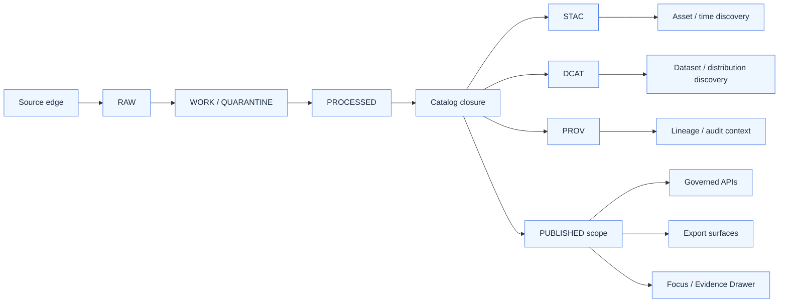

<!-- [KFM_META_BLOCK_V2]
doc_id: kfm://doc/TODO-UUID
title: DCAT Catalog Directory
type: standard
version: v1
status: draft
owners: TODO(owners-needs-verification)
created: TODO(YYYY-MM-DD)
updated: TODO(YYYY-MM-DD)
policy_label: TODO(policy-label-needs-verification)
related: [TODO(related-paths-needs-verification)]
tags: [kfm, dcat, catalog, metadata]
notes: [Current-session evidence was PDF-bounded; direct repo tree, existing sibling docs, and local ownership metadata remain NEEDS VERIFICATION.]
[/KFM_META_BLOCK_V2] -->

# DCAT Catalog Directory

_Outward dataset and distribution discovery for the KFM catalog-closure layer._

> **Status:** `TODO — needs verification`  
> **Owners:** `TODO — needs verification`  
> **Path:** `data/catalog/dcat/`  
> **Role:** DCAT-facing portion of KFM’s outward STAC/DCAT/PROV closure


**Quick jump:** [Scope](#scope) · [Repo fit](#repo-fit) · [Inputs](#accepted-inputs) · [Exclusions](#exclusions) · [Directory tree](#directory-tree) · [Quickstart](#quickstart) · [Usage](#usage) · [Diagram](#diagram) · [Reference tables](#reference-tables) · [Task list](#task-list--release-gates) · [FAQ](#faq) · [Appendix](#appendix)

> [!NOTE]
> This README is intentionally source-bounded. The mounted corpus in this session established KFM doctrine and several path examples, but **did not** expose a directly inspectable repository tree, existing adjacent README files, live schemas, CI workflows, or runtime manifests. File-level details that were not explicitly evidenced remain **NEEDS VERIFICATION**.

> [!IMPORTANT]
> The mounted corpus uses **two sibling catalog topologies** in different places:  
> `data/catalog/stac/` + `data/catalog/prov/` **and** `data/stac/` + `data/prov/`.  
> This README keeps `data/catalog/dcat/` fixed because that is the requested target path, and marks sibling-path references as **NEEDS VERIFICATION** instead of pretending the discrepancy does not exist.

---

## Scope

This directory is the **DCAT discovery face** of KFM’s catalog layer.

In KFM doctrine, **DCAT does not replace STAC or PROV**. It carries the outward dataset/distribution view, while STAC carries spatiotemporal asset description and PROV carries lineage. KFM is strongest when those three move together as a catalog-closure set rather than competing for authority.

This README therefore treats `data/catalog/dcat/` as the place where maintainers curate or validate **dataset-level discovery records** that are expected to remain:

- downstream of canonical processing and release discipline,
- cross-linked to sibling catalog artifacts,
- policy-aware,
- publication-aware,
- and suitable for governed discovery surfaces.

> [!CAUTION]
> A DCAT record is **not** a publication bypass. In KFM, outward catalog material stays subject to rights, sensitivity, review, release, and correction rules.

[Back to top](#dcat-catalog-directory)

---

## Repo fit

### Path

`data/catalog/dcat/`

### Upstream / downstream placement

| Relationship | Path / surface | Status | Why it matters |
| --- | --- | --- | --- |
| Upstream canonical payloads | `data/processed/<theme>/<dataset>/<version>/` | **INFERRED** | Mounted workflow notes point here for processed outputs and manifests; this is the likely dataset payload source for a DCAT entry. |
| Upstream release/governance artifacts | `DatasetVersion`, `DecisionEnvelope`, `ReviewRecord`, `ReleaseManifest`, related proof objects | **CONFIRMED doctrine / UNKNOWN file paths** | KFM treats release as a governed state change, not a file copy. DCAT sits downstream of that release discipline. |
| Peer metadata layers | STAC and PROV artifacts | **CONFIRMED concept / NEEDS VERIFICATION on exact sibling paths** | DCAT is one third of the outward STAC/DCAT/PROV triplet. |
| Downstream trust-visible surfaces | discovery routes, export surfaces, Focus, Evidence Drawer, governed APIs | **CONFIRMED doctrine / UNKNOWN implementation depth** | Public reading is reconstructed from released scope through governed interfaces, not direct store access. |

### Repo fit summary

Use this directory for **high-level dataset/distribution discovery records** that point outward and cross-reference the rest of the release closure.

Do **not** treat this directory as:

- the canonical data payload,
- the lineage store,
- the place where raw or quarantined materials live,
- or a substitute for review/release artifacts.

[Back to top](#dcat-catalog-directory)

---

## Accepted inputs

The mounted corpus supports the following kinds of content as fitting this directory.

| Accepted content | What belongs here | Status |
| --- | --- | --- |
| DCAT dataset records | Dataset-level JSON-LD or equivalent outward discovery records | **CONFIRMED** |
| Distribution metadata | Download/API/service distribution references for released scope | **CONFIRMED** |
| Dataset descriptors | Title, description, publisher, license, keywords, temporal/spatial coverage, update cadence | **CONFIRMED** |
| Cross-links | References to STAC, PROV, manifests, and related release artifacts | **CONFIRMED / INFERRED** |
| Access / policy metadata | Public-safe access posture such as `dct:accessRights` and related policy annotations | **INFERRED from mounted workflow notes** |
| Dataset-specific additions | Profile-conformant KFM extensions coordinated through profile work, not ad hoc field drift | **INFERRED** |

### What “accepted” means in KFM terms

Accepted material here should describe a dataset that is:

- outward-facing enough to be discoverable,
- still tied to release scope,
- cross-linked to lineage,
- and not detached from review, policy, or correction posture.

[Back to top](#dcat-catalog-directory)

---

## Exclusions

| Not here | Goes instead | Why |
| --- | --- | --- |
| Raw source-native files | `data/raw/...` | Raw acquisition is upstream of catalog closure. |
| Intermediate or quarantined work | `data/work/...` or quarantine lane | Not public-safe discovery material. |
| Canonical processed payloads | `data/processed/<theme>/<dataset>/<version>/` | DCAT should describe them, not replace them. |
| STAC items / collections | `data/catalog/stac/...` **or** `data/stac/...` | STAC is the asset/time carrier. Exact local path is **NEEDS VERIFICATION**. |
| PROV bundles | `data/catalog/prov/...` **or** `data/prov/...` | PROV is the lineage carrier. Exact local path is **NEEDS VERIFICATION**. |
| Review / policy / correction records as primary storage | Governed artifact families outside this directory | DCAT may reference them, but should not silently absorb them. |
| Direct UI or client-side publication shortcuts | Governed APIs and release paths | KFM’s trust membrane blocks catalog material from becoming a bypass route. |

> [!WARNING]
> If a record would publish unresolved rights, exact-location-sensitive detail, or unreleased scope, it does **not** belong here as a public-safe DCAT artifact.

[Back to top](#dcat-catalog-directory)

---

## Directory tree

The mounted corpus did **not** expose the actual local tree for this directory. The following is a **minimal illustrative shape** based on mounted workflow examples and should be verified against the repository before commit.

```text
data/catalog/dcat/
├── README.md
└── datasets/                     # NEEDS VERIFICATION
    └── <dataset>__<version>.jsonld
```

Possible additional files or subdirectories remain **UNKNOWN** in the current session.

[Back to top](#dcat-catalog-directory)

---

## Quickstart

The commands below are **illustrative**. They are drawn from mounted workflow notes and should be reconciled against the actual repository before use.

1. Add or update the dataset record.

```bash
# illustrative path — verify locally before use
$EDITOR data/catalog/dcat/datasets/<dataset>__<version>.jsonld
```

2. Validate the DCAT record.

```bash
# illustrative command — verify script location and arguments locally
scripts/catalog/validate_jsonld.sh \
  data/catalog/dcat/datasets/<dataset>__<version>.jsonld
```

3. Check STAC/DCAT/PROV cross-link consistency.

```bash
# illustrative command — mounted docs show this shape, but sibling paths need verification
scripts/evidence/crosslink_consistency.py \
  --stac data/catalog/stac/items/<dataset>__<version>.json \
  --dcat data/catalog/dcat/datasets/<dataset>__<version>.jsonld \
  --prov data/catalog/prov/<dataset>__<version>.prov.json \
  --manifest data/processed/<theme>/<dataset>/<version>/manifest.json
```

4. Run policy checks against the outward record.

```bash
# illustrative command — verify repo-local policy bundle and paths
conftest test -p policy/ \
  data/catalog/dcat/datasets/<dataset>__<version>.jsonld
```

5. Reconcile sibling path conventions before publish.

```bash
# manual verification step
# confirm whether the repo uses:
#   data/catalog/stac + data/catalog/prov
# or
#   data/stac + data/prov
```

> [!TIP]
> Treat path reconciliation as a release hygiene step, not as a cosmetic cleanup. The mounted corpus is explicit that identifier consistency and catalog closure must resolve cleanly.

[Back to top](#dcat-catalog-directory)

---

## Usage

### When to add a DCAT record

Add or revise a DCAT record when a dataset needs a **discoverable outward description**:

- after processed scope has been assembled,
- when distributions or service endpoints need catalog visibility,
- when a release should be discoverable outside the spatiotemporal asset view,
- or when an evidence artifact needs the same public discovery treatment as any other governed dataset.

### How DCAT should behave in KFM

DCAT records here should remain:

- **discovery-oriented**, not payload-heavy,
- **linked**, not isolated,
- **release-aware**, not premature,
- **policy-aware**, not silent on access posture,
- and **correction-friendly**, not brittle.

### Illustrative lifecycle

```text
Source edge
  -> RAW
  -> WORK / QUARANTINE
  -> PROCESSED
  -> catalog closure (STAC + DCAT + PROV)
  -> PUBLISHED / governed discovery
```

### Illustrative JSON-LD shape

This is a **pseudocode sketch**, not a verified repo fixture.

```json
{
  "@type": "dcat:Dataset",
  "dct:title": "TODO",
  "dct:description": "TODO",
  "dct:publisher": "TODO",
  "dct:license": "TODO",
  "dct:spatial": "TODO",
  "dct:temporal": "TODO",
  "dct:accrualPeriodicity": "TODO",
  "dcat:distribution": [
    {
      "@type": "dcat:Distribution",
      "dcat:accessURL": "TODO"
    }
  ],
  "prov:wasGeneratedBy": "TODO"
}
```

Use the actual KFM DCAT profile, local schema, and repo conventions where present. Do **not** copy this verbatim into production without verification.

[Back to top](#dcat-catalog-directory)

---

## Diagram


```mermaid
flowchart LR
    A[Source edge] --> B[RAW]
    B --> C[WORK / QUARANTINE]
    C --> D[PROCESSED]
    D --> E[Catalog closure]

    E --> F[STAC]
    E --> G[DCAT]
    E --> H[PROV]

    G --> I[Dataset / distribution discovery]
    F --> J[Asset / time discovery]
    H --> K[Lineage / audit context]

    E --> L[PUBLISHED scope]
    L --> M[Governed APIs]
    L --> N[Export surfaces]
    L --> O[Focus / Evidence Drawer]

    classDef confirmed fill:#eef7ff,stroke:#4b7bec,color:#1f2d3d;
    classDef caution fill:#fff7e6,stroke:#e6a23c,color:#5c3b00;

    class A,B,C,D,E,F,G,H,I,J,K,L,M,N,O confirmed;
```

[Back to top](#dcat-catalog-directory)

---

## Reference tables

### Minimum DCAT content

The table below combines the mounted minimum-field guidance with KFM’s outward-discovery posture.

| Field / family | Why it belongs | Status |
| --- | --- | --- |
| `dct:title` | Human-readable dataset identity | **CONFIRMED** |
| `dct:description` | Discovery and reuse context | **CONFIRMED** |
| `dct:publisher` | Steward/publisher identity | **CONFIRMED** |
| `dct:license` | Rights / reuse posture | **CONFIRMED** |
| `dct:spatial` | Spatial coverage or admin extent | **CONFIRMED** |
| `dct:temporal` | Time span / interval | **CONFIRMED** |
| `dct:accrualPeriodicity` | Update cadence | **CONFIRMED** |
| `dcat:distribution` | Download/API/service discovery | **CONFIRMED** |
| `prov:wasGeneratedBy` | Linkage to lineage activity | **CONFIRMED** |
| Keywords | Discovery and topical indexing | **CONFIRMED** |
| `dct:accessRights` | Public / restricted / controlled access posture | **INFERRED from workflow notes** |
| Source back-links | Focus/readiness and provenance discoverability | **INFERRED from workflow notes** |

### Cross-link expectations

| From DCAT | Target | Expectation | Status |
| --- | --- | --- | --- |
| Dataset | Distribution | Include outward download/API/service references | **CONFIRMED** |
| Dataset | STAC record or underlying asset discovery | Point discovery users to the spatiotemporal carrier where relevant | **CONFIRMED** |
| Dataset | PROV activity / bundle | Preserve lineage visibility | **CONFIRMED** |
| Dataset | Release / proof context | Stay downstream of review and release artifacts | **CONFIRMED doctrine / UNKNOWN local implementation** |
| Dataset | Policy/access metadata | Make public-safe posture visible | **INFERRED** |

### Path-certainty matrix

| Path pattern seen in mounted corpus | Confidence | README treatment |
| --- | --- | --- |
| `data/catalog/dcat/datasets/<dataset>__<version>.jsonld` | **High** | Used as the primary illustrative local path |
| `data/catalog/stac/...` | **Medium** | Marked **NEEDS VERIFICATION** |
| `data/catalog/prov/...` | **Medium** | Marked **NEEDS VERIFICATION** |
| `data/stac/...` | **Medium** | Marked **NEEDS VERIFICATION** |
| `data/prov/...` | **Medium** | Marked **NEEDS VERIFICATION** |

[Back to top](#dcat-catalog-directory)

---

## Task list / release gates

Use this as the review checklist for changes in this directory.

- [ ] DCAT record exists for the dataset/version being published.
- [ ] Title, description, publisher, license, spatial, temporal, cadence, and distribution fields are present.
- [ ] Distribution links point only to released or otherwise allowed scope.
- [ ] STAC/DCAT/PROV cross-links resolve cleanly.
- [ ] Access-rights / policy posture is visible where the profile expects it.
- [ ] Identifier consistency is preserved across sibling artifacts.
- [ ] JSON-LD validation passes.
- [ ] Policy checks pass.
- [ ] Any dataset README / release documentation required by local policy is present.
- [ ] Path conventions (`data/catalog/stac` vs `data/stac`, `data/catalog/prov` vs `data/prov`) have been reconciled in the local repo.
- [ ] This README still matches the actual local directory shape after the change.

### Definition of done

A change in `data/catalog/dcat/` is closer to done when it is:

- valid,
- link-resolvable,
- policy-aware,
- release-aware,
- and honest about any remaining uncertainty.

[Back to top](#dcat-catalog-directory)

---

## FAQ

### Why does KFM need DCAT if it already has STAC?

Because they do different jobs. In KFM doctrine, **STAC** is the carrier for spatiotemporal items/assets, **DCAT** is the carrier for outward dataset/distribution discovery, and **PROV** is the carrier for lineage.

### Is this directory authoritative truth?

No. KFM’s authoritative truth remains upstream of outward catalog material. This directory is part of **catalog closure**, not the replacement for canonical processing or release governance.

### Can a DCAT record expose something that is still under review?

It should not silently outrun release state. Rights, sensitivity, review, and correction posture still apply.

### Should DCAT duplicate full asset metadata?

Generally no. DCAT should provide the outward discovery frame and point toward the appropriate detail carriers and payloads.

### Are the sibling paths in this README final?

No. The mounted corpus disagrees on some sibling catalog paths, so those references are intentionally marked **NEEDS VERIFICATION**.

[Back to top](#dcat-catalog-directory)

---

## Appendix

<details>
<summary><strong>Appendix A — Known path discrepancies in the mounted corpus</strong></summary>

The current-session corpus includes both of the following catalog patterns:

- `data/catalog/dcat/`, `data/catalog/stac/`, `data/catalog/prov/`
- `data/catalog/dcat/`, `data/stac/`, `data/prov/`

This README does **not** choose a winner for the unverified sibling paths. It keeps the requested target path fixed and makes the discrepancy visible so a maintainer can reconcile it against the actual repository.

</details>

<details>
<summary><strong>Appendix B — What this README assumes conservatively</strong></summary>

This README assumes:

1. `data/catalog/dcat/` is intended to hold DCAT-facing outward discovery artifacts.
2. The local repo likely contains sibling STAC and PROV locations, but their exact paths are not yet verified here.
3. Validation and policy gates probably exist in script/workflow form because the mounted corpus names them repeatedly.
4. Owners, dates, policy label, and related links should be updated from the actual repository before publication.

</details>

<details>
<summary><strong>Appendix C — Review notes for the maintainer who verifies this file</strong></summary>

Before committing this README, check:

- whether `datasets/` is the actual subdirectory name,
- whether sibling paths use `data/catalog/*` or split between `data/*` and `data/catalog/*`,
- whether the repo already has `KFM_DCAT_PROFILE.*` or equivalent schema/profile files,
- whether badge targets and owners can be made concrete,
- and whether any adjacent README files should be linked directly.

</details>

[Back to top](#dcat-catalog-directory)
