# 🗂️ KFM DCAT Catalog Output Directory

**Canonical directory for DCAT dataset discovery records (JSON-LD)**  
Path: `data/catalog/dcat/`


-0B7285)


**Discoverability metadata** for KFM datasets — **not the data itself**.  
DCAT is how KFM becomes *searchable + harvestable + shareable* **without** bypassing governance. 🧭🧾

</div>

---

## 🚀 Quick links

- 👈 Back to catalog overview → [`../README.md`](../README.md)
- 📦 DCAT dataset records → [`./`](./)
- 🛰️ STAC outputs → [`../../stac/`](../../stac/)
- 🧬 PROV outputs → [`../../prov/`](../../prov/)
- 🕸️ Graph exports (if present) → [`../../graph/`](../../graph/)
- 🧪 Catalog QA tool (recommended) → `tools/validation/catalog_qa/`
- 🧾 Schemas (expected) → `schemas/dcat/` *(and/or SHACL shapes if adopted)*
- 🔐 Security policy → [`../../../SECURITY.md`](../../../SECURITY.md) *(or `.github/SECURITY.md` depending on repo convention)*
- ⚖️ Governance (expected) → `docs/governance/`

> [!IMPORTANT]
> In KFM, **metadata is code** ✅  
> Missing license/provider/access constraints is treated as a **ship-stopper** for federation + trust.

---

<details>
<summary><strong>📌 Table of contents</strong></summary>

- [🧱 Canonical pipeline position (non-negotiable)](#-canonical-pipeline-position-non-negotiable)
- [🎯 What this directory is (and is not)](#-what-this-directory-is-and-is-not)
- [🗺️ Directory contract & layout](#️-directory-contract--layout)
- [🏷️ Dataset identity & versioning](#️-dataset-identity--versioning)
- [🔗 DCAT ↔ STAC ↔ PROV ↔ Graph alignment](#-dcat--stac--prov--graph-alignment)
- [📦 Record expectations (folder-level)](#-record-expectations-folder-level)
- [🧪 Validation & CI gates](#-validation--ci-gates)
- [🔒 Governance: FAIR+CARE, sovereignty, sensitive locations](#-governance-faircare-sovereignty-sensitive-locations)
- [🤖 Automation & AI-derived datasets](#-automation--ai-derived-datasets)
- [✅ Add or update a DCAT record checklist](#-add-or-update-a-dcat-record-checklist)
- [📚 References](#-references)
- [🕰️ Version history](#️-version-history)

</details>

---

## 🧱 Canonical pipeline position (non-negotiable)

KFM canonical ordering:

**ETL → STAC/DCAT/PROV → Graph → API → UI → Story Nodes → Focus Mode**

```mermaid
flowchart LR
  RAW["📥 Raw sources<br/>data/raw/<domain>/"] --> WORK["🧰 Work / intermediate<br/>data/work/<domain>/"]
  WORK --> PROC["🗄️ Processed outputs<br/>data/processed/<domain>/"]
  PROC --> STAC["🛰️ STAC<br/>data/stac/…"]
  STAC --> DCAT["🗂️ DCAT<br/>data/catalog/dcat/…"]
  STAC --> PROV["🧬 PROV<br/>data/prov/…"]
  DCAT --> GRAPH["🕸️ Graph<br/>(references back to catalogs)"]
  GRAPH --> API["🔌 Governed API<br/>(contracts + redaction)"]
  API --> UI["🗺️ UI<br/>(map/timeline/downloads)"]
  UI --> STORY["🎬 Story Nodes"]
  STORY --> FOCUS["🧠 Focus Mode<br/>(provenance-linked bundle)"]
```



> [!NOTE]
> These **catalog artifacts** (STAC + DCAT + PROV) are “boundary artifacts.” 
> They are required before a dataset is considered **publish-ready**.

---

## 🎯 What this directory is (and is not)

### ✅ This directory **IS**
- 🗂️ **DCAT `dcat:Dataset` records** in **JSON-LD** (canonical serialization) for KFM datasets.
- 🧾 A **discoverability surface** for internal search and external federation/harvesting.
- 🛡️ A **governance surface**: datasets can be discoverable without leaking restricted access paths.

### ❌ This directory is **NOT**
- 🗃️ The data itself (no rasters/vectors/models/reports here).
- 🛰️ A replacement for **STAC** (assets/footprints/time belong in STAC).
- 🧬 A replacement for **PROV** (lineage belongs in PROV bundles).
- 🧨 A place for hand-invented, non-validatable metadata (“schemas > vibes”).

> [!CAUTION]
> **Do not add direct storage URLs** here that bypass the governed API or approved distribution policy.  
> If a dataset is gated, DCAT must reflect gating (landing page / accessURL) rather than leaking raw paths.

---

## 🗺️ Directory contract & layout

### 📌 Contract summary (MUST / SHOULD / MUST NOT)

**MUST**
- Keep **one DCAT dataset record per dataset ID** (no duplicates, no forks).
- Keep records **diff-stable** (deterministic generation: stable ordering, stable IDs).
- Include **access constraints** (`dct:accessRights` and/or profile-equivalent) for every dataset.

**SHOULD**
- Generate DCAT records via pipelines (or a single catalog-builder tool), not ad-hoc editing.
- Provide at least one distribution that points to **STAC** or a governed API/landing page.
- Link provenance (`prov:wasGeneratedBy`) to the producing PROV bundle/run.

**MUST NOT**
- Store raw/processed data artifacts here.
- Embed sensitive coordinates or restricted “how to get it” instructions in DCAT text.

### 📁 Expected file tree

```text
📁 data/
├─ 📁 catalog/
│  └─ 📁 dcat/
│     ├─ 📄 README.md                      👈 you are here
│     ├─ 📄 <dataset_id>.jsonld            ✅ canonical dataset record (JSON-LD)
│     ├─ 📄 <dataset_id>.ttl               ◻️ optional (only if adopted + validated)
│     └─ 📄 catalog.jsonld                 ◻️ optional aggregate dcat:Catalog export
└─ …
```

### 🏷️ File naming

Preferred (grep-friendly, stable):

```text
data/catalog/dcat/<dataset_id>.jsonld
# example:
data/catalog/dcat/kfm.ks.landcover.2000_2020.v1.jsonld
```

> [!TIP]
> Keep names **lowercase** and **stable**. If you rename a dataset ID, treat it as a breaking change and create an explicit replacement trail.

---

## 🏷️ Dataset identity & versioning

### ✅ Dataset IDs (recommended KFM pattern)

Dataset IDs are the join key across **STAC + DCAT + PROV + Graph + API**.

Recommended pattern:

```text
kfm.<state|region>.<theme>.<product_or_layer>.<time_or_range>.v<major>
# example:
kfm.ks.landcover.classification.2000_2020.v1
```

### 🔁 Versioning expectations

KFM is versioned at two levels:

1) **Dataset-level** (this directory)  
- Prefer stable **persistent** dataset identifiers.
- When content meaningfully changes, publish a new dataset version (e.g., `.v2`).
- Link revisions (recommended): `prov:wasRevisionOf` or `dct:isVersionOf` (profile-dependent).

2) **System-level** (profiles/contracts/ontology)  
- Profiles (STAC/DCAT/PROV) and schemas evolve independently.  
- If a profile update changes required fields, CI must enforce the new contract.

> [!IMPORTANT]
> Avoid “silent mutation.” A dataset that changes meaning should change version, and provenance must record how/why.

---

## 🔗 DCAT ↔ STAC ↔ PROV ↔ Graph alignment

KFM “dies on link integrity” 🧷

### 🔗 Minimum linkage expectations

Each DCAT dataset record in this folder should:
- Reference **how to access** the dataset (via distribution):
  - STAC collection/item **or** governed API endpoint **or** landing page.
- Reference **lineage** (required for publish-ready evidence):
  - `prov:wasGeneratedBy` → a PROV run/bundle ID (or equivalent in KFM profile).
- Use identifiers that downstream stages can reference:
  - Graph nodes and Story Nodes should reference dataset IDs (not raw file paths).

### 🧩 Recommended mapping table (convention)

| Concept | Example | Where it should appear |
|---|---|---|
| `dataset_id` | `kfm.ks.landcover.2000_2020.v1` | filename + `dct:identifier` |
| `stac_collection_id` | `kfm.ks.landcover.2000_2020.v1` | `data/stac/collections/<id>/collection.json` |
| `prov_run_id` | `prov:run:2026-01-11T...Z` | `data/prov/<run_id>/prov.jsonld` |
| `api_access_url` | `/api/v1/datasets/<dataset_id>` | `dcat:distribution` (accessURL) |

> [!NOTE]
> KFM commonly treats a set of STAC Items as a Collection and **rolls that up** into a DCAT dataset view for external discovery.

---

## 📦 Record expectations (folder-level)

This README does **not** replace a full DCAT profile spec (that belongs in `docs/standards/` and `schemas/`).

### ✅ Minimum expected metadata (baseline)

At minimum, each dataset record should provide:
- Stable ID (`@id` and/or `dct:identifier`)
- Human meaning (`dct:title`, `dct:description`)
- Ownership/authority (`dct:publisher`)
- License (`dct:license`)
- Access constraints (`dct:accessRights` and/or profile-equivalent)
- At least one distribution (`dcat:distribution`)
- Freshness (`dct:issued` and/or `dct:modified`)

### 🧩 KFM-specific strengthening (profile-level; recommended)

KFM intends to enforce stricter validation beyond base standards, such as:
- Kansas-aware coverage tags (e.g., county tag where applicable)
- Explicit data sensitivity classification
- Standardized naming and ID scheme enforcement
- Optional uncertainty/quality indicators (when relevant)

> [!TIP]
> If you need custom fields, extend the **KFM DCAT profile** instead of inventing ad-hoc keys.

### 🧾 Atomic publish expectation

Catalog publication should behave like a transaction:
- stage outputs first,
- validate everything,
- publish “all-or-nothing” (no partial catalog updates).

This prevents broken or half-updated metadata from appearing downstream.

---

## 🧪 Validation & CI gates

### ✅ Minimum checks (recommended “must pass” gates)

- **Schema validation**
  - JSON-LD parses cleanly
  - Validates against KFM schema (JSON Schema and/or SHACL if adopted)
- **Catalog QA**
  - required fields exist (license/provider/access constraints)
  - no broken links / missing referenced artifacts
- **Link integrity / orphan checks**
  - STAC/PROV references resolve (when required)
  - Graph/API/Story references resolve to a DCAT record
- **Governance lint**
  - restricted datasets do not expose precise coordinates
  - classification tags are present and consistent
- **Determinism**
  - re-running the catalog build with unchanged inputs produces diff-stable output

### 🧰 Local quick checks

```bash
# JSON parse sanity
python -m json.tool data/catalog/dcat/<dataset_id>.jsonld > /dev/null

# optional: stable format (example)
jq -S . data/catalog/dcat/<dataset_id>.jsonld > /dev/null
```

### 🧪 Catalog QA gate (expected location)

```bash
python3 tools/validation/catalog_qa/run_catalog_qa.py \
  --root data/ \
  --fail-on-warn
```

### 🧾 Policy Pack gate (roadmap)

A policy layer is recommended to fail PRs that violate governance rules (examples):
- missing license / missing publisher
- invalid classification propagation
- restricted datasets exposing location precision
- disallowed external distribution domains

> [!NOTE]
> A common implementation pattern is to express these as OPA/Conftest rules (repo “Policy Pack”).

### 🔐 Supply-chain hardening (release-time)

For official releases, KFM can attach:
- SBOM
- provenance attestations (SLSA-style)
- signed artifacts (Sigstore)

These belong under `releases/` and complement DCAT (they do not replace it).

---

## 🔒 Governance: FAIR+CARE, sovereignty, sensitive locations

### 🧭 Classification levels (recommended)

| Level | Who can access | DCAT behavior |
|---|---|---|
| **Public** 🌍 | everyone | standard distributions allowed |
| **Internal** 🏢 | collaborators | distributions may require auth |
| **Confidential** 🔐 | approved users | prefer governed API access; avoid direct downloads |
| **Restricted** 🧨 | owners/admins | minimal disclosure; landing page / request flow only |

### 🧯 Sensitive locations & redaction rules

If a dataset involves sensitive locations or culturally protected knowledge:
- **do not publish precise coordinates** in DCAT
- use generalized spatial coverage (county/grid/Kansas-level statements)
- expose access via a governed endpoint or access-request landing page
- ensure restrictions **propagate** downstream (Graph/API/UI must not loosen)

> [!IMPORTANT]
> “Downstream stages cannot become *less restricted* than upstream inputs.” 
> If any input is restricted, outputs stay restricted unless explicitly reviewed and reclassified.

### 🧾 Governance review triggers (minimum)

Require human governance review when a change introduces:
- a new external data source (license + sovereignty implications)
- new public distributions or public metadata exposure
- classification changes (public ↔ restricted)
- new AI narrative generation or evidence presentation behavior
- changes to schemas/profiles that alter what metadata becomes visible

---

## 🤖 Automation & AI-derived datasets

### 🧠 AI/analysis outputs are first-class datasets

If a pipeline produces:
- 🛰️ derived geospatial layers → **STAC + DCAT + PROV**
- 📈 evaluation artifacts → **DCAT + PROV**
- 🧾 reports → **DCAT + PROV**
- 🕸️ graph extractions → graph nodes **must reference provenance-backed IDs**

> [!CAUTION]
> “AI did it” is not provenance. Every derived artifact needs lineage.

### 🤝 Automation agents (Watcher / Planner / Executor)

KFM automation should follow a safe posture:
- Watchers detect changes and propose updates
- Planners produce an auditable plan (what changes, why, how validated)
- Executors open PRs but **do not auto-merge** governed artifacts without review

This keeps catalog outputs trustworthy and reviewable.

---

## ✅ Add or update a DCAT record checklist

### 0) Choose the dataset ID 🏷️
- Stable and descriptive
- Join key across STAC/DCAT/PROV/Graph/API

### 1) Ensure data lifecycle is correct 📥🧰🗄️
- `data/sources/` has source manifests (if applicable)
- `data/raw/<domain>/` contains source snapshots/pointers
- `data/work/<domain>/` contains intermediates
- `data/processed/<domain>/` contains publish-ready outputs

### 2) Publish boundary artifacts 📦
- 🛰️ STAC updated under `data/stac/…`
- 🧬 PROV run written under `data/prov/…`
- 🗂️ DCAT record written here under `data/catalog/dcat/<dataset_id>.jsonld`

### 3) Run validation gates ✅
- JSON parse + schema checks
- Catalog QA
- Link/orphan checks
- Governance lint

### 4) Open PR with governance context 🧾
- describe what changed and why
- include access classification (and redaction behavior, if any)
- update `CHANGELOG.md` under **[Unreleased]** if contracts/profiles changed

---

## 📚 References

### Governing / project docs (expected paths)
- Master Guide: `docs/MASTER_GUIDE_v13.md`
- Markdown protocol + templates: `docs/standards/` · `docs/templates/`
- Governance: `docs/governance/` (ROOT_GOVERNANCE, ETHICS, SOVEREIGNTY)
- STAC outputs: `data/stac/README.md`
- PROV outputs: `data/prov/README.md`

### Reference library (non-normative)
See `../README.md` → **Project reference library** 📚

---

## 🕰️ Version history

| Version | Date | Summary | Author |
|---|---|---|---|
| v1.1.0 | 2026-01-11 | Align directory contract with v13 pipeline ordering; clarified data lifecycle paths, deterministic generation, Catalog QA/policy gates, and governance propagation rules | TBD |
| v1.0.0 | 2025-12-24 | Initial README for `data/catalog/dcat/` | TBD |

---

<p align="right"><a href="#-kfm-dcat-catalog-output-directory">⬆️ Back to top</a></p>
