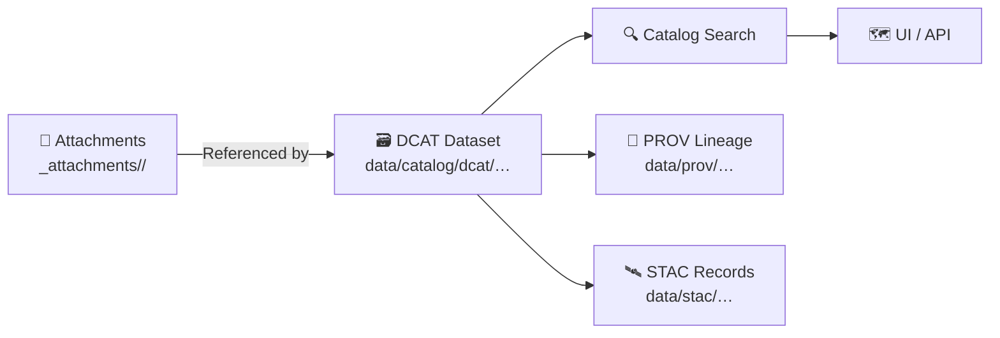

# 📎 DCAT Attachments — `<dataset_id>`


> **Purpose:** This folder contains **dataset-specific attachment files** (📄 documentation, 🧾 licenses, 🧪 validation reports, 🖼️ previews, 📦 distribution bundles, etc.) that are referenced by the **DCAT dataset record** for **`<dataset_id>`**.

---

## 🧭 At a glance

| Field | Value |
|---|---|
| 🆔 Dataset ID | `<dataset_id>` |
| 🏷️ Title | `<dataset_title>` |
| 🧩 Domain | `<domain>` (e.g., `census`, `railroads`, `treaties`, `weather`, …) |
| 🗺️ Spatial extent | `<bbox / region / CRS notes>` |
| ⏱️ Temporal extent | `<YYYY-MM-DD → YYYY-MM-DD>` |
| 🔐 Access level | `<Public / Restricted / Internal>` |
| 👥 Owner group (if restricted) | `<owner_group>` |
| 🧾 License | `<license_name + short summary>` |
| 🗓️ Last updated | `<YYYY-MM-DD>` |
| 🧑‍💻 Maintainer | `<name / handle / email>` |

---

## 🗂️ Expected relationships (catalog “boundary artifacts”)

These attachments **do not replace** canonical data + metadata; they **support** them.

| Artifact | Expected location | Why it matters |
|---|---|---|
| 🗃️ DCAT dataset entry | `data/catalog/dcat/…` | Discovery + distributions (what to download / how to cite) |
| 🛰️ STAC collection/items | `data/stac/collections/…` + `data/stac/items/…` | Spatial + temporal metadata (map-native) |
| 🧬 PROV lineage bundle | `data/prov/…` | Inputs, processing steps, agents (audit trail) |

> ✅ **Rule of thumb:** If a file lives here, it should be **(a)** referenced by DCAT and/or **(b)** explicitly explained in this README’s manifest.

---

## 📌 What belongs in `_attachments/`

### ✅ Good candidates
- 📄 **Data dictionary** / field definitions (CSV, MD, PDF)
- 🧾 **License / terms-of-use** snapshots (TXT/PDF)
- 🧪 **Validation reports** (schema checks, geometry checks, QA summaries)
- 🧷 **Schema artifacts** (JSON Schema, CSVW metadata, parquet schema dumps)
- 🖼️ **Previews** (map thumbnails, charts, small “what it looks like” images)
- 📦 **Distribution bundles** (ZIPs, export bundles) when needed for portability
- 🧰 **Helper notes** (how to open, known quirks, units, encoding, etc.)

### 🚫 Not here
- 🧱 **Raw source data** → `data/raw/<domain>/…`
- 🧪 **Intermediate artifacts** → `data/work/<domain>/…`
- ✅ **Canonical processed outputs** → `data/processed/<domain>/…`

> Attachments are **supplemental**. The canonical “served” dataset should remain in `data/processed/...`.

---

## 🧩 Folder layout (recommended)

```text
📁 data/
└─ 📁 catalog/
   └─ 📁 dcat/
      └─ 📁 _attachments/
         └─ 📁 <dataset_id>/                         📎 dataset collateral (cards, previews, appendices)
            ├─ 📄 README.md                           👈 you are here
            ├─ 🧾 manifest.csv                         ◻️ optional: attachment index (CSV) (or 🧾 manifest.json)
            ├─ 🔐 checksums.sha256                     ◻️ optional (recommended): sha256 for all files
            ├─ 📁 license/                             🧾 license + terms snapshots + permissions receipts
            ├─ 📁 docs/                                📄 dictionaries, methodology, caveats, citations
            ├─ 📁 preview/                             🖼️ small previews (png/jpg/svg) for quicklooks
            └─ 📁 dist/                                ◻️ optional: downloadable bundles (zip/tar) for distribution
```

---

## 🏷️ Naming conventions

- Prefer **lower_snake_case** and **dataset-scoped** filenames:
  - ✅ `"<dataset_id>__data_dictionary_v1.md"`
  - ✅ `"<dataset_id>__license_snapshot_YYYY-MM-DD.pdf"`
  - ✅ `"<dataset_id>__preview_map.png"`
- If you version a file, version it **explicitly** (`v1`, `v2`, or date-tagged).
- Avoid ambiguous names like `final.pdf`, `new.csv`, `stuff.zip` 😅

---

## 📦 Attachment manifest

Keep this list current. If you add a file, add a row.

| File | Type | What it is | Referenced from | Checksum (sha256) | Notes |
|---|---|---|---|---|---|
| `docs/<dataset_id>__data_dictionary_v1.md` | 📄 doc | Field meanings + units | DCAT distribution / landingPage | `<sha256>` | `<notes>` |
| `license/<dataset_id>__license_snapshot_YYYY-MM-DD.pdf` | 🧾 license | Source terms snapshot | DCAT `dct:license` or docs | `<sha256>` | `<notes>` |
| `preview/<dataset_id>__thumbnail.png` | 🖼️ image | Quick visual preview | DCAT / UI preview | `<sha256>` | `<notes>` |
| `dist/<dataset_id>__bundle_v1.zip` | 📦 bundle | Optional portable export | DCAT `dcat:downloadURL` | `<sha256>` | `<notes>` |

> Tip: if you maintain `checksums.sha256`, you can reference it here instead of repeating checksums.

---

## 🔗 How DCAT should reference these files

Typical patterns:
- 📦 **Downloadable artifacts** (ZIPs, PDFs, etc.) → DCAT `dcat:distribution` with `dcat:downloadURL`
- 🧭 **Human-readable pages** (docs, previews) → DCAT `dcat:landingPage` or `foaf:page`
- 🧾 **Licensing** → DCAT / DCTerms license fields + snapshot in `license/`

> If a file is moved or renamed, **update the DCAT record** (and PROV if it changes the published interface).

---

## 🔐 Access & governance notes (FAIR + CARE)

If the dataset or attachments are sensitive:
- Mark the dataset’s **access level** in metadata (`Public` vs `Restricted`, etc.).
- Document the **owner group** and contact route.
- Avoid placing sensitive raw extracts here unless policy explicitly allows it.

### 🧯 Safety checks (quick checklist)
- [ ] No secrets, tokens, or private keys (ever)
- [ ] No PII unless explicitly authorized and redaction policy is satisfied
- [ ] License snapshot included (or clearly linked)
- [ ] Data dictionary exists (or a strong “known limitations” doc does)
- [ ] Checksums are present for all distribution assets

---

## 🧾 Integrity & reproducibility

If an attachment is an “official” published artifact (especially in `dist/`):
- Prefer generating it **via pipeline** (not manual editing)
- Include `checksums.sha256`
- Note the **tooling + versions** used to generate the file (if applicable)

### Suggested checksum file format

```bash
# from within data/catalog/dcat/_attachments/<dataset_id>/
sha256sum $(find . -type f ! -name "checksums.sha256") > checksums.sha256
```

---

## 🔁 Update workflow (recommended)

1. 🧪 Generate/refresh artifacts (prefer pipelines where possible).
2. 📎 Add new/updated files here.
3. 🧾 Update the manifest table above (and `checksums.sha256` if applicable).
4. 🗃️ Update DCAT distribution links + metadata.
5. 🧬 Update PROV lineage to reflect any changes to the published interface.
6. ✅ Commit + open PR.

---

## ❓ FAQ

<details>
  <summary><strong>Why not store the actual dataset files in <code>_attachments/</code>?</strong></summary>

Canonical datasets should live in the standardized lifecycle folders (`data/raw/`, `data/work/`, `data/processed/`).  
Attachments are for **supporting artifacts** and **portable bundles** (when needed), not the authoritative processing chain.

</details>

<details>
  <summary><strong>What if an attachment is generated by an AI/analysis step?</strong></summary>

Treat it like a first-class artifact: document the method, include provenance details, and make sure it can be reproduced.

</details>

<details>
  <summary><strong>Can I delete old attachments?</strong></summary>

Prefer versioning instead of deletion for reproducibility, unless policy requires removal (e.g., takedown requests).

</details>

---

## 🧠 Mini-map of how attachments plug into discovery



---

## 📞 Contact

- **Maintainer:** `<name / handle>`
- **Preferred contact:** `<email / issue link / channel>`
- **Escalation / owner group:** `<owner_group>` (if restricted)

---

## 📚 Optional internal references

- `docs/…` (domain runbooks, ETL notes)
- `pipelines/…` (source-to-processed reproducibility)
- `data/prov/…` (lineage bundles)

---

*Template note:* Replace placeholders like `<dataset_id>` and `<dataset_title>` and keep this README aligned with the DCAT record for the dataset.

