# 📦 Dataset Distribution (`<dataset_id>`) — `dist/` Package

-2b6cb0)


> 🎯 **Purpose:** This folder contains the **publishable, versioned distribution artifacts** for dataset **`<dataset_id>`**.  
> These files are what the **DCAT catalog entry** should reference as `dcat:distribution` links (direct download artifacts, not raw sources).

---

## 🧠 TL;DR (If you just need the files)

1) ✅ Verify integrity: `sha256sum -c checksums.sha256`  
2) 📦 Extract the bundle (zip/tar/etc.)  
3) 🧾 Read `manifest.json` for **what’s inside**, formats, schemas, and pointers to STAC/DCAT/PROV

---

## 🧭 Where this fits in the KFM pipeline

```mermaid
flowchart LR
  A["🪨 Raw Sources"] --> B["🧪 ETL + Normalization"]
  B --> C["✅ Processed Outputs"]
  C --> D["🛰️ STAC Items + Collections"]
  C --> E["📚 DCAT Dataset Views"]
  C --> F["🧬 PROV Lineage Bundles"]
  D --> G["🧠 Graph ↔ API ↔ UI"]
  E --> G
  F --> G
```



---

## 🗂️ Folder location (repo convention)

```text
📁 data/catalog/dcat/_attachments/<dataset_id>/dist/
```

This `dist/` directory is intended to hold **distribution-ready artifacts** (bundles + integrity + manifest).  
It is **not** a staging area for raw inputs or intermediate work products.

---

## 📁 Expected contents

> Your dataset may have more than one distribution format (e.g., `.gpkg`, `.parquet`, `.geojson`, `.csv`, `.tif`).  
> If so, keep them all here, and list them in `manifest.json`.

```text
📁 dist/
├── 📄 README.md                 # you are here 🙂
├── 🧾 manifest.json             # required: distribution manifest + pointers
├── 🔐 checksums.sha256          # required: sha256 for every shipped artifact
├── 📦 <dataset_id>__<ver>__*.zip # example primary distribution bundle
├── 📦 <dataset_id>__<ver>__*.gpkg|parquet|tif|csv  # optional direct-format dist(s)
└── 🧩 sbom.spdx.json            # optional: SBOM (recommended if software included)
```

---

## 📦 What belongs in `dist/` (✅) vs what does not (🚫)

### ✅ Belongs here
- **Distribution bundles** meant for download/transfer
- **Derived, processed outputs** suitable for external users
- **Integrity artifacts**: checksums (and optional signatures)
- **Manifest** describing:
  - formats + MIME types
  - schema references
  - version + run identifiers
  - how this maps back to STAC/DCAT/PROV

### 🚫 Does NOT belong here
- Raw dumps or vendor source drops
- Intermediate “work/” artifacts
- Hand-edited outputs (regen via pipeline)
- Secrets, credentials, or any access tokens

---

## 🚀 Quickstart for consumers

### 1) Verify integrity 🔐
```bash
cd data/catalog/dcat/_attachments/<dataset_id>/dist
sha256sum -c checksums.sha256
```

### 2) Extract the distribution 📦
Examples (use the one that matches your artifact):

```bash
# ZIP
unzip "<dataset_id>__<ver>__dist.zip" -d "./_extracted"

# TAR.GZ
tar -xzf "<dataset_id>__<ver>__dist.tar.gz" -C "./_extracted"
```

### 3) Read the manifest 🧾
`manifest.json` is the **source of truth** for:
- which file is the “primary” distribution
- what each file contains
- expected schemas + field meanings
- where to find lineage and discovery metadata

---

## 🧾 `manifest.json` contract (recommended shape)

> If your pipeline generates a different manifest shape, **document it here** and keep it stable.

```json
{
  "dataset_id": "<dataset_id>",
  "title": "<human title>",
  "version": "<semver or date-tag>",
  "created_at": "<ISO-8601 UTC>",
  "git_commit": "<commit hash>",
  "pipeline_run_id": "<run id>",
  "license": "<SPDX or license id>",
  "sensitivity": "<public|internal|confidential|restricted>",
  "artifacts": [
    {
      "path": "<dataset_id>__<ver>__dist.zip",
      "role": "primary",
      "media_type": "application/zip",
      "sha256": "<hex>",
      "bytes": 123456,
      "contains": [
        {"kind": "data", "format": "parquet", "relative_path": "data/*.parquet"},
        {"kind": "docs", "format": "md", "relative_path": "docs/README.md"}
      ]
    }
  ],
  "links": {
    "dcat_record": "data/catalog/dcat/<dataset_id>.jsonld",
    "stac_collection": "data/stac/collections/<collection_id>.json",
    "stac_items": ["data/stac/items/<item_id>.json"],
    "prov_bundle": "data/prov/<prov_id>.json"
  }
}
```

---

## 🔗 Discovery & lineage linkages (DCAT ↔ STAC ↔ PROV)

KFM expects **all published datasets** to have aligned boundary artifacts:

- 📚 **DCAT** = high-level discovery record (title/description/license/keywords + distribution links)
- 🛰️ **STAC** = spatial/temporal indexing and asset pointers
- 🧬 **PROV** = end-to-end lineage (inputs → steps → outputs)

### 🔍 Helpful pointers (typical locations)
- DCAT: `data/catalog/dcat/`
- STAC: `data/stac/collections/` and `data/stac/items/`
- PROV: `data/prov/`

> ✅ If you change what’s in `dist/`, you must ensure the **DCAT distribution links** and **STAC asset links** still point to the right place, and the **PROV bundle** records the run.

---

## 🏷️ Versioning rules (dataset-level)

Recommended conventions:
- Prefer **SemVer** for stable “products” (e.g., `1.2.0`)
- Use **date tags** for periodic rebuilds when SemVer isn’t meaningful (e.g., `2026.01.29`)
- If a dataset is revised/reprocessed, publish as a **new version** and link revisions in metadata

✅ **When creating a new version**:
- generate a new `dist/` artifact set
- update DCAT/PROV to reference prior version (revision lineage)
- keep prior version accessible when possible (reproducibility + citations)

---

## 🔐 Access & sensitivity (quick legend)

Use a simple classification tag in `manifest.json` + DCAT metadata so downstream systems can enforce policy:

| Tag | Meaning | Expected handling |
|---|---|---|
| `public` | Openly shareable | Can be distributed broadly |
| `internal` | Project-only | Don’t publish externally |
| `confidential` | Sensitive | Restricted distribution, extra review |
| `restricted` | High sensitivity | Access-controlled, redaction required |

> 🧯 Governance tip: default to **fail-closed** — if classification/license/metadata is missing, treat as non-publishable until fixed.

---

## 🛠️ Rebuild notes (maintainers)

### Non-negotiables ✅
- Follow the canonical ordering: **Raw → Processed → Catalog/PROV → Database → API → UI**
- Keep pipelines deterministic + replayable (same inputs ⇒ stable outputs)
- Prefer code-driven regeneration over manual edits

### Typical rebuild flow 🧪
1. Place source data in the domain’s raw area: `data/raw/<domain>/...`
2. Run the dataset pipeline in `src/pipelines/...` to produce outputs in `data/processed/<domain>/...`
3. Generate catalogs:
   - STAC in `data/stac/...`
   - DCAT in `data/catalog/dcat/...`
   - PROV in `data/prov/...`
4. Produce `dist/` artifacts + `manifest.json` + `checksums.sha256`
5. Validate locally + in CI (schemas/profiles)

> 🧩 If the repo uses `releases/` for larger aggregated bundles, `dist/` should still remain the dataset-scoped “source” for DCAT distribution links.

---

## ✅ Maintainer checklist (PR-ready)

- [ ] `manifest.json` updated and reflects every artifact shipped
- [ ] `checksums.sha256` includes **all** artifacts in `dist/`
- [ ] DCAT record references distributions correctly
- [ ] STAC assets point to stable data locations
- [ ] PROV bundle references run config + inputs + outputs
- [ ] `license` present + correct
- [ ] `sensitivity` present + correct
- [ ] CI validators pass (schemas/profiles)
- [ ] Citation guidance present (see repo `CITATION.cff` if applicable)

---

## 📚 Project standards & helpful reading

- 📘 Master guide: `docs/MASTER_GUIDE_v13.md`
- 🧷 Standards profiles:
  - `docs/standards/KFM_DCAT_PROFILE.md`
  - `docs/standards/KFM_STAC_PROFILE.md`
  - `docs/standards/KFM_PROV_PROFILE.md`
- 🧾 Schemas (machine validation): `schemas/`
- 🧰 Tooling & validators: `tools/`
- 📦 Repo-level releases: `releases/`

---

## 🆘 Support

If anything in this `dist/` package looks wrong (missing files, checksum mismatch, unclear schema):
- open an issue with:
  - dataset id: `<dataset_id>`
  - version: `<ver>`
  - failing file: `<path>`
  - checksum output / error logs

👤 Maintainer: **`<name or team>`**  
📫 Contact: **`<email or link>`**

---
