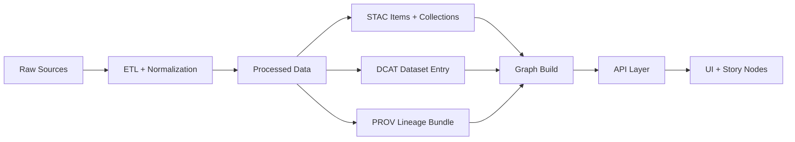

<!--
📄 File: data/catalog/dcat/_attachments/<dataset_id>/docs/README.md
🧭 Purpose: Human-friendly docs + supporting assets for this dataset, meant to be linked from the dataset’s DCAT/STAC metadata.
-->

# 📚 Dataset Documentation — `<dataset_id>`

   

> [!NOTE]
> This folder is for **human-readable** documentation and small supporting assets (figures, schemas, examples) that complement the dataset’s **machine-readable** metadata (DCAT/STAC) and **lineage** (PROV).  
> <!-- DCAT + STAC + PROV are core “published metadata” artifacts in KFM.  [oai_citation:0‡Kansas Frontier Matrix (KFM) – Comprehensive Technical Blueprint.pdf](sediment://file_000000006dbc71f89a5094ce310a452d) [oai_citation:1‡MARKDOWN_GUIDE_v13.md.gdoc](file-service://file-UYVruFXfueR8veHMUKeugU) -->

---

## 🔗 Quick links (fill these in)

- 🧾 **DCAT record:** `/data/catalog/dcat/<dataset_id>.(jsonld|ttl)`  
- 🗺️ **STAC item(s)/collection:** `/data/stac/items/...` and/or `/data/stac/collections/...`  
- 🧬 **PROV bundle:** `/data/prov/<dataset_id>.*`  
- 📦 **Canonical processed asset(s):** `/data/<domain>/processed/...` *(or `/data/processed/<domain>/...` depending on repo layout)*  
- 📘 **Domain runbook:** `/docs/data/<domain>/README.md`  

<!-- Catalog outputs + canonical homes (STAC/DCAT/PROV) are required boundary artifacts in the pipeline.  [oai_citation:2‡MARKDOWN_GUIDE_v13.md.gdoc](file-service://file-UYVruFXfueR8veHMUKeugU) [oai_citation:3‡MARKDOWN_GUIDE_v13.md.gdoc](file-service://file-UYVruFXfueR8veHMUKeugU) -->

---

## 🧾 Dataset at a glance

| Field | Value |
|---|---|
| Dataset ID | `<dataset_id>` |
| Title | `<dataset_title>` |
| Domain | `<domain>` |
| Version | `<vX.Y.Z or YYYY-MM-DD>` |
| Status | `draft / active / deprecated` |
| License | `<license>` |
| Source / Provider | `<source org + link or citation>` |
| Spatial coverage | `<bbox / region / admin area>` |
| Temporal coverage | `<start_date> → <end_date>` |
| Primary formats | `<GeoJSON / CSV / GeoTIFF / Parquet / …>` |
| Contact / Steward | `<name or team + contact>` |

> [!TIP]
> Keep this table in sync with the DCAT/STAC metadata so humans and machines agree on the dataset’s “identity card.”  
> <!-- DCAT provides high-level dataset entry (title/description/distributions/etc.).  [oai_citation:4‡Kansas Frontier Matrix (KFM) – Comprehensive Technical Blueprint.pdf](sediment://file_000000006dbc71f89a5094ce310a452d) -->

---

## 🗂️ What lives in this folder

Recommended structure (add/remove as needed):

```text
📁 data/catalog/dcat/_attachments/<dataset_id>/
└── 📁 docs/
    ├── 📄 README.md              👈 you are here
    ├── 📁 figures/               🖼️ small diagrams/screenshots used in docs
    ├── 📁 schema/                🧩 data dictionary, JSON Schema, DDL, etc.
    ├── 📁 examples/              🧪 tiny sample files (non-sensitive)
    └── 📄 CHANGELOG.md           🗓️ optional: dataset-specific changelog
```

**Keep here ✅**
- Short docs that explain **what the dataset is**, **how it was made**, and **how to use it**
- Lightweight schemas/data dictionaries
- Small figures/screenshots used by this documentation
- Small example snippets (non-sensitive)

**Do NOT keep here ❌**
- Large binaries / full dataset exports  
- Secrets, tokens, private keys, credentials
- Sensitive or restricted raw data (unless your governance rules explicitly allow it)

> [!NOTE]
> Large files should live with the canonical data assets (and may use LFS or external pointers/checksums when necessary).  
> <!-- Large binaries may use Git LFS / pointers; processed assets tracked in Git for identity & audit.  [oai_citation:5‡Kansas Frontier Matrix (KFM) – Comprehensive Technical Blueprint.pdf](sediment://file_000000006dbc71f89a5094ce310a452d) -->

---

## 🧭 How this fits the KFM pipeline



- KFM follows a **non-negotiable ordering**: **ETL → STAC/DCAT/PROV → Graph → APIs → UI → Story Nodes → Focus Mode**.  
  <!-- Canonical pipeline ordering requirement.  [oai_citation:6‡MARKDOWN_GUIDE_v13.md.gdoc](file-service://file-UYVruFXfueR8veHMUKeugU) -->
- STAC/DCAT/PROV are treated as **“boundary artifacts” required before data is considered published**.  
  <!-- Boundary artifacts requirement.  [oai_citation:7‡MARKDOWN_GUIDE_v13.md.gdoc](file-service://file-UYVruFXfueR8veHMUKeugU) -->

---

## 📘 Dataset overview (write for humans)

### What is this dataset?
- **One-liner:** `<what it is in 1 sentence>`
- **Why it exists:** `<what problem it solves / what question it supports>`
- **Primary use cases:**  
  - `<use case 1>`  
  - `<use case 2>`

### What’s included (and not included)
| In scope ✅ | Out of scope ❌ |
|---|---|
| `<thing included>` | `<thing excluded>` |
| `<thing included>` | `<thing excluded>` |

### Coordinate reference / units (if applicable)
- **CRS / projection:** `<EPSG:XXXX or description>`
- **Units:** `<meters / feet / USD / …>`
- **Resolution / granularity:** `<e.g., 30m raster, county-level table, point events…>`

---

## 🧩 Schema & field dictionary

> [!TIP]
> If someone can’t tell what a field means (or its units) from this section, the dataset isn’t “review-ready” yet.

- **Schema location:** `./schema/<...>` *(add files as needed)*
- **Data dictionary:** link a table or a `schema/data_dictionary.md`

Example table (replace with real fields):

| Field | Type | Units | Description | Allowed values |
|---|---:|---|---|---|
| `id` | string | n/a | Unique record identifier | any |
| `date` | date | n/a | Observation date | ISO 8601 |
| `value` | number | `<unit>` | Measurement value | `>= 0` |

---

## ✅ Definition of done (checklist)

- [ ] Dataset has a **DCAT** record in `/data/catalog/dcat/`
- [ ] Dataset has **STAC** item(s)/collection(s) in `/data/stac/`
- [ ] Dataset has a **PROV** bundle in `/data/prov/`
- [ ] This doc explains **purpose, scope, provenance, and schema**
- [ ] Links in “Quick links” resolve correctly
- [ ] CI passes (schemas/metadata/provenance checks)

<!-- STAC/DCAT/PROV required + CI validates and rejects missing items.  [oai_citation:8‡MARKDOWN_GUIDE_v13.md.gdoc](file-service://file-UYVruFXfueR8veHMUKeugU) [oai_citation:9‡MARKDOWN_GUIDE_v13.md.gdoc](file-service://file-UYVruFXfueR8veHMUKeugU) -->

---

## 🔗 Referencing these docs from the DCAT record

If the catalog UI expects documentation as a distribution, add a **documentation distribution** (or equivalent) in the dataset’s DCAT entry that points to files in this folder.

Example (illustrative JSON-LD shape — adapt to the project’s DCAT profile):

```json
{
  "@type": "dcat:Dataset",
  "dct:identifier": "<dataset_id>",
  "dcat:distribution": [
    {
      "@type": "dcat:Distribution",
      "dct:title": "Dataset documentation (README)",
      "dct:format": "text/markdown",
      "dcat:downloadURL": "/data/catalog/dcat/_attachments/<dataset_id>/docs/README.md"
    }
  ]
}
```

> [!NOTE]
> Prefer **links over duplication**: DCAT should link to canonical assets and (when applicable) STAC/PROV records.  
> <!-- Cross-layer linkage expectation (DCAT → STAC or data resources).  [oai_citation:10‡MARKDOWN_GUIDE_v13.md.gdoc](file-service://file-UYVruFXfueR8veHMUKeugU) -->

---

## 🧬 Provenance & versioning

### Provenance summary
- **Inputs:** `<raw sources + citations/URLs>`
- **Processing:** `<pipeline name + config + key steps>`
- **Agents:** `<who ran it / what toolchain>`

### Versioning rules of thumb
- If you publish a new version, **link it to the previous version** in DCAT and PROV (e.g., `prov:wasRevisionOf`) and update this documentation + changelog accordingly.  
  <!-- Versioning expectations + prov:wasRevisionOf guidance.  [oai_citation:11‡MARKDOWN_GUIDE_v13.md.gdoc](file-service://file-UYVruFXfueR8veHMUKeugU) -->

---

## 🛡️ Governance, sensitivity, and ethics

- **Sensitivity level:** `<public / internal / restricted>`  
- **Redactions/generalizations applied:** `<yes/no + description>`
- **Known risks / misinterpretation hazards:** `<brief list>`
- **CARE/sovereignty considerations (if applicable):** `<who is impacted + how consent/rights are handled>`

> [!IMPORTANT]
> If this dataset touches sensitive topics or communities, ensure the governance rules are followed and auditability is preserved.  
> <!-- Governance + validation gates are enforced in CI; missing provenance/broken links can fail builds.  [oai_citation:12‡MARKDOWN_GUIDE_v13.md.gdoc](file-service://file-UYVruFXfueR8veHMUKeugU) -->

---

## 🗓️ Changelog (recommended)

| Date | Version | Change | Author |
|---|---|---|---|
| `<YYYY-MM-DD>` | `<vX.Y.Z>` | `<what changed>` | `<name>` |

---

## 🙌 Credits & citation

- **Created by:** `<person/team>`
- **Upstream sources:** `<citations>`
- **How to cite this dataset:** `<DOI/URL or repo citation guidance>`

> [!TIP]
> If the repo uses `CITATION.cff`, keep dataset-level citations aligned with it.  
> <!-- Repo-level citation + versioning noted in the KFM structure expectations.  [oai_citation:13‡Kansas Frontier Matrix (KFM) – Comprehensive Technical Blueprint.pdf](sediment://file_000000006dbc71f89a5094ce310a452d) -->

---

## 📎 Appendix (optional)

<details>
<summary><strong>📌 Known issues / limitations</strong></summary>

- `<limitation 1>`
- `<limitation 2>`

</details>

<details>
<summary><strong>🧪 Validation steps (repeatable)</strong></summary>

- `<command or script>`
- `<expected output / checks>`

</details>
