# 📄 License & Rights — `<dataset_id>`


> ✅ This folder makes the dataset’s licensing **explicit, reviewable, and portable**.
>
> ⚠️ Not legal advice. If anything here conflicts with upstream source terms, the upstream terms win.

---

## 🚦 Governance gate (why this exists)

KFM treats licensing as part of **publish-time metadata**:
- datasets **should not be merged/published** without a known license and rights statement
- licenses and restrictions must be **traceable** to upstream sources (see PROV lineage)

If you’re adding or updating this dataset, fill in the **License summary** and ensure the DCAT/STAC metadata matches.

---

## 🧭 Scope

This README applies to:
- the dataset identified as `<dataset_id>` in the KFM catalog
- all distributions/assets that the `<dataset_id>` DCAT record points to (processed files, STAC items, API endpoints)
- any extra attachments stored under `data/catalog/dcat/_attachments/<dataset_id>/`

This README does **not** replace:
- the repository-wide software license at `/LICENSE` (code)
- any upstream license files or source terms stored under `data/raw/...`

---

## 🗂️ Where the canonical license lives

**Source of truth (machine-readable):**
- `data/catalog/dcat/<dataset_id>.*` → `dcterms:license` + `dcat:distribution` (DCAT discovery record)
- `data/stac/**` → `license` (STAC Item/Collection)

**Human-readable supporting docs (this folder):**
- `data/catalog/dcat/_attachments/<dataset_id>/license/` (this directory)

> If something conflicts: treat **DCAT + STAC metadata** and the **upstream source terms** as authoritative.

```mermaid
flowchart LR
  Upstream[📥 Upstream sources<br/>terms + license] --> Raw[📁 data/raw/...]
  Raw --> ETL[⚙️ Pipeline ETL]
  ETL --> Processed[📦 data/processed/...]
  Processed --> STAC[🧭 STAC]
  Processed --> DCAT[📚 DCAT]
  DCAT --> Attach[📎 _attachments/<dataset_id>/license]
  STAC --> UI[🗺️ API/UI discovery]
  DCAT --> UI
```



---

## ✅ License summary (fill these in)

| Field | Value |
|---|---|
| Dataset ID | `<dataset_id>` |
| Dataset title | `TO_FILL` |
| SPDX identifier | `TO_FILL (e.g., CC-BY-4.0)` |
| License name | `TO_FILL` |
| License URL | `TO_FILL` |
| Rights / usage statement | `TO_FILL` |
| Attribution required? | `Yes / No (TO_FILL)` |
| Commercial use allowed? | `Yes / No / Conditional (TO_FILL)` |
| Derivatives allowed? | `Yes / No / Share-alike (TO_FILL)` |
| Redistribution allowed? | `Yes / No / Conditional (TO_FILL)` |
| Sensitive / restricted? | `public / restricted / confidential (TO_FILL)` |

### 📌 One-line blurb (for UI/search)

> `TO_FILL: A single sentence that clearly states the license and any key restrictions.`

---

## 🧾 Files expected in this folder

Recommended contents (add/remove as needed):

```
📁 data/catalog/dcat/_attachments/<dataset_id>/license/
├── 📄 README.md                 👈 you are here
├── 📄 LICENSE.txt               (optional) full license text, if needed
├── 📄 NOTICE.md                 (optional) attribution + required notices
├── 📄 THIRD_PARTY_NOTICES.md    (optional) if multiple upstream sources/licenses
└── 📄 LICENSE_MANIFEST.json     (optional) machine-readable per-file license map
```

<details>
<summary>📦 Example: <code>LICENSE_MANIFEST.json</code> (optional)</summary>

```json
{
  "dataset_id": "<dataset_id>",
  "default_license": "TO_FILL",
  "items": [
    {
      "path": "data/processed/<domain>/<file>",
      "license": "TO_FILL",
      "source": "TO_FILL",
      "notes": "TO_FILL"
    }
  ]
}
```
</details>

### LICENSE.txt vs linking out 🌐
- If the license is a well-known standard (e.g., Creative Commons), linking to the official URL is usually sufficient.
- If the license is **custom**, **source-specific**, or **ambiguous**, include a copy (when permitted) or an excerpt + a link to the source terms.

---

## 🏷️ Attribution & citation

If the license requires attribution, put the exact required wording here.

**Required attribution (copy/paste):**
- **Source:** `TO_FILL`
- **Author/Publisher:** `TO_FILL`
- **URL:** `TO_FILL`
- **Accessed:** `YYYY-MM-DD`
- **Modifications:** `Describe changes (or "None")`

**Suggested dataset citation (KFM style):**
- `TO_FILL (author/org). "<dataset title>." Kansas Frontier Matrix, version <v>, <year>.`

> Tip: Keep this aligned with any repo-level `CITATION.cff` / domain runbook.

---

## 🧩 Third-party materials inside the dataset

If `<dataset_id>` combines or redistributes third-party assets, list each one here.

| Component / file pattern | Origin | License | Notes / obligations |
|---|---|---|---|
| `TO_FILL` | `TO_FILL` | `TO_FILL` | `TO_FILL` |

### 🔒 “No relicensing” rule of thumb
If an upstream component is more restrictive, the combined dataset **cannot** be treated as more permissive than that component. Prefer:
- splitting distributions by license, or
- excluding the restrictive parts from the open distribution, or
- marking the dataset as restricted and gating access.

---

## 🧠 Data sovereignty & access controls

Licensing does **not** override governance. Even if a source license is permissive, KFM may still restrict access when:
- the data contains sensitive locations,
- the data involves Indigenous/community-held knowledge,
- privacy or safety policies apply, or
- the dataset inherits restrictions from upstream inputs.

**Sovereignty / sensitivity tags (if any):**
- `TO_FILL (e.g., CARE: Authority to Control, sensitivity: restricted)`

**Approved release level:**
- `TO_FILL (public/restricted/confidential + rationale)`

---

## 🔄 How to update this folder (maintainers checklist)

- [ ] Confirm upstream source terms and keep a link or snapshot.
- [ ] Set `dcterms:license` (DCAT) for `<dataset_id>`.
- [ ] Ensure STAC Items/Collections include `license` (and match DCAT where applicable).
- [ ] Add/refresh `NOTICE.md` + `THIRD_PARTY_NOTICES.md` if needed.
- [ ] If any restrictions apply, ensure governance tags/controls are set (and documented above).
- [ ] If the license changed, add an entry in the **License decision log** below.

---

## 🗒️ License decision log

| Date | Change | By | Why | Links |
|---|---|---|---|---|
| `YYYY-MM-DD` | `Initial import` | `@handle` | `TO_FILL` | `DCAT/STAC/PROV refs` |

---

## ❓ Quick FAQ

**Q: Is this the same license as the repo’s `/LICENSE`?**  
A: Usually not. `/LICENSE` covers the *software/code*. This folder covers the *dataset/data assets*.

**Q: What if I don’t know the license?**  
A: Don’t publish it as public. Track down the terms, or mark the dataset restricted until resolved.

**Q: Where should license info show up in the system?**  
A: In DCAT (discovery), STAC (asset-level metadata), and PROV (lineage). This folder is the human-friendly backup.
