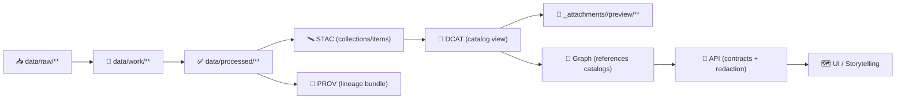

# 📸 Dataset Preview Assets — `<dataset_id>`


> 🧠 **What this is:** lightweight, derived “preview” media used by the catalog UI (cards, dataset pages, story embeds).  
> ✅ **What this is *not*:** authoritative data. Canonical assets live in `data/processed/**` and must be described by STAC/DCAT/PROV.

---

## 🗂️ Folder Location

```text
📁 data/
  📁 catalog/
    📁 dcat/
      📁 _attachments/
        📁 <dataset_id>/
          📁 preview/
            📄 README.md   👈 you are here
            🖼️ thumbnail.webp
            🖼️ quicklook.webp
            🧾 preview.manifest.json
            📄 preview.html
            📄 stats.json
```

### 🧭 Quick Links (fill in / adjust as needed)
- 📄 **DCAT record:** `data/catalog/dcat/<dataset_id>.*`
- 🛰️ **STAC Collection:** `data/stac/collections/<dataset_id>.json`
- 🧾 **PROV bundle:** `data/prov/<dataset_id>.*`
- 🧱 **Canonical data:** `data/processed/**`

---

## 🎯 Purpose

Preview assets exist to:
- 🔎 make discovery fast (thumbnails, quicklooks)
- 🧭 communicate “what is this dataset?” visually
- 🧩 support narrative embeds without shipping large data
- 🧾 provide **human-friendly** summaries that point back to catalogs

> ⚠️ Treat previews as *browsing aids*, not analysis inputs.

---

## 📦 What Goes Here ✅

Preview-only, small-ish, derived artifacts like:
- 🖼️ **Thumbnail** for dataset cards
- 🖼️ **Quicklook** for dataset detail pages
- 🗺️ **Static map preview** (optional) for spatial datasets
- 🧾 **stats.json** (optional): high-level counts / ranges / coverage
- 🧩 **preview.manifest.json** (optional): index of preview assets for UI tooling
- 📄 **preview.html** (optional): rich “one-pager” for humans

---

## 🚫 What Does *NOT* Go Here ❌

- 🧱 **Raw** data (`data/raw/**`)  
- 🔧 **Work/intermediate** outputs (`data/work/**`)  
- 🧪 **Canonical processed** assets (`data/processed/**`)  
- 🗃️ Full-resolution “analysis” exports disguised as previews  
- 🔐 Anything that would violate sensitivity / access constraints

---

## 🧱 Where This Sits in the KFM Pipeline



---

## ✅ Recommended Preview Artifacts

> Use stable filenames whenever possible so UI + docs can link reliably. 🔗

| Goal | Suggested filename | Format | Notes |
|---|---|---|---|
| Card thumbnail | `thumbnail.webp` | `webp` (or `png`) | Tiny + fast (e.g., 256–512px wide) 🐇 |
| Detail quicklook | `quicklook.webp` | `webp` (or `png`) | Bigger (e.g., 1200–2000px wide) 🔍 |
| Map preview | `map_preview.webp` | `webp/png` | Optional static cartography 🗺️ |
| Summary stats | `stats.json` | `json` | Counts, min/max, bbox, time range, etc. 📈 |
| UI manifest | `preview.manifest.json` | `json` | Helps automation discover assets 🤖 |
| Human one-pager | `preview.html` | `html` | Optional—keep it lightweight 🧾 |

---

## 🔗 Link It Up (Traceability Rules)

### 1) 📄 DCAT should point to previews (and to the real thing)
- Add preview assets as **extra distributions** *or* “related resources” in the DCAT entry.
- DCAT is the “discovery layer” — it should point users to **STAC** and/or canonical downloads.

### 2) 🛰️ STAC can optionally reference preview media
- Keep at least one asset that points to the **canonical** file(s) in `data/processed/**`.
- If useful, add preview images as STAC `assets` (commonly as `thumbnail` / `overview` style roles).

### 3) 🧾 PROV should record how previews were generated (when automated)
If previews are produced by a pipeline step:
- record the activity (tooling + parameters + timestamp)
- link generated previews as derived entities from the canonical outputs

### 4) 🧠 Graph should reference catalogs, not store bulky media
If the graph layer needs a preview, store only the reference (IDs/URLs), not the file payload.

---

## 🎨 Cartography & Accessibility Cheatsheet (for `map_preview.*`)

- 🧩 **Concept before Compilation:** one clear purpose per preview (avoid “kitchen sink” maps)
- 🧭 **Hierarchy with Harmony:** highlight the main signal; keep context subtle
- ✂️ **Simplicity from Sacrifice:** remove layers/labels that don’t serve the preview
- 🧑‍🦯 **Accessible color:** prefer colorblind-friendly schemes; avoid relying on color alone
- 🏷️ **Minimal text:** fewer labels; consider labeling only key features

> Tip: if the dataset is sensitive, consider **generalizing**, **masking**, or **aggregating** in the preview. 🔐

---

## 🧾 Metadata, Rights, and Privacy Notes

- 🧾 Metadata is *data about data*: keep authoritative metadata in STAC/DCAT/PROV, not just in screenshots.
- 🧑‍⚖️ If you use third-party basemaps/symbology, make sure the preview respects licensing/attribution.
- 🕵️ Digital location data can create privacy risks—avoid previews that reveal restricted sites or personal locations.

---

## ✅ Update Checklist (PR-Friendly)

- [ ] Preview files are **derived** (not canonical) ✅
- [ ] No sensitive details leaked (or previews are appropriately generalized) 🔐
- [ ] Filenames follow stable conventions (`thumbnail.*`, `quicklook.*`, etc.) 🧷
- [ ] DCAT entry links to previews (and to STAC/canonical data) 🔗
- [ ] STAC assets still point to canonical `data/processed/**` files 🛰️
- [ ] PROV updated if previews are generated by pipeline automation 🧾
- [ ] Rights/attribution reviewed for any basemap/symbology used 🧑‍⚖️

---

## 🧩 Optional: `preview.manifest.json` Pattern

> If your UI tooling benefits from a manifest, use something like this:

```json
{
  "dataset_id": "<dataset_id>",
  "generated_at": "YYYY-MM-DD",
  "assets": {
    "thumbnail": "thumbnail.webp",
    "quicklook": "quicklook.webp",
    "map_preview": "map_preview.webp",
    "stats": "stats.json",
    "html": "preview.html"
  }
}
```

---

## 🧰 Optional: Generation Notes (Examples)

<details>
<summary><b>🛠️ Example approach (keep it lightweight)</b></summary>

- 🖼️ Raster: generate a downsampled quicklook + thumbnail  
- 🧬 Vector: render a simplified map preview and/or summarize counts  
- 📦 Keep previews small enough to load instantly in docs + UI

</details>

---

### 🧡 Reminder

Previews are *for humans* — the truth lives in:
- ✅ `data/processed/**` (canonical data)
- 🛰️ `data/stac/**` (geospatial indexing + assets)
- 📄 `data/catalog/dcat/**` (catalog discovery)
- 🧾 `data/prov/**` (lineage)
