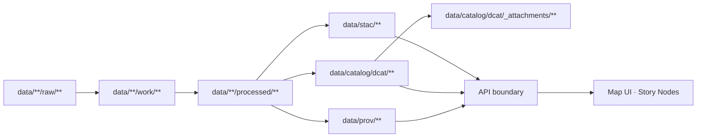

# 📎 DCAT Attachments (`_attachments/`)


Welcome to the **DCAT attachments shelf** 🧷 — a place for **small, stable, human-usable** files that are **referenced by DCAT dataset records** in `data/catalog/dcat/`.

> [!IMPORTANT]
> **This is not a data dump.** Primary datasets belong in `data/**/processed/**` (or other canonical data locations) and must be described by **STAC + DCAT + PROV**.

---

## 🎯 Purpose

Use `_attachments/` for assets that make a dataset easier to **discover, cite, and interpret**, such as:

- 📄 dataset cards (Markdown/PDF)
- 🖼️ previews / quicklooks / thumbnails
- 🧾 codebooks, dictionaries, schemas (human-facing)
- 🧪 QA / validation reports
- 🔐 checksums & manifests

These are typically linked from `dcat:distribution` entries (or equivalent) inside DCAT JSON-LD.

---

## 🧭 How this fits the KFM pipeline



> [!NOTE]
> Think of `_attachments/` as **catalog-adjacent “packaging”**: it supports *discovery* and *interpretation*, not core storage.

---

## ✅ / ❌ Quick rules

| ✅ Good fits here | ❌ Not here |
|---|---|
| Dataset card (`.md`, `.pdf`) | Raw sources (`raw/`) |
| Methodology / provenance summary (`.pdf`) | Intermediate work outputs (`work/`) |
| Quicklook images (`.png`, `.jpg`, `.webp`) | Full processed datasets (GeoTIFF/Parquet/etc.) |
| Codebooks / dictionaries (`.csv`, `.md`) | Huge binaries that bloat Git history |
| Checksums (`.sha256`) | Secrets, keys, PII, restricted materials |

> [!WARNING]
> If you can’t clearly answer **“what license covers this file?”**, don’t commit it. 🧯

---

## 🗂️ Recommended directory layout

Group attachments by **dataset id/slug** to avoid collisions and keep things crawlable:

```text
data/catalog/dcat/_attachments/
├── README.md
├── <dataset_id>/
│   ├── <dataset_id>__card__v1.md
│   ├── <dataset_id>__quicklook__v1.png
│   ├── <dataset_id>__methodology__v1.pdf
│   └── <dataset_id>__checksums__v1.sha256
└── <dataset_id_v2>/
    └── ...
```

### 🏷️ Naming conventions (recommended)

- ✅ lowercase
- ✅ `kebab-case`
- ✅ versioned filenames (avoid overwriting)
- ✅ “type tags” in name: `card`, `quicklook`, `methodology`, `codebook`, `qa-report`, `checksums`

Examples:

- `railroads-1880/railroads-1880__card__v1.md`
- `railroads-1880/railroads-1880__qa-report__v2026-01-29.pdf`
- `treaties-1854/treaties-1854__codebook__v2.csv`

> [!TIP]
> Prefer **new files** for updates (`v2`, `v2026-01-29`) instead of replacing `v1`.
> Old citations should stay valid ✅

---

## 🔗 Referencing attachments from DCAT (JSON-LD)

Attachments should be exposed via `dcat:distribution` so catalog consumers can fetch them like any other distribution.

```json
{
  "@type": "dcat:Dataset",
  "dct:title": "Example Dataset",
  "dcat:distribution": [
    {
      "@type": "dcat:Distribution",
      "dct:title": "Dataset Card (Markdown)",
      "dcat:mediaType": "text/markdown",
      "dcat:downloadURL": "data/catalog/dcat/_attachments/example-dataset/example-dataset__card__v1.md"
    },
    {
      "@type": "dcat:Distribution",
      "dct:title": "Methodology (PDF)",
      "dcat:mediaType": "application/pdf",
      "dcat:downloadURL": "data/catalog/dcat/_attachments/example-dataset/example-dataset__methodology__v1.pdf"
    },
    {
      "@type": "dcat:Distribution",
      "dct:title": "Quicklook",
      "dcat:mediaType": "image/png",
      "dcat:downloadURL": "data/catalog/dcat/_attachments/example-dataset/example-dataset__quicklook__v1.png"
    }
  ]
}
```

### 🌐 Local paths vs deployed URLs

- ✅ **Repo/local tooling:** relative paths are fine.
- 🌍 **Deployment:** a publish step may rewrite to absolute URLs (recommended), e.g. API-hosted routes or object storage URLs.

---

## 🧾 Provenance expectations

Attachments are **still artifacts** and should be traceable:

- 🤖 If pipeline-generated: record the activity + inputs + outputs in `data/prov/**`
- 🧑‍🏫 If curated/manual: treat authoring as an activity and still link it in PROV (agent + timestamp + source references)

> [!IMPORTANT]
> KFM governance is “fail closed” by default: if a dataset looks undocumented, it should be treated as *not publish-ready*.

---

## 🛡️ Governance & safety guardrails

- 🔐 **No secrets** (keys, tokens, credentials) — ever
- 🧑‍⚖️ Respect **license + attribution** for every file
- 🧭 Respect **classification / sensitivity**:
  - If the attachment must be restricted, store it outside the public repo and reference it via controlled `accessURL`
- 🧼 Keep it clean: attachments are scanned and validated like other artifacts

---

## ✅ Add-an-attachment checklist

1. 📎 Place files under `_attachments/<dataset_id>/`
2. 🧩 Update the dataset’s DCAT record in `data/catalog/dcat/` to reference them
3. 🧬 Ensure PROV captures the creation/update context in `data/prov/`
4. 🔍 Confirm paths resolve (no broken links)
5. 🔁 Open PR — CI should validate schemas + governance rules

---

## 📚 Related in-repo references

- 📄 DCAT profile: [`docs/standards/KFM_DCAT_PROFILE.md`](../../../../docs/standards/KFM_DCAT_PROFILE.md)
- 📄 STAC profile: [`docs/standards/KFM_STAC_PROFILE.md`](../../../../docs/standards/KFM_STAC_PROFILE.md)
- 📄 PROV profile: [`docs/standards/KFM_PROV_PROFILE.md`](../../../../docs/standards/KFM_PROV_PROFILE.md)
- 🧩 DCAT schemas: [`schemas/dcat/`](../../../../schemas/dcat/)
- 🧰 Pipelines: [`src/pipelines/`](../../../../src/pipelines/)

---

## 🧠 FAQ

### “Why not store the full dataset here?”
Because `_attachments/` is for **catalog-side supporting materials**. Full datasets belong in the canonical data layout and should be indexed via STAC/DCAT/PROV. This keeps the repository maintainable and the catalog semantically clean.

### “Where do Story Node images go?”
Story Node assets belong with the story content (e.g., `docs/reports/story_nodes/**/assets/`) 🧵  
Only put an image here if it’s a **dataset distribution asset** (e.g., quicklook referenced from DCAT).

### “What if attachments get large?”
If you’re collecting many or large artifacts, consider:
- 📦 `releases/` for versioned bundles, and/or
- ☁️ object storage with stable URLs + checksums  
…and keep `_attachments/` as the lightweight “always available” essentials.

