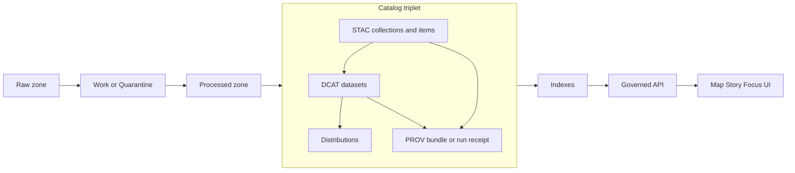

<!-- [KFM_META_BLOCK_V2]
doc_id: kfm://doc/93b6ef22-5816-41dd-bb52-ddd680a881c6
title: DCAT Datasets Catalog
type: standard
version: v1
status: draft
owners: TBD (Data Stewardship)
created: 2026-02-24
updated: 2026-02-24
policy_label: public
related:
  - ../../../../docs/standards/KFM_DCAT_PROFILE.md
  - ../../../../schemas/dcat/
  - ../../../stac/
  - ../../../prov/
  - ../../../processed/
tags: [kfm, dcat, catalog, metadata, datasets]
notes:
  - DCAT dataset + distribution records for promoted dataset versions (discovery + license + distribution surface).
  - Part of the KFM catalog triplet: DCAT (dataset), STAC (assets), PROV (lineage).
[/KFM_META_BLOCK_V2] -->

# DCAT Datasets

Dataset-level metadata records (**DCAT JSON-LD**) for every **promoted dataset version**.

 <!-- TODO: wire to repo governance -->


**Status:** Draft  
**Owners:** TBD (Data Stewardship)  
**Directory:** `data/catalog/dcat/datasets/`

**Quick links:**  
[Purpose](#purpose) · [What lives here](#what-lives-here) · [Contract](#contract) · [Naming and versioning](#naming-and-versioning) · [Required fields](#required-fields) · [Cross-links](#cross-links) · [Validation and gates](#validation-and-gates) · [How to add a record](#how-to-add-a-record) · [Examples](#examples) · [Troubleshooting](#troubleshooting)

---

## Purpose

This directory exists to make KFM datasets:

- **Findable:** searchable discovery metadata (title, description, themes, coverage)
- **Governable:** explicit license/rights + policy label
- **Interoperable:** DCAT records can be exported/harvested into catalog systems
- **Traceable:** each dataset record links to **PROV** (how it was created) and to **distributions** (what artifacts exist)

> NOTE: In KFM, catalogs are not “nice metadata.” They are contract surfaces between pipelines and runtime.
> The UI and API should rely on these records to render dataset cards, resolve evidence, and enforce policy.

[Back to top](#dcat-datasets)

---

## Where this fits in the repo

DCAT is one part of the “catalog triplet”:

- **DCAT** (this directory): dataset-level description + distributions
- **STAC** (`data/stac/`): asset-level spatiotemporal metadata
- **PROV** (`data/prov/`): lineage for runs, tools, inputs, outputs



[Back to top](#dcat-datasets)

---

## What lives here

### Acceptable inputs

- **DCAT dataset records** in **JSON-LD** (`*.jsonld`) representing a **single dataset version** (recommended).
- Embedded **dcat:Distribution** objects describing each published artifact (e.g., GeoParquet, PMTiles, COG, CSV).
- Links/identifiers that enable deterministic navigation to:
  - related STAC collection/item(s)
  - the generating PROV activity/run receipt
  - artifact digests for integrity

### Exclusions

- ❌ Raw source files  
- ❌ Work / intermediate artifacts  
- ❌ Processed artifacts themselves (those live in `../../../processed/`)  
- ❌ Secrets, credentials, access tokens  
- ❌ Unreviewed “draft” datasets (those must remain in Work/Quarantine until promotion)

> WARNING: Do not “quietly fix” a promoted DCAT record by hand.
> Treat promoted catalog artifacts as governed outputs: changes must be reviewable and traceable.

[Back to top](#dcat-datasets)

---

## Directory structure

This repo may choose different layouts; the **recommended** (version-addressable) pattern is:

```
data/catalog/dcat/datasets/
  README.md
  <dataset_slug>@<dataset_version_id>.jsonld
  <dataset_slug>@<dataset_version_id>.attachments/   # optional (human docs, checks)
```

If the repo chooses “one file per dataset family” or a monolithic catalog file, update this README and ensure the evidence resolver can still resolve dataset versions deterministically.

[Back to top](#dcat-datasets)

---

## Contract

Each record here represents “What is this dataset version, and what distributions exist?”

At minimum, KFM expects DCAT to answer:

- What is this dataset?
- Who published it?
- What is the license or rights?
- What distributions exist and where are the artifacts?

This contract enables:

- dataset discovery endpoints
- export/harvest to external catalogs
- evidence resolution without guessing

[Back to top](#dcat-datasets)

---

## Naming and versioning

### Recommended identifiers

- **Dataset slug**: stable, human-readable identifier (kebab_case or snake_case)
- **Dataset version id**: deterministic version string (e.g., time-bucket + hash or semver + hash)

### Recommended file naming

Use the evidence-friendly form:

- `<dataset_slug>@<dataset_version_id>.jsonld`

This aligns with “scheme-like” identifiers (example: `dcat://<dataset>@<version>`).

> TODO: If the repo standardizes on a different naming convention, document it here and in the DCAT profile.

[Back to top](#dcat-datasets)

---

## Required fields

KFM uses profiles to make validation strict and predictable. The *proposed minimum* dataset fields typically include:

| Field | Why it matters |
|---|---|
| `dct:title` | human discovery |
| `dct:description` | human discovery + scope |
| `dct:publisher` | accountability |
| `dct:license` or `dct:rights` | legal + export posture |
| `dcat:theme` | faceted search / controlled vocab |
| `dct:spatial` | coverage (policy-consistent) |
| `dct:temporal` | coverage |
| `dcat:distribution` | artifact inventory |
| `prov:wasGeneratedBy` | lineage pointer |
| `kfm:policy_label` | policy enforcement input |
| `kfm:dataset_id` | stable dataset identity |
| `kfm:dataset_version_id` | stable version identity |

> NOTE: “Required” here means “required by the KFM profile/validators.”  
> See `../../../../docs/standards/KFM_DCAT_PROFILE.md` and `../../../../schemas/dcat/`.

[Back to top](#dcat-datasets)

---

## Cross-links

Cross-links must be deterministic and testable. Common expectations:

- DCAT dataset → distributions → digests → processed artifact paths
- DCAT dataset → `prov:wasGeneratedBy` → PROV bundle or run receipt
- STAC collection `rel="describedby"` → DCAT dataset identifier
- STAC item → links to PROV and/or DCAT distribution

> TIP: Think of these as “foreign keys” across catalogs. If links don’t resolve, promotion should fail.

[Back to top](#dcat-datasets)

---

## Validation and gates

This directory is a **promotion boundary**. A dataset version should not be considered “published” unless:

- [ ] Processed artifacts exist and are checksummed
- [ ] DCAT record validates against the DCAT profile/schema
- [ ] STAC validates against the STAC profile/schema
- [ ] PROV validates against the PROV profile/schema
- [ ] Cross-links resolve (DCAT ↔ STAC ↔ PROV; distributions ↔ artifacts)
- [ ] Policy label assigned; obligations applied (if any)
- [ ] License/rights are explicit (unknown rights should block promotion)

> TODO: Replace the placeholder commands below with the repo’s actual validators.
>
> Example placeholders:
> - `python tools/validation/validate_dcat.py data/catalog/dcat/datasets/<file>.jsonld`
> - `node tools/validation/link_check_catalogs.js --dataset <dataset_version_id>`

[Back to top](#dcat-datasets)

---

## How to add a record

1. Ensure the dataset version has publishable artifacts in `../../../processed/`.
2. Ensure the pipeline run emitted PROV/run receipt in `../../../prov/`.
3. Generate a DCAT JSON-LD dataset record with:
   - dataset identity + version id
   - license/rights
   - policy label
   - distributions for each artifact (download URL/path + media type + digest)
   - link to the generating PROV activity
4. Validate schema + cross-links.
5. Commit the DCAT record alongside the dataset version promotion PR.

> NOTE: If a dataset is sensitive or rights are unclear, do not “work around” policy in DCAT.
> Instead, keep it unpromoted or quarantine it until governance resolves.

[Back to top](#dcat-datasets)

---

## Examples

### Minimal JSON-LD skeleton

```json
{
  "@context": {
    "dcat": "http://www.w3.org/ns/dcat#",
    "dct": "http://purl.org/dc/terms/",
    "prov": "http://www.w3.org/ns/prov#",
    "kfm": "https://kansasfrontiermatrix.example/ns#"
  },
  "@type": "dcat:Dataset",
  "@id": "dcat://example_dataset@2026-02.abcd1234",
  "dct:title": "Example Dataset — 2026-02.abcd1234",
  "dct:description": "Short description of what this dataset version contains.",
  "dct:publisher": { "@id": "kfm://org/TODO" },
  "dct:license": { "@id": "spdx://CC-BY-4.0" },
  "dcat:theme": [{ "@id": "kfm://theme/TODO" }],
  "dct:spatial": { "@id": "kfm://spatial/TODO" },
  "dct:temporal": { "@id": "kfm://temporal/TODO" },
  "kfm:policy_label": "public",
  "kfm:dataset_id": "example_dataset",
  "kfm:dataset_version_id": "2026-02.abcd1234",
  "dcat:distribution": [
    {
      "@type": "dcat:Distribution",
      "dct:title": "GeoParquet distribution",
      "dcat:mediaType": "application/x-parquet",
      "dcat:downloadURL": "processed/example/events.parquet",
      "kfm:digest": "sha256:TODO"
    }
  ],
  "prov:wasGeneratedBy": { "@id": "prov://kfm://run/TODO" }
}
```

[Back to top](#dcat-datasets)

---

## Troubleshooting

- **Schema fails:** confirm the DCAT profile version and required fields match `schemas/dcat/`.
- **Links fail:** verify relative/absolute paths and EvidenceRef identifiers are consistent across DCAT/STAC/PROV.
- **Rights unclear:** do not promote; route through governance and quarantine until resolved.
- **Noisy diffs:** prefer canonical JSON formatting and stable ordering for deterministic reviews.

[Back to top](#dcat-datasets)

---

## References

- `../../../../docs/standards/KFM_DCAT_PROFILE.md`  
- `../../../../schemas/dcat/`  
- `../../../stac/`  
- `../../../prov/`  
- `../../../processed/`
