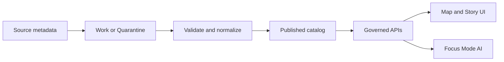

<!-- [KFM_META_BLOCK_V2]
doc_id: kfm://doc/7a0c6cfe-2eaa-4b1f-9d34-b0e2f7dd2b06
title: DCAT Distributions
type: standard
version: v1
status: draft
owners: TODO:kfm-owners
created: 2026-02-24
updated: 2026-02-24
policy_label: public
related:
  - data/catalog/dcat/README.md
  - data/catalog/dcat/datasets/README.md
  - data/catalog/dcat/services/README.md
tags: [kfm, dcat, catalog, distribution]
notes:
  - Directory contract for describing how datasets are accessed (files, APIs, services) using DCAT Distributions.
[/KFM_META_BLOCK_V2] -->

# DCAT Distributions
**One-line purpose:** Store and govern **DCAT `dcat:Distribution`** metadata that describes *how a dataset can be accessed* (downloadable files, APIs, and services).


**Owners:** `TODO:kfm-owners`  
**Last updated:** 2026-02-24

---

## Quick navigation
- [What belongs here](#what-belongs-here)
- [What must NOT go here](#what-must-not-go-here)
- [Where this fits](#where-this-fits)
- [Directory layout](#directory-layout)
- [Distribution types](#distribution-types)
- [Required fields and governance rules](#required-fields-and-governance-rules)
- [Templates](#templates)
- [Validation and promotion gates](#validation-and-promotion-gates)
- [Definition of Done](#definition-of-done)
- [Troubleshooting](#troubleshooting)
- [References](#references)

---

## What belongs here
**This directory contains distribution-level metadata only** (the “ways to access” a dataset).

Typical distributions include:
- A **directly downloadable file** (e.g., GeoPackage, GeoJSON, CSV, Parquet).
- An **API endpoint** (e.g., REST, GraphQL).
- A **Data Service** endpoint (e.g., OGC API Features / WMS / WMTS) referenced via distribution.
- A **landing page** when download is indirect (documentation + access instructions).

**Each distribution SHOULD:**
- Be linkable from a dataset entry (e.g., via `dcat:distribution`).
- Be immutable for a given artifact/version; create a new distribution record for a new artifact version (see [Validation and promotion gates](#validation-and-promotion-gates)).

---

## What must NOT go here
**Do not store:**
- Actual data files/blobs (rasters, vectors, dumps).  
- Credentials, API keys, bearer tokens, signed URLs, or any secret material.
- Unreviewed external links that bypass governance (e.g., raw object-store URLs for restricted data).
- Personally identifying information (PII) or sensitive location details.

> WARNING  
> If a dataset is **restricted**, the distribution **must not** expose a `downloadURL` or direct storage URL that bypasses the policy boundary. Prefer a governed `accessURL` that enforces authz/audit.

---

## Where this fits
This folder is part of the governed catalog layer:



**Trust membrane invariant:** clients/UI do not fetch from storage directly; they resolve access via governed APIs or approved public distribution URLs.

---

## Directory layout
> NOTE  
> The exact structure may be refined by repo conventions. Treat the tree below as the **target** layout unless the repo already defines a different one.

```text
data/catalog/dcat/distributions/
  README.md

  templates/
    distribution.template.jsonld
    distribution.template.ttl

  # One of these patterns is expected:
  #
  # Pattern A (group by dataset):
  #   <dataset_id>/
  #     <distribution_id>.jsonld
  #     <distribution_id>.ttl
  #
  # Pattern B (flat):
  #   <distribution_id>.jsonld
  #   <distribution_id>.ttl
```

**File formats (recommended):**
- `*.jsonld` (primary, easiest for app pipelines)
- `*.ttl` (optional, for RDF-native workflows)

---

## Distribution types
A `dcat:Distribution` can represent multiple access patterns. Use the smallest shape that conveys the access path correctly.

| Type | When to use | Typical fields |
|---|---|---|
| Direct download | A user or agent can fetch the file directly | `dcat:downloadURL`, `dcat:mediaType`, `dcat:byteSize`, `spdx:checksum` |
| Access via page | A page describes access steps, or requires interaction | `dcat:accessURL` (to instructions/portal), optionally `dcat:downloadURL` if a direct file also exists |
| API endpoint | Machine access via a specific endpoint | `dcat:accessURL`, `dcat:accessService`, `dct:conformsTo`, `dcat:mediaType` |
| Service-backed representation | Distribution available through a described data service | `dcat:accessService` + `dcat:accessURL` aligned to the service endpoint |

---

## Required fields and governance rules
### Minimum metadata (baseline)
These are the minimum fields we expect on any distribution record to support discovery + policy enforcement.

| Field | Level | Notes |
|---|---:|---|
| `@id` / identifier | MUST | Stable, unique identifier (prefer URI). |
| `@type: dcat:Distribution` | MUST | DCAT distribution class. |
| `dct:title` | SHOULD | Human-friendly name (“GeoJSON download”, “Tiles API”). |
| `dct:description` | SHOULD | What this distribution is and who it is for. |
| `dcat:accessURL` OR `dcat:downloadURL` | MUST | At least one access path. (Some profiles require `accessURL` always.) |
| `dcat:mediaType` OR `dct:format` | SHOULD | Prefer `dcat:mediaType` for MIME; add `dct:format` when using controlled vocabularies. |
| `dct:license` | MUST | Link to license or policy. |
| `dct:issued` / `dct:modified` | SHOULD | Release and update dates. |
| `dct:accessRights` (or equivalent) | SHOULD | Especially important for restricted distributions. |
| `spdx:checksum` | SHOULD | Strongly recommended for downloadable artifacts. |
| `dcat:byteSize` | SHOULD | For downloads; supports UX + integrity expectations. |

### Governance rules (hard)
- **No secrets** in any URL fields.
- **Restricted data**: use `accessURL` pointing to a governed endpoint (authz + audit), not raw storage.
- **Public data**: direct `downloadURL` is permitted only if it meets publishing policy (license, integrity, provenance).
- **Checksum**: when a distribution is a concrete file artifact, provide a SHA-256 checksum.

---

## Templates
### JSON-LD template (recommended)
```json
{
  "@context": {
    "dcat": "http://www.w3.org/ns/dcat#",
    "dct": "http://purl.org/dc/terms/",
    "spdx": "http://spdx.org/rdf/terms#",
    "xsd": "http://www.w3.org/2001/XMLSchema#"
  },
  "@id": "kfm://distribution/TODO-uuid-or-slug",
  "@type": "dcat:Distribution",

  "dct:title": "TODO: distribution title",
  "dct:description": "TODO: what this distribution provides",

  "dcat:accessURL": "https://TODO.example/api/or/landing-page",
  "dcat:downloadURL": "https://TODO.example/direct-download-if-applicable",

  "dcat:mediaType": "text/csv",
  "dcat:byteSize": { "@value": 0, "@type": "xsd:nonNegativeInteger" },

  "dct:license": "https://TODO.example/license",
  "dct:issued": { "@value": "2026-02-24", "@type": "xsd:date" },
  "dct:modified": { "@value": "2026-02-24", "@type": "xsd:date" },

  "spdx:checksum": {
    "@type": "spdx:Checksum",
    "spdx:algorithm": "spdx:checksumAlgorithm_sha256",
    "spdx:checksumValue": "TODO-lowercase-hex-sha256"
  }
}
```

### Turtle template (optional)
```turtle
@prefix dcat: <http://www.w3.org/ns/dcat#> .
@prefix dct:  <http://purl.org/dc/terms/> .
@prefix spdx: <http://spdx.org/rdf/terms#> .
@prefix xsd:  <http://www.w3.org/2001/XMLSchema#> .

<kfm://distribution/TODO-uuid-or-slug>
  a dcat:Distribution ;
  dct:title "TODO: distribution title"@en ;
  dct:description "TODO: what this distribution provides"@en ;

  dcat:accessURL <https://TODO.example/api/or/landing-page> ;
  dcat:downloadURL <https://TODO.example/direct-download-if-applicable> ;
  dcat:mediaType "text/csv" ;

  dct:license <https://TODO.example/license> ;
  dct:issued "2026-02-24"^^xsd:date ;
  dct:modified "2026-02-24"^^xsd:date ;

  spdx:checksum [
    a spdx:Checksum ;
    spdx:algorithm spdx:checksumAlgorithm_sha256 ;
    spdx:checksumValue "TODO-lowercase-hex-sha256"
  ] .
```

---

## Validation and promotion gates
> NOTE  
> These are system-level governance gates. If your repo already defines gates and tooling, treat the list below as the **desired minimum** and reconcile with the existing CI.

### Lifecycle zones for metadata
- **Raw**: captured/harvested distribution metadata (may be incomplete)
- **Work or Quarantine**: normalized + awaiting validation
- **Processed**: validated, enriched (e.g., checksums/byteSize added), provenance linked
- **Published**: eligible for indexing + exposure through governed APIs/UI

### Minimum promotion gates (fail closed)
- [ ] Identity: stable `@id` and `@type`
- [ ] Access path: `accessURL` and/or `downloadURL` present and policy-compliant
- [ ] License: `dct:license` present
- [ ] Format: `mediaType` and/or `format` present
- [ ] Integrity: if it’s a file artifact → `spdx:checksum` present (SHA-256 preferred)
- [ ] Provenance: linked to dataset and catalog records (exact mechanism depends on repo)
- [ ] Audit: an auditable record exists for the change (who/what/when/why)

---

## Definition of Done
A distribution record is “done” when:
- [ ] It is referenced from the dataset record (`dcat:distribution`)
- [ ] It passes schema/shape validation for the chosen DCAT profile
- [ ] It complies with policy (no secrets, no restricted bypass URLs)
- [ ] It includes license + format info
- [ ] It includes checksum + byteSize for downloadable artifacts
- [ ] It is promotable to Published with an audit trail

---

## Troubleshooting
**“Do we need both `accessURL` and `downloadURL`?”**  
Use `downloadURL` for direct file downloads. Provide `accessURL` when a user/agent needs a page or API entry point; some profiles require `accessURL` even when direct download exists.

**“Should `accessURL` point to storage?”**  
Only if the data is public and the storage endpoint is approved for publishing. Otherwise, use a governed endpoint that enforces authz/audit.

**“Where do service endpoints live?”**  
If the repo models services explicitly (e.g., `dcat:DataService`), keep service definitions in the service directory and link them here using `dcat:accessService`.

---

## References
- W3C DCAT v3: https://www.w3.org/TR/vocab-dcat-3/
- W3C DCAT v2 (legacy): https://www.w3.org/TR/vocab-dcat-2/
- SEMIC guidance on `accessURL` vs `downloadURL`: https://interoperable-europe.ec.europa.eu/collection/semic-support-centre/solution/dcat-application-profile-implementation-guidelines/release-7
- DCAT-AP (example profile reference): https://semiceu.github.io/DCAT-AP/releases/
- SPDX (checksum model): https://spdx.dev/
