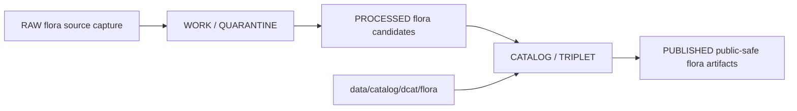

<!-- [KFM_META_BLOCK_V2]
doc_id: kfm://doc/data-catalog-dcat-flora-readme
title: data/catalog/dcat/flora/README.md — Flora DCAT Catalog Sublane README
version: v0.1
type: readme; data-lifecycle-sublane; dcat-domain-catalog-guide
status: draft; PROPOSED; data-root; catalog-stage; dcat; flora; release-gated; sensitivity-aware
owners: OWNER_TBD — Flora steward · Data steward · Catalog steward · DCAT steward · Evidence steward · Policy steward · Release steward · Schema steward · Docs steward
created: NEEDS VERIFICATION — blank placeholder existed before v0.1 expansion
updated: 2026-06-24
policy_label: public-doc; data; catalog; dcat; flora; lifecycle; release-gated; sensitivity-aware
tags: [kfm, data, catalog, dcat, flora, DCATv3, CATALOG, STAC, PROV, EvidenceBundle, SourceDescriptor, ReleaseManifest, CatalogBuildReceipt, geoprivacy]
related:
  - ../README.md
  - ../../README.md
  - ../../../../docs/domains/flora/DATA_LIFECYCLE.md
  - ../../../../docs/domains/flora/SENSITIVITY.md
  - ../../../../docs/standards/DCAT.md
  - ../../../../docs/adr/ADR-0022-catalog-matrix--stac-+-dcat-+-prov-must-agree.md
  - ../../../../docs/doctrine/lifecycle-law.md
  - ../../../../contracts/domains/flora/
  - ../../../../schemas/contracts/v1/domains/flora/
  - ../../../../policy/domains/flora/
  - ../../../../release/
notes:
  - "This file replaces a blank placeholder at `data/catalog/dcat/flora/README.md`."
  - "Flora DATA_LIFECYCLE identifies `data/catalog/dcat/flora/` as a PROPOSED catalog path shape."
  - "Flora rare-plant and join-sensitive records require deny/default or redaction/generalization handling before public release."
  - "DCAT records are catalog carriers and do not replace SourceDescriptor, EvidenceBundle, RunReceipt, PolicyDecision, or ReleaseManifest."
  - "Rollback target for this replacement is previous blank blob SHA `8b137891791fe96927ad78e64b0aad7bded08bdc`."
[/KFM_META_BLOCK_V2] -->

# data/catalog/dcat/flora

> Flora-specific DCAT catalog sublane for governed `dcat:Dataset` and `dcat:Distribution` records inside the `CATALOG / TRIPLET` lifecycle stage.

  
  
  
  
  
  

**Status:** draft / PROPOSED  
**Owners:** OWNER_TBD — Flora steward · Data steward · Catalog steward · DCAT steward · Evidence steward · Policy steward · Release steward · Schema steward · Docs steward  
**Path:** `data/catalog/dcat/flora/README.md`  
**Owning root:** `data/catalog/dcat/`  
**Domain segment:** `flora`  
**Lifecycle stage:** `CATALOG / TRIPLET`  
**Exposure posture:** RELEASED ONLY  
**Truth posture:** CONFIRMED target was blank · CONFIRMED parent DCAT lane is a CATALOG-stage sublane · CONFIRMED Flora lifecycle docs list `data/catalog/dcat/flora/` as a PROPOSED catalog path · CONFIRMED Flora lifecycle docs mark rare-plant sensitivity as deny-default · NEEDS VERIFICATION for concrete DCAT records, schemas, validators, policy gates, receipts, ReleaseManifest linkage, and public route behavior.

**Quick jumps:** [Purpose](#purpose) · [Lifecycle boundary](#lifecycle-boundary) · [Repo fit](#repo-fit) · [Accepted contents](#accepted-contents) · [Exclusions](#exclusions) · [Flora DCAT requirements](#flora-dcat-requirements) · [Sensitivity guardrails](#sensitivity-guardrails) · [Evidence ledger](#evidence-ledger) · [Validation checklist](#validation-checklist) · [Rollback](#rollback)

---

## Purpose

`data/catalog/dcat/flora/` stores or stages Flora-specific DCAT catalog records for plant-related datasets and distributions.

Likely Flora DCAT records include dataset-level metadata for plant taxa, specimen/occurrence datasets, vegetation-community datasets, invasive-plant datasets, phenology datasets, restoration-context datasets, and rights/sensitivity-aware distribution pointers.

A Flora DCAT record supports discovery and interoperability. It does **not** make a Flora claim true, public, policy-admitted, evidence-supported, or released by itself.

## Lifecycle boundary

`data/catalog/dcat/flora/` is a CATALOG-stage sublane. Public exposure applies only to records tied to an approved release, governed route, and policy-safe representation.

## Repo fit

| Responsibility | Correct home | Rule |
|---|---|---|
| Flora DCAT catalog records | `data/catalog/dcat/flora/` | This lane. |
| Parent DCAT catalog lane | `data/catalog/dcat/` | W3C DCAT v3 catalog sublane. |
| Flora STAC records | `data/catalog/stac/flora/` | Spatiotemporal Flora catalog records. |
| Flora PROV records | `data/catalog/prov/flora/` | Flora provenance catalog projection. |
| Flora domain catalog records | `data/catalog/domain/flora/` | Domain-specific catalog records. |
| Flora graph/triplet projections | `data/triplets/graph_deltas/flora/`, `data/triplets/exports/flora/` | Paired graph stage. |
| Flora proof/evidence | `data/proofs/` or accepted proof roots | EvidenceBundle and ProofPack. |
| Flora receipts | `data/receipts/` or accepted receipt roots | CatalogBuildReceipt, RunReceipt, validation receipts. |
| Flora release decisions | `release/` | Publication authority. |
| Flora schemas and policy | `schemas/contracts/v1/domains/flora/`, `policy/domains/flora/` | Separate roots; paths remain PROPOSED until verified. |

## Accepted contents

| Content | Purpose |
|---|---|
| `dcat:Dataset` records for Flora datasets | Dataset-level catalog metadata. |
| `dcat:Distribution` records | Distribution metadata and references. |
| Release-linked Flora DCAT records | DCAT records tied to ReleaseManifest references. |
| Evidence and source pointers | References to EvidenceBundle, SourceDescriptor, receipts, and validation reports. |
| Policy and sensitivity pointers | References to policy posture, redaction/generalization, rights, consent, and sensitivity state. |
| DCAT validation summaries | Pointers to validation reports and catalog build receipts. |

## Exclusions

| Do not put here | Correct home |
|---|---|
| Flora RAW source files | `data/raw/flora/` |
| Flora WORK/intermediate data | `data/work/flora/` |
| Flora quarantined data | `data/quarantine/flora/` |
| Flora processed datasets | `data/processed/flora/` |
| Flora STAC records | `data/catalog/stac/flora/` |
| Flora PROV records | `data/catalog/prov/flora/` |
| Flora graph/triplet edges | `data/triplets/.../flora/` |
| Flora EvidenceBundle/proof records | `data/proofs/` or accepted proof roots |
| Flora receipts | `data/receipts/` or accepted receipt roots |
| Release decisions | `release/` |
| Published Flora products | `data/published/.../flora/` |
| Flora schemas | `schemas/contracts/v1/domains/flora/` |
| Flora policy rules | `policy/domains/flora/` |
| Validators/tests/code | `tools/validators/`, `tests/`, implementation roots |

## Flora DCAT requirements

PROPOSED until schema and validator are verified:

| Requirement | Meaning |
|---|---|
| Stable Flora dataset identifier | Identifier must match the artifact identity used by catalog closure. |
| Distribution digest | Checksum must match the released artifact or referenced bundle digest. |
| Release reference | Public or release-linked records must point to the immutable ReleaseManifest. |
| Evidence reference | EvidenceBundle/proof context must be referenced when claims depend on evidence. |
| Source reference | SourceDescriptor/source catalog must be referenced when source authority matters. |
| Policy reference | Policy/admissibility posture must be available when release or sensitivity depends on it. |
| Closure compatibility | Flora STAC ↔ DCAT ↔ PROV agreement must hold for promoted releases. |
| Sensitivity representation | Rare-plant, culturally sensitive, join-sensitive, and rights-restricted details must use policy-approved representation. |

## Sensitivity guardrails

- Flora DCAT records are catalog carriers, not Flora source truth.
- Rare-plant exact geometry must not be exposed through DCAT fields or distributions unless policy and release evidence explicitly allow the representation.
- DCAT metadata should point to redacted/generalized public-safe outputs when exact source data is restricted.
- Flora source-role, rights, taxonomic reconciliation, and temporal freshness remain separate governance concerns.
- Watchers and source-head checks may propose candidates; they do not publish DCAT records.
- Unreleased Flora DCAT records are not public merely because they exist under this directory.

## Evidence ledger

| Source | Status | Supports | Limits |
|---|---|---|---|
| `data/catalog/dcat/flora/README.md` previous file | CONFIRMED | Target existed as a blank placeholder. | Did not define lane boundaries. |
| `data/catalog/dcat/README.md` | CONFIRMED | Parent DCAT catalog sublane and authority boundaries. | Does not prove Flora record inventory. |
| `docs/domains/flora/DATA_LIFECYCLE.md` | CONFIRMED doctrine / PROPOSED lane application | Flora lifecycle, catalog paths, sensitivity posture, watcher limits. | Many exact paths and implementation details remain NEEDS VERIFICATION. |
| Uploaded Markdown authoring prompt | CONFIRMED instruction context | README minimums, repo fit, exclusions, verification, rollback, evidence labels. | Does not prove repository implementation. |

## Validation checklist

- [ ] Confirm actual child files and DCAT record inventory under this lane.
- [ ] Confirm Flora DCAT schema/profile location.
- [ ] Confirm Flora DCAT validator and CI checks.
- [ ] Confirm Flora STAC/DCAT/PROV catalog matrix closure.
- [ ] Confirm ReleaseManifest linkage for public Flora DCAT records.
- [ ] Confirm EvidenceBundle, SourceDescriptor, RunReceipt, and PolicyDecision references.
- [ ] Confirm rare-plant, culturally sensitive, join-sensitive, rights, and publication handling.
- [ ] Confirm withdrawal/supersession behavior for stale or failed Flora DCAT records.

## Rollback

Rollback is required if this lane becomes a Flora source-data root, proof store, release-decision root, published-output root, schema root, policy root, validator root, implementation root, or public exposure shortcut.

Rollback target for this replacement: previous blank blob SHA `8b137891791fe96927ad78e64b0aad7bded08bdc`.

<a href="#top">Back to top</a>

