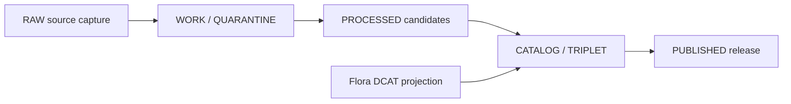

<!-- [KFM_META_BLOCK_V2]
doc_id: kfm://doc/data-catalog-dcat-flora-readme
title: data/catalog/dcat/flora/README.md — Flora DCAT Catalog Sublane README
version: v0.2
type: readme; data-lifecycle-sublane; dcat-domain-catalog-guide
status: draft; PROPOSED profile; CONFIRMED path; data-root; catalog-stage; dcat; flora; release-gated; sensitivity-aware
owners: OWNER_TBD — Flora steward · Data steward · Catalog steward · DCAT steward · Evidence steward · Policy steward · Release steward · Schema steward · Docs steward
created: NEEDS VERIFICATION — placeholder lineage predates v0.1
updated: 2026-07-22
policy_label: public-doc; data; catalog; dcat; flora; lifecycle; release-gated; sensitivity-aware
tags: [kfm, data, catalog, dcat, flora, DCATv3, CATALOG, STAC, PROV, EvidenceBundle, SourceDescriptor, ReleaseManifest, CatalogBuildReceipt, geoprivacy]
related:
  - ../README.md
  - ../../README.md
  - ../../stac/flora/README.md
  - ../../prov/flora/README.md
  - ../../domain/flora/README.md
  - ../../../../docs/domains/flora/DATA_LIFECYCLE.md
  - ../../../../docs/domains/flora/SENSITIVITY.md
  - ../../../../docs/standards/DCAT.md
  - ../../../../docs/adr/ADR-0022-catalog-matrix--stac-+-dcat-+-prov-must-agree.md
  - ../../../../docs/doctrine/directory-rules.md
  - ../../../../schemas/contracts/v1/domains/flora/README.md
  - ../../../../policy/domains/flora/README.md
  - ../../../receipts/generated/README.md
notes:
  - "Evidence snapshot: repository main at commit 459b41d7ec91240742d8b2d3e5d9eb4dbd248df7 (2026-07-22)."
  - "This revision updates the prior v0.1 guide; it does not create DCAT records, schemas, validators, releases, or public routes."
  - "ADR-0022 is proposed, not accepted; catalog-matrix closure is therefore a proposed promotion requirement until adopted and implemented."
  - "Flora DCAT records are catalog carriers, never substitutes for source, evidence, policy, review, proof, or release authority."
[/KFM_META_BLOCK_V2] -->

# Flora DCAT catalog sublane

> Governed `dcat:Dataset` and `dcat:Distribution` projections for Flora at the `CATALOG / TRIPLET` lifecycle stage. Nothing in this directory is public merely because it is catalogued.

**Path:** `data/catalog/dcat/flora/README.md`  
**Lane:** `data/catalog/dcat/` → `flora/`  
**Lifecycle boundary:** `CATALOG / TRIPLET`  
**Exposure posture:** release-gated; public clients consume governed release surfaces only  
**Document status:** draft; the path and parent lane are CONFIRMED, while the Flora-specific DCAT profile and its implementation are PROPOSED  
**Evidence snapshot:** `main@459b41d7ec91240742d8b2d3e5d9eb4dbd248df7`

**Quick jumps:** [Purpose](#purpose) · [Status and truth boundary](#status-and-truth-boundary) · [Lifecycle boundary](#lifecycle-boundary) · [Repo fit](#repo-fit) · [Accepted contents](#accepted-contents) · [Exclusions](#exclusions) · [Flora DCAT requirements](#flora-dcat-requirements) · [Sensitivity guardrails](#sensitivity-guardrails) · [Promotion and correction](#promotion-and-correction) · [Evidence ledger](#evidence-ledger) · [Validation checklist](#validation-checklist) · [Rollback](#rollback)

---

## Purpose

Use this sublane for Flora-specific DCAT catalog projections that make governed datasets discoverable without collapsing their source, evidence, policy, review, or release state.

Candidate subject families include plant identity and taxonomy, specimen or occurrence observations, vegetation communities, invasive plants, phenology, restoration context, and public-safe distributions derived from those materials. This list is a PROPOSED scope guide, not a confirmed payload inventory.

A DCAT record may describe a dataset or distribution. It does **not** by itself:

- establish botanical, taxonomic, temporal, geographic, or legal truth;
- admit a source or replace its `SourceDescriptor`;
- supply an `EvidenceBundle`, proof, policy decision, or human review;
- authorize exact rare-plant geometry or other sensitive joins;
- prove STAC ↔ DCAT ↔ PROV closure; or
- create a `ReleaseManifest`, public API response, map layer, tile, or published artifact.

## Status and truth boundary

| Statement | Label | Repository-grounded meaning |
|---|---|---|
| This path and its parent DCAT lane exist. | CONFIRMED | The target and `data/catalog/dcat/README.md` were read at the evidence snapshot. |
| Flora has sibling STAC, PROV, and domain-catalog README lanes. | CONFIRMED | The four documentation paths exist; their presence does not prove record closure. |
| The repository targets DCAT v3. | CONFIRMED draft doctrine | `docs/standards/DCAT.md` is present and marked draft. |
| Each promoted release should close STAC, DCAT, and PROV through a Catalog Matrix. | PROPOSED | ADR-0022 is explicitly `proposed`; no accepted decision was located for this rule. |
| Flora catalog outputs are release-gated and sensitivity-aware. | CONFIRMED doctrine / implementation NEEDS VERIFICATION | Flora lifecycle and sensitivity documents state this posture, but runtime enforcement was not established. |
| Concrete DCAT payloads, a Flora DCAT profile schema, validators, contexts, build receipts, and release links exist. | NEEDS VERIFICATION | A bounded repository review did not establish those implementations. Absence is not asserted. |

Use these labels in changes to this lane. Do not promote a PROPOSED field, path, vocabulary, or gate to CONFIRMED merely by copying it into a DCAT record.

## Lifecycle boundary

This directory belongs to the catalog stage. Promotion into or through the lane is a governed state transition, not a file copy. Public exposure requires the approved representation and the repository's release controls; a catalog record that lacks those links remains non-public.

## Repo fit

| Responsibility | Correct home | Boundary |
|---|---|---|
| Flora DCAT records | `data/catalog/dcat/flora/` | This lane; dataset and distribution discovery projections. |
| Parent DCAT conventions | `data/catalog/dcat/` | Cross-domain DCAT lane guidance. |
| Flora STAC projections | `data/catalog/stac/flora/` | Spatial and spatiotemporal catalog representation. |
| Flora PROV projections | `data/catalog/prov/flora/` | Provenance catalog representation. |
| Flora domain catalog | `data/catalog/domain/flora/` | Domain-specific catalog view; not a replacement for DCAT. |
| Source admission and source roles | `data/registry/sources/flora/` and governing contracts | Source authority stays outside catalog payloads. Exact role vocabulary is NEEDS VERIFICATION against current authority. |
| Evidence and proofs | `data/proofs/` and accepted proof roots | EvidenceBundle and proof material remain separate. |
| Generated work and run receipts | `data/receipts/` | Receipts document generation or execution; they do not authorize release. |
| Schemas and contracts | `schemas/contracts/v1/domains/flora/`, `contracts/domains/flora/` | Machine and semantic contracts; a Flora DCAT profile schema was not established in this review. |
| Policy | `policy/domains/flora/` | Admissibility and disclosure policy; the current lane is a minimal scaffold. |
| Release authority | `release/` | ReleaseManifest, approval, supersession, withdrawal, and rollback state. |
| Published artifacts | `data/published/` and governed public surfaces | Only approved public-safe representations. |

The proposed Catalog Matrix is a closure object, not a substitute directory for STAC, DCAT, PROV, receipts, proofs, or release manifests. A Flora-specific matrix index was not established at the snapshot.

## Accepted contents

Subject to an adopted profile and verified validators, this lane may contain:

| Content | Minimum posture |
|---|---|
| `dcat:Dataset` projections | Stable identity; title and description; publisher or steward context; temporal and subject scope; source/evidence pointers where required. |
| `dcat:Distribution` projections | Stable identity; access or download semantics; media/format metadata; digest and rights/sensitivity posture appropriate to the representation. |
| Release-linked catalog projections | Immutable artifact and `ReleaseManifest` references; validation and review state; supersession/withdrawal information. |
| Public-safe generalized distributions | Explicitly derived from policy-approved generalization or redaction; never an implicit copy of restricted geometry. |
| Validation summaries and references | Pointers to schema/profile, catalog-build receipt, and closure result; not unstructured claims of validation. |

Filenames, JSON-LD contexts, KFM extension IRIs, exact required fields, and record packaging remain PROPOSED or NEEDS VERIFICATION until the relevant schema and validator are accepted.

## Exclusions

| Do not put here | Correct home |
|---|---|
| RAW source files or live upstream payloads | `data/raw/flora/` or governed source intake |
| Working, quarantined, or processed datasets | `data/work/flora/`, `data/quarantine/flora/`, `data/processed/flora/` |
| Source authority or source-admission decisions | Source registry and governing contract/policy lanes |
| Flora STAC or PROV records | Their sibling catalog lanes |
| Graph edges or triplet exports | `data/triplets/` |
| EvidenceBundle, ProofPack, or proof payloads | Accepted proof/evidence roots |
| Run, catalog-build, validation, or generation receipts | `data/receipts/` |
| Policy rules, schemas, validators, or implementation code | `policy/`, `schemas/`, `tools/`, `src/`, and `tests/` as governed |
| Release decisions or manifests | `release/` |
| Public API responses, tiles, map layers, or published products | Governed API, tile, and publication roots |

## Flora DCAT requirements

The following is the minimum review contract for a proposed Flora DCAT record. It does not replace a machine schema.

| Concern | Required review evidence | Failure posture |
|---|---|---|
| Identity | Stable dataset/distribution identifier linked to the described artifact. | Reject or quarantine ambiguous identity. |
| Artifact integrity | Digest for each referenced immutable artifact or bundle. | Do not promote on missing or mismatched digest. |
| Source posture | Reference to admitted source metadata and the governing source role; do not embed a competing role vocabulary. | Hold for source reconciliation. |
| Evidence | Evidence/proof reference for material claims and derivation lineage. | ABSTAIN from unsupported claims; block promotion where required. |
| Rights and policy | Rights, consent, admissibility, and policy-decision references appropriate to the representation. | DENY or withhold when unresolved. |
| Sensitivity | Explicit treatment of rare-plant, cultural, join, land-access, and other disclosure risks. | Generalize, redact, aggregate, withhold, or DENY. |
| Validation | Profile/schema and validator result tied to the exact record digest. | Keep out of a release until validation passes. |
| Catalog closure | STAC, DCAT, and PROV identities/digests agree when ADR-0022 or successor policy applies. | Do not claim closure; implementation remains PROPOSED. |
| Release | Immutable ReleaseManifest and review linkage for any public projection. | Catalogued is not published. |
| Correction | Supersedes/withdraws linkage and correction reason when a prior record changes. | Preserve auditability; never silently overwrite released meaning. |

## Sensitivity guardrails

- Default to non-disclosure for exact rare-plant locations and any catalog field or distribution that could reconstruct them.
- Treat generalized geometry, spatial resolution, collection dates, access URLs, identifiers, and cross-dataset joins as a single disclosure surface.
- Point public DCAT records only to policy-approved, release-bound representations. Never point a public distribution at RAW, WORK, QUARANTINE, or restricted processed material.
- Preserve taxonomic uncertainty, temporal validity, source role, rights, and review state; do not compress them into a confidence label.
- A low-resolution geometry is not automatically public-safe. Re-identification and join risk still require review.
- Watchers and source-head checks may create candidates or drift signals. They do not admit sources, approve policy, or publish records.
- If required evidence or sensitivity disposition cannot be resolved, use `ABSTAIN` or `DENY` according to the governing contract; do not invent a safe answer.

## Promotion and correction

Before a Flora DCAT projection can participate in a release:

1. Bind the record to immutable input and output identities and digests.
2. Resolve source admission, evidence, rights, sensitivity, and policy references.
3. Validate the exact record against the adopted DCAT/KFM profile.
4. Verify cross-catalog identity and digest agreement where the accepted closure rule requires it.
5. Obtain the required human review and immutable release linkage.
6. Expose only the approved public-safe distribution through governed public surfaces.

Corrections must be additive and auditable. Supersede or withdraw the affected catalog record and release linkage, record the reason and reviewer, preserve prior digests, and roll public consumers back to the last approved artifact when necessary.

## Evidence ledger

Evidence was read at `main@459b41d7ec91240742d8b2d3e5d9eb4dbd248df7`.

| Source | Label | Supports | Limits |
|---|---|---|---|
| `docs/doctrine/directory-rules.md` | CONFIRMED draft doctrine | `data/` lifecycle placement and separation of catalogs, receipts, proofs, and release authority. | Draft doctrine; does not prove runtime enforcement. |
| `data/catalog/dcat/README.md` | CONFIRMED file | Parent DCAT lane and catalog-stage boundary. | Does not prove Flora payloads or validators. |
| `data/catalog/{stac,prov,domain}/flora/README.md` | CONFIRMED files | Sibling projection lanes exist. | README presence does not prove closure objects. |
| `docs/standards/DCAT.md` | CONFIRMED draft standard | DCAT v3 target and draft KFM profile direction. | Exact extensions, contexts, schemas, and validators remain unverified here. |
| `docs/adr/ADR-0022-catalog-matrix--stac-+-dcat-+-prov-must-agree.md` | CONFIRMED proposed ADR | Proposed cross-catalog closure rule. | Status is `proposed`, not accepted. |
| `docs/domains/flora/DATA_LIFECYCLE.md` | CONFIRMED draft doctrine | Flora lifecycle and proposed catalog placement. | Many paths and implementation details remain verification-bound. |
| `docs/domains/flora/SENSITIVITY.md` | CONFIRMED draft doctrine; CONFLICTED authority noted in source | Rare-plant and join-sensitive disclosure posture. | Runtime policy enforcement and final authority require verification. |
| `schemas/contracts/v1/domains/flora/README.md` | CONFIRMED draft index | Current Flora schema index. | Does not establish a Flora DCAT profile schema. |
| `policy/domains/flora/README.md` | CONFIRMED minimal scaffold | Policy root exists. | Does not establish implemented catalog policy gates. |

No accepted ADR specific to this README revision was located. This documentation-only change preserves existing root responsibilities and introduces no new canonical path, schema, runtime behavior, or publication route.

## Validation checklist

For this README revision:

- [x] Read the target, parent lane, sibling catalog guides, Directory Rules, DCAT standard, Flora lifecycle/sensitivity guides, proposed ADR-0022, schema index, and policy scaffold at the pinned snapshot.
- [x] Corrected the prior claim that the target was still blank and labeled ADR-0022 as proposed.
- [x] Preserved the separation among catalog, source, evidence, receipts, proofs, policy, release, and publication responsibilities.
- [x] Added no DCAT payload, schema, validator, public route, release, or runtime assertion.

Before promoting any payload:

- [ ] Inventory the actual child records and their consumers.
- [ ] Identify the accepted Flora DCAT profile, JSON-LD context, schema, and validator.
- [ ] Validate identifiers, digests, evidence, rights, sensitivity, policy, review, and release links.
- [ ] Verify STAC ↔ DCAT ↔ PROV closure under an accepted rule.
- [ ] Exercise correction, withdrawal, supersession, and rollback behavior.
- [ ] Confirm that governed public clients cannot reach unreleased or restricted material.

## Rollback

Before merge, abandon or delete the feature branch to restore the base state. After merge, revert the README commit; do not rewrite shared history. The immediately preceding target blob at the evidence snapshot is `791a0f3ad0862f1bc9eeca3e9fd619be415fdbd7`.

Rollback is mandatory if this lane begins acting as source authority, evidence/proof storage, policy authority, release authority, publication storage, schema/validator ownership, or a shortcut around the governed public trust membrane.

<a href="#top">Back to top</a>

