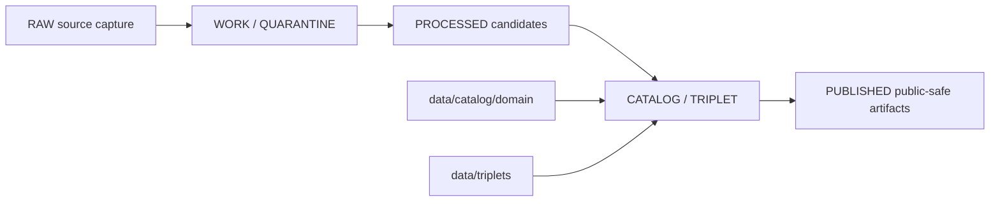

<!-- [KFM_META_BLOCK_V2]
doc_id: kfm://doc/data-catalog-domain-readme
title: data/catalog/domain/README.md — Domain Catalog Index README
version: v0.1
type: readme; data-lifecycle-index; domain-catalog-index
status: draft; PROPOSED; data-root; catalog-stage; domain-index; release-gated; evidence-first
owners: OWNER_TBD — Data steward · Catalog steward · Domain stewards · Evidence steward · Source steward · Policy steward · Release steward · Docs steward
created: NEEDS VERIFICATION — greenfield stub existed before v0.1 expansion
updated: 2026-06-25
policy_label: public-doc; data; catalog; domain-index; lifecycle; release-gated
tags: [kfm, data, catalog, domain, domain-catalog, CATALOG, TRIPLET, EvidenceBundle, SourceDescriptor, CatalogBuildReceipt, ReleaseManifest, RollbackCard]
related:
  - ../README.md
  - ../../README.md
  - ../../../docs/doctrine/lifecycle-law.md
  - ../../../contracts/data/catalog_matrix.md
  - ../../../data/triplets/
  - ../../../data/proofs/
  - ../../../data/receipts/
  - ../../../data/published/
  - ../../../data/registry/
  - ../../../release/
notes:
  - "This file replaces a greenfield stub at `data/catalog/domain/README.md`."
  - "This folder indexes domain-scoped CATALOG-stage records. It is not RAW, WORK, QUARANTINE, PROCESSED, PUBLISHED, proof storage, source registry, release authority, schema authority, policy authority, implementation code, or a public data surface."
  - "Each child domain folder remains responsible for its own README, evidence posture, source-role boundaries, sensitivity posture, receipts, release references, and rollback path."
  - "Child lane presence and completeness remain NEEDS VERIFICATION unless the child README or inventory is cited in the current review."
  - "Rollback target for this replacement is previous stub blob SHA `a306e88315297374a0027c9aaca0e421916ceffc`."
[/KFM_META_BLOCK_V2] -->

# data/catalog/domain

> Domain catalog index for governed domain-scoped catalog records inside the `CATALOG / TRIPLET` lifecycle stage.

  
  
  
  
  

**Status:** draft / PROPOSED  
**Path:** `data/catalog/domain/README.md`  
**Owning root:** `data/catalog/`  
**Lifecycle stage:** `CATALOG / TRIPLET`  
**Exposure posture:** RELEASED ONLY — domain catalog records are public only when tied to an approved release  
**Truth posture:** CONFIRMED target was a greenfield stub · CONFIRMED parent `data/catalog/` is CATALOG-stage and RELEASED ONLY for public exposure · CONFIRMED child README pattern treats domain catalog records as evidence-bound, release-gated catalog carriers · NEEDS VERIFICATION for complete child-lane inventory, schemas, validators, policy gates, receipts, release manifests, public API/map behavior, and route behavior.

**Quick jumps:** [Purpose](#purpose) · [Lifecycle boundary](#lifecycle-boundary) · [Repo fit](#repo-fit) · [Accepted contents](#accepted-contents) · [Exclusions](#exclusions) · [Known child lanes](#known-child-lanes) · [Catalog requirements](#catalog-requirements) · [Guardrails](#guardrails) · [Evidence ledger](#evidence-ledger) · [Validation checklist](#validation-checklist) · [Rollback](#rollback)

---

## Purpose

`data/catalog/domain/` is the domain-scoped catalog index under the broader `data/catalog/` lifecycle lane.

It groups catalog records by domain segment after upstream RAW, WORK/QUARANTINE, and PROCESSED work has enough validation, evidence, source-role support, policy posture, and receipts for CATALOG/TRIPLET representation.

A domain catalog record helps users and systems discover governed data. It does **not** make the underlying claim true, does not replace EvidenceBundle support, does not admit a source, does not approve policy use, and does not approve publication.

## Lifecycle boundary

`data/catalog/domain/` is a CATALOG-stage index. It sits beside other catalog projections such as STAC, DCAT, PROV, and paired graph/triplet projections. Public exposure applies only to catalog records tied to approved release state, governed route, EvidenceBundle support, source-role support, policy/review posture, and rollback target.

## Repo fit

| Responsibility | Correct home | Rule |
|---|---|---|
| Domain catalog index | `data/catalog/domain/` | This lane. |
| Parent catalog stage | `data/catalog/` | Parent CATALOG-stage data lane. |
| STAC catalog projection | `data/catalog/stac/` | Spatiotemporal catalog projection, if accepted. |
| DCAT catalog projection | `data/catalog/dcat/` | Dataset/distribution catalog projection, if accepted. |
| PROV catalog projection | `data/catalog/prov/` | Provenance catalog projection, if accepted. |
| Graph/triplet projection | `data/triplets/` | Paired CATALOG/TRIPLET stage. |
| Evidence/proof records | `data/proofs/` | EvidenceBundle and proof records. |
| Source registry | `data/registry/` | SourceDescriptor and source-admission records. |
| Receipts | `data/receipts/` | CatalogBuildReceipt, validation, policy, review, transform, correction, and release receipts. |
| Release decisions | `release/` | Publication authority. |
| Published public products | `data/published/` | Downstream materialization after release. |
| Schemas and policy | `schemas/`, `policy/` | Separate authority roots. |
| Code/tests | implementation roots and test roots | Not this lane. |

## Accepted contents

- Domain-level catalog indexes and domain README files.
- Domain-scoped catalog records that point to EvidenceBundle, SourceDescriptor, receipts, policy decisions, review records, release manifests, and rollback targets.
- Child-lane indexes such as `habitat/ecoregions/`, `roads-rail-trade/story-nodes/`, `people-dna-land/land-ownership/`, or other approved sublanes.
- Compatibility/alias notes for unresolved segment conflicts when they are explicitly marked PROPOSED/CONFLICTED and do not create parallel authority.
- Catalog quality summaries that point to validation reports and receipts rather than embedding proof.

## Exclusions

| Do not put here | Correct home |
|---|---|
| RAW source files | `data/raw/` |
| WORK/intermediate data | `data/work/` |
| Quarantined data | `data/quarantine/` |
| Processed datasets | `data/processed/` |
| Published products | `data/published/` |
| EvidenceBundle/proof records | `data/proofs/` |
| SourceDescriptor/source-registry records | `data/registry/` |
| Receipts | `data/receipts/` |
| Release decisions | `release/` |
| Semantic contracts | `contracts/` |
| Schemas | `schemas/` |
| Policy rules | `policy/` |
| Validators, tests, packages, pipelines, app/UI/API code | corresponding implementation/test roots |

## Known child lanes

This table is an index, not a completeness claim. Each child lane must be verified independently before use.

| Child lane | Posture | Notes |
|---|---|---|
| `agriculture/` | PROPOSED | Agriculture domain catalog lane. |
| `archaeology/` | PROPOSED / sensitive | Archaeology catalog lane; exact-sensitive content must fail closed. |
| `atmosphere/` | PROPOSED | Atmosphere catalog lane and PM2.5 sublane patterns. |
| `fauna/` | PROPOSED / restricted-aware | Fauna parent with public/restricted child lane pattern. |
| `flora/` | PROPOSED / rare-plant aware | Flora catalog lane; rare-plant exposure must fail closed. |
| `geology/` | PROPOSED | Geology/Natural Resources catalog lane. |
| `habitat/` | PROPOSED | Habitat catalog lane with `ecoregions/` child. |
| `hazards/` | PROPOSED / not-life-safety | Hazards catalog lane; not emergency alert authority. |
| `hydrology/` | PROPOSED / source-role aware | Hydrology catalog lane with observed/regulatory/model separation. |
| `people-dna-land/` | PROPOSED / restricted | People/DNA/Land parent lane with land-ownership child. |
| `people/` | PROPOSED / CONFLICTED | Short-segment compatibility lane; does not replace `people-dna-land/`. |
| `roads-rail-trade/` | PROPOSED | Roads/Rail/Trade catalog lane with `story-nodes/` child. |
| `settlements-infrastructure/` | PROPOSED | Governing Settlements/Infrastructure lane. |
| `settlement/` | PROPOSED / CONFLICTED | Short-segment compatibility lane; does not replace `settlements-infrastructure/`. |
| `soil/` | PROPOSED | Soil catalog lane with SSURGO/gSSURGO support-type separation. |

## Catalog requirements

PROPOSED until schemas, validators, inventory, and release behavior are verified:

| Requirement | Meaning |
|---|---|
| Stable catalog identity | Each catalog record has a stable ID linked to source, evidence, derivative, or release object. |
| Domain segment | Each record declares its domain segment and any compatibility/alias state. |
| Evidence reference | Claims that depend on evidence point to EvidenceBundle/proof context. |
| Source reference | Records point to SourceDescriptor/source registry where source authority matters. |
| Policy/review state | Records link to sensitivity, rights, review, and policy posture where material. |
| Receipt linkage | Records cite CatalogBuildReceipt, validation, transform, correction, or release receipts where material. |
| Release reference | Public or release-linked records point to ReleaseManifest and rollback target. |
| Projection closure | Domain catalog, STAC, DCAT, PROV, and triplet projections agree where those projections exist. |

## Guardrails

- Domain catalog records are catalog carriers, not root truth.
- Child lanes do not weaken their domain-specific sensitivity, rights, sovereignty, consent, source-role, or release posture.
- Compatibility aliases must be marked PROPOSED/CONFLICTED and must not become parallel authority roots.
- AI-generated summaries, story nodes, map layers, graph projections, tiles, and public API payloads remain downstream of evidence and release state.
- Public clients must not read RAW, WORK, QUARANTINE, unpublished candidates, direct source-system side effects, direct model runtime output, or internal canonical stores through this lane.
- Unreleased catalog records are not public merely because they exist under this directory.

## Evidence ledger

| Source | Status | Supports | Limits |
|---|---|---|---|
| Previous file | CONFIRMED | Target was a greenfield stub. | Did not define lane boundaries. |
| `data/catalog/README.md` | CONFIRMED | Parent catalog lane, CATALOG/TRIPLET stage, and RELEASED ONLY public posture. | Does not prove complete domain inventory. |
| Existing child README pattern | CONFIRMED examples | Child lanes define release-gated, evidence-bound catalog records and exclude source/proof/release/schema/policy/code. | Each child lane still requires independent verification. |

## Validation checklist

- [ ] Confirm complete child-lane inventory under `data/catalog/domain/`.
- [ ] Confirm each child lane has a README and no blank placeholders remain.
- [ ] Confirm domain segment conflicts and alias lanes have ADR/path-map/migration/rollback notes.
- [ ] Confirm domain catalog schemas/profiles and validators.
- [ ] Confirm SourceDescriptor, EvidenceBundle, CatalogBuildReceipt, PolicyDecision, ReviewRecord, ReleaseManifest, and rollback references.
- [ ] Confirm STAC/DCAT/PROV/triplet closure where projections exist.
- [ ] Confirm public route/API/map behavior uses only release-approved public-safe records.

## Rollback

Rollback is required if this index becomes a source-data root, proof store, source-registry root, release-decision root, published-output root, semantic-contract root, schema root, policy root, validator root, implementation root, public API shortcut, or public exposure shortcut.

Rollback target for this replacement: previous stub blob SHA `a306e88315297374a0027c9aaca0e421916ceffc`.

<a href="#top">Back to top</a>

