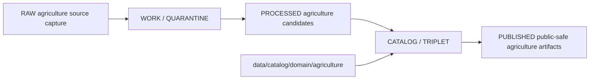

<!-- [KFM_META_BLOCK_V2]
doc_id: kfm://doc/data-catalog-domain-agriculture-readme
title: data/catalog/domain/agriculture/README.md — Agriculture Domain Catalog README
version: v0.1
type: readme; data-lifecycle-sublane; domain-catalog-guide
status: draft; PROPOSED; data-root; catalog-stage; agriculture; release-gated; aggregation-aware
owners: OWNER_TBD — Agriculture steward · Data steward · Catalog steward · Evidence steward · Policy steward · Release steward · Schema steward · Docs steward
created: NEEDS VERIFICATION — blank placeholder existed before v0.1 expansion
updated: 2026-06-24
policy_label: public-doc; data; catalog; agriculture; lifecycle; release-gated; aggregation-aware
tags: [kfm, data, catalog, agriculture, domain-catalog, CATALOG, TRIPLET, EvidenceBundle, AggregationReceipt, ReleaseManifest, CatalogBuildReceipt]
related:
  - ../../README.md
  - ../../../README.md
  - ../../../../docs/domains/agriculture/DATA_LIFECYCLE.md
  - ../../../../docs/domains/agriculture/CANONICAL_PATHS.md
  - ../../../../docs/domains/agriculture/SENSITIVITY.md
  - ../../../../docs/adr/ADR-0022-catalog-matrix--stac-+-dcat-+-prov-must-agree.md
  - ../../../../docs/doctrine/lifecycle-law.md
  - ../../../../contracts/domains/agriculture/
  - ../../../../schemas/contracts/v1/domains/agriculture/
  - ../../../../policy/domains/agriculture/
  - ../../../../release/
notes:
  - "This file replaces a blank placeholder at `data/catalog/domain/agriculture/README.md`."
  - "Agriculture canonical paths identify `data/catalog/domain/agriculture/` as a PROPOSED lifecycle-data catalog path."
  - "Agriculture lifecycle doctrine makes AggregationReceipt load-bearing for public-safe aggregate products."
  - "This folder is a CATALOG-stage domain catalog lane; it is not RAW, WORK, QUARANTINE, PROCESSED, PUBLISHED, proof storage, release authority, schema authority, policy code, or implementation code."
  - "Rollback target for this replacement is previous blank blob SHA `8b137891791fe96927ad78e64b0aad7bded08bdc`."
[/KFM_META_BLOCK_V2] -->

# data/catalog/domain/agriculture

> Agriculture-specific domain catalog lane for governed catalog records and indexes inside the `CATALOG / TRIPLET` lifecycle stage.

  
  
  
  
  
  

**Status:** draft / PROPOSED  
**Owners:** OWNER_TBD — Agriculture steward · Data steward · Catalog steward · Evidence steward · Policy steward · Release steward · Schema steward · Docs steward  
**Path:** `data/catalog/domain/agriculture/README.md`  
**Owning root:** `data/catalog/domain/`  
**Domain segment:** `agriculture`  
**Lifecycle stage:** `CATALOG / TRIPLET`  
**Exposure posture:** RELEASED ONLY  
**Truth posture:** CONFIRMED target was blank · CONFIRMED parent catalog lane is RELEASED ONLY · CONFIRMED Agriculture canonical paths name `data/catalog/domain/agriculture/` as a PROPOSED lifecycle-data path · CONFIRMED Agriculture lifecycle docs make `AggregationReceipt` load-bearing · NEEDS VERIFICATION for concrete catalog records, schemas, validators, policy gates, receipts, ReleaseManifest linkage, and public route behavior.

**Quick jumps:** [Purpose](#purpose) · [Lifecycle boundary](#lifecycle-boundary) · [Repo fit](#repo-fit) · [Accepted contents](#accepted-contents) · [Exclusions](#exclusions) · [Agriculture catalog requirements](#agriculture-catalog-requirements) · [Aggregation and sensitivity guardrails](#aggregation-and-sensitivity-guardrails) · [Evidence ledger](#evidence-ledger) · [Validation checklist](#validation-checklist) · [Rollback](#rollback)

---

## Purpose

`data/catalog/domain/agriculture/` stores or stages Agriculture-domain catalog records and indexes that tie agriculture objects, evidence, receipts, policy posture, release state, and catalog projections together.

Likely Agriculture domain catalog records include catalog entries for crop observations, field candidates, crop rotations, yield observations, irrigation links, conservation practices, soil-crop suitability, agricultural economy observations, supply-chain nodes, drought stress indicators, pest stress indicators, and aggregation receipts.

A domain catalog record supports discovery, review, and release closure. It does **not** make an agriculture claim true, public, policy-admitted, evidence-supported, or released by itself.

## Lifecycle boundary

`data/catalog/domain/agriculture/` is a CATALOG-stage sublane. Public exposure applies only to records tied to an approved release, governed route, policy-safe aggregation, and required receipts.

## Repo fit

| Responsibility | Correct home | Rule |
|---|---|---|
| Agriculture domain catalog records | `data/catalog/domain/agriculture/` | This lane. |
| Parent catalog stage | `data/catalog/` | Parent CATALOG-stage lane. |
| Agriculture STAC records | `data/catalog/stac/agriculture/` | Spatiotemporal catalog records. |
| Agriculture DCAT records | `data/catalog/dcat/agriculture/` | Dataset/distribution catalog records. |
| Agriculture PROV records | `data/catalog/prov/agriculture/` | Provenance catalog projection. |
| Agriculture graph/triplet projections | `data/triplets/.../agriculture/` | Paired graph stage. |
| Agriculture proof/evidence | `data/proofs/` or accepted proof roots | EvidenceBundle and ProofPack. |
| Agriculture receipts | `data/receipts/` or accepted receipt roots | AggregationReceipt, CatalogBuildReceipt, RunReceipt, validation receipts. |
| Agriculture release decisions | `release/` | Publication authority. |
| Agriculture schemas and policy | `schemas/contracts/v1/domains/agriculture/`, `policy/domains/agriculture/` | Separate roots; paths remain PROPOSED until verified. |

## Accepted contents

| Content | Purpose |
|---|---|
| Agriculture domain catalog records | Domain-scoped catalog entries for agriculture object families. |
| Catalog indexes | Steward-facing or release-linked lookup surfaces. |
| Release-linked catalog manifests | Pointers to release-approved Agriculture catalog subsets. |
| Evidence and source pointers | References to EvidenceBundle, SourceDescriptor, receipts, and validation reports. |
| Aggregation pointers | References to AggregationReceipt and public-safe geometry scope. |
| Policy and sensitivity pointers | References to policy posture, redaction/generalization, rights, and sensitivity state. |
| Catalog quality summaries | Summaries that point to validation reports and receipts. |

## Exclusions

| Do not put here | Correct home |
|---|---|
| Agriculture RAW source files | `data/raw/agriculture/` |
| Agriculture WORK/intermediate data | `data/work/agriculture/` |
| Agriculture quarantined data | `data/quarantine/agriculture/` |
| Agriculture processed datasets | `data/processed/agriculture/` |
| STAC records | `data/catalog/stac/agriculture/` |
| DCAT records | `data/catalog/dcat/agriculture/` |
| PROV records | `data/catalog/prov/agriculture/` |
| Triplets/graph edges | `data/triplets/.../agriculture/` |
| EvidenceBundle/proof records | `data/proofs/` or accepted proof roots |
| Receipts | `data/receipts/` or accepted receipt roots |
| Release decisions | `release/` |
| Published Agriculture products | `data/published/.../agriculture/` |
| Agriculture schemas | `schemas/contracts/v1/domains/agriculture/` |
| Agriculture policy rules | `policy/domains/agriculture/` |
| Validators/tests/code | `tools/validators/`, `tests/`, implementation roots |

## Agriculture catalog requirements

PROPOSED until schema and validator are verified:

| Requirement | Meaning |
|---|---|
| Stable agriculture object identity | Catalog record must point to a stable object or product identity. |
| Evidence reference | EvidenceBundle/proof context must be referenced when claims depend on evidence. |
| Source reference | SourceDescriptor/source catalog must be referenced when source authority matters. |
| Aggregation reference | Public aggregate records must resolve an AggregationReceipt. |
| Policy reference | Policy/admissibility posture must be available when release or sensitivity depends on it. |
| Release reference | Public or release-linked records must point to the immutable ReleaseManifest. |
| Closure compatibility | STAC/DCAT/PROV/domain catalog agreement must hold for promoted releases. |

## Aggregation and sensitivity guardrails

- Agriculture catalog records are catalog carriers, not agriculture source truth.
- Aggregation is load-bearing for public Agriculture products; a public aggregate without an AggregationReceipt remains unsupported.
- Farm/operator/parcel, private-yield, pesticide-record, and private-sensitive joins fail closed until policy and review allow an appropriate representation.
- Domain catalog metadata should point to public-safe aggregate outputs when field/operator material is restricted.
- Source-role distinctions must remain visible: CDL is not observed field truth, stress is not an alert, NASS aggregates are not field-level evidence.
- Unreleased Agriculture catalog records are not public merely because they exist under this directory.

## Evidence ledger

| Source | Status | Supports | Limits |
|---|---|---|---|
| `data/catalog/domain/agriculture/README.md` previous file | CONFIRMED | Target existed as a blank placeholder. | Did not define lane boundaries. |
| `data/catalog/README.md` | CONFIRMED | Parent catalog lane, domain catalog layout, RELEASED ONLY posture. | Does not prove Agriculture catalog inventory. |
| `docs/domains/agriculture/CANONICAL_PATHS.md` | CONFIRMED doctrine / PROPOSED realization | Agriculture path crosswalk including `data/catalog/domain/agriculture/`. | Agriculture-specific paths remain PROPOSED until repo verification. |
| `docs/domains/agriculture/DATA_LIFECYCLE.md` | CONFIRMED doctrine / PROPOSED lane application | Agriculture lifecycle gates, receipts, sensitivity, aggregation requirements. | Many exact files, validators, and routes remain NEEDS VERIFICATION. |

## Validation checklist

- [ ] Confirm actual child files and domain catalog record inventory under this lane.
- [ ] Confirm Agriculture domain catalog schema/profile location.
- [ ] Confirm Agriculture domain catalog validator and CI checks.
- [ ] Confirm STAC/DCAT/PROV/domain catalog matrix closure.
- [ ] Confirm ReleaseManifest linkage for public Agriculture catalog records.
- [ ] Confirm EvidenceBundle, SourceDescriptor, RunReceipt, AggregationReceipt, and PolicyDecision references.
- [ ] Confirm farm/operator/parcel, proprietary yield, pesticide-record, private-sensitive join, rights, and publication handling.
- [ ] Confirm correction, withdrawal, or supersession behavior for stale or failed Agriculture catalog records.

## Rollback

Rollback is required if this lane becomes an Agriculture source-data root, proof store, release-decision root, published-output root, schema root, policy root, validator root, implementation root, or public exposure shortcut.

Rollback target for this replacement: previous blank blob SHA `8b137891791fe96927ad78e64b0aad7bded08bdc`.

<a href="#top">Back to top</a>

