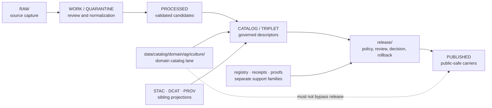

<!-- [KFM_META_BLOCK_V2]
doc_id: kfm://doc/data-catalog-domain-agriculture-readme
title: data/catalog/domain/agriculture/README.md — Governed Agriculture Catalog Lane
version: v0.3.0
type: readme; data-lifecycle-sublane; domain-catalog-guide; release-gated; aggregation-aware
status: repository-grounded draft; canonical placement; proposed realization; catalog-stage; release-gated
owners: NEEDS VERIFICATION — Agriculture, data, catalog, evidence, source, aggregation, sensitivity, policy, release, correction, rollback, schema, and docs stewards
created: NEEDS VERIFICATION — blank placeholder existed before v0.1 expansion
updated: 2026-07-24
policy_label: restricted-review; data-catalog; agriculture; release-gated; aggregation-aware; deny-sensitive-joins-by-default
current_path: data/catalog/domain/agriculture/README.md
historical_blank_blob: 8b137891791fe96927ad78e64b0aad7bded08bdc
prepared_under_prompt: KFM Markdown Modernization & GitHub Documentation Implementation Agent v4.0.0
review_packet_id: kfm-md-data-catalog-domain-agriculture-contract-alignment-20260724
truth_posture: >
  CONFIRMED exact path, parent catalog posture, Agriculture doctrine and lifecycle
  documents, source/receipt/proof/release support lanes, Directory Rules placement,
  relevant proposed ADRs, bounded workflow evidence, and repository-relative link
  targets / PROPOSED concrete catalog profile, record realization, deterministic
  validators, CatalogMatrix closure, and enforcement / UNKNOWN recursive record
  inventory, active producers and consumers, runtime reads, source-rights closure,
  release integration, hosting, caches, public effects, correction handling, and
  rollback execution / NEEDS VERIFICATION accountable stewardship, accepted ADR
  decisions, schema/profile maturity, aggregation and redaction enforcement,
  release closure, and public-client exclusion
evidence_snapshot:
  repository: bartytime4life/Kansas-Frontier-Matrix
  base_ref: main
  base_commit: 426db9f721d98766f05bfc785670373f9632c1b4
  prior_blob: c53626396033c748a57e1b3c1124db9967ab819c
  earlier_v0_1_blob: 54c5793bdd194d2ccc71100f45f234a0b1f33458
  method: complete target and governing-neighbor reads plus bounded repository, workflow, and pull-request search; no recursive clone, record sampling, runtime, deployment, host-render, or external-store inspection
related:
  - ../README.md
  - ../../README.md
  - ../../../../docs/domains/agriculture/README.md
  - ../../../../docs/domains/agriculture/DATA_LIFECYCLE.md
  - ../../../../docs/domains/agriculture/CANONICAL_PATHS.md
  - ../../../../docs/domains/agriculture/SENSITIVITY.md
  - ../../../../docs/domains/agriculture/SOURCES.md
  - ../../../../catalog/domain/agriculture/README.md
  - ../../../processed/agriculture/README.md
  - ../../../registry/sources/agriculture/README.md
  - ../../../receipts/agriculture/README.md
  - ../../../proofs/agriculture/README.md
  - ../../../rollback/agriculture/README.md
  - ../../../published/layers/agriculture/README.md
  - ../../../../contracts/domains/agriculture/README.md
  - ../../../../schemas/contracts/v1/domains/agriculture/README.md
  - ../../../../policy/domains/agriculture/README.md
  - ../../../../tests/domains/agriculture/README.md
  - ../../../../fixtures/domains/agriculture/catalog/README.md
  - ../../../../tests/domains/agriculture/catalog_closure/README.md
  - ../../../../tests/domains/agriculture/test_catalog_closure.py
  - ../../../../tools/validators/domains/agriculture/README.md
  - ../../../../release/agriculture/README.md
  - ../../../../release/candidates/agriculture/README.md
  - ../../../../release/candidates/agriculture/county_year_panel_v0/README.md
  - ../../../../docs/adr/ADR-0011-receipts-vs-proofs-vs-manifests-vs-catalog-separation.md
  - ../../../../docs/adr/ADR-0022-catalog-matrix--stac-+-dcat-+-prov-must-agree.md
  - ../../../../docs/doctrine/directory-rules.md
  - ../../../../.github/workflows/domain-agriculture.yml
  - ../../../../.github/CODEOWNERS
tags: [kfm, data, catalog, agriculture, domain-catalog, catalog-stage, triplet, evidence-bundle, source-descriptor, aggregation-receipt, redaction-receipt, release-manifest, catalog-matrix, privacy, cite-or-abstain]
notes:
  - "The first twelve H2 sections follow the Directory Rules folder-README contract."
  - "This revision follows merged pull request #1670 and preserves its evidence and Agriculture-specific safeguards while aligning the folder contract."
  - "All v0.1 and v0.2 heading fragments remain available through headings or explicit legacy anchors."
  - "The bounded evidence includes a docstring-only catalog-closure test placeholder and a separate conflicted top-level compatibility README; neither is repaired by this one-file change."
  - "This Markdown-only change creates no catalog record, evidence bundle, receipt, policy decision, release, publication, or public route."
  - "Static badges project verified documentation posture only; they do not assert schema, validator, CI, security, aggregation, release, or publication maturity."
[/KFM_META_BLOCK_V2] -->

<a id="top"></a>

# `data/catalog/domain/agriculture/` — Governed Agriculture Catalog Lane

> **One-line purpose.** Own Agriculture-domain catalog records and indexes at the `CATALOG / TRIPLET` stage while keeping truth, source role, rights, sensitivity, aggregation, evidence, policy, release, correction, rollback, and public delivery independently governed.

[](#status)
[](#authority-level)
[](#lifecycle-and-catalog-boundary)
[](#status)
[](#aggregation-and-sensitivity-guardrails)

> [!IMPORTANT]
> A catalog record supports discovery, review, interoperability, and release closure. Placement here does not make an Agriculture claim true, evidence-supported, rights-cleared, policy-admitted, reviewed, released, or public. EvidenceBundle, PolicyDecision, ReviewRecord, receipts, ReleaseManifest, correction state, and rollback remain separate governed objects.

> [!CAUTION]
> Field polygons, operator or owner identity, parcel relationships, private yield, pesticide or application records, precise irrigation links, proprietary records, and re-identifiable joins fail closed. Public Agriculture products default to reviewed aggregation, generalization, or redaction with a resolvable `AggregationReceipt` or `RedactionReceipt`; public clients use governed interfaces and released public-safe artifacts.

**Quick navigation:** [Purpose](#purpose) · [Authority](#authority-level) · [Status](#status) · [Belongs](#what-belongs-here) · [Exclusions](#what-does-not-belong-here) · [Inputs](#inputs) · [Outputs](#outputs) · [Validation](#validation) · [Review](#review-burden) · [Related](#related-folders) · [ADRs](#adrs) · [Last reviewed](#last-reviewed) · [Boundary](#lifecycle-and-catalog-boundary) · [Requirements](#agriculture-catalog-requirements) · [Guardrails](#aggregation-and-sensitivity-guardrails) · [Evidence](#evidence-basis) · [Closure](#projection-and-release-closure) · [Correction](#migration-correction-and-rollback) · [Verification](#open-verification-register) · [Done](#definition-of-done) · [No-loss](#no-loss-ledger)

## Purpose

`data/catalog/domain/agriculture/` owns governed Agriculture-domain catalog records and indexes at the `CATALOG / TRIPLET` lifecycle stage. Records here connect stable Agriculture identities to sources, evidence, receipts, policy and review posture, catalog projections, release state, correction lineage, and rollback targets.

Likely record families include crop observations, field candidates, crop rotations, yield observations, irrigation links, conservation practices, soil-crop suitability, agricultural-economy observations, supply-chain nodes, drought and pest stress indicators, and aggregation-aware public products. Listing a family does not prove that its records, contract, schema, validator, evidence, or release state exist.

## Authority level

**Canonical responsibility placement for Agriculture domain catalog records / repository-grounded draft / concrete profile and realization PROPOSED / not truth, evidence, policy, release, or publication authority.**

This lane may carry catalog descriptors and governed references. It cannot replace Agriculture semantics under `contracts/`, machine shape under `schemas/`, admissibility under `policy/`, source identity and rights under `data/registry/`, process memory under `data/receipts/`, EvidenceBundles and proof support under `data/proofs/`, release decisions under `release/`, or public-safe carriers under `data/published/`.

## Status

| Field | Bounded result |
|---|---|
| Path | `data/catalog/domain/agriculture/README.md` |
| Version | `v0.3.0` |
| Base evidence | `main@426db9f721d98766f05bfc785670373f9632c1b4` |
| Prior blob | `c53626396033c748a57e1b3c1124db9967ab819c` (`v0.2.0`, merged by pull request #1670) |
| Earlier `v0.1` blob | `54c5793bdd194d2ccc71100f45f234a0b1f33458` |
| Historical blank predecessor | `8b137891791fe96927ad78e64b0aad7bded08bdc` |
| Placement | `CONFIRMED` existing Agriculture child under the governed `data/catalog/domain/` responsibility root |
| Concrete domain catalog profile | `PROPOSED / NEEDS VERIFICATION` |
| Recursive record inventory | `UNKNOWN` |
| Active producers, consumers, runtime reads, hosts, caches, or public effects | `UNKNOWN` |
| Schema and validator maturity | `NEEDS VERIFICATION` |
| STAC/DCAT/PROV/domain agreement | `NEEDS VERIFICATION` |
| Aggregation and redaction enforcement | `NEEDS VERIFICATION` |
| Public exposure | `RELEASE-GATED / FAIL CLOSED` |
| Human review | `PENDING` |

<a id="accepted-contents"></a>

## What belongs here

| Accepted family | Required posture |
|---|---|
| Agriculture domain catalog records | Stable identity, object family, source role, space/time scope, lifecycle and release state |
| Catalog indexes | Steward-facing or release-linked lookup; never an ungoverned public shortcut |
| Release-linked catalog subsets or manifests | References to immutable release-governance records, not duplicate release authority |
| Evidence and source pointers | Resolvable `EvidenceRef`, `EvidenceBundle`, `SourceDescriptor`, and applicable registry references |
| Receipt pointers | Catalog-build, validation, transform, aggregation, redaction, correction, and release-support receipts |
| Aggregation and sensitivity pointers | Public-safe geometry or cohort scope, threshold, method, reason, and review references |
| Policy, review, correction, and rollback pointers | Governed decisions and audit lineage without embedding their authority here |
| Catalog quality summaries | Derived summaries that cite validation reports and input/output digests |

Records must be deterministic where practical, bounded in scope, correctable, and explicit about whether they are internal candidates, reviewable records, release-linked records, withdrawn records, or historical records.

<a id="exclusions"></a>

## What does NOT belong here

| Prohibited family | Governed home or action |
|---|---|
| Agriculture RAW, WORK, or QUARANTINE source material | `data/raw/agriculture/`, `data/work/agriculture/`, or `data/quarantine/agriculture/` |
| Processed Agriculture datasets or candidate payloads | `data/processed/agriculture/` or another approved controlled lifecycle lane |
| STAC, DCAT, or PROV projection records | Governed sibling projection lanes under `data/catalog/` |
| Graph or triplet payloads | Governed lanes under `data/triplets/` |
| Source descriptors, rights, sensitivity, dataset, layer, or crosswalk registry rows | `data/registry/` |
| EvidenceBundles, ProofPacks, attestations, or proof reports | `data/proofs/` |
| Run, catalog-build, validation, transform, aggregation, redaction, review, correction, or release receipts | `data/receipts/` |
| Policy decisions, contracts, schemas, validators, fixtures, tests, packages, tools, pipelines, or workflows | their owning responsibility roots |
| ReleaseManifest, PromotionDecision, RollbackCard, CorrectionNotice, withdrawal, supersession, signature, or release authority | `release/` |
| Published layers, reports, stories, downloads, APIs, indexes, tiles, PMTiles, or other public-safe carriers | `data/published/` after governed release |
| Direct public reads, UI caches, search indexes, AI retrieval corpora, or hosting output | governed interfaces and approved runtime/output stores |
| Unreviewed field/operator/parcel, private yield, pesticide/application, precise irrigation, or proprietary joins | deny, quarantine, aggregate, generalize, redact, or restrict under policy and review |

## Inputs

Catalog inputs should be governed references and validated derivatives, not raw truth by placement:

- processed Agriculture object identities and versioned digests;
- source and dataset registry references with roles, rights, sensitivity, spatial/temporal scope, and retrieval context;
- contracts, schemas, catalog profiles, policy decisions, and review records;
- EvidenceRef-to-EvidenceBundle resolution and applicable proof support;
- catalog-build, validation, aggregation, redaction, transform, correction, and release-support receipts;
- STAC, DCAT, PROV, and triplet references when projections exist;
- immutable release, correction, withdrawal, supersession, and rollback references.

Unknown source role, rights, sensitivity, evidence, aggregation method, policy, review, release, correction, or rollback state holds the record from public-bound use.

## Outputs

This lane may emit or support:

- internal or reviewable Agriculture catalog records;
- deterministic domain indexes and catalog subsets;
- release-linked catalog descriptors that reference, but do not replace, release authority;
- inspectable agreement inputs for STAC/DCAT/PROV/domain/triplet closure;
- correction- and rollback-aware discovery metadata for governed APIs and review tools.

Catalog placement is not publication. Public clients receive only policy-safe, release-approved representations through governed interfaces and public-safe carriers.

<a id="validation-checklist"></a>

## Validation

For README-only changes:

- verify one H1, the Directory Rules §15 H2 order, valid GFM tables, complete fences, supported alerts, stable anchors, and a final newline;
- resolve every introduced repository-relative link at the resulting commit;
- compare the complete baseline and result, preserve document identity and Agriculture-specific requirements, and record any intentional consolidation;
- inspect the exact base-to-head diff for one-path scope, conflict markers, credentials, private endpoints, sensitive coordinates, or Agriculture payload data.

For catalog records and indexes, executable validation should fail closed on:

- missing or unstable identity, version, digest, object family, source role, spatial or temporal scope;
- unresolved `SourceDescriptor`, EvidenceRef, EvidenceBundle, contract, schema, policy, review, receipt, release, correction, or rollback references;
- field/operator/parcel or other sensitive joins without reviewed aggregation, redaction, generalization, access, and reason records;
- public aggregate records without a resolvable `AggregationReceipt` or an accepted equivalent;
- contradictory identity, digest, release, rights, sensitivity, or access state across domain, STAC, DCAT, PROV, triplet, evidence, and release surfaces;
- candidate, withdrawn, superseded, stale, restricted, or unreleased records reaching public clients;
- AI summaries, maps, indexes, or generated prose presented as source truth.

The inspected `.github/workflows/domain-agriculture.yml` is a GitHub-hosted, read-only, `pull_request` readiness/hold surface. It explicitly does not validate Agriculture truth, build proof, admit sources, apply policy, promote lifecycle objects, approve release, deploy, or publish. Its presence is not enforcement maturity.

## Review burden

At minimum, route changes to:

- the verified GitHub CODEOWNERS route;
- Agriculture, data, and catalog review for object meaning, lane placement, and catalog profile;
- source and rights review for CDL, NASS, SSURGO, Mesonet, satellite, sensor, market, and proprietary inputs as applicable;
- sensitivity and privacy review for field, operator, owner, parcel, yield, pesticide/application, irrigation, and cross-domain joins;
- evidence, aggregation/redaction, policy, release, correction, and rollback review when records touch those boundaries;
- schema and validator review for machine or enforcement changes.

`.github/CODEOWNERS` routes unmatched paths to `@bartytime4life`. That is **CONFIRMED review routing**, not a StewardshipAssignment, independent approval, PolicyDecision, release authorization, branch-protection proof, or evidence that review occurred.

<a id="repo-fit"></a>

## Related folders

| Responsibility | Verified repository path |
|---|---|
| Parent catalog lanes | [`data/catalog/domain/`](../README.md) · [`data/catalog/`](../../README.md) |
| Agriculture doctrine | [`README`](../../../../docs/domains/agriculture/README.md) · [`DATA_LIFECYCLE`](../../../../docs/domains/agriculture/DATA_LIFECYCLE.md) · [`CANONICAL_PATHS`](../../../../docs/domains/agriculture/CANONICAL_PATHS.md) · [`SENSITIVITY`](../../../../docs/domains/agriculture/SENSITIVITY.md) · [`SOURCES`](../../../../docs/domains/agriculture/SOURCES.md) |
| Adjacent lifecycle and delivery lanes | [`data/processed/agriculture/`](../../../processed/agriculture/README.md) · [`data/rollback/agriculture/`](../../../rollback/agriculture/README.md) · [`data/published/layers/agriculture/`](../../../published/layers/agriculture/README.md) |
| Source, rights, and sensitivity registry | [`data/registry/sources/agriculture/`](../../../registry/sources/agriculture/README.md) |
| Process memory and proof support | [`data/receipts/agriculture/`](../../../receipts/agriculture/README.md) · [`data/proofs/agriculture/`](../../../proofs/agriculture/README.md) |
| Meaning, shape, and admissibility | [`contracts/domains/agriculture/`](../../../../contracts/domains/agriculture/README.md) · [`schemas/contracts/v1/domains/agriculture/`](../../../../schemas/contracts/v1/domains/agriculture/README.md) · [`policy/domains/agriculture/`](../../../../policy/domains/agriculture/README.md) |
| Tests and documented validator lane | [`tests/domains/agriculture/`](../../../../tests/domains/agriculture/README.md) · [`tools/validators/domains/agriculture/`](../../../../tools/validators/domains/agriculture/README.md) |
| Catalog fixtures and closure-test evidence | [`fixtures/domains/agriculture/catalog/`](../../../../fixtures/domains/agriculture/catalog/README.md) · [`tests/domains/agriculture/catalog_closure/`](../../../../tests/domains/agriculture/catalog_closure/README.md) · [`test_catalog_closure.py`](../../../../tests/domains/agriculture/test_catalog_closure.py) |
| Release governance and candidates | [`release/agriculture/`](../../../../release/agriculture/README.md) · [`release/candidates/agriculture/`](../../../../release/candidates/agriculture/README.md) · [`county_year_panel_v0`](../../../../release/candidates/agriculture/county_year_panel_v0/README.md) |
| Non-authoritative compatibility copy | [`catalog/domain/agriculture/`](../../../../catalog/domain/agriculture/README.md) — `CONFLICTED`, out of scope |
| Readiness workflow and review routing | [`domain-agriculture.yml`](../../../../.github/workflows/domain-agriculture.yml) · [`CODEOWNERS`](../../../../.github/CODEOWNERS) |

These links prove that the named paths and documents existed at the evidence snapshot. They do not prove record inventories, accepted schemas, current source rights, deterministic validators, CatalogMatrix closure, release approval, public routes, correction handling, or rollback execution.

## ADRs

| Decision record | Observed state | Relevance |
|---|---:|---|
| [`ADR-0011 — Receipts vs Proofs vs Manifests vs Catalog Separation`](../../../../docs/adr/ADR-0011-receipts-vs-proofs-vs-manifests-vs-catalog-separation.md) | `PROPOSED` | Supports `receipt ≠ proof ≠ catalog ≠ publication`; it does not prove acceptance or enforcement. |
| [`ADR-0022 — Catalog Matrix · STAC + DCAT + PROV Must Agree`](../../../../docs/adr/ADR-0022-catalog-matrix--stac-+-dcat-+-prov-must-agree.md) | `PROPOSED` | Supports release-level identity, digest, and release-reference agreement; it does not prove an executable Agriculture closure resolver. |

[`Directory Rules`](../../../../docs/doctrine/directory-rules.md) §12 places Agriculture as a lane inside responsibility roots; §13 prevents parallel authority; §14 governs reversible migration; §15 defines this folder-README contract.

## Last reviewed

**2026-07-24** against `main@426db9f721d98766f05bfc785670373f9632c1b4` after pull request #1670 merged externally.

Review again after six months, or sooner if the parent catalog contract, Agriculture doctrine, source rights, sensitivity thresholds, aggregation requirements, catalog profile, relevant ADR status, workflows, producers, consumers, public routes, release process, correction process, or rollback path changes.

<a id="lifecycle-boundary"></a>

## Lifecycle and catalog boundary


```mermaid
flowchart LR
    RAW["RAW<br/>source capture"] --> WORK["WORK / QUARANTINE<br/>review and normalization"]
    WORK --> PROCESSED["PROCESSED<br/>validated candidates"]
    PROCESSED --> CATALOG["CATALOG / TRIPLET<br/>governed descriptors"]
    CATALOG --> RELEASE["release/<br/>policy, review, decision, rollback"]
    RELEASE --> PUBLISHED["PUBLISHED<br/>public-safe carriers"]
    DOMAIN["data/catalog/domain/agriculture/<br/>domain catalog lane"] --> CATALOG
    STANDARDS["STAC · DCAT · PROV<br/>sibling projections"] --> CATALOG
    EVIDENCE["registry · receipts · proofs<br/>separate support families"] --> RELEASE
    DOMAIN -. "must not bypass release" .-> PUBLISHED
```

The diagram is a lifecycle and authority map, not proof that complete Agriculture records, projections, validators, release assembly, public routes, corrections, or rollback drills exist. Promotion is a governed state transition; a file move or successful check is not promotion.

## Agriculture catalog requirements

The following are **PROPOSED requirements** until accepted profiles, emitted records, deterministic validators, negative fixtures, required workflows, and observed release behavior prove them:

| Requirement | Minimum meaning |
|---|---|
| Stable catalog identity | Deterministic identifier for the Agriculture object or product; version and digest changes remain explicit |
| Object and knowledge character | Crop, field candidate, rotation, yield, irrigation, conservation, suitability, economy, supply-chain, stress, or aggregation role remains distinct |
| Spatial and temporal support | Geometry or aggregation unit, coordinate reference, observed/valid/retrieval/release/correction times, and coverage limits remain explicit |
| Source and rights reference | SourceDescriptor, dataset/version, source role, license/terms, retrieval context, and rights decision resolve |
| Evidence reference | Claim-bearing fields resolve EvidenceRef to EvidenceBundle; unsupported claims cite-or-abstain |
| Receipt reference | Build, validation, aggregation, redaction, transform, correction, and release-support operations remain auditable |
| Aggregation reference | Public aggregate specifies source unit, target unit, threshold or cohort rule, method/version, information-loss note, and `AggregationReceipt` |
| Sensitivity and policy reference | Tier, restriction, transform, reason code, PolicyDecision, and ReviewRecord resolve where material |
| Catalog closure | Domain, STAC, DCAT, PROV, triplet, evidence, and release views agree on identity, digest, source role, scope, access, and release reference |
| Release and correction reference | Public-bound records point to immutable ReleaseManifest, public scope, correction/withdrawal state, and rollback target |

Candidate catalog records must not masquerade as released records. Released records must remain distinguishable from corrected, withdrawn, superseded, or historical records without rewriting prior history.

## Aggregation and sensitivity guardrails

| Guardrail | Required posture |
|---|---|
| Catalog carriers are not source truth | Resolve claims to EvidenceBundle and source records; do not infer truth from directory placement or presentation quality |
| Aggregation is load-bearing | A public aggregate requires a reviewed `AggregationReceipt` or accepted equivalent that records inputs, threshold/cohort, method, output unit, digest, loss, and policy context |
| Field geometry defaults restricted | Field candidates are not private farm-management records; generalize, aggregate, redact, delay, restrict, or deny based on rights, sensitivity, and re-identification risk |
| Operator, owner, and parcel joins fail closed | Cross-domain person/land joins require specialist review, minimum-necessary representation, access control, redaction or aggregation, reason, correction, and rollback |
| Private yield and pesticide/application records fail closed | Do not publish operator-level yield, application timing/rate, or proprietary records without explicit authority, policy, review, and public-safe transform |
| Precise irrigation and infrastructure relations are reviewed | Consider landowner, infrastructure, water-use, and re-identification risk before release; generalize or restrict when unresolved |
| CDL is not observed field truth | CDL is a classified product with source vintage, role, accuracy, limitations, and uncertainty; it may support a field candidate, not prove ownership or management truth |
| NASS aggregates are not field-level evidence | Preserve geography, sampling, suppression, revision, vintage, and aggregation role; do not disaggregate to a field or operator |
| Stress indicators are not alerts | Drought or pest stress context retains model/proxy/observation role, uncertainty, time, and limitations; it is not an agronomic or emergency directive |
| Soil, satellite, sensor, and model context stay distinct | SSURGO or soil suitability is not management history; remote sensing or model output is not in-situ observation; sensor data retains calibration and QA state |
| Unclear source rights deny public use | Current terms, redistribution, derivative, attribution, access, and downstream-use limits require per-source verification |
| AI remains interpretive | AI summaries are candidates or carriers, never root truth; resolve evidence and apply sensitivity, policy, review, release, correction, and rollback first |

Public products should default to county, HUC, grid, or another reviewed cohort/threshold. A declared aggregation level is not enough: the transform, inputs, information loss, sensitivity effect, output digest, and responsible review must be auditable.

<a id="evidence-ledger"></a>

## Evidence basis

| Evidence | Status | Supports | Does not prove |
|---|---:|---|---|
| Exact target and prior blob | `CONFIRMED` | In-place README upgrade with preserved identity | Recursive record inventory or runtime behavior |
| Parent `data/catalog/README.md` and `data/catalog/domain/README.md` | `CONFIRMED document posture` | Catalog-stage, release-gated parent responsibility | Complete child inventory or enforcement |
| Agriculture domain README and supporting doctrine | `CONFIRMED document presence` | Object families, sensitivity, lifecycle, sources, canonical-path intent | Concrete record validity, current rights, or public behavior |
| Agriculture source registry, receipt, and proof READMEs | `CONFIRMED paths` | Separate support lanes and documented responsibilities | Complete or admissible emitted records |
| Contracts, schemas, policy, tests, and validator README | `CONFIRMED paths; mixed maturity` | Intended meaning, shape, admissibility, and validation surfaces | Accepted production profile or deterministic enforcement |
| Catalog fixture and closure-test lanes | `CONFIRMED documentation-heavy` | Fixture/test boundary descriptions and explicit holds | Synthetic record coverage or executable closure behavior |
| `tests/domains/agriculture/test_catalog_closure.py` | `CONFIRMED docstring-only placeholder` | Explains the current Agriculture workflow readiness hold | A collected test case, validator, or closure result |
| Agriculture release and county-year candidate READMEs | `CONFIRMED paths; blocked/proposed posture` | Explicit release-candidate boundaries | Release approval or publication |
| Top-level `catalog/domain/agriculture/README.md` | `CONFLICTED / non-authoritative` | Confirms an adjacent compatibility defect that must not be copied | Canonical Agriculture catalog content or a repair in this PR |
| Directory Rules §§12–15 | `CONFIRMED doctrine` | Responsibility-root placement, drift prevention, migration, README order | Full repository compliance |
| ADR-0011 and ADR-0022 | `CONFIRMED documents; PROPOSED decisions` | Bounded separation and closure intent | Acceptance or working resolver |
| `domain-agriculture` workflow | `CONFIRMED readiness surface` | Explicit holds and non-publisher posture | Agriculture truth, proof, promotion, release, or public safety |
| Open-PR search | `CONFIRMED bounded search` | No overlapping open target PR was found | Historical, renamed, or externally hosted work outside the search |

EvidenceBundle outranks generated language and catalog presentation. If a claim cannot resolve governed support appropriate to its significance, narrow the scope or abstain.

## Projection and release closure

```text
domain record validity
  != STAC / DCAT / PROV agreement
  != evidence closure
  != policy permission
  != review completion
  != release approval
  != publication
```

When multiple projections exist, they should agree on the same effective object or released artifact, algorithm-qualified digest, release reference, source role, spatial and temporal scope, rights/access posture, sensitivity transforms, and correction state. A `CatalogMatrix` may describe that agreement; a separate validation report proves what was checked; a separate PolicyDecision decides admissibility; a separate release decision authorizes exposure.

Identity, digest, release-reference, unresolved evidence, rights, sensitivity, restricted-public, withdrawn, and correction contradictions fail closed for public-bound records. There is no documentation-only or warn-only bypass for release-significant disagreement.

<a id="rollback"></a>

## Migration, correction, and rollback

1. Freeze the target ref, blobs, catalog profile, record inventory, writers, consumers, projections, releases, and public surfaces.
2. Classify every object by family, source role, lifecycle state, rights, sensitivity, evidence, receipt, policy, review, release, correction, and rollback state.
3. Accept a disposition before moving, renaming, mirroring, regenerating, or deleting catalog records.
4. Stop unsafe producers and public consumers with executable negative validation.
5. Preserve deterministic identity, version, digest, source and evidence lineage, aggregation/redaction receipts, release references, and historical correction state.
6. Regenerate sibling projections and agreement packets from governed inputs; do not hand-edit competing authority surfaces into apparent agreement.
7. Validate catalog profile, domain semantics, STAC/DCAT/PROV/triplet parity, evidence, rights, sensitivity, policy, review, release, and public-safe representation.
8. Correct downstream indexes, caches, maps, exports, APIs, stories, citations, and AI retrieval surfaces when stale or invalid records were consumed.
9. Rehearse rollback to the prior record set and public artifact without deleting audit history or recreating parallel authority.

Before merge, rollback of this README update means closing the draft pull request and abandoning its branch. After merge, use a transparent revert commit or revert pull request. The historical blank blob `8b137891791fe96927ad78e64b0aad7bded08bdc` remains lineage evidence, not the preferred operational rollback target for a later merged revision.

## Open verification register

| Item | Status | Required evidence |
|---|---:|---|
| Recursive catalog-record inventory | `UNKNOWN` | Trusted checkout plus generated, LFS, hosted, indexed, cached, and external-reference classification |
| Active writers, readers, APIs, maps, search, exports, AI retrieval, hosts, and caches | `UNKNOWN` | Code, configuration, workflow, runtime, hosting, and observability evidence |
| Accepted Agriculture domain catalog profile | `NEEDS VERIFICATION` | Reviewed semantic contract, schema, examples, compatibility policy, and ownership |
| Deterministic record and index producers | `NEEDS VERIFICATION` | Source/config/spec/code/run identity, receipts, digests, fixtures, and reproducibility evidence |
| Placeholder catalog-closure test graduation | `NOT ESTABLISHED` | Accepted validator, synthetic positive/negative fixtures, collected no-network tests, and required workflow wiring |
| Source descriptors, rights, and source-role closure | `NEEDS VERIFICATION` | Current per-source registry records, terms review, retrieval context, and negative cases |
| Aggregation, redaction, and sensitivity enforcement | `NEEDS VERIFICATION` | Contracts, schemas, policy, executable validators, receipts, thresholds, and reviewer evidence |
| EvidenceRef-to-EvidenceBundle resolution | `NEEDS VERIFICATION` | Resolver, fixtures, negative tests, proof records, and required gate |
| STAC/DCAT/PROV/domain/triplet agreement | `NEEDS VERIFICATION` | Emitted records, CatalogMatrix profile, resolver, report, failure fixtures, and CI/promotion wiring |
| Release, correction, withdrawal, supersession, and rollback closure | `NEEDS VERIFICATION` | Immutable records, consumer behavior, public artifact mapping, and rollback drill |
| Public-client and canonical-store separation | `UNKNOWN` | Governed API, route, map, search, export, hosting, and deny-path tests |
| Accountable stewardship and independent release review | `NEEDS VERIFICATION` | Approved assignments, required-review controls, and completed review records |
| Conflicted top-level Agriculture compatibility README | `CONFLICTED / OUT OF SCOPE` | Separate bounded repair that preserves the canonical `data/catalog/` authority and reviews both conflict sides |
| GitHub-rendered Mermaid and badge behavior | `PENDING` | Host render observation on the draft pull request |

## Definition of done

This README upgrade is complete when the document passes source validation and human review. The Agriculture catalog lane itself is operationally complete only when:

- actual records, indexes, writers, consumers, hosts, caches, projections, and public effects are inventoried;
- the Agriculture domain catalog contract, schema/profile, compatibility policy, producers, fixtures, validators, and required checks are accepted and executable;
- every claim-bearing record resolves source role, evidence, rights, sensitivity, receipts, policy, review, release, correction, and rollback appropriate to its significance;
- every public aggregate resolves a reviewed `AggregationReceipt` or accepted equivalent;
- field/operator/owner/parcel, private yield, pesticide/application, irrigation, proprietary, and re-identifiable joins fail closed unless an authorized public-safe representation is recorded;
- domain, STAC, DCAT, PROV, triplet, evidence, and release views agree without collapsing their authority roles;
- candidate, restricted, stale, withdrawn, superseded, or unreleased records cannot reach public clients;
- public consumers use governed interfaces and released public-safe artifacts, not canonical catalog storage;
- correction, withdrawal, supersession, and rollback are tested without rewriting history.

A polished README, passing parser, green readiness workflow, or valid catalog record alone does not establish these conditions.

## No-loss ledger

| v0.1–v0.2 material | v0.3.0 disposition |
|---|---|
| Stable path, `doc_id`, creation note, historical blank blob, and final newline | Preserved |
| Agriculture catalog purpose and `CATALOG / TRIPLET` boundary | Preserved and strengthened |
| Repo-fit routing and accepted/excluded families | Preserved in the ordered folder contract and related-path table |
| Agriculture catalog requirements | Preserved and expanded with status labels and correction semantics |
| AggregationReceipt and sensitivity guardrails | Preserved and strengthened with fail-closed joins and source-role distinctions |
| Evidence ledger | Preserved and refreshed to a pinned repository base |
| Validation checklist | Preserved and expanded into documentation and catalog-record validation |
| Rollback guidance and historical blank target | Preserved with a safer operational rollback distinction |
| Legacy heading fragments | Preserved through headings or explicit anchors |
| Payload, record, source, schema, policy, workflow, release, publication, or runtime state | Unchanged |

### Change history

#### v0.3.0 — 2026-07-24

- aligned the first twelve H2 sections with the Directory Rules §15 folder-README contract;
- preserved the merged `v0.2.0` evidence, document identity, historical lineage, legacy anchors, object families, and Agriculture-specific guardrails;
- refreshed the evidence boundary to the exact pull request #1670 merge commit and verified support paths;
- added evidence-linked badges, catalog and release closure, correction semantics, and an open verification register;
- strengthened field/operator/parcel, yield, pesticide/application, irrigation, proprietary, aggregation, and public-client boundaries;
- changed one Markdown file and no catalog record, source, evidence, receipt, schema, policy, workflow, release, publication, or runtime state.

#### v0.2.0 — 2026-07-24

- merged through pull request #1670 as the immediate baseline for this alignment;
- expanded the Agriculture catalog documentation, evidence ledger, validation checks, sensitivity guardrails, and rollback guidance;
- retained the earlier ten-section layout, which this follow-up aligns to the current Directory Rules folder contract.

<p align="right"><a href="#top">Back to top</a></p>
