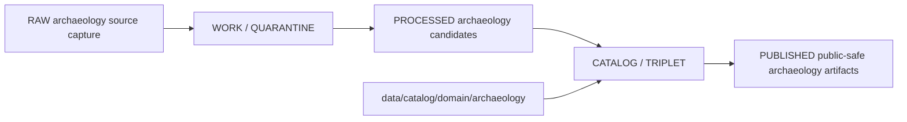

<!-- [KFM_META_BLOCK_V2]
doc_id: kfm://doc/data-catalog-domain-archaeology-readme
title: data/catalog/domain/archaeology/README.md — Archaeology Domain Catalog README
version: v0.1
type: readme; data-lifecycle-sublane; domain-catalog-guide
status: draft; PROPOSED; data-root; catalog-stage; archaeology; release-gated; sensitivity-deny-default
owners: OWNER_TBD — Archaeology steward · Data steward · Catalog steward · Evidence steward · Policy steward · Release steward · Cultural review steward · Docs steward
created: NEEDS VERIFICATION — planned-path scaffold existed before v0.1 expansion
updated: 2026-06-24
policy_label: public-doc; data; catalog; archaeology; lifecycle; release-gated; sensitivity-deny-default
tags: [kfm, data, catalog, archaeology, domain-catalog, CATALOG, TRIPLET, EvidenceBundle, ReviewRecord, RedactionReceipt, PublicationTransformReceipt, ReleaseManifest]
related:
  - ../../README.md
  - ../../../README.md
  - ../../../../docs/domains/archaeology/MISSING_OR_PLANNED_FILES.md
  - ../../../../docs/domains/archaeology/README.md
  - ../../../../docs/domains/archaeology/MAP_UI_CONTRACTS.md
  - ../../../../docs/doctrine/lifecycle-law.md
  - ../../../../docs/doctrine/trust-membrane.md
  - ../../../../contracts/domains/archaeology/
  - ../../../../schemas/contracts/v1/domains/archaeology/
  - ../../../../policy/domains/archaeology/
  - ../../../../policy/sensitivity/archaeology/
  - ../../../../release/
notes:
  - "Expanded from a planned-path scaffold at `data/catalog/domain/archaeology/README.md`."
  - "The archaeology planning ledger lists `data/catalog/domain/archaeology/` as an expected data lifecycle path and says path promotion requires mounted-repo evidence."
  - "Archaeology fails closed by default for exact site geometry, burial/human-remains, sacred sites, looting-risk exposure, collection security, and private-landowner details."
  - "This folder is a CATALOG-stage domain catalog lane; it is not RAW, WORK, QUARANTINE, PROCESSED, PUBLISHED, proof storage, release authority, schema authority, policy code, or implementation code."
  - "Rollback target for this expansion is previous scaffold blob SHA `6d7c19fd1fcc4cd896ac814781696f3ec8ba5e3e`."
[/KFM_META_BLOCK_V2] -->

# data/catalog/domain/archaeology

> Archaeology-specific domain catalog lane for governed catalog records and indexes inside the `CATALOG / TRIPLET` lifecycle stage.

  
  
  
  
  
  

**Status:** draft / PROPOSED  
**Owners:** OWNER_TBD — Archaeology steward · Data steward · Catalog steward · Evidence steward · Policy steward · Release steward · Cultural review steward · Docs steward  
**Path:** `data/catalog/domain/archaeology/README.md`  
**Owning root:** `data/catalog/domain/`  
**Domain segment:** `archaeology`  
**Lifecycle stage:** `CATALOG / TRIPLET`  
**Exposure posture:** RELEASED ONLY  
**Truth posture:** CONFIRMED target was a scaffold · CONFIRMED parent catalog lane is RELEASED ONLY · CONFIRMED archaeology planning ledger lists this path as expected/planned · CONFIRMED archaeology sensitivity posture is deny-default for sensitive location and cultural material · NEEDS VERIFICATION for concrete catalog records, schemas, validators, policy gates, receipts, ReviewRecord linkage, ReleaseManifest linkage, and public route behavior.

**Quick jumps:** [Purpose](#purpose) · [Lifecycle boundary](#lifecycle-boundary) · [Repo fit](#repo-fit) · [Accepted contents](#accepted-contents) · [Exclusions](#exclusions) · [Archaeology catalog requirements](#archaeology-catalog-requirements) · [Sensitivity guardrails](#sensitivity-guardrails) · [Evidence ledger](#evidence-ledger) · [Validation checklist](#validation-checklist) · [Rollback](#rollback)

---

## Purpose

`data/catalog/domain/archaeology/` stores or stages archaeology-domain catalog records and indexes that tie archaeology objects, evidence, review state, sensitivity transforms, source-role posture, release state, and catalog projections together.

Likely archaeology catalog records include domain-scoped entries for archaeological sites, site components, survey projects, survey transects, shovel tests, test units, excavation units, provenience context, stratigraphic units, artifact records, collection repository records, candidate features, LiDAR candidates, remote-sensing anomalies, geophysics observations, 3D documentation, chronology assertions, cultural review, steward review, and publication transform receipts.

A domain catalog record supports discovery, review, and release closure. It does **not** make an archaeology claim true, public, policy-admitted, evidence-supported, culturally reviewed, or released by itself.

## Lifecycle boundary

`data/catalog/domain/archaeology/` is a CATALOG-stage sublane. Public exposure applies only to records tied to approved release, governed route, sensitivity transform, rights/cultural review, and required receipts.

## Repo fit

| Responsibility | Correct home | Rule |
|---|---|---|
| Archaeology domain catalog records | `data/catalog/domain/archaeology/` | This lane. |
| Parent catalog stage | `data/catalog/` | Parent CATALOG-stage lane. |
| Archaeology STAC records | `data/catalog/stac/archaeology/` | Spatiotemporal catalog records, if accepted. |
| Archaeology DCAT records | `data/catalog/dcat/archaeology/` | Dataset/distribution catalog records, if accepted. |
| Archaeology PROV records | `data/catalog/prov/archaeology/` | Provenance catalog projection, if accepted. |
| Archaeology graph/triplet projections | `data/triplets/.../archaeology/` | Paired graph stage. |
| Archaeology proof/evidence | `data/proofs/` or accepted proof roots | EvidenceBundle and ProofPack. |
| Archaeology receipts | `data/receipts/` or accepted receipt roots | RedactionReceipt, PublicationTransformReceipt, ReviewRecord, RunReceipt, validation receipts. |
| Archaeology release decisions | `release/` | Publication authority. |
| Archaeology schemas and policy | `schemas/contracts/v1/domains/archaeology/`, `policy/domains/archaeology/`, `policy/sensitivity/archaeology/` | Separate roots; paths remain PROPOSED or CONFLICTED until verified. |

## Accepted contents

| Content | Purpose |
|---|---|
| Archaeology domain catalog records | Domain-scoped catalog entries for archaeology object families. |
| Catalog indexes | Steward-facing or release-linked lookup surfaces. |
| Release-linked catalog manifests | Pointers to release-approved archaeology catalog subsets. |
| Evidence and source pointers | References to EvidenceBundle, SourceDescriptor, receipts, and validation reports. |
| Sensitivity transform pointers | References to RedactionReceipt, PublicationTransformReceipt, generalized geometry, and review state. |
| Rights/cultural review pointers | References to ReviewRecord, rights posture, and cultural/steward review. |
| Catalog quality summaries | Summaries that point to validation reports and receipts. |

## Exclusions

| Do not put here | Correct home |
|---|---|
| Archaeology RAW source files | `data/raw/archaeology/` |
| Archaeology WORK/intermediate data | `data/work/archaeology/` |
| Archaeology quarantined data | `data/quarantine/archaeology/` |
| Archaeology processed datasets | `data/processed/archaeology/` |
| STAC records | `data/catalog/stac/archaeology/` if accepted |
| DCAT records | `data/catalog/dcat/archaeology/` if accepted |
| PROV records | `data/catalog/prov/archaeology/` if accepted |
| Triplets/graph edges | `data/triplets/.../archaeology/` |
| EvidenceBundle/proof records | `data/proofs/` or accepted proof roots |
| Receipts and review records | `data/receipts/`, governance/review roots, or accepted receipt homes |
| Release decisions | `release/` |
| Published archaeology products | `data/published/.../archaeology/` |
| Archaeology schemas | `schemas/contracts/v1/domains/archaeology/` |
| Archaeology policy rules | `policy/domains/archaeology/`, `policy/sensitivity/archaeology/` |
| Validators/tests/code | `tools/validators/`, `tests/`, implementation roots |

## Archaeology catalog requirements

PROPOSED until schema and validator are verified:

| Requirement | Meaning |
|---|---|
| Stable archaeology object identity | Catalog record must point to a stable object or product identity. |
| Evidence reference | EvidenceBundle/proof context must be referenced when claims depend on evidence. |
| Source reference | SourceDescriptor/source catalog must be referenced when source authority matters. |
| Review reference | Cultural/steward review state must be visible when required. |
| Sensitivity transform reference | Public-safe records must point to redaction/generalization transform receipts when sensitive material is transformed. |
| Policy reference | Policy/admissibility posture must be available when release or sensitivity depends on it. |
| Release reference | Public or release-linked records must point to the immutable ReleaseManifest. |
| Closure compatibility | STAC/DCAT/PROV/domain catalog agreement must hold for promoted releases where those projections exist. |

## Sensitivity guardrails

- Archaeology catalog records are catalog carriers, not archaeology source truth.
- Exact archaeological-site geometry, burial/human-remains context, sacred-site information, collection-security details, looting-risk details, and private-landowner information fail closed unless the release record and policy posture explicitly support a public-safe representation.
- Public catalog records should point to redacted or generalized outputs rather than precise restricted source material.
- Candidate features and remote-sensing anomalies must not be presented as confirmed sites without evidence and steward review.
- Rights, cultural review, steward authority, and sovereignty-sensitive obligations remain separate governance concerns.
- Unreleased archaeology catalog records are not public merely because they exist under this directory.

## Evidence ledger

| Source | Status | Supports | Limits |
|---|---|---|---|
| `data/catalog/domain/archaeology/README.md` previous file | CONFIRMED | Target existed as a planned-path scaffold. | Did not define catalog-stage boundaries. |
| `data/catalog/README.md` | CONFIRMED | Parent catalog lane, domain catalog layout, RELEASED ONLY posture. | Does not prove archaeology catalog inventory. |
| `docs/domains/archaeology/MISSING_OR_PLANNED_FILES.md` | CONFIRMED doctrine / PROPOSED realization | Planned archaeology files, sensitivity posture, expected data lifecycle/catalog path. | Many exact files, validators, and route names remain UNKNOWN/NEEDS VERIFICATION. |
| Archaeology contract file search | CONFIRMED repo evidence | Current repo contains archaeology contract docs for object-family meaning. | Search results alone do not prove schema/policy/test/release implementation completeness. |

## Validation checklist

- [ ] Confirm actual child files and domain catalog record inventory under this lane.
- [ ] Confirm archaeology domain catalog schema/profile location.
- [ ] Confirm archaeology catalog validator and CI checks.
- [ ] Confirm STAC/DCAT/PROV/domain catalog matrix closure where projections exist.
- [ ] Confirm ReleaseManifest linkage for public archaeology catalog records.
- [ ] Confirm EvidenceBundle, SourceDescriptor, ReviewRecord, RedactionReceipt, PublicationTransformReceipt, RunReceipt, and PolicyDecision references.
- [ ] Confirm exact-geometry, burial/human-remains, sacred-site, looting-risk, collection-security, private-landowner, rights, and cultural-review handling.
- [ ] Confirm correction, withdrawal, or supersession behavior for stale or failed archaeology catalog records.

## Rollback

Rollback is required if this lane becomes an archaeology source-data root, proof store, release-decision root, published-output root, schema root, policy root, validator root, implementation root, or public exposure shortcut.

Rollback target for this expansion: previous scaffold blob SHA `6d7c19fd1fcc4cd896ac814781696f3ec8ba5e3e`.

<a href="#top">Back to top</a>

