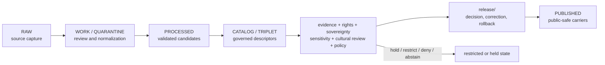

<!-- [KFM_META_BLOCK_V2]
doc_id: kfm://doc/data-catalog-domain-archaeology-readme
title: data/catalog/domain/archaeology/README.md — Governed Archaeology Catalog Lane
version: v0.2.0
type: readme; data-lifecycle-sublane; domain-catalog-guide; sensitivity-deny-default; release-gated
status: repository-grounded draft; canonical placement; proposed realization; catalog-stage; deny-by-default; release-gated
owners: NEEDS VERIFICATION — Archaeology, cultural and sovereignty review, data, catalog, evidence, source, sensitivity, policy, release, correction, rollback, schema, and docs stewards
created: NEEDS VERIFICATION — planned-path scaffold existed before v0.1 expansion
updated: 2026-07-24
policy_label: restricted-review; data-catalog; archaeology; cultural-heritage; deny-sensitive-precision-by-default; release-gated
current_path: data/catalog/domain/archaeology/README.md
historical_scaffold_blob: 6d7c19fd1fcc4cd896ac814781696f3ec8ba5e3e
prepared_under_prompt: KFM Markdown Modernization & GitHub Documentation Implementation Agent v4.0.0
review_packet_id: kfm-md-data-catalog-domain-archaeology-20260724
truth_posture: >
  CONFIRMED exact path, parent catalog posture, Archaeology doctrine and lifecycle
  documents, source/receipt/proof/release support lanes, Directory Rules placement,
  relevant draft or proposed ADRs, bounded workflow evidence, and repository-relative
  link targets / PROPOSED concrete catalog profile, record realization, deterministic
  validators, CatalogMatrix closure, and enforcement / UNKNOWN recursive record
  inventory, active producers and consumers, runtime reads, source-rights and cultural
  review closure, release integration, hosting, caches, public effects, correction
  handling, and rollback execution / NEEDS VERIFICATION accountable stewardship,
  accepted ADR decisions, schema/profile maturity, sensitivity-transform enforcement,
  release closure, and public-client exclusion
evidence_snapshot:
  repository: bartytime4life/Kansas-Frontier-Matrix
  base_ref: main
  base_commit: 8d4e407afb7747192740956f0c366504a6d21060
  prior_blob: 859c7ded28caceed9984ccf507bacb7bf9ffdbdc
  method: complete target and governing-neighbor reads plus bounded repository, workflow, and pull-request search; no recursive clone, protected-record sampling, runtime, deployment, host-render, or external controlled-system inspection
related:
  - ../README.md
  - ../../README.md
  - ../../../../docs/domains/archaeology/README.md
  - ../../../../docs/domains/archaeology/DATA_LIFECYCLE.md
  - ../../../../docs/domains/archaeology/CANONICAL_PATHS.md
  - ../../../../docs/domains/archaeology/SENSITIVITY.md
  - ../../../../docs/domains/archaeology/SOURCES.md
  - ../../../../docs/domains/archaeology/MISSING_OR_PLANNED_FILES.md
  - ../../../../docs/domains/archaeology/MAP_UI_CONTRACTS.md
  - ../../../../catalog/domain/archaeology/README.md
  - ../../../processed/archaeology/README.md
  - ../../../registry/sources/archaeology/README.md
  - ../../../receipts/archaeology/README.md
  - ../../../proofs/archaeology/README.md
  - ../../../rollback/archaeology/README.md
  - ../../../published/layers/archaeology/README.md
  - ../../../../contracts/domains/archaeology/README.md
  - ../../../../schemas/contracts/v1/domains/archaeology/README.md
  - ../../../../policy/domains/archaeology/README.md
  - ../../../../tests/domains/archaeology/README.md
  - ../../../../tests/domains/archaeology/test_catalog_closure.py
  - ../../../../tools/validators/archaeology/README.md
  - ../../../../tools/validators/domains/archaeology/README.md
  - ../../../../release/candidates/archaeology/README.md
  - ../../../../docs/adr/ADR-0010-deny-by-default-for-dna-rare-species-archaeology-infrastructure.md
  - ../../../../docs/adr/ADR-0011-receipts-vs-proofs-vs-manifests-vs-catalog-separation.md
  - ../../../../docs/adr/ADR-0015-data-published-_domain_-current-alias-is-governed-by-rollback_card.md
  - ../../../../docs/adr/ADR-0022-catalog-matrix--stac-+-dcat-+-prov-must-agree.md
  - ../../../../docs/doctrine/directory-rules.md
  - ../../../../.github/workflows/domain-archaeology.yml
  - ../../../../.github/CODEOWNERS
tags: [kfm, data, catalog, archaeology, cultural-heritage, domain-catalog, catalog-stage, triplet, evidence-bundle, source-descriptor, review-record, redaction-receipt, publication-transform-receipt, release-manifest, catalog-matrix, sovereignty, sensitivity, cite-or-abstain]
notes:
  - "The first twelve H2 sections follow the Directory Rules folder-README contract."
  - "All v0.1 heading fragments remain available through headings or explicit legacy anchors."
  - "The bounded evidence includes placeholder-only direct Archaeology tests, README-only validator lanes, and explicit validation/proof/release readiness holds; this README does not graduate them."
  - "The top-level catalog/domain/archaeology path is a non-authoritative compatibility redirect and remains outside this one-file change."
  - "This Markdown-only change creates no catalog record, evidence bundle, receipt, cultural decision, policy decision, release, publication, or public route."
  - "Static badges project verified documentation posture only; they do not assert schema, validator, CI, security, cultural review, release, or publication maturity."
[/KFM_META_BLOCK_V2] -->

<a id="top"></a>

# `data/catalog/domain/archaeology/` — Governed Archaeology Catalog Lane

> **One-line purpose.** Own Archaeology and Cultural Heritage catalog records and indexes at the `CATALOG / TRIPLET` stage while keeping source role, evidence, rights, sovereignty, sensitivity, cultural review, policy, release, correction, rollback, and public delivery independently governed.

[](#status)
[](#authority-level)
[](#lifecycle-and-authority-boundary)
[](#sensitivity-guardrails)
[](#sensitivity-guardrails)

> [!IMPORTANT]
> A catalog record supports discovery, review, interoperability, and release closure. Placement here does not make an Archaeology claim true, evidence-supported, rights-cleared, culturally authorized, policy-admitted, reviewed, released, or public. `EvidenceBundle`, `ReviewRecord`, transformation receipts, `PolicyDecision`, `ReleaseManifest`, correction state, and rollback remain separate governed objects.

> [!CAUTION]
> Exact or reverse-engineerable site locations, burial or human-remains context, sacred or culturally restricted knowledge, collection-security details, looting-risk information, and private-landowner details fail closed. Do not place protected substance in catalog metadata, examples, fixtures, logs, indexes, maps, screenshots, exports, search, caches, or generated language. Public clients receive only reviewed, released, public-safe derivatives through governed interfaces.

**Quick navigation:** [Purpose](#purpose) · [Authority](#authority-level) · [Status](#status) · [Belongs](#what-belongs-here) · [Exclusions](#what-does-not-belong-here) · [Inputs](#inputs) · [Outputs](#outputs) · [Validation](#validation) · [Review](#review-burden) · [Related](#related-folders) · [ADRs](#adrs) · [Last reviewed](#last-reviewed) · [Boundary](#lifecycle-and-authority-boundary) · [Requirements](#archaeology-catalog-requirements) · [Guardrails](#sensitivity-guardrails) · [Evidence](#evidence-basis) · [Closure](#projection-and-release-closure) · [Correction](#migration-correction-and-rollback) · [Verification](#open-verification-register) · [Done](#definition-of-done) · [No-loss](#no-loss-ledger)

## Purpose

`data/catalog/domain/archaeology/` owns governed Archaeology and Cultural Heritage catalog descriptors and indexes at the `CATALOG / TRIPLET` lifecycle stage. Records here connect stable object or product identities to bounded source roles, evidence, receipts, review posture, sensitivity transformations, policy state, catalog projections, release state, correction lineage, and rollback targets.

Likely record families include survey projects and transects, site candidates and components, shovel tests and excavation units, provenience and stratigraphic contexts, artifact and collection-repository records, chronology assertions, candidate features, geophysics observations, remote-sensing anomalies, LiDAR candidates, 3D documentation, and public-safe generalized products. Listing a family does not prove that its records, contract, schema, validator, evidence, cultural authorization, or release state exist.

## Authority level

**Canonical responsibility placement for Archaeology domain catalog records / repository-grounded draft / concrete profile and realization PROPOSED / not source, truth, cultural-authority, evidence, policy, release, or publication authority.**

This lane may carry catalog descriptors and governed references. It cannot replace Archaeology semantics under `contracts/`, machine shape under `schemas/`, admissibility under `policy/`, source identity and rights under `data/registry/`, process memory under `data/receipts/`, `EvidenceBundle` and proof support under `data/proofs/`, cultural or sovereignty authority in the appropriate reviewed system, release decisions under `release/`, or public-safe carriers under `data/published/`.

## Status

| Field | Bounded result |
|---|---|
| Path | `data/catalog/domain/archaeology/README.md` |
| Version | `v0.2.0` |
| Base evidence | `main@8d4e407afb7747192740956f0c366504a6d21060` |
| Prior blob | `859c7ded28caceed9984ccf507bacb7bf9ffdbdc` (`v0.1`) |
| Historical scaffold predecessor | `6d7c19fd1fcc4cd896ac814781696f3ec8ba5e3e` |
| Placement | `CONFIRMED` existing Archaeology child under the governed `data/catalog/domain/` responsibility root |
| Concrete domain catalog profile | `PROPOSED / NEEDS VERIFICATION` |
| Recursive record inventory | `UNKNOWN` |
| Active producers, consumers, runtime reads, hosts, caches, or public effects | `UNKNOWN` |
| Schema and validator maturity | `NEEDS VERIFICATION`; inspected validator lanes are documentation-only |
| Direct test maturity | `PLACEHOLDER-ONLY` in bounded workflow evidence |
| STAC/DCAT/PROV/domain agreement | `NEEDS VERIFICATION` |
| Rights, sovereignty, sensitivity-transform, and cultural-review closure | `NEEDS VERIFICATION` |
| Public exposure | `DENY BY DEFAULT / RELEASE-GATED / FAIL CLOSED` |
| Human review | `PENDING` |

The repository contains substantial Archaeology documentation and readiness surfaces. It does not follow that concrete catalog records, accepted closure logic, protected-data controls, cultural authorization, or public-safe delivery are operational.

<a id="accepted-contents"></a>

## What belongs here

Only governed catalog carriers belong here:

| Content | Admission boundary |
|---|---|
| Archaeology domain catalog records | Stable identity, version/digest posture, object scope, lifecycle state, source-role label, and accepted profile |
| Catalog indexes | Entries resolve to governed records; an index is not a new truth, location, or cultural-authority source |
| Release-linked catalog subsets | Immutable release reference, reviewed audience, sensitivity posture, correction path, and rollback target |
| Evidence and source pointers | Resolvable `EvidenceRef -> EvidenceBundle` and `SourceDescriptor` references where claims depend on them |
| Sensitivity-transform pointers | References to reviewed `RedactionReceipt`, `PublicationTransformReceipt`, generalized geometry, suppression state, and obligations without embedding protected detail |
| Cultural, rights, and steward-review pointers | Safe references and finite state; protected review substance stays in its approved controlled home |
| Validation summaries | References to accepted validation reports and receipts; summaries do not replace execution evidence |
| Cross-vocabulary links | Identity, digest, scope, source-role, sensitivity, and release-reference agreement where an accepted profile requires it |

README, inventory, digest, migration, and disposition sidecars may explain the lane without becoming catalog payload, evidence, policy, cultural authority, or release authority.

<a id="exclusions"></a>

## What does NOT belong here

| Do not put here | Governed home or disposition |
|---|---|
| RAW source captures | `data/raw/archaeology/` or an approved controlled source system |
| WORK intermediates, unreviewed joins, or protected working material | `data/work/archaeology/`, `data/quarantine/archaeology/`, or an approved restricted system |
| Processed datasets | [`data/processed/archaeology/`](../../../processed/archaeology/README.md) |
| Triplet or graph payloads | The accepted `data/triplets/.../archaeology/` lane |
| EvidenceBundle or proof payloads | [`data/proofs/archaeology/`](../../../proofs/archaeology/README.md) |
| Process receipts or protected review substance | [`data/receipts/archaeology/`](../../../receipts/archaeology/README.md) or an approved controlled review system |
| Release decisions or manifests | [`release/candidates/archaeology/`](../../../../release/candidates/archaeology/README.md) and accepted shared release-governance lanes |
| Published artifacts | [`data/published/layers/archaeology/`](../../../published/layers/archaeology/README.md) after governed release |
| Semantic contracts, JSON Schemas, or policy rules | Their governed `contracts/`, `schemas/`, or `policy/` roots |
| Validators, fixtures, tests, pipelines, or runtime code | Their owning implementation or test roots |
| Exact or reconstructable site detail, restricted cultural knowledge, review correspondence, credentials, private endpoints, unsafe logs, or protected payloads | Approved controlled systems; never an ordinary public-repository catalog path |
| AI-generated descriptions presented as evidence, cultural interpretation, confirmation, or approval | Resolve governed sources, evidence, authority, and review—or abstain |

## Inputs

Catalog construction may consume references to the following governed inputs; it does not take ownership of them:

- admitted `PROCESSED` Archaeology objects or public-safe product candidates;
- stable object, product, version, algorithm-qualified digest, spatial scope, temporal scope, and lifecycle identity;
- `SourceDescriptor` records with source role, rights, access, retrieval context, and limitations;
- `EvidenceRef -> EvidenceBundle` support for claim-bearing fields;
- sensitivity classification, reconstruction-risk assessment, and reviewed transform receipts where applicable;
- safe cultural, sovereignty, rights-holder, steward, and institutional review references and finite outcomes;
- accepted contract, schema/profile, vocabulary, identity, and compatibility rules;
- validation reports, process receipts, policy decisions, release-candidate state, correction lineage, and rollback targets appropriate to intended use.

Missing, stale, conflicted, revoked, inaccessible, unauthorized, or insufficient inputs remain visible as `HOLD`, `ABSTAIN`, `DENY`, `RESTRICT`, `ERROR`, `UNKNOWN`, or `NEEDS VERIFICATION`; they do not become implied success.

## Outputs

This lane may emit or maintain:

- governed Archaeology domain catalog records and deterministic indexes;
- safe cross-references to applicable STAC, DCAT, PROV, triplet, evidence, policy, review, and release projections;
- release-candidate catalog subsets that remain non-public until an immutable release decision closes;
- public-review-safe status and quality summaries that point to authoritative records;
- correction, withdrawal, supersession, and dependency references needed to prevent stale discovery;
- inspectable catalog build and validation references without collapsing receipt, proof, policy, review, or release authority.

It emits no source observation, cultural decision, policy permission, release approval, runtime response, public route, or published artifact by placement alone.

<a id="validation-checklist"></a>

## Validation

### Documentation packet

- [x] One H1 and exact first-twelve-H2 Directory Rules order.
- [x] All v0.1 heading fragments preserved through headings or explicit anchors.
- [x] Canonical path checked against Directory Rules §§12–15 and current parent catalog evidence.
- [x] Repository-relative links target files verified at the pinned base.
- [x] Lifecycle diagram keeps review and release between catalog/triplet and publication.
- [x] Catalog, source, evidence, receipt, proof, cultural review, policy, release, correction, rollback, and public-delivery authorities remain separate.
- [x] Protected precision is absent from the documentation packet.
- [x] Current maturity and missing implementation evidence are stated without upgrading them.

### Catalog-record gate — PROPOSED until accepted and executable

- [ ] Validate a closed Archaeology catalog schema/profile and semantic contract.
- [ ] Resolve deterministic identity, version, digest, lifecycle state, spatial/temporal scope, and source role.
- [ ] Resolve `EvidenceRef -> EvidenceBundle` for claim-bearing material or abstain.
- [ ] Validate rights, access, sovereignty, sensitivity, cultural/steward review, and applicable transformation obligations.
- [ ] Reject protected precision and reconstruction paths across fields, IDs, joins, tiles, indexes, search, caches, screenshots, exports, and generated text.
- [ ] Distinguish candidates, observations, interpretations, confirmed claims, cultural authority, and public-safe derivatives.
- [ ] Validate applicable domain/STAC/DCAT/PROV/triplet identity and digest agreement.
- [ ] Resolve policy, release, correction, withdrawal, supersession, expiry, and rollback state for public-bound records.
- [ ] Test positive and negative synthetic fixtures without real protected material or network dependence.
- [ ] Deny candidate, restricted, stale, withdrawn, superseded, or unreleased records to public clients.

Current repository evidence shows placeholder-only direct Archaeology test modules, README-only validator lanes, and a `domain-archaeology` workflow that records explicit validation, proof, and release-dry-run holds. Those holds are maturity evidence, not successful domain validation.

## Review burden

README-only clarification requires documentation, Archaeology, and catalog/data review. Any change affecting object meaning, source role, rights, sovereignty, cultural authority, site status, spatial precision, sensitivity, transform behavior, policy, schema, validation, lifecycle promotion, release, correction, rollback, public routing, or generated language requires the corresponding accountable specialist review and evidence.

For release-significant work, authoring, cultural or rights-holder review, sensitivity/policy review, and release approval should remain distinct when the accepted governance model requires separation of duties. The current [`CODEOWNERS`](../../../../.github/CODEOWNERS) wildcard routes GitHub review to `@bartytime4life`; it does not establish stewardship, cultural authority, specialist review, decision quorum, independent approval, or publication permission.

<a id="repo-fit"></a>

## Related folders

| Responsibility | Verified path | Boundary |
|---|---|---|
| Parent catalog contract | [`data/catalog/`](../../README.md) | Canonical CATALOG responsibility; not release authority |
| Domain catalog parent | [`data/catalog/domain/`](../README.md) | Domain-lane routing and shared catalog posture |
| Archaeology documentation | [`docs/domains/archaeology/`](../../../../docs/domains/archaeology/README.md) | Human-facing doctrine; not data, schema, policy, or release authority |
| Processed inputs | [`data/processed/archaeology/`](../../../processed/archaeology/README.md) | Upstream validated candidates; not public truth |
| Source registry | [`data/registry/sources/archaeology/`](../../../registry/sources/archaeology/README.md) | Source identity, rights, access, and role |
| Receipts | [`data/receipts/archaeology/`](../../../receipts/archaeology/README.md) | Process memory and safe review references; not proof or release |
| Proof support | [`data/proofs/archaeology/`](../../../proofs/archaeology/README.md) | EvidenceBundle and claim-support lane; restricted by default |
| Data-plane rollback support | [`data/rollback/archaeology/`](../../../rollback/archaeology/README.md) | Alias-revert and affected-artifact support; not release decision authority |
| Published map carriers | [`data/published/layers/archaeology/`](../../../published/layers/archaeology/README.md) | Released public-safe derivatives only |
| Semantic contracts | [`contracts/domains/archaeology/`](../../../../contracts/domains/archaeology/README.md) | Object meaning |
| Machine schemas | [`schemas/contracts/v1/domains/archaeology/`](../../../../schemas/contracts/v1/domains/archaeology/README.md) | Machine shape |
| Domain policy | [`policy/domains/archaeology/`](../../../../policy/domains/archaeology/README.md) | Admissibility and obligations; current maturity remains bounded |
| Domain tests | [`tests/domains/archaeology/`](../../../../tests/domains/archaeology/README.md) | Verification boundary; sampled direct modules remain placeholder-backed |
| Validator surfaces | [`tools/validators/archaeology/`](../../../../tools/validators/archaeology/README.md) and [`tools/validators/domains/archaeology/`](../../../../tools/validators/domains/archaeology/README.md) | Both inspected lanes are README-only; ownership and executable topology need resolution |
| Release candidates | [`release/candidates/archaeology/`](../../../../release/candidates/archaeology/README.md) | Pre-publication review; candidate is not release |
| Compatibility redirect | [`catalog/domain/archaeology/`](../../../../catalog/domain/archaeology/README.md) | Non-authoritative redirect; deny new trust-bearing writes |

The expected `policy/sensitivity/archaeology/`, `release/archaeology/`, catalog-fixture, and catalog-closure child README paths were not found at the pinned base. Their absence is evidence of a verification or design gap, not authorization to create parallel homes from this README.

## ADRs

| Decision record | Observed state | Relevance |
|---|---:|---|
| [`ADR-0010 — Deny-by-Default for DNA, Rare Species, Archaeology, and Critical Infrastructure`](../../../../docs/adr/ADR-0010-deny-by-default-for-dna-rare-species-archaeology-infrastructure.md) | source metadata `draft`; effective decision `proposed` | Supports operation-specific denial of protected precision and cultural substance; does not prove acceptance or enforcement |
| [`ADR-0011 — Receipts vs Proofs vs Manifests vs Catalog Separation`](../../../../docs/adr/ADR-0011-receipts-vs-proofs-vs-manifests-vs-catalog-separation.md) | `proposed` | Supports `receipt != proof != catalog != policy/release/publication`; does not prove runtime separation |
| [`ADR-0015 — Published Domain Current Alias Governed by RollbackCard`](../../../../docs/adr/ADR-0015-data-published-_domain_-current-alias-is-governed-by-rollback_card.md) | source metadata `draft`; effective decision `proposed` | Informs separation of release-plane rollback authority from data-plane alias support; does not prove acceptance, an alias, or executable rollback |
| [`ADR-0022 — Catalog Matrix · STAC + DCAT + PROV Must Agree`](../../../../docs/adr/ADR-0022-catalog-matrix--stac-+-dcat-+-prov-must-agree.md) | `proposed` | Supports release-level identity, digest, and release-reference agreement; does not prove an executable Archaeology closure resolver |

[`Directory Rules`](../../../../docs/doctrine/directory-rules.md) §12 places Archaeology as a lane inside responsibility roots; §13 prevents parallel authority; §14 governs reversible migration; §15 defines this folder-README contract.

## Last reviewed

**2026-07-24** against `main@8d4e407afb7747192740956f0c366504a6d21060`.

Review again after six months, or sooner if the parent catalog contract, Archaeology doctrine, source rights, cultural or sovereignty obligations, sensitivity tiers, geometry rules, catalog profile, relevant ADR status, workflows, producers, consumers, public routes, release process, correction process, or rollback path changes.

<a id="lifecycle-boundary"></a>

## Lifecycle and authority boundary


```mermaid
flowchart LR
    RAW["RAW<br/>source capture"] --> WORK["WORK / QUARANTINE<br/>review and normalization"]
    WORK --> PROCESSED["PROCESSED<br/>validated candidates"]
    PROCESSED --> CATALOG["CATALOG / TRIPLET<br/>governed descriptors"]
    CATALOG --> REVIEW["evidence + rights + sovereignty<br/>sensitivity + cultural review + policy"]
    REVIEW --> RELEASE["release/<br/>decision, correction, rollback"]
    RELEASE --> PUBLISHED["PUBLISHED<br/>public-safe carriers"]
    REVIEW -->|hold / restrict / deny / abstain| QUARANTINE["restricted or held state"]
```

Promotion is a governed state transition, not a file move. `CATALOG / TRIPLET` is neither proof nor publication. Review and release are explicit gates before any `PUBLISHED` carrier. Public clients, maps, exports, APIs, search, stories, and AI surfaces consume governed responses or released public-safe artifacts—not this canonical internal lane.

## Archaeology catalog requirements

The profile below is **PROPOSED** until accepted contracts, schemas, fixtures, validators, policy, and negative tests establish it.

| Gate | Required posture | Failure outcome |
|---|---|---|
| Identity | Stable catalog, object/product, version, digest, lifecycle, and correction identity | `HOLD` or `DENY` |
| Lifecycle | No skip across `RAW -> WORK/QUARANTINE -> PROCESSED -> CATALOG/TRIPLET -> PUBLISHED` | `DENY` |
| Source role | Resolvable `SourceDescriptor`; survey, excavation, collection, oral-history, cultural-knowledge, remote-sensing, and registry roles remain distinct | `ABSTAIN`, `RESTRICT`, or `DENY` |
| Evidence | `EvidenceRef` resolves to admissible `EvidenceBundle` where claims depend on evidence | `ABSTAIN`, `HOLD`, or `DENY` |
| Candidate status | Candidate feature, anomaly, LiDAR candidate, or modeled interpretation cannot silently become a confirmed site or cultural claim | `DENY` |
| Rights and sovereignty | Applicable rights, access, consent, cultural authority, and sovereignty state are explicit and current | `RESTRICT`, `HOLD`, or `DENY` |
| Sensitivity and reconstruction risk | Precision and joins are reviewed across all fields, relations, indexes, media, and delivery channels | `RESTRICT`, `HOLD`, or `DENY` |
| Transform | Public-safe derivatives resolve reviewed redaction/generalization/publication transform receipts and preserve information-loss lineage | `HOLD` or `DENY` |
| Catalog agreement | Applicable domain, STAC, DCAT, PROV, triplet, and matrix identities/digests/release refs agree under an accepted profile | `DENY` |
| Validation | Accepted validator versions, synthetic fixtures, reports, and receipts resolve; skipped or TODO checks remain visible | `HOLD` |
| Review and policy | Accountable cultural/steward and policy decisions are distinct from catalog construction and source possession | `HOLD` or `DENY` |
| Release | Public-use record resolves an immutable release decision and released public-safe carrier | `HOLD` |
| Correction and rollback | Correction path, downstream dependency scope, expiry/revocation state, and rollback target are explicit | `HOLD` |

## Sensitivity guardrails

1. **Sensitive precision fails closed.** Exact or reverse-engineerable site geometry, burial and human-remains context, sacred or culturally restricted material, collection-security details, looting-risk information, and private-landowner data must not enter public-readable catalog surfaces.
2. **Catalog metadata cannot leak more than the carrier.** Titles, descriptions, identifiers, bounding boxes, temporal clues, attributes, related-record links, thumbnails, tiles, indexes, search, and generated summaries require the same reconstruction-risk review as geometry.
3. **Cultural authority remains separate.** Rights, sovereignty, cultural review, steward authority, consent, institutional custody, policy, and public-release review are distinct gates. Possession, documentation, schema validity, or catalog presence satisfies none of them.
4. **Candidate is not confirmed.** Remote-sensing anomalies, geophysics observations, LiDAR candidates, candidate features, and unverified reports retain candidate or observation state until evidence and appropriate review support a narrower claim.
5. **Absence is bounded.** Survey coverage or a catalog gap does not prove the absence of a site, cultural significance, or protected knowledge.
6. **Source roles do not collapse.** Survey, excavation, collection, oral-history, cultural-knowledge, remote-sensing, archival, registry, and modeled sources retain distinct provenance, limits, time, rights, and authority.
7. **Generalized output is a derivative.** Redaction, suppression, buffering, aggregation, generalization, withholding, or delayed release preserves input/output identity, method/profile, information loss, reason, reviewer, digest, obligations, correction, and rollback lineage.
8. **Public status elsewhere is not KFM permission.** An externally visible record does not automatically resolve source terms, cultural authority, landowner sensitivity, human-remains obligations, re-identification risk, or KFM release review.
9. **Protected reasons remain safe.** Public denial, hold, or abstention messages use bounded reason codes and never reveal the protected fact they are withholding.
10. **AI remains interpretive.** Generated language, classification, reconstruction, translation, or site suggestion cannot become evidence, cultural interpretation, confirmation, or approval. Resolve governed support and policy first—or narrow and abstain.

<a id="evidence-ledger"></a>

## Evidence basis

| Evidence | Status | Supports | Does not prove |
|---|---:|---|---|
| Exact target and prior blob | `CONFIRMED` | In-place v0.1 modernization with preserved identity and scaffold lineage | Recursive record inventory or runtime behavior |
| Parent `data/catalog/README.md` and `data/catalog/domain/README.md` | `CONFIRMED document posture` | Catalog-stage, release-gated responsibility | Complete child inventory or enforcement |
| Archaeology domain README, lifecycle, canonical paths, sensitivity, sources, planning ledger, and Map/UI contracts | `CONFIRMED document presence; mixed doctrine/proposal status` | Object families, source roles, exact-location denial, lifecycle, and public-client posture | Concrete record validity, current rights, accepted routes, or public behavior |
| Archaeology source registry, receipt, proof, processed, rollback, and published-layer READMEs | `CONFIRMED paths` | Separate support lanes and documented responsibilities | Complete or admissible emitted records |
| Contracts, schemas, policy, tests, and validator READMEs | `CONFIRMED paths; mixed maturity` | Intended meaning, shape, admissibility, and verification surfaces | Accepted production profile or deterministic enforcement |
| `tests/domains/archaeology/test_catalog_closure.py` | `CONFIRMED docstring-only placeholder` | A named closure-test path exists | A collected test case, validator, or closure result |
| `domain-archaeology` workflow | `CONFIRMED readiness surface` | Explicit validation, proof, and release-dry-run holds; read-only non-publisher posture | Archaeology validation, proof closure, cultural review, release readiness, or publication |
| Archaeology release-candidate README | `CONFIRMED path; no approved candidate established` | Explicit pre-publication boundary and deny-default posture | Manifest, release approval, or publication |
| Top-level compatibility redirect | `CONFIRMED non-authoritative redirect` | Canonical counterpart routing and deny-new-writes posture | Migration completion, recursive payload absence, or public exclusion |
| Directory Rules §§12–15 | `CONFIRMED doctrine` | Responsibility-root placement, drift prevention, migration, and README order | Full repository compliance |
| ADR-0010, ADR-0011, and ADR-0022 | `CONFIRMED documents; draft/proposed decisions` | Bounded deny-default, authority separation, and closure intent | Acceptance or working enforcement |
| Open-PR search | `CONFIRMED bounded search` | No overlapping open target PR at the inspection point | Historical, renamed, or externally hosted work outside the search |

`EvidenceBundle` outranks generated language and catalog presentation. Cultural authority, rights, sensitivity, policy, and release remain independently necessary. If a claim cannot resolve governed support appropriate to its significance and audience, narrow scope or abstain.

## Projection and release closure

```text
domain record validity
  != STAC / DCAT / PROV agreement
  != evidence closure
  != cultural or rights-holder authorization
  != sensitivity-transform approval
  != policy permission
  != release approval
  != publication
```

When multiple projections exist, they should agree on the same effective object or released derivative, algorithm-qualified digest, release reference, source role, candidate/confirmed state, spatial and temporal scope, rights/access posture, sensitivity transforms, review status, and correction state. A `CatalogMatrix` may describe that agreement; a separate validation report proves what was checked; separate review and policy records decide admissibility; a separate release decision authorizes exposure.

Identity, digest, release-reference, candidate-state, evidence, rights, sovereignty, sensitivity, protected-precision, review, restricted-public, withdrawn, and correction contradictions fail closed for public-bound records. There is no documentation-only, client-hiding, or warn-only bypass for release-significant disagreement.

<a id="rollback"></a>

## Migration, correction, and rollback

1. Freeze the target ref, blobs, catalog profile, record inventory, writers, consumers, projections, releases, and public surfaces without copying protected payloads into review artifacts.
2. Classify every object by family, candidate/confirmed state, source role, lifecycle state, rights, sovereignty, sensitivity, evidence, transform, review, policy, release, correction, expiry/revocation, and rollback state.
3. Accept a disposition before moving, renaming, mirroring, regenerating, or deleting catalog records.
4. Stop unsafe producers and public consumers with executable negative validation and cache/index invalidation.
5. Preserve deterministic identity, version, digest, source/evidence lineage, review and transform references, release references, and historical correction state.
6. Regenerate sibling projections and agreement packets from governed inputs; do not hand-edit competing authority surfaces into apparent agreement.
7. Validate catalog profile, domain semantics, candidate/confirmed state, STAC/DCAT/PROV/triplet parity, evidence, rights, sovereignty, sensitivity, review, policy, release, and public-safe representation.
8. Correct downstream indexes, caches, maps, exports, APIs, stories, citations, and AI retrieval surfaces when stale, unsafe, or invalid records were consumed.
9. Rehearse rollback to the prior record set and public artifact without deleting audit history, re-exposing protected detail, or recreating parallel authority.

Before merge, rollback of this README update means closing the draft pull request and abandoning its branch. After merge, use a transparent revert commit or revert pull request. The historical scaffold blob `6d7c19fd1fcc4cd896ac814781696f3ec8ba5e3e` remains lineage evidence, not the preferred operational rollback target for a later merged revision.

## Open verification register

| Item | Status | Required evidence |
|---|---:|---|
| Recursive catalog-record inventory | `UNKNOWN` | Trusted checkout plus generated, LFS, hosted, indexed, cached, and external-reference classification without exposing protected content |
| Active writers, readers, APIs, maps, search, exports, AI retrieval, hosts, and caches | `UNKNOWN` | Code, configuration, workflow, runtime, hosting, and observability evidence |
| Accepted Archaeology domain catalog profile | `NEEDS VERIFICATION` | Reviewed semantic contract, schema, examples, compatibility policy, and ownership |
| Deterministic record and index producers | `NEEDS VERIFICATION` | Source/config/spec/code/run identity, receipts, digests, synthetic fixtures, and reproducibility evidence |
| Placeholder direct-test graduation | `NOT ESTABLISHED` | Accepted validator, synthetic positive/negative fixtures, collected no-network tests, and required workflow wiring |
| Validator-lane ownership | `CONFLICTED / NEEDS VERIFICATION` | Accepted distinction or migration between `tools/validators/archaeology/` and `tools/validators/domains/archaeology/` |
| Source descriptors, rights, access, sovereignty, and source-role closure | `NEEDS VERIFICATION` | Current per-source records, terms and authority review, retrieval context, revocation handling, and negative cases |
| Sensitivity, reconstruction-risk, redaction, and publication-transform enforcement | `NEEDS VERIFICATION` | Contracts, schemas, policy, executable validators, receipts, profiles, thresholds, and specialist review evidence |
| EvidenceRef-to-EvidenceBundle resolution | `NEEDS VERIFICATION` | Resolver, synthetic fixtures, negative tests, proof records, and required gate |
| STAC/DCAT/PROV/domain/triplet agreement | `NEEDS VERIFICATION` | Emitted records, CatalogMatrix profile, resolver, report, failure fixtures, and CI/promotion wiring |
| Release, correction, withdrawal, supersession, expiry, revocation, and rollback closure | `NEEDS VERIFICATION` | Immutable records, consumer behavior, public-artifact mapping, invalidation proof, and rollback drill |
| Public-client and canonical-store separation | `UNKNOWN` | Governed API, route, map, search, export, hosting, cache, and deny-path tests |
| Accountable cultural, sovereignty, sensitivity, policy, and release stewardship | `NEEDS VERIFICATION` | Approved assignments, authority basis, required-review controls, separation of duties, and completed review records |
| Missing expected child paths | `NOT FOUND AT PINNED BASE` | Accepted disposition for sensitivity-policy, release-domain, catalog-fixture, and catalog-closure sublanes without creating parallel authority |
| GitHub-rendered Mermaid and badge behavior | `PENDING` | Host render observation on the draft pull request |

## Definition of done

This README upgrade is complete when the document passes source validation and accountable human review. The Archaeology catalog lane itself is operationally complete only when:

- actual records, indexes, writers, consumers, hosts, caches, projections, and public effects are safely inventoried;
- the Archaeology domain catalog contract, schema/profile, compatibility policy, producers, synthetic fixtures, validators, and required checks are accepted and executable;
- every claim-bearing record resolves source role, evidence, rights, sovereignty, sensitivity, transforms, review, policy, release, correction, expiry/revocation, and rollback appropriate to its significance and audience;
- exact or reverse-engineerable location and protected cultural substance cannot enter public-readable records, logs, fixtures, indexes, maps, media, caches, exports, or generated language;
- candidate features and observations cannot be presented as confirmed sites, cultural interpretation, or public authorization;
- domain, STAC, DCAT, PROV, triplet, evidence, review, policy, and release views agree without collapsing their authority roles;
- candidate, restricted, stale, withdrawn, superseded, revoked, expired, or unreleased records cannot reach public clients;
- public consumers use governed interfaces and released public-safe artifacts, not canonical catalog storage;
- correction, withdrawal, supersession, invalidation, and rollback are tested without rewriting history or exposing protected details.

A polished README, passing parser, green readiness workflow, valid schema, or catalog record alone does not establish these conditions.

## No-loss ledger

| v0.1 material | v0.2.0 disposition |
|---|---|
| Stable path, `doc_id`, creation note, scaffold blob, and final newline | Preserved |
| Archaeology catalog purpose and `CATALOG / TRIPLET` boundary | Preserved and strengthened |
| Repo-fit routing and accepted/excluded families | Preserved in the ordered folder contract and related-path table |
| Archaeology catalog requirements | Preserved and expanded with finite failure outcomes and correction semantics |
| Exact-location, burial/human-remains, sacred-site, looting-risk, collection-security, and private-landowner guardrails | Preserved and strengthened with reconstruction-risk and delivery-channel controls |
| Candidate-feature and remote-sensing distinction | Preserved and expanded into source-role and confirmation rules |
| Evidence ledger | Preserved and refreshed to a pinned repository base |
| Validation checklist | Preserved and expanded into documentation and catalog-record validation |
| Rollback guidance and historical scaffold target | Preserved with a safer operational rollback distinction |
| Legacy heading fragments | Preserved through headings or explicit anchors |
| Payload, record, source, schema, policy, workflow, release, publication, or runtime state | Unchanged |

### Change history

#### v0.2.0 — 2026-07-24

- aligned the first twelve H2 sections with the Directory Rules §15 folder-README contract;
- preserved document identity, scaffold lineage, legacy anchors, object families, and Archaeology-specific sensitivity guardrails;
- refreshed the evidence boundary to a pinned repository base and verified support paths;
- added evidence-linked badges, catalog and release closure, correction semantics, and an open verification register;
- strengthened rights, sovereignty, candidate-state, protected-precision, cultural-review, public-client, and reconstruction-risk boundaries;
- changed one Markdown file and no catalog record, source, evidence, receipt, cultural decision, schema, policy, workflow, release, publication, or runtime state.

#### v0.1 — 2026-06-24

- expanded the planned-path scaffold into the first Archaeology catalog-lane guide;
- established lifecycle, object-family, sensitivity, evidence, validation, and rollback documentation.

<p align="right"><a href="#top">Back to top</a></p>
