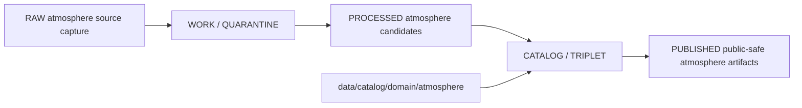

<!-- [KFM_META_BLOCK_V2]
doc_id: kfm://doc/data-catalog-domain-atmosphere-readme
title: data/catalog/domain/atmosphere/README.md — Atmosphere Domain Catalog README
version: v0.1
type: readme; data-lifecycle-sublane; domain-catalog-guide
status: draft; PROPOSED; data-root; catalog-stage; atmosphere; release-gated; source-role-aware
owners: OWNER_TBD — Atmosphere steward · Air-quality steward · Data steward · Catalog steward · Evidence steward · Policy steward · Release steward · Schema steward · Docs steward
created: NEEDS VERIFICATION — blank placeholder existed before v0.1 expansion
updated: 2026-06-24
policy_label: public-doc; data; catalog; atmosphere; lifecycle; release-gated
tags: [kfm, data, catalog, atmosphere, air, domain-catalog, CATALOG, TRIPLET, PM25Observation, AirObservation, EvidenceBundle, SourceDescriptor, ReleaseManifest, CatalogBuildReceipt]
related:
  - ../README.md
  - ../../README.md
  - ../../../../docs/domains/atmosphere/README.md
  - ../../../../contracts/domains/atmosphere/PM25Observation.md
  - ../../../../policy/domains/atmosphere/
  - ../../../../schemas/contracts/v1/domains/atmosphere/
  - ../../../../data/proofs/
  - ../../../../data/receipts/
  - ../../../../release/
  - ./pm25_2026/README.md
notes:
  - "This file replaces a blank placeholder at `data/catalog/domain/atmosphere/README.md`."
  - "Atmosphere README identifies `data/catalog/domain/atmosphere/` as the CATALOG lane for atmosphere records."
  - "This folder is a CATALOG-stage domain catalog lane; it is not RAW, WORK, QUARANTINE, PROCESSED, PUBLISHED, proof storage, release authority, schema authority, policy code, or implementation code."
  - "Rollback target for this replacement is previous blank blob SHA `8b137891791fe96927ad78e64b0aad7bded08bdc`."
[/KFM_META_BLOCK_V2] -->

# data/catalog/domain/atmosphere

> Atmosphere-domain catalog lane for governed catalog records and indexes inside the `CATALOG / TRIPLET` lifecycle stage.

  
  
  
  
  

**Status:** draft / PROPOSED  
**Owners:** OWNER_TBD — Atmosphere steward · Air-quality steward · Data steward · Catalog steward · Evidence steward · Policy steward · Release steward · Schema steward · Docs steward  
**Path:** `data/catalog/domain/atmosphere/README.md`  
**Owning root:** `data/catalog/domain/`  
**Domain segment:** `atmosphere`  
**Lifecycle stage:** `CATALOG / TRIPLET`  
**Exposure posture:** RELEASED ONLY  
**Truth posture:** CONFIRMED target was blank · CONFIRMED parent catalog lane is RELEASED ONLY · CONFIRMED Atmosphere README identifies `data/catalog/domain/atmosphere/` as the CATALOG lane · CONFIRMED Atmosphere object families include air-quality, smoke/AOD, weather, climate, forecast, and advisory-context records · NEEDS VERIFICATION for concrete catalog records, schemas, validators, policy gates, receipts, ReleaseManifest linkage, and governed route behavior.

**Quick jumps:** [Purpose](#purpose) · [Lifecycle boundary](#lifecycle-boundary) · [Repo fit](#repo-fit) · [Accepted contents](#accepted-contents) · [Exclusions](#exclusions) · [Atmosphere catalog requirements](#atmosphere-catalog-requirements) · [Source-role guardrails](#source-role-guardrails) · [Known child lanes](#known-child-lanes) · [Evidence ledger](#evidence-ledger) · [Validation checklist](#validation-checklist) · [Rollback](#rollback)

---

## Purpose

`data/catalog/domain/atmosphere/` stores or stages Atmosphere/Air-domain catalog records and indexes that tie atmosphere object families, sources, evidence, receipts, policy posture, release state, and catalog projections together.

Likely catalog records include air stations, air observations, PM2.5 observations, ozone observations, smoke context, AOD rasters, weather stations, weather observations, wind fields, precipitation observations, temperature observations, climate normals, climate anomalies, forecast context, and advisory context.

A domain catalog record supports discovery, review, and release closure. It does **not** make an Atmosphere claim true, public, policy-admitted, evidence-supported, or released by itself.

## Lifecycle boundary

`data/catalog/domain/atmosphere/` is a CATALOG-stage sublane. Public exposure applies only to records tied to an approved release, governed route, policy-safe source role, source rights, and required receipts.

## Repo fit

| Responsibility | Correct home | Rule |
|---|---|---|
| Atmosphere domain catalog records | `data/catalog/domain/atmosphere/` | This lane. |
| Parent catalog stage | `data/catalog/` | Parent CATALOG-stage lane. |
| Atmosphere STAC records | `data/catalog/stac/atmosphere/` | Spatiotemporal catalog records, if accepted. |
| Atmosphere DCAT records | `data/catalog/dcat/atmosphere/` | Dataset/distribution catalog records, if accepted. |
| Atmosphere PROV records | `data/catalog/prov/atmosphere/` | Provenance catalog projection, if accepted. |
| Atmosphere graph/triplet projections | `data/triplets/.../atmosphere/` | Paired graph stage. |
| Atmosphere proof/evidence | `data/proofs/` | EvidenceBundle and proof records. |
| Atmosphere receipts | `data/receipts/` | CatalogBuildReceipt, RunReceipt, ValidationReport, PolicyDecision, correction receipts. |
| Atmosphere release decisions | `release/` | Publication authority. |
| Atmosphere schemas and policy | `schemas/contracts/v1/domains/atmosphere/`, `policy/domains/atmosphere/` | Separate roots; slug/status remains NEEDS VERIFICATION. |

## Accepted contents

| Content | Purpose |
|---|---|
| Atmosphere domain catalog records | Domain-scoped catalog entries for atmosphere object families. |
| Catalog indexes | Steward-facing or release-linked lookup surfaces. |
| Dataset family folders | Dataset-specific catalog groupings such as `pm25_2026/`. |
| Source references | Pointers to SourceDescriptor/source registry entries. |
| Evidence references | Pointers to EvidenceBundle/proof context. |
| Receipt references | CatalogBuildReceipt, RunReceipt, ValidationReport, PolicyDecision, correction/supersession pointers. |
| Release references | Links to ReleaseManifest and rollback target when public or release-linked. |
| Quality/freshness summaries | Catalog summaries that point to validation reports and receipts. |

## Exclusions

| Do not put here | Correct home |
|---|---|
| RAW Atmosphere source files | `data/raw/atmosphere/` |
| WORK/intermediate data | `data/work/atmosphere/` |
| Quarantined data | `data/quarantine/atmosphere/` |
| Processed datasets | `data/processed/atmosphere/` |
| STAC/DCAT/PROV records | `data/catalog/stac/`, `data/catalog/dcat/`, `data/catalog/prov/` if accepted for a dataset |
| Triplets/graph edges | `data/triplets/.../atmosphere/` |
| EvidenceBundle/proof records | `data/proofs/` |
| Receipts | `data/receipts/` |
| Release decisions | `release/` |
| Published public products | `data/published/.../atmosphere/` |
| Schemas | `schemas/` |
| Policy rules | `policy/` |
| Validators/tests/code | `tools/validators/`, `tests/`, implementation roots |

## Atmosphere catalog requirements

PROPOSED until schema and validator are verified:

| Requirement | Meaning |
|---|---|
| Stable atmosphere object identity | Catalog record must point to a stable object, layer, dataset, or product identity. |
| Source role | Record must preserve whether material is observation, report/index, model field, advisory context, satellite proxy, or other role. |
| Evidence reference | EvidenceBundle/proof context must be referenced when claims depend on evidence. |
| Source reference | SourceDescriptor/source catalog must be referenced when source authority matters. |
| Policy reference | Policy/admissibility posture must be available when public display, caveat, freshness, or rights posture matters. |
| Release reference | Public or release-linked records must point to the immutable ReleaseManifest. |
| Closure compatibility | Domain catalog, STAC, DCAT, and PROV agreement must hold for promoted releases where those projections exist. |

## Source-role guardrails

- Atmosphere catalog records are catalog carriers, not measurement truth.
- AQI is not raw concentration.
- AOD is not PM2.5.
- Model fields and forecasts must remain labeled as model or forecast context.
- Advisory context must keep official-source and role boundaries visible.
- Low-cost sensor data requires correction, caveats, confidence, limitations, policy posture, and source rights before public use.
- Unreleased Atmosphere catalog records are not public merely because they exist under this directory.

## Known child lanes

| Child lane | Status | Purpose |
|---|---|---|
| `pm25_2026/` | draft / PROPOSED | Dataset-family catalog lane for proposed 2026 PM2.5 records. |

Additional dataset-family child lanes should be added only after source, schema, policy, receipt, and release expectations are clear enough to avoid creating misleading authority.

## Evidence ledger

| Source | Status | Supports | Limits |
|---|---|---|---|
| `data/catalog/domain/atmosphere/README.md` previous file | CONFIRMED | Target existed as a blank placeholder. | Did not define lane boundaries. |
| `data/catalog/README.md` | CONFIRMED | Parent catalog lane, domain catalog layout, RELEASED ONLY posture. | Does not prove Atmosphere catalog inventory. |
| `docs/domains/atmosphere/README.md` | CONFIRMED doctrine / PROPOSED implementation | Atmosphere domain scope, object families, lane map, source-role denials. | Many paths, endpoints, rights, and implementation details remain NEEDS VERIFICATION. |
| `data/catalog/domain/atmosphere/pm25_2026/README.md` | CONFIRMED child README | Existing PM2.5 2026 child lane. | Does not prove source inventory or release state. |

## Validation checklist

- [ ] Confirm actual child files and domain catalog record inventory under this lane.
- [ ] Confirm Atmosphere domain catalog schema/profile location.
- [ ] Confirm catalog validators and CI checks.
- [ ] Confirm source families, source descriptors, rights, source roles, QA, freshness, and caveat handling.
- [ ] Confirm EvidenceBundle, SourceDescriptor, RunReceipt, ValidationReport, PolicyDecision, and ReleaseManifest references.
- [ ] Confirm domain/STAC/DCAT/PROV catalog matrix closure where projections exist.
- [ ] Confirm correction, withdrawal, supersession, and rollback behavior for stale or failed records.

## Rollback

Rollback is required if this lane becomes an Atmosphere source-data root, proof store, release-decision root, published-output root, schema root, policy root, validator root, implementation root, or public exposure shortcut.

Rollback target for this replacement: previous blank blob SHA `8b137891791fe96927ad78e64b0aad7bded08bdc`.

<a href="#top">Back to top</a>

