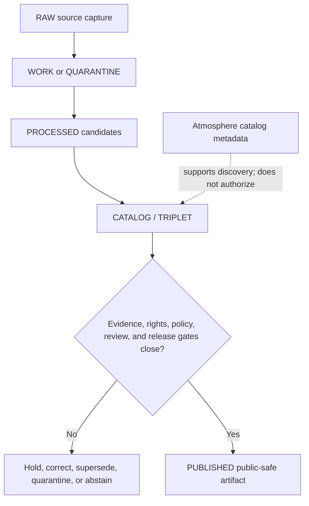

<!-- [KFM_META_BLOCK_V2]
doc_id: kfm://doc/data-catalog-domain-atmosphere-readme
title: data/catalog/domain/atmosphere/README.md — Atmosphere Domain Catalog README
version: v0.2.0
type: readme; nested-directory-readme; catalog-profile; data-lifecycle-sublane; domain-catalog-guide
status: repository-grounded draft; catalog-stage; mixed-scaffold maturity; release-blocked
owners: NEEDS VERIFICATION - default GitHub review route is @bartytime4life; accountable Atmosphere, data, catalog, evidence, policy, release, schema, and documentation stewardship is not established
created: NEEDS VERIFICATION - blank placeholder existed before v0.1 expansion
updated: 2026-07-25
policy_label: public-doc; data; catalog; atmosphere; no-direct-public-path; release-gated
prepared_under_prompt: KFM Markdown Modernization & GitHub Documentation Implementation Agent v4.0.0
truth_posture: cite-or-abstain
current_path: data/catalog/domain/atmosphere/README.md
tags: [kfm, data, catalog, atmosphere, air, domain-catalog, CATALOG, TRIPLET, PM25Observation, AirObservation, AirStation, EvidenceBundle, SourceDescriptor, CatalogBuildReceipt, ValidationReport, PolicyDecision, ReleaseManifest]
evidence_snapshot:
  repository: bartytime4life/Kansas-Frontier-Matrix
  base_commit: 31cd8a7ed4425c3bfefef60ee8da08d074020fa1
  prior_blob: 0050eefde082965337f148ac545c440d4952bad6
  method: complete target read plus bounded parent, child, doctrine, contract, schema, policy, proof, receipt, release, published-carrier, CODEOWNERS, and workflow inspection
related:
  - ./pm25_2026/README.md
  - ../README.md
  - ../../README.md
  - ../../../README.md
  - ../../../../docs/architecture/directory-rules.md
  - ../../../../docs/adr/ADR-0001-schema-home--schemas-contracts-v1-is-canonical.md
  - ../../../../docs/domains/atmosphere/README.md
  - ../../../../contracts/domains/atmosphere/PM25Observation.md
  - ../../../../contracts/domains/atmosphere/AirObservation.md
  - ../../../../contracts/domains/atmosphere/AirStation.md
  - ../../../../schemas/contracts/v1/domains/atmosphere/PM25Observation.schema.json
  - ../../../../policy/domains/atmosphere/README.md
  - ../../../proofs/atmosphere/pm25_2026/
  - ../../../receipts/atmosphere/pm25_2026/
  - ../../../published/layers/atmosphere/pm25_2026.pmtiles/
  - ../../../../release/
notes:
  - "This update preserves the existing path and doc_id; it does not create a parallel catalog authority."
  - "The currently inspected PM2.5 collection, evidence-bundle, validation-report, and rollback-card JSON files are explicitly PROPOSED documentation-inventory placeholders."
  - "The paired PM25Observation schema is an empty, permissive PROPOSED scaffold."
  - "The domain-atmosphere and release-dry-run workflows preserve explicit readiness holds and do not create release or publication authority."
  - "No qualifying Atmosphere ReleaseManifest, released PM2.5 archive, or complete recursive Atmosphere catalog inventory was verified in the bounded base-commit inspection."
  - "The pre-v0.1 blank-file lineage remains recorded as blob 8b137891791fe96927ad78e64b0aad7bded08bdc."
[/KFM_META_BLOCK_V2] -->

# data/catalog/domain/atmosphere

> Governed catalog-stage documentation for Atmosphere discovery metadata and indexes; the bounded inspection verified only a release-blocked PM2.5 placeholder slice.

> [!IMPORTANT]
> Catalog metadata supports discovery and governed review. It is not an observation, canonical domain truth, an EvidenceBundle, a validation result, a PolicyDecision, a release decision, or publication authority.
>
> The currently verified PM2.5 machine artifacts are explicit `PROPOSED` placeholders or scaffolds. Do not expose them through a public API, map, download, graph, vector index, AI answer, AQI display, health statement, regulatory claim, advisory, or release path.

## Navigation

- [Purpose](#purpose)
- [Authority level](#authority-level)
- [Status](#status)
- [Lifecycle boundary](#lifecycle-boundary)
- [Repo fit](#repo-fit)
- [Inputs and outputs](#inputs-and-outputs)
- [Accepted contents](#accepted-contents)
- [Exclusions](#exclusions)
- [Atmosphere catalog requirements](#atmosphere-catalog-requirements)
- [Source-role guardrails](#source-role-guardrails)
- [Known child lanes](#known-child-lanes)
- [Evidence ledger](#evidence-ledger)
- [Validation checklist](#validation-checklist)
- [Release and publication boundary](#release-and-publication-boundary)
- [Review burden](#review-burden)
- [Related documents](#related-documents)
- [Open verification register](#open-verification-register)
- [Rollback](#rollback)
- [Last reviewed](#last-reviewed)

---

## Purpose

`data/catalog/domain/atmosphere/` is the Atmosphere-domain catalog lane under the broader [`data/catalog/`](../../README.md) lifecycle stage. It may hold governed discovery records and indexes for admitted Atmosphere datasets after upstream material has enough stable identity, source-role, evidence, rights, sensitivity, validation, policy, review, correction, and release context for catalog representation.

The lane is for data and catalog maintainers, Atmosphere-domain reviewers, evidence and policy reviewers, release reviewers, and governed downstream consumers evaluating a record's discoverability and readiness. It does not define Atmosphere object semantics or machine shape and does not authorize public use.

A record's presence here can prove only that catalog-stage material exists at a repository path. It cannot by itself prove that the underlying observation is true, the source is admitted, rights permit reuse, a validator ran, policy allowed use, review occurred, a release was approved, or a public artifact exists.

## Authority level

| Question | Bounded answer |
|---|---|
| Owning responsibility root | [`data/`](../../../README.md) |
| Lifecycle home | [`data/catalog/`](../../README.md) |
| Domain segment | `atmosphere` |
| Authority class | Nested catalog-stage metadata lane |
| Semantic authority | Atmosphere contracts, including [`PM25Observation`](../../../../contracts/domains/atmosphere/PM25Observation.md), [`AirObservation`](../../../../contracts/domains/atmosphere/AirObservation.md), and [`AirStation`](../../../../contracts/domains/atmosphere/AirStation.md), not this README |
| Machine-shape authority | Current files use [`schemas/contracts/v1/domains/atmosphere/`](../../../../schemas/contracts/v1/domains/atmosphere/); the verified PM2.5 shape remains a `PROPOSED` scaffold, and the domain guide's historical `air` versus `atmosphere` slug conflict remains unresolved |
| Admissibility authority | [`policy/domains/atmosphere/`](../../../../policy/domains/atmosphere/); operational enforcement remains `NEEDS VERIFICATION` |
| Release authority | [`release/`](../../../../release/), not catalog placement, Git, a badge, a workflow hold, or this README |
| Public-serving authority | Governed interfaces and released public-safe artifacts only; no direct public path from this lane |

[Directory Rules](../../../../docs/architecture/directory-rules.md) places lifecycle data under `data/<phase>/` and domain-specific material as a lane inside its responsibility root. The target therefore fits the documented `data/catalog/domain/<domain>/` pattern without creating a topic root or parallel catalog authority. Directory Rules section 15's exact ordered contract applies to canonical and compatibility **roots**; this nested directory uses the catalog-specific README profile appropriate to its narrower role.

[`ADR-0001`](../../../../docs/adr/ADR-0001-schema-home--schemas-contracts-v1-is-canonical.md) records `schemas/contracts/v1/` as a configured and proposed schema-home decision, not an accepted one. This README therefore reports the inspected current path without treating configuration or documentation as accepted decision authority.

## Status

| Surface | Truth status | Current bounded finding |
|---|---|---|
| Path and README | `CONFIRMED` | This nested lane and README exist at the pinned base. |
| Parent indexes | `CONFIRMED` files / `PROPOSED` lane | The catalog parent and domain index identify Atmosphere as a catalog child but do not prove payload completeness or release. |
| Atmosphere object-family doctrine | `CONFIRMED` documentation spine / `PROPOSED` implementation | The Atmosphere domain guide enumerates air-quality, smoke/aerosol, weather, climate, forecast, and advisory-context families while marking implementation and many paths unresolved. |
| Inspected semantic contracts | `CONFIRMED` files / `draft` | `PM25Observation`, `AirObservation`, and `AirStation` define meaning and fail-closed boundaries; they do not prove implementation or release. |
| Inspected machine shape | `PROPOSED / HOLD` | `PM25Observation.schema.json` has empty `properties` and permits additional properties. |
| Inspected catalog, proof, receipt, and rollback JSON | `PROPOSED / HOLD` | The PM2.5 files are documentation-inventory placeholders, not operational records. |
| Atmosphere validation, proof, and release automation | `WORKFLOW_HOLD` | `domain-atmosphere` records explicit holds and emits no source admission, proof, release, or publication authority. |
| General release readiness | `WORKFLOW_SKIPPED_EXPLICIT / HOLD` | `release-dry-run` inspects known gaps; it does not assemble or approve an Atmosphere release. |
| PM2.5 public carrier | `NEEDS VERIFICATION` | A carrier README exists; no archive, manifest, checksum, evidence closure, or qualifying release was verified. |
| Complete recursive Atmosphere catalog inventory | `UNKNOWN` | The bounded inspection verified the PM2.5 child and its linked support surfaces, not every possible descendant or external store. |

**Evidence snapshot:** `main@31cd8a7ed4425c3bfefef60ee8da08d074020fa1`.

## Lifecycle boundary

```mermaid
flowchart TD
  RAW["RAW source capture"] --> WQ["WORK or QUARANTINE"]
  WQ --> PROC["PROCESSED candidates"]
  PROC --> CAT["CATALOG / TRIPLET"]
  CAT --> GATE{"Evidence, rights, policy, review, and release gates close?"}
  GATE -- "No" --> HOLD["Hold, correct, supersede, quarantine, or abstain"]
  GATE -- "Yes" --> PUB["PUBLISHED public-safe artifact"]
  META["Atmosphere catalog metadata"] -. "supports discovery; does not authorize" .-> CAT
```

This directory occupies only the `CATALOG / TRIPLET` portion of the trust membrane. Promotion is a governed state transition. Copying a record into this folder, committing it, merging a pull request, creating a GitHub release, or adding a green badge does not move it to KFM `PUBLISHED`.

Public consumers must use governed interfaces and released artifacts. They must not read this catalog lane, raw captures, work files, quarantine records, processed candidates, proof files, receipts, or release candidates as direct public truth.

## Repo fit

| Responsibility | Correct home | Boundary |
|---|---|---|
| Atmosphere domain catalog records and indexes | `data/catalog/domain/atmosphere/` | This lane; discovery metadata only |
| Dataset-specific Atmosphere catalog metadata | A verified child under this lane, such as [`pm25_2026/`](./pm25_2026/README.md) | Child existence is not release evidence |
| Cross-profile STAC, DCAT, or PROV projections | `data/catalog/stac/`, `data/catalog/dcat/`, or `data/catalog/prov/` when accepted | Must preserve identity, evidence, rights, sensitivity, temporal, and release linkage |
| Raw source captures | `data/raw/atmosphere/` | Not catalog material |
| Intermediate or disputed material | `data/work/atmosphere/` or `data/quarantine/atmosphere/` | Must not be promoted by documentation |
| Normalized Atmosphere candidates | An accepted lane under `data/processed/atmosphere/` | Exact dataset inventory remains `NEEDS VERIFICATION` |
| Atmosphere object meaning | `contracts/domains/atmosphere/` | Semantic authority |
| Atmosphere machine shape | `schemas/contracts/v1/domains/atmosphere/` | Schema authority; maturity varies |
| Source identity and activation | `data/registry/sources/` and source governance | Catalog references a source; it does not admit one |
| Evidence and claim support | `data/proofs/` | Proof support; not release authority |
| Process memory | `data/receipts/` | Receipts; not truth or release authority |
| Policy and sensitivity decisions | `policy/domains/atmosphere/` and applicable cross-domain policy | Fail closed when unresolved |
| Release decisions and correction records | `release/` | Publication, correction, withdrawal, supersession, and rollback authority |
| Public-safe materialization | `data/published/layers/atmosphere/` | Only after governed release closure |

## Inputs and outputs

### Admissible inputs

An accepted Atmosphere catalog build may consume references to:

- stable processed-dataset and record identity, version, lineage, and content digests;
- admitted `SourceDescriptor` records, provider identity, source family, and source-role classification;
- rights, citation, attribution, redistribution, access-class, and sensitivity posture;
- spatial and temporal extent, observed/retrieved/processed/valid times, cadence, freshness thresholds, and stale state;
- units, averaging windows, QA, correction, confidence, uncertainty, limitations, and caveats;
- EvidenceRef-to-EvidenceBundle support for consequential claims;
- deterministic `CatalogBuildReceipt`, `RunReceipt`, `ValidationReport`, and `PolicyDecision` references;
- accountable review, release references, correction lineage, deactivation or supersession state, and rollback targets when public use is proposed.

The verified PM2.5 placeholder does not establish that these inputs exist or resolve.

### Allowed outputs

This lane may emit or support:

- governed Atmosphere-domain catalog records and indexes;
- release-linked discovery metadata;
- deterministic projections into accepted STAC, DCAT, or PROV profiles;
- references to evidence, receipts, policy outcomes, reviews, corrections, deactivation, supersession, and rollback support.

It must not emit or imply a source observation, EvidenceBundle, validation result, PolicyDecision, ReleaseManifest, public layer, advisory, regulatory determination, medical guidance, emergency instruction, or life-safety authority.

## Accepted contents

| Content family | Admission expectation |
|---|---|
| Atmosphere domain catalog records | Stable identity, dataset version, source role, spatial/temporal scope, and lifecycle status |
| Dataset-family child lanes | Bounded catalog metadata with source, evidence, validation, policy, release, correction, and rollback links |
| Catalog indexes | Deterministic, inspectable, and scoped to admitted records |
| Source references | Resolve to admitted source descriptors; preserve provider and authority role |
| Evidence references | Resolve before consequential claims are treated as supported |
| Receipt and validation references | Identify the actual run, check, finite outcome, and reason codes; presence alone is insufficient |
| Rights and sensitivity metadata | Explicit reuse, attribution, access, precision, and restriction posture |
| Release references | Bind released records to immutable release evidence, correction lineage, and rollback support |
| Quality and freshness summaries | Point to inspectable validation and receipt evidence; do not replace it |
| README and local maintenance indexes | Explain the lane without becoming catalog, proof, policy, or release authority |

## Exclusions

| Do not put or treat as authoritative here | Correct responsibility |
|---|---|
| Raw agency, station, sensor, model, smoke, weather, climate, or remote-sensing payloads | `data/raw/atmosphere/` |
| Scratch transforms or unresolved joins | `data/work/atmosphere/` |
| Rights-unclear, stale, malformed, disputed, role-unclear, or caveat-missing records | `data/quarantine/atmosphere/` |
| Normalized observation or model payloads | `data/processed/atmosphere/` |
| STAC, DCAT, or PROV projections presented as this domain lane's canonical record | Their accepted profile under `data/catalog/` with explicit cross-links |
| Triplets or graph edges | `data/triplets/` |
| Semantic contracts or JSON Schemas | `contracts/` or `schemas/` |
| Policy code or sensitivity rules | `policy/` |
| EvidenceBundle and proof records | `data/proofs/` |
| Run, transform, validation, policy, correction, or release-support receipts | `data/receipts/` |
| Release manifests, promotion decisions, correction notices, withdrawal notices, or rollback cards | `release/` |
| PMTiles archives or other public carriers | `data/published/` after release closure |
| Validator code, tests, fixtures, workflows, or executable pipelines | `tools/`, `tests/`, `fixtures/`, `.github/workflows/`, or `pipelines/` |
| Direct public API, UI, map, download, graph, vector-index, or AI-answer payloads | Governed serving and released-artifact surfaces |

## Atmosphere catalog requirements

The requirements below are catalog admission and promotion gates, not claims about the current placeholder slice.

| Gate | Minimum evidence before a record is relied on |
|---|---|
| Stable identity | Deterministic dataset and record identifiers, version, content digest, lineage, and correction/supersession relationship |
| Provider and source role | Explicit provider, source family, admitted descriptor, and distinction among observation, preliminary report, regulatory archive, low-cost sensor, model, remote-sensing proxy, smoke context, forecast, and advisory context |
| Units and measurement semantics | Parameter, unit, conversion method, averaging period, instrument/method context, and distinction between concentration and derived/reporting indexes |
| Spatial and temporal scope | Geometry or coverage, precision posture, observed/retrieved/processed/valid times, cadence, freshness threshold, stale state, and supersession time where material |
| Rights, citation, and access | Resolvable source citation, rights, attribution, access, redistribution, sensitivity, and public-precision posture |
| Evidence closure | EvidenceRef resolves to an EvidenceBundle or accepted proof object supporting each consequential claim |
| Validation | Deterministic validator identity, version, inputs, finite outcome, reason codes, and report reference |
| Policy and sensitivity | Explicit decision and review posture for public display, station precision, low-cost caveats, stale data, rights, harmful joins, and advisory use |
| Catalog closure | Domain record and any STAC, DCAT, PROV, or triplet projections agree on identity, evidence, rights, scope, and release state |
| Correction and deactivation | Stale, invalid, withdrawn, superseded, or corrected records have traceable state, reason, affected consumers, and replacement or denial behavior |
| Release support | Immutable release reference, integrity binding, accountable review, correction and withdrawal paths, cache or consumer invalidation, and rollback target |

Until these gates are evidenced, the safe outcome is hold, quarantine, deny, abstain, correct, deactivate, supersede, or remain `PROPOSED` according to the applicable contract. A schema-valid shape alone is not enough.

## Source-role guardrails

The current Atmosphere domain guide names `AirStation`, `AirObservation`, `PM25Observation`, `OzoneObservation`, `SmokeContext`, `AODRaster`, `WeatherStation`, `WeatherObservation`, `WindField`, `PrecipitationObservation`, `TemperatureObservation`, `ClimateNormal`, `ClimateAnomaly`, `ForecastContext`, and `AdvisoryContext` as its documented object-family spine while marking implementation as proposed. This README does not claim that catalog records, substantive schemas, validators, or released products exist for every family.

- Atmosphere catalog records are discovery carriers, not measurement truth.
- PM2.5 concentration is not AQI or another derived/reporting index.
- Aerosol optical depth and smoke masks are context or proxy surfaces, not observed PM2.5 concentration.
- Model and forecast fields must remain labeled as modeled or forecast context, not observed sensor records.
- Advisory context must preserve the issuing authority, validity window, source link, and redirect-to-official-source boundary; KFM does not issue life-safety direction from this lane.
- Low-cost sensor records require correction, caveats, confidence, limitations, rights, policy, and review context before public use.
- Station records are network or site context, not observation values; exact siting must fail closed, be generalized, or be restricted when policy requires.
- Stale, rights-unclear, role-ambiguous, QA-failed, unit-unclear, evidence-missing, or caveat-missing material must not be promoted by catalog prose.
- AI-generated summaries remain evidence-subordinate and may not convert catalog fluency into authority.
- Unreleased catalog records are not public merely because they exist in this directory.

Role collapse is a release blocker. The remedy is to preserve or correct the role, evidence, caveat, rights, sensitivity, and policy context, not to relabel a record for convenience.

## Known child lanes

This is a bounded evidence index, not a claim that every descendant or external catalog store was recursively inventoried.

| Child lane | Current repository-grounded posture | Verified machine state | Public-use boundary |
|---|---|---|---|
| [`pm25_2026/`](./pm25_2026/README.md) | Repository-grounded draft; proposed dataset family; release-blocked | [`collection.json`](./pm25_2026/collection.json), linked proof, validation report, schema, and rollback card are explicit `PROPOSED` placeholders or scaffolds | Deny by default; no qualifying ReleaseManifest or released archive verified |

Additional dataset-family child lanes should be added only after their identity, source, rights, evidence, schema, validation, policy, review, correction, release, and rollback expectations are clear enough to avoid creating misleading authority.

## Evidence ledger

| Evidence | Status at the snapshot | Supports | Limit |
|---|---|---|---|
| [Directory Rules](../../../../docs/architecture/directory-rules.md) | `CONFIRMED` file; status `review` | `data/` lifecycle placement, domain-lane law, and catalog/proof/receipt/release separation | Does not decide Atmosphere record validity or admissibility |
| [`ADR-0001`](../../../../docs/adr/ADR-0001-schema-home--schemas-contracts-v1-is-canonical.md) | `CONFIRMED` file; status `proposed` | Configured schema-home intent and contract-versus-schema separation | Does not supply an accepted decision or resolve the `air`/`atmosphere` slug conflict |
| [`data/README.md`](../../../README.md) | `CONFIRMED` current root guide | Data lifecycle and non-public internal-root boundaries | Does not prove this lane's payloads or runtime enforcement |
| [`data/catalog/README.md`](../../README.md) | `CONFIRMED` current parent contract | Catalog purpose, deny-by-default posture, and anti-collapse boundary | Recursive payloads and public behavior remain unverified |
| [`data/catalog/domain/README.md`](../README.md) | `CONFIRMED` domain index | Atmosphere is a known domain catalog lane | Index posture is `PROPOSED`; not a completeness or release claim |
| [Atmosphere domain guide](../../../../docs/domains/atmosphere/README.md) | `CONFIRMED` documentation / `PROPOSED` implementation | Domain scope, object-family spine, lifecycle, and source-role denials | Many paths, rights, validators, integrations, and release claims remain unresolved |
| [`PM25Observation`](../../../../contracts/domains/atmosphere/PM25Observation.md) | `CONFIRMED` semantic contract; status `draft` | PM2.5 meaning, concentration/AQI separation, low-cost caveats, and fail-closed invariants | Does not prove schema, validator, data, policy, or release behavior |
| [`AirObservation`](../../../../contracts/domains/atmosphere/AirObservation.md) | `CONFIRMED` semantic contract; status `draft` | Observation/source-role boundary and low-cost/stale/rights guardrails | Does not prove operational observation validation |
| [`AirStation`](../../../../contracts/domains/atmosphere/AirStation.md) | `CONFIRMED` semantic contract; status `draft` | Station-versus-observation boundary and exact-siting restriction posture | Does not prove generalization, access control, or public release |
| [`PM25Observation.schema.json`](../../../../schemas/contracts/v1/domains/atmosphere/PM25Observation.schema.json) | `CONFIRMED` file; `PROPOSED` scaffold | Intended schema home and contract linkage | Empty properties and permissive shape provide no substantive validation |
| [`pm25_2026/README.md`](./pm25_2026/README.md) | `CONFIRMED` merged child guide | Bounded current PM2.5 catalog, proof, receipt, schema, workflow, carrier, and rollback posture | Does not prove a dataset, recursive lane completeness, or release |
| [`collection.json`](./pm25_2026/collection.json) | `CONFIRMED` file; `PROPOSED` placeholder | Current PM2.5 catalog machine-file state | Not catalog-profile conformance, evidence closure, or release |
| [`evidence_bundle.json`](../../../proofs/atmosphere/pm25_2026/evidence_bundle.json) | `CONFIRMED` file; `PROPOSED` placeholder | Current proof-lane machine-file state | Does not resolve EvidenceRefs or support claims |
| [`validation_report.json`](../../../receipts/atmosphere/pm25_2026/validation_report.json) | `CONFIRMED` file; `PROPOSED` placeholder | Current receipt-lane machine-file state | Does not prove a validator ran or returned a governed outcome |
| [`rel-atmosphere-pm25-2026-001.card.json`](../../../../release/rollback_cards/rel-atmosphere-pm25-2026-001.card.json) | `CONFIRMED` file; `PROPOSED` placeholder | Planned release/rollback identifier relationship | Not an accepted or executable rollback target |
| [`domain-atmosphere.yml`](../../../../.github/workflows/domain-atmosphere.yml) | `CONFIRMED` executable readiness workflow | Explicit validation, proof, and release holds under read-only repository permission | Does not validate Atmosphere truth or create a release |
| [`release-dry-run.yml`](../../../../.github/workflows/release-dry-run.yml) | `CONFIRMED` executable readiness workflow | Explicit release and rollback readiness holds | A successful hold is not release readiness |
| [`pm25_2026.pmtiles/README.md`](../../../published/layers/atmosphere/pm25_2026.pmtiles/README.md) | `CONFIRMED` carrier documentation; status `draft` | A proposed public-carrier directory is documented | No PMTiles archive, manifest, checksum, evidence closure, or release was verified |

## Validation checklist

### Current documentation checks

- [x] Target existence, complete baseline, stable `doc_id`, prior blob, and same-path update verified.
- [x] Directory Rules responsibility-root, lifecycle-phase, and domain-lane placement checked.
- [x] Parent data, catalog, and domain-index boundaries inspected.
- [x] PM2.5 child catalog, proof, receipt, schema, carrier, workflow, and rollback placeholder states inspected.
- [x] Atmosphere semantic-contract boundaries for PM2.5, observations, and stations inspected.
- [x] Open pull requests checked for target-path overlap; none were found at the evidence snapshot.
- [x] Static badge claims tied to visible text and pinned repository evidence.
- [x] Existing purpose, lifecycle, repository-fit, accepted-content, exclusion, requirement, source-role, child-lane, evidence, validation, and rollback section anchors retained.

### Catalog, dataset, and release checks still required

- [ ] Recursively inventory every Atmosphere catalog child, payload family, generated output, LFS or external-store reference, writer, and consumer.
- [ ] Identify an accepted Atmosphere catalog profile and validate stable identity, scope, links, rights, evidence, policy, correction, and release fields.
- [ ] Replace permissive Atmosphere schema scaffolds only through accountable contract/schema review with valid and invalid fixtures.
- [ ] Admit the actual source inventory and resolve source descriptors, provider roles, rights, citation, cadence, freshness, and source roles.
- [ ] Replace proof placeholders with accepted EvidenceBundle or proof shapes and demonstrate EvidenceRef closure.
- [ ] Replace validation placeholders with deterministic reports emitted by verified validators and no-network fixture-backed tests.
- [ ] Verify units, averaging windows, observed/retrieved/processed/valid times, QA, correction, confidence, uncertainty, limitations, and caveats.
- [ ] Verify policy outcomes for concentration/index separation, low-cost sensors, AOD and model context, station precision, stale data, rights, harmful joins, advisories, and public display.
- [ ] Demonstrate domain/STAC/DCAT/PROV/triplet identity and release-state closure where those projections exist.
- [ ] Provide accountable review, immutable release evidence, integrity binding, correction, deactivation, withdrawal, supersession, invalidation, and executable rollback support.
- [ ] Verify public clients cannot bypass governed interfaces or consume catalog, placeholder, proof, receipt, processed, or release-candidate material directly.

No complete Atmosphere catalog validator, accepted catalog profile, successful dataset validation run, qualifying Atmosphere ReleaseManifest, or operational rollback drill was verified. Passing Markdown checks or a readiness-hold workflow would prove only those checks' declared scope.

## Release and publication boundary

The verified Atmosphere catalog slice is not release-ready. The bounded base-commit inspection found placeholder catalog, proof, validation, schema, and rollback artifacts and did not verify a qualifying Atmosphere `ReleaseManifest` or released PM2.5 archive.

Before any public use, release review must confirm:

1. stable identity and integrity across processed, catalog, proof, receipt, and public-artifact references;
2. admitted sources, provider and source roles, rights, citation, freshness, units, QA, correction, uncertainty, and caveats;
3. EvidenceRef resolution and claim-specific support;
4. deterministic validation plus fail-closed policy outcomes;
5. accountable and, where required, independent review plus sensitivity handling;
6. immutable release binding, correction and withdrawal paths, cache or consumer invalidation, and executable rollback;
7. governed public serving without direct reads from canonical or internal stores.

Branch, commit, pull request, merge, workflow, badge, catalog file, GitHub release, or filesystem placement is not KFM publication.

## Review burden

[`.github/CODEOWNERS`](../../../../.github/CODEOWNERS) routes this path through the repository default `@bartytime4life` review rule. That routing is not a stewardship assignment, `ReviewRecord`, independent approval, policy decision, release authorization, publication authority, or proof that review occurred.

Accountable Atmosphere, data, catalog, evidence, policy, sensitivity, schema, validation, release, correction, and rollback roles remain `NEEDS VERIFICATION`. A substantive catalog record or public-release proposal should obtain the specialist review required by its sources, rights, sensitivity, object families, public precision, policy effects, and release scope. Documentation review alone cannot admit a source, approve a dataset, close evidence, authorize public exposure, or approve a release.

## Related documents

- Data root: [`data/README.md`](../../../README.md)
- Parent catalog lane: [`data/catalog/README.md`](../../README.md)
- Domain catalog index: [`data/catalog/domain/README.md`](../README.md)
- Atmosphere domain guide: [`docs/domains/atmosphere/README.md`](../../../../docs/domains/atmosphere/README.md)
- Placement doctrine: [`docs/architecture/directory-rules.md`](../../../../docs/architecture/directory-rules.md)
- Proposed schema-home decision: [`ADR-0001`](../../../../docs/adr/ADR-0001-schema-home--schemas-contracts-v1-is-canonical.md)
- PM2.5 catalog child: [`data/catalog/domain/atmosphere/pm25_2026/README.md`](./pm25_2026/README.md)
- Current PM2.5 machine placeholder: [`collection.json`](./pm25_2026/collection.json)
- PM2.5 semantic contract: [`PM25Observation.md`](../../../../contracts/domains/atmosphere/PM25Observation.md)
- Adjacent air-observation contract: [`AirObservation.md`](../../../../contracts/domains/atmosphere/AirObservation.md)
- Station-context contract: [`AirStation.md`](../../../../contracts/domains/atmosphere/AirStation.md)
- PM2.5 machine-shape scaffold: [`PM25Observation.schema.json`](../../../../schemas/contracts/v1/domains/atmosphere/PM25Observation.schema.json)
- Atmosphere policy lane: [`policy/domains/atmosphere/README.md`](../../../../policy/domains/atmosphere/README.md)
- PM2.5 proof lane: [`data/proofs/atmosphere/pm25_2026/README.md`](../../../proofs/atmosphere/pm25_2026/README.md)
- PM2.5 receipt lane: [`data/receipts/atmosphere/pm25_2026/README.md`](../../../receipts/atmosphere/pm25_2026/README.md)
- Proposed PM2.5 carrier: [`data/published/layers/atmosphere/pm25_2026.pmtiles/README.md`](../../../published/layers/atmosphere/pm25_2026.pmtiles/README.md)
- Atmosphere readiness workflow: [`.github/workflows/domain-atmosphere.yml`](../../../../.github/workflows/domain-atmosphere.yml)
- General release readiness workflow: [`.github/workflows/release-dry-run.yml`](../../../../.github/workflows/release-dry-run.yml)
- Rollback-card placeholder: [`release/rollback_cards/rel-atmosphere-pm25-2026-001.card.json`](../../../../release/rollback_cards/rel-atmosphere-pm25-2026-001.card.json)

## Open verification register

| ID | Question | State | Closure evidence |
|---|---|---|---|
| ATM-CAT-001 | What is the complete recursive Atmosphere catalog inventory, including external or generated stores? | `UNKNOWN` | Pinned recursive tree, payload inventory, generator map, and external-store references |
| ATM-CAT-002 | Which accepted profile governs Atmosphere domain catalog records and each cross-profile projection? | `NEEDS VERIFICATION` | Contract, schema, profile, validator, fixtures, and compatibility map |
| ATM-CAT-003 | What is the admitted source inventory and provider/source-role mapping? | `NEEDS VERIFICATION` | Source descriptors, rights review, citations, activation records, cadence, and freshness policy |
| ATM-CAT-004 | Which substantive schemas and validators govern Atmosphere catalog records? | `NEEDS VERIFICATION` | Non-permissive schemas, positive/negative fixtures, validator implementations, and observed runs |
| ATM-CAT-005 | Do EvidenceRefs resolve to accepted EvidenceBundles for each consequential claim? | `NEEDS VERIFICATION` | Resolver output, claim-specific proof, integrity binding, and citation validation |
| ATM-CAT-006 | Which finite validation and policy outcomes and reason codes are authoritative for this lane? | `NEEDS VERIFICATION` | Accepted contracts, policy bundles, tests, and decision records |
| ATM-CAT-007 | Are correction, deactivation, withdrawal, supersession, invalidation, and stale-state effects propagated to every catalog and public consumer? | `NEEDS VERIFICATION` | Correction records, dependency graph, consumer tests, cache invalidation, and receipts |
| ATM-CAT-008 | Is there an immutable, reviewed Atmosphere release manifest and executable rollback target? | `NEEDS VERIFICATION` | ReleaseManifest, integrity evidence, accountable review, accepted RollbackCard, dry run, and receipt |
| ATM-CAT-009 | Are public routes unable to read this lane or placeholder/internal artifacts directly? | `NEEDS VERIFICATION` | Governed API tests, access controls, release-bound route evidence, and negative cases |
| ATM-CAT-010 | Who holds accountable Atmosphere catalog, evidence, policy, sensitivity, and release stewardship? | `NEEDS VERIFICATION` | Approved stewardship assignments and enforceable review routing |
| ATM-CAT-011 | Has the historical `air` versus `atmosphere` schema/contract slug conflict been resolved by accepted authority? | `NEEDS VERIFICATION / CONFLICTED` | Accepted ADR or correction, canonical path map, migration notes, link updates, and compatibility tests |

## Rollback

Before merge, rollback is to close the unmerged draft pull request or revert its single documentation commit; the base target blob is `0050eefde082965337f148ac545c440d4952bad6`.

After merge, use a transparent revert commit or revert pull request. Do not restore the older blanket statement that concrete records, schemas, validators, policy gates, receipts, release records, public carriers, and rollback surfaces were simply unverified as to existence. Preserve the more precise distinction: the inspected files exist, but their substantive or operational capabilities remain placeholders, scaffolds, explicit holds, or otherwise `NEEDS VERIFICATION`.

Operational rollback for a future Atmosphere release is separate from documentation rollback. It requires an accepted rollback target, review, invalidation plan, correction lineage, consumer impact handling, and receipt. The current PM2.5 rollback-card file does not provide that capability.

## Last reviewed

**2026-07-25** against `main@31cd8a7ed4425c3bfefef60ee8da08d074020fa1`.

Refresh this evidence snapshot when the Atmosphere catalog inventory, object contracts, schemas, source registry, proof records, validation reports, policy, workflows, release records, public carriers, correction paths, or rollback support changes.

Change history and preserved lineage

### v0.2.0 - 2026-07-25

- Preserved the same path, `doc_id`, H1, purpose, lifecycle boundary, repository-fit boundary, accepted and excluded content, catalog requirements, source-role guardrails, child-lane index, evidence ledger, validation backlog, and rollback guidance.
- Reconciled the parent lane with the merged PM2.5 child guide and the current catalog, proof, receipt, schema, release-workflow, carrier, CODEOWNERS, and rollback evidence.
- Replaced unsupported `RELEASED ONLY` presentation with repository-grounded, release-blocked, deny-by-default language.
- Added evidence-linked badges, authority and status tables, inputs and outputs, release boundary, review burden, related-document navigation, and an actionable verification register.

### v0.1 - 2026-06-24

- Expanded a blank placeholder into the first Atmosphere catalog-lane guide.
- Preserved historical rollback lineage to blank blob `8b137891791fe96927ad78e64b0aad7bded08bdc`.

<a href="#top">Back to top</a>

