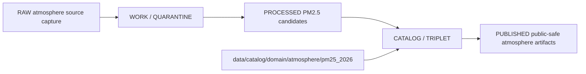

<!-- [KFM_META_BLOCK_V2]
doc_id: kfm://doc/data-catalog-domain-atmosphere-pm25-2026-readme
title: data/catalog/domain/atmosphere/pm25_2026/README.md — Atmosphere PM2.5 2026 Domain Catalog README
version: v0.1
type: readme; data-lifecycle-sublane; domain-catalog-dataset-guide
status: draft; PROPOSED; data-root; catalog-stage; atmosphere; pm25; 2026; release-gated; source-role-aware
owners: OWNER_TBD — Atmosphere steward · Air-quality steward · PM2.5 steward · Data steward · Catalog steward · Evidence steward · Policy steward · Release steward · Schema steward · Docs steward
created: NEEDS VERIFICATION — blank placeholder existed before v0.1 expansion
updated: 2026-06-24
policy_label: public-doc; data; catalog; atmosphere; pm25; 2026; lifecycle; release-gated
tags: [kfm, data, catalog, atmosphere, pm25, pm25_2026, domain-catalog, CATALOG, TRIPLET, PM25Observation, EvidenceBundle, SourceDescriptor, ReleaseManifest, CatalogBuildReceipt]
related:
  - ../../../README.md
  - ../../../../../docs/domains/atmosphere/README.md
  - ../../../../../contracts/domains/atmosphere/PM25Observation.md
  - ../../../../../contracts/domains/atmosphere/AirObservation.md
  - ../../../../../contracts/domains/atmosphere/AirStation.md
  - ../../../../../policy/domains/atmosphere/
  - ../../../../../schemas/contracts/v1/domains/atmosphere/
  - ../../../../../data/proofs/
  - ../../../../../data/receipts/
  - ../../../../../release/
notes:
  - "This file replaces a blank placeholder at `data/catalog/domain/atmosphere/pm25_2026/README.md`."
  - "No specific `pm25_2026` source manifest, schema, validator, receipt, ReleaseManifest, or inventory was verified in this session."
  - "PM25Observation is a semantic contract for governed PM2.5-related air-quality records and preserves source-role boundaries."
  - "This folder is a CATALOG-stage domain catalog dataset lane; it is not RAW, WORK, QUARANTINE, PROCESSED, PUBLISHED, proof storage, release authority, schema authority, policy code, or implementation code."
  - "Rollback target for this replacement is previous blank blob SHA `8b137891791fe96927ad78e64b0aad7bded08bdc`."
[/KFM_META_BLOCK_V2] -->

# data/catalog/domain/atmosphere/pm25_2026

> Atmosphere-domain catalog lane for a proposed 2026 PM2.5 catalog dataset or dataset family inside the `CATALOG / TRIPLET` lifecycle stage.

  
  
  
  
  
  

**Status:** draft / PROPOSED  
**Owners:** OWNER_TBD — Atmosphere steward · Air-quality steward · PM2.5 steward · Data steward · Catalog steward · Evidence steward · Policy steward · Release steward · Schema steward · Docs steward  
**Path:** `data/catalog/domain/atmosphere/pm25_2026/README.md`  
**Owning root:** `data/catalog/domain/atmosphere/`  
**Dataset segment:** `pm25_2026`  
**Lifecycle stage:** `CATALOG / TRIPLET`  
**Exposure posture:** RELEASED ONLY  
**Truth posture:** CONFIRMED target was blank · CONFIRMED parent catalog lane is RELEASED ONLY · CONFIRMED Atmosphere owns `PM25Observation` as a domain object family · CONFIRMED PM25Observation contract separates PM2.5 concentration, AQI/report posture, low-cost sensor caveats, AOD, model fields, advisory context, evidence proof, and release · NEEDS VERIFICATION for the actual 2026 source set, catalog record inventory, schemas, validators, policy gates, receipts, ReleaseManifest linkage, and public route behavior.

**Quick jumps:** [Purpose](#purpose) · [Lifecycle boundary](#lifecycle-boundary) · [Repo fit](#repo-fit) · [Accepted contents](#accepted-contents) · [Exclusions](#exclusions) · [PM2.5 2026 catalog requirements](#pm25-2026-catalog-requirements) · [Source-role guardrails](#source-role-guardrails) · [Evidence ledger](#evidence-ledger) · [Validation checklist](#validation-checklist) · [Rollback](#rollback)

---

## Purpose

`data/catalog/domain/atmosphere/pm25_2026/` stores or stages catalog records and indexes for a proposed Atmosphere/Air 2026 PM2.5 catalog dataset family.

A PM2.5 2026 catalog record can help users and systems discover governed PM2.5 catalog metadata, source references, evidence references, receipt references, policy posture, and release status. It does **not** make a PM2.5 claim true, public, regulatory, policy-admitted, evidence-supported, health-actionable, or released by itself.

## Lifecycle boundary

`data/catalog/domain/atmosphere/pm25_2026/` is a CATALOG-stage sublane. Public exposure applies only to records tied to an approved release, governed route, policy-safe source role, and required receipts.

## Repo fit

| Responsibility | Correct home | Rule |
|---|---|---|
| PM2.5 2026 domain catalog records | `data/catalog/domain/atmosphere/pm25_2026/` | This lane. |
| Parent catalog stage | `data/catalog/` | Parent CATALOG-stage lane. |
| Atmosphere domain catalog records | `data/catalog/domain/atmosphere/` | Domain-level catalog grouping, if accepted. |
| PM2.5 object meaning | `contracts/domains/atmosphere/PM25Observation.md` | Semantic contract. |
| PM2.5 machine shape | `schemas/contracts/v1/domains/atmosphere/` | Separate schema root; exact schema status NEEDS VERIFICATION. |
| Atmosphere policy | `policy/domains/atmosphere/` | AQI/concentration, AOD/PM2.5, low-cost caveat, freshness, rights, and release rules. |
| Evidence/proof records | `data/proofs/` | EvidenceBundle and proof records. |
| Receipts | `data/receipts/` | CatalogBuildReceipt, RunReceipt, ValidationReport, PolicyDecision, correction receipts. |
| Release decisions | `release/` | Publication authority. |
| Published outputs | `data/published/layers/atmosphere/` | Public-safe materialization after release. |

## Accepted contents

| Content | Purpose |
|---|---|
| PM2.5 2026 catalog records | Domain-scoped catalog entries for the dataset family. |
| Catalog indexes | Steward-facing or release-linked lookup surfaces. |
| Source references | Pointers to SourceDescriptor/source registry entries. |
| Evidence references | Pointers to EvidenceBundle/proof context. |
| Receipt references | CatalogBuildReceipt, RunReceipt, ValidationReport, PolicyDecision, correction/supersession pointers. |
| Release references | Links to ReleaseManifest and rollback target when public or release-linked. |
| Quality/freshness summaries | Catalog summaries that point to validation reports and receipts. |

## Exclusions

| Do not put here | Correct home |
|---|---|
| RAW PM2.5 source files | `data/raw/atmosphere/` |
| WORK/intermediate PM2.5 data | `data/work/atmosphere/` |
| Quarantined PM2.5 data | `data/quarantine/atmosphere/` |
| Processed PM2.5 datasets | `data/processed/atmosphere/` |
| STAC/DCAT/PROV records | `data/catalog/stac/`, `data/catalog/dcat/`, `data/catalog/prov/` if accepted for this dataset |
| Triplets/graph edges | `data/triplets/.../atmosphere/` |
| EvidenceBundle/proof records | `data/proofs/` |
| Receipts | `data/receipts/` |
| Release decisions | `release/` |
| Published public products | `data/published/.../atmosphere/` |
| Schemas | `schemas/` |
| Policy rules | `policy/` |
| Validators/tests/code | `tools/validators/`, `tests/`, implementation roots |

## PM2.5 2026 catalog requirements

PROPOSED until schema, validator, and source inventory are verified:

| Requirement | Meaning |
|---|---|
| Stable dataset identity | Catalog record must carry a stable identity for the 2026 PM2.5 dataset family. |
| Source role | Each record must distinguish observed concentration, AQI/report posture, low-cost sensor record, regulatory archive, model context, or other source role. |
| Units and averaging window | PM2.5 concentration units and averaging window must be explicit when concentration is represented. |
| Evidence reference | EvidenceBundle/proof context must be referenced when claims depend on evidence. |
| Source reference | SourceDescriptor/source catalog must be referenced when source authority matters. |
| Policy reference | Policy/admissibility posture must be available when public display, caveat, freshness, or rights posture matters. |
| Release reference | Public or release-linked records must point to the immutable ReleaseManifest. |
| Closure compatibility | Domain catalog, STAC, DCAT, and PROV agreement must hold for promoted releases where those projections exist. |

## Source-role guardrails

- PM2.5 catalog records are catalog carriers, not measurement truth.
- AQI/report posture is not the same thing as PM2.5 concentration.
- AOD rasters, smoke masks, and model fields must not be presented as observed PM2.5 measurements.
- Low-cost sensor records require correction, caveats, confidence, limitations, policy posture, and source rights before public use.
- PM2.5 catalog records do not create emergency, medical, life-safety, or advisory instructions.
- Unreleased PM2.5 2026 catalog records are not public merely because they exist under this directory.

## Evidence ledger

| Source | Status | Supports | Limits |
|---|---|---|---|
| `data/catalog/domain/atmosphere/pm25_2026/README.md` previous file | CONFIRMED | Target existed as a blank placeholder. | Did not define lane boundaries. |
| `data/catalog/README.md` | CONFIRMED | Parent catalog lane, domain catalog layout, RELEASED ONLY posture. | Does not prove PM2.5 2026 inventory. |
| `docs/domains/atmosphere/README.md` | CONFIRMED doctrine / PROPOSED implementation | Atmosphere domain scope, object families, lane map, source-role denials. | Many paths, endpoints, rights, and implementation details remain NEEDS VERIFICATION. |
| `contracts/domains/atmosphere/PM25Observation.md` | CONFIRMED semantic contract | PM25Observation meaning and anti-collapse boundaries. | Does not prove this 2026 dataset exists or is released. |

## Validation checklist

- [ ] Confirm actual child files and PM2.5 2026 catalog record inventory under this lane.
- [ ] Confirm source family list and source descriptors for the 2026 dataset.
- [ ] Confirm PM2.5 schema/profile location and status.
- [ ] Confirm catalog validators and CI checks.
- [ ] Confirm units, averaging windows, source role, QA, freshness, and rights posture.
- [ ] Confirm EvidenceBundle, SourceDescriptor, RunReceipt, ValidationReport, PolicyDecision, and ReleaseManifest references.
- [ ] Confirm domain/STAC/DCAT/PROV catalog matrix closure where projections exist.
- [ ] Confirm correction, withdrawal, supersession, and rollback behavior for stale or failed records.

## Rollback

Rollback is required if this lane becomes a PM2.5 source-data root, proof store, release-decision root, published-output root, schema root, policy root, validator root, implementation root, advisory source, or public exposure shortcut.

Rollback target for this replacement: previous blank blob SHA `8b137891791fe96927ad78e64b0aad7bded08bdc`.

<a href="#top">Back to top</a>

