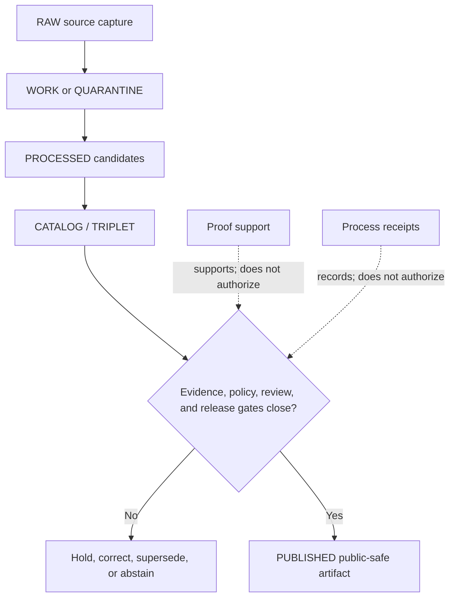

<!-- [KFM_META_BLOCK_V2]
doc_id: kfm://doc/data-catalog-domain-atmosphere-pm25-2026-readme
title: data/catalog/domain/atmosphere/pm25_2026/README.md — Atmosphere PM2.5 2026 Domain Catalog README
version: v0.2.0
type: readme; nested-directory-readme; catalog-profile; data-lifecycle-sublane; domain-catalog-dataset-guide
status: repository-grounded draft; PROPOSED dataset lane; catalog-stage; release-blocked
owners: NEEDS VERIFICATION - Atmosphere, air-quality, PM2.5, data, catalog, evidence, policy, release, schema, and documentation stewards
created: NEEDS VERIFICATION - blank placeholder existed before v0.1 expansion
updated: 2026-07-25
policy_label: public-doc; data; catalog; atmosphere; pm25; 2026; no-direct-public-path; release-gated
prepared_under_prompt: KFM Markdown Modernization & GitHub Documentation Implementation Agent v4.0.0
truth_posture: cite-or-abstain
current_path: data/catalog/domain/atmosphere/pm25_2026/README.md
tags: [kfm, data, catalog, atmosphere, pm25, pm25_2026, domain-catalog, CATALOG, TRIPLET, PM25Observation, EvidenceBundle, SourceDescriptor, CatalogBuildReceipt, ValidationReport, PolicyDecision, ReleaseManifest]
evidence_snapshot:
  repository: bartytime4life/Kansas-Frontier-Matrix
  base_commit: fddb074e4e64d48332d7a187587858220f042945
  prior_blob: 24dddaef93dbfd152326fc8035d904deb53a30d0
  method: complete target read plus bounded repository file, search, workflow, doctrine, contract, schema, proof, receipt, and rollback inspection
related:
  - ./collection.json
  - ../README.md
  - ../../../README.md
  - ../../../../../docs/domains/atmosphere/README.md
  - ../../../../../docs/architecture/directory-rules.md
  - ../../../../../contracts/domains/atmosphere/PM25Observation.md
  - ../../../../../contracts/domains/atmosphere/AirObservation.md
  - ../../../../../contracts/domains/atmosphere/AirStation.md
  - ../../../../../schemas/contracts/v1/domains/atmosphere/PM25Observation.schema.json
  - ../../../../../policy/domains/atmosphere/README.md
  - ../../../../proofs/atmosphere/pm25_2026/
  - ../../../../receipts/atmosphere/pm25_2026/
  - ../../../../published/layers/atmosphere/pm25_2026.pmtiles/
  - ../../../../../release/rollback_cards/rel-atmosphere-pm25-2026-001.card.json
notes:
  - "This update preserves the existing path and doc_id; it does not create a parallel catalog authority."
  - "The current collection, evidence-bundle, validation-report, and rollback-card JSON files are explicitly PROPOSED documentation-inventory placeholders."
  - "The paired PM25Observation schema is an empty, permissive PROPOSED scaffold."
  - "No PM2.5 2026 ReleaseManifest or released PMTiles archive was verified in the bounded base-commit inspection."
  - "The pre-v0.1 blank-file lineage remains recorded as blob 8b137891791fe96927ad78e64b0aad7bded08bdc."
[/KFM_META_BLOCK_V2] -->

# data/catalog/domain/atmosphere/pm25_2026

> Governed catalog-stage documentation for the proposed 2026 PM2.5 dataset family; current machine artifacts are placeholders, not evidence of a validated dataset or release.

> [!IMPORTANT]
> Catalog metadata supports discovery and governed review. It is not measurement truth, an EvidenceBundle, a validation result, a policy decision, a release decision, or publication authority.

> [!CAUTION]
> The named PM2.5 2026 JSON artifacts are currently explicit `PROPOSED` placeholders. Do not expose them through a public API, map, download, AI answer, AQI display, health statement, regulatory claim, or release path.

## Navigation

- [Purpose](#purpose)
- [Authority level](#authority-level)
- [Status and bounded inventory](#status)
- [Lifecycle boundary](#lifecycle-boundary)
- [Repository fit](#repo-fit)
- [Inputs and outputs](#inputs-and-outputs)
- [Accepted contents](#accepted-contents)
- [Exclusions](#exclusions)
- [PM2.5 2026 catalog requirements](#pm25-2026-catalog-requirements)
- [Source-role guardrails](#source-role-guardrails)
- [Evidence ledger](#evidence-ledger)
- [Validation checklist](#validation-checklist)
- [Release and publication boundary](#release-and-publication-boundary)
- [Review burden](#review-burden)
- [Related documents](#related-documents)
- [Open verification register](#open-verification-register)
- [Rollback](#rollback)

---

## Purpose

`data/catalog/domain/atmosphere/pm25_2026/` is the Atmosphere-domain catalog sublane for discovery metadata associated with a proposed 2026 PM2.5 dataset family.

The lane may eventually index stable dataset identity, source and evidence references, spatial and temporal scope, source role, units and averaging windows, rights and sensitivity posture, validation and policy references, release lineage, corrections, supersession, and rollback support. The current repository evidence does not establish that this closure exists.

This README is for maintainers, catalog stewards, evidence reviewers, policy reviewers, release reviewers, and downstream consumers evaluating whether the lane is ready to advance. It does not define `PM25Observation` semantics or machine shape and does not authorize public use.

## Authority level

| Question | Bounded answer |
|---|---|
| Owning responsibility root | `data/` |
| Lifecycle home | `data/catalog/` |
| Domain lane | `atmosphere` |
| Dataset segment | `pm25_2026` |
| Authority class | Catalog-stage metadata lane |
| Semantic authority | [`PM25Observation.md`](../../../../../contracts/domains/atmosphere/PM25Observation.md), not this README |
| Machine-shape authority | [`PM25Observation.schema.json`](../../../../../schemas/contracts/v1/domains/atmosphere/PM25Observation.schema.json), currently a `PROPOSED` scaffold |
| Admissibility authority | [`policy/domains/atmosphere/README.md`](../../../../../policy/domains/atmosphere/README.md), enforcement `NEEDS VERIFICATION` |
| Release authority | [`release/README.md`](../../../../../release/README.md), not Git, catalog placement, or this README |
| Public-serving authority | Governed interfaces and released artifacts only; no direct path from this lane |

Directory Rules places lifecycle data under `data/<phase>/` and domain lanes inside responsibility roots. This path therefore fits the `data/catalog/domain/<domain>/` pattern without creating a topic root or parallel catalog authority. Directory Rules section 15 applies its exact ordered README contract to canonical and compatibility roots; this nested README uses the catalog-specific profile appropriate to its narrower role.

## Status

- **Document status:** repository-grounded draft
- **Dataset-lane status:** `PROPOSED`
- **Catalog-record posture:** placeholder only
- **Public-access posture:** deny by default
- **Release state:** `NEEDS VERIFICATION`; no qualifying release record was verified
- **Last evidence snapshot:** `main@fddb074e4e64d48332d7a187587858220f042945`

### Bounded inventory

| Inspected artifact | Observed state at the evidence snapshot | What the observation proves | What it does not prove |
|---|---|---|---|
| [`README.md`](./README.md) | Existing nested catalog guide; prior blob `24dddaef...` | The documented lane exists. | Dataset validity, rights, policy admission, or release |
| [`collection.json`](./collection.json) | Four-field `PROPOSED` placeholder sourced from the Atmosphere release-index documentation inventory | A placeholder file exists at the catalog path. | Conformance to STAC, DCAT, PROV, a KFM catalog profile, or any released collection |
| [`evidence_bundle.json`](../../../../proofs/atmosphere/pm25_2026/evidence_bundle.json) | `PROPOSED` placeholder with the same documentation-inventory note | A proof-lane placeholder exists. | EvidenceRef resolution, claim support, source closure, integrity, or review |
| [`validation_report.json`](../../../../receipts/atmosphere/pm25_2026/validation_report.json) | `PROPOSED` placeholder with no validator result payload | A receipt-lane placeholder exists. | A validator ran, passed, denied, held, quarantined, or emitted a governed report |
| [`PM25Observation.schema.json`](../../../../../schemas/contracts/v1/domains/atmosphere/PM25Observation.schema.json) | `PROPOSED`; empty `properties`; `additionalProperties: true` | A schema scaffold and contract link exist. | Enforceable PM2.5 shape, required fields, or catalog validation |
| [`rel-atmosphere-pm25-2026-001.card.json`](../../../../../release/rollback_cards/rel-atmosphere-pm25-2026-001.card.json) | `PROPOSED` placeholder without the schema-required `id`, as checked by the release readiness workflow | A rollback-card placeholder is tracked and the workflow holds on its current shape. | An executable rollback target, accepted card, signature, review, or invalidation plan |
| [`pm25_2026.pmtiles/README.md`](../../../../published/layers/atmosphere/pm25_2026.pmtiles/README.md) | Draft package documentation; archive, manifest, checksum, evidence, and release support remain unverified | A proposed carrier directory is documented. | A PMTiles archive exists, is released, or is safe for public use |

The inventory is bounded to files and searches inspected at the pinned base commit. It is not a substitute for a recursive release audit or runtime verification.

## Lifecycle boundary

```mermaid
flowchart TD
  RAW["RAW source capture"] --> WQ["WORK or QUARANTINE"]
  WQ --> PROC["PROCESSED candidates"]
  PROC --> CAT["CATALOG / TRIPLET"]
  CAT --> GATE{"Evidence, policy, review, and release gates close?"}
  GATE -- "No" --> HOLD["Hold, correct, supersede, or abstain"]
  GATE -- "Yes" --> PUB["PUBLISHED public-safe artifact"]
  PROOF["Proof support"] -. "supports; does not authorize" .-> GATE
  RECEIPT["Process receipts"] -. "records; does not authorize" .-> GATE
```

This directory occupies only the `CATALOG / TRIPLET` portion of the trust membrane. Promotion is a governed state transition. Copying a record into this folder, committing it, merging a pull request, creating a GitHub release, or adding a badge does not move it to KFM `PUBLISHED`.

Public consumers must use governed interfaces and released artifacts. They must not read this catalog lane, proof files, receipts, raw captures, work files, quarantine records, processed candidates, or release candidates as direct public truth.

## Repo fit

| Responsibility | Correct home | Boundary |
|---|---|---|
| PM2.5 2026 domain catalog metadata | `data/catalog/domain/atmosphere/pm25_2026/` | This lane; discovery metadata only |
| Cross-profile STAC, DCAT, or PROV projections | `data/catalog/stac/`, `data/catalog/dcat/`, `data/catalog/prov/` when accepted | Must retain identity, evidence, rights, sensitivity, temporal, and release linkage |
| Raw source captures | `data/raw/atmosphere/` | Not catalog material |
| Intermediate or disputed material | `data/work/atmosphere/` or `data/quarantine/atmosphere/` | Must not be promoted by documentation |
| Normalized PM2.5 candidates | Accepted lane under `data/processed/atmosphere/` | Exact dataset path `NEEDS VERIFICATION` |
| PM2.5 semantic meaning | `contracts/domains/atmosphere/PM25Observation.md` | Contract authority |
| PM2.5 machine shape | `schemas/contracts/v1/domains/atmosphere/PM25Observation.schema.json` | Schema authority; current file is a scaffold |
| Source identity and activation | `data/registry/sources/` and source governance | Catalog references it; catalog does not activate a source |
| Evidence and claim support | `data/proofs/atmosphere/pm25_2026/` | Proof support; not release authority |
| Process memory | `data/receipts/atmosphere/pm25_2026/` | Receipts; not truth or release authority |
| Policy and sensitivity decisions | `policy/domains/atmosphere/` and applicable cross-domain policy | Fail closed when unresolved |
| Release decisions and correction records | `release/` | Publication, correction, withdrawal, supersession, and rollback authority |
| Public-safe materialization | `data/published/layers/atmosphere/` | Only after governed release closure |

## Inputs and outputs

### Admissible inputs

An accepted catalog build may consume references to:

- stable processed-dataset identity and content digests;
- admitted `SourceDescriptor` records and source-role classifications;
- rights, citation, attribution, sensitivity, access, and redistribution posture;
- spatial and temporal extent, observation/retrieval/processing times, and freshness state;
- units, averaging windows, QA, correction, confidence, limitation, and caveat context;
- EvidenceRef-to-EvidenceBundle support;
- deterministic `CatalogBuildReceipt`, `RunReceipt`, `ValidationReport`, and
  `PolicyDecision` references;
- review records, `ReleaseManifest` references, correction lineage, and rollback
  targets when a public release is proposed.

The current placeholder does not establish that these inputs exist or resolve.

### Allowed outputs

This lane may emit or support:

- governed domain catalog records and indexes;
- release-linked discovery metadata;
- deterministic projections into accepted STAC, DCAT, or PROV profiles;
- references to evidence, receipts, reviews, policy outcomes, corrections, supersession, and rollback support.

It must not emit or imply a source observation, EvidenceBundle, validation result, PolicyDecision, ReleaseManifest, public layer, advisory, regulatory determination, medical guidance, or emergency instruction.

## Accepted contents

| Content family | Admission expectation |
|---|---|
| Domain catalog records | Stable identity, dataset version, source role, spatial/temporal scope, and lifecycle status |
| Catalog indexes | Deterministic, inspectable, and scoped to admitted records |
| Source references | Resolve to admitted source descriptors; preserve provider and authority role |
| Evidence references | Resolve before consequential claims are treated as supported |
| Receipt and validation references | Identify the actual run/check and finite outcome; presence alone is insufficient |
| Rights and sensitivity metadata | Explicit access, reuse, attribution, precision, and restriction posture |
| Release references | Bind released records to immutable release evidence, correction lineage, and rollback support |
| Quality and freshness summaries | Point to inspectable validation/receipt evidence; do not replace it |
| README and local maintenance indexes | Explain the lane without becoming catalog, proof, policy, or release authority |

## Exclusions

| Do not put or treat as authoritative here | Correct responsibility |
|---|---|
| Raw agency, station, sensor, model, smoke, or remote-sensing payloads | `data/raw/atmosphere/` |
| Scratch transforms or unresolved joins | `data/work/atmosphere/` |
| Rights-unclear, stale, malformed, disputed, source-role-unclear, or caveat-missing records | `data/quarantine/atmosphere/` |
| Normalized observation payloads | `data/processed/atmosphere/` |
| Semantic contracts or JSON Schemas | `contracts/` or `schemas/` |
| Policy code or sensitivity rules | `policy/` |
| EvidenceBundle and proof records | `data/proofs/` |
| Run, transform, validation, policy, correction, or release-support receipts | `data/receipts/` |
| Release manifests, promotion decisions, correction notices, withdrawal notices, or rollback cards | `release/` |
| PMTiles archives or other public carriers | `data/published/` after release closure |
| Validator code, tests, fixtures, workflows, or executable pipelines | `tools/`, `tests/`, `fixtures/`, `.github/workflows/`, or `pipelines/` |
| Direct public API, UI, map, download, vector-index, graph, or AI-answer payloads | Governed serving and released-artifact surfaces |

## PM2.5 2026 catalog requirements

The requirements below are promotion gates, not claims about the current placeholder.

| Gate | Minimum evidence before a record is relied on |
|---|---|
| Stable identity | Deterministic dataset and record identifiers, version, content digest, and lineage |
| Source role | Explicit distinction among observed concentration, public AQI/report posture, low-cost sensor record, regulatory/archive context, model context, AOD/smoke context, and advisory context |
| Units and averaging window | PM2.5 units, conversion method, averaging period, and measurement/report semantics |
| Spatial and temporal scope | Geometry/coverage, observation time, retrieval time, processing time, valid time, freshness threshold, and supersession time where material |
| Source and rights | Resolvable source descriptor, citation, provider role, rights, attribution, access, redistribution, and terms posture |
| Evidence closure | EvidenceRef resolves to an EvidenceBundle or accepted proof object supporting each consequential claim |
| Validation | Deterministic validator identity, version, inputs, finite outcome, reason codes, and report reference |
| Policy and sensitivity | Explicit decision and review posture for public display, exact station context, low-cost caveats, stale data, rights, and harmful joins |
| Catalog closure | Domain record and any STAC, DCAT, PROV, or triplet projections agree on identity, evidence, rights, scope, and release state |
| Release support | Immutable release reference, integrity binding, review state, correction path, withdrawal/supersession behavior, and rollback target |

Until these gates are evidenced, the safe outcome is hold, quarantine, deny, abstain, correct, or remain `PROPOSED` according to the applicable contract. A schema-valid shape alone is not enough.

## Source-role guardrails

- PM2.5 concentration is not AQI. An agency AQI/report role must remain distinct from an observed concentration role.
- A low-cost sensor record is not reference-grade by default. Correction, caveat, confidence, limitation, rights, policy, and review context must travel with it.
- A regulatory/archive posture requires issuing-authority, source-role, method, vintage, and evidence support.
- AOD rasters and smoke masks are context or proxy surfaces, not observed PM2.5 concentration.
- Model and forecast fields must remain labeled as modeled context, not observed sensor records.
- Catalog metadata is a discovery carrier, not a measurement, advisory, health, exposure, regulatory-exceedance, or life-safety determination.
- Exact station or sensor context must fail closed when rights, security, privacy, or sensitive-join posture is unresolved.
- AI-generated summaries remain evidence-subordinate and may not convert catalog fluency into authority.

Role collapse is a release blocker. The remedy is to preserve or correct the role, evidence, caveat, and policy context - not to relabel the record for convenience.

## Evidence ledger

| Evidence | Status | Supports | Limit |
|---|---|---|---|
| [`Directory Rules`](../../../../../docs/architecture/directory-rules.md) | `CONFIRMED` live repository artifact; status `review` | `data/` lifecycle placement, domain-lane law, catalog/proof/receipt/release separation | Does not decide dataset existence or admissibility |
| [`data/catalog/README.md`](../../../README.md) | `CONFIRMED` current parent contract | Catalog-stage purpose, deny-by-default posture, and separation from evidence/release authority | Does not verify this dataset's payloads |
| [`data/catalog/domain/atmosphere/README.md`](../README.md) | `CONFIRMED` current parent domain guide | Atmosphere catalog boundaries and child-lane relationship | Its own implementation claims remain bounded |
| [`PM25Observation.md`](../../../../../contracts/domains/atmosphere/PM25Observation.md) | `CONFIRMED` semantic contract; status `draft` | PM2.5 meaning and source-role anti-collapse rules | Does not prove schema enforcement, data validity, or release |
| [`PM25Observation.schema.json`](../../../../../schemas/contracts/v1/domains/atmosphere/PM25Observation.schema.json) | `CONFIRMED` file; `PROPOSED` scaffold | Intended schema home and contract linkage | Empty properties and permissive shape provide no substantive PM2.5 validation |
| [`collection.json`](./collection.json) | `CONFIRMED` file; `PROPOSED` placeholder | Current catalog-lane machine-file state | Not evidence of catalog-profile conformance or release |
| [`evidence_bundle.json`](../../../../proofs/atmosphere/pm25_2026/evidence_bundle.json) | `CONFIRMED` file; `PROPOSED` placeholder | Current proof-lane machine-file state | Does not close EvidenceRefs or support claims |
| [`validation_report.json`](../../../../receipts/atmosphere/pm25_2026/validation_report.json) | `CONFIRMED` file; `PROPOSED` placeholder | Current receipt-lane machine-file state | Does not prove that validation ran |
| [`release-dry-run.yml`](../../../../../.github/workflows/release-dry-run.yml) | `CONFIRMED` executable readiness workflow | Explicit hold posture; verifies the rollback card remains a nonconforming placeholder and creates no release authority | A green held workflow is not release readiness |
| [`rel-atmosphere-pm25-2026-001.card.json`](../../../../../release/rollback_cards/rel-atmosphere-pm25-2026-001.card.json) | `CONFIRMED` file; `PROPOSED` placeholder | Documents the planned release/rollback identifier relationship | Does not provide executable rollback |

## Validation checklist

### Current documentation checks

- [x] Target existence, complete baseline, stable `doc_id`, current blob, and same-path update verified.
- [x] Directory Rules responsibility-root and lifecycle placement checked.
- [x] Parent catalog and Atmosphere catalog boundaries inspected.
- [x] Current collection, proof, validation-report, schema, published-carrier README, and rollback-card states inspected.
- [x] Open pull requests and task-like branches checked for path overlap; none affected this target at the evidence snapshot.
- [x] Badge claims tied to visible text and repository evidence.
- [x] Existing stable section anchors retained.

### Dataset and release checks still required

- [ ] Replace `collection.json` only through an accepted catalog profile and validate required identity, scope, links, rights, evidence, policy, and release fields.
- [ ] Define and review substantive `PM25Observation` schema fields, requiredness, enums, and invariants.
- [ ] Admit the actual 2026 source inventory and resolve source descriptors, rights, citation, cadence, freshness, and source roles.
- [ ] Replace the proof placeholder with an accepted EvidenceBundle/proof shape and demonstrate EvidenceRef closure.
- [ ] Replace the validation placeholder with a deterministic report emitted by a verified validator and fixture-backed test.
- [ ] Verify units, averaging windows, observed/retrieved/processed/valid times, QA, correction, confidence, limitations, and caveats.
- [ ] Verify policy outcomes for AQI/concentration separation, low-cost sensors, AOD/model context, exact station details, stale data, rights, and public display.
- [ ] Demonstrate domain/STAC/DCAT/PROV/triplet identity and release-state closure where those projections exist.
- [ ] Provide accountable review, immutable release evidence, integrity binding, correction/withdrawal/supersession behavior, and executable rollback support.
- [ ] Verify public clients cannot bypass governed interfaces or consume placeholder/internal artifacts.

No complete PM2.5 2026 catalog validator or successful dataset validation run was verified. Passing Markdown checks or a readiness-hold workflow would prove only those checks' declared scope.

## Release and publication boundary

The current lane is not release-ready. The bounded base-commit inspection found placeholder catalog, proof, validation, schema, and rollback artifacts and did not verify a qualifying PM2.5 2026 `ReleaseManifest`.

Before any public use, the release review must confirm:

1. stable identity and integrity across processed, catalog, proof, receipt, and public-artifact references;
2. admitted sources, rights, attribution, source roles, freshness, units, QA, correction, and caveats;
3. EvidenceRef resolution and claim-specific support;
4. deterministic validation plus fail-closed policy outcomes;
5. accountable review and sensitivity handling;
6. immutable release binding, correction and withdrawal paths, cache or consumer invalidation, and executable rollback;
7. governed public serving without direct reads from canonical or internal stores.

Branch, commit, pull request, merge, workflow, badge, catalog file, GitHub release, or filesystem placement is not KFM publication.

## Review burden

Review roles are `NEEDS VERIFICATION`; no CODEOWNERS assignment was established in the bounded inspection. At minimum, a substantive record or release proposal should obtain accountable review for:

- Atmosphere and PM2.5 semantics and source-role discipline;
- source admission, rights, citation, freshness, and redistribution;
- catalog identity and projection closure;
- schema and deterministic validation behavior;
- evidence and proof closure;
- policy, sensitivity, station precision, and public-use posture;
- release, correction, withdrawal, supersession, and rollback readiness.

Documentation-only review cannot approve a dataset or release.

## Related documents

- Parent catalog lane: [`data/catalog/README.md`](../../../README.md)
- Atmosphere catalog lane: [`data/catalog/domain/atmosphere/README.md`](../README.md)
- Current machine placeholder: [`collection.json`](./collection.json)
- Atmosphere domain guide: [`docs/domains/atmosphere/README.md`](../../../../../docs/domains/atmosphere/README.md)
- Placement doctrine: [`docs/architecture/directory-rules.md`](../../../../../docs/architecture/directory-rules.md)
- Semantic contract: [`contracts/domains/atmosphere/PM25Observation.md`](../../../../../contracts/domains/atmosphere/PM25Observation.md)
- Adjacent air contract: [`contracts/domains/atmosphere/AirObservation.md`](../../../../../contracts/domains/atmosphere/AirObservation.md)
- Station context contract: [`contracts/domains/atmosphere/AirStation.md`](../../../../../contracts/domains/atmosphere/AirStation.md)
- Machine-shape scaffold: [`schemas/contracts/v1/domains/atmosphere/PM25Observation.schema.json`](../../../../../schemas/contracts/v1/domains/atmosphere/PM25Observation.schema.json)
- Proof lane: [`data/proofs/atmosphere/pm25_2026/README.md`](../../../../proofs/atmosphere/pm25_2026/README.md)
- Receipt lane: [`data/receipts/atmosphere/pm25_2026/README.md`](../../../../receipts/atmosphere/pm25_2026/README.md)
- Proposed public carrier: [`data/published/layers/atmosphere/pm25_2026.pmtiles/README.md`](../../../../published/layers/atmosphere/pm25_2026.pmtiles/README.md)
- Release readiness workflow: [`.github/workflows/release-dry-run.yml`](../../../../../.github/workflows/release-dry-run.yml)
- Rollback-card placeholder: [`release/rollback_cards/rel-atmosphere-pm25-2026-001.card.json`](../../../../../release/rollback_cards/rel-atmosphere-pm25-2026-001.card.json)

## Open verification register

| ID | Question | State | Closure evidence |
|---|---|---|---|
| PM25-CAT-001 | Which accepted catalog profile governs `collection.json`? | `NEEDS VERIFICATION` | Contract/schema/profile plus validator and fixtures |
| PM25-CAT-002 | What is the admitted 2026 source inventory and source-role mapping? | `NEEDS VERIFICATION` | Source descriptors, rights review, citations, and activation records |
| PM25-CAT-003 | Which substantive schema and validator govern PM2.5 catalog records? | `NEEDS VERIFICATION` | Non-permissive schema, validator, positive/negative fixtures, and observed run |
| PM25-CAT-004 | Do EvidenceRefs resolve to accepted EvidenceBundles for each consequential claim? | `NEEDS VERIFICATION` | Resolver output and claim-specific proof |
| PM25-CAT-005 | Which finite validation and policy outcomes are authoritative for this lane? | `NEEDS VERIFICATION` | Accepted contracts, reason codes, tests, and decision records |
| PM25-CAT-006 | Is there an immutable, reviewed PM2.5 2026 release manifest and integrity binding? | `NEEDS VERIFICATION` | ReleaseManifest, hashes/signatures, review, and promotion evidence |
| PM25-CAT-007 | Is the rollback target executable and tested rather than a placeholder? | `NEEDS VERIFICATION` | Accepted RollbackCard, validator, dry run, invalidation plan, and receipt |
| PM25-CAT-008 | Are public routes unable to read this lane or placeholder artifacts directly? | `NEEDS VERIFICATION` | Governed API tests, access controls, and release-bound route evidence |

## Rollback

Before merge, rollback is to close the unmerged draft pull request or revert its single documentation commit; the base target blob is `24dddaef93dbfd152326fc8035d904deb53a30d0`.

After merge, use a transparent revert commit or revert pull request. Do not restore the stale claims that the source inventory, schema, validator, proof closure, validation result, ReleaseManifest, public carrier, or rollback capability were verified unless new evidence supports them.

Operational rollback for a future PM2.5 release is separate from documentation rollback. It requires an accepted rollback target, review, invalidation plan, correction lineage, and receipt. The current `rel-atmosphere-pm25-2026-001.card.json` file does not provide that capability.

## Last reviewed

**2026-07-25** against `main@fddb074e4e64d48332d7a187587858220f042945`.

The evidence snapshot must be refreshed when the collection, contract, schema, proof, validation report, source inventory, policy, release record, public carrier, workflow, or rollback card changes.

Change history and preserved lineage

### v0.2.0 - 2026-07-25

- Preserved the same path, `doc_id`, purpose, lifecycle boundary, repository-fit boundary, accepted/excluded content, PM2.5 requirements, source-role guardrails, evidence ledger, validation backlog, and rollback guidance.
- Reconciled the README with the current placeholder files, scaffold schema, readiness-hold workflow, and rollback-card state.
- Replaced unsupported “released only” presentation with release-blocked, deny-by-default language.
- Added evidence-linked badges, bounded inventory, inputs/outputs, release boundary, review burden, related-document navigation, and an actionable verification register.

### v0.1 - 2026-06-24

- Expanded a blank placeholder into the first catalog-lane guide.
- Preserved historical rollback lineage to blank blob `8b137891791fe96927ad78e64b0aad7bded08bdc`.

<a href="#top">Back to top</a>

