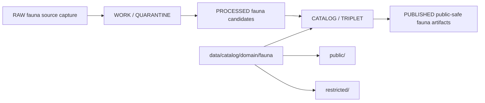

<!-- [KFM_META_BLOCK_V2]
doc_id: kfm://doc/data-catalog-domain-fauna-readme
title: data/catalog/domain/fauna/README.md — Fauna Domain Catalog README
version: v0.1
type: readme; data-lifecycle-sublane; domain-catalog-guide
status: draft; PROPOSED; data-root; catalog-stage; fauna; release-gated; geoprivacy-aware
owners: OWNER_TBD — Fauna steward · Data steward · Catalog steward · Evidence steward · Policy steward · Release steward · Sensitivity reviewer · Docs steward
created: NEEDS VERIFICATION — blank placeholder existed before v0.1 expansion
updated: 2026-06-24
policy_label: public-doc; data; catalog; fauna; lifecycle; release-gated; geoprivacy-aware
tags: [kfm, data, catalog, fauna, domain-catalog, CATALOG, TRIPLET, OccurrenceRestricted, OccurrencePublic, RedactionReceipt, EvidenceBundle, ReleaseManifest]
related:
  - ../../README.md
  - ../../../README.md
  - ./public/README.md
  - ./restricted/README.md
  - ../../../../docs/domains/fauna/ARCHITECTURE.md
  - ../../../../contracts/domains/fauna/
  - ../../../../schemas/contracts/v1/domains/fauna/
  - ../../../../policy/domains/fauna/
  - ../../../../policy/sensitivity/fauna/
  - ../../../../data/proofs/
  - ../../../../data/receipts/
  - ../../../../release/
notes:
  - "This file replaces a blank placeholder at `data/catalog/domain/fauna/README.md`."
  - "Fauna architecture identifies `data/catalog/domain/fauna/` as the catalog lane."
  - "The public and restricted child lanes are catalog sublanes; neither replaces evidence, receipts, policy, release, schemas, validators, or published artifacts."
  - "Rollback target for this replacement is previous blank blob SHA `8b137891791fe96927ad78e64b0aad7bded08bdc`."
[/KFM_META_BLOCK_V2] -->

# data/catalog/domain/fauna

> Fauna-domain catalog lane for governed catalog records and indexes inside the `CATALOG / TRIPLET` lifecycle stage.

  
  
  
  
  

**Status:** draft / PROPOSED  
**Path:** `data/catalog/domain/fauna/README.md`  
**Owning root:** `data/catalog/domain/`  
**Domain segment:** `fauna`  
**Lifecycle stage:** `CATALOG / TRIPLET`  
**Exposure posture:** release-gated; public records use approved public-safe sublanes  
**Truth posture:** CONFIRMED target was blank · CONFIRMED parent catalog lane is RELEASED ONLY for public exposure · CONFIRMED Fauna architecture identifies `data/catalog/domain/fauna/` as the catalog lane · CONFIRMED public and restricted child READMEs now exist · NEEDS VERIFICATION for catalog inventory, schemas, validators, policy gates, receipts, release manifests, access controls, and route behavior.

**Quick jumps:** [Purpose](#purpose) · [Lifecycle boundary](#lifecycle-boundary) · [Repo fit](#repo-fit) · [Accepted contents](#accepted-contents) · [Exclusions](#exclusions) · [Child lanes](#child-lanes) · [Catalog requirements](#catalog-requirements) · [Guardrails](#guardrails) · [Evidence ledger](#evidence-ledger) · [Validation checklist](#validation-checklist) · [Rollback](#rollback)

---

## Purpose

`data/catalog/domain/fauna/` stores or stages Fauna-domain catalog records and indexes that connect animal taxa, occurrence evidence, monitoring events, source roles, sensitivity posture, public-safe derivatives, evidence references, receipts, and release state.

A domain catalog record supports discovery, steward review, and release closure. It does **not** make a Fauna claim true, public, policy-admitted, evidence-supported, or released by itself.

## Lifecycle boundary

`data/catalog/domain/fauna/` is a CATALOG-stage domain lane. It groups public-safe and restricted catalog sublanes while preserving evidence, policy, sensitivity, receipt, and release boundaries.

## Repo fit

| Responsibility | Correct home | Rule |
|---|---|---|
| Fauna domain catalog records | `data/catalog/domain/fauna/` | This lane. |
| Public-safe catalog records | `data/catalog/domain/fauna/public/` | Public-safe child lane. |
| Restricted catalog records | `data/catalog/domain/fauna/restricted/` | Steward-governed child lane. |
| Parent catalog stage | `data/catalog/` | Parent CATALOG-stage lane. |
| Published Fauna artifacts | `data/published/layers/fauna/` | Public-safe materialized artifacts after release. |
| Evidence/proof records | `data/proofs/` | EvidenceBundle and proof records. |
| Receipts | `data/receipts/` | RedactionReceipt, CatalogBuildReceipt, validation, policy, review, and correction receipts. |
| Release decisions | `release/` | Publication authority. |
| Schemas and policy | `schemas/`, `policy/` | Separate roots. |
| Validators/tests/code | `tools/validators/`, `tests/`, implementation roots | Separate roots. |

## Accepted contents

| Content | Purpose |
|---|---|
| Domain-level Fauna catalog indexes | Group-level indexes that point to public/restricted catalog records. |
| Public/restricted crosswalks | Links between restricted parents and public-safe derivatives. |
| Release-linked catalog manifests | Pointers to release-approved Fauna catalog subsets. |
| Evidence and source pointers | References to EvidenceBundle, SourceDescriptor, receipts, and validation reports. |
| Sensitivity and transform pointers | References to sensitivity decisions, geoprivacy transforms, and public-safe derivatives. |
| Catalog quality summaries | Summaries that point to validation reports and receipts. |

## Exclusions

| Do not put here | Correct home |
|---|---|
| RAW source files | `data/raw/fauna/` |
| WORK/intermediate data | `data/work/fauna/` |
| Quarantined data | `data/quarantine/fauna/` |
| Processed datasets | `data/processed/fauna/` |
| EvidenceBundle/proof records | `data/proofs/` |
| Receipts | `data/receipts/` |
| Release decisions | `release/` |
| Published artifacts | `data/published/layers/fauna/` |
| Schemas | `schemas/` |
| Policy rules | `policy/` |
| Validators/tests/code | `tools/validators/`, `tests/`, implementation roots |

## Child lanes

| Child lane | Status | Purpose |
|---|---|---|
| `public/` | draft / PROPOSED | Catalog records for public-safe Fauna derivatives. |
| `restricted/` | draft / PROPOSED | Steward-governed catalog records for sensitive or exact Fauna evidence before public-safe derivation. |

## Catalog requirements

PROPOSED until schemas, validators, and inventory are verified:

| Requirement | Meaning |
|---|---|
| Stable catalog identity | Record has a stable identity linked to source, evidence, derivative, or release object. |
| Public/restricted class | Record declares whether it is restricted, public-safe, or a crosswalk/index. |
| Evidence reference | Record points to EvidenceBundle/proof context when claims depend on evidence. |
| Source reference | Record points to SourceDescriptor/source catalog where source role matters. |
| Sensitivity decision | Record links to sensitivity classification and obligations when material. |
| Transform receipt | Public derivatives from sensitive input link to RedactionReceipt or equivalent transform receipt. |
| Release reference | Public or release-linked records point to ReleaseManifest and rollback target. |
| Closure compatibility | Domain catalog, STAC, DCAT, and PROV agreement holds where those projections exist. |

## Guardrails

- Fauna catalog records are catalog carriers, not occurrence truth by themselves.
- Public and restricted records must remain distinguishable and linked.
- Sensitive or exact records require policy and review before a public-safe derivative is used.
- Public derivatives should be generalized, redacted, or aggregated, with receipt chains preserved.
- Source-role distinctions remain visible.
- Unreleased Fauna catalog records are not public merely because they exist under this directory.

## Evidence ledger

| Source | Status | Supports | Limits |
|---|---|---|---|
| `data/catalog/domain/fauna/README.md` previous file | CONFIRMED | Target existed as a blank placeholder. | Did not define lane boundaries. |
| `data/catalog/README.md` | CONFIRMED | Parent catalog lane, domain catalog layout, RELEASED ONLY public posture. | Does not prove Fauna catalog inventory. |
| `data/catalog/domain/fauna/public/README.md` | CONFIRMED | Public-safe child catalog lane and exclusions. | Does not prove record inventory or release state. |
| `data/catalog/domain/fauna/restricted/README.md` | CONFIRMED | Restricted child catalog lane and parent/child derivative linkage. | Does not prove access policy or actual restricted inventory. |
| `docs/domains/fauna/ARCHITECTURE.md` | CONFIRMED doctrine / PROPOSED implementation | Fauna object families, catalog path, restricted/public split, sensitivity posture, release requirements. | Many exact files, validators, and route names remain NEEDS VERIFICATION. |

## Validation checklist

- [ ] Confirm actual child files and Fauna catalog inventory under this lane.
- [ ] Confirm Fauna catalog schema/profile location.
- [ ] Confirm access policy, validators, and CI checks.
- [ ] Confirm EvidenceBundle, SourceDescriptor, RunReceipt, ValidationReport, PolicyDecision, ReviewRecord, RedactionReceipt, and ReleaseManifest references.
- [ ] Confirm restricted/public linkage and digest behavior.
- [ ] Confirm sensitivity, rights, source-role, stale-state, and review handling.
- [ ] Confirm correction, withdrawal, supersession, and rollback behavior for stale or failed records.

## Rollback

Rollback is required if this lane becomes a Fauna raw-data root, work area, quarantine store, processed-data store, proof store, release-decision root, published-output root, schema root, policy root, validator root, implementation root, or public exposure shortcut.

Rollback target for this replacement: previous blank blob SHA `8b137891791fe96927ad78e64b0aad7bded08bdc`.

<a href="#top">Back to top</a>

