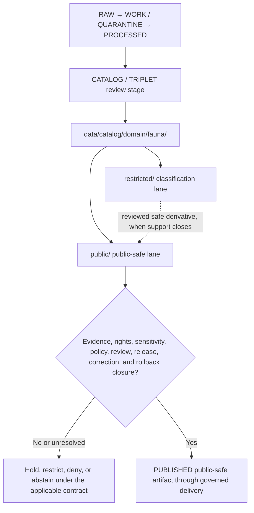

<!-- [KFM_META_BLOCK_V2]
doc_id: kfm://doc/data-catalog-domain-fauna-readme
title: data/catalog/domain/fauna/README.md — Fauna Domain Catalog README
version: v0.2.0
type: readme; data-lifecycle-sublane; domain-catalog-guide
status: repository-grounded draft; PROPOSED catalog contract; release-gated; sensitivity-aware; no-direct-public-path
owners: NEEDS VERIFICATION — accountable Fauna, data, catalog, source, evidence, rights, sensitivity, policy, release, correction, and documentation stewardship; GitHub review route is @bartytime4life
created: NEEDS VERIFICATION — blank placeholder existed before v0.1 expansion
updated: 2026-07-25
policy_label: public-control-doc; data; catalog; fauna; release-gated; geoprivacy-aware
tags: [kfm, data, catalog, fauna, domain-catalog, CATALOG, OccurrenceRestricted, OccurrencePublic, RedactionReceipt, EvidenceBundle, ReleaseManifest]
related:
  - ../README.md
  - ../../README.md
  - ../../../README.md
  - ./public/README.md
  - ./restricted/README.md
  - ../../../../docs/doctrine/directory-rules.md
  - ../../../../docs/adr/ADR-0010-deny-by-default-for-dna-rare-species-archaeology-infrastructure.md
  - ../../../../docs/adr/ADR-0011-receipts-vs-proofs-vs-manifests-vs-catalog-separation.md
  - ../../../../docs/adr/ADR-0025-public-client-never-reads-canonical-internal-stores.md
  - ../../../../docs/domains/fauna/ARCHITECTURE.md
  - ../../../../docs/domains/fauna/DATA_LIFECYCLE.md
  - ../../../../docs/domains/fauna/SENSITIVITY.md
  - ../../../../docs/domains/fauna/VERIFICATION_BACKLOG.md
  - ../../../../contracts/domains/fauna/occurrence_public.md
  - ../../../../contracts/domains/fauna/occurrence_restricted.md
  - ../../../../schemas/contracts/v1/domains/fauna/occurrence_public.schema.json
  - ../../../../schemas/contracts/v1/domains/fauna/occurrence_restricted.schema.json
  - ../../../../policy/domains/fauna/README.md
  - ../../../../policy/sensitivity/fauna/README.md
  - ../../../registry/sources/fauna/README.md
  - ../../../proofs/fauna/README.md
  - ../../../receipts/generated/genrec-fauna-public-safe-validation-100d863d.json
  - ../../../../fixtures/domains/fauna/README.md
  - ../../../../tests/domains/fauna/test_fauna_smoke.py
  - ../../../../tools/validators/domains/fauna/validate_public_safe_fixture.py
  - ../../../../release/candidates/fauna/README.md
  - ../../../../.github/workflows/domain-fauna.yml
evidence_snapshot:
  repository: bartytime4life/Kansas-Frontier-Matrix
  repository_visibility: public
  base_ref: main
  base_commit: 2183afaebbc6cd471e39f614327614f33c27026b
  target_blob: 9cd327c240292cd16ba93c9740164cbc4ecfa5ec
  directory_rules_blob: 2affb080e6f0043867c64c7f06c1ca52030fbd55
  occurrence_public_schema_blob: 4d7d0f1b642b46c5a567561372b2443bb93b8ce8
  occurrence_restricted_schema_blob: 242f04fa30b689237451700b82ec1c4d4f082ff1
  fauna_fixture_profile_blob: dd02bd0d50aa880b718bcd12a95ca46773ff42c1
  fauna_validator_blob: 027d1a1fb7525f00037e97d803acf694f17ef380
  fauna_test_blob: ad45aa6d535611f14080adb2b7279666369711a7
  fauna_workflow_blob: 85b0a8b42f9af40366de2b0c7d733892d4220ee0
  fauna_validation_receipt_blob: d572fda81170aa9431dece932fa81eeede8a6c4a
notes:
  - "Same-path v0.2 modernization of the v0.1 README; no catalog payload, contract, schema, policy, fixture, test, validator, workflow, source record, proof, receipt, release object, or published artifact is changed."
  - "Directory Rules sections 4, 9.1, and 12 place this document under the canonical data/ responsibility root, CATALOG phase, and fauna domain lane."
  - "At the pinned base, validate-fauna runs one accepted deterministic no-network synthetic public-safe fixture slice; the slice is not a Fauna catalog, OccurrencePublic, OccurrenceRestricted, source-admission, policy, proof, release, or publication validator."
  - "The public and restricted child lanes are catalog sublanes; neither is a direct public service, protected backing store, evidence store, release authority, or published-artifact root."
  - "No real or reconstructive species or site location, protected source excerpt, private-land join, steward-only note, access-control detail, or geoprivacy parameter is introduced."
  - "The historical pre-v0.1 blank blob was 8b137891791fe96927ad78e64b0aad7bded08bdc."
[/KFM_META_BLOCK_V2] -->

<a id="top"></a>

# data/catalog/domain/fauna

> **Fauna catalog coordination lane.** This directory groups reviewable Fauna catalog records, indexes, and safe public/restricted crosswalks without becoming occurrence truth, protected storage, release authority, a published-artifact root, or a direct public service.

[](#status-and-authority)
[](#lifecycle-boundary)
[](#guardrails)
[](#validation-checklist)

> [!IMPORTANT]
> A catalog record, child-lane name, schema pass, workflow result, pull request, merge, or file under this path does not make Fauna material true, evidence-closed, rights-cleared, sensitivity-safe, policy-admitted, reviewed, released, public-safe, or KFM-published.

> [!CAUTION]
> This repository is public. Do not commit real or reconstructive occurrence or site detail, protected source excerpts, private-land joins, steward-only notes, access-control clues, or geoprivacy parameters anywhere in this lane. A `restricted/` directory name is classification guidance, not confidentiality or access control.

**Quick navigation:** [Purpose](#purpose) · [Status](#status-and-authority) · [Lifecycle](#lifecycle-boundary) · [Repository fit](#repo-fit) · [Accepted contents](#accepted-contents) · [Exclusions](#exclusions) · [Child lanes](#child-lanes) · [Inputs and outputs](#inputs-and-outputs) · [Catalog requirements](#catalog-requirements) · [Identity and time](#identity-source-role-and-time) · [Guardrails](#guardrails) · [Failure handling](#failure-correction-and-withdrawal) · [Evidence](#evidence-ledger) · [Validation](#validation-checklist) · [Review](#review-burden) · [Related](#related-authority-surfaces) · [Open work](#open-verification-register) · [Rollback](#rollback)

---

## Purpose

`data/catalog/domain/fauna/` is the CATALOG-phase coordination lane for Fauna catalog projections. It may organize discovery records and indexes that preserve stable identity, object family, source role, evidence linkage, spatial and temporal support, rights, sensitivity, public/restricted classification, transform lineage, validation, review, release, correction, and rollback context.

The lane does **not** own animal occurrence truth, source payloads, canonical processed records, protected storage, semantic meaning, machine shape, policy decisions, review approval, evidence or proof objects, receipts, release decisions, public delivery, or published artifacts.

## Status and authority

| Field | Current bounded state |
| ----------------------------------- | --------------------------------------------------------------------------------------------------------------------------------------------------- |
| Path | `data/catalog/domain/fauna/` |
| Owning responsibility root | Canonical `data/` root |
| Parent lane | [`data/catalog/domain/`](../README.md) under [`data/catalog/`](../../README.md) |
| Lifecycle responsibility | `CATALOG`; paired with the CATALOG / TRIPLET stage, but not a triplet store |
| Domain segment | `fauna` |
| Document status | Repository-grounded draft |
| Fauna catalog contract | `PROPOSED` |
| Repository visibility | Public |
| Child lanes | [`public/`](public/README.md) and [`restricted/`](restricted/README.md) |
| Recursive catalog payload inventory | `UNKNOWN` — not established by the bounded file reads |
| Machine enforcement | One accepted synthetic public-safe fixture slice; no Fauna catalog, occurrence-contract, restricted-record, proof, or release validator established |
| Direct public path | **No** — ordinary clients use governed interfaces and release-approved artifacts |
| GitHub review route | `@bartytime4life` through `.github/CODEOWNERS`; accountable specialist stewardship remains **NEEDS VERIFICATION** |

The exact path, parent lane, child READMEs, bounded validator slice, workflow, and selected authority surfaces are **CONFIRMED** at the evidence snapshot. Concrete catalog records, a closed Fauna catalog envelope, production validators, source admission, policy evaluation, protected backing storage, review records, release closure, public routes, correction propagation, and rollback execution remain **UNKNOWN** or **NEEDS VERIFICATION**.

## Lifecycle boundary


```mermaid
flowchart TB
  UP["RAW → WORK / QUARANTINE → PROCESSED"] --> STAGE["CATALOG / TRIPLET review stage"]
  STAGE --> LANE["data/catalog/domain/fauna/"]
  LANE --> R["restricted/ classification lane"]
  LANE --> P["public/ public-safe lane"]
  R -. "reviewed safe derivative, when support closes" .-> P
  P --> G{"Evidence, rights, sensitivity, policy, review, release, correction, and rollback closure?"}
  G -->|No or unresolved| H["Hold, restrict, deny, or abstain under the applicable contract"]
  G -->|Yes| PUB["PUBLISHED public-safe artifact through governed delivery"]
```

The diagram is a governance map, not proof of implemented producers, catalog payloads, transforms, policy execution, release machinery, or public delivery. Promotion is a governed state transition. A copy, rename, catalog entry, crosswalk, validation result, commit, pull request, or merge is not promotion or publication authority.

## Repo fit

| Responsibility | Owning lane or boundary | Rule |
| ---------------------------------------------- | --------------------------------------------------------------------------------------------------------------------------------------------------------------------------------------------------------------------------------------------- | -------------------------------------------------------------------------------------- |
| Fauna catalog coordination | `data/catalog/domain/fauna/` | This lane; catalog projections and safe indexes only |
| Domain catalog parent | [`data/catalog/domain/`](../README.md) | Cross-domain catalog index |
| Public-safe Fauna catalog projection | [`public/`](public/README.md) | Release-gated child; not a direct public service |
| Restricted Fauna catalog classification | [`restricted/`](restricted/README.md) | Public-repository control metadata or safe opaque pointers only; not protected storage |
| Upstream candidates | `data/processed/fauna/` | Processed does not mean catalog-eligible, released, or public |
| Source identity, role, rights, and sensitivity | [`data/registry/sources/fauna/`](../../../registry/sources/fauna/README.md) | Registry records do not replace source payloads, evidence, or release |
| Semantic meaning | [`contracts/domains/fauna/`](../../../../contracts/domains/fauna/README.md) | Draft Fauna object-family contracts |
| Machine shape | [`schemas/contracts/v1/domains/fauna/`](../../../../schemas/contracts/v1/domains/fauna/README.md) | Current occurrence schemas are permissive scaffolds |
| Admissibility and sensitivity | [`policy/domains/fauna/`](../../../../policy/domains/fauna/README.md) and [`policy/sensitivity/fauna/`](../../../../policy/sensitivity/fauna/README.md) | Current Fauna files fail closed but remain `PROPOSED` scaffolds |
| Fixtures, tests, and reusable validator | [`fixtures/domains/fauna/`](../../../../fixtures/domains/fauna/README.md), [`tests/domains/fauna/`](../../../../tests/domains/fauna/README.md), and [`tools/validators/domains/fauna/`](../../../../tools/validators/domains/fauna/README.md) | One bounded synthetic fixture-safety slice; not catalog or release authority |
| Evidence and proof support | [`data/proofs/fauna/`](../../../proofs/fauna/README.md) | Separate support lane; Fauna proof production remains held |
| Process receipts | `data/receipts/` | Process memory remains separate from catalog, proof, and release authority |
| Candidate and release decisions | [`release/candidates/fauna/`](../../../../release/candidates/fauna/README.md) and [`release/`](../../../../release/README.md) | No active Fauna candidate established; release dry run remains held |
| Released public-safe carriers | [`data/published/fauna/`](../../../published/fauna/README.md) and [`data/published/layers/fauna/`](../../../published/layers/fauna/README.md) | Both guidance surfaces exist; their canonical relationship is unresolved here |
| Public clients | Governed APIs and release-approved artifact delivery | Never read this catalog lane or protected/internal stores directly |

## Accepted contents

The following is a **PROPOSED content contract**, not proof that catalog instances exist:

| Safe-to-commit content | Purpose and limit |
| ---------------------------------------------------------------- | -------------------------------------------------------------------------------------------------------------------- |
| This README and non-sensitive lane-control documentation | Explain boundaries without becoming catalog payload, policy, proof, or release authority |
| Domain-level catalog indexes | Point to verified Fauna catalog records or child-lane records without inventing inventory |
| Public/restricted crosswalk pointers | Preserve parent/derivative lineage without embedding protected detail, reversible join keys, or transform parameters |
| Non-reconstructive catalog envelopes | Carry safe identity, class, status, evidence, review, correction, and release pointers |
| Release-linked catalog subsets or indexes | Reference immutable release-governance records and rollback targets; do not store those records here |
| Catalog quality or closure summaries | Point to validation reports and receipts and state the exact scope of each check |
| Safe correction, supersession, withdrawal, and rollback pointers | Preserve lineage without copying owning records into this lane |

Any committed record must be safe for this public repository as bytes and in combination with other public information. If the pointer, identifier, status, or join can reveal protected information, keep it behind an approved restricted interface or fail closed.

## Exclusions

| Do not put here | Correct home or action |
| ------------------------------------------------------------------------------------------------------------------------------------- | ---------------------------------------------------------------------------- |
| RAW source captures | `data/raw/fauna/` or quarantine according to admission state |
| WORK or intermediate data | `data/work/fauna/` |
| Quarantined material | `data/quarantine/fauna/` |
| Processed datasets | `data/processed/fauna/` |
| Real or reconstructive occurrence/site precision, protected taxon-time-location combinations, telemetry detail, or private-land joins | Approved restricted storage or quarantine; exact home **NEEDS VERIFICATION** |
| Protected source excerpts or redistribution-restricted payloads | Governed source/restricted systems subject to rights and review |
| Geoprivacy radii, seeds, thresholds, masks, or other reversal-enabling parameters | Accepted restricted policy or operational configuration |
| Source descriptors | `data/registry/` |
| EvidenceBundle, ProofPack, or integrity objects | `data/proofs/` |
| Validation, transform, policy, review, run, or correction receipts | `data/receipts/` or the accepted receipt home |
| ReleaseManifest, PromotionDecision, CorrectionNotice, WithdrawalNotice, or RollbackCard | `release/` |
| Published tiles, GeoParquet, PMTiles, API payloads, reports, or map layers | `data/published/` after governed release |
| Contracts, schemas, policy, validators, fixtures, tests, packages, pipelines, apps, or runtime code | Their owning responsibility roots |

## Child lanes

| Child lane | Current bounded posture | Public effect |
| ------------------------------------- | ------------------------------------------------------------------------------------------------------------------------------------------------------------------------------------------------ | ------------------------------------------------------------------------------------ |
| [`public/`](public/README.md) | v0.2 repository-grounded guide for public-safe catalog projections; its embedded validation snapshot predates the accepted fixture slice and requires re-review after that implementation change | None directly; directory naming and catalog state do not authorize exposure |
| [`restricted/`](restricted/README.md) | v0.2 repository-grounded guide; allows only non-sensitive control metadata or safe opaque pointers in this public repository until protected storage and access controls are approved | None; restricted classification is not a public route or an access-control mechanism |

The parent lane owns neither child's payloads. It coordinates classification, safe crosswalks, and shared catalog boundaries while keeping public and restricted identities distinct.

## Inputs and outputs

| Direction | Required support | Current posture |
| --------------- | --------------------------------------------------------------------------------------------------------------- | ----------------------------------------------------------------------------------------------------- |
| Input | Processed Fauna candidate with stable identity and bounded spatial/temporal support | Exact catalog producer and envelope **NEEDS VERIFICATION** |
| Input | SourceDescriptor, source role, rights, terms, attribution, sensitivity, and access posture | Registry lane exists; concrete admission and closure are `UNKNOWN` |
| Input | EvidenceRef resolving to EvidenceBundle or equivalent proof support | Operational resolution **NEEDS VERIFICATION** |
| Input | Validation, transform, policy, and accountable review records appropriate to the operation | One fixture-only validator exists; broader execution is not established |
| Input | Release, correction, withdrawal, supersession, and rollback context when public exposure is proposed | Fauna candidate and release dry-run remain held |
| Internal output | Catalog records, indexes, quality summaries, and safe public/restricted crosswalks suitable for governed review | `PROPOSED`; recursive inventory not confirmed |
| Public output | None directly | Only a governed interface may expose a release-approved catalog projection at an allowed detail level |
| Failure output | A finite hold, restriction, denial, abstention, or error defined by the applicable contract or policy surface | Never implicit permission; this README does not create a universal enum |

## Catalog requirements

### Current machine-readiness boundary

| Surface | Pinned repository evidence | What it does not prove |
| -------------------------------------------------------------------------------------------------------------------------------------------------------------------------------------------------------- | -------------------------------------------------------------------------------------------------------------- | ----------------------------------------------------------------------------------------------------------------------------------------------------------- |
| [`OccurrencePublic` contract](../../../../contracts/domains/fauna/occurrence_public.md) | Exists as a draft `PROPOSED` semantic contract | Accepted semantics, implemented producer, catalog eligibility, or released record |
| [`OccurrenceRestricted` contract](../../../../contracts/domains/fauna/occurrence_restricted.md) | Exists as a draft `PROPOSED` semantic contract | Approved protected storage, access control, transform, or public derivative |
| Paired [public](../../../../schemas/contracts/v1/domains/fauna/occurrence_public.schema.json) and [restricted](../../../../schemas/contracts/v1/domains/fauna/occurrence_restricted.schema.json) schemas | Draft 2020-12 object scaffolds with no declared properties or required fields and `additionalProperties: true` | Field-level occurrence or catalog validation |
| [Fauna fixture profile](../../../../fixtures/domains/fauna/README.md) | Five accepted synthetic JSON fixtures: one positive and four fail-closed cases | Production occurrence, source, catalog, policy, proof, or release coverage |
| [Reusable validator](../../../../tools/validators/domains/fauna/validate_public_safe_fixture.py) and [five tests](../../../../tests/domains/fauna/test_fauna_smoke.py) | Deterministic standard-library, no-network, synthetic-public-safe-fixture-only slice | `OccurrencePublic`, `OccurrenceRestricted`, catalog envelope, truth, source admission, geoprivacy transform, policy execution, proof, or release validation |
| [`domain-fauna` workflow](../../../../.github/workflows/domain-fauna.yml) | `validate-fauna` runs the accepted slice; proof and release-dry-run jobs remain explicit holds | Fauna proof production, candidate readiness, release, promotion, deployment, or publication |
| Fauna policy files | `PROPOSED` scaffolds with `default allow := false` in the inspected Rego files | Accepted policy bundle, evaluator, obligations, review, or allow decision |
| [Generated validation receipt](../../../receipts/generated/genrec-fauna-public-safe-validation-100d863d.json) | Records artifact hashes and bounded validation claims for the synthetic slice | Proof, human approval, PolicyDecision, release, or publication authority |
| [Fauna candidate lane](../../../../release/candidates/fauna/README.md) | No verified child candidate dossier established in its bounded inventory | Absence across all external, ignored, generated, historical, or differently named systems |

### Review obligations for a future catalog record

These obligations remain **PROPOSED** until accepted contracts, schemas, profiles, and validators bind them:

| Obligation | Required posture |
| ---------------------------- | ----------------------------------------------------------------------------------------------------------------------------------------------------- |
| Stable identity | Catalog identity, object family, version, content digest, parent/derivative identity, and supersession lineage are unambiguous |
| Source identity and role | SourceDescriptor, origin, authority role, terms, attribution, cadence, and stale/revoked state remain visible |
| Evidence | Consequential claims resolve through EvidenceRef to EvidenceBundle or explicitly abstain |
| Spatial and temporal support | Support, precision, uncertainty, scale, observed/valid/source/retrieval/release/correction time roles, and caveats remain distinct |
| Rights and sensitivity | Rights, access class, harmful precision, geoprivacy, private-land, and reconstruction risk are closed for the intended operation |
| Public/restricted class | `OccurrenceRestricted`, `OccurrencePublic`, and catalog-only metadata remain distinct and safely linked |
| Transform lineage | Generalization, aggregation, suppression, delay, or withholding has stable input/output identity and an accepted receipt when material |
| Validation | Contract, schema, semantic, source-role, spatial, temporal, rights, sensitivity, integrity, catalog, and public-boundary checks report finite results |
| Policy and review | Policy decision, obligations, accountable review, expiry, and separation of duties are present where required |
| Release and recovery | Immutable release reference, correction/withdrawal behavior, cache or index invalidation, and rollback target close before exposure |
| Projection agreement | Domain catalog, STAC, DCAT, PROV, and triplet identities agree where those projections exist; no projection replaces canonical truth |

## Identity, source role, and time

- Catalog identity must remain separate from source-record, evidence, restricted occurrence, public derivative, release, and published-artifact identities.
- A restricted-to-public transform creates a separately governed representation with auditable parent/derivative lineage; it is not a rename or filtered view of protected bytes.
- Cataloging must not upgrade source authority. Observed, regulatory, administrative, aggregate, modeled, candidate, and synthetic support remain distinguishable.
- Modeled range or suitability must not be relabeled as observed occurrence. An aggregator is an access path, not automatically the evidence authority.
- The draft Fauna architecture proposes separate source, observed, valid, retrieval, release, and correction time roles. Exact field names and enforcement remain **NEEDS VERIFICATION**, but cataloging must not collapse materially distinct temporal meanings.
- Stable identifiers, digests, or crosswalk keys must not become reconstruction channels for protected records.

<a id="guardrails"></a>

## Sensitivity and public-client guardrails

- Exact or reconstructive sensitive occurrence, nest, den, roost, hibernaculum, spawning, breeding, aggregation, telemetry, steward-controlled, or private-land detail fails closed.
- Protected material must not reach an ordinary public client through payloads, metadata, identifiers, search, graph edges, tiles, caches, logs, screenshots, exports, or generated language.
- Public geometry and metadata must be evaluated together. Coarse geometry plus precise time, sparse counts, identifiers, or cross-domain context can still reveal a protected site.
- Client-side style filters, hidden fields, low zoom, popup omission, and model refusal prompts are not secrecy controls.
- Transform parameters that could aid reversal stay out of catalog prose and public records.
- Public and restricted catalog identities remain distinct; public-safe derivatives preserve source, evidence, transform, review, release, correction, and rollback lineage.
- Unknown rights, source role, evidence, sensitivity, policy, review, release, correction, or rollback state blocks exposure.
- Catalog records, maps, tiles, graph projections, reports, and generated summaries remain derived surfaces. They do not replace canonical truth or EvidenceBundle support.

## Failure, correction, and withdrawal

| Condition | Required bounded response |
| ------------------------------------------------------------------------------------------- | ----------------------------------------------------------------------------------------------------------------------------------------------------------------- |
| Unknown source role, rights, sensitivity, evidence, policy, review, or release state | Hold, restrict, deny, or abstain according to the applicable contract; do not infer permission |
| Schema-valid but semantically or policy-incomplete record | Reject catalog eligibility; permissive-schema success is insufficient |
| Missing EvidenceBundle or unresolved source pointer | Withhold consequential use and surface the missing dependency |
| Missing or unverifiable public-safe transform support | Do not create, catalog as public-safe, or release the derivative |
| Protected-detail or reconstruction risk discovered | Stop distribution, preserve incident evidence safely, withdraw affected projections, invalidate indexes/caches, and use the governed correction and rollback path |
| Source, taxonomy, rights, sensitivity, or review state becomes stale, corrected, or revoked | Re-evaluate dependent catalog records and derivatives; preserve supersession and correction lineage |
| Release is corrected, withdrawn, or rolled back | Remove or invalidate affected public catalog visibility and carriers without deleting historical meaning |

The exact operational outcome vocabulary belongs to the applicable contract or policy surface. This README does not invent a universal enum.

## Evidence ledger

| Evidence | Status | Supports | Limit |
| ---------------------------------------------------------------------------------------------------------------------------------------------------------------------------------------------------------------------------------------------------------------------------------------------------------------------- | -------------------------------------------------- | ----------------------------------------------------------------------------------------------------- | -------------------------------------------------------------------------------------- |
| Prior README at this path | **CONFIRMED** | Stable document identity, catalog boundary, child-lane split, and historical blank-blob lineage | Validation posture and rollback guidance predated the accepted fixture slice |
| [Directory Rules](../../../../docs/doctrine/directory-rules.md) §§4, 9.1, and 12 | **CONFIRMED doctrine and current path** | `data/` responsibility, CATALOG phase, and Fauna domain segment | Placement does not prove payloads, confidentiality, enforcement, or release |
| [`data/catalog/` README](../../README.md) | **CONFIRMED repository guidance** | Catalog projection responsibility, anti-collapse rule, and no-direct-public-path posture | Recursive catalog inventory and active writers/consumers remain unknown |
| [Public child README](public/README.md) | **CONFIRMED repository guidance** | Public-safe catalog boundary and exact-detail denial | Its embedded validation evidence predates the accepted fixture slice |
| [Restricted child README](restricted/README.md) | **CONFIRMED repository guidance** | Public-repository visibility boundary, safe pointer contract, restricted/public derivation guardrails | Does not establish protected backing storage, access control, or restricted records |
| Draft occurrence contracts and permissive schemas cited above | **CONFIRMED files / PROPOSED semantics and shape** | Public/restricted object-family intent and current machine-shape boundary | No closed field or catalog validation |
| Fauna sensitivity documentation and default-deny policy files | **CONFIRMED documentation/scaffolds** | Fail-closed and anti-reconstruction posture | No accepted policy evaluator, operational transform, or allow decision |
| Fixture profile, validator, tests, workflow, and generated receipt cited above | **CONFIRMED bounded slice** | Five deterministic no-network synthetic fixtures and stable fail-closed findings | Deliberately narrower than occurrence or catalog validation; receipt is process memory |
| [Fauna candidate lane](../../../../release/candidates/fauna/README.md) and workflow release job | **CONFIRMED readiness hold** | No verified child candidate at the bounded snapshot; no accepted Fauna release-dry-run command | Does not prove exhaustive absence outside the inspected boundary |
| [ADR-0010](../../../../docs/adr/ADR-0010-deny-by-default-for-dna-rare-species-archaeology-infrastructure.md), [ADR-0011](../../../../docs/adr/ADR-0011-receipts-vs-proofs-vs-manifests-vs-catalog-separation.md), and [ADR-0025](../../../../docs/adr/ADR-0025-public-client-never-reads-canonical-internal-stores.md) | **CONFIRMED proposed/draft decisions** | Relevant deny-default, trust-object separation, and public-client direction | None is treated here as an accepted decision or deployed control |

## Validation checklist

### Current review closure

- [x] Complete target read at the pinned base; stable path, `doc_id`, anchors, historical lineage, and final newline preserved.
- [x] Directory Rules placement, lifecycle, domain-lane, and nested-README applicability inspected.
- [x] Parent catalog and public/restricted child boundaries inspected.
- [x] Draft occurrence contracts and paired permissive schemas inspected.
- [x] Accepted fixture profile, reusable validator, five tests, generated receipt, and `domain-fauna` workflow inspected.
- [x] Fauna policy scaffolds, proof hold, candidate hold, release hold, CODEOWNERS route, and published-path guidance inspected.

### Accepted bounded validation command

```bash
PYTHONDONTWRITEBYTECODE=1 KFM_NO_NETWORK=1 \
  python -m unittest discover \
  --start-directory tests/domains/fauna \
  --pattern 'test_fauna_smoke.py' \
  --verbose
```

This command validates only the accepted synthetic-public-safe-fixture profile. A pass does not establish occurrence truth, catalog eligibility, source admission, rights clearance, sensitivity or geoprivacy review, policy permission, EvidenceBundle closure, restricted storage, release readiness, or safe public use.

### Required before catalog, release, or public-readiness claims

- [ ] Inventory the complete lane at a pinned commit and prove every committed record is safe for a public repository.
- [ ] Define and approve the Fauna catalog envelope, stable identities, public/restricted crosswalk, versioning, supersession, and compatibility behavior.
- [ ] Close the occurrence schemas and add catalog-specific positive, negative, denied, held, stale, correction, withdrawal, and rollback fixtures.
- [ ] Add deterministic no-network validators for evidence/source linkage, source-role preservation, spatial and temporal support, rights, sensitivity, reconstruction risk, policy obligations, review, release, and correction.
- [ ] Approve and test protected backing storage, access control, audit, retention, incident response, and safe pointer behavior before any restricted payload exists.
- [ ] Establish accepted SourceDescriptor records, rights/terms, source roles, freshness/revocation handling, and evidence closure for admitted source families.
- [ ] Verify safe restricted-to-public transforms and prove no leakage through search, graphs, tiles, caches, logs, screenshots, exports, or AI context.
- [ ] Establish accountable specialist review and separation of duties appropriate to sensitivity and release risk.
- [ ] Run a synthetic correction, withdrawal, index/cache invalidation, and rollback dry run.
- [ ] Resolve the relationship between `data/published/fauna/` and `data/published/layers/fauna/` before binding catalog records to a canonical public carrier topology.

Passing any one check proves only that check's declared scope. It does not establish factual truth, policy permission, release readiness, public safety, or KFM publication.

## Review burden

`.github/CODEOWNERS` routes repository review to `@bartytime4life`. The file explicitly states that routing is not a stewardship assignment, independent approval, PolicyDecision, ReviewRecord, release approval, or proof that review occurred.

Material changes to Fauna catalog payloads, source identity, rights, sensitivity, protected storage, access, public/restricted derivation, policy, evidence, release, correction, or rollback require accountable review appropriate to the risk:

- Fauna domain and catalog stewardship;
- source, evidence, and taxonomy stewardship;
- rights-holder or source-terms review;
- sensitivity and geoprivacy review;
- policy and validation review;
- release, correction, withdrawal, and rollback review; and
- security and operations review for protected storage or access controls.

The exact identities, quorum, branch/ruleset enforcement, and author/approver separation remain **NEEDS VERIFICATION**.

## Related authority surfaces

| Surface | Link | Current relationship |
| ------------------------------------ | ------------------------------------------------------------------------------------------------------------------------------------------------------------------------- | -------------------------------------------------------------------------------------- |
| Parent domain catalog | [`data/catalog/domain/`](../README.md) | Cross-domain CATALOG index |
| Public child | [`public/`](public/README.md) | Public-safe catalog projection guide |
| Restricted child | [`restricted/`](restricted/README.md) | Restricted classification and safe-pointer guide |
| Directory Rules | [`docs/doctrine/directory-rules.md`](../../../../docs/doctrine/directory-rules.md) | Placement authority |
| Fauna architecture | [`docs/domains/fauna/ARCHITECTURE.md`](../../../../docs/domains/fauna/ARCHITECTURE.md) | Draft domain model and lifecycle direction; many implementation claims remain proposed |
| Fauna sensitivity guide | [`docs/domains/fauna/SENSITIVITY.md`](../../../../docs/domains/fauna/SENSITIVITY.md) | Deny-default and anti-reconstruction guidance |
| Public/restricted occurrence meaning | [`OccurrencePublic`](../../../../contracts/domains/fauna/occurrence_public.md) and [`OccurrenceRestricted`](../../../../contracts/domains/fauna/occurrence_restricted.md) | Draft semantic contracts |
| Fauna source registry | [`data/registry/sources/fauna/`](../../../registry/sources/fauna/README.md) | Source identity, role, rights, and sensitivity lane |
| Fauna proof support | [`data/proofs/fauna/`](../../../proofs/fauna/README.md) | Separate draft proof lane; production remains held |
| Fauna candidate review | [`release/candidates/fauna/`](../../../../release/candidates/fauna/README.md) | No verified child candidate in bounded inventory |
| Fauna readiness workflow | [`.github/workflows/domain-fauna.yml`](../../../../.github/workflows/domain-fauna.yml) | Fixture validation accepted; proof and release-dry-run remain explicit holds |

## Open verification register

| Item | State | Evidence required to close |
| ---------------------------------------------- | --------------------------------- | --------------------------------------------------------------------------------------------------------------------------------- |
| Recursive catalog inventory | `UNKNOWN` | Pinned tree, file families, payload/content scan, LFS/external stores, consumers, and owners |
| Fauna catalog envelope and validator | `NEEDS VERIFICATION` | Accepted contract/schema/profile, fixtures, validator, stable outcomes, compatibility plan, and CI |
| Public child evidence freshness | `NEEDS VERIFICATION` | Re-review its embedded schema/test/workflow matrix after the accepted fixture-slice merge |
| Protected backing store and access model | `UNKNOWN` | Architecture, identity/access, audit, retention, incident, correction, and rollback evidence |
| Source admission and rights closure | `UNKNOWN` | Active SourceDescriptors, origin roles, terms, attribution, sensitivity, cadence, stale/revoked behavior |
| Policy bundle and evaluator | `NEEDS VERIFICATION` | Reviewed rules, bundle digest, input contract, obligations, evaluator, and native positive/negative tests |
| Evidence and proof closure | `NEEDS VERIFICATION` | EvidenceRef resolution, EvidenceBundle/ProofPack support, digests, validators, and access-safe presentation |
| Restricted-to-public derivative | `NEEDS VERIFICATION` | Deterministic safe transform, receipt, reconstruction testing, independent review, and correction linkage |
| Release operation | `NEEDS VERIFICATION` | Candidate dossier, manifest/decision, review, dry run, correction/withdrawal, and rollback evidence |
| Published Fauna topology | `CONFLICTED / NEEDS VERIFICATION` | Decide and migrate the relationship between `data/published/fauna/` and `data/published/layers/fauna/` without parallel authority |
| Governed public route and client isolation | `NEEDS VERIFICATION` | API/static-edge implementation, release resolution, access tests, cache invalidation, and negative direct-read tests |
| Accountable reviewers and separation of duties | `NEEDS VERIFICATION` | Verified assignments, quorum, ruleset/branch enforcement, and ReviewRecord evidence |

Unknowns narrow the lane and block higher-risk transitions; they do not invite plausible defaults.

## Rollback

Before merge, rollback is to close the draft pull request and abandon its scoped branch.

After merge, transparently revert the exact documentation commit. Do not rewrite shared history. If a future change exposes protected detail or weakens a gate, documentation rollback alone is insufficient: stop distribution, preserve evidence safely, withdraw affected catalog projections and public carriers, invalidate indexes and caches, issue correction or withdrawal records, and restore the last verified safe release.

Historical lineage: the pre-v0.1 file was a blank blob at `8b137891791fe96927ad78e64b0aad7bded08bdc`. That blob is lineage evidence, not the normal operational rollback target.

## Maintenance

- **Last reviewed:** 2026-07-25
- **Evidence boundary:** `main@2183afaebbc6cd471e39f614327614f33c27026b`
- **Review depth:** complete target; Directory Rules; parent and child catalog guidance; selected Fauna contracts, schemas, domain docs, policy scaffolds, source/proof/published/release lanes, fixture profile, validator, tests, generated receipt, workflow, CODEOWNERS, ADRs, and registers
- **Not inspected:** complete repository tree, external or protected backing systems, actual catalog or restricted records, deployed runtime, policy execution, public routes, caches, logs, or released Fauna artifacts

Re-review after any catalog payload, contract, schema, source, policy, storage, access, workflow, validator, public-client, release, correction, or rollback change—and no later than six months from the date above.

### Change history

#### v0.2.0 — 2026-07-25

- preserved the same canonical path, document identity, stable anchors, catalog anti-collapse boundary, public/restricted split, and historical lineage;
- incorporated the accepted deterministic no-network synthetic fixture validation slice without extending its claims to occurrence, catalog, policy, proof, release, or publication validation;
- clarified that this public repository and its `restricted/` child are not protected storage or access control;
- grounded current contract, schema, policy, proof, candidate, release, review, and public-client maturity;
- surfaced the unresolved dual published-Fauna topology rather than selecting a parallel authority;
- strengthened identity, source-role, temporal, reconstruction-risk, correction, withdrawal, rollback, and independent-review controls;
- replaced the unlinked five-badge wall with four compact, evidence-backed, section-linked badges;
- changed Markdown only.

#### v0.1 — 2026-06-24

- replaced the historical blank placeholder with the first Fauna catalog-lane guide;
- established the catalog boundary, child-lane split, catalog requirements, evidence ledger, validation checklist, and blank-blob lineage.

[Back to top](#top)
