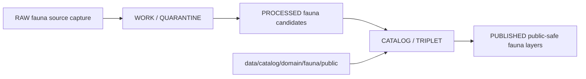

<!-- [KFM_META_BLOCK_V2]
doc_id: kfm://doc/data-catalog-domain-fauna-public-readme
title: data/catalog/domain/fauna/public/README.md — Fauna Public Catalog Sublane README
version: v0.1
type: readme; data-lifecycle-sublane; public-safe-domain-catalog-guide
status: draft; PROPOSED; data-root; catalog-stage; fauna; public-safe; release-gated; geoprivacy-aware
owners: OWNER_TBD — Fauna steward · Data steward · Catalog steward · Evidence steward · Policy steward · Release steward · Sensitivity reviewer · Docs steward
created: NEEDS VERIFICATION — blank placeholder existed before v0.1 expansion
updated: 2026-06-24
policy_label: public-doc; data; catalog; fauna; lifecycle; public-safe; release-gated; geoprivacy-aware
tags: [kfm, data, catalog, fauna, public-safe, CATALOG, TRIPLET, OccurrencePublic, OccurrenceRestricted, SensitiveSite, RedactionReceipt, EvidenceBundle, ReleaseManifest]
related:
  - ../../../README.md
  - ../../../../README.md
  - ../../../../../docs/domains/fauna/ARCHITECTURE.md
  - ../../../../../docs/domains/fauna/SOURCE_REGISTRY.md
  - ../../../../../docs/domains/fauna/MAP_UI_CONTRACTS.md
  - ../../../../../contracts/domains/fauna/
  - ../../../../../schemas/contracts/v1/domains/fauna/
  - ../../../../../policy/domains/fauna/
  - ../../../../../policy/sensitivity/fauna/
  - ../../../../../data/proofs/
  - ../../../../../data/receipts/
  - ../../../../../release/
notes:
  - "This file replaces a blank placeholder at `data/catalog/domain/fauna/public/README.md`."
  - "Fauna architecture identifies `data/catalog/domain/fauna/` as the catalog lane and `data/published/layers/fauna/` as the public-safe layer lane."
  - "This folder may index public-safe catalog records; it is not the published layer artifact root."
  - "Sensitive exact occurrence and SensitiveSite material require public-safe derivatives, review/policy gates, and receipt links before public use."
  - "Rollback target for this replacement is previous blank blob SHA `8b137891791fe96927ad78e64b0aad7bded08bdc`."
[/KFM_META_BLOCK_V2] -->

# data/catalog/domain/fauna/public

> Public-safe Fauna catalog sublane for released or release-candidate catalog records that describe public derivatives of Fauna evidence without exposing restricted occurrence or sensitive-site material.

  
  
  
  
  
  

**Status:** draft / PROPOSED  
**Owners:** OWNER_TBD — Fauna steward · Data steward · Catalog steward · Evidence steward · Policy steward · Release steward · Sensitivity reviewer · Docs steward  
**Path:** `data/catalog/domain/fauna/public/README.md`  
**Owning root:** `data/catalog/domain/fauna/`  
**Sublane:** `public`  
**Lifecycle stage:** `CATALOG / TRIPLET`  
**Exposure posture:** RELEASED ONLY  
**Truth posture:** CONFIRMED target was blank · CONFIRMED parent catalog lane is RELEASED ONLY · CONFIRMED Fauna architecture identifies `data/catalog/domain/fauna/` as the catalog lane and `data/published/layers/fauna/` as the public-safe layer lane · CONFIRMED Fauna architecture defines restricted/public occurrence separation and sensitive-site default protections · NEEDS VERIFICATION for concrete public catalog records, schemas, validators, receipts, policy gates, release manifests, and route behavior.

**Quick jumps:** [Purpose](#purpose) · [Lifecycle boundary](#lifecycle-boundary) · [Repo fit](#repo-fit) · [Accepted contents](#accepted-contents) · [Exclusions](#exclusions) · [Public-safe catalog requirements](#public-safe-catalog-requirements) · [Sensitivity guardrails](#sensitivity-guardrails) · [Evidence ledger](#evidence-ledger) · [Validation checklist](#validation-checklist) · [Rollback](#rollback)

---

## Purpose

`data/catalog/domain/fauna/public/` stores or stages Fauna catalog records and indexes for public-safe derivatives. It is a catalog lane for discoverability and release closure, not a storage home for raw observations, restricted occurrences, sensitive sites, proof records, release decisions, or published layer artifacts.

Likely records include public occurrence summaries, public-safe range or seasonal-range catalog records, generalized monitoring-event summaries, non-sensitive conservation-status records, public invasive-species summaries, abundance/richness indicators, and release-linked layer catalog entries.

A public catalog record supports discovery and review. It does **not** make a Fauna claim true, public, policy-admitted, evidence-supported, or released by itself.

## Lifecycle boundary

`data/catalog/domain/fauna/public/` is a CATALOG-stage sublane. Public exposure applies only to records tied to an approved release, governed access path, evidence support, source-role support, sensitivity decision, and required receipts.

## Repo fit

| Responsibility | Correct home | Rule |
|---|---|---|
| Public-safe Fauna catalog records | `data/catalog/domain/fauna/public/` | This lane. |
| Parent Fauna domain catalog | `data/catalog/domain/fauna/` | Domain-level Fauna catalog grouping. |
| Restricted Fauna evidence/catalog records | restricted/reviewed catalog lanes, processed lane, or proof roots as accepted | Do not store sensitive exact material here. |
| Published Fauna layers | `data/published/layers/fauna/` | Public-safe materialized layer artifacts. |
| Fauna evidence/proofs | `data/proofs/` | EvidenceBundle and proof records. |
| Fauna receipts | `data/receipts/` | RedactionReceipt, CatalogBuildReceipt, RunReceipt, ValidationReport, PolicyDecision, review/correction receipts. |
| Release decisions | `release/` | Publication authority. |
| Fauna schemas and policy | `schemas/contracts/v1/domains/fauna/`, `policy/domains/fauna/`, `policy/sensitivity/fauna/` | Separate roots; path status remains NEEDS VERIFICATION. |

## Accepted contents

| Content | Purpose |
|---|---|
| `OccurrencePublic` catalog entries | Public-safe derivative of occurrence evidence. |
| Public-safe range and seasonal-range catalog entries | Coarse or release-approved species range summaries. |
| Public monitoring-event summaries | Generalized or non-sensitive summaries with evidence links. |
| Public invasive-species summaries | Release-approved invasive records and indexes. |
| Public conservation-status entries | Authority-supported status records with source and effective time. |
| Abundance/richness indicator catalog entries | Derived public-safe indicators with receipts and evidence links. |
| Release-linked catalog indexes | Pointers to release-approved public Fauna catalog subsets. |

## Exclusions

| Do not put here | Correct home |
|---|---|
| RAW fauna source files | `data/raw/fauna/` |
| WORK/intermediate data | `data/work/fauna/` |
| Quarantined fauna data | `data/quarantine/fauna/` |
| Processed fauna datasets | `data/processed/fauna/` |
| Restricted exact occurrences | restricted/reviewed lane, processed lane, or proof roots as accepted |
| SensitiveSite geometry | restricted/reviewed lane or proof roots with policy controls |
| EvidenceBundle/proof records | `data/proofs/` |
| Receipts | `data/receipts/` |
| Release decisions | `release/` |
| Published public layer artifacts | `data/published/layers/fauna/` |
| Schemas | `schemas/` |
| Policy rules | `policy/` |
| Validators/tests/code | `tools/validators/`, `tests/`, implementation roots |

## Public-safe catalog requirements

PROPOSED until schemas, validators, and source inventory are verified:

| Requirement | Meaning |
|---|---|
| Stable public catalog identity | Record must have a stable identity linked to its parent evidence or release object. |
| Evidence reference | Record must point to EvidenceBundle/proof context when claims depend on evidence. |
| Source reference | Record must point to SourceDescriptor/source catalog where source role matters. |
| Sensitivity decision | Record must carry or link to sensitivity/publication posture. |
| Redaction/generalization receipt | Public derivative records from sensitive input must link to a RedactionReceipt or equivalent transform receipt. |
| Release reference | Public or release-linked records must point to immutable ReleaseManifest and rollback target. |
| Closure compatibility | Domain catalog, STAC, DCAT, and PROV agreement must hold where those projections exist. |

## Sensitivity guardrails

- Public Fauna catalog records are catalog carriers, not occurrence truth by themselves.
- `OccurrencePublic` must remain distinguishable from `OccurrenceRestricted`.
- Exact sensitive occurrence, nest, den, roost, hibernaculum, spawning, lek, telemetry, and steward-flagged site information must not be exposed through this public catalog lane.
- Public records should point to generalized, redacted, or aggregated derivatives rather than exact restricted source material.
- Source-role distinctions remain visible: aggregator records must not become authority records without supporting evidence and policy review.
- Unreleased public-lane catalog records are not public merely because they exist under this directory.

## Evidence ledger

| Source | Status | Supports | Limits |
|---|---|---|---|
| `data/catalog/domain/fauna/public/README.md` previous file | CONFIRMED | Target existed as a blank placeholder. | Did not define lane boundaries. |
| `data/catalog/README.md` | CONFIRMED | Parent catalog lane, domain catalog layout, RELEASED ONLY posture. | Does not prove Fauna public catalog inventory. |
| `docs/domains/fauna/ARCHITECTURE.md` | CONFIRMED doctrine / PROPOSED implementation | Fauna object families, catalog path, restricted/public split, sensitivity posture, release requirements. | Many exact files, validators, and route names remain NEEDS VERIFICATION. |

## Validation checklist

- [ ] Confirm actual child files and public Fauna catalog inventory under this lane.
- [ ] Confirm Fauna public catalog schema/profile location.
- [ ] Confirm catalog validators and CI checks.
- [ ] Confirm EvidenceBundle, SourceDescriptor, RunReceipt, ValidationReport, PolicyDecision, RedactionReceipt, and ReleaseManifest references.
- [ ] Confirm `OccurrenceRestricted` to `OccurrencePublic` lineage and digest/linkage behavior.
- [ ] Confirm sensitive-site, telemetry, exact-location, rights, source-role, stale-state, and publication handling.
- [ ] Confirm correction, withdrawal, supersession, and rollback behavior for stale or failed records.

## Rollback

Rollback is required if this lane becomes a Fauna source-data root, restricted-occurrence store, sensitive-site store, proof store, release-decision root, published-output root, schema root, policy root, validator root, implementation root, or public exposure shortcut.

Rollback target for this replacement: previous blank blob SHA `8b137891791fe96927ad78e64b0aad7bded08bdc`.

<a href="#top">Back to top</a>

