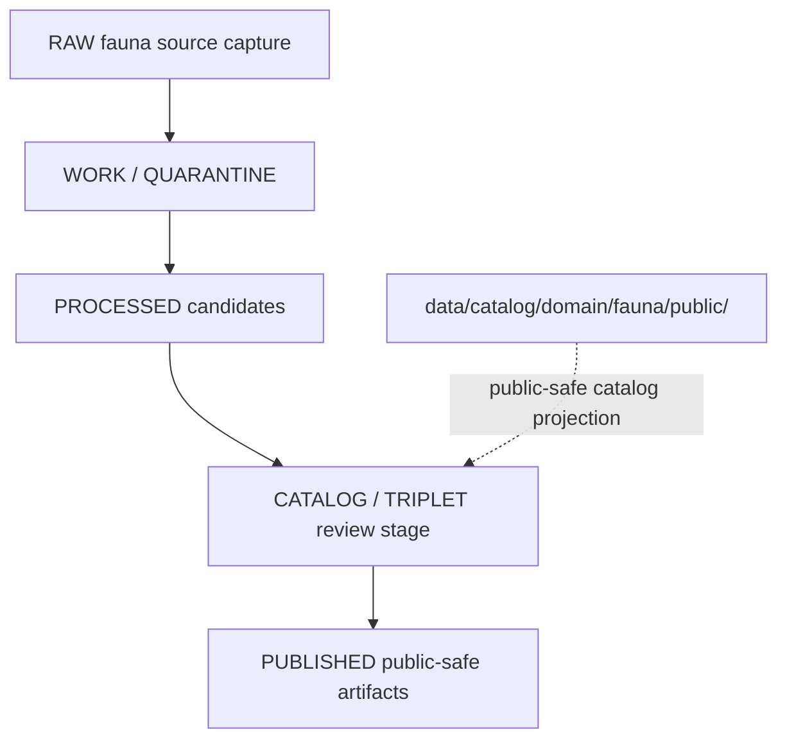

<!-- [KFM_META_BLOCK_V2]
doc_id: kfm://doc/data-catalog-domain-fauna-public-readme
title: data/catalog/domain/fauna/public/README.md — Fauna Public-Safe Catalog Sublane
version: v0.2.0
type: readme; data-lifecycle-sublane; public-safe-domain-catalog-guide
status: repository-grounded draft; PROPOSED catalog contract; release-gated; no-direct-public-path
owners: NEEDS VERIFICATION — Fauna steward · Data steward · Catalog steward · Evidence steward · Policy steward · Release steward · Sensitivity reviewer · Docs steward
created: NEEDS VERIFICATION — blank placeholder existed before v0.1 expansion
updated: 2026-07-25
policy_label: public-doc; data; catalog; fauna; public-safe; release-gated; geoprivacy-aware
tags: [kfm, data, catalog, fauna, public-safe, CATALOG, OccurrencePublic, OccurrenceRestricted, RedactionReceipt, EvidenceBundle, ReleaseManifest]
related:
  - ../README.md
  - ../../../README.md
  - ../../../../README.md
  - ../../../../../docs/doctrine/directory-rules.md
  - ../../../../../docs/domains/fauna/ARCHITECTURE.md
  - ../../../../../docs/domains/fauna/DATA_LIFECYCLE.md
  - ../../../../../docs/domains/fauna/SENSITIVITY.md
  - ../../../../../docs/domains/fauna/VERIFICATION_BACKLOG.md
  - ../../../../../contracts/domains/fauna/occurrence_public.md
  - ../../../../../contracts/domains/fauna/occurrence_restricted.md
  - ../../../../../schemas/contracts/v1/domains/fauna/occurrence_public.schema.json
  - ../../../../../policy/domains/fauna/README.md
  - ../../../../../policy/sensitivity/fauna/README.md
  - ../../../../../data/registry/sources/fauna/README.md
  - ../../../../../fixtures/domains/fauna/golden/public_safe_density_grid.json
  - ../../../../../tests/domains/fauna/test_fauna_smoke.py
  - ../../../../../.github/workflows/domain-fauna.yml
evidence_snapshot:
  repository: bartytime4life/Kansas-Frontier-Matrix
  base_ref: main
  base_commit: 57c1a05b07b29793a5747a25b83594b6598df812
  target_blob: 3aac0889ea15f341ee51bea1016bdcf84466d0c3
  directory_rules_blob: 2affb080e6f0043867c64c7f06c1ca52030fbd55
  occurrence_public_contract_blob: d0c1481160b4979445a916915ff96d04d48f7033
  occurrence_public_schema_blob: 4d7d0f1b642b46c5a567561372b2443bb93b8ce8
  public_safe_fixture_blob: 11654857a9ab35b1c13f63802d0c5a7f94b3d30b
  fauna_workflow_blob: 199305953a3149124eb4070b9d86b1fe517be67b
notes:
  - "Same-path v0.2 modernization of the v0.1 README; no catalog payload, schema, policy, fixture, test, workflow, source record, release object, or published artifact is changed."
  - "Directory Rules sections 4, 9.1, and 12 place this document under the canonical data/ responsibility root, CATALOG phase, and fauna domain lane."
  - "The OccurrencePublic contract and paired schema exist, but the schema remains an empty permissive PROPOSED scaffold."
  - "The verified public-safe density-grid fixture and Fauna smoke test remain placeholders; validate-fauna is an explicit readiness hold."
  - "No real species location, sensitive-site detail, geoprivacy parameter, source payload, or publication path is introduced."
  - "The historical pre-v0.1 blank blob was 8b137891791fe96927ad78e64b0aad7bded08bdc."
[/KFM_META_BLOCK_V2] -->

# data/catalog/domain/fauna/public

> **Public-safe Fauna catalog sublane.** This directory may hold governed catalog projections for public-safe Fauna derivatives; it is not a source-data store, publication authority, published-artifact root, or direct public service.

> [!IMPORTANT]
> A path under `public/`, a catalog record, a schema pass, a green held workflow, a pull request, or a merge does not make Fauna material true, rights-cleared, policy-admitted, reviewed, released, public-safe, or KFM-published.

> [!CAUTION]
> Do not place exact or reconstructive sensitive occurrence or site information here. Public-safe transformation must happen before a catalog projection reaches this lane, and client-side hiding is not a secrecy control.

**Quick navigation:** [Purpose](#purpose) · [Status](#status-and-authority) · [Lifecycle](#lifecycle-boundary) · [Repository fit](#repo-fit) · [Accepted contents](#accepted-contents) · [Exclusions](#exclusions) · [Inputs and outputs](#inputs-and-outputs) · [Requirements](#public-safe-catalog-requirements) · [Guardrails](#sensitivity-guardrails) · [Evidence](#evidence-ledger) · [Validation](#validation-checklist) · [Rollback](#rollback)

---

## Purpose

`data/catalog/domain/fauna/public/` is the CATALOG-phase sublane for catalog records and indexes that describe approved public-safe Fauna derivatives.

The lane supports discovery, review, evidence linkage, and release closure. It does **not** own Fauna occurrence truth, raw or processed evidence, source authority, machine shape, policy, sensitivity decisions, transform execution, review approval, release decisions, or published layer artifacts.

## Status and authority

| Field | Current bounded state |
|---|---|
| Path | `data/catalog/domain/fauna/public/` |
| Owning responsibility root | Canonical `data/` root |
| Parent lane | [`data/catalog/domain/fauna/`](../README.md) |
| Lifecycle responsibility | `CATALOG`; paired with the CATALOG / TRIPLET lifecycle stage, but not a triplet store |
| Domain segment | `fauna` |
| Document status | Repository-grounded draft |
| Catalog contract status | PROPOSED |
| Direct public path | **No** — public clients use governed interfaces and released artifacts |
| Accountable owners | NEEDS VERIFICATION |
| Current enforcement | Schema, fixture, test, policy, source-record, and release closure are not established for this lane |

Directory Rules place lifecycle data under `data/`, catalog projections under `data/catalog/`, and domain-specific catalog material under `data/catalog/domain/<domain>/`. This nested `public/` segment narrows exposure posture; it does not create a new authority root or skip release governance.

## Lifecycle boundary

```mermaid
flowchart TB
    RAW["RAW fauna source capture"]
    WORK["WORK / QUARANTINE"]
    PROCESSED["PROCESSED candidates"]
    CATALOG["CATALOG / TRIPLET review stage"]
    PUBLISHED["PUBLISHED public-safe artifacts"]
    PUBLIC["data/catalog/domain/fauna/public/"]

    RAW --> WORK
    WORK --> PROCESSED
    PROCESSED --> CATALOG
    CATALOG --> PUBLISHED
    PUBLIC -. "public-safe catalog projection" .-> CATALOG
```

Promotion is a governed state transition, not a file move. Material in this sublane remains internal unless evidence, source role, rights, sensitivity, transform lineage, validation, policy, independent review where required, release, correction, withdrawal, and rollback obligations close for the intended public operation.

## Repo fit

| Responsibility | Correct home | Boundary |
|---|---|---|
| Public-safe Fauna catalog projections | `data/catalog/domain/fauna/public/` | This lane; catalog records and indexes only |
| Fauna catalog parent and public/restricted crosswalks | [`data/catalog/domain/fauna/`](../README.md) | Domain-level catalog grouping |
| Restricted Fauna catalog projections | [`data/catalog/domain/fauna/restricted/`](../restricted/README.md) | Restricted sibling; never copied here as exact material |
| Fauna source records | `data/raw/fauna/` through `data/processed/fauna/` | Lifecycle payloads; not catalog documentation |
| Published Fauna artifacts | `data/published/layers/fauna/` | Released public-safe artifacts, separate from catalog records |
| Source descriptors | [`data/registry/sources/fauna/`](../../../../registry/sources/fauna/README.md) | Admission and source-role records; not public truth |
| Evidence and proof | `data/proofs/` | EvidenceBundle and proof families |
| Process receipts | `data/receipts/` | Validation, transform, policy, review, and run memory |
| Release, correction, withdrawal, and rollback decisions | `release/` | Publication authority |
| Semantic meaning | [`contracts/domains/fauna/`](../../../../../contracts/domains/fauna/README.md) | Object-family meaning |
| Machine shape | [`schemas/contracts/v1/domains/fauna/`](../../../../../schemas/contracts/v1/domains/fauna/README.md) | JSON Schema and validation shape |
| Admissibility and sensitivity | [`policy/domains/fauna/`](../../../../../policy/domains/fauna/README.md) and [`policy/sensitivity/fauna/`](../../../../../policy/sensitivity/fauna/README.md) | Policy authority; both inspected READMEs remain scaffolds |
| Validators and tests | `tools/validators/`, `tests/`, and `fixtures/` | Enforceability; not release authority |

## Accepted contents

Content is admissible here only after its owning contracts and gates support the intended operation.

| Admissible content | Required boundary |
|---|---|
| Catalog projection of an `OccurrencePublic` record | Must reference the public-safe derivative and its upstream evidence without embedding restricted geometry or transform parameters |
| Public-safe range, seasonal, monitoring, status, invasive, richness, or density catalog projection | Must use the applicable object-family contract; must not relabel modeled, aggregate, regulatory, or contextual support as observed occurrence truth |
| Restricted-to-public derivative crosswalk | Pointer-based linkage only; restricted parent details remain outside this lane |
| Release-linked catalog subset or index | References an immutable release decision and rollback target; does not store the ReleaseManifest itself |
| Catalog quality or closure summary | Points to validation/evidence/receipt records and states the scope of the check |
| README or compact inventory sidecar | Explains the lane without becoming payload, schema, policy, proof, or release authority |

No concrete catalog payload inventory was established in the pinned review. File presence must be verified before any record family is described as implemented.

## Exclusions

| Do not put here | Correct home or action |
|---|---|
| RAW, WORK, QUARANTINE, or PROCESSED payloads | Their `data/<phase>/fauna/` lifecycle lanes |
| Exact or reverse-engineerable sensitive occurrence or site material | Restricted governed storage or QUARANTINE; fail closed |
| Restricted coordinates, precise timestamps that re-identify a site, observer/private identifiers, or private-parcel joins | Omit, generalize, aggregate, delay, or deny under reviewed policy |
| Geoprivacy radii, seeds, thresholds, masks, or other transform parameters | Accepted restricted policy/configuration surface; never public catalog prose |
| `OccurrenceRestricted`, `SensitiveSite`, or source-native records | Restricted/evidence lifecycle lanes and owning contracts |
| EvidenceBundle, proof pack, or integrity bundle | `data/proofs/` |
| Validation, redaction, aggregation, policy, review, or run receipts | `data/receipts/` or the accepted receipt home |
| ReleaseManifest, PromotionDecision, CorrectionNotice, WithdrawalNotice, or RollbackCard | `release/` |
| Published tiles, GeoParquet, PMTiles, API payloads, reports, or map layers | `data/published/` after governed release |
| Source descriptors or source payloads | `data/registry/` and lifecycle source lanes |
| Contracts, schemas, policy, validators, fixtures, or tests | Their canonical responsibility roots |

## Inputs and outputs

| Direction | Bounded contract |
|---|---|
| Inputs | Pointer-based public-safe derivative identity; EvidenceRef/EvidenceBundle context; SourceDescriptor and source-role context; rights and sensitivity posture; validation and transform receipt references; policy/review state; release/correction/rollback context |
| Internal outputs | Catalog records, indexes, and crosswalks suitable for review or release binding |
| Public outputs | None directly. A governed interface may expose a release-approved catalog projection at an allowed level of detail |
| Failure output | HOLD, QUARANTINE, DENY, ABSTAIN, or another finite outcome defined by the governing surface; never implicit permission |

Catalog records must remain projections. They cannot upgrade a source role, replace evidence, resolve policy by location, or manufacture release state.

## Public-safe catalog requirements

### Verified machine-readiness boundary

| Surface | Pinned repository evidence | What it does not prove |
|---|---|---|
| [`OccurrencePublic` semantic contract](../../../../../contracts/domains/fauna/occurrence_public.md) | Exists as `v0.2`, `draft`, and `PROPOSED` | Accepted semantics, implemented producers, or released records |
| [`OccurrencePublic` schema](../../../../../schemas/contracts/v1/domains/fauna/occurrence_public.schema.json) | Draft 2020-12 object schema; `properties` is empty; `additionalProperties` is `true`; status is `PROPOSED` | Field-level validation or public-safety enforcement |
| [Public-safe density-grid fixture](../../../../../fixtures/domains/fauna/golden/public_safe_density_grid.json) | Exists as a `PROPOSED` placeholder | A schema-valid catalog record, expected output, or regression proof |
| [Fauna smoke test](../../../../../tests/domains/fauna/test_fauna_smoke.py) | Contains only `test_placeholder()` with `assert True` | Fauna validation, sensitivity, rights, evidence, policy, release, or catalog behavior |
| [`validate-fauna` workflow](../../../../../.github/workflows/domain-fauna.yml) | Readiness job intentionally emits `WORKFLOW_SKIPPED_EXPLICIT` and `WORKFLOW_HOLD` while executable tests/validators are absent | Successful Fauna validation or public readiness |
| [Fauna policy README](../../../../../policy/domains/fauna/README.md) | Canonical policy lane scaffold exists | Accepted or executable Fauna policy |
| [Fauna sensitivity README](../../../../../policy/sensitivity/fauna/README.md) | PROPOSED scaffold exists | Enforced geoprivacy rules, approved transforms, or reviewer decisions |
| [Fauna source registry README](../../../../registry/sources/fauna/README.md) | Source-registry boundary exists; a parallel domain-first lane remains unresolved | Concrete active descriptors, current rights, source activation, or canonical topology |

Because the schema is permissive and executable Fauna validation is held, the following are **review obligations**, not machine-enforced field claims:

1. stable catalog and derivative identity;
2. resolvable upstream evidence and source references;
3. preserved source role and knowledge character;
4. public-safe spatial and temporal support with withheld-detail explanation where appropriate;
5. rights, sensitivity, and geoprivacy decision references;
6. transform receipt linkage when restriction, generalization, aggregation, suppression, or delay occurred;
7. policy and review records appropriate to the operation;
8. immutable release, correction, withdrawal, supersession, and rollback references before exposure;
9. catalog-profile and cross-projection agreement where STAC, DCAT, PROV, or triplet views exist.

## Sensitivity guardrails

- `OccurrencePublic` must remain distinguishable from `OccurrenceRestricted`; neither name alone establishes release state.
- Exact sensitive occurrence, nest, den, roost, hibernaculum, spawning, breeding, telemetry, steward-controlled, or reconstructive location information fails closed.
- A public record should point to a generalized, redacted, aggregated, delayed, or withheld derivative rather than reproduce restricted source detail.
- Public geometry and metadata must be evaluated together. Coarse geometry plus precise time, identifiers, sparse counts, or cross-domain context can still re-identify a protected site.
- Client-side style filters, hidden fields, low zoom, popup omission, or model refusal prompts are not secrecy controls.
- Transform parameters that could aid reversal stay out of this README and out of public catalog records.
- Source-role distinctions remain visible. Access through an aggregator does not make the aggregator an occurrence authority.
- Modeled range or suitability remains modeled; cataloging must not relabel it as observed presence.
- Unknown rights, sensitivity, source role, evidence, review, or release state blocks exposure.
- An unreleased record is not public merely because the directory segment is named `public`.

## Evidence ledger

| Evidence | Status | Supports | Limit |
|---|---:|---|---|
| [Directory Rules](../../../../../docs/doctrine/directory-rules.md) | CONFIRMED placement doctrine at pinned blob | `data/` responsibility, CATALOG phase, domain-segment pattern, release split | Does not prove catalog payloads or enforcement |
| [Parent Fauna catalog README](../README.md) | CONFIRMED repository file | Public/restricted child-lane split and catalog boundary | Does not prove records, access control, or release |
| [`data/catalog/` README](../../../README.md) | CONFIRMED repository file | Canonical catalog-projection responsibility and no-direct-public-path posture | Does not prove this sublane's inventory |
| [`OccurrencePublic` contract and schema](../../../../../contracts/domains/fauna/occurrence_public.md) | CONFIRMED files / PROPOSED semantics and shape | Public-safe occurrence intent and current permissive-schema boundary | Does not prove machine enforcement |
| [Fauna data lifecycle](../../../../../docs/domains/fauna/DATA_LIFECYCLE.md) | CONFIRMED draft repository documentation | Fail-closed lifecycle and public-safe derivative intent | Many implementation paths remain proposed |
| [Fauna sensitivity documentation](../../../../../docs/domains/fauna/SENSITIVITY.md) | CONFIRMED draft repository documentation | Deny-by-default doctrine and anti-reconstruction posture | Binding policy lane remains scaffolded |
| [Fauna verification backlog](../../../../../docs/domains/fauna/VERIFICATION_BACKLOG.md) | CONFIRMED draft register | Source, schema, validator, sensitivity, publication, UI, and join gaps remain open | Does not itself enforce a gate |
| Fixture, smoke test, and workflow cited above | CONFIRMED current files | Current readiness is placeholder/held | A green hold is not validation |

## Validation checklist

### Current review closure

- [x] Target exists at the pinned base commit and remains at the same path.
- [x] Directory Rules placement, lifecycle, and domain-lane basis inspected.
- [x] Parent catalog and Fauna catalog boundaries inspected.
- [x] `OccurrencePublic` contract and paired schema inspected.
- [x] Public-safe fixture, smoke test, and `validate-fauna` workflow inspected.
- [x] Fauna policy, sensitivity, and source-registry README posture inspected.

### Required before catalog or public-readiness claims

- [ ] Replace the permissive `OccurrencePublic` schema scaffold with a reviewed, versioned shape and compatibility plan.
- [ ] Add deterministic, synthetic, public-safe valid and fail-closed fixtures with no real species locations.
- [ ] Replace the placeholder smoke test with accepted no-network tests that exercise evidence, source-role, rights, sensitivity, transform, policy, review, release, correction, and rollback boundaries.
- [ ] Graduate `validate-fauna` only to an accepted command while preserving explicit HOLD/DENY/ABSTAIN behavior.
- [ ] Establish executable Fauna policy and sensitivity profiles with representative negative tests.
- [ ] Verify canonical source-registry topology, active SourceDescriptors, rights, terms, source roles, cadence, and activation decisions.
- [ ] Verify catalog inventory, producers, consumers, stable IDs, digests, and STAC/DCAT/PROV/triplet parity where applicable.
- [ ] Verify governed public delivery, release binding, correction, withdrawal, supersession, cache invalidation, and rollback.
- [ ] Obtain the independent specialist review required for any sensitive or release-significant operation.

Passing a bounded check proves only that check's declared scope. It does not prove truth, source authority, rights clearance, policy permission, evidence closure, release approval, public safety, or publication.

## Rollback

### Documentation rollback

Before merge, rollback means closing the draft PR or restoring the base README blob `3aac0889ea15f341ee51bea1016bdcf84466d0c3` on the review branch. The earlier blank-placeholder lineage remains recorded as blob `8b137891791fe96927ad78e64b0aad7bded08bdc`.

### Operational correction and rollback

If a catalog projection is found to expose restricted detail, overstate source role, lose evidence support, violate rights or sensitivity, or reference a withdrawn release:

1. deny or withdraw exposure through the governed interface;
2. preserve the affected record and decision history;
3. issue the required correction or withdrawal record;
4. invalidate dependent catalogs, indexes, tiles, caches, graphs, exports, and generated summaries;
5. restore the prior approved public-safe target or abstain;
6. record validation and rollback evidence without restoring restricted detail to a public surface.

Git history alone is not operational rollback, and deleting history is not correction.

---

**Last reviewed:** 2026-07-25  
**Evidence boundary:** `main@57c1a05b07b29793a5747a25b83594b6598df812`  
**Review scope:** documentation, placement, linked contract/schema, representative fixture, smoke test, workflow, policy/sensitivity scaffolds, and source-registry boundary; no payload, runtime, live source, public route, release object, or production operation inspected.

<a href="#top">Back to top</a>

