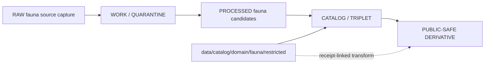

<!-- [KFM_META_BLOCK_V2]
doc_id: kfm://doc/data-catalog-domain-fauna-restricted-readme
title: data/catalog/domain/fauna/restricted/README.md — Fauna Restricted Catalog Sublane README
version: v0.1
type: readme; data-lifecycle-sublane; restricted-domain-catalog-guide
status: draft; PROPOSED; data-root; catalog-stage; fauna; restricted; review-gated; geoprivacy-aware
owners: OWNER_TBD — Fauna steward · Data steward · Catalog steward · Evidence steward · Policy steward · Release steward · Sensitivity reviewer · Docs steward
created: NEEDS VERIFICATION — blank placeholder existed before v0.1 expansion
updated: 2026-06-24
policy_label: restricted-doc; data; catalog; fauna; lifecycle; restricted; review-gated; geoprivacy-aware
tags: [kfm, data, catalog, fauna, restricted, CATALOG, TRIPLET, OccurrenceRestricted, OccurrencePublic, SensitiveSite, RedactionReceipt, EvidenceBundle, ReleaseManifest]
related:
  - ../../../README.md
  - ../../../../README.md
  - ../public/README.md
  - ../../../../../docs/domains/fauna/ARCHITECTURE.md
  - ../../../../../docs/domains/fauna/SOURCE_REGISTRY.md
  - ../../../../../docs/domains/fauna/MAP_UI_CONTRACTS.md
  - ../../../../../contracts/domains/fauna/
  - ../../../../../schemas/contracts/v1/domains/fauna/
  - ../../../../../policy/domains/fauna/
  - ../../../../../policy/sensitivity/fauna/
  - ../../../../../data/proofs/
  - ../../../../../data/receipts/
  - ../../../../../release/
notes:
  - "This file replaces a blank placeholder at `data/catalog/domain/fauna/restricted/README.md`."
  - "Fauna architecture identifies `data/catalog/domain/fauna/` as the catalog lane and defines restricted/public occurrence separation."
  - "This folder may index restricted catalog records for review and derivation; it is not a public layer or published artifact root."
  - "Public derivatives must remain linked to restricted parents through EvidenceBundle, RedactionReceipt or equivalent transform receipt, policy decision, and release record."
  - "Rollback target for this replacement is previous blank blob SHA `8b137891791fe96927ad78e64b0aad7bded08bdc`."
[/KFM_META_BLOCK_V2] -->

# data/catalog/domain/fauna/restricted

> Restricted Fauna catalog sublane for steward-governed catalog records that describe exact or sensitive Fauna evidence before public-safe derivation.

  
  
  
  
  
  

**Status:** draft / PROPOSED  
**Owners:** OWNER_TBD — Fauna steward · Data steward · Catalog steward · Evidence steward · Policy steward · Release steward · Sensitivity reviewer · Docs steward  
**Path:** `data/catalog/domain/fauna/restricted/README.md`  
**Owning root:** `data/catalog/domain/fauna/`  
**Sublane:** `restricted`  
**Lifecycle stage:** `CATALOG / TRIPLET`  
**Exposure posture:** restricted / steward-governed; public use only through approved derivative lanes  
**Truth posture:** CONFIRMED target was blank · CONFIRMED parent catalog lane is RELEASED ONLY for public exposure · CONFIRMED public Fauna catalog lane excludes restricted exact occurrence and SensitiveSite material · CONFIRMED Fauna architecture defines restricted/public occurrence separation, sensitive-site default protections, and release requirements · NEEDS VERIFICATION for concrete restricted catalog records, schemas, validators, policy gates, receipt paths, access controls, and release workflows.

**Quick jumps:** [Purpose](#purpose) · [Lifecycle boundary](#lifecycle-boundary) · [Repo fit](#repo-fit) · [Accepted contents](#accepted-contents) · [Exclusions](#exclusions) · [Restricted catalog requirements](#restricted-catalog-requirements) · [Derivative guardrails](#derivative-guardrails) · [Evidence ledger](#evidence-ledger) · [Validation checklist](#validation-checklist) · [Rollback](#rollback)

---

## Purpose

`data/catalog/domain/fauna/restricted/` stores or stages restricted Fauna catalog records and indexes that are needed for steward review, proof closure, geoprivacy transforms, and public-safe derivative creation.

Likely records include restricted occurrence catalog entries, sensitive-site catalog entries, exact telemetry summaries, exact monitoring-event catalog entries, restricted disease or mortality observations, source-role-sensitive catalog records, and links to public-safe derivatives.

A restricted catalog record supports governed review and traceable transformation. It does **not** make a Fauna claim public, policy-admitted, release-approved, or safe for general access by itself.

## Lifecycle boundary

`data/catalog/domain/fauna/restricted/` is a CATALOG-stage sublane. It may support public derivatives only after review, policy decision, evidence closure, transformation receipt, release linkage, and rollback target are available.

## Repo fit

| Responsibility | Correct home | Rule |
|---|---|---|
| Restricted Fauna catalog records | `data/catalog/domain/fauna/restricted/` | This lane. |
| Public-safe Fauna catalog records | `data/catalog/domain/fauna/public/` | Derivative lane; no restricted material. |
| Parent Fauna domain catalog | `data/catalog/domain/fauna/` | Domain-level Fauna catalog grouping. |
| Processed Fauna candidates | `data/processed/fauna/` | Upstream normalized data. |
| Public Fauna layers | `data/published/layers/fauna/` | Materialized public-safe layer artifacts after release. |
| Evidence/proof records | `data/proofs/` | EvidenceBundle and proof records. |
| Receipts | `data/receipts/` | RedactionReceipt, CatalogBuildReceipt, RunReceipt, ValidationReport, PolicyDecision, review/correction receipts. |
| Release decisions | `release/` | Publication authority. |
| Fauna schemas and policy | `schemas/contracts/v1/domains/fauna/`, `policy/domains/fauna/`, `policy/sensitivity/fauna/` | Separate roots; path status remains NEEDS VERIFICATION. |

## Accepted contents

| Content | Purpose |
|---|---|
| `OccurrenceRestricted` catalog entries | Restricted counterpart to public occurrence derivatives. |
| `SensitiveSite` catalog entries | Sensitive site records requiring review and policy constraints. |
| Restricted monitoring-event summaries | Survey, telemetry, acoustic, eDNA, disease, or mortality catalog entries with sensitive detail. |
| Restricted source-role notes | Source-role and evidence limitations not suitable for public surfaces. |
| Evidence and source pointers | References to EvidenceBundle, SourceDescriptor, receipts, and validation reports. |
| Transform links | Links to `OccurrencePublic` or other public-safe derivatives and their receipts. |
| Review and policy pointers | Links to ReviewRecord, PolicyDecision, sensitivity classification, and obligations. |

## Exclusions

| Do not put here | Correct home |
|---|---|
| RAW fauna source files | `data/raw/fauna/` |
| WORK/intermediate data | `data/work/fauna/` |
| Quarantined fauna data | `data/quarantine/fauna/` |
| Processed fauna datasets | `data/processed/fauna/` |
| Public-safe catalog entries | `data/catalog/domain/fauna/public/` |
| EvidenceBundle/proof records | `data/proofs/` |
| Receipts | `data/receipts/` |
| Release decisions | `release/` |
| Published public layer artifacts | `data/published/layers/fauna/` |
| Schemas | `schemas/` |
| Policy rules | `policy/` |
| Validators/tests/code | `tools/validators/`, `tests/`, implementation roots |

## Restricted catalog requirements

PROPOSED until schemas, validators, and access policy are verified:

| Requirement | Meaning |
|---|---|
| Stable restricted identity | Record must have a stable identity linked to source and evidence. |
| Parent-child linkage | Restricted records must link to any public-safe derivative by digest, identifier, or receipt chain. |
| Evidence reference | EvidenceBundle/proof context must be referenced when claims depend on evidence. |
| Source reference | SourceDescriptor/source catalog must be referenced where source role matters. |
| Sensitivity classification | Record must carry or link to sensitivity posture and obligations. |
| Review reference | ReviewRecord or equivalent review state must be linked when material. |
| Transform receipt | Public derivative must link to RedactionReceipt or equivalent transform receipt. |
| Release linkage | Public use requires immutable ReleaseManifest and rollback target. |

## Derivative guardrails

- Restricted Fauna catalog records are not public records.
- `OccurrenceRestricted` and `OccurrencePublic` must remain distinguishable and linked.
- Sensitive site, exact occurrence, telemetry, nest, den, roost, hibernaculum, spawning, lek, and steward-flagged records require policy and review before any public-safe derivative is used.
- Public derivatives should be generalized, redacted, or aggregated, with receipt chains preserved.
- Source-role distinctions remain visible: aggregator records must not become authority records without supporting evidence and policy review.
- This lane must not be read directly by public clients.

## Evidence ledger

| Source | Status | Supports | Limits |
|---|---|---|---|
| `data/catalog/domain/fauna/restricted/README.md` previous file | CONFIRMED | Target existed as a blank placeholder. | Did not define lane boundaries. |
| `data/catalog/README.md` | CONFIRMED | Parent catalog lane, domain catalog layout, RELEASED ONLY public posture. | Does not prove Fauna restricted catalog inventory. |
| `data/catalog/domain/fauna/public/README.md` | CONFIRMED | Public lane excludes restricted exact occurrence and SensitiveSite material. | Does not define restricted lane behavior fully. |
| `docs/domains/fauna/ARCHITECTURE.md` | CONFIRMED doctrine / PROPOSED implementation | Fauna object families, restricted/public split, sensitivity posture, release requirements. | Many exact files, validators, and route names remain NEEDS VERIFICATION. |

## Validation checklist

- [ ] Confirm actual child files and restricted Fauna catalog inventory under this lane.
- [ ] Confirm Fauna restricted catalog schema/profile location.
- [ ] Confirm access policy, validators, and CI checks.
- [ ] Confirm EvidenceBundle, SourceDescriptor, RunReceipt, ValidationReport, PolicyDecision, ReviewRecord, RedactionReceipt, and ReleaseManifest references.
- [ ] Confirm `OccurrenceRestricted` to `OccurrencePublic` linkage and digest behavior.
- [ ] Confirm sensitive-site, telemetry, exact-location, rights, source-role, stale-state, and review handling.
- [ ] Confirm correction, withdrawal, supersession, and rollback behavior for stale or failed records.

## Rollback

Rollback is required if this lane becomes a Fauna raw-data root, work area, quarantine store, processed-data store, public catalog root, proof store, release-decision root, published-output root, schema root, policy root, validator root, implementation root, or public exposure shortcut.

Rollback target for this replacement: previous blank blob SHA `8b137891791fe96927ad78e64b0aad7bded08bdc`.

<a href="#top">Back to top</a>

