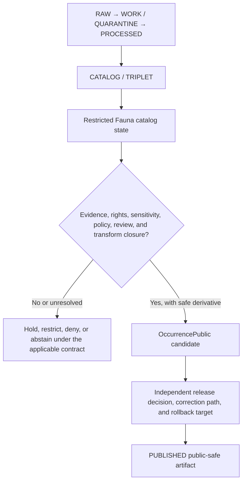

<!-- [KFM_META_BLOCK_V2]
doc_id: kfm://doc/data-catalog-domain-fauna-restricted-readme
title: data/catalog/domain/fauna/restricted/README.md — Fauna Restricted Catalog Sublane
version: v0.2.0
type: readme; data-lifecycle-sublane; restricted-domain-catalog-guide
status: repository-grounded draft; PROPOSED restricted-catalog contract; deny-by-default; no-public-data-path; release-gated
owners: NEEDS VERIFICATION — accountable Fauna, catalog, evidence, source, rights, sensitivity, policy, release, correction, and documentation stewardship; GitHub review route is @bartytime4life
created: NEEDS VERIFICATION — blank placeholder existed before v0.1 expansion
updated: 2026-07-25
policy_label: public-control-doc; data; catalog; fauna; restricted-data-boundary; deny-by-default; review-gated
tags: [kfm, data, catalog, fauna, restricted, CATALOG, OccurrenceRestricted, OccurrencePublic, SensitiveSite, RedactionReceipt, EvidenceBundle, ReleaseManifest]
related:
  - ../README.md
  - ../public/README.md
  - ../../../README.md
  - ../../../../README.md
  - ../../../../../docs/doctrine/directory-rules.md
  - ../../../../../docs/adr/ADR-0010-deny-by-default-for-dna-rare-species-archaeology-infrastructure.md
  - ../../../../../docs/adr/ADR-0011-receipts-vs-proofs-vs-manifests-vs-catalog-separation.md
  - ../../../../../docs/adr/ADR-0025-public-client-never-reads-canonical-internal-stores.md
  - ../../../../../docs/domains/fauna/ARCHITECTURE.md
  - ../../../../../docs/domains/fauna/DATA_LIFECYCLE.md
  - ../../../../../docs/domains/fauna/SENSITIVITY.md
  - ../../../../../docs/domains/fauna/VERIFICATION_BACKLOG.md
  - ../../../../../contracts/domains/fauna/occurrence_restricted.md
  - ../../../../../contracts/domains/fauna/occurrence_public.md
  - ../../../../../schemas/contracts/v1/domains/fauna/occurrence_restricted.schema.json
  - ../../../../../schemas/contracts/v1/domains/fauna/occurrence_public.schema.json
  - ../../../../../policy/domains/fauna/README.md
  - ../../../../../policy/sensitivity/fauna/README.md
  - ../../../../../data/registry/sources/fauna/README.md
  - ../../../../../data/proofs/fauna/README.md
  - ../../../../../release/candidates/fauna/README.md
  - ../../../../../fixtures/domains/fauna/README.md
  - ../../../../../tests/domains/fauna/test_fauna_smoke.py
  - ../../../../../tools/validators/domains/fauna/validate_public_safe_fixture.py
  - ../../../../../data/receipts/generated/genrec-fauna-public-safe-validation-100d863d.json
  - ../../../../../.github/workflows/domain-fauna.yml
evidence_snapshot:
  repository: bartytime4life/Kansas-Frontier-Matrix
  repository_visibility: public
  base_ref: main
  base_commit: 31cd8a7ed4425c3bfefef60ee8da08d074020fa1
  target_blob: a73d32f10403f0a9c6e4883c7f5ac55158b70c33
  directory_rules_blob: 2affb080e6f0043867c64c7f06c1ca52030fbd55
  occurrence_restricted_contract_blob: 47f2623c61afde5f198b9b226ffbdd2ef5e3d38e
  occurrence_restricted_schema_blob: 242f04fa30b689237451700b82ec1c4d4f082ff1
  fauna_sensitivity_doc_blob: 58c557cda55362345ac3869502910bc301ef5b8c
  fauna_policy_blob: 925efbdfacb5e63252793f27e1386a247a36ad1f
  fauna_deny_default_policy_blob: e7f04b7cb38eb52b1edc8f052b65ad8a35dbe545
  fauna_geoprivacy_policy_blob: b3b6253dd2bd6b2ba3bcd550e31c6a0d8da408e9
  fauna_sensitive_taxa_policy_blob: f59c960d265c83924db97cf960f7b5f3b0fe2ce1
  fauna_fixture_profile_blob: dd02bd0d50aa880b718bcd12a95ca46773ff42c1
  fauna_validator_blob: 027d1a1fb7525f00037e97d803acf694f17ef380
  fauna_test_blob: ad45aa6d535611f14080adb2b7279666369711a7
  fauna_workflow_blob: 85b0a8b42f9af40366de2b0c7d733892d4220ee0
  fauna_validation_receipt_blob: d572fda81170aa9431dece932fa81eeede8a6c4a
notes:
  - "Same-path v0.2 modernization of the v0.1 README; no catalog payload, schema, policy, fixture, test, workflow, source record, proof, release object, or published artifact is changed."
  - "Directory Rules sections 4, 9.1, and 12 place this document under the canonical data/ responsibility root, CATALOG phase, and fauna domain lane."
  - "The OccurrenceRestricted contract exists as draft semantics, while its paired schema remains an empty permissive PROPOSED scaffold."
  - "The verified Fauna policy files are default-deny PROPOSED scaffolds; an accepted evaluator, access-control path, and operational geoprivacy transform were not established."
  - "At the pinned base, validate-fauna runs one accepted deterministic no-network synthetic public-safe fixture slice; it is not an OccurrenceRestricted catalog validator. Proof and release-dry-run jobs remain explicit readiness holds."
  - "No real species or site location, reconstructive clue, protected source excerpt, private-land join, steward-only note, access-control detail, or geoprivacy parameter is introduced."
  - "The historical pre-v0.1 blank blob was 8b137891791fe96927ad78e64b0aad7bded08bdc."
[/KFM_META_BLOCK_V2] -->

# data/catalog/domain/fauna/restricted

> **Boundary guide for restricted Fauna catalog state.** This lane describes how protected or exact Fauna catalog records remain review-gated and traceable before any separately governed public-safe derivative is considered.

> [!IMPORTANT]
> A restricted label, catalog path, schema pass, default-deny scaffold, green held workflow, pull request, or merge does not make Fauna material evidence-closed, rights-cleared, sensitivity-safe, policy-admitted, reviewed, released, public-safe, or KFM-published.

> [!CAUTION]
> This repository is public. Do not commit real or reconstructive occurrence or site detail, protected source excerpts, private-land joins, steward-only notes, access-control clues, or geoprivacy parameters here. Repository placement is not an access control.

**Quick navigation:** [Purpose](#purpose) · [Status](#status-and-authority) · [Visibility](#repository-visibility-boundary) · [Lifecycle](#lifecycle-boundary) · [Repository fit](#repo-fit) · [Accepted contents](#accepted-contents) · [Exclusions](#exclusions) · [Inputs and outputs](#inputs-and-outputs) · [Requirements](#restricted-catalog-requirements) · [Guardrails](#derivative-guardrails) · [Failure behavior](#failure-correction-and-withdrawal) · [Evidence](#evidence-ledger) · [Validation](#validation-checklist) · [Review](#review-burden) · [Related](#related-authority-surfaces) · [Open work](#open-verification-register) · [Rollback](#rollback)

---

## Purpose

`data/catalog/domain/fauna/restricted/` is the CATALOG-phase responsibility lane for metadata and indexes describing Fauna records whose precision, taxon or site context, source terms, steward control, private-land relationship, or re-identification risk prevents ordinary public use.

The lane supports bounded discovery, evidence linkage, review, correction, and traceable derivation. It does **not** own occurrence truth, source payloads, approved restricted storage, machine shape, policy decisions, access control, geoprivacy execution, review approval, release decisions, or public delivery.

## Status and authority

| Field | Current bounded state |
|---|---|
| Path | `data/catalog/domain/fauna/restricted/` |
| Owning responsibility root | Canonical `data/` root |
| Parent lane | [`data/catalog/domain/fauna/`](../README.md) |
| Lifecycle responsibility | `CATALOG`; paired with the CATALOG / TRIPLET stage, but not a triplet store |
| Domain segment | `fauna` |
| Document status | Repository-grounded draft |
| Restricted catalog contract | `PROPOSED` |
| Repository visibility | Public |
| Recursive payload inventory | `UNKNOWN` — not established by the bounded file reads |
| Machine enforcement | One accepted synthetic public-safe fixture slice; no restricted-catalog validator; proof and release remain `WORKFLOW_HOLD` |
| Direct public path | **No** |
| GitHub review route | `@bartytime4life` through `.github/CODEOWNERS`; accountable stewardship remains **NEEDS VERIFICATION** |

The exact path and parent lane are **CONFIRMED** at the evidence snapshot. Actual restricted catalog inventory, approved backing storage, access controls, production schemas, validators, policy evaluation, review records, release closure, correction propagation, and rollback execution remain **UNKNOWN** or **NEEDS VERIFICATION**.

## Repository visibility boundary

The directory name communicates catalog classification; it does not create confidentiality.

Until an approved restricted backing store, access-control model, audit trail, retention rule, and correction path are verified:

- do not place protected payloads or reconstructive metadata in this public repository;
- keep any committed record limited to non-sensitive control metadata or opaque pointers whose existence and joins are themselves safe to expose;
- keep exact support, sensitive attributes, protected source material, and transform parameters behind a governed restricted interface;
- treat the backing-store path and access mechanism as **NEEDS VERIFICATION** rather than inventing a repository location;
- deny public clients direct access to this lane, even when a record appears harmless in isolation.

## Lifecycle boundary

```mermaid
flowchart TB
  UP["RAW → WORK / QUARANTINE → PROCESSED"] --> CAT["CATALOG / TRIPLET"]
  CAT --> R["Restricted Fauna catalog state"]
  R --> G{"Evidence, rights, sensitivity, policy, review, and transform closure?"}
  G -->|No or unresolved| H["Hold, restrict, deny, or abstain under the applicable contract"]
  G -->|Yes, with safe derivative| P["OccurrencePublic candidate"]
  P --> REL["Independent release decision, correction path, and rollback target"]
  REL --> PUB["PUBLISHED public-safe artifact"]
```

This diagram is the governance boundary, not proof of implemented producers or gates. The verified workflow runs one bounded synthetic public-safe fixture suite; it does not validate `OccurrenceRestricted`, catalog envelopes, source admission, truth, or transform safety. Fauna proof and release-dry-run readiness remain explicit holds, and no current repository evidence establishes an operational restricted-to-public path.

Promotion is a governed state transition. A copy, rename, catalog entry, transform, workflow result, commit, pull request, or merge is not promotion or publication authority.

## Repo fit

| Responsibility | Correct home or boundary | Rule |
|---|---|---|
| Restricted Fauna catalog responsibility | `data/catalog/domain/fauna/restricted/` | This logical CATALOG sublane. |
| Protected payload storage | Approved access-controlled store; exact home **NEEDS VERIFICATION** | Do not use a public repository as restricted storage. |
| Public-safe Fauna catalog records | [`data/catalog/domain/fauna/public/`](../public/README.md) | Separate derivative lane; never a renamed restricted record. |
| Upstream processed candidates | `data/processed/fauna/` | Validated candidates are not automatically public or release-ready. |
| Source identity, role, rights, and sensitivity posture | [`data/registry/sources/fauna/`](../../../../../data/registry/sources/fauna/README.md) | Registry metadata is not source payload, evidence closure, or release. |
| Semantic meaning | [`contracts/domains/fauna/`](../../../../../contracts/domains/fauna/README.md) | Contracts define `OccurrenceRestricted`, `OccurrencePublic`, and related meaning. |
| Machine shape | [`schemas/contracts/v1/domains/fauna/`](../../../../../schemas/contracts/v1/domains/fauna/README.md) | Schemas define shape; current occurrence schemas are permissive scaffolds. |
| Admissibility and sensitivity decisions | [`policy/domains/fauna/`](../../../../../policy/domains/fauna/README.md) and [`policy/sensitivity/fauna/`](../../../../../policy/sensitivity/fauna/README.md) | Current files fail closed but remain `PROPOSED` scaffolds. |
| Evidence and proof support | [`data/proofs/fauna/`](../../../../../data/proofs/fauna/README.md) | EvidenceBundle and proof support remain separate from catalog records. |
| Process receipts | `data/receipts/` | Transform, validation, policy, review, and related process memory do not become catalog or release authority. |
| Release, correction, withdrawal, and rollback decisions | [`release/`](../../../../../release/README.md) | Separate release-governance authority. |
| Released public-safe carriers | `data/published/` | Downstream artifacts only after governed release. |
| Public clients | Governed APIs and approved released-artifact delivery | Never read restricted, canonical, candidate, proof, receipt, or release-internal stores directly. |

## Accepted contents

The following is a **PROPOSED content contract**, not proof that instances exist:

| Safe-to-commit content | Purpose and limit |
|---|---|
| This README and non-sensitive lane-control documentation | Explain boundaries without exposing protected facts. |
| Opaque restricted-record pointers | Reference a governed record by stable identifier or digest only when the pointer and its existence are safe to expose. |
| Non-reconstructive catalog envelopes | Carry classification, lifecycle, evidence, review, correction, or release pointers without protected geometry, attributes, joins, or source excerpts. |
| Restricted-to-public crosswalk pointers | Link a restricted parent to a public-safe derivative without embedding reversible join keys, exact support, or transform parameters. |
| Safe status and reason categories | Record bounded state without disclosing the protected fact that caused it. |
| Correction, supersession, withdrawal, and rollback references | Preserve lineage without copying the governed records into this lane. |

An `OccurrenceRestricted` catalog representation is admissible here only when the committed representation is itself safe for this repository's visibility. Otherwise, this lane may contain only an opaque reference to an approved restricted system.

## Exclusions

| Do not put here | Correct home or action |
|---|---|
| Real or reconstructive occurrence/site precision, protected taxon-time-location combinations, sensitive media metadata, or exact geometry | Governed restricted storage or quarantine; public-repository path is not approved |
| Geoprivacy radii, jitter distributions, suppression thresholds, transform seeds, or other evasion-enabling parameters | Binding restricted policy or approved operational configuration |
| Credentials, tokens, private endpoints, access-control rules, reviewer rosters, or audit details that aid unauthorized access | Approved secret, identity, policy, or operational systems |
| Protected source excerpts, redistribution-restricted payloads, private-land joins, or steward-only notes | Governed source/restricted systems subject to rights and review |
| RAW Fauna source files | `data/raw/fauna/` or quarantine according to admission state |
| WORK or intermediate data | `data/work/fauna/` |
| Quarantined Fauna data | `data/quarantine/fauna/` |
| Processed Fauna datasets | `data/processed/fauna/` |
| Public-safe catalog records | [`data/catalog/domain/fauna/public/`](../public/README.md) |
| EvidenceBundle or proof objects | `data/proofs/` |
| Receipts or review records | `data/receipts/` or their verified canonical authority |
| Release, correction, withdrawal, or rollback decisions | `release/` |
| Published public artifacts | `data/published/` |
| Semantic contracts, schemas, policy rules, validators, fixtures, tests, or implementation | Their owning responsibility roots |

## Inputs and outputs

| Direction | Required support | Current posture |
|---|---|---|
| Input | Processed restricted candidate with deterministic identity and bounded temporal/spatial support | Shape and producer **NEEDS VERIFICATION** |
| Input | SourceDescriptor, source role, rights, terms, attribution, sensitivity, and access posture | Registry lane exists; concrete closure is `UNKNOWN` |
| Input | EvidenceRef resolving to EvidenceBundle or equivalent proof support | Operational resolution **NEEDS VERIFICATION** |
| Input | Policy decision and required independent review appropriate to risk | Default-deny scaffolds exist; accepted evaluator/review flow not established |
| Input | Transform receipt when a public-safe derivative is proposed | Canonical name, shape, validator, and execution **NEEDS VERIFICATION** |
| Output | Restricted catalog envelope or opaque pointer for governed internal review | `PROPOSED`; no inventory confirmed |
| Output | Crosswalk to a separately represented `OccurrencePublic` candidate | `PROPOSED`; must not leak protected join information |
| Output | Correction, supersession, withdrawal, stale-state, and rollback references | End-to-end behavior **NEEDS VERIFICATION** |

No output from this lane is a public API response, released artifact, policy approval, or publication decision.

## Restricted catalog requirements

| Requirement | Verified state | Admission consequence |
|---|---|---|
| Stable restricted identity | Semantic expectation in the draft [`OccurrenceRestricted` contract](../../../../../contracts/domains/fauna/occurrence_restricted.md) | Do not admit an ambiguous or collision-prone pointer. |
| Closed machine shape | Paired [schema](../../../../../schemas/contracts/v1/domains/fauna/occurrence_restricted.schema.json) has no declared properties or required fields and allows additional properties | Schema validity cannot establish catalog eligibility. |
| Restricted/public separation | Draft contracts distinguish [`OccurrenceRestricted`](../../../../../contracts/domains/fauna/occurrence_restricted.md) from [`OccurrencePublic`](../../../../../contracts/domains/fauna/occurrence_public.md) | Do not rename, copy, or cross-load a restricted record as public. |
| Evidence and source linkage | Required by semantic docs and KFM doctrine | Missing or unresolved support fails closed. |
| Rights and sensitivity classification | Fauna sensitivity docs require deny-by-default handling | Unresolved context cannot become implied permission. |
| Policy evaluation | Rego files contain `default allow := false` but remain `PROPOSED` scaffolds | Scaffold presence is not an allow decision or evaluator proof. |
| Restricted access and audit | No approved backing store, access model, or audit behavior verified | Do not commit protected payloads or claim operational access control. |
| Safe transform and receipt | Required for a public-safe derivative of protected support | Missing, stale, or unverifiable transform support blocks derivation. |
| Independent review | GitHub routing is verified; accountable specialist roles and enforcement are not | Authoring or CODEOWNERS routing is not approval evidence. |
| Release, correction, and rollback closure | Release lane exists; operational Fauna dry run remains held | No public exposure or release claim is admissible. |

## Derivative guardrails

- Keep `OccurrenceRestricted` and `OccurrencePublic` as distinct identities with an auditable parent/derivative relationship.
- Perform any generalization, aggregation, suppression, or delay before a public-safe catalog representation reaches the public lane.
- Never expose protected input geometry, transform parameters, reversible join keys, private-land context, steward-only detail, or source-restricted material through metadata, logs, receipts, search, graph edges, tiles, caches, screenshots, exports, or generated language.
- Evaluate reconstruction risk across combinations of otherwise public fields; safety is not a field-by-field property.
- Preserve source-role limits. Aggregation, cataloging, rendering, or generated explanation must not upgrade a source's authority.
- Treat a public-safe derivative as a new governed representation, not a sanitized view of the same payload.
- Do not rely on browser filtering, hidden fields, styling, or client-side suppression. Protected material must not reach an ordinary public client.
- If rights, sensitivity, evidence, review, transform, release, correction, or rollback support is missing, stale, conflicted, revoked, or unverifiable, fail closed under the applicable contract.

## Failure, correction, and withdrawal

| Condition | Required bounded response |
|---|---|
| Unknown rights, sensitivity, source role, or review state | Hold, restrict, deny, or abstain according to the applicable contract; do not infer permission. |
| Schema-valid but semantically or policy-incomplete record | Reject catalog eligibility; permissive schema success is insufficient. |
| Missing EvidenceBundle or unresolved source pointer | Withhold consequential use and surface the missing dependency. |
| Missing or unverifiable public-safe transform receipt | Do not create or release a public derivative. |
| Re-identification risk discovered after derivation | Suspend or withdraw affected derivatives and indexes; issue governed correction and rollback records. |
| Source correction, revocation, or stale state | Re-evaluate dependent catalog records and public derivatives; preserve supersession lineage. |
| Accidental protected-detail exposure | Stop distribution, preserve incident evidence safely, invalidate affected public carriers and caches, and use the governed correction/withdrawal/rollback path. |

The exact runtime outcome vocabulary belongs to the applicable contract or policy surface. This README does not invent a universal enum.

## Evidence ledger

| Evidence | Status | Supports | Limit |
|---|---|---|---|
| Prior README at this path | **CONFIRMED** | Existing identity, core restricted/public split, lifecycle boundary, and historical blank-blob lineage | Several implementation paths and "likely" record families were not verified; public-repository storage risk was under-specified |
| [Directory Rules](../../../../../docs/doctrine/directory-rules.md) §§4, 9.1, and 12 | **CONFIRMED doctrine and current path** | `data/` responsibility, CATALOG phase, and Fauna domain segment | Placement does not decide confidentiality, access, implementation, or release |
| [Parent catalog README](../../../README.md) | **CONFIRMED repository guidance** | Catalogs are discovery/interchange projections, not truth or release authority | Recursive catalog payloads and consumers remain unknown |
| [Public sibling README](../public/README.md) | **CONFIRMED repository guidance** | Public-safe derivative boundary and separation from restricted state | Its pinned validation-maturity statements predate the accepted fixture slice and do not prove a restricted-to-public transform |
| [`OccurrenceRestricted` contract](../../../../../contracts/domains/fauna/occurrence_restricted.md) | **CONFIRMED draft semantics** | Restricted meaning, non-public posture, evidence/source/policy/review/release expectations | Contract is draft and does not prove field enforcement or storage |
| [`OccurrenceRestricted` schema](../../../../../schemas/contracts/v1/domains/fauna/occurrence_restricted.schema.json) | **CONFIRMED permissive scaffold** | File identity, title, Draft 2020-12 declaration, and `PROPOSED` metadata | Empty properties, no required fields, `additionalProperties: true` |
| [Fauna sensitivity and geoprivacy guide](../../../../../docs/domains/fauna/SENSITIVITY.md) | **CONFIRMED doctrine / PROPOSED implementation** | Deny-by-default, no public transform parameters, independent review, correction, and rollback posture | Tier persistence, parameters, policy runtime, and reviewers remain unresolved |
| Fauna policy files | **CONFIRMED default-deny scaffolds** | `default allow := false` in domain sensitivity, deny-default, geoprivacy, and sensitive-taxa files | No accepted bundle, evaluator, obligations, or operational transform proven |
| [Fauna fixture profile](../../../../../fixtures/domains/fauna/README.md), [validator](../../../../../tools/validators/domains/fauna/validate_public_safe_fixture.py), [tests](../../../../../tests/domains/fauna/test_fauna_smoke.py), and [`domain-fauna` workflow](../../../../../.github/workflows/domain-fauna.yml) | **CONFIRMED accepted bounded slice at pinned base** | Five deterministic no-network synthetic fixtures; one fixture-only pass profile; fail-closed findings for precision and unresolved source, taxonomy, evidence, rights, sensitivity, policy, geoprivacy, review, correction, and rollback state | Deliberately narrower than `OccurrencePublic`; does not validate `OccurrenceRestricted`, catalog eligibility, truth, source admission, policy execution, proof, release, or public safety |
| [Generated validation receipt](../../../../../data/receipts/generated/genrec-fauna-public-safe-validation-100d863d.json) | **CONFIRMED repository artifact / `PROPOSED` authority** | Provenance and validation claims for the bounded fixture slice | Human-review state remains pending; receipt is not proof, approval, release, or publication authority |
| [Fauna verification backlog](../../../../../docs/domains/fauna/VERIFICATION_BACKLOG.md) | **CONFIRMED open work** | Restricted/public split, no-network fixtures, redaction tests, public-client isolation, and rollback remain explicit verification targets | Backlog entries are not implementation evidence |

## Validation checklist

Before this lane may contain anything beyond public-safe control documentation or opaque pointers:

- [ ] Inventory the complete directory at a pinned commit and prove no protected or reconstructive payload is tracked.
- [ ] Approve the restricted backing store, access-control model, audit trail, retention, incident, and correction behavior.
- [ ] Close and review the `OccurrenceRestricted` schema; add required fields, disallow unsafe extras, and pair it with semantic fixtures.
- [ ] Add deterministic, no-network positive and negative tests for restricted/public cross-loading, exact-detail leakage, re-identifying joins, stale state, withdrawal, correction, and rollback.
- [ ] Verify SourceDescriptor, EvidenceRef/EvidenceBundle, rights, sensitivity, policy, review, transform, release, and rollback references by identifier and digest.
- [ ] Prove public-safe transforms do not leak through primary payloads or derivative surfaces such as search, graph, tiles, caches, logs, screenshots, exports, or AI context.
- [ ] Verify the accepted policy bundle and evaluator fail closed for missing, stale, conflicted, revoked, or unsupported context.
- [ ] Prove ordinary public clients cannot address or infer this lane or its restricted backing store.
- [ ] Run a correction, withdrawal, cache/index invalidation, and rollback dry run with synthetic data.
- [ ] Record accountable Fauna, rights, sensitivity/geoprivacy, evidence, policy, release, correction, and operations review.

Passing any one check proves only that check's declared scope. It does not establish source admission, factual truth, policy permission, restricted-storage approval, release readiness, public safety, or KFM publication.

## Review burden

`.github/CODEOWNERS` routes repository review to `@bartytime4life`. It explicitly states that routing is not stewardship assignment, independent approval, PolicyDecision, ReviewRecord, release approval, or proof that review occurred.

A material change to restricted catalog payloads, storage, access, source terms, sensitivity, transform behavior, public derivation, correction, or release requires independently accountable review appropriate to the risk:

- Fauna domain and catalog stewardship;
- source and evidence stewardship;
- rights-holder or source-terms review;
- sensitivity and geoprivacy review;
- policy and validation review;
- release, correction, withdrawal, and rollback review;
- security and operations review for restricted storage or access controls.

The exact identities, quorum, branch/ruleset enforcement, and separation-of-duties implementation remain **NEEDS VERIFICATION**. The author must not be treated as the sole approver for a consequential restricted-to-public transition.

## Related authority surfaces

| Surface | Link | Current relationship |
|---|---|---|
| Parent Fauna catalog | [`../README.md`](../README.md) | Groups public and restricted catalog sublanes |
| Public-safe sibling | [`../public/README.md`](../public/README.md) | Separate derivative catalog lane |
| Directory Rules | [`docs/doctrine/directory-rules.md`](../../../../../docs/doctrine/directory-rules.md) | Placement authority |
| Sensitive-domain ADR | [`ADR-0010`](../../../../../docs/adr/ADR-0010-deny-by-default-for-dna-rare-species-archaeology-infrastructure.md) | `proposed`; does not establish enforcement |
| Trust-object separation ADR | [`ADR-0011`](../../../../../docs/adr/ADR-0011-receipts-vs-proofs-vs-manifests-vs-catalog-separation.md) | `proposed`; preserves family separation |
| Public-client boundary ADR | [`ADR-0025`](../../../../../docs/adr/ADR-0025-public-client-never-reads-canonical-internal-stores.md) | `proposed`; current boundary is partial scaffolding |
| Fauna sensitivity guide | [`SENSITIVITY.md`](../../../../../docs/domains/fauna/SENSITIVITY.md) | Explains deny-by-default and geoprivacy posture |
| Restricted occurrence meaning | [`occurrence_restricted.md`](../../../../../contracts/domains/fauna/occurrence_restricted.md) | Draft semantic contract |
| Restricted occurrence shape | [`occurrence_restricted.schema.json`](../../../../../schemas/contracts/v1/domains/fauna/occurrence_restricted.schema.json) | Empty permissive `PROPOSED` scaffold |
| Fauna source registry | [`data/registry/sources/fauna/README.md`](../../../../../data/registry/sources/fauna/README.md) | Source identity/role/rights/sensitivity lane; payload inventory unknown |
| Fauna proof support | [`data/proofs/fauna/README.md`](../../../../../data/proofs/fauna/README.md) | Draft proof lane; concrete proof inventory unverified |
| Fauna release candidates | [`release/candidates/fauna/README.md`](../../../../../release/candidates/fauna/README.md) | Candidate governance; no release authority by path |
| Fauna readiness workflow | [`.github/workflows/domain-fauna.yml`](../../../../../.github/workflows/domain-fauna.yml) | Bounded synthetic public-safe fixture validation is accepted; proof and release remain explicit holds |

## Open verification register

| Item | State | Evidence required to close |
|---|---|---|
| Recursive lane inventory | `UNKNOWN` | Pinned tree and sensitive-content review |
| Approved restricted backing store and access model | `UNKNOWN` | Architecture, policy, identity/access, audit, retention, incident, and rollback evidence |
| Production `OccurrenceRestricted` schema and validator | `NEEDS VERIFICATION` | Closed schema, semantic fixtures, validator, negative tests, CI |
| Accepted policy bundle and evaluator | `NEEDS VERIFICATION` | Reviewed rules, bundle digest, input contract, evaluator, obligations, native tests |
| Concrete SourceDescriptor and rights closure | `UNKNOWN` | Admitted descriptors, roles, terms, attribution, sensitivity, stale/revocation behavior |
| EvidenceBundle and catalog closure | `NEEDS VERIFICATION` | Resolved evidence, proof support, identifiers/digests, validation results |
| Restricted-to-public derivative and receipt | `NEEDS VERIFICATION` | Deterministic transform, safe receipt, reconstruction testing, independent review |
| Public-client isolation | `NEEDS VERIFICATION` | API/static-edge enforcement and negative tests across all derivative surfaces |
| Release, correction, withdrawal, and rollback operation | `NEEDS VERIFICATION` | Candidate dossier, reviewed release records, invalidation and dry-run rollback evidence |
| Accountable reviewers and separation of duties | `NEEDS VERIFICATION` | Verified assignments, quorum, ruleset/branch enforcement, ReviewRecord |

Unknowns narrow the lane and block exposure; they do not invite plausible defaults.

## Rollback

Before merge, rollback is to close the draft pull request and abandon its scoped branch.

After merge, revert the exact documentation commit transparently. Do not rewrite shared history. If a future change exposes protected detail or weakens a gate, documentation rollback alone is insufficient: stop distribution, preserve evidence safely, withdraw affected derivatives and indexes, invalidate caches, issue correction/withdrawal records, and restore the last verified safe release.

Historical lineage: the pre-v0.1 file was a blank blob at `8b137891791fe96927ad78e64b0aad7bded08bdc`. That blob is lineage evidence, not an operational restricted-data rollback target.

## Maintenance

- **Last reviewed:** 2026-07-25
- **Evidence boundary:** `main@31cd8a7ed4425c3bfefef60ee8da08d074020fa1`
- **Review depth:** complete target, parent/public catalog documentation, Directory Rules, selected Fauna contracts, schemas, sensitivity documentation, policy scaffolds, source/proof/release lane documentation, accepted synthetic fixture profile, validator, tests, generated receipt, workflow, ADRs, and registers
- **Not inspected:** complete repository tree, protected backing systems, runtime, deployment, logs, source payloads, actual restricted records, policy execution, or released Fauna artifacts

Re-review after any contract, schema, policy, source, storage, access, workflow, validator, public-client, release, correction, or rollback change—and no later than six months from the date above.

### Change history

#### v0.2.0 — 2026-07-25

- preserved the same canonical path, document identity, core lifecycle boundary, restricted/public split, and historical lineage;
- clarified that a public repository path is not approved restricted storage or access control;
- replaced speculative inventory language with a bounded content contract and explicit unknowns;
- grounded schema, policy, test, workflow, ADR, review, and public-client maturity;
- incorporated the accepted synthetic public-safe fixture validation slice without extending its claims to restricted catalog validation;
- strengthened derivative, reconstruction-risk, correction, withdrawal, rollback, and independent-review controls;
- changed Markdown only.

[Back to top](#top)
