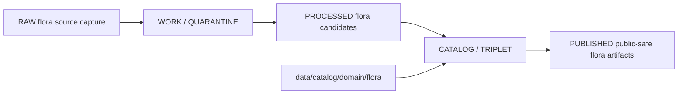

<!-- [KFM_META_BLOCK_V2]
doc_id: kfm://doc/data-catalog-domain-flora-readme
title: data/catalog/domain/flora/README.md — Flora Domain Catalog README
version: v0.1
type: readme; data-lifecycle-sublane; domain-catalog-guide
status: draft; PROPOSED; data-root; catalog-stage; flora; release-gated; sensitivity-aware
owners: OWNER_TBD — Flora steward · Data steward · Catalog steward · Evidence steward · Policy steward · Release steward · Schema steward · Docs steward
created: NEEDS VERIFICATION — blank placeholder existed before v0.1 expansion
updated: 2026-06-24
policy_label: public-doc; data; catalog; flora; lifecycle; release-gated; sensitivity-aware
tags: [kfm, data, catalog, flora, domain-catalog, CATALOG, TRIPLET, EvidenceBundle, SourceDescriptor, ReleaseManifest, CatalogBuildReceipt, geoprivacy]
related:
  - ../../README.md
  - ../../../README.md
  - ../../../../docs/domains/flora/DATA_LIFECYCLE.md
  - ../../../../docs/domains/flora/SENSITIVITY.md
  - ../../../../docs/domains/flora/CROSSWALKS.md
  - ../../../../docs/domains/flora/CROSS_LANE_NOTES.md
  - ../../../../data/catalog/dcat/flora/README.md
  - ../../../../contracts/domains/flora/
  - ../../../../schemas/contracts/v1/domains/flora/
  - ../../../../policy/domains/flora/
  - ../../../../data/proofs/
  - ../../../../data/receipts/
  - ../../../../release/
notes:
  - "This file replaces a blank placeholder at `data/catalog/domain/flora/README.md`."
  - "Flora DATA_LIFECYCLE identifies `data/catalog/domain/flora/` as a PROPOSED catalog path."
  - "This folder is a CATALOG-stage domain catalog lane; it is not RAW, WORK, QUARANTINE, PROCESSED, PUBLISHED, proof storage, release authority, schema authority, policy code, or implementation code."
  - "Rare-plant, culturally sensitive, join-sensitive, and rights-restricted details require policy-approved representation before public use."
  - "Rollback target for this replacement is previous blank blob SHA `8b137891791fe96927ad78e64b0aad7bded08bdc`."
[/KFM_META_BLOCK_V2] -->

# data/catalog/domain/flora

> Flora-domain catalog lane for governed catalog records and indexes inside the `CATALOG / TRIPLET` lifecycle stage.

  
  
  
  
  
  

**Status:** draft / PROPOSED  
**Path:** `data/catalog/domain/flora/README.md`  
**Owning root:** `data/catalog/domain/`  
**Domain segment:** `flora`  
**Lifecycle stage:** `CATALOG / TRIPLET`  
**Exposure posture:** release-gated; public records must use policy-approved public-safe representation  
**Truth posture:** CONFIRMED target was blank · CONFIRMED parent catalog lane is RELEASED ONLY for public exposure · CONFIRMED Flora lifecycle docs identify `data/catalog/domain/flora/` as a PROPOSED catalog path · CONFIRMED Flora lifecycle docs mark rare-plant sensitivity as deny-default and watcher outputs as non-publishing · CONFIRMED Flora DCAT child README points to this lane as the domain-specific catalog record home · NEEDS VERIFICATION for catalog inventory, schemas, validators, policy gates, receipts, release manifests, access controls, and route behavior.

**Quick jumps:** [Purpose](#purpose) · [Lifecycle boundary](#lifecycle-boundary) · [Repo fit](#repo-fit) · [Accepted contents](#accepted-contents) · [Exclusions](#exclusions) · [Known related catalog lanes](#known-related-catalog-lanes) · [Catalog requirements](#catalog-requirements) · [Sensitivity guardrails](#sensitivity-guardrails) · [Evidence ledger](#evidence-ledger) · [Validation checklist](#validation-checklist) · [Rollback](#rollback)

---

## Purpose

`data/catalog/domain/flora/` stores or stages Flora-domain catalog records and indexes that connect plant taxa, specimens, occurrences, vegetation communities, invasive plants, phenology observations, restoration context, evidence references, source roles, sensitivity posture, receipts, and release state.

A domain catalog record supports discovery, steward review, catalog closure, and release preparation. It does **not** make a Flora claim true, public, policy-admitted, evidence-supported, or released by itself.

## Lifecycle boundary

`data/catalog/domain/flora/` is a CATALOG-stage domain lane. Public exposure applies only to records tied to approved release state, governed route, evidence support, source-role support, sensitivity posture, and required receipts.

## Repo fit

| Responsibility | Correct home | Rule |
|---|---|---|
| Flora domain catalog records | `data/catalog/domain/flora/` | This lane. |
| Parent catalog stage | `data/catalog/` | Parent CATALOG-stage lane. |
| Flora STAC records | `data/catalog/stac/flora/` | Spatiotemporal catalog records. |
| Flora DCAT records | `data/catalog/dcat/flora/` | Dataset/distribution catalog records. |
| Flora PROV records | `data/catalog/prov/flora/` | Provenance catalog projection. |
| Flora graph/triplet projections | `data/triplets/graph_deltas/flora/`, `data/triplets/exports/flora/` | Paired graph stage. |
| Flora proof/evidence | `data/proofs/` or accepted proof roots | EvidenceBundle and ProofPack. |
| Flora receipts | `data/receipts/` or accepted receipt roots | CatalogBuildReceipt, RunReceipt, validation, policy, review, and correction receipts. |
| Flora release decisions | `release/` | Publication authority. |
| Flora schemas and policy | `schemas/contracts/v1/domains/flora/`, `policy/domains/flora/` | Separate roots; path status remains PROPOSED/NEEDS VERIFICATION. |

## Accepted contents

| Content | Purpose |
|---|---|
| Flora domain catalog indexes | Group-level indexes for Flora catalog records. |
| Taxon/specimen/occurrence catalog entries | Domain-scoped catalog entries with source and evidence pointers. |
| Vegetation-community catalog entries | Catalog records for public-safe vegetation/community products. |
| Invasive-plant catalog entries | Catalog records and indexes for invasive-plant observations/products. |
| Phenology catalog entries | Catalog records for time-bound phenology observations/products. |
| Restoration-context catalog entries | Catalog records that connect Flora products to restoration context without replacing Habitat/Soil/Hydrology truth. |
| Sensitivity and transform pointers | References to sensitivity decisions, redaction/generalization, and public-safe derivatives. |
| Catalog quality summaries | Summaries that point to validation reports and receipts. |

## Exclusions

| Do not put here | Correct home |
|---|---|
| RAW flora source files | `data/raw/flora/` |
| WORK/intermediate data | `data/work/flora/` |
| Quarantined data | `data/quarantine/flora/` |
| Processed datasets | `data/processed/flora/` |
| STAC/DCAT/PROV records | `data/catalog/stac/flora/`, `data/catalog/dcat/flora/`, `data/catalog/prov/flora/` |
| Triplets/graph edges | `data/triplets/.../flora/` |
| EvidenceBundle/proof records | `data/proofs/` |
| Receipts | `data/receipts/` |
| Release decisions | `release/` |
| Published public products | `data/published/.../flora/` |
| Schemas | `schemas/` |
| Policy rules | `policy/` |
| Validators/tests/code | `tools/validators/`, `tests/`, implementation roots |

## Known related catalog lanes

| Lane | Status | Purpose |
|---|---|---|
| `data/catalog/dcat/flora/` | draft / PROPOSED | DCAT catalog records for Flora datasets and distributions. |
| `data/catalog/stac/flora/` | PROPOSED | Spatiotemporal catalog records for Flora assets. |
| `data/catalog/prov/flora/` | PROPOSED | Provenance catalog projections for Flora assets. |

Additional child or sibling lanes should be added only when source, schema, policy, receipt, release, and rollback expectations are clear enough to avoid misleading authority.

## Catalog requirements

PROPOSED until schemas, validators, and inventory are verified:

| Requirement | Meaning |
|---|---|
| Stable catalog identity | Record has a stable identity linked to source, evidence, derivative, or release object. |
| Evidence reference | Record points to EvidenceBundle/proof context when claims depend on evidence. |
| Source reference | Record points to SourceDescriptor/source catalog where source authority matters. |
| Sensitivity decision | Record links to sensitivity classification, rights, consent, and obligations when material. |
| Transform receipt | Public derivatives from sensitive input link to RedactionReceipt or equivalent transform receipt. |
| Release reference | Public or release-linked records point to ReleaseManifest and rollback target. |
| Closure compatibility | Flora domain catalog, STAC, DCAT, and PROV agreement holds where those projections exist. |

## Sensitivity guardrails

- Flora catalog records are catalog carriers, not source truth by themselves.
- Rare-plant, culturally sensitive, join-sensitive, and rights-restricted details require policy-approved representation before public use.
- Exact sensitive public geometry must be denied or transformed according to policy and review state.
- Public derivatives should be generalized, redacted, or aggregated, with receipt chains preserved.
- Watchers and source-head checks may propose candidates; they do not publish catalog records.
- Unreleased Flora catalog records are not public merely because they exist under this directory.

## Evidence ledger

| Source | Status | Supports | Limits |
|---|---|---|---|
| `data/catalog/domain/flora/README.md` previous file | CONFIRMED | Target existed as a blank placeholder. | Did not define lane boundaries. |
| `data/catalog/README.md` | CONFIRMED | Parent catalog lane, domain catalog layout, RELEASED ONLY public posture. | Does not prove Flora catalog inventory. |
| `data/catalog/dcat/flora/README.md` | CONFIRMED | Flora DCAT sibling lane points to this domain catalog lane. | Does not prove domain catalog inventory or release state. |
| `docs/domains/flora/DATA_LIFECYCLE.md` | CONFIRMED doctrine / PROPOSED lane application | Flora lifecycle, catalog paths, sensitivity posture, watcher limits, validator themes. | Many exact files, validators, and route names remain NEEDS VERIFICATION. |

## Validation checklist

- [ ] Confirm actual child files and Flora catalog inventory under this lane.
- [ ] Confirm Flora domain catalog schema/profile location.
- [ ] Confirm access policy, validators, and CI checks.
- [ ] Confirm EvidenceBundle, SourceDescriptor, RunReceipt, ValidationReport, PolicyDecision, ReviewRecord, RedactionReceipt, and ReleaseManifest references.
- [ ] Confirm domain/STAC/DCAT/PROV catalog closure.
- [ ] Confirm rare-plant, culturally sensitive, join-sensitive, rights, source-role, stale-state, and review handling.
- [ ] Confirm correction, withdrawal, supersession, and rollback behavior for stale or failed records.

## Rollback

Rollback is required if this lane becomes a Flora raw-data root, work area, quarantine store, processed-data store, proof store, release-decision root, published-output root, schema root, policy root, validator root, implementation root, or public exposure shortcut.

Rollback target for this replacement: previous blank blob SHA `8b137891791fe96927ad78e64b0aad7bded08bdc`.

<a href="#top">Back to top</a>

