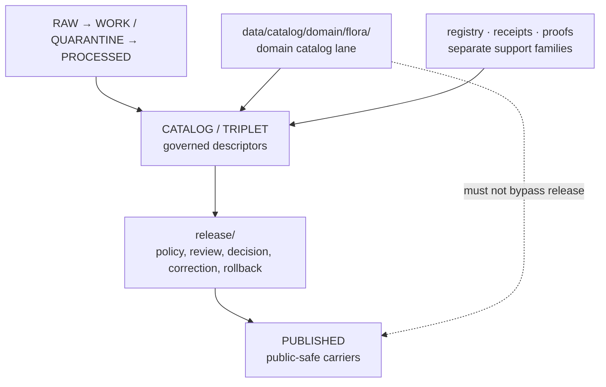

<!-- [KFM_META_BLOCK_V2]
doc_id: kfm://doc/data-catalog-domain-flora-readme
title: data/catalog/domain/flora/README.md — Governed Flora Catalog Lane
version: v0.2.0
type: readme; data-lifecycle-sublane; domain-catalog-guide; release-gated; sensitivity-aware
status: repository-grounded draft; canonical placement; proposed realization; catalog-stage; release-gated
owners: NEEDS VERIFICATION — Flora, data, catalog, evidence, source, rights, sensitivity, policy, release, correction, rollback, schema, and docs stewards
created: NEEDS VERIFICATION — blank placeholder existed before v0.1 expansion
updated: 2026-07-25
policy_label: restricted-review; data-catalog; flora; release-gated; deny-sensitive-location-by-default
current_path: data/catalog/domain/flora/README.md
historical_blank_blob: 8b137891791fe96927ad78e64b0aad7bded08bdc
prepared_under_prompt: KFM Markdown Modernization & GitHub Documentation Implementation Agent v4.0.0
review_packet_id: kfm-flora-domain-catalog-readme-20260725
truth_posture: >
  CONFIRMED exact path, parent catalog posture, Directory Rules placement, Flora
  lifecycle and sensitivity documents, sibling STAC/DCAT/PROV lanes, source,
  receipt, proof, rollback, publication, contract, schema-index, policy, test,
  fixture, validator, pipeline, release-candidate, workflow, CODEOWNERS, and
  repository-relative link targets / PROPOSED concrete domain catalog profile,
  record realization, deterministic validators, CatalogMatrix closure, and
  enforcement / UNKNOWN recursive record inventory, active producers and
  consumers, runtime reads, hosts, caches, public effects, correction execution,
  and rollback execution / NEEDS VERIFICATION accountable stewardship, accepted
  ADR decisions, rights and sensitivity authority convergence, schema/profile
  maturity, release closure, and public-client exclusion
evidence_snapshot:
  repository: bartytime4life/Kansas-Frontier-Matrix
  base_ref: main
  base_commit: 71005c0055cd4044b6e52d609caa3b40cf93f1f8
  initial_preflight_commit: 57c1a05b07b29793a5747a25b83594b6598df812
  prior_blob: 919320bf90b7faa80c3e7162e5b7fb517ccc6614
  historical_blank_blob: 8b137891791fe96927ad78e64b0aad7bded08bdc
  method: complete target read plus bounded governing-neighbor, workflow, branch, pull-request, and repository-path inspection; base drift was reconciled by comparing the initial preflight commit to the final base and confirming only unrelated paths changed; no recursive clone, catalog-record sampling, runtime, deployment, host-render, or external-store inspection
related:
  - ../README.md
  - ../../README.md
  - ../../../../docs/domains/flora/DATA_LIFECYCLE.md
  - ../../../../docs/domains/flora/CANONICAL_PATHS.md
  - ../../../../docs/domains/flora/SENSITIVITY.md
  - ../../../../docs/domains/flora/RIGHTS_AND_SENSITIVITY.md
  - ../../../../docs/domains/flora/CROSSWALKS.md
  - ../../../../docs/domains/flora/CROSS_LANE_NOTES.md
  - ../../../../catalog/domain/flora/README.md
  - ../../stac/flora/README.md
  - ../../dcat/flora/README.md
  - ../../prov/flora/README.md
  - ../../../registry/sources/flora/README.md
  - ../../../receipts/flora/README.md
  - ../../../proofs/flora/README.md
  - ../../../rollback/flora/README.md
  - ../../../published/flora/README.md
  - ../../../../contracts/domains/flora/README.md
  - ../../../../schemas/contracts/v1/domains/flora/README.md
  - ../../../../policy/domains/flora/README.md
  - ../../../../tests/domains/flora/README.md
  - ../../../../fixtures/domains/flora/README.md
  - ../../../../tools/validators/domains/flora/README.md
  - ../../../../pipelines/domains/flora/catalog/README.md
  - ../../../../release/candidates/flora/README.md
  - ../../../../docs/adr/ADR-0001-schema-home--schemas-contracts-v1-is-canonical.md
  - ../../../../docs/adr/ADR-0010-deny-by-default-for-dna-rare-species-archaeology-infrastructure.md
  - ../../../../docs/adr/ADR-0011-receipts-vs-proofs-vs-manifests-vs-catalog-separation.md
  - ../../../../docs/adr/ADR-0015-data-published-_domain_-current-alias-is-governed-by-rollback_card.md
  - ../../../../docs/adr/ADR-0022-catalog-matrix--stac-+-dcat-+-prov-must-agree.md
  - ../../../../docs/doctrine/directory-rules.md
  - ../../../../.github/workflows/domain-flora.yml
  - ../../../../.github/workflows/link-check.yml
  - ../../../../.github/CODEOWNERS
tags: [kfm, data, catalog, flora, domain-catalog, catalog-stage, triplet, evidence-bundle, source-descriptor, catalog-build-receipt, redaction-receipt, release-manifest, catalog-matrix, geoprivacy, cite-or-abstain]
notes:
  - "Directory Rules section 4 and section 12 support this nested domain placement."
  - "Directory Rules section 15 directly governs canonical and compatibility roots, not this nested lane; its ordered README sections are adopted here as a consistency contract."
  - "All v0.1 heading fragments remain available through headings or explicit legacy anchors."
  - "SENSITIVITY.md and RIGHTS_AND_SENSITIVITY.md are overlapping draft surfaces; neither is represented here as sole accepted authority."
  - "This Markdown-only revision creates no catalog record, schema acceptance, evidence bundle, receipt, policy decision, release, publication, public route, or rollback execution."
  - "Static badges project verified documentation posture only; they do not assert validator, CI, security, release, or publication maturity."
[/KFM_META_BLOCK_V2] -->

# `data/catalog/domain/flora/` — Governed Flora Catalog Lane

> **One-line purpose.** Define the governed home for Flora-domain catalog records and indexes at the `CATALOG / TRIPLET` stage while keeping botanical truth, source role, evidence, rights, sensitivity, policy, release, correction, rollback, and public delivery independently governed.

> [!IMPORTANT]
> A catalog record supports discovery, review, interoperability, and release closure. Placement here does **not** make a Flora claim true, evidence-supported, rights-cleared, policy-admitted, reviewed, released, or public. EvidenceBundle, PolicyDecision, ReviewRecord, receipts, ReleaseManifest, correction state, and rollback remain separate governed objects.

<!-- governance-alert-separator -->

> [!CAUTION]
> Exact rare-plant, protected-species, culturally sensitive, rights-restricted, and join-sensitive locations fail closed. Do not place sensitive coordinates or identifying locality detail in this README. Public Flora products require a reviewed public-safe representation and resolvable transform or redaction evidence.

**Quick navigation:** [Purpose](#purpose) · [Authority](#authority-level) · [Status](#status) · [Belongs](#what-belongs-here) · [Exclusions](#what-does-not-belong-here) · [Inputs](#inputs) · [Outputs](#outputs) · [Validation](#validation) · [Review](#review-burden) · [Related](#related-folders) · [ADRs](#adrs) · [Last reviewed](#last-reviewed) · [Boundary](#lifecycle-and-catalog-boundary) · [Requirements](#flora-catalog-requirements) · [Guardrails](#sensitivity-guardrails) · [Catalog lanes](#known-related-catalog-lanes) · [Evidence](#evidence-basis) · [Closure](#projection-and-release-closure) · [Rollback](#migration-correction-and-rollback) · [Verification](#open-verification-register) · [Done](#definition-of-done) · [No-loss](#no-loss-ledger)

## Purpose

`data/catalog/domain/flora/` is the canonical responsibility placement for governed Flora-domain catalog records and indexes at the `CATALOG / TRIPLET` lifecycle stage. Records here are intended to connect stable botanical identities and products to source roles, evidence, rights, sensitivity posture, receipts, catalog projections, release state, correction lineage, and rollback targets.

Candidate record families include plant taxa, specimens, occurrences, vegetation communities, invasive plants, phenology observations, restoration context, crosswalks, and public-safe Flora products. Listing a family does not prove that its records, contract, schema, validator, evidence, or release state exist.

## Authority level

**Canonical responsibility placement for Flora domain catalog records / repository-grounded draft / concrete catalog profile and realization PROPOSED / not truth, evidence, policy, release, or publication authority.**

This lane may carry catalog descriptors and governed references. It cannot replace Flora semantics under `contracts/`, machine shape under `schemas/`, admissibility under `policy/`, source identity and rights under `data/registry/`, process memory under `data/receipts/`, EvidenceBundles and proof support under `data/proofs/`, release decisions under `release/`, or public-safe carriers under `data/published/`.

## Status

| Field | Bounded result |
|---|---|
| Path | `data/catalog/domain/flora/README.md` |
| Version | `v0.2.0` |
| Base evidence | `main@71005c0055cd4044b6e52d609caa3b40cf93f1f8` |
| Prior blob | `919320bf90b7faa80c3e7162e5b7fb517ccc6614` (`v0.1`) |
| Historical blank predecessor | `8b137891791fe96927ad78e64b0aad7bded08bdc` |
| Placement | `CONFIRMED` existing Flora child under the governed `data/catalog/domain/` responsibility root |
| Concrete domain catalog profile | `PROPOSED / NEEDS VERIFICATION` |
| Recursive catalog-record inventory | `UNKNOWN` |
| Active producers, consumers, runtime reads, hosts, caches, or public effects | `UNKNOWN` |
| Contracts and schema maturity | `NEEDS VERIFICATION`; contract documents exist and the inspected Flora schema index identifies only a permissive redaction-receipt scaffold as present |
| Deterministic catalog validators and tests | `NEEDS VERIFICATION`; inspected validator, fixture, test, and workflow surfaces remain documentation or readiness oriented |
| STAC/DCAT/PROV/domain agreement | `NEEDS VERIFICATION` |
| Rights and sensitivity authority | `CONFLICTED / NEEDS ADR`; overlapping draft Flora documents remain unresolved |
| Public exposure | `RELEASE-GATED / FAIL CLOSED` |
| Human review | `PENDING` |

## What belongs here

| Accepted family | Required posture |
|---|---|
| Flora domain catalog records | Stable identity, object family, source role, spatial and temporal scope, lifecycle state, and release state |
| Flora domain catalog indexes | Steward-facing or release-linked discovery; never an ungoverned public shortcut |
| Taxon, specimen, and occurrence descriptors | Explicit taxonomic concept, observation or specimen role, source, evidence, sensitivity, and time semantics |
| Vegetation-community descriptors | Public-safe or controlled catalog context without replacing Habitat, Land Cover, Soil, or Hydrology truth |
| Invasive-plant and phenology descriptors | Time-bounded object role, evidence, uncertainty, source, and release context |
| Restoration-context descriptors | Cross-domain references that preserve each domain's authority and do not infer causality by co-location |
| Evidence and source pointers | Resolvable EvidenceRef, EvidenceBundle, SourceDescriptor, and applicable registry references |
| Sensitivity and transform pointers | Tier, restriction, reason, PolicyDecision, ReviewRecord, public-safe derivative, and RedactionReceipt or accepted equivalent |
| Catalog quality summaries | Derived summaries that cite validation reports, receipts, input digests, and output digests |
| Release, correction, and rollback pointers | Immutable governed references without duplicating release or rollback authority here |

Records should be deterministic where practical, bounded in scope, correctable, and explicit about whether they are internal candidates, reviewable records, release-linked records, withdrawn records, or historical records.

## What does NOT belong here

| Prohibited family | Governed home or action |
|---|---|
| Flora RAW source files | `data/raw/flora/` |
| Flora WORK or intermediate data | `data/work/flora/` |
| Quarantined Flora data | `data/quarantine/flora/` |
| Processed Flora datasets or candidate payloads | `data/processed/flora/` |
| STAC, DCAT, or PROV records | Governed sibling projection lanes under `data/catalog/` |
| Triplets or graph edges | Governed Flora lanes under `data/triplets/` |
| Source descriptors, rights, sensitivity, dataset, layer, or crosswalk registry rows | `data/registry/` |
| EvidenceBundles, ProofPacks, attestations, or proof reports | `data/proofs/` |
| Run, catalog-build, validation, transform, redaction, review, correction, or release receipts | `data/receipts/` |
| Policy decisions, contracts, schemas, validators, fixtures, tests, packages, tools, pipelines, or workflows | Their owning responsibility roots |
| ReleaseManifest, PromotionDecision, RollbackCard, CorrectionNotice, withdrawal, supersession, signature, or release authority | `release/` |
| Published layers, reports, stories, downloads, APIs, indexes, tiles, PMTiles, or other public-safe carriers | `data/published/` after governed release |
| Direct public reads, UI caches, search indexes, AI retrieval corpora, or hosting output | Governed interfaces and approved runtime or output stores |
| Exact sensitive locations or identifying locality detail | Deny, quarantine, restrict, generalize, aggregate, redact, or embargo under policy and review |

## Inputs

Catalog inputs should be governed references and validated derivatives, not raw truth by placement:

- processed Flora object identities, versions, and digests;
- source and dataset registry references with role, rights, sensitivity, spatial and temporal scope, and retrieval context;
- contracts, schemas, catalog profiles, policy decisions, and review records;
- EvidenceRef-to-EvidenceBundle resolution and applicable proof support;
- `CatalogBuildReceipt`, `RunReceipt`, `ValidationReport`, transform, redaction, correction, and release-support receipts;
- STAC, DCAT, PROV, and triplet references when projections exist;
- immutable release, correction, withdrawal, supersession, and rollback references.

Unknown source role, taxonomic concept, rights, sensitivity, evidence, transform, policy, review, release, correction, or rollback state holds a record from public-bound use.

## Outputs

This lane may emit or support:

- internal or reviewable Flora catalog records;
- deterministic Flora domain indexes and catalog subsets;
- release-linked catalog descriptors that reference, but do not replace, release authority;
- inspectable agreement inputs for STAC/DCAT/PROV/domain/triplet closure;
- correction- and rollback-aware discovery metadata for governed APIs and review tools.

Catalog placement is not publication. Public clients receive only policy-safe, release-approved representations through governed interfaces and public-safe carriers.

## Validation

For README-only changes:

- verify one H1, valid GFM tables, complete fences, supported alerts, stable legacy anchors, and a final newline;
- resolve every introduced repository-relative link at the resulting commit;
- compare the complete baseline and result, preserve document identity and Flora-specific requirements, and record any intentional consolidation;
- inspect the exact base-to-head diff for one-path scope, conflict markers, credentials, private endpoints, sensitive coordinates, or Flora payload data;
- treat static badges as navigation and documentation posture only.

For future catalog records and indexes, executable validation should fail closed on:

- missing or unstable identity, version, digest, object family, taxonomic concept, source role, spatial or temporal scope;
- unresolved SourceDescriptor, EvidenceRef, EvidenceBundle, contract, schema, policy, review, receipt, release, correction, or rollback references;
- exact rare-plant, protected-species, culturally sensitive, rights-restricted, or join-sensitive locations without reviewed access and public-safe transforms;
- public derivatives without a resolvable RedactionReceipt, transform receipt, or accepted equivalent;
- contradictory identity, digest, release, rights, sensitivity, or access state across domain, STAC, DCAT, PROV, triplet, evidence, and release surfaces;
- candidate, withdrawn, superseded, stale, restricted, or unreleased records reaching public clients;
- watcher output, source-head changes, maps, indexes, AI summaries, or generated prose presented as source truth or publication authority.

The inspected [Flora workflow](../../../../.github/workflows/domain-flora.yml) and [documentation link-check workflow](../../../../.github/workflows/link-check.yml) are GitHub-hosted, read-only readiness or hold surfaces on pull requests. They explicitly do not establish executable Flora validation, proof production, release dry-run completion, publication, or link resolution. Their presence or green completion is not enforcement maturity.

## Review burden

At minimum, route changes to:

- the verified GitHub CODEOWNERS route;
- Flora, data, and catalog review for object meaning, lane placement, and catalog profile;
- botanical taxonomy, specimen, occurrence, vegetation, invasive-plant, phenology, and restoration specialists as applicable;
- source and rights review for dataset role, license, terms, redistribution, derivatives, attribution, and downstream use;
- sensitivity, cultural-rights, and geoprivacy review for rare or protected taxa, exact localities, culturally sensitive knowledge, and re-identifying joins;
- evidence, policy, release, correction, and rollback review when records touch those boundaries;
- schema and validator review for machine or enforcement changes.

[`.github/CODEOWNERS`](../../../../.github/CODEOWNERS) routes unmatched paths to `@bartytime4life`. That is **CONFIRMED review routing**, not a StewardshipAssignment, specialist approval, independent review, PolicyDecision, release authorization, branch-protection proof, or evidence that review occurred.

## Related folders

| Responsibility | Verified repository path |
|---|---|
| Parent catalog lanes | [`data/catalog/domain/`](../README.md) · [`data/catalog/`](../../README.md) |
| Flora lifecycle and path doctrine | [`DATA_LIFECYCLE`](../../../../docs/domains/flora/DATA_LIFECYCLE.md) · [`CANONICAL_PATHS`](../../../../docs/domains/flora/CANONICAL_PATHS.md) |
| Flora sensitivity and rights drafts | [`SENSITIVITY`](../../../../docs/domains/flora/SENSITIVITY.md) · [`RIGHTS_AND_SENSITIVITY`](../../../../docs/domains/flora/RIGHTS_AND_SENSITIVITY.md) |
| Flora cross-domain guidance | [`CROSSWALKS`](../../../../docs/domains/flora/CROSSWALKS.md) · [`CROSS_LANE_NOTES`](../../../../docs/domains/flora/CROSS_LANE_NOTES.md) |
| Catalog projections | [`STAC`](../../stac/flora/README.md) · [`DCAT`](../../dcat/flora/README.md) · [`PROV`](../../prov/flora/README.md) |
| Source, rights, and sensitivity registry | [`data/registry/sources/flora/`](../../../registry/sources/flora/README.md) |
| Process memory and proof support | [`data/receipts/flora/`](../../../receipts/flora/README.md) · [`data/proofs/flora/`](../../../proofs/flora/README.md) |
| Correction, rollback, and public-safe carriers | [`data/rollback/flora/`](../../../rollback/flora/README.md) · [`data/published/flora/`](../../../published/flora/README.md) |
| Meaning, shape, and admissibility | [`contracts/domains/flora/`](../../../../contracts/domains/flora/README.md) · [`schemas/contracts/v1/domains/flora/`](../../../../schemas/contracts/v1/domains/flora/README.md) · [`policy/domains/flora/`](../../../../policy/domains/flora/README.md) |
| Tests, fixtures, and documented validator lane | [`tests/domains/flora/`](../../../../tests/domains/flora/README.md) · [`fixtures/domains/flora/`](../../../../fixtures/domains/flora/README.md) · [`tools/validators/domains/flora/`](../../../../tools/validators/domains/flora/README.md) |
| Documented catalog pipeline | [`pipelines/domains/flora/catalog/`](../../../../pipelines/domains/flora/catalog/README.md) |
| Release candidates | [`release/candidates/flora/`](../../../../release/candidates/flora/README.md) |
| Non-authoritative compatibility path | [`catalog/domain/flora/`](../../../../catalog/domain/flora/README.md) — redirect and drift fence |
| Readiness workflows and review routing | [`domain-flora.yml`](../../../../.github/workflows/domain-flora.yml) · [`link-check.yml`](../../../../.github/workflows/link-check.yml) · [`CODEOWNERS`](../../../../.github/CODEOWNERS) |

These links prove that the named paths and documents existed at the evidence snapshot. They do not prove recursive inventory, valid records, accepted schemas, current source rights, deterministic validators, CatalogMatrix closure, release approval, public routes, correction handling, or rollback execution.

## ADRs

| Decision record | Observed state | Relevance |
|---|---:|---|
| [`ADR-0001 — Schema Home`](../../../../docs/adr/ADR-0001-schema-home--schemas-contracts-v1-is-canonical.md) | `PROPOSED` | Identifies the intended schema responsibility surface; it does not prove accepted Flora catalog schemas. |
| [`ADR-0010 — Deny-by-Default for DNA, Rare Species, Archaeology, and Critical Infrastructure`](../../../../docs/adr/ADR-0010-deny-by-default-for-dna-rare-species-archaeology-infrastructure.md) | `DRAFT` | Supports fail-closed treatment for rare-species precision; it does not prove an accepted evaluator or public transform. |
| [`ADR-0011 — Receipts vs Proofs vs Manifests vs Catalog Separation`](../../../../docs/adr/ADR-0011-receipts-vs-proofs-vs-manifests-vs-catalog-separation.md) | `PROPOSED` | Supports `receipt ≠ proof ≠ catalog ≠ publication`; it does not prove acceptance or enforcement. |
| [`ADR-0015 — Published current alias governed by RollbackCard`](../../../../docs/adr/ADR-0015-data-published-_domain_-current-alias-is-governed-by-rollback_card.md) | `DRAFT` | Supports rollback-aware publication intent; it does not prove a Flora alias or rollback engine. |
| [`ADR-0022 — Catalog Matrix · STAC + DCAT + PROV Must Agree`](../../../../docs/adr/ADR-0022-catalog-matrix--stac-+-dcat-+-prov-must-agree.md) | `PROPOSED` | Supports release-level identity, digest, and release-reference agreement; it does not prove an executable Flora closure resolver. |

[`Directory Rules`](../../../../docs/doctrine/directory-rules.md) §4 supports responsibility-first placement and explicitly uses `data/catalog/domain/<domain>/` as a model; §12 applies domain placement uniformly to Flora; §§13–14 prevent parallel authority and require reversible migration. Section 15 directly defines README contracts for canonical and compatibility **roots**. This nested lane is neither, so the ordered sections above are adopted for repository consistency, not presented as direct §15 compliance.

No accepted ADR governing the concrete realization of this nested Flora catalog lane was established in the bounded review.

## Last reviewed

**2026-07-25** against `main@71005c0055cd4044b6e52d609caa3b40cf93f1f8`.

Review again after six months, or sooner if the parent catalog contract, Flora doctrine, source rights, sensitivity authority, catalog profile, relevant ADR status, workflows, producers, consumers, public routes, release process, correction process, or rollback path changes.

## Lifecycle and catalog boundary

```mermaid
flowchart TD
    PRE["RAW → WORK / QUARANTINE → PROCESSED"] --> CATALOG["CATALOG / TRIPLET<br/>governed descriptors"]
    DOMAIN["data/catalog/domain/flora/<br/>domain catalog lane"] --> CATALOG
    SUPPORT["registry · receipts · proofs<br/>separate support families"] --> CATALOG
    CATALOG --> RELEASE["release/<br/>policy, review, decision, correction, rollback"]
    RELEASE --> PUBLIC["PUBLISHED<br/>public-safe carriers"]
    DOMAIN -. "must not bypass release" .-> PUBLIC
```

The diagram is a lifecycle and authority map, not proof that complete Flora records, projections, validators, release assembly, public routes, corrections, or rollback drills exist. Promotion is a governed state transition; a file move or successful check is not promotion.

## Flora catalog requirements

The following are **PROPOSED requirements** until accepted profiles, emitted records, deterministic validators, negative fixtures, required workflows, and observed release behavior prove them:

| Requirement | Minimum meaning |
|---|---|
| Stable catalog identity | Deterministic identifier for the Flora object or product; version and digest changes remain explicit |
| Botanical object and knowledge character | Taxon, taxonomic concept, specimen, occurrence, vegetation community, invasive record, phenology observation, restoration context, or derived-product role remains distinct |
| Taxonomy and vocabulary reference | Accepted identifier system, concept/version, name usage, rank, synonym or crosswalk status, and unresolved ambiguity remain explicit |
| Spatial and temporal support | Geometry or generalized geography, coordinate reference, observation/collection/valid/retrieval/release/correction times, precision, and coverage limits remain explicit |
| Source and rights reference | SourceDescriptor, dataset/version, source role, license/terms, retrieval context, and rights decision resolve |
| Evidence reference | Claim-bearing fields resolve EvidenceRef to EvidenceBundle; unsupported claims cite-or-abstain |
| Sensitivity and transform reference | Tier, restriction, public-safe transform, reason code, PolicyDecision, ReviewRecord, and RedactionReceipt or accepted equivalent resolve where material |
| Receipt reference | Build, validation, transform, redaction, correction, and release-support operations remain auditable |
| Catalog closure | Domain, STAC, DCAT, PROV, triplet, evidence, and release views agree on identity, digest, source role, scope, access, and release reference |
| Release and correction reference | Public-bound records point to immutable ReleaseManifest, public scope, correction or withdrawal state, and rollback target |

Candidate catalog records must not masquerade as released records. Released records must remain distinguishable from corrected, withdrawn, superseded, or historical records without rewriting prior history.

## Sensitivity guardrails

| Guardrail | Required posture |
|---|---|
| Catalog carriers are not source truth | Resolve claims to evidence and source records; do not infer truth from directory placement or presentation quality |
| Exact rare or protected plant locations fail closed | Deny, restrict, embargo, generalize, aggregate, or redact precise locality according to rights, policy, review, and release state |
| Culturally sensitive knowledge is not a public default | Respect authority, consent, obligations, traditional-knowledge labels where applicable, minimum-necessary representation, and rights-holder review |
| Join-induced sensitivity is real sensitivity | Evaluate re-identification and harm created by taxon, parcel, specimen, collector, landowner, habitat, hydrology, infrastructure, temporal, and cross-domain joins |
| Public derivatives require transform evidence | Preserve input and output digests, method/version, precision loss, reason, policy context, review, and RedactionReceipt or accepted equivalent |
| Source quality does not override sensitivity | Authoritative or high-quality data can still be restricted; unknown rights or sensitivity deny public-bound use |
| Watchers do not publish | Source-head checks, watchers, alerts, and candidate builders may propose work; they do not admit, release, or publish catalog records |
| Unreleased is not public | Existence in this directory, a green check, a catalog index, or a render does not create public authority |
| AI remains interpretive | AI summaries and classifications are candidates or carriers, never root truth; resolve evidence and apply policy, review, release, correction, and rollback first |

[`SENSITIVITY.md`](../../../../docs/domains/flora/SENSITIVITY.md) and [`RIGHTS_AND_SENSITIVITY.md`](../../../../docs/domains/flora/RIGHTS_AND_SENSITIVITY.md) are overlapping draft surfaces, and the former records the conflict. Until an accepted ADR converges them, do not treat either as sole authority. Apply the stricter compatible fail-closed posture and escalate conflicting instructions for rights, sensitivity, policy, and domain review.

## Known related catalog lanes

| Lane | Observed status | Intended purpose | Bounded limit |
|---|---:|---|---|
| [`data/catalog/stac/flora/`](../../stac/flora/README.md) | `PROPOSED` | Spatiotemporal catalog records for Flora assets | Record inventory, profile, schema, validator, and closure remain unverified |
| [`data/catalog/dcat/flora/`](../../dcat/flora/README.md) | `DRAFT / PROPOSED` | Dataset and distribution catalog records | Concrete payloads and accepted closure remain unverified |
| [`data/catalog/prov/flora/`](../../prov/flora/README.md) | `PROPOSED` | Provenance catalog projections | Record inventory, context, validator, and closure remain unverified |

Add or promote a catalog projection only when source, schema, evidence, sensitivity, receipt, agreement, release, correction, and rollback expectations are explicit enough to avoid misleading authority.

## Evidence basis

| Evidence | Status | Supports | Does not prove |
|---|---:|---|---|
| Exact target and prior blob | `CONFIRMED` | In-place README upgrade with preserved identity | Recursive record inventory or runtime behavior |
| Parent `data/catalog/README.md` and `data/catalog/domain/README.md` | `CONFIRMED document posture` | Catalog-stage, release-gated parent responsibility and Flora child placement | Complete child inventory or enforcement |
| Directory Rules §4 and §12 | `CONFIRMED doctrine` | Responsibility-root and domain-segment placement | Full repository compliance or direct §15 applicability to this nested lane |
| Flora lifecycle and canonical-path documents | `CONFIRMED documents; mixed path maturity` | Flora lifecycle, catalog intent, promotion boundary, and path evidence | Concrete record validity, accepted producers, or public behavior |
| Flora sensitivity and rights documents | `CONFIRMED documents; CONFLICTED drafts` | Fail-closed rare-plant, cultural, rights, and join-risk posture | Converged accepted authority or executable policy |
| STAC, DCAT, and PROV Flora READMEs | `CONFIRMED paths; PROPOSED realization` | Separate catalog-projection responsibilities | Emitted records, accepted profiles, or CatalogMatrix closure |
| Flora source registry, receipt, proof, rollback, and published READMEs | `CONFIRMED paths; draft/proposed posture` | Separate support, delivery, and recovery lanes | Complete records, release, publication, or rollback execution |
| Contracts, schema index, policy, tests, fixtures, validators, and pipeline READMEs | `CONFIRMED paths; documentation-heavy` | Intended meaning, shape, admissibility, validation, and build surfaces | Accepted production profile or deterministic enforcement |
| `redaction_receipt.schema.json` | `CONFIRMED permissive PROPOSED scaffold` | A machine-readable Flora receipt-schema candidate exists | Flora catalog-record schema or accepted redaction enforcement |
| Flora release-candidate README | `CONFIRMED path; no verified active candidate` | Release-candidate responsibility and explicit hold posture | Approved manifest, release, publication, or route |
| `domain-flora` workflow | `CONFIRMED readiness surface` | Explicit validation, proof, and publish-dry-run holds | Flora truth, proof production, promotion, release, or public safety |
| `link-check` workflow | `CONFIRMED readiness surface` | Explicit documentation-QA hold | Resolution of any local path, anchor, image, or external URL |
| CODEOWNERS | `CONFIRMED review route` | Default GitHub review routing to `@bartytime4life` | Accepted stewardship, specialist approval, or release authorization |
| Open-pull-request search | `CONFIRMED bounded search` | No open pull request overlapping this exact target was found before branch creation | Historical, renamed, or externally hosted work outside the search |

EvidenceBundle outranks generated language and catalog presentation. Catalog records organize and project governed facts; they do not manufacture evidence or authority.

## Projection and release closure

Where projections exist, release-level closure should require agreement among the domain catalog, STAC, DCAT, PROV, triplet, evidence, source, receipt, and release views on at least:

- stable identity, object family, version, digest, and supersession state;
- taxonomic concept and unresolved crosswalk ambiguity;
- spatial and temporal scope, precision, access, sensitivity, and public-safe transform;
- source role, rights, evidence support, policy decision, and review;
- release reference, public scope, correction state, withdrawal state, and rollback target.

`ADR-0022` and the inspected sibling READMEs express this closure intent, but the decision remains proposed and no executable Flora closure resolver was established. Missing or contradictory closure holds release. A domain record may remain internal without every projection; it must not imply release-level agreement that has not been demonstrated.

Release authority remains under `release/`. The inspected Flora release-candidate and published-lane READMEs did not establish an active approved candidate, ReleaseManifest, publication, governed route, or rollback execution. A catalog record, workflow result, pull request, or merged Markdown file cannot substitute for those objects.

## Migration, correction, and rollback

Use reversible, receipt-backed change:

1. identify the affected catalog identity, digest, projection set, release reference, and public carriers;
2. quarantine or hold contradictory, stale, sensitive, rights-unclear, or invalid candidates;
3. issue correction, withdrawal, or supersession state without rewriting prior history;
4. regenerate and validate affected domain, STAC, DCAT, PROV, triplet, evidence, and release references;
5. obtain required policy, rights, sensitivity, domain, release, and rollback review;
6. publish only through an approved release decision and preserve the prior rollback target.

Rollback is required if this lane becomes a Flora raw-data root, work area, quarantine store, processed-data store, proof store, release-decision root, published-output root, schema root, policy root, validator root, implementation root, direct public read, or public-exposure shortcut.

Documentation rollback for this revision is a normal revert of its review commit. Historical rollback target for the v0.1 replacement remains blank blob `8b137891791fe96927ad78e64b0aad7bded08bdc`; restoring that blank state would remove useful governance and should occur only through explicit reviewed history.

## Open verification register

| ID | Open item | Current state | Closure evidence required |
|---|---|---:|---|
| FLORA-CAT-001 | Recursive catalog-record inventory and stable identities | `UNKNOWN` | Reviewed inventory with digests, owners, lifecycle state, and sensitivity posture |
| FLORA-CAT-002 | Accepted Flora domain catalog profile and schemas | `PROPOSED / NEEDS VERIFICATION` | Accepted contract/profile, machine schemas, examples, compatibility policy, and ADR state |
| FLORA-CAT-003 | Deterministic validators, negative fixtures, tests, and required CI | `NEEDS VERIFICATION` | Executable commands, pinned dependencies, synthetic fixtures, expected failures, and required checks |
| FLORA-CAT-004 | Source roles, current rights, consent, and obligations | `NEEDS VERIFICATION` | Resolvable source registry records and reviewed per-source decisions |
| FLORA-CAT-005 | Rights and sensitivity authority convergence | `CONFLICTED` | Accepted ADR or equivalent resolution, policy mapping, reason codes, and reviewer assignments |
| FLORA-CAT-006 | EvidenceBundle, SourceDescriptor, receipt, policy, review, and release references | `NEEDS VERIFICATION` | Sampled valid records plus deterministic referential-integrity results |
| FLORA-CAT-007 | Domain/STAC/DCAT/PROV/triplet closure | `NEEDS VERIFICATION` | Accepted resolver and positive/negative closure reports tied to exact digests |
| FLORA-CAT-008 | Correction, withdrawal, supersession, and rollback behavior | `NEEDS VERIFICATION` | Exercised correction and rollback records with immutable before/after references |
| FLORA-CAT-009 | Public-client exclusion and public-safe delivery | `UNKNOWN` | Approved release, route/config evidence, access tests, cache/search review, and no-direct-read proof |
| FLORA-CAT-010 | Accountable stewardship and separation of duties | `NEEDS VERIFICATION` | Accepted assignments, specialist review rules, quorum, and release authorization |

## Definition of done

This lane becomes implementation-ready only when all applicable items below are true:

- [ ] A reviewed recursive inventory distinguishes documentation, candidates, released records, withdrawn records, and historical records.
- [ ] An accepted Flora catalog contract and machine profile define identity, object family, taxonomy, time, geometry, source, evidence, rights, sensitivity, receipt, release, correction, and rollback fields.
- [ ] Deterministic validators and synthetic positive/negative fixtures run through an accepted repository-native command and required CI.
- [ ] SourceDescriptor, EvidenceBundle, PolicyDecision, ReviewRecord, receipt, ReleaseManifest, correction, and rollback references resolve and fail closed when missing.
- [ ] Rare-plant, protected-species, culturally sensitive, rights-restricted, and join-sensitive handling is converged, policy-mapped, reviewed, and receipt-backed.
- [ ] Domain, STAC, DCAT, PROV, triplet, evidence, and release closure is tested where projections exist.
- [ ] Public clients cannot read internal catalog stores directly; released public-safe carriers are tested separately.
- [ ] Correction, withdrawal, supersession, cache invalidation, and rollback have been exercised against immutable references.
- [ ] Accountable stewards, required specialist reviewers, separation of duties, and release authority are accepted.
- [ ] Human review closes every material `UNKNOWN`, `CONFLICTED`, and `NEEDS VERIFICATION` item.

## No-loss ledger

v0.1 preservation and modernization map

| v0.1 element | v0.2.0 disposition |
|---|---|
| Stable `doc_id` | Preserved unchanged |
| Created-state uncertainty | Preserved unchanged |
| Historical blank blob | Preserved in metadata, status, evidence, and rollback |
| `# data/catalog/domain/flora` fragment | Preserved as explicit `datacatalogdomainflora` anchor |
| `Purpose` | Preserved and expanded without claiming record realization |
| `Lifecycle boundary` | Preserved through explicit legacy anchor and expanded authority map |
| `Repo fit` | Preserved through explicit `repo-fit` anchor and verified related-folder matrix |
| `Accepted contents` | Preserved through explicit `accepted-contents` anchor and expanded belongs table |
| `Exclusions` | Preserved through explicit `exclusions` anchor and expanded responsibility routing |
| `Known related catalog lanes` | Preserved and evidence-qualified |
| `Catalog requirements` | Preserved through explicit anchor and expanded into Flora-specific proposed requirements |
| `Sensitivity guardrails` | Preserved and expanded with rights-authority conflict and join-induced sensitivity |
| `Evidence ledger` | Preserved through explicit anchor and expanded with bounded evidence and limits |
| `Validation checklist` | Preserved through explicit anchor; README checks and future record gates separated |
| `Rollback` | Preserved through explicit anchor and expanded with correction, withdrawal, and reversible migration |
| Parent, Flora doctrine, DCAT, contract, schema, policy, proofs, receipts, and release relationships | Preserved using verified, more specific repository-relative targets |
| Static status badges | Replaced with linked, flat-square, source-backed posture badges; no workflow-success, coverage, security, release, or publication badge added |
| v0.1 claim that the target replaced a blank placeholder | Preserved as historical lineage, not presented as evidence of current catalog realization |

No baseline Flora record family, exclusion, catalog-closure requirement, sensitivity warning, validation concern, or rollback boundary was intentionally removed. Presentation was consolidated where the new authority, status, inputs, outputs, review, release-closure, verification, and definition-of-done sections made the boundary more explicit.

<a href="#top">Back to top</a>

