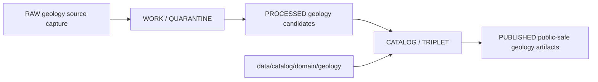

<!-- [KFM_META_BLOCK_V2]
doc_id: kfm://doc/data-catalog-domain-geology-readme
title: data/catalog/domain/geology/README.md — Geology Domain Catalog README
version: v0.1
type: readme; data-lifecycle-sublane; domain-catalog-guide
status: draft; PROPOSED; data-root; catalog-stage; geology; natural-resources; release-gated; source-role-aware
owners: OWNER_TBD — Geology steward · Natural resources steward · Data steward · Catalog steward · Evidence steward · Policy steward · Release steward · Schema steward · Docs steward
created: NEEDS VERIFICATION — blank placeholder existed before v0.1 expansion
updated: 2026-06-24
policy_label: public-doc; data; catalog; geology; natural-resources; lifecycle; release-gated; source-role-aware
tags: [kfm, data, catalog, geology, natural-resources, domain-catalog, CATALOG, TRIPLET, EvidenceBundle, SourceDescriptor, ReleaseManifest, CatalogBuildReceipt]
related:
  - ../../README.md
  - ../../../README.md
  - ../../../../docs/domains/geology/README.md
  - ../../../../docs/domains/geology/DATA_LIFECYCLE.md
  - ../../../../docs/domains/geology/CANONICAL_PATHS.md
  - ../../../../docs/domains/geology/SOURCE_REGISTRY.md
  - ../../../../docs/domains/geology/POLICY.md
  - ../../../../contracts/domains/geology/
  - ../../../../schemas/contracts/v1/domains/geology/
  - ../../../../policy/domains/geology/
  - ../../../../data/proofs/
  - ../../../../data/receipts/
  - ../../../../release/
notes:
  - "This file replaces a blank placeholder at `data/catalog/domain/geology/README.md`."
  - "Geology canonical paths identify `data/catalog/domain/geology/` as the Geology catalog lane shape under `data/`."
  - "This folder is a CATALOG-stage domain catalog lane; it is not RAW, WORK, QUARANTINE, PROCESSED, PUBLISHED, proof storage, release authority, schema authority, policy code, or implementation code."
  - "Geology records must preserve source-role discipline: occurrence, deposit, estimate, permit, production, reserve, model, and interpreted map products are not interchangeable."
  - "Rollback target for this replacement is previous blank blob SHA `8b137891791fe96927ad78e64b0aad7bded08bdc`."
[/KFM_META_BLOCK_V2] -->

# data/catalog/domain/geology

> Geology and Natural Resources domain catalog lane for governed catalog records and indexes inside the `CATALOG / TRIPLET` lifecycle stage.

  
  
  
  
  
  

**Status:** draft / PROPOSED  
**Path:** `data/catalog/domain/geology/README.md`  
**Owning root:** `data/catalog/domain/`  
**Domain segment:** `geology`  
**Lifecycle stage:** `CATALOG / TRIPLET`  
**Exposure posture:** release-gated; public records must use approved public-safe representation  
**Truth posture:** CONFIRMED target was blank · CONFIRMED parent catalog lane is RELEASED ONLY for public exposure · CONFIRMED Geology README defines the lane scope as geology and natural resources with anti-collapse source-role rules · CONFIRMED Geology canonical paths include `data/catalog/domain/geology/` as a PROPOSED data lifecycle path · NEEDS VERIFICATION for catalog inventory, schemas, validators, policy gates, receipts, release manifests, access controls, and route behavior.

**Quick jumps:** [Purpose](#purpose) · [Lifecycle boundary](#lifecycle-boundary) · [Repo fit](#repo-fit) · [Accepted contents](#accepted-contents) · [Exclusions](#exclusions) · [Known related catalog lanes](#known-related-catalog-lanes) · [Catalog requirements](#catalog-requirements) · [Source-role and sensitivity guardrails](#source-role-and-sensitivity-guardrails) · [Evidence ledger](#evidence-ledger) · [Validation checklist](#validation-checklist) · [Rollback](#rollback)

---

## Purpose

`data/catalog/domain/geology/` stores or stages Geology/Natural Resources domain catalog records and indexes that connect geologic maps, units, stratigraphy, lithology, structures, subsurface observations, geophysics, geochemistry, mineral occurrences, resource deposits, extraction context, reclamation context, evidence references, source roles, receipts, and release state.

A domain catalog record supports discovery, steward review, catalog closure, and release preparation. It does **not** make a Geology claim true, public, policy-admitted, evidence-supported, extraction-authoritative, or released by itself.

## Lifecycle boundary

`data/catalog/domain/geology/` is a CATALOG-stage domain lane. Public exposure applies only to records tied to approved release state, governed route, evidence support, source-role support, sensitivity posture, and required receipts.

## Repo fit

| Responsibility | Correct home | Rule |
|---|---|---|
| Geology domain catalog records | `data/catalog/domain/geology/` | This lane. |
| Parent catalog stage | `data/catalog/` | Parent CATALOG-stage lane. |
| Geology STAC records | `data/catalog/stac/geology/` | Spatiotemporal catalog records, if accepted. |
| Geology DCAT records | `data/catalog/dcat/geology/` | Dataset/distribution catalog records, if accepted. |
| Geology PROV records | `data/catalog/prov/geology/` | Provenance catalog projection, if accepted. |
| Geology graph/triplet projections | `data/triplets/.../geology/` | Paired graph stage. |
| Geology proof/evidence | `data/proofs/` or accepted proof roots | EvidenceBundle and ProofPack. |
| Geology receipts | `data/receipts/` or accepted receipt roots | CatalogBuildReceipt, RunReceipt, validation, policy, review, and correction receipts. |
| Geology release decisions | `release/` | Publication authority. |
| Geology schemas and policy | `schemas/contracts/v1/domains/geology/`, `policy/domains/geology/` | Separate roots; path status remains PROPOSED/NEEDS VERIFICATION. |

## Accepted contents

| Content | Purpose |
|---|---|
| Geology domain catalog indexes | Group-level indexes for Geology catalog records. |
| Geologic-unit catalog entries | Domain-scoped records for bedrock, surficial, stratigraphic, lithologic, and age units. |
| Structure and geomorphology catalog entries | Catalog records for structures, landforms, and mapped interpretations. |
| Subsurface-observation catalog entries | Catalog records for boreholes, logs, cores, and geophysical observations. |
| Natural-resource catalog entries | Catalog records for mineral occurrences, deposits, extraction sites, production context, and reclamation context. |
| Evidence and source pointers | References to EvidenceBundle, SourceDescriptor, receipts, and validation reports. |
| Sensitivity and transform pointers | References to policy decisions, public-safe geometry, and release-safe derivatives. |
| Catalog quality summaries | Summaries that point to validation reports and receipts. |

## Exclusions

| Do not put here | Correct home |
|---|---|
| RAW geology source files | `data/raw/geology/` |
| WORK/intermediate data | `data/work/geology/` |
| Quarantined data | `data/quarantine/geology/` |
| Processed datasets | `data/processed/geology/` |
| STAC/DCAT/PROV records | `data/catalog/stac/geology/`, `data/catalog/dcat/geology/`, `data/catalog/prov/geology/` if accepted |
| Triplets/graph edges | `data/triplets/.../geology/` |
| EvidenceBundle/proof records | `data/proofs/` |
| Receipts | `data/receipts/` |
| Release decisions | `release/` |
| Published public products | `data/published/.../geology/` |
| Schemas | `schemas/` |
| Policy rules | `policy/` |
| Validators/tests/code | `tools/validators/`, `tests/`, implementation roots |

## Known related catalog lanes

| Lane | Status | Purpose |
|---|---|---|
| `data/catalog/stac/geology/` | PROPOSED | Spatiotemporal catalog records for Geology assets. |
| `data/catalog/dcat/geology/` | PROPOSED | Dataset/distribution catalog records for Geology assets. |
| `data/catalog/prov/geology/` | PROPOSED | Provenance catalog projections for Geology assets. |

Additional child or sibling lanes should be added only when source, schema, policy, receipt, release, and rollback expectations are clear enough to avoid misleading authority.

## Catalog requirements

PROPOSED until schemas, validators, and inventory are verified:

| Requirement | Meaning |
|---|---|
| Stable catalog identity | Record has a stable identity linked to source, evidence, derivative, or release object. |
| Source-role class | Record preserves whether material is occurrence, deposit, estimate, permit, production, reserve, model, observation, or interpretation. |
| Evidence reference | Record points to EvidenceBundle/proof context when claims depend on evidence. |
| Source reference | Record points to SourceDescriptor/source catalog where source authority matters. |
| Sensitivity decision | Record links to sensitivity classification, rights, geometry policy, and obligations when material. |
| Release reference | Public or release-linked records point to ReleaseManifest and rollback target. |
| Closure compatibility | Geology domain catalog, STAC, DCAT, and PROV agreement holds where those projections exist. |

## Source-role and sensitivity guardrails

- Geology catalog records are catalog carriers, not source truth by themselves.
- Occurrence, deposit, estimate, permit, production, reserve, model, and interpretation records must remain distinct.
- Generalized map polygons, AI summaries, permits, leases, titles, production records, and reserve estimates must not collapse into one authoritative resource claim.
- Exact subsurface, private-well, sample, sensitive resource, or infrastructure-risk locations require policy-approved representation before public use.
- Public derivatives should use generalized, redacted, or aggregated representation where sensitivity, rights, or source role requires it.
- Unreleased Geology catalog records are not public merely because they exist under this directory.

## Evidence ledger

| Source | Status | Supports | Limits |
|---|---|---|---|
| `data/catalog/domain/geology/README.md` previous file | CONFIRMED | Target existed as a blank placeholder. | Did not define lane boundaries. |
| `data/catalog/README.md` | CONFIRMED | Parent catalog lane, domain catalog layout, RELEASED ONLY public posture. | Does not prove Geology catalog inventory. |
| `docs/domains/geology/README.md` | CONFIRMED doctrine / PROPOSED implementation | Geology domain scope, anti-collapse rule, public trust path, sensitivity posture. | Does not prove data catalog files, validators, or release state. |
| `docs/domains/geology/DATA_LIFECYCLE.md` | CONFIRMED doctrine / PROPOSED lane application | Geology lane pattern and `data/catalog/domain/geology/` as catalog path shape. | File-presence and enforcement claims remain NEEDS VERIFICATION. |

## Validation checklist

- [ ] Confirm actual child files and Geology catalog inventory under this lane.
- [ ] Confirm Geology domain catalog schema/profile location.
- [ ] Confirm access policy, validators, and CI checks.
- [ ] Confirm EvidenceBundle, SourceDescriptor, RunReceipt, ValidationReport, PolicyDecision, ReviewRecord, and ReleaseManifest references.
- [ ] Confirm source-role separation for occurrence/deposit/estimate/permit/production/reserve/model/interpretation records.
- [ ] Confirm sensitive geometry, rights, private-well, subsurface, extraction, reclamation, source-role, stale-state, and review handling.
- [ ] Confirm domain/STAC/DCAT/PROV catalog closure.
- [ ] Confirm correction, withdrawal, supersession, and rollback behavior for stale or failed records.

## Rollback

Rollback is required if this lane becomes a Geology raw-data root, work area, quarantine store, processed-data store, proof store, release-decision root, published-output root, schema root, policy root, validator root, implementation root, or public exposure shortcut.

Rollback target for this replacement: previous blank blob SHA `8b137891791fe96927ad78e64b0aad7bded08bdc`.

<a href="#top">Back to top</a>

