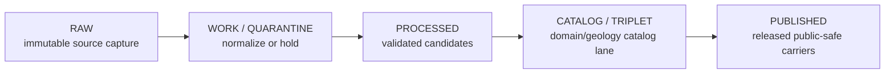

<!-- [KFM_META_BLOCK_V2]
doc_id: kfm://doc/data-catalog-domain-geology-readme
title: data/catalog/domain/geology/ — Governed Geology Catalog Lane
version: v0.2.0
type: readme; data-lifecycle-sublane; domain-catalog-guide
status: repository-grounded draft; catalog-stage; geology; natural-resources; release-gated; source-role-aware; sensitivity-aware; implementation-incomplete
owners: NEEDS VERIFICATION — Geology domain steward · Natural resources steward · Data steward · Catalog steward · Evidence steward · Source steward · Rights/sensitivity steward · Policy steward · Validation steward · Release steward · Correction/rollback steward · Docs steward
created: NEEDS VERIFICATION — blank placeholder existed before v0.1 expansion
updated: 2026-07-25
supersedes: v0.1 at the same canonical path; no catalog record, lifecycle state, policy decision, release, route, or publication state
policy_label: restricted-review; no-direct-public-path; release-gated; exact-subsurface-fail-closed; resource-claim-anti-collapse
tags: [kfm, data, catalog, geology, natural-resources, CATALOG, TRIPLET, source-role, sensitivity, EvidenceBundle, SourceDescriptor, CatalogMatrix, ReleaseManifest, correction, rollback]
baseline:
  ref: main@b000b3a1a17bc61b0f92712117e3826397cc986a
  target_blob: 4c5cef03895c57f7042b1ca1c5274009ba54570d
  historical_blank_blob: 8b137891791fe96927ad78e64b0aad7bded08bdc
related:
  - ../README.md
  - ../../README.md
  - ../../../README.md
  - ../../../../docs/doctrine/directory-rules.md
  - ../../../../docs/domains/geology/README.md
  - ../../../../docs/domains/geology/CANONICAL_PATHS.md
  - ../../../../docs/domains/geology/DATA_LIFECYCLE.md
  - ../../../../docs/domains/geology/SOURCE_REGISTRY.md
  - ../../../../docs/domains/geology/SENSITIVITY.md
  - ../../../../docs/domains/geology/POLICY.md
  - ../../../../contracts/domains/geology/README.md
  - ../../../../schemas/contracts/v1/domains/geology/README.md
  - ../../../../policy/domains/geology/README.md
  - ../../../registry/sources/geology/README.md
  - ../../../../tests/domains/geology/README.md
  - ../../../../fixtures/domains/geology/README.md
  - ../../../../tools/validators/domains/geology/README.md
  - ../../../../pipelines/domains/geology/README.md
  - ../../../../release/candidates/geology/README.md
  - ../../../published/layers/geology/README.md
  - ../../../rollback/geology/README.md
notes:
  - "This revision upgrades the existing README in place and preserves the stable doc_id, canonical path, historical blank-blob lineage, legacy fragments, and material governance boundaries."
  - "This directory is a CATALOG / TRIPLET-stage Geology domain lane, not a source, proof, receipt, policy, schema, release, publication, or public-serving authority."
  - "Occurrence, deposit, estimate, permit, production, reserve, observation, interpretation, and model roles remain distinct."
  - "Exact borehole, core, well-log, sample, private-well, sensitive-resource, and extraction-targetable locations fail closed until rights, sensitivity, transform, evidence, review, release, correction, and rollback gates close."
  - "The shared CatalogMatrix schema remains a permissive PROPOSED placeholder and the observed validator remains a NotImplementedError stub at the pinned baseline."
  - "No Geology-specific README was found at the exact stac/geology, dcat/geology, or prov/geology catalog paths at the pinned baseline; deeper payload inventory remains UNKNOWN."
[/KFM_META_BLOCK_V2] -->

# `data/catalog/domain/geology/` — Governed Geology Catalog Lane

> Organize release-gated Geology and Natural Resources catalog records at the `CATALOG / TRIPLET` stage without turning catalog presentation, interpreted maps, regulatory records, resource claims, or generated language into sovereign truth.

> [!IMPORTANT]
> A catalog record is a governed discovery carrier. It does not admit a source, prove a claim, resolve an `EvidenceRef`, clear rights, apply policy, approve a public-safe transform, certify a mineral resource or reserve, authorize release, or publish an artifact.

> [!CAUTION]
> Do not place live source payloads, secrets, exact sensitive coordinates, private-well joins, restricted well logs, extraction-targetable resource details, or unpublished canonical records in this lane. Unknown rights, source role, evidence, sensitivity, review, or release state blocks public-bound use.

> [!NOTE]
> `CONFIRMED` means verified at the pinned repository baseline. `PROPOSED` means designed but not accepted and verified. `NEEDS VERIFICATION` is checkable but unresolved. `UNKNOWN` was not established. `CONFLICTED` identifies incompatible evidence or authority that requires a governed decision.

**Quick navigation:** [Purpose](#purpose) · [Authority](#authority-level) · [Status](#status) · [Belongs](#what-belongs-here) · [Exclusions](#what-does-not-belong-here) · [Inputs](#inputs) · [Outputs](#outputs) · [Validation](#validation) · [Review](#review-burden) · [Related folders](#related-folders) · [ADRs](#adrs) · [Last reviewed](#last-reviewed) · [Lifecycle](#lifecycle-and-catalog-boundary) · [Requirements](#geology-catalog-requirements) · [Anti-collapse](#source-role-and-anti-collapse-guardrails) · [Sensitivity](#sensitivity-and-public-safe-geometry) · [Catalog lanes](#known-related-catalog-lanes) · [Evidence](#evidence-basis) · [Closure](#projection-and-release-closure) · [Rollback](#migration-correction-and-rollback) · [Open verification](#open-verification-register) · [Done](#definition-of-done) · [No-loss ledger](#no-loss-ledger)

---

## Purpose

`data/catalog/domain/geology/` is the domain-scoped catalog lane for governed Geology and Natural Resources records after upstream source admission, normalization, quarantine handling, validation, evidence binding, source-role classification, rights review, and sensitivity review have produced a catalog-eligible candidate.

The lane may organize catalog descriptions of bedrock and surficial geology, stratigraphy, lithology, geologic age, structures, geomorphology, boreholes, well logs, cores, geophysics, geochemistry, mineral occurrences, resource deposits and estimates, extraction and production context, reclamation context, public-safe derivatives, and their evidence/release relationships.

Its purpose is discovery, inspection, catalog closure, and release preparation. Directory placement alone confers no truth, authority, admissibility, release, or public status.

## Authority level

**Implementation-bearing lifecycle lane under the canonical `data/` responsibility root; this README is orientation and governance documentation only.**

| Authority question | Answer |
|---|---|
| What this lane may own | Geology-domain catalog records and indexes at the `CATALOG / TRIPLET` stage |
| What outranks this README | Accepted doctrine and ADRs; contracts; schemas for shape; policy decisions; source registry records; evidence and proof; validation results; review records; release decisions; correction/withdrawal records; rollback targets |
| What this lane cannot decide | Source admission, object meaning, machine shape, allow/deny policy, evidence sufficiency, public-safe geometry, stewardship assignment, release, publication, correction, or rollback authorization |
| Public-client posture | No direct public read; only approved released public-safe projections may cross a governed delivery boundary |
| AI posture | Interpretive only; `EvidenceBundle` outranks generated language and catalog presentation |

Directory Rules §§4 and 12 support `data/catalog/domain/geology/`: `data/` owns lifecycle material, `catalog` names the phase, and `geology` is the domain segment. Section 15 directly requires the root-level README contract; this nested README adopts the same order for consistency and reviewability without claiming that the section directly mandates every nested lane.

## Status

| Surface | Observed state at `main@b000b3a…` | Consequence |
|---|---|---|
| Canonical path and document identity | `CONFIRMED` | Update in place; preserve `kfm://doc/data-catalog-domain-geology-readme` and stable fragments |
| README maturity | Repository-grounded `draft`, version `v0.2.0` | Human review remains required |
| Catalog record inventory | `UNKNOWN` from bounded connector inspection | Do not claim that catalog payloads or released records exist |
| Geology contracts | `CONFIRMED` draft contract lane | Meaning is documented; implementation graduation remains unproved |
| Geology schema lane | `CONFIRMED` draft index; concrete schema inventory `NEEDS VERIFICATION` | No schema-complete claim |
| Geology policy lane | `CONFIRMED` greenfield scaffold | Documentation posture does not equal executable policy |
| Geology source registry | `CONFIRMED` draft source-registry lane | Per-source admission, current terms, rights, cadence, and activation remain unresolved |
| Tests, fixtures, and validator index | `CONFIRMED` documentation and synthetic-fixture surfaces; executable coverage `NEEDS VERIFICATION` | No production-validation claim |
| Shared `CatalogMatrix` | Contract exists; schema is permissive and `PROPOSED`; validator raises `NotImplementedError` | Catalog closure is not established |
| `domain-geology` workflow | `CONFIRMED` explicit readiness holds | Workflow presence or success cannot prove validation, evidence, policy, or release |
| Release candidate lane | `CONFIRMED` parent README; no verified child candidate at its pinned review | Candidate, release, and publication remain unproved |
| Public routes, hosting, caches, search, graph, or deployed isolation | `UNKNOWN` | No public-availability or isolation claim |

The safe current conclusion is narrow: the repository contains a documented Geology catalog responsibility lane and related scaffolding, but no evidence reviewed for this revision establishes a complete catalog inventory, accepted Geology catalog profile, executable closure suite, approved release, public route, or operational rollback.

## What belongs here

| Accepted material | Required boundary |
|---|---|
| Geology domain catalog records | Stable identity, object family, version, lifecycle state, and source role are explicit |
| Geologic-unit and map-product catalog entries | Source scale, vintage, interpretation status, geometry role, and evidence references remain visible |
| Subsurface-observation catalog entries | Exact/internal versus public-safe geometry is distinguished; restricted detail is never exposed by default |
| Mineral/resource catalog entries | Occurrence, deposit, estimate, reserve, extraction, production, permit, and reclamation roles remain distinct |
| Dataset, layer, and derivative indexes | Canonical source, derivation, digest, transform, and public-safe status are resolvable |
| Source and evidence pointers | Resolve to governed `SourceDescriptor`, `EvidenceRef`/`EvidenceBundle`, proof, or accepted equivalent; do not duplicate those authorities here |
| Validation and quality summaries | Point to immutable validation/proof artifacts and state their scope and limits |
| Policy, review, and sensitivity references | Identify applicable decisions, reason codes, review state, geometry class, and unresolved blockers |
| Release, correction, and rollback references | Bind public-bound records to immutable release identity, correction/withdrawal state, and rollback target |

Records may be documentation examples only when clearly labeled synthetic and non-authoritative. Real fixtures belong under `fixtures/`; real lifecycle payloads remain in their owning lifecycle lanes.

## What does NOT belong here

| Excluded material | Correct responsibility |
|---|---|
| RAW captures or source exports | `data/raw/geology/` or the accepted source-capture lane |
| WORK/intermediate records | `data/work/geology/` |
| Quarantined records and exit decisions | `data/quarantine/geology/` plus governed quarantine records |
| Processed canonical candidates | `data/processed/geology/` |
| Source identities, rights, cadence, and activation records | [`data/registry/sources/geology/`](../../../registry/sources/geology/README.md) |
| Semantic object meaning | [`contracts/domains/geology/`](../../../../contracts/domains/geology/README.md) |
| Machine-checkable object shape | [`schemas/contracts/v1/domains/geology/`](../../../../schemas/contracts/v1/domains/geology/README.md) |
| Allow, deny, restrict, generalize, or abstain rules | [`policy/domains/geology/`](../../../../policy/domains/geology/README.md) and accepted cross-cutting policy lanes |
| Executable validators and regression proof | [`tools/validators/domains/geology/`](../../../../tools/validators/domains/geology/README.md), [`tests/domains/geology/`](../../../../tests/domains/geology/README.md), and [`fixtures/domains/geology/`](../../../../fixtures/domains/geology/README.md) |
| Pipeline implementation or declarative execution specs | [`pipelines/domains/geology/`](../../../../pipelines/domains/geology/README.md) and the accepted `pipeline_specs/` lane |
| Evidence bundles and proof artifacts | [`data/proofs/`](../../../proofs/README.md) |
| Process-memory receipts | [`data/receipts/`](../../../receipts/README.md) |
| Release decisions or candidate approval | [`release/`](../../../../release/README.md) and [`release/candidates/geology/`](../../../../release/candidates/geology/README.md) |
| Released public-safe map-layer bytes | [`data/published/layers/geology/`](../../../published/layers/geology/README.md) |
| Correction, withdrawal, and rollback authority | `release/` records plus [`data/rollback/geology/`](../../../rollback/geology/README.md) support |
| Direct public API, map, search, graph, AI, or filesystem surfaces | Governed application/delivery interfaces over approved release-resolved carriers |
| Exact sensitive coordinates or harmful joins | Restricted stores and policy-governed review paths; never ordinary public catalog content |

## Inputs

Catalog eligibility is a gate, not an assumption.

| Candidate input | Minimum required support before catalog admission |
|---|---|
| Processed Geology object or derivative | Stable identity, type, version, digest, lineage, temporal scope, geometry role, and validation state |
| Source-backed claim | Resolvable source descriptor, source role, evidence reference, citation context, current rights posture, and applicable caveats |
| Interpreted or modeled product | Explicit `interpretation` or `model` role, method/version, confidence/uncertainty, input lineage, and non-authority warning |
| Resource-related record | Explicit occurrence/deposit/estimate/reserve/permit/production/extraction/reclamation class with supporting method, time, evidence, and legal-versus-physical distinction |
| Sensitive or subsurface record | Internal/public geometry classes, applicable policy decision, transform lineage, reviewer state, and fail-closed unresolved fields |
| Public-bound derivative | Public-safe digest, transform receipt or accepted equivalent, release reference, correction path, withdrawal state, and rollback target |

Missing, contradictory, stale, or unresolved support yields a structured hold, quarantine, abstain, restrict, or deny outcome according to the governing contract and policy. It does not yield optimistic catalog admission.

## Outputs

| Output | Authority limit |
|---|---|
| Internal Geology catalog record | Improves discovery and inspection; not public by directory placement |
| Domain catalog index | Groups governed records without replacing source, evidence, policy, or release state |
| Catalog-quality summary | Summarizes validated results and links to proof; does not become proof itself |
| Projection crosswalk | Relates domain, STAC, DCAT, PROV, and triplet identities where realized; does not establish agreement without validation |
| Release-linked catalog projection | Describes a release-resolved public-safe artifact; does not authorize the release |
| Correction, withdrawal, or supersession pointer | Preserves historical state and current disposition without rewriting prior records |

Outputs must remain distinguishable as candidate, held, released, corrected, withdrawn, superseded, or historical. A green check, catalog rendering, pull request, merge, or generated receipt cannot coerce one state into another.

## Validation

### README validation

This revision is expected to preserve and verify:

- the exact canonical path, stable `doc_id`, historical blank-blob lineage, and all v0.1 fragments;
- Directory Rules placement and README-order conformance;
- GitHub Markdown headings, tables, supported alerts, explicit anchors, badge URLs, and Mermaid syntax;
- repository-relative links only to verified files or folders with a README;
- explicit status for proposed paths, placeholder schemas, non-functional validators, hold-only workflows, and unknown runtime state;
- no live source payload, exact sensitive location, secret, credential, release decision, or fabricated owner;
- a one-file base-to-head diff and byte-for-byte remote readback.

### Catalog-record acceptance

| Gate | Pass evidence | Fail-closed result |
|---|---|---|
| Identity and version | Deterministic ID, object family, version, digest, temporal scopes, supersession state | Hold; no catalog promotion |
| Source role and anti-collapse | Role vocabulary resolves; forbidden equivalences are absent | Quarantine or fail |
| Evidence and citation | `EvidenceRef` resolves to the intended `EvidenceBundle`/proof scope | Hold or abstain |
| Rights and sensitivity | Current terms, redistribution class, geometry class, joins, and reviewer obligations resolve | Restrict, deny, or quarantine |
| Public-safe geometry | Exact/internal and generalized/redacted outputs are distinct; transform lineage is immutable | No public-bound record |
| Catalog projection agreement | Domain, STAC, DCAT, PROV, triplet, digest, and release references agree where required | Closure failure |
| Policy and review | Applicable policy decision and required human review resolve | Hold |
| Release, correction, and rollback | Immutable release reference, correction/withdrawal state, and rollback target resolve | No publication |

> [!WARNING]
> The observed shared `CatalogMatrix` schema requires only `id` and allows additional properties, while `tools/validators/validate_catalog_matrix.py` raises `NotImplementedError`. The Geology workflow records explicit readiness holds. None of those surfaces currently establishes executable catalog closure.

## Review burden

Changes to this lane are high-burden documentation changes because they describe sensitive subsurface data, resource claims, lifecycle state, and release boundaries even when the diff is Markdown-only.

| Change concern | Required review role | Why |
|---|---|---|
| Object family or source-role language | Geology domain + contract/source stewards | Prevent occurrence/deposit/estimate/reserve and observed/interpreted/modeled collapse |
| Rights, sensitivity, geometry, or harmful joins | Rights/sensitivity + policy reviewers | Preserve fail-closed public-safe handling |
| Evidence, proof, or citation requirements | Evidence/proof reviewer | Prevent catalog presentation from replacing support |
| Catalog projections or closure | Catalog + STAC/DCAT/PROV + validation reviewers | Preserve identity/digest/release agreement and object boundaries |
| Release, correction, withdrawal, or rollback | Release + correction/rollback reviewers | Preserve reversible state transitions and historical truth |
| Documentation structure and stable links | Docs reviewer | Preserve navigation, compatibility, and no-loss commitments |

[`CODEOWNERS`](../../../../.github/CODEOWNERS) routes repository review to `@bartytime4life`. That routing is not a stewardship assignment, specialist review, separation-of-duties control, policy approval, release authorization, or proof that review occurred. Named accountable stewards and required-review enforcement remain `NEEDS VERIFICATION`.

## Related folders

| Responsibility | Verified repository surface | Current posture |
|---|---|---|
| Parent domain catalog | [`data/catalog/domain/`](../README.md) | Draft index; release-gated |
| Parent catalog stage | [`data/catalog/`](../../README.md) | Repository-grounded draft; no direct public path |
| Data responsibility root | [`data/`](../../../README.md) | Lifecycle authority boundary |
| Geology domain doctrine | [`docs/domains/geology/`](../../../../docs/domains/geology/README.md) | Extensive draft doctrine; mixed implementation maturity |
| Geology contracts | [`contracts/domains/geology/`](../../../../contracts/domains/geology/README.md) | Draft semantic-contract lane |
| Geology schemas | [`schemas/contracts/v1/domains/geology/`](../../../../schemas/contracts/v1/domains/geology/README.md) | Draft index; concrete schema inventory unresolved |
| Geology policy | [`policy/domains/geology/`](../../../../policy/domains/geology/README.md) | Greenfield scaffold |
| Geology source registry | [`data/registry/sources/geology/`](../../../registry/sources/geology/README.md) | Draft, no-public-path, source-role-aware |
| Geology tests and fixtures | [`tests/domains/geology/`](../../../../tests/domains/geology/README.md) · [`fixtures/domains/geology/`](../../../../fixtures/domains/geology/README.md) | Documentation and synthetic-support surfaces; executable coverage unresolved |
| Geology validators | [`tools/validators/domains/geology/`](../../../../tools/validators/domains/geology/README.md) | Draft validator index; executables/CI unresolved |
| Geology pipeline | [`pipelines/domains/geology/`](../../../../pipelines/domains/geology/README.md) | Draft implementation lane; concrete behavior unresolved |
| Geology release candidates | [`release/candidates/geology/`](../../../../release/candidates/geology/README.md) | Pre-publication index; no verified child candidate at its pinned review |
| Geology published layers | [`data/published/layers/geology/`](../../../published/layers/geology/README.md) | Published-stage responsibility; release manifest still required |
| Geology rollback support | [`data/rollback/geology/`](../../../rollback/geology/README.md) | Draft governed rollback-support lane |
| Shared STAC, DCAT, and PROV roots | [`stac/`](../../stac/README.md) · [`dcat/`](../../dcat/README.md) · [`prov/`](../../prov/README.md) | Root catalog lanes confirmed; Geology child realization unresolved |
| Relationship projections | [`data/triplets/`](../../../triplets/README.md) | Repository-grounded draft; no direct public path |

## ADRs

All ADRs below remain proposed or draft at the pinned baseline. Linking them does not accept them or prove enforcement.

| Decision record | Relevance |
|---|---|
| [`ADR-0011`](../../../../docs/adr/ADR-0011-receipts-vs-proofs-vs-manifests-vs-catalog-separation.md) | Separates catalog carriers from receipts, proofs, manifests, and release authority |
| [`ADR-0015`](../../../../docs/adr/ADR-0015-data-published-_domain_-current-alias-is-governed-by-rollback_card.md) | Proposes governed rollback for current published aliases |
| [`ADR-0017`](../../../../docs/adr/ADR-0017-source-descriptor-admission-process.md) | Proposes source-descriptor admission and activation boundaries |
| [`ADR-0021`](../../../../docs/adr/ADR-0021-quarantine-has-structured-exit-paths.md) | Proposes auditable, finite quarantine exits |
| [`ADR-0022`](../../../../docs/adr/ADR-0022-catalog-matrix--stac-+-dcat-+-prov-must-agree.md) | Proposes release-level STAC/DCAT/PROV identity, digest, and release-reference agreement |
| [`ADR-0024`](../../../../docs/adr/ADR-0024-steward-separation-of-duties-for-release.md) | Proposes independent release duties and review boundaries |
| [`ADR-0025`](../../../../docs/adr/ADR-0025-public-client-never-reads-canonical-internal-stores.md) | Proposes no direct public-client access to canonical/internal stores |

## Last reviewed

| Field | Value |
|---|---|
| Review date | `2026-07-25` |
| Pinned baseline | `main@b000b3a1a17bc61b0f92712117e3826397cc986a` |
| Baseline README blob | `4c5cef03895c57f7042b1ca1c5274009ba54570d` |
| Review scope | Target README; Directory Rules; Geology doctrine, lifecycle, canonical paths, source registry, sensitivity, and policy; related contracts, schema index, policy, registry, tests, fixtures, validators, pipeline, release, published, rollback, workflow, CODEOWNERS, and shared catalog-closure surfaces |
| Review limit | Bounded repository-file inspection; no recursive payload inventory, source endpoint check, production runtime, branch protection, hosting, database, search, graph, map, cache, or release audit |
| Next review trigger | Contract/schema acceptance, source admission, policy implementation, executable validator or CI graduation, catalog record addition, STAC/DCAT/PROV child creation, release candidate, correction/withdrawal, public route, or rollback exercise |

---

## Lifecycle and catalog boundary

```mermaid
flowchart LR
    RAW["RAW<br/>immutable source capture"] --> WQ["WORK / QUARANTINE<br/>normalize or hold"]
    WQ --> PROC["PROCESSED<br/>validated candidates"]
    PROC --> CAT["CATALOG / TRIPLET<br/>domain/geology catalog lane"]
    CAT --> PUB["PUBLISHED<br/>released public-safe carriers"]
```

Promotion is a governed state transition, not a file move. This lane occupies the fourth stage and must not read around earlier gates or write around release authority.

| Transition | Required posture | Safe failure |
|---|---|---|
| Source edge → RAW | Source identity, role, rights, sensitivity, citation, retrieval state, and immutable capture resolve | Do not admit |
| RAW → WORK / QUARANTINE | Candidate normalization and policy intake run without destroying source lineage | Quarantine with reason |
| WORK → PROCESSED | Contract/schema, identity, geometry, evidence, source-role, rights, sensitivity, and semantic checks pass | Stay in WORK or quarantine |
| PROCESSED → CATALOG / TRIPLET | Catalog identity, evidence, policy/review state, digests, and required projection closure resolve | Hold at PROCESSED |
| CATALOG → PUBLISHED | Release decision, public-safe carrier, correction path, withdrawal state, and rollback target resolve | Hold at CATALOG |

The catalog lane may reference `EvidenceBundle`, proof, receipt, policy, review, and release objects. It does not own or silently synthesize those objects.

## Geology catalog requirements

These requirements describe the intended catalog profile. They remain `PROPOSED / NEEDS VERIFICATION` until accepted contracts, schemas, fixtures, validators, CI, and sampled records prove them.

| Requirement | Expected meaning |
|---|---|
| Stable identity | Deterministic identity binds source, object family/role, temporal scope, version, and normalized digest |
| Object-family vocabulary | Geologic unit, boundary, structure, observation, sample, occurrence, deposit, estimate, extraction, production, and reclamation terms resolve without silent aliases |
| Source role | `authority`, `observation`, `context`, `model`, `regulatory`, `administrative`, `aggregate`, or accepted equivalent is explicit per record |
| Temporal semantics | Source vintage, observation time, validity interval, retrieval time, processing time, release time, and correction time remain distinct where applicable |
| Spatial semantics | Canonical/internal geometry, map-scale interpretation, uncertainty, generalized/public geometry, and transform lineage are distinguishable |
| Evidence binding | Consequential claims resolve to scoped evidence and citation support; unresolved references fail closed |
| Rights and sensitivity | Current terms, redistribution class, sensitivity tier/posture, join risk, reviewer obligations, and public-safe decision are recorded |
| Anti-collapse | Occurrence ≠ deposit ≠ estimate ≠ reserve; permit/title/lease ≠ physical geology; production ≠ in-ground resource; model ≠ observation |
| Transform traceability | Generalization, aggregation, redaction, and derived geometry preserve input/output digests, method/version, reason, policy context, and review |
| Catalog agreement | Domain, STAC, DCAT, PROV, triplet, artifact identity, digest, and release reference agree where those projections are required |
| Release and correction | Public-bound records resolve to immutable release identity, public scope, supersession/correction/withdrawal state, and rollback target |

Candidate records must never masquerade as released records. Released records must remain distinguishable from corrected, withdrawn, superseded, and historical records without erasing prior state.

## Source-role and anti-collapse guardrails

| Distinction | Required rule |
|---|---|
| Observation vs interpretation vs model | Keep separate source roles, methods, confidence, uncertainty, and claim scope |
| Canonical boundary vs generalized display geometry | A public derivative never replaces the canonical interpreted boundary or its evidence |
| Mineral occurrence vs resource deposit | Presence evidence does not establish a delineated deposit |
| Deposit vs estimate vs reserve | A deposit does not become a quantitative estimate or reserve without higher-burden methods, dates, confidence/classification, evidence, and review |
| Physical geology vs permit, lease, title, or ownership | Legal/administrative records may contextualize activity; they cannot prove the physical resource |
| Production vs in-ground resource | Historical or current production cannot silently establish remaining quantity or economic viability |
| Borehole/log/sample vs cross-section or surface | Derived interpretation preserves source points, method, uncertainty, and transformation lineage |
| Receipt vs proof vs catalog vs release vs runtime | Receipts record process; proofs support claims/release; catalogs aid discovery; releases authorize exposure; runtime envelopes answer within those bounds |
| Map or AI summary vs evidence-backed claim | Styling and fluent text are projections, not authority; resolve evidence and policy first |

A publisher with multiple roles requires role-distinct source descriptors or accepted record-level role separation. One umbrella source identity must not cause every dataset from that publisher to inherit the same claim authority.

## Sensitivity and public-safe geometry

The repository's Geology doctrine describes a mixed public posture: generalized surface map products may be public-safe after release review, while exact subsurface points, private wells, restricted logs, samples, sensitive resource locations, and extraction-targetable joins fail closed.

| Guardrail | Required posture |
|---|---|
| Exact borehole, core, well-log, sample, or private-well geometry | Restricted by default; public use requires approved generalization/redaction, rights clearance, review, and release support |
| Sensitive mineral/resource locations | Withhold or generalize when precision could enable extraction-targeting harm |
| Person, parcel, owner, operator, infrastructure, or temporal joins | Evaluate join-induced sensitivity and re-identification; apply the most restrictive applicable policy |
| Rights-unclear or source-role-unclear content | Quarantine, restrict, deny, or abstain; never infer permission from availability |
| Public derivative | Preserve transform method/version, input/output digests, precision loss, reason, policy context, reviewer, and correction path |
| Internal catalog placement | Does not make a record public; canonical/internal stores remain outside ordinary public-client access |
| AI or generated description | Receives only policy-safe, release-resolved evidence context; cannot reveal restricted detail or create authority |

[`SENSITIVITY.md`](../../../../docs/domains/geology/SENSITIVITY.md) and [`POLICY.md`](../../../../docs/domains/geology/POLICY.md) are draft intent surfaces. Their T0–T4 adoption and explicit Geology object-class tiers remain proposed, and `policy/domains/geology/` is still a scaffold. Until accepted machine policy and steward decisions converge those surfaces, apply the stricter compatible fail-closed posture and escalate conflicts.

## Known related catalog lanes

| Catalog surface | Observed state at the pinned baseline | Geology-specific conclusion |
|---|---|---|
| [`data/catalog/domain/`](../README.md) | Parent domain index exists | This lane is the Geology child responsibility |
| [`data/catalog/stac/`](../../stac/README.md) | STAC root README exists | No README was found at exact path `data/catalog/stac/geology/README.md`; deeper realization is `UNKNOWN` |
| [`data/catalog/dcat/`](../../dcat/README.md) | DCAT root README exists | No README was found at exact path `data/catalog/dcat/geology/README.md`; deeper realization is `UNKNOWN` |
| [`data/catalog/prov/`](../../prov/README.md) | PROV root README exists | No README was found at exact path `data/catalog/prov/geology/README.md`; deeper realization is `UNKNOWN` |
| [`data/triplets/`](../../../triplets/README.md) | Relationship-projection root exists | Geology triplet inventory and closure are `UNKNOWN` |

Do not create Geology-specific projection children merely to satisfy this README. First establish the profile, ownership, producer, schema, source/evidence links, sensitivity posture, validator, tests, closure rule, correction behavior, release relationship, and Directory Rules basis.

## Evidence basis

| Evidence | Status | Supports | Does not prove |
|---|---|---|---|
| Target README blob `4c5cef0…` | `CONFIRMED` | Complete v0.1 baseline, stable identity, prior boundaries, and blank-blob lineage | Catalog payload inventory or runtime |
| [`Directory Rules`](../../../../docs/doctrine/directory-rules.md) blob `2affb08…` plus supplied PDF | `CONFIRMED doctrine` | `data/` lifecycle responsibility, `catalog` phase, domain segment, README contract, path-review discipline | Full repository compliance or direct §15 mandate for every nested lane |
| Parent [`data/catalog/`](../../README.md) and [`data/catalog/domain/`](../README.md) | `CONFIRMED document posture` | Catalog-stage, release-gated, no-direct-public-path responsibility | Complete payloads, producers, consumers, or enforcement |
| [`docs/domains/geology/README.md`](../../../../docs/domains/geology/README.md) blob `24dea00…` | `CONFIRMED document; draft implementation posture` | Domain scope, anti-collapse, source roles, object families, sensitivity, lifecycle intent | Accepted object vocabulary, source activation, or released records |
| Geology canonical-path and lifecycle documents | `CONFIRMED documents; CONFLICTED path forms` | This lane's intended placement and lifecycle role | Resolution of every flat-versus-domain-segment path conflict |
| Geology source-registry and sensitivity documents | `CONFIRMED draft documents` | Source families, per-role descriptor intent, fail-closed subsurface/resource posture | Current source terms, admission, active connectors, or accepted tier matrix |
| Geology contracts, schema index, and policy lane | `CONFIRMED paths; mixed draft/scaffold maturity` | Separate meaning, shape, and policy responsibilities | Accepted production profile or executable policy |
| Geology tests, fixtures, validator index, and pipeline README | `CONFIRMED support surfaces` | Intended deterministic, synthetic, no-network, fail-closed implementation boundaries | Executable coverage, CI integration, or pass rates |
| Shared `CatalogMatrix` contract/schema/validator | `CONFIRMED immature implementation` | Contract exists; placeholder schema and validator stub are visible | Cross-record agreement or release closure |
| Geology release-candidate, published-layer, and rollback READMEs | `CONFIRMED responsibility surfaces` | Pre-publication, released-carrier, and recovery boundaries | Approved release, public hosting, correction, withdrawal, or exercised rollback |
| `domain-geology` workflow | `CONFIRMED readiness hold` | Explicitly records missing executable validation/proof/release producers | Geology truth, public safety, release readiness, or publication |
| [`CODEOWNERS`](../../../../.github/CODEOWNERS) | `CONFIRMED review route` | GitHub review routing to `@bartytime4life` | Specialist stewardship, independent approval, or release authority |

EvidenceBundle outranks generated language and catalog presentation. A path, badge, diagram, schema parse, workflow result, pull request, or merge is not evidence closure.

## Projection and release closure

Where projections exist and a candidate claims release-level catalog closure, agreement should cover at least:

- stable artifact, dataset, layer, and catalog identities;
- object family, source role, version, digest, and supersession state;
- spatial/temporal scope, precision, interpretation/model status, and public-safe transform;
- source descriptor, rights, evidence, policy, and review references;
- domain, STAC, DCAT, PROV, and triplet relationships;
- release identity, public scope, correction/withdrawal state, and rollback target.

[`ADR-0022`](../../../../docs/adr/ADR-0022-catalog-matrix--stac-+-dcat-+-prov-must-agree.md) proposes STAC/DCAT/PROV agreement, but it remains proposed. The shared schema is permissive, the observed validator is non-functional, and no dedicated Geology closure suite or required CI gate was established. Missing or contradictory closure therefore holds promotion; it must never be rounded into `PASS`.

Release authority remains under [`release/`](../../../../release/README.md). A catalog record, catalog matrix, proof, receipt, workflow, pull request, merge, or published-folder placement cannot substitute for a `ReleaseManifest` or accepted release decision.

## Migration, correction, and rollback

Use reversible, receipt-backed change:

1. identify the affected catalog identity, digest, source/evidence scope, projection set, release reference, and public carriers;
2. hold or quarantine contradictory, stale, rights-unclear, sensitive, source-role-invalid, or evidence-incomplete records;
3. issue correction, withdrawal, or supersession state without rewriting prior history;
4. regenerate and validate affected domain, STAC, DCAT, PROV, triplet, evidence, search/cache, and release references;
5. obtain required domain, source, evidence, rights/sensitivity, policy, validation, release, and rollback review;
6. expose corrected bytes only through an approved release decision, retaining the prior immutable rollback target.

Rollback is required if this lane becomes a RAW source root, work area, quarantine store, processed canonical store, proof store, receipt authority, schema root, policy root, validator root, release-decision root, published-output root, direct public read, or public-exposure shortcut.

Documentation rollback for this revision is a normal revert of its review commit. Historical rollback lineage for the v0.1 expansion remains blank blob `8b137891791fe96927ad78e64b0aad7bded08bdc`; restoring that blank state would remove useful governance and should occur only through explicit reviewed history.

## Open verification register

| ID | Open item | Current state | Closure evidence required |
|---|---|---|---|
| GEOL-CAT-001 | Recursive Geology catalog inventory and stable identities | `UNKNOWN` | Reviewed inventory with digests, object families, lifecycle state, sensitivity, and owners |
| GEOL-CAT-002 | Accepted Geology catalog contract/profile and schemas | `PROPOSED / NEEDS VERIFICATION` | Accepted semantics, machine schemas, examples, compatibility policy, and ADR state |
| GEOL-CAT-003 | Object-family naming convergence | `CONFLICTED` | Accepted mapping for short, `Reference`, and variant geology names with migration tests |
| GEOL-CAT-004 | Source roles, rights, cadence, and activation | `NEEDS VERIFICATION` | Admitted source descriptors and reviewed per-source decisions |
| GEOL-CAT-005 | Geology sensitivity tiers and executable policy | `PROPOSED / NEEDS VERIFICATION` | Accepted tier matrix, machine policy, reason codes, transforms, and reviewer assignments |
| GEOL-CAT-006 | Deterministic validators, negative fixtures, tests, and required CI | `NEEDS VERIFICATION` | Executable no-network commands, pinned dependencies, synthetic fixtures, expected failures, and required checks |
| GEOL-CAT-007 | Evidence, proof, receipt, policy, review, and release referential integrity | `NEEDS VERIFICATION` | Sampled valid/invalid records and deterministic resolver reports tied to exact digests |
| GEOL-CAT-008 | Geology STAC/DCAT/PROV/triplet realization and closure | `UNKNOWN / NEEDS VERIFICATION` | Reviewed profiles, emitted records, accepted resolver, and positive/negative closure reports |
| GEOL-CAT-009 | Correction, withdrawal, supersession, cache invalidation, and rollback | `NEEDS VERIFICATION` | Exercised records and drills with immutable before/after references |
| GEOL-CAT-010 | Public-client exclusion and public-safe delivery | `UNKNOWN` | Approved release, route/config evidence, access tests, cache/search review, and no-direct-read proof |
| GEOL-CAT-011 | Accountable stewardship and separation of duties | `NEEDS VERIFICATION` | Accepted assignments, specialist review rules, quorum, branch protection, and release authorization |

## Definition of done

This lane becomes implementation-ready only when all applicable items below are true:

- [ ] A reviewed recursive inventory distinguishes documentation, candidates, held records, released records, corrected/withdrawn records, and historical records.
- [ ] Accepted Geology catalog contracts and machine profiles define identity, object family, source role, time, geometry, evidence, rights, sensitivity, transforms, release, correction, and rollback.
- [ ] Geology object-family names and source-role vocabularies converge without lossy aliases.
- [ ] Deterministic validators and synthetic positive/negative fixtures run through an accepted no-network repository command and required CI.
- [ ] SourceDescriptor, EvidenceBundle, PolicyDecision, ReviewRecord, receipt, ReleaseManifest, correction, and rollback references resolve and fail closed when missing.
- [ ] Exact subsurface, private-well, restricted-log, sample, sensitive-resource, extraction-targetable, and join-sensitive handling is policy-mapped, reviewed, and receipt-backed.
- [ ] Occurrence/deposit/estimate/reserve, physical/legal, observed/interpreted/modeled, and receipt/proof/catalog/release boundaries are tested.
- [ ] Domain, STAC, DCAT, PROV, triplet, evidence, and release closure is validated where projections exist.
- [ ] Public clients cannot read internal catalog stores directly; released public-safe carriers are tested separately.
- [ ] Correction, withdrawal, supersession, cache/search invalidation, and rollback have been exercised against immutable references.
- [ ] Accountable stewards, specialist reviewers, separation of duties, and release authority are accepted.
- [ ] Human review closes every material `UNKNOWN`, `CONFLICTED`, and `NEEDS VERIFICATION` item.

## No-loss ledger

v0.1 preservation and modernization map

| v0.1 element | v0.2.0 disposition |
|---|---|
| Stable `doc_id` | Preserved unchanged |
| Same canonical path | Preserved unchanged |
| Created-state uncertainty | Preserved |
| Historical blank blob | Preserved in metadata, evidence, and rollback |
| `# data/catalog/domain/geology` fragment | Preserved as explicit `datacatalogdomaingeology` anchor |
| `Purpose` | Preserved and expanded without claiming catalog realization |
| `Lifecycle boundary` | Preserved through explicit legacy anchor and expanded authority/lifecycle sections |
| `Repo fit` | Preserved through explicit `repo-fit` anchor and verified related-folder matrix |
| `Accepted contents` | Preserved through explicit `accepted-contents` anchor and expanded belongs table |
| `Exclusions` | Preserved through explicit `exclusions` anchor and responsibility routing |
| `Known related catalog lanes` | Preserved and corrected: shared roots are linked; unverified Geology child READMEs are not presented as existing |
| `Catalog requirements` | Preserved through explicit anchor and expanded into Geology-specific proposed requirements |
| `Source-role and sensitivity guardrails` | Preserved through explicit anchor and expanded anti-collapse/public-safe geometry sections |
| `Evidence ledger` | Preserved through explicit anchor and expanded with pinned repository evidence and limits |
| `Validation checklist` | Preserved through explicit anchor; README QA and future record-acceptance gates are separated |
| `Rollback` | Preserved through explicit anchor and expanded with migration, correction, withdrawal, and reversible history |
| Bedrock, surficial, stratigraphic, lithologic, structural, subsurface, geophysical, geochemical, mineral/resource, extraction, production, and reclamation scope | Preserved |
| Occurrence/deposit/estimate/permit/production/reserve anti-collapse | Preserved and made testable |
| Exact subsurface/private-well/resource sensitivity | Preserved and made explicitly fail-closed |
| EvidenceBundle, SourceDescriptor, receipts, policy, review, release, correction, and rollback relationships | Preserved and assigned to verified responsibility surfaces |
| Static posture badges | Replaced with linked flat-square posture badges; no workflow-success, coverage, security, release, or publication badge added |
| v0.1 claim that the target replaced a blank placeholder | Preserved as historical lineage, not evidence of current catalog realization |

No baseline Geology object family, exclusion, source-role distinction, sensitivity warning, catalog-closure concern, validation concern, or rollback boundary was intentionally removed. Presentation was consolidated where the ordered authority, status, inputs, outputs, validation, review, evidence, closure, verification, and definition-of-done sections make the boundary more explicit.

<a href="#top">Back to top</a>

