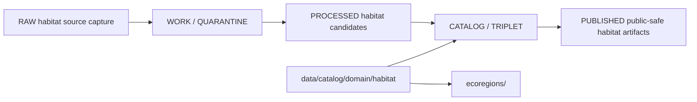

<!-- [KFM_META_BLOCK_V2]
doc_id: kfm://doc/data-catalog-domain-habitat-readme
title: data/catalog/domain/habitat/README.md — Habitat Domain Catalog README
version: v0.1
type: readme; data-lifecycle-sublane; domain-catalog-guide
status: draft; PROPOSED; data-root; catalog-stage; habitat; release-gated; public-safe-context
owners: OWNER_TBD — Habitat steward · Data steward · Catalog steward · Evidence steward · Policy steward · Release steward · Schema steward · Docs steward
created: NEEDS VERIFICATION — blank placeholder existed before v0.1 expansion
updated: 2026-06-24
policy_label: public-doc; data; catalog; habitat; lifecycle; release-gated; public-safe-context
tags: [kfm, data, catalog, habitat, domain-catalog, CATALOG, TRIPLET, HabitatPatch, LandCoverObservation, EcologicalSystem, EcoregionSnapshot, EvidenceBundle, SourceDescriptor, ReleaseManifest]
related:
  - ../../README.md
  - ../../../README.md
  - ../../../../docs/domains/habitat/DATA_LIFECYCLE.md
  - ../../../../docs/domains/habitat/HABITAT_DOMAIN_MODEL.md
  - ../../../../docs/domains/habitat/SOURCE_FAMILIES.md
  - ../../../../docs/domains/habitat/sublanes/ecoregions.md
  - ./ecoregions/README.md
  - ../../../../contracts/domains/habitat/
  - ../../../../schemas/contracts/v1/domains/habitat/
  - ../../../../policy/domains/habitat/
  - ../../../../data/proofs/
  - ../../../../data/receipts/
  - ../../../../release/
notes:
  - "This file replaces a blank placeholder at `data/catalog/domain/habitat/README.md`."
  - "Habitat lifecycle docs identify `data/catalog/domain/habitat/` as the Habitat catalog lane shape under `data/`."
  - "This folder is a CATALOG-stage domain catalog lane; it is not RAW, WORK, QUARANTINE, PROCESSED, PUBLISHED, proof storage, release authority, schema authority, policy code, or implementation code."
  - "Habitat catalog records must preserve owning-lane truth for Fauna, Flora, Soil, Hydrology, Hazards, Agriculture, Archaeology, Spatial Foundation, and People/Land joins."
  - "Rollback target for this replacement is previous blank blob SHA `8b137891791fe96927ad78e64b0aad7bded08bdc`."
[/KFM_META_BLOCK_V2] -->

# data/catalog/domain/habitat

> Habitat-domain catalog lane for governed catalog records and indexes inside the `CATALOG / TRIPLET` lifecycle stage.

  
  
  
  
  
  

**Status:** draft / PROPOSED  
**Path:** `data/catalog/domain/habitat/README.md`  
**Owning root:** `data/catalog/domain/`  
**Domain segment:** `habitat`  
**Lifecycle stage:** `CATALOG / TRIPLET`  
**Exposure posture:** release-gated; public records must use approved public-safe representation  
**Truth posture:** CONFIRMED target was blank · CONFIRMED parent catalog lane is RELEASED ONLY for public exposure · CONFIRMED Habitat lifecycle docs identify `data/catalog/domain/habitat/` as a PROPOSED catalog lane shape · CONFIRMED `ecoregions/` child README now exists and treats ecoregions as context, not occurrence truth · NEEDS VERIFICATION for catalog inventory, schemas, validators, policy gates, receipts, release manifests, access controls, and route behavior.

**Quick jumps:** [Purpose](#purpose) · [Lifecycle boundary](#lifecycle-boundary) · [Repo fit](#repo-fit) · [Accepted contents](#accepted-contents) · [Exclusions](#exclusions) · [Child lanes](#child-lanes) · [Catalog requirements](#catalog-requirements) · [Cross-lane guardrails](#cross-lane-guardrails) · [Evidence ledger](#evidence-ledger) · [Validation checklist](#validation-checklist) · [Rollback](#rollback)

---

## Purpose

`data/catalog/domain/habitat/` stores or stages Habitat-domain catalog records and indexes that connect habitat patches, land-cover observations, ecological systems, suitability surfaces, connectivity edges, corridors, restoration opportunities, stewardship zones, uncertainty surfaces, evidence references, source roles, sensitivity posture, receipts, and release state.

A domain catalog record supports discovery, steward review, catalog closure, and release preparation. It does **not** make a Habitat claim true, public, policy-admitted, evidence-supported, or released by itself.

## Lifecycle boundary

`data/catalog/domain/habitat/` is a CATALOG-stage domain lane. Public exposure applies only to records tied to approved release state, governed route, evidence support, source-role support, sensitivity posture, and required receipts.

## Repo fit

| Responsibility | Correct home | Rule |
|---|---|---|
| Habitat domain catalog records | `data/catalog/domain/habitat/` | This lane. |
| Habitat ecoregion catalog records | `data/catalog/domain/habitat/ecoregions/` | Child catalog sublane. |
| Parent catalog stage | `data/catalog/` | Parent CATALOG-stage lane. |
| Habitat STAC records | `data/catalog/stac/habitat/` | Spatiotemporal catalog records, if accepted. |
| Habitat DCAT records | `data/catalog/dcat/habitat/` | Dataset/distribution catalog records, if accepted. |
| Habitat PROV records | `data/catalog/prov/habitat/` | Provenance catalog projection, if accepted. |
| Habitat graph/triplet projections | `data/triplets/.../habitat/` | Paired graph stage. |
| Habitat proof/evidence | `data/proofs/` or accepted proof roots | EvidenceBundle and ProofPack. |
| Habitat receipts | `data/receipts/` or accepted receipt roots | CatalogBuildReceipt, RunReceipt, validation, policy, review, transform, and correction receipts. |
| Habitat release decisions | `release/` | Publication authority. |
| Habitat schemas and policy | `schemas/contracts/v1/domains/habitat/`, `policy/domains/habitat/` | Separate roots; path status remains PROPOSED/NEEDS VERIFICATION. |

## Accepted contents

| Content | Purpose |
|---|---|
| Habitat domain catalog indexes | Group-level indexes for Habitat catalog records. |
| HabitatPatch catalog entries | Catalog records for patch products and evidence links. |
| LandCoverObservation catalog entries | Catalog records for land-cover observation products and source versions. |
| EcologicalSystem catalog entries | Catalog records for ecological-system classifications and related products. |
| Suitability and connectivity catalog entries | Catalog records for model outputs, corridors, and relationship products. |
| Restoration and stewardship catalog entries | Catalog records for opportunity and stewardship-zone products. |
| Child-lane indexes | Catalog indexes for sublanes such as `ecoregions/`. |
| Evidence and source pointers | References to EvidenceBundle, SourceDescriptor, receipts, and validation reports. |
| Catalog quality summaries | Summaries that point to validation reports and receipts. |

## Exclusions

| Do not put here | Correct home |
|---|---|
| RAW habitat source files | `data/raw/habitat/` |
| WORK/intermediate data | `data/work/habitat/` |
| Quarantined data | `data/quarantine/habitat/` |
| Processed datasets | `data/processed/habitat/` |
| STAC/DCAT/PROV records | `data/catalog/stac/habitat/`, `data/catalog/dcat/habitat/`, `data/catalog/prov/habitat/` if accepted |
| Triplets/graph edges | `data/triplets/.../habitat/` |
| EvidenceBundle/proof records | `data/proofs/` |
| Receipts | `data/receipts/` |
| Release decisions | `release/` |
| Published public products | `data/published/layers/habitat/` |
| Semantic contracts | `contracts/domains/habitat/` |
| Schemas | `schemas/` |
| Policy rules | `policy/` |
| Validators/tests/code | `tools/validators/`, `tests/`, implementation roots |

## Child lanes

| Child lane | Status | Purpose |
|---|---|---|
| `ecoregions/` | draft / PROPOSED | Catalog records for governed regionalization-context records and indexes. |

Additional child lanes should be added only when source, schema, policy, receipt, release, and rollback expectations are clear enough to avoid misleading authority.

## Catalog requirements

PROPOSED until schemas, validators, and inventory are verified:

| Requirement | Meaning |
|---|---|
| Stable catalog identity | Record has a stable identity linked to source, evidence, derivative, or release object. |
| Object family | Record declares the Habitat object family or child sublane it describes. |
| Evidence reference | Record points to EvidenceBundle/proof context when claims depend on evidence. |
| Source reference | Record points to SourceDescriptor/source registry where source role matters. |
| Sensitivity decision | Record links to sensitivity classification, rights, geometry posture, and obligations when material. |
| Release reference | Public or release-linked records point to ReleaseManifest and rollback target. |
| Closure compatibility | Habitat domain catalog, STAC, DCAT, and PROV agreement holds where those projections exist. |

## Cross-lane guardrails

- Habitat catalog records are catalog carriers, not source truth by themselves.
- Species occurrence truth remains with Fauna; plant occurrence and rare-plant truth remain with Flora.
- Soil, Hydrology, Hazards, Agriculture, Archaeology, Spatial Foundation, and People/Land keep their own authority; Habitat joins them through governed relationships only.
- Cross-lane joins that touch sensitive material require policy-approved transform and review state before public use.
- Public derivatives should preserve receipt chains and release linkage.
- Unreleased Habitat catalog records are not public merely because they exist under this directory.

## Evidence ledger

| Source | Status | Supports | Limits |
|---|---|---|---|
| `data/catalog/domain/habitat/README.md` previous file | CONFIRMED | Target existed as a blank placeholder. | Did not define lane boundaries. |
| `data/catalog/README.md` | CONFIRMED | Parent catalog lane, domain catalog layout, RELEASED ONLY public posture. | Does not prove Habitat catalog inventory. |
| `docs/domains/habitat/DATA_LIFECYCLE.md` | CONFIRMED doctrine / PROPOSED lane application | Habitat lifecycle, catalog path shape, trust membrane, watcher posture. | Many exact files, validators, and route names remain NEEDS VERIFICATION. |
| `data/catalog/domain/habitat/ecoregions/README.md` | CONFIRMED child README | Existing ecoregions child catalog sublane. | Does not prove broader Habitat catalog inventory or release state. |

## Validation checklist

- [ ] Confirm actual child files and Habitat catalog inventory under this lane.
- [ ] Confirm Habitat domain catalog schema/profile location.
- [ ] Confirm access policy, validators, and CI checks.
- [ ] Confirm SourceDescriptor, EvidenceBundle, RunReceipt, ValidationReport, PolicyDecision, ReviewRecord, transform receipt, and ReleaseManifest references.
- [ ] Confirm object-family identity and child-lane linkage behavior.
- [ ] Confirm cross-lane joins preserve owning-lane truth and sensitivity posture.
- [ ] Confirm domain/STAC/DCAT/PROV catalog closure where those projections exist.
- [ ] Confirm correction, withdrawal, supersession, and rollback behavior for stale or failed records.

## Rollback

Rollback is required if this lane becomes a Habitat raw-data root, work area, quarantine store, processed-data store, semantic-contract root, proof store, source-registry root, release-decision root, published-output root, schema root, policy root, validator root, implementation root, or public exposure shortcut.

Rollback target for this replacement: previous blank blob SHA `8b137891791fe96927ad78e64b0aad7bded08bdc`.

<a href="#top">Back to top</a>

