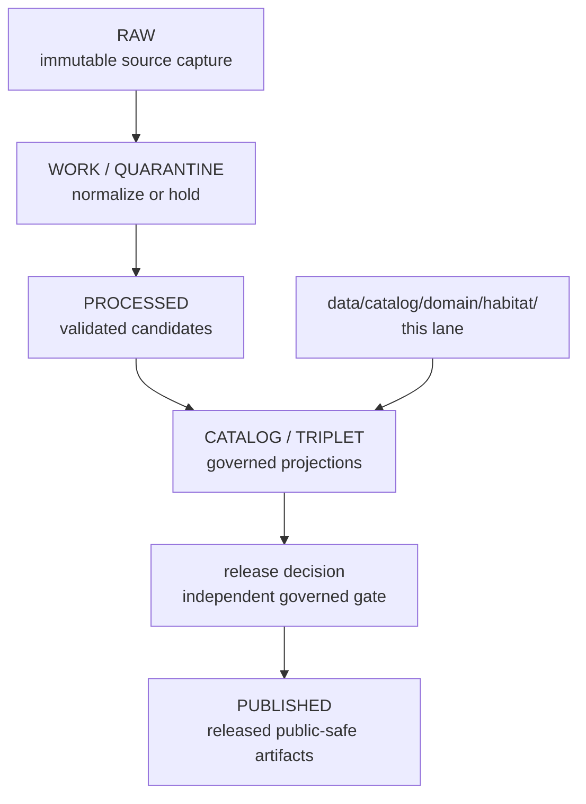

<!-- [KFM_META_BLOCK_V2]
doc_id: kfm://doc/data-catalog-domain-habitat-readme
title: data/catalog/domain/habitat/ - Governed Habitat Catalog Lane
version: v0.2.0
type: readme; data-lifecycle-sublane; domain-catalog-guide
status: repository-grounded draft; catalog-stage; habitat; release-gated; source-role-aware; sensitivity-aware; implementation-incomplete
owners: NEEDS VERIFICATION - Habitat domain steward · Data steward · Catalog steward · Evidence steward · Source steward · Rights/sensitivity steward · Policy steward · Validation steward · Release steward · Correction/rollback steward · Docs steward
created: NEEDS VERIFICATION - blank placeholder existed before v0.1 expansion
updated: 2026-07-25
supersedes: v0.1 at the same canonical path; no catalog record, lifecycle state, policy decision, release, route, or publication state
policy_label: restricted-review; no-direct-public-path; release-gated; sensitive-join-fail-closed; source-role-anti-collapse
tags: [kfm, data, catalog, habitat, CATALOG, TRIPLET, HabitatPatch, LandCoverObservation, EcologicalSystem, HabitatQualityScore, SuitabilityModel, ConnectivityEdge, Corridor, RestorationOpportunity, StewardshipZone, UncertaintySurface, ModelRunReceipt, GeoprivacyTransform, EvidenceBundle, SourceDescriptor, CatalogMatrix, ReleaseManifest, geoprivacy, correction, rollback]
baseline:
  ref: main@b42cd1480e9d995b6b39febf54e2385d86b3bce5
  target_blob: 8166a3c01beb4cdee43a867540af342970d44bef
  historical_blank_blob: 8b137891791fe96927ad78e64b0aad7bded08bdc
related:
  - ../README.md
  - ../../README.md
  - ../../../README.md
  - ../../../../docs/doctrine/directory-rules.md
  - ../../../../docs/domains/habitat/README.md
  - ../../../../docs/domains/habitat/CANONICAL_PATHS.md
  - ../../../../docs/domains/habitat/DATA_LIFECYCLE.md
  - ../../../../docs/domains/habitat/HABITAT_DOMAIN_MODEL.md
  - ../../../../docs/domains/habitat/MODEL_VS_OBSERVATION.md
  - ../../../../docs/domains/habitat/SENSITIVITY_AND_GEOPRIVACY.md
  - ./ecoregions/README.md
  - ../../../../contracts/domains/habitat/README.md
  - ../../../../schemas/contracts/v1/domains/habitat/README.md
  - ../../../../policy/domains/habitat/README.md
  - ../../../registry/sources/habitat/README.md
  - ../../../registry/habitat/README.md
  - ../../../../tests/domains/habitat/README.md
  - ../../../../fixtures/domains/habitat/README.md
  - ../../../../tools/validators/domains/habitat/README.md
  - ../../../../pipelines/domains/habitat/README.md
  - ../../../../pipeline_specs/habitat/README.md
  - ../../../../release/candidates/habitat/README.md
  - ../../../proofs/habitat/README.md
  - ../../../receipts/habitat/README.md
  - ../../../published/layers/habitat/README.md
  - ../../../rollback/habitat/README.md
notes:
  - "This revision upgrades the existing README in place and preserves the stable doc_id, canonical path, historical blank-blob lineage, legacy fragments, and material governance boundaries."
  - "This directory is a CATALOG / TRIPLET-stage Habitat domain lane, not a source, proof, receipt, policy, schema, release, publication, or public-serving authority."
  - "Habitat owns landscape context and modeled habitat products; Fauna and Flora retain occurrence truth, and regulatory critical habitat remains distinct from modeled habitat."
  - "The pinned subtree contains only this README, the ecoregions child README, and its .gitkeep marker; no Habitat catalog payload is established."
  - "The Habitat CatalogMatrix contract and fixture paths referenced by the schema are absent, the schema is a permissive PROPOSED stub, and the domain validator raises NotImplementedError."
  - "Habitat-specific STAC, DCAT, and PROV child paths are absent at the pinned baseline."
[/KFM_META_BLOCK_V2] -->

# `data/catalog/domain/habitat/` - Governed Habitat Catalog Lane

> Organize release-gated Habitat catalog records at the `CATALOG / TRIPLET` stage without turning catalog presentation, ecoregion context, land-cover classes, suitability models, critical-habitat records, cross-domain joins, or generated language into sovereign truth.

> [!IMPORTANT]
> A catalog record is a governed discovery carrier. It does not admit a source, prove a claim, resolve an `EvidenceRef`, clear rights, apply policy, approve a public-safe transform, turn modeled habitat into regulatory critical habitat, authorize release, or publish an artifact.

> [!CAUTION]
> Do not place live source payloads, secrets, exact sensitive occurrence-linked geometry, private-land details, protected-site detail, stewardship-controlled context, operational geoprivacy parameters, or unpublished canonical records in this lane. Unknown rights, source role, evidence, sensitivity, review, or release state blocks public-bound use.

> [!NOTE]
> `CONFIRMED` means verified at the pinned repository baseline. `PROPOSED` means designed but not accepted and verified. `NEEDS VERIFICATION` is checkable but unresolved. `UNKNOWN` was not established. `CONFLICTED` identifies incompatible evidence or authority that requires a governed decision.

**Quick navigation:** [Purpose](#purpose) · [Authority](#authority-level) · [Status](#status) · [Belongs](#what-belongs-here) · [Exclusions](#what-does-not-belong-here) · [Inputs](#inputs) · [Outputs](#outputs) · [Validation](#validation) · [Review](#review-burden) · [Related folders](#related-folders) · [ADRs](#adrs) · [Last reviewed](#last-reviewed) · [Lifecycle](#lifecycle-and-catalog-boundary) · [Requirements](#habitat-catalog-requirements) · [Anti-collapse](#source-role-and-anti-collapse-guardrails) · [Sensitivity](#sensitivity-and-public-safe-representation) · [Catalog lanes](#known-related-catalog-lanes) · [Evidence](#evidence-basis) · [Closure](#projection-and-release-closure) · [Rollback](#migration-correction-and-rollback) · [Open verification](#open-verification-register) · [Done](#definition-of-done) · [No-loss ledger](#no-loss-ledger)

---

## Purpose

`data/catalog/domain/habitat/` is the domain-scoped catalog lane for governed Habitat records after upstream source admission, normalization, quarantine handling, validation, evidence binding, source-role classification, rights review, and sensitivity review have produced a catalog-eligible candidate.

The lane may organize catalog descriptions of `HabitatPatch`, `LandCoverObservation`, `EcologicalSystem`, `HabitatQualityScore`, `SuitabilityModel`, `ConnectivityEdge`, `Corridor`, `RestorationOpportunity`, `StewardshipZone`, `UncertaintySurface`, `ModelRunReceipt`, ecoregion context, public-safe derivatives, and their evidence and release relationships.

Its purpose is discovery, inspection, catalog closure, and release preparation. Directory placement alone confers no truth, authority, admissibility, release, or public status.

## Authority level

**Implementation-bearing lifecycle lane under the canonical `data/` responsibility root; this README is orientation and governance documentation only.**

| Authority question | Answer |
|---|---|
| What this lane may own | Habitat-domain catalog records and indexes at the `CATALOG / TRIPLET` stage |
| What outranks this README | Accepted doctrine and ADRs; contracts; schemas for shape; policy decisions; source registry records; evidence and proof; validation results; review records; release decisions; correction/withdrawal records; rollback targets |
| What this lane cannot decide | Source admission, object meaning, machine shape, allow/deny policy, evidence sufficiency, public-safe geometry, stewardship assignment, release, publication, correction, or rollback authorization |
| Public-client posture | No direct public read; only approved released public-safe projections may cross a governed delivery boundary |
| AI posture | Interpretive only; `EvidenceBundle` outranks generated language and catalog presentation |

Directory Rules sections 4, 9, and 12 support `data/catalog/domain/habitat/`: `data/` owns lifecycle material, `catalog` names the phase, and `habitat` is the domain segment. Section 15 directly requires the root-level README contract; this nested README adopts the same order for consistency and reviewability without claiming that the section directly mandates every nested lane.

## Status

| Surface | Observed state at `main@b42cd14...` | Consequence |
|---|---|---|
| Canonical path and document identity | `CONFIRMED` | Update in place; preserve `kfm://doc/data-catalog-domain-habitat-readme` and stable fragments |
| README maturity | Repository-grounded `draft`, version `v0.2.0` | Human review remains required |
| Direct subtree inventory | `CONFIRMED`: this README, `ecoregions/README.md`, and `ecoregions/.gitkeep` | No tracked Habitat catalog payload is established in this subtree |
| Ecoregions child lane | `CONFIRMED` documentation-only boundary; no active catalog or public release established | Context remains distinct from occurrence, regulatory, and release truth |
| Habitat contracts | `CONFIRMED` draft semantic-contract lane | Meaning is documented; catalog-specific contract acceptance remains unproved |
| Habitat `CatalogMatrix` | Referenced contract and fixture paths are absent; schema is permissive and `PROPOSED`; validator raises `NotImplementedError` | Executable catalog closure is not established |
| Habitat policy | `CONFIRMED` greenfield README plus sampled deny-by-default `PROPOSED` Rego scaffolds | Fail-closed intent exists; accepted policy evaluation is unproved |
| Habitat source registry | Two repository surfaces exist; one holds `PROPOSED` placeholders and the other holds `TBD` templates | Canonical path, role mapping, rights, terms, cadence, and activation remain unresolved |
| Tests, fixtures, and validators | Documentation and placeholder/scaffold files exist; `test_habitat_smoke.py::test_placeholder` remains | No accepted deterministic Habitat catalog suite or production-validation claim |
| Habitat catalog pipeline | `catalog.yaml` has `stages: []`; `catalog.py` is a greenfield placeholder | No catalog producer is established |
| `domain-habitat` workflow | `CONFIRMED` explicit validation, proof, and release-readiness holds | Workflow presence or a held result cannot prove validation, evidence, policy, or release |
| Habitat STAC/DCAT/PROV child lanes | `NOT PRESENT` at the pinned tree; only family-root READMEs and Flora children were observed | Do not claim Habitat projection closure or invent child paths |
| Triplet projection | Plural Habitat path is a marker without a README; singular Habitat README also exists | Path and projection closure are `CONFLICTED / NEEDS VERIFICATION` |
| Release candidate lane | `CONFIRMED` parent and two child READMEs; register says `NO_ACTIVE_CANDIDATE` | Candidate, release, and publication remain unproved |
| Published Habitat layer lane | `CONFIRMED` guidance with ecoregions and land-cover child READMEs | No emitted released artifact was established |
| Public routes, hosting, caches, search, graph, or deployed isolation | `UNKNOWN` | No public-availability or isolation claim |

The safe current conclusion is narrow: the repository contains a documented Habitat catalog responsibility lane and extensive related scaffolding, but no evidence reviewed for this revision establishes a Habitat catalog payload, accepted catalog profile, executable closure suite, admitted source set, approved release, public route, or operational rollback.

## What belongs here

| Accepted material | Required boundary |
|---|---|
| Habitat domain catalog records and indexes | Stable identity, object family, version, lifecycle state, and source role are explicit |
| HabitatPatch catalog entries | Patch meaning, source lineage, geometry role, uncertainty, evidence, and public-safe status remain resolvable |
| LandCoverObservation and EcologicalSystem entries | Source product, vintage, class scheme, crosswalk, observation/model role, and uncertainty remain visible |
| Ecoregion catalog pointers | Preserve framework, version, hierarchy, and context-only meaning; route child records through `ecoregions/` |
| `HabitatQualityScore` and `SuitabilityModel` entries | Carry model method/version, inputs, bounds, uncertainty, model card or accepted equivalent, and non-occurrence warning |
| `ConnectivityEdge` and `Corridor` entries | Remain derived relationship/model products, not confirmed movement or access authorization |
| `RestorationOpportunity` and `StewardshipZone` entries | Remain opportunity/context records, not prescriptions, permissions, ownership, or management authority |
| `UncertaintySurface` and `ModelRunReceipt` entries | Preserve uncertainty scope and model execution lineage without becoming evidence or release authority |
| Source and evidence pointers | Resolve to governed `SourceDescriptor`, `EvidenceRef`/`EvidenceBundle`, proof, or accepted equivalent; do not duplicate those authorities here |
| Validation and quality summaries | Point to immutable validation/proof artifacts and state their scope and limits |
| Policy, review, sensitivity, and public-representation references | Identify applicable decisions, reason codes, review state, geometry class, and unresolved blockers |
| Release, correction, withdrawal, supersession, and rollback references | Bind public-bound records to immutable release identity and a reversible correction path |

Records may be documentation examples only when clearly labeled synthetic and non-authoritative. Real fixtures belong under `fixtures/`; real lifecycle payloads remain in their owning lifecycle lanes.

## What does NOT belong here

| Excluded material | Correct responsibility |
|---|---|
| RAW captures or source exports | `data/raw/habitat/` |
| WORK/intermediate records | `data/work/habitat/` |
| Quarantined records and exit decisions | `data/quarantine/habitat/` plus governed quarantine records |
| Processed canonical candidates | `data/processed/habitat/` |
| Source identities, rights, cadence, and activation records | [`data/registry/sources/habitat/`](../../../registry/sources/habitat/README.md), subject to resolution of the alternate registry surface |
| Semantic object meaning | [`contracts/domains/habitat/`](../../../../contracts/domains/habitat/README.md) |
| Machine-checkable object shape | [`schemas/contracts/v1/domains/habitat/`](../../../../schemas/contracts/v1/domains/habitat/README.md) |
| Allow, deny, restrict, generalize, or abstain rules | [`policy/domains/habitat/`](../../../../policy/domains/habitat/README.md) and accepted cross-cutting policy lanes |
| Executable validators and regression proof | [`tools/validators/domains/habitat/`](../../../../tools/validators/domains/habitat/README.md), [`tests/domains/habitat/`](../../../../tests/domains/habitat/README.md), and [`fixtures/domains/habitat/`](../../../../fixtures/domains/habitat/README.md) |
| Pipeline implementation or declarative execution specs | [`pipelines/domains/habitat/`](../../../../pipelines/domains/habitat/README.md) and [`pipeline_specs/habitat/`](../../../../pipeline_specs/habitat/README.md) |
| STAC, DCAT, or PROV-specific Habitat records | Accepted child lanes under `data/catalog/stac/`, `data/catalog/dcat/`, or `data/catalog/prov/`; Habitat child lanes do not exist at the pinned baseline |
| Triplet/graph projections | `data/triplets/` after singular/plural path disposition and README coverage are resolved |
| Evidence bundles and proof artifacts | [`data/proofs/habitat/`](../../../proofs/habitat/README.md) or the accepted proof family |
| Process-memory receipts | [`data/receipts/habitat/`](../../../receipts/habitat/README.md) or the accepted receipt family |
| Release decisions or candidate approval | [`release/`](../../../../release/README.md) and [`release/candidates/habitat/`](../../../../release/candidates/habitat/README.md) |
| Released public-safe map-layer bytes | [`data/published/layers/habitat/`](../../../published/layers/habitat/README.md) |
| Correction, withdrawal, and rollback authority | `release/` records plus [`data/rollback/habitat/`](../../../rollback/habitat/README.md) support |
| Direct public API, map, search, graph, AI, or filesystem surfaces | Governed application/delivery interfaces over approved release-resolved carriers |
| Exact sensitive coordinates, harmful joins, or operational suppression parameters | Restricted stores and policy-governed review paths; never ordinary public catalog content |

## Inputs

Catalog eligibility is a gate, not an assumption.

| Candidate input | Minimum required support before catalog admission |
|---|---|
| Processed Habitat object or derivative | Stable identity, type, version, digest, lineage, temporal scope, geometry role, and validation state |
| Source-backed claim | Resolvable source descriptor, canonical source role, evidence reference, citation context, current rights posture, and applicable caveats |
| Observed, regulatory, modeled, aggregate, administrative, candidate, or synthetic material | Role remains explicit and compatible with the claim; no silent upgrade or collapse |
| Interpreted or modeled product | Explicit `modeled` role, method/version, confidence/uncertainty, input lineage, and non-observation/non-regulatory warning |
| Regulatory critical-habitat record | Authoritative regulatory source role, designation identity, temporal/legal scope, and explicit separation from modeled habitat |
| Habitat-to-Fauna or Habitat-to-Flora relation | Owning-lane identity, public-safe occurrence context, join policy, sensitivity result, evidence, and transform/review support |
| Sensitive, stewardship-controlled, or private-context record | Internal/public geometry classes, applicable policy decision, transform lineage, reviewer state, and fail-closed unresolved fields |
| Public-bound derivative | Public-safe digest, field allowlist, transform receipt or accepted equivalent, release reference, correction path, withdrawal state, and rollback target |

Missing, contradictory, stale, or unresolved support yields a structured hold, quarantine, abstain, restrict, or deny outcome according to the governing contract and policy. It does not yield optimistic catalog admission.

## Outputs

| Output | Authority limit |
|---|---|
| Internal Habitat catalog record | Improves discovery and inspection; not public by directory placement |
| Domain catalog index | Groups governed records without replacing source, evidence, policy, or release state |
| Catalog-quality summary | Summarizes validated results and links to proof; does not become proof itself |
| Ecoregion child reference | Preserves framework context without asserting species presence or HabitatPatch quality |
| Projection crosswalk | Relates domain, STAC, DCAT, PROV, and triplet identities where realized; does not establish agreement without validation |
| Release-linked catalog projection | Describes a release-resolved public-safe artifact; does not authorize the release |
| Correction, withdrawal, or supersession pointer | Preserves historical state and current disposition without rewriting prior records |

Outputs must remain distinguishable as candidate, held, released, corrected, withdrawn, superseded, or historical. A green check, catalog rendering, pull request, merge, or generated receipt cannot coerce one state into another.

## Validation

### README validation

This revision is expected to preserve and verify:

- the exact canonical path, stable `doc_id`, historical blank-blob lineage, v0.1 purpose, and every legacy fragment;
- Directory Rules placement and README-order conformance;
- GitHub Markdown headings, tables, supported alerts, explicit anchors, badge URLs, and Mermaid syntax;
- repository-relative links only to verified files or folders with a README;
- explicit status for absent Habitat catalog projections, placeholder source descriptors, the incomplete CatalogMatrix path, placeholder tests/validators/pipelines, hold-only workflows, and unknown runtime state;
- no live source payload, exact sensitive location, operational geoprivacy parameter, secret, credential, release decision, or fabricated owner;
- a one-file base-to-head diff and byte-for-byte remote readback.

### Catalog-record acceptance

| Gate | Pass evidence | Fail-closed result |
|---|---|---|
| Identity and version | Deterministic ID, object family, version, digest, temporal scopes, and supersession state | Hold; no catalog promotion |
| Source role and anti-collapse | Canonical role resolves; regulatory, observed, modeled, aggregate, administrative, candidate, and synthetic meanings remain distinct | Quarantine or fail |
| Evidence and citation | `EvidenceRef` resolves to the intended `EvidenceBundle`/proof scope | Hold or abstain |
| Rights and sensitivity | Current terms, redistribution class, geometry class, joins, and reviewer obligations resolve | Restrict, deny, or quarantine |
| Model, observation, and regulatory separation | Suitability/model products are not labeled as occurrence or regulatory critical habitat | Deny or fail |
| Public-safe representation | Exact/internal and generalized/redacted/aggregated outputs are distinct; transform lineage is immutable | No public-bound record |
| Spatial and temporal support | CRS, extent, resolution/scale, source time, observed/valid time, retrieval, model/build, release, and correction scopes remain inspectable | Hold |
| Catalog projection agreement | Domain, STAC, DCAT, PROV, triplet, digest, and release references agree where required | Closure failure |
| Policy and review | Applicable policy decision and required human review resolve | Hold |
| Release, correction, and rollback | Immutable release reference, correction/withdrawal state, and rollback target resolve | No publication |

> [!WARNING]
> The Habitat-specific `CatalogMatrix` schema requires only `id`, allows additional properties, references a missing semantic contract and fixture root, and points to a validator that raises `NotImplementedError`. The catalog pipeline specification has no stages, the catalog implementation is a placeholder, and the smoke test remains `test_placeholder`. The Habitat workflow records explicit readiness holds. None of those surfaces currently establishes executable catalog closure.

## Review burden

Changes to this lane are high-burden documentation changes because they describe sensitive ecological joins, regulatory records, modeled products, stewardship context, lifecycle state, and release boundaries even when the diff is Markdown-only.

| Change concern | Required review role | Why |
|---|---|---|
| Object family or source-role language | Habitat domain + contract/source stewards | Prevent observed/regulatory/modeled and context/authority collapse |
| Critical-habitat or suitability language | Regulatory-source + model/uncertainty + policy stewards | Prevent modeled habitat from being presented as legal/regulatory designation |
| Fauna/Flora relation language | Owning-domain + sensitivity/geoprivacy stewards | Preserve occurrence authority and deny reconstruction of sensitive locations |
| Rights, stewardship, private context, or public geometry | Rights/sensitivity + affected steward | Prevent unauthorized or harmful disclosure |
| Catalog schema, profile, or projection claims | Catalog + schema + validation stewards | Keep semantic, machine-shape, and executable claims aligned |
| Release, correction, withdrawal, or rollback claims | Independent release + correction/rollback stewards | Preserve separation of duties and reversibility |
| Public API, UI, map, search, graph, or AI claims | Delivery + policy + evidence stewards | Prevent internal catalog records from becoming a public shortcut |

`.github/CODEOWNERS` provides repository routing to `@bartytime4life`. Routing is not an ownership assignment, `ReviewRecord`, independent approval, sensitivity decision, release decision, or proof that review occurred.

## Related folders

| Responsibility | Verified related lane | Relationship |
|---|---|---|
| Domain catalog parent | [`data/catalog/domain/`](../README.md) | Groups domain-scoped catalog lanes |
| Catalog parent | [`data/catalog/`](../../README.md) | Owns catalog projection responsibility |
| Data root | [`data/`](../../../README.md) | Owns lifecycle material |
| Root-level compatibility fence | [`catalog/domain/habitat/`](../../../../catalog/domain/habitat/README.md) | Redirect/drift boundary; not canonical Habitat catalog authority |
| Ecoregions child | [`data/catalog/domain/habitat/ecoregions/`](./ecoregions/README.md) | Source-versioned regionalization context |
| STAC family root | [`data/catalog/stac/`](../../stac/README.md) | Habitat child absent at the pinned baseline |
| DCAT family root | [`data/catalog/dcat/`](../../dcat/README.md) | Habitat child absent at the pinned baseline |
| PROV family root | [`data/catalog/prov/`](../../prov/README.md) | Habitat child absent at the pinned baseline |
| Plural triplet root | [`data/triplets/`](../../../triplets/README.md) | Directory Rules-preferred projection family; Habitat child is marker-only |
| Singular Habitat triplet lane | [`data/triplet/habitat/`](../../../triplet/habitat/README.md) | Existing compatibility/conflict surface; disposition unresolved |
| Habitat doctrine | [`docs/domains/habitat/`](../../../../docs/domains/habitat/README.md) | Domain scope, objects, lifecycle, sources, sensitivity, and backlog |
| Semantic contracts | [`contracts/domains/habitat/`](../../../../contracts/domains/habitat/README.md) | Own object meaning |
| Machine schemas | [`schemas/contracts/v1/domains/habitat/`](../../../../schemas/contracts/v1/domains/habitat/README.md) | Own machine-checkable shape |
| Domain policy | [`policy/domains/habitat/`](../../../../policy/domains/habitat/README.md) | Own domain allow/deny/restrict/abstain rules |
| Canonical source-registry candidate | [`data/registry/sources/habitat/`](../../../registry/sources/habitat/README.md) | Holds source-boundary documentation and placeholder descriptors |
| Alternate Habitat registry surface | [`data/registry/habitat/`](../../../registry/habitat/README.md) | Holds a second placeholder source family; authority conflict unresolved |
| Fixtures and tests | [`fixtures/domains/habitat/`](../../../../fixtures/domains/habitat/README.md) · [`tests/domains/habitat/`](../../../../tests/domains/habitat/README.md) | Intended deterministic public-safe proof surfaces |
| Validators and pipelines | [`tools/validators/domains/habitat/`](../../../../tools/validators/domains/habitat/README.md) · [`pipelines/domains/habitat/`](../../../../pipelines/domains/habitat/README.md) · [`pipeline_specs/habitat/`](../../../../pipeline_specs/habitat/README.md) | Executable and declarative producer/validation surfaces |
| Proofs and receipts | [`data/proofs/habitat/`](../../../proofs/habitat/README.md) · [`data/receipts/habitat/`](../../../receipts/habitat/README.md) | Evidence/proof support and process memory |
| Release candidates | [`release/candidates/habitat/`](../../../../release/candidates/habitat/README.md) | Candidate review lane; reports no active candidate |
| Published Habitat layers | [`data/published/layers/habitat/`](../../../published/layers/habitat/README.md) | Released public-safe layer carriers only |
| Rollback support | [`data/rollback/habitat/`](../../../rollback/habitat/README.md) | Data-plane rollback support; not release authority |

## ADRs

| Decision record | Status at the pinned baseline | Bearing on this lane |
|---|---|---|
| [`ADR-habitat-source-roles`](../../../../docs/adr/ADR-habitat-source-roles.md) | `proposed` | Preserves source-role meaning; policy and validator remain scaffolds |
| [`ADR-habitat-modeled-vs-critical`](../../../../docs/adr/ADR-habitat-modeled-vs-critical.md) | `draft` / effective decision `proposed` | Separates modeled habitat from regulatory critical habitat |
| [`ADR-habitat-fauna-thin-slice`](../../../../docs/adr/ADR-habitat-fauna-thin-slice.md) | `draft` / effective decision `proposed` | Defines a public-safe fixture-first proof boundary; no executable proof established |
| [`ADR-habitat-schema-home`](../../../../docs/adr/ADR-habitat-schema-home.md) | `proposed` | Identifies the configured Habitat schema lane without accepting its maturity |
| [`ADR-habitat-stewardship-zone-policy`](../../../../docs/adr/ADR-habitat-stewardship-zone-policy.md) | `draft` / effective decision `proposed` | Keeps stewardship context policy-bound and non-authoritative |
| [`ADR-0011`](../../../../docs/adr/ADR-0011-receipts-vs-proofs-vs-manifests-vs-catalog-separation.md) | `proposed` | Separates catalog, receipt, proof, manifest, and release authority |

This README treats those records as proposed guidance. It does not accept them, resolve schema or registry conflicts, activate sources, or create migration authority.

## Last reviewed

- **Date:** 2026-07-25
- **Evidence boundary:** `main@b42cd1480e9d995b6b39febf54e2385d86b3bce5`
- **Target blob:** `8166a3c01beb4cdee43a867540af342970d44bef`
- **Method:** complete target read; recursive target-subtree inventory; Directory Rules PDF visual review; Habitat doctrine cross-check; bounded inspection of parent/child catalog READMEs, contracts, schemas, source registries, policy, tests, fixtures, validators, pipeline, workflow, proof/receipt, release-candidate, published, and rollback lanes
- **Not exercised:** live source access, source admission, policy evaluation, validator execution, catalog generation, catalog closure, sensitive join, public-safe transform, proof production, candidate assembly, release, deployment, publication, governed API route, cache invalidation, or rollback drill

Re-review on authority/topology, source-role vocabulary, source admission, catalog schema/profile, writer/consumer, sensitivity policy, release, public-consumer, correction, or rollback changes - or within six months.

## Lifecycle and catalog boundary

```mermaid
flowchart TD
    RAW["RAW<br/>immutable source capture"] --> WQ["WORK / QUARANTINE<br/>normalize or hold"]
    WQ --> PROC["PROCESSED<br/>validated candidates"]
    PROC --> CAT["CATALOG / TRIPLET<br/>governed projections"]
    CAT --> REL["release decision<br/>independent governed gate"]
    REL --> PUB["PUBLISHED<br/>released public-safe artifacts"]
    LANE["data/catalog/domain/habitat/<br/>this lane"] --> CAT
```

The lifecycle invariant is:

> **RAW -> WORK / QUARANTINE -> PROCESSED -> CATALOG / TRIPLET -> PUBLISHED**

Promotion is a governed state transition, not a file move. A catalog record can exist while held, unreleased, corrected, withdrawn, or superseded. It becomes public only when an accepted release resolves the correct artifact, evidence/proof, policy/review state, correction path, and rollback target through a governed interface.

Connectors and watchers do not publish or write durable catalog/public artifacts. They may capture source state or emit candidate decisions and receipts into their accepted lanes; catalog construction and release remain separate governed steps.

## Habitat catalog requirements

The requirements below are semantic acceptance criteria, not claims that the current placeholder schema enforces every field.

| Requirement | Minimum meaning |
|---|---|
| Stable identity | Deterministic catalog identity binds domain, object family, source/object identity, version, temporal scope, and content digest where applicable |
| Object and relation family | HabitatPatch, land-cover, ecological-system, ecoregion, suitability, connectivity, corridor, restoration, stewardship, uncertainty, or cross-lane relation is explicit |
| Source role | Canonical role is preserved from admission; a downstream product carries its own role and never silently upgrades its inputs |
| Spatial support | CRS, extent, geometry role, scale/resolution, generalization class, and public/internal geometry relationship are inspectable |
| Temporal support | Source, observed, valid, retrieval, processing/model, release, correction, and supersession times remain distinct where material |
| Evidence support | Consequential claims resolve through `EvidenceRef` to the applicable `EvidenceBundle`/proof scope |
| Model support | Inputs, method/version, parameters, fitness limits, uncertainty, model receipt/card, and non-observation warning remain visible |
| Regulatory separation | Regulatory critical-habitat identity and legal/temporal scope cannot be inferred from modeled habitat or land-cover context |
| Rights and sensitivity | Current rights, attribution, redistribution, access, sensitivity, join risk, field allowlist, transform, obligations, and review state resolve |
| Catalog closure | Domain, STAC, DCAT, PROV, and triplet identities/digests agree where those projections are accepted and emitted |
| Release linkage | Public-bound records resolve immutable artifacts, release decision/manifest, review state, correction/withdrawal state, and rollback target |
| Finite state | Candidate, held, denied, restricted, released, corrected, withdrawn, superseded, and historical states cannot be collapsed |

## Source role and anti-collapse guardrails

Habitat is a bounded context. It owns landscape-facing Habitat meaning, not every fact that can be joined to a Habitat geometry.

| Distinction | Required rule |
|---|---|
| Habitat vs Fauna | Habitat may carry a governed relation to public-safe animal occurrence context; Fauna retains taxon and occurrence truth |
| Habitat vs Flora | Habitat may carry vegetation or habitat association context; Flora retains plant taxon, specimen, occurrence, and rare-plant truth |
| Habitat vs Soil, Hydrology, Hazards, Agriculture, Archaeology, Spatial Foundation, and People/Land | Each related lane retains its own observations, classifications, legal/administrative meaning, sensitivity, and source authority; Habitat may join context only through governed relations |
| Ecoregion vs occurrence | A regionalization framework classifies context; it does not prove species presence, patch quality, or legal status |
| Land cover vs habitat | A land-cover observation or class is input/context; it does not prove habitat presence, condition, quality, or suitability by itself |
| Suitability vs occurrence | A modeled suitability score is a derivative; it does not prove an organism occurred or will occur |
| Modeled vs regulatory habitat | A modeled surface cannot be labeled, queried, or released as a regulatory critical-habitat designation |
| Connectivity vs movement | A connectivity edge or corridor is a modeled/derived relation, not confirmed animal movement or access authority |
| Restoration opportunity vs prescription | An opportunity surface is decision support, not a land-management order, landowner permission, or success claim |
| Stewardship zone vs ownership/access | Stewardship context is not title, ownership, consent, access, or public invitation |
| Catalog summary vs proof | A summary may point to evidence and validation; it does not become an `EvidenceBundle`, proof, policy decision, or release |
| Map/AI presentation vs truth | Rendering and generated language remain evidence-subordinate, policy-aware, release-resolved interpretations |

The Habitat doctrine uses the seven-role vocabulary `observed`, `regulatory`, `modeled`, `aggregate`, `administrative`, `candidate`, and `synthetic`. Repository source templates also use older or different labels such as `primary`, `corroborating`, `context`, `restricted`, and `authority`. That mapping is `CONFLICTED / NEEDS VERIFICATION`; catalog records must not silently translate or upgrade roles.

## Sensitivity and public-safe representation

Habitat data can become sensitive through combination even when each input looks ordinary in isolation. Exact or high-resolution joins among habitat, rare or listed species, plant records, private land, stewardship sites, restoration priorities, infrastructure, archaeology, cultural material, or repeated observations can create reconstruction and misuse risk.

| Condition | Fail-closed result |
|---|---|
| Rights, redistribution, attribution, or access terms unresolved | Hold or deny public-bound use |
| Source role, evidence, or regulatory/model meaning unresolved | Quarantine, abstain, or deny |
| Exact occurrence-linked or stewardship-controlled geometry present | Keep restricted; generalize, aggregate, redact, delay, or deny through approved policy |
| Join raises sensitivity above either input | Apply the most restrictive applicable posture and require join-specific review |
| Public field allowlist or geometry class unresolved | Deny the public derivative |
| Transform lacks immutable input/output digests, reason, policy, reviewer, and residual-risk record | No public-bound record |
| Style or client-side filter is the only concealment | Deny; make the bytes public-safe before tiling/export |
| Review, release, correction, withdrawal, or rollback support absent | Keep unreleased and unavailable to ordinary public clients |

Public-safe representation may include generalized patches, aggregates, coarse grids, watershed/county summaries, suppressed attributes, delayed publication, or a fully denied geometry. The chosen result must remain tied to evidence, policy, review, transform lineage, residual risk, release state, correction, and rollback.

## Known related catalog lanes

| Lane or projection | Bounded state at `main@b42cd14...` | Interpretation |
|---|---|---|
| `data/catalog/domain/habitat/` | This README plus one child README and marker; no tracked payload | Canonical placement, not implemented catalog proof |
| `data/catalog/domain/habitat/ecoregions/` | README plus `.gitkeep`; no active catalog or release established | Context-only child boundary |
| `catalog/domain/habitat/` | README plus `.gitkeep` | Root-level compatibility/drift fence, not parallel authority |
| `data/catalog/stac/habitat/` | Not present | No Habitat STAC closure claim |
| `data/catalog/dcat/habitat/` | Not present | No Habitat DCAT closure claim |
| `data/catalog/prov/habitat/` | Not present | No Habitat PROV closure claim |
| `data/triplets/habitat/` | `.gitkeep` only; no README | Plural path is not a verified projection lane |
| `data/triplet/habitat/` | README plus marker under singular compatibility root | Conflict/disposition requires governance; not closure |
| `release/candidates/habitat/` | Parent/child READMEs; `NO_ACTIVE_CANDIDATE` | Review structure exists; no candidate or release |
| `data/published/layers/habitat/` | Parent plus ecoregions/land-cover guidance | Publication boundary exists; emitted released bytes not established |

Do not create additional catalog children merely to make a diagram or completeness claim true. New lanes require responsibility-root confirmation, a real artifact family, accepted contract/schema/policy posture, validation, migration/rollback handling, and any ADR required by Directory Rules.

## Evidence basis

| Evidence | Status | Supports | Limits |
|---|---|---|---|
| [Directory Rules](../../../../docs/doctrine/directory-rules.md) plus supplied PDF visual review | `CONFIRMED` governing placement doctrine | `data/` lifecycle ownership, `catalog` phase, domain segment, responsibility-root separation, README contract | Does not prove payloads, runtime, release, or public behavior |
| Pinned Git tree for this subtree | `CONFIRMED` | Exactly three tracked paths: parent README, ecoregions README, and marker | Does not inspect external object stores, ignored files, or runtime state |
| [`data/catalog/README.md`](../../README.md) and [`data/catalog/domain/README.md`](../README.md) | `CONFIRMED` parent boundaries | Catalog is canonical lifecycle responsibility with no direct public path | Parent prose does not establish Habitat closure |
| [Habitat domain README](../../../../docs/domains/habitat/README.md) and supplied consolidated Habitat Atlas | Doctrine `CONFIRMED`; implementation largely `PROPOSED` | Object spine, lifecycle, source-role anti-collapse, sensitive joins, publication gates | Planning/doctrine is not executable proof |
| [Ecoregions child README](./ecoregions/README.md) | `CONFIRMED` repository-grounded child boundary | No active catalog/release established; context is not occurrence truth | Does not prove broader Habitat inventory |
| [Habitat contracts](../../../../contracts/domains/habitat/README.md) | `CONFIRMED` draft semantic lane | Object meanings and cross-domain boundaries | Catalog-specific acceptance remains unproved |
| [Habitat schema index](../../../../schemas/contracts/v1/domains/habitat/README.md) and `catalog_matrix.schema.json` | `CONFIRMED` files; `PROPOSED` maturity | Machine-shape surface exists; CatalogMatrix requires only `id` and allows extra fields | Missing Habitat catalog contract/fixtures and no closure proof |
| [Habitat source registry](../../../registry/sources/habitat/README.md) and [alternate registry](../../../registry/habitat/README.md) | `CONFIRMED` repository surfaces; `PROPOSED/TBD` contents | Candidate source families and unresolved authority split | No admitted source, verified rights, canonical role mapping, or activation |
| [Habitat policy](../../../../policy/domains/habitat/README.md) | `CONFIRMED` scaffolds | Sampled Rego defaults fail closed | No accepted evaluation, decision receipt, or coverage proof |
| [Tests](../../../../tests/domains/habitat/README.md), [fixtures](../../../../fixtures/domains/habitat/README.md), and [validators](../../../../tools/validators/domains/habitat/README.md) | `CONFIRMED` mixed documentation/placeholders | Planned proof families and current readiness inputs | Placeholder smoke test and validator stubs are not accepted validation |
| [Pipeline](../../../../pipelines/domains/habitat/README.md), [spec](../../../../pipeline_specs/habitat/README.md), and [workflow](../../../../.github/workflows/domain-habitat.yml) | `CONFIRMED` files | Catalog spec is empty; implementation is placeholder; workflow is hold-oriented | No catalog production, proof, or release execution |
| [Release-candidate README](../../../../release/candidates/habitat/README.md) | `CONFIRMED` repository-grounded review lane | `NO_ACTIVE_CANDIDATE`; no release or emitted artifact established | Bounded repository evidence is not a universal absence claim |
| [Published layers](../../../published/layers/habitat/README.md) and [rollback support](../../../rollback/habitat/README.md) | `CONFIRMED` guidance | Public bytes and rollback support remain downstream and separate from catalog | No release, public route, alias switch, or drill was exercised |

## Projection and release closure

Catalog closure is not a single schema pass. It is agreement among every projection and trust-bearing reference required for the record.

| Closure surface | Current result | Blocking evidence |
|---|---|---|
| Habitat domain catalog payload | `NOT ESTABLISHED` | Subtree contains documentation/marker only |
| Habitat CatalogMatrix semantics and shape | `FAIL-CLOSED / INCOMPLETE` | Missing semantic contract and fixtures; permissive PROPOSED schema |
| Habitat catalog validator | `NOT IMPLEMENTED` | `validate_catalog_matrix.py` raises `NotImplementedError` |
| Habitat catalog producer | `NOT IMPLEMENTED` | Empty spec stages and placeholder implementation |
| STAC projection | `NOT PRESENT` | No Habitat child lane or emitted records |
| DCAT projection | `NOT PRESENT` | No Habitat child lane or emitted records |
| PROV projection | `NOT PRESENT` | No Habitat child lane or emitted records |
| Triplet projection | `CONFLICTED / NOT ESTABLISHED` | Plural marker-only lane and singular compatibility README |
| Evidence/proof closure | `NOT ESTABLISHED` | Proof guide states implementation depth is unresolved; no accepted producer |
| Policy/review closure | `NOT ESTABLISHED` | Scaffolds and proposed ADRs; no evaluated decision/review record |
| Release closure | `NO_ACTIVE_CANDIDATE` | No candidate dossier, promotion decision, or release manifest established |
| Public delivery | `NOT ESTABLISHED` | No released artifact or governed route exercised |

Therefore this README must not advertise a completed Habitat catalog, successful projection closure, release readiness, public API availability, or published layer.

## Migration, correction, and rollback

This v0.2 change is documentation-only. It does not move a payload, create a catalog record, activate a source, change policy, graduate a validator, add a pipeline stage, assemble a candidate, approve a release, update an alias, or publish an artifact.

### README rollback

- Before merge, close or abandon the review branch.
- After merge, revert the documentation commit or restore the pinned v0.1 blob `8166a3c01beb4cdee43a867540af342970d44bef`.
- Preserve historical blank blob `8b137891791fe96927ad78e64b0aad7bded08bdc` as lineage, not as the default rollback target for this substantive v0.1-to-v0.2 modernization.
- Correct forward when repository authority, source, policy, schema, release, or public state changed after this baseline so current governance is not erased.

### Future catalog correction

A correction to a released Habitat record must identify affected source descriptors, processed objects, catalog records, STAC/DCAT/PROV projections, triplets, evidence/proofs, receipts, candidate dossiers, release manifests, published artifacts, registries, caches, APIs, indexes, maps, exports, reports, and generated summaries. Preserve prior identity and disposition; do not silently rewrite a source role, model version, regulatory designation, geometry class, crosswalk, public alias, or evidence relationship.

Rollback or corrective review is required if this lane becomes a raw/work/quarantine/processed store, source registry, proof or receipt store, schema/policy/code root, release authority, public-serving shortcut, sensitive-detail leak, or parallel catalog authority.

## Open verification register

| Priority | Item | Current state | Evidence required to close |
|---|---|---|---|
| P0 | Confirm accountable owners and required independent reviewers | `NEEDS VERIFICATION` | Accepted stewardship records and review rules |
| P0 | Resolve canonical Habitat source-registry path and role vocabulary | `CONFLICTED` | ADR/path disposition, migration note, accepted SourceDescriptor schema, role crosswalk, validator, and tests |
| P0 | Complete Habitat CatalogMatrix contract/schema/fixture/validator chain | `INCOMPLETE` | Semantic contract, strict schema, positive/negative fixtures, finite validator outcomes, and receipts |
| P0 | Replace placeholder Habitat smoke/catalog tests with accepted deterministic no-network coverage | `NOT ESTABLISHED` | Public-safe synthetic fixtures, executable suite, expected failures, and green accepted run |
| P0 | Establish executable policy evaluation for source role, model/regulatory separation, sensitivity, and public representation | `NOT ESTABLISHED` | Accepted Rego/profile, evaluator, decision contract, fixtures, reason codes, and tests |
| P0 | Inventory and govern actual catalog writers and consumers | `UNKNOWN` | Pinned producer/consumer scan, declared output paths, access controls, and negative path tests |
| P0 | Verify Habitat rights, terms, cadence, source head, and activation | `UNRESOLVED` | Admitted source descriptors, current rights review, checksums, validation, and activation decisions |
| P0 | Establish sensitive-join and public-field policy | `NOT ESTABLISHED` | Join policy, allowlists, transform receipts, reconstruction-risk checks, and independent review |
| P1 | Resolve plural/singular triplet path and prove projection closure | `CONFLICTED` | Accepted path, migration/compatibility plan, emitted projections, parity validator, and rollback |
| P1 | Establish Habitat STAC/DCAT/PROV projections only where required | `NOT PRESENT` | Approved child lanes/profiles, emitted records, validators, and cross-projection agreement |
| P1 | Establish proof, candidate, and release readiness | `NO_ACTIVE_CANDIDATE` | Emitted proof, candidate dossier, immutable artifacts, independent review, release decision, correction, withdrawal, and rollback |
| P1 | Verify governed public delivery and invalidation | `UNKNOWN` | Released public-safe artifact, governed route, deny-direct-store tests, cache/search/map invalidation, and rollback drill |

Unknowns narrow claims and block higher-risk transitions; they do not invite plausible defaults.

## Definition of done

- [ ] The direct subtree inventory is current and every non-document payload has an accepted contract, schema, source, evidence, policy, review, receipt, release, correction, and rollback relationship.
- [ ] Accountable owners and independent reviewers are accepted.
- [ ] Habitat source-registry path, role vocabulary, rights, terms, cadence, and activation are resolved.
- [ ] CatalogMatrix semantics, strict schema, fixtures, validator, finite outcomes, and receipts are accepted.
- [ ] Deterministic no-network tests prove positive and fail-closed catalog behavior.
- [ ] Regulatory critical habitat, modeled habitat, occurrence context, ecoregions, land cover, suitability, connectivity, restoration, and stewardship meanings cannot collapse.
- [ ] Sensitive joins and public bytes pass field-allowlist, geometry, reconstruction-risk, transform-receipt, policy, and review checks.
- [ ] Domain/STAC/DCAT/PROV/triplet parity is validated wherever those projections exist.
- [ ] Evidence/proof, candidate, release, correction, withdrawal, supersession, and rollback closure is executable and auditable.
- [ ] Public clients read only release-resolved public-safe artifacts through governed interfaces.
- [ ] Rollback and correction drills cover catalog, published bytes, aliases, caches, search, map, API, and generated summaries.

## No-loss ledger

| v0.1 element | v0.2 disposition |
|---|---|
| Stable `doc_id` and same canonical path | Preserved |
| Blank-placeholder lineage | Preserved as historical blob `8b137891...` |
| Habitat catalog purpose and release-gated posture | Preserved and strengthened with pinned evidence |
| Lifecycle boundary | Preserved under the legacy `#lifecycle-boundary` fragment and expanded |
| Repo-fit table | Preserved under the legacy `#repo-fit` fragment and corrected to verified paths |
| Accepted contents | Preserved under `#accepted-contents` and bounded by admission requirements |
| Exclusions | Preserved under `#exclusions` and expanded across responsibility roots |
| Ecoregions child lane | Preserved under `#child-lanes`; no active catalog/release claim |
| Catalog requirements | Preserved under `#catalog-requirements`; current schema limits made explicit |
| Cross-lane guardrails | Preserved under `#cross-lane-guardrails`; anti-collapse and source-role conflict made explicit |
| Evidence ledger | Preserved under `#evidence-ledger` and expanded with current repository evidence |
| Validation checklist | Preserved under `#validation-checklist`; placeholder maturity and fail-closed gates made explicit |
| Rollback | Preserved under `#rollback`; immediate v0.1 blob and historical blank blob distinguished |
| Habitat STAC/DCAT/PROV paths | Corrected from conditional generic placement to verified absence of Habitat child lanes |
| Schemas, policies, source registries, tests, validators, pipelines, workflows, releases, and public state | Not changed |

### Change history

#### v0.2.0 - 2026-07-25

- normalized the README to the Directory Rules section 15 order;
- preserved stable identity, legacy fragments, substantive Habitat boundaries, and rollback lineage;
- replaced generic uncertainty with pinned subtree, schema, validator, pipeline, source-registry, workflow, and release evidence;
- strengthened source-role, model/regulatory, sensitive-join, public-safe representation, correction, and rollback controls;
- changed Markdown only.

**Bounded status:** Habitat catalog placement is confirmed; catalog implementation, closure, release, and public delivery are not.

<a href="#top">Back to top</a>

