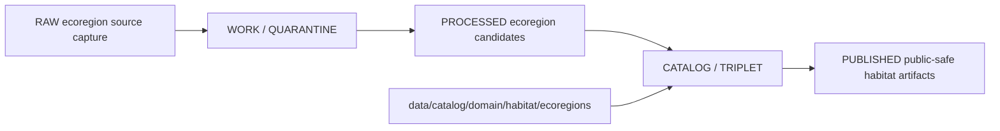

<!-- [KFM_META_BLOCK_V2]
doc_id: kfm://doc/data-catalog-domain-habitat-ecoregions-readme
title: data/catalog/domain/habitat/ecoregions/README.md — Habitat Ecoregions Domain Catalog README
version: v0.1
type: readme; data-lifecycle-sublane; domain-catalog-sublane-guide
status: draft; PROPOSED; data-root; catalog-stage; habitat; ecoregions; release-gated; public-safe-context
owners: OWNER_TBD — Habitat steward · Ecoregions steward · Data steward · Catalog steward · Evidence steward · Policy steward · Release steward · Spatial Foundation reviewer · Docs steward
created: NEEDS VERIFICATION — blank placeholder existed before v0.1 expansion
updated: 2026-06-24
policy_label: public-doc; data; catalog; habitat; ecoregions; lifecycle; release-gated; public-safe-context
tags: [kfm, data, catalog, habitat, ecoregions, domain-catalog, CATALOG, TRIPLET, EcoregionFramework, EcoregionSnapshot, EcoregionContextJoin, EvidenceBundle, SourceDescriptor, ReleaseManifest]
related:
  - ../../../README.md
  - ../../../../README.md
  - ../../../../../docs/domains/habitat/DATA_LIFECYCLE.md
  - ../../../../../docs/domains/habitat/sublanes/ecoregions.md
  - ../../../../../contracts/domains/habitat/ecoregions/README.md
  - ../../../../../pipelines/domains/habitat/ecoregions/README.md
  - ../../../../../pipeline_specs/habitat/ecoregions/README.md
  - ../../../../../schemas/contracts/v1/domains/habitat/ecoregions/
  - ../../../../../policy/domains/habitat/
  - ../../../../../policy/sensitivity/habitat/
  - ../../../../../data/proofs/
  - ../../../../../data/receipts/
  - ../../../../../release/
notes:
  - "This file replaces a blank placeholder at `data/catalog/domain/habitat/ecoregions/README.md`."
  - "Habitat lifecycle docs identify `data/catalog/domain/habitat/` as the Habitat catalog lane shape under `data/`."
  - "Ecoregions are regionalization context: they classify places by source framework/version and do not prove species presence, rare-plant presence, habitat-patch quality, or release approval."
  - "This folder is a CATALOG-stage domain catalog sublane; it is not RAW, WORK, QUARANTINE, PROCESSED, PUBLISHED, proof storage, release authority, schema authority, policy code, or implementation code."
  - "Rollback target for this replacement is previous blank blob SHA `8b137891791fe96927ad78e64b0aad7bded08bdc`."
[/KFM_META_BLOCK_V2] -->

# data/catalog/domain/habitat/ecoregions

> Habitat ecoregions domain-catalog sublane for governed regionalization-context catalog records inside the `CATALOG / TRIPLET` lifecycle stage.

  
  
  
  
  
  
  

**Status:** draft / PROPOSED  
**Path:** `data/catalog/domain/habitat/ecoregions/README.md`  
**Owning root:** `data/catalog/domain/habitat/`  
**Sublane:** `ecoregions`  
**Lifecycle stage:** `CATALOG / TRIPLET`  
**Exposure posture:** release-gated; public records must use approved public-safe representation  
**Truth posture:** CONFIRMED target was blank · CONFIRMED parent catalog lane is RELEASED ONLY for public exposure · CONFIRMED Habitat lifecycle docs identify `data/catalog/domain/habitat/` as the Habitat catalog lane shape · CONFIRMED ecoregions sublane docs define ecoregions as regionalization context, not occurrence/species truth · CONFIRMED ecoregions contracts keep schemas, policy, source registry, lifecycle data, and release decisions separate · NEEDS VERIFICATION for catalog inventory, schemas, validators, policy gates, receipts, release manifests, access controls, and route behavior.

**Quick jumps:** [Purpose](#purpose) · [Lifecycle boundary](#lifecycle-boundary) · [Repo fit](#repo-fit) · [Accepted contents](#accepted-contents) · [Exclusions](#exclusions) · [Catalog requirements](#catalog-requirements) · [Context and sensitivity guardrails](#context-and-sensitivity-guardrails) · [Evidence ledger](#evidence-ledger) · [Validation checklist](#validation-checklist) · [Rollback](#rollback)

---

## Purpose

`data/catalog/domain/habitat/ecoregions/` stores or stages Habitat ecoregion catalog records and indexes that describe source-versioned ecoregion frameworks, snapshots, levels, context joins, public-safe layer references, source/evidence pointers, receipts, and release state.

A catalog record in this sublane supports discovery, steward review, context joins, catalog closure, and release preparation. It does **not** make an occurrence claim true, prove species presence, prove rare-plant presence, define habitat-patch quality, or approve public release by itself.

## Lifecycle boundary

`data/catalog/domain/habitat/ecoregions/` is a CATALOG-stage sublane. Public exposure applies only to records tied to approved release state, governed route, evidence support, source-role support, policy posture, and required receipts.

## Repo fit

| Responsibility | Correct home | Rule |
|---|---|---|
| Habitat ecoregion catalog records | `data/catalog/domain/habitat/ecoregions/` | This lane. |
| Parent Habitat domain catalog | `data/catalog/domain/habitat/` | Domain-level Habitat catalog grouping. |
| Parent catalog stage | `data/catalog/` | Parent CATALOG-stage lane. |
| Ecoregion semantic meaning | `contracts/domains/habitat/ecoregions/` | Semantic contracts, not catalog data. |
| Ecoregion schemas | `schemas/contracts/v1/domains/habitat/ecoregions/` | Separate schema root; status NEEDS VERIFICATION. |
| Ecoregion pipelines | `pipelines/domains/habitat/ecoregions/` | Executable pipeline logic. |
| Ecoregion pipeline specs | `pipeline_specs/habitat/ecoregions/` | Declarative pipeline specs. |
| Evidence/proof records | `data/proofs/` | EvidenceBundle and proof records. |
| Receipts | `data/receipts/` | CatalogBuildReceipt, validation, policy, review, transform, correction receipts. |
| Release decisions | `release/` | Publication authority. |

## Accepted contents

| Content | Purpose |
|---|---|
| Ecoregion catalog indexes | Group-level indexes for ecoregion catalog records. |
| EcoregionFramework catalog entries | Catalog records for classification authority and version. |
| EcoregionSnapshot catalog entries | Frozen source/version/level/extent records with source and evidence pointers. |
| EcoregionLevel catalog entries | Hierarchy-level records and parent/child references. |
| EcoregionContextJoin catalog entries | Governed join metadata where ecoregions provide context to other lanes. |
| Public-safe layer references | Pointers to release-approved public-safe layer products. |
| Evidence and source pointers | References to EvidenceBundle, SourceDescriptor, receipts, and validation reports. |
| Catalog quality summaries | Summaries that point to validation reports and receipts. |

## Exclusions

| Do not put here | Correct home |
|---|---|
| RAW habitat source files | `data/raw/habitat/` |
| WORK/intermediate data | `data/work/habitat/` |
| Quarantined data | `data/quarantine/habitat/` |
| Processed ecoregion datasets | `data/processed/habitat/` |
| Semantic contracts | `contracts/domains/habitat/ecoregions/` |
| Schemas | `schemas/contracts/v1/domains/habitat/ecoregions/` |
| Policy rules | `policy/domains/habitat/`, `policy/sensitivity/habitat/` |
| SourceDescriptor records | `data/registry/sources/habitat/` |
| Triplets/graph edges | `data/triplets/.../habitat/` |
| EvidenceBundle/proof records | `data/proofs/` |
| Receipts | `data/receipts/` |
| Release decisions | `release/` |
| Published public products | `data/published/layers/habitat/` |
| Validators/tests/code | `tools/validators/`, `tests/`, implementation roots |

## Catalog requirements

PROPOSED until schemas, validators, and inventory are verified:

| Requirement | Meaning |
|---|---|
| Stable catalog identity | Record has a stable identity linked to source, evidence, derivative, or release object. |
| Framework and version | Record identifies the ecoregion framework, source authority, source version, and hierarchy level. |
| Evidence reference | Record points to EvidenceBundle/proof context when claims depend on evidence. |
| Source reference | Record points to SourceDescriptor/source registry where source role matters. |
| Join posture | Cross-lane joins declare whether ecoregions are context, authority, model input, or release-linked derivative. |
| Sensitivity decision | Record links to sensitivity classification, rights, geometry posture, and obligations when material. |
| Release reference | Public or release-linked records point to ReleaseManifest and rollback target. |
| Closure compatibility | Habitat ecoregions domain catalog, STAC, DCAT, and PROV agreement holds where those projections exist. |

## Context and sensitivity guardrails

- Ecoregion catalog records are regionalization-context carriers, not occurrence truth.
- Ecoregions classify places by a named framework and version; they do not prove species presence, rare-plant presence, habitat-patch quality, regulatory status, hydrology truth, soil truth, hazard truth, agriculture truth, or land/title truth.
- Cross-lane joins to Fauna, Flora, Hydrology, Soil, Hazards, Agriculture, Archaeology, or People/Land must preserve owning-lane truth and sensitivity posture.
- Joins that touch sensitive occurrence or rare-plant material require policy-approved transform and review state before public use.
- Public derivatives should use attribute include-lists, generalization/redaction where needed, and receipt-backed release linkage.
- Unreleased ecoregion catalog records are not public merely because they exist under this directory.

## Evidence ledger

| Source | Status | Supports | Limits |
|---|---|---|---|
| `data/catalog/domain/habitat/ecoregions/README.md` previous file | CONFIRMED | Target existed as a blank placeholder. | Did not define lane boundaries. |
| `data/catalog/README.md` | CONFIRMED | Parent catalog lane, domain catalog layout, RELEASED ONLY public posture. | Does not prove ecoregions catalog inventory. |
| `docs/domains/habitat/DATA_LIFECYCLE.md` | CONFIRMED doctrine / PROPOSED lane application | Habitat lifecycle, catalog path shape, trust membrane, watcher posture. | Many exact files, validators, and route names remain NEEDS VERIFICATION. |
| `docs/domains/habitat/sublanes/ecoregions.md` | CONFIRMED doctrine / PROPOSED implementation | Ecoregions as regionalization context and cross-lane join posture. | Does not prove data catalog inventory or release state. |
| `contracts/domains/habitat/ecoregions/README.md` | CONFIRMED contract-lane evidence | Ecoregion semantic-contract lane and exclusions from lifecycle data, policy, release, source registry, and schemas. | Contract lane does not prove catalog data exists. |

## Validation checklist

- [ ] Confirm actual child files and ecoregion catalog inventory under this lane.
- [ ] Confirm ecoregion domain catalog schema/profile location.
- [ ] Confirm access policy, validators, and CI checks.
- [ ] Confirm SourceDescriptor, EvidenceBundle, RunReceipt, ValidationReport, PolicyDecision, ReviewRecord, transform receipt, and ReleaseManifest references.
- [ ] Confirm framework/version/level identity and parent-child hierarchy behavior.
- [ ] Confirm cross-lane joins preserve owning-lane truth and sensitivity posture.
- [ ] Confirm domain/STAC/DCAT/PROV catalog closure where those projections exist.
- [ ] Confirm correction, withdrawal, supersession, and rollback behavior for stale or failed records.

## Rollback

Rollback is required if this lane becomes a Habitat raw-data root, work area, quarantine store, processed-data store, semantic-contract root, proof store, source-registry root, release-decision root, published-output root, schema root, policy root, validator root, implementation root, or public exposure shortcut.

Rollback target for this replacement: previous blank blob SHA `8b137891791fe96927ad78e64b0aad7bded08bdc`.

<a href="#top">Back to top</a>

