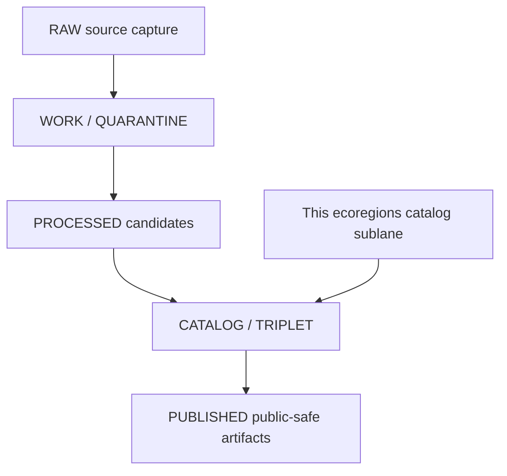

<!-- [KFM_META_BLOCK_V2]
doc_id: kfm://doc/data-catalog-domain-habitat-ecoregions-readme
title: data/catalog/domain/habitat/ecoregions/README.md - Habitat Ecoregions Domain Catalog README
version: v0.2.0
type: readme; data-lifecycle-sublane; domain-catalog-sublane-guide
status: draft; PROPOSED; data-root; catalog-stage; habitat; ecoregions; no-active-catalog-inventory; release-gated; public-safe-context
owners: OWNER_TBD - semantic stewardship roles are not assigned; GitHub review routing is defined separately in .github/CODEOWNERS
created: NEEDS VERIFICATION - a blank placeholder existed before the v0.1 expansion
updated: 2026-07-25
policy_label: public-doc; data; catalog; habitat; ecoregions; lifecycle; release-gated; public-safe-context
tags: [kfm, data, catalog, habitat, ecoregions, domain-catalog, CATALOG, TRIPLET, EcoregionFramework, EcoregionSnapshot, EcoregionContextJoin, EvidenceBundle, SourceDescriptor, ReleaseManifest]
related:
  - ../README.md
  - ../../README.md
  - ../../../README.md
  - ../../../../README.md
  - ../../../../../docs/doctrine/directory-rules.md
  - ../../../../../docs/domains/habitat/DATA_LIFECYCLE.md
  - ../../../../../docs/domains/habitat/sublanes/ecoregions.md
  - ../../../../../contracts/domains/habitat/ecoregions/README.md
  - ../../../../../schemas/contracts/v1/domains/habitat/ecoregions/README.md
  - ../../../../../pipeline_specs/habitat/ecoregions/README.md
  - ../../../../../pipelines/domains/habitat/ecoregions/README.md
  - ../../../../../policy/domains/habitat/README.md
  - ../../../../../data/registry/sources/habitat/ecoregions/README.md
  - ../../../../../fixtures/domains/habitat/ecoregions/README.md
  - ../../../../../tests/domains/habitat/ecoregions/README.md
  - ../../../../../release/candidates/habitat/ecoregions/README.md
  - ../../../../../data/published/layers/habitat/ecoregions/README.md
notes:
  - "The v0.1 document expanded an earlier blank placeholder without activating a catalog, source, pipeline, release, or publication path."
  - "The v0.2 evidence baseline is main@b000b3a1a17bc61b0f92712117e3826397cc986a; the target blob at that revision is ee359d55052a2023fa97e3dbf362094cb5a616ff."
  - "No active ecoregion catalog inventory, concrete semantic contract, concrete schema, active pipeline specification, executable ecoregion validator, emitted ecoregion receipt or proof, active release candidate, or published artifact was established by the bounded evidence inspected for v0.2."
  - "Ecoregions are source-versioned regionalization context. They do not prove species or rare-plant presence, HabitatPatch quality, regulatory critical habitat, hydrology, soil, hazards, agriculture, land or title, or release approval."
  - "The historical rollback target for the original v0.1 expansion was blank blob 8b137891791fe96927ad78e64b0aad7bded08bdc. The v0.2 operational rollback target is the v0.1 blob recorded above."
[/KFM_META_BLOCK_V2] -->

# data/catalog/domain/habitat/ecoregions

Governed catalog metadata for source-versioned Habitat ecoregion context - not species-occurrence truth, release authority, or a public data surface.

> [!IMPORTANT]
> **No active catalog or public release is established here.** This README defines a fail-closed catalog boundary. The inspected repository evidence remains documentation-heavy and does not establish ecoregion catalog payloads, an accepted validator command, an active candidate, or a released artifact.

**Quick navigation:** [Purpose](#purpose) · [Status](#status-and-evidence-boundary) · [Lifecycle](#lifecycle-and-authority-boundary) · [Accepted contents](#what-belongs-here) · [Exclusions](#what-does-not-belong-here) · [Record expectations](#minimum-catalog-record-expectations) · [Anti-collapse](#ecoregion-anti-collapse-rules) · [Public safety](#public-safety-rights-and-sensitive-joins) · [Promotion gates](#catalog-closure-and-promotion-gates) · [Validation](#validation) · [Evidence](#evidence-basis) · [Backlog](#verification-backlog) · [Rollback](#rollback)

---

## Purpose

`data/catalog/domain/habitat/ecoregions/` is the Habitat ecoregions sublane inside the `CATALOG / TRIPLET` lifecycle stage. Its bounded role is to carry or index governed catalog metadata for named ecoregion frameworks, versions, hierarchy levels, snapshots, crosswalks, context joins, evidence and source references, validation state, and release-linked public-safe derivatives.

A catalog record may support discovery, comparison, steward review, catalog closure, correction tracing, and release preparation. It does **not** make an ecoregion claim true, upgrade a source role, admit a source, validate geometry, resolve rights, approve a sensitive join, authorize release, or make an artifact public.

## Status and evidence boundary

The following table records the bounded repository state inspected for this revision. It is not a claim about ignored files, external systems, restricted stores, local-only artifacts, or future branches.

| Surface | Bounded status | What that means |
|---|---|---|
| Target path | **CONFIRMED** at `main@b000b3a1a17bc61b0f92712117e3826397cc986a` | This nested catalog README exists at the canonical `data/` responsibility root and `catalog` lifecycle segment. |
| Direct catalog payload inventory | **UNKNOWN / not established** | No payload inventory was established by the inspected evidence. Absence is not asserted without a recursive inventory. |
| Semantic contracts | **PROPOSED** | The contract lane is README-only and lists candidate contract names; no concrete ecoregion contract file is established. |
| Machine schemas | **PROPOSED / NEEDS VERIFICATION** | The schema lane has an index README, but no concrete ecoregion schema inventory is confirmed. |
| Source admission | **UNKNOWN** | The source-registry README defines the boundary; concrete admitted `SourceDescriptor` records and activation decisions were not established. |
| Pipeline specification | **INACTIVE** | The direct specification lane is README-only and explicitly states that no active specification is established. |
| Tests and fixtures | **DOCUMENTATION-BACKED** | The direct test and fixture lanes contain READMEs; executable tests and fixture payloads were not established by their inspected evidence. |
| Validator | **NOT ESTABLISHED** | No accepted ecoregion validator child or command is established. The Habitat workflow is an explicit readiness hold. |
| Receipts and proofs | **UNKNOWN / not established** | Habitat parent lanes exist, but no ecoregion receipt child or emitted ecoregion proof inventory was verified. |
| Release candidate | **`NO_ACTIVE_CANDIDATE`** | The release-candidate lane reports no established child dossier. |
| Published artifact | **NOT ESTABLISHED** | The published-layer lane is guidance; no emitted release-linked artifact surfaced in its bounded evidence. |
| Public readiness | **DENY BY DEFAULT** | Public clients must use governed interfaces and released public-safe artifacts, never this catalog directory directly. |

**GitHub review routing:** [`.github/CODEOWNERS`](../../../../../.github/CODEOWNERS) routes repository review to `@bartytime4life`. That routing is not a Habitat stewardship assignment, `ReviewRecord`, `PolicyDecision`, release approval, or proof that review occurred.

## Lifecycle and authority boundary

```mermaid
flowchart TD
  RAW["RAW source capture"] --> HOLD["WORK / QUARANTINE"]
  HOLD --> PROCESSED["PROCESSED candidates"]
  PROCESSED --> CATALOG["CATALOG / TRIPLET"]
  CATALOG --> PUBLISHED["PUBLISHED public-safe artifacts"]
  LANE["This ecoregions catalog sublane"] --> CATALOG
```

This directory owns only the ecoregions portion of the **catalog** stage. Promotion remains a governed state transition requiring the applicable evidence, source, rights, sensitivity, validation, policy, review, receipt, release, correction, and rollback support.

| Authority question | Owning surface |
|---|---|
| What an ecoregion object or relationship means | [`contracts/domains/habitat/ecoregions/`](../../../../../contracts/domains/habitat/ecoregions/README.md) |
| What machine shape is accepted | [`schemas/contracts/v1/domains/habitat/ecoregions/`](../../../../../schemas/contracts/v1/domains/habitat/ecoregions/README.md) |
| Which source is admitted and in what role | [`data/registry/sources/habitat/ecoregions/`](../../../../../data/registry/sources/habitat/ecoregions/README.md) |
| How executable transformation would run | [`pipelines/domains/habitat/ecoregions/`](../../../../../pipelines/domains/habitat/ecoregions/README.md) |
| What declarative pipeline profile would be active | [`pipeline_specs/habitat/ecoregions/`](../../../../../pipeline_specs/habitat/ecoregions/README.md) |
| What policy allows, restricts, holds, abstains, or denies | [`policy/domains/habitat/`](../../../../../policy/domains/habitat/README.md) and the applicable cross-domain policy surfaces |
| Whether a candidate may be released | [`release/candidates/habitat/ecoregions/`](../../../../../release/candidates/habitat/ecoregions/README.md) and accepted release records |
| Which artifact public consumers may read | [`data/published/layers/habitat/ecoregions/`](../../../../../data/published/layers/habitat/ecoregions/README.md) through governed interfaces |

Catalog metadata is not canonical domain truth, a proof object, a policy decision, a release decision, or a published artifact.

## What belongs here

Only catalog-stage metadata that preserves responsibility boundaries belongs here. The names below are **PROPOSED record kinds**, not proof of current files or accepted schema fields.

| Proposed catalog record kind | Bounded catalog role |
|---|---|
| `EcoregionFramework` entry | Identifies a named classification framework, native vocabulary, source version, source reference, and authority limit. |
| `EcoregionSnapshot` entry | Identifies a frozen framework x version x level x extent snapshot and its temporal, spatial, evidence, and integrity references. |
| `EcoregionLevel` entry | Records hierarchy-level identity and parent/child relationships without equating unlike frameworks or levels. |
| Ecoregion crosswalk entry | Points to a reviewed crosswalk, source and target versions, method, known loss, evidence, and rollback target. |
| `EcoregionContextJoin` entry | Describes a governed contextual join while preserving the joined domain's truth and sensitivity authority. |
| Public-safe layer reference | Points to a release-approved derivative, manifest, include-list, proof closure, correction path, and rollback target. |
| Catalog quality summary | Summarizes validation state while resolving to the underlying report, receipt, evidence, and applicable release record. |
| Sublane index | Supports discovery without copying semantic, schema, policy, registry, proof, receipt, or release authority into the catalog. |

## What does not belong here

| Material or authority | Correct home |
|---|---|
| RAW source payloads | `data/raw/habitat/` under an admitted source/run identity |
| WORK intermediates | `data/work/habitat/` |
| Quarantined or unresolved material | [`data/quarantine/habitat/ecoregions/`](../../../../quarantine/habitat/ecoregions/README.md) |
| Processed ecoregion candidates | [`data/processed/habitat/ecoregions/`](../../../../processed/habitat/ecoregions/README.md) |
| Semantic contracts | [`contracts/domains/habitat/ecoregions/`](../../../../../contracts/domains/habitat/ecoregions/README.md) |
| Machine schemas | [`schemas/contracts/v1/domains/habitat/ecoregions/`](../../../../../schemas/contracts/v1/domains/habitat/ecoregions/README.md) |
| Source descriptors or activation decisions | [`data/registry/sources/habitat/ecoregions/`](../../../../registry/sources/habitat/ecoregions/README.md) and the accepted activation authority |
| Policy rules or sensitivity decisions | [`policy/domains/habitat/`](../../../../../policy/domains/habitat/README.md) and applicable cross-domain policy lanes |
| Synthetic fixtures and executable tests | [`fixtures/domains/habitat/ecoregions/`](../../../../../fixtures/domains/habitat/ecoregions/README.md) and [`tests/domains/habitat/ecoregions/`](../../../../../tests/domains/habitat/ecoregions/README.md) |
| EvidenceBundle, proof, or validation-proof payloads | [`data/proofs/habitat/`](../../../../proofs/habitat/README.md) or the accepted proof family |
| Run, transform, validation, review, or release receipts | [`data/receipts/habitat/`](../../../../receipts/habitat/README.md) or the accepted receipt family |
| Release candidate dossiers and decisions | [`release/candidates/habitat/ecoregions/`](../../../../../release/candidates/habitat/ecoregions/README.md) and accepted release roots |
| Public PMTiles, GeoParquet, GeoJSON, API payloads, or exports | [`data/published/layers/habitat/ecoregions/`](../../../../published/layers/habitat/ecoregions/README.md) after governed release |
| Triplets or graph edges | `data/triplets/` under the accepted graph projection |
| Validator, pipeline, API, UI, or renderer code | The appropriate implementation root, never `data/catalog/` |

## Minimum catalog record expectations

These are documentation-level acceptance expectations, **not an accepted field schema**. Do not serialize the labels below as canonical fields until the paired contracts and schemas are accepted.

| Concern | Minimum expectation before reliance |
|---|---|
| Stable identity | Deterministic catalog identity bound to framework, native version, hierarchy level, extent/snapshot identity, and content digest where applicable. |
| Framework and hierarchy | Native framework name, version, level vocabulary, region code/label, parent/child constraints, and boundary lineage remain explicit. |
| Source and role | Resolving `SourceDescriptor`, accepted KFM source-role value, authority limit, activation state, rights, attribution, cadence, and source-head identity. |
| Temporal scope | Source, valid, retrieval, processing, release, correction, and supersession times remain distinct where material. |
| Spatial scope | Native CRS, processing/tiling transforms, extent, topology profile, scale/resolution support, uncertainty, and geometry representation are traceable. |
| Evidence | Consequential claims resolve through `EvidenceRef` to `EvidenceBundle`; a catalog summary never substitutes for the bundle. |
| Crosswalk | Source/target framework and versions, method, review state, known loss, evidence, correction behavior, and rollback target are recorded. |
| Context join | The joined lane remains the authority for its own truth; source role, sensitivity, reconstruction risk, and transform receipts remain visible. |
| Rights and sensitivity | Rights, redistribution, derivative-use, access class, field allowlist, geometry posture, and sensitive-join decision are resolved. |
| Validation | Contract/schema, identity, hierarchy, topology, spatial/temporal, evidence, policy, catalog-closure, and public-surface checks resolve to auditable reports or receipts. |
| Release linkage | Any public-facing reference resolves to an immutable artifact, release manifest/decision, review state, correction path, withdrawal path, and rollback target. |

**Source-role conflict:** The source registry uses the canonical roles `observed`, `regulatory`, `modeled`, `aggregate`, `administrative`, `candidate`, and `synthetic`. Older Habitat prose also uses terms such as `authority`, `context`, and `model`. That mapping remains **NEEDS VERIFICATION**; catalog records must not silently translate or upgrade those roles.

## Ecoregion anti-collapse rules

- An ecoregion is source-versioned regionalization context. It is not proof of animal occurrence, plant occurrence, rare-plant presence, HabitatPatch condition or quality, suitability, connectivity, restoration success, stewardship status, or regulatory critical habitat.
- Ecoregion identity does not replace Hydrology, Soil, Hazards, Agriculture, Archaeology, Spatial Foundation, People/Land, parcel, jurisdiction, or title authority.
- EPA/Omernik and USFS/Bailey are distinct external frameworks. No KFM default framework is established here, and no framework may be silently substituted for another.
- A hierarchy level is not interchangeable with another level. Level III and Level IV, for example, must retain their native identity and version.
- A crosswalk is advisory unless separately validated and reviewed. Its method, source versions, target versions, known loss, evidence, correction behavior, and rollback target must remain inspectable.
- WBD/HUC and PLSS context must retain Hydrology or administrative ownership; neither becomes ecoregion identity merely because Habitat consumes it.
- A map, tile, graph projection, index, summary, badge, or generated explanation is a derivative carrier. It does not become sovereign truth.
- Public clients and ordinary UI surfaces must not read this catalog directory directly.

## Public safety, rights, and sensitive joins

The Habitat sublane charter describes standalone ecoregion polygons as generally low-sensitivity regional context. That classification does **not** authorize publication: source rights, attribution, redistribution, evidence, current version, public fields, geometry representation, policy, review, release, correction, and rollback still must close.

> [!CAUTION]
> Sensitivity can rise through a join. Ecoregion attribution combined with Fauna, Flora, rare-species, archaeology, cultural, living-person, private-land, infrastructure, or other restricted material must fail closed until the applicable policy-approved transform and review state allow a public-safe result. Do not expose exact sensitive locations or operational geoprivacy parameters in catalog records, logs, tiles, exports, or documentation.

| Condition | Required posture |
|---|---|
| Rights, terms, attribution, redistribution, or derivative use is unresolved | Hold or deny public promotion. |
| Source role, native framework, version, level, or authority limit is unresolved | Quarantine or abstain; do not create an authoritative catalog claim. |
| `EvidenceRef` does not resolve or evidence scope is insufficient | Abstain or hold under the applicable contract. |
| Join may reveal or reconstruct sensitive detail | Deny by default until approved minimization/generalization, receipt, policy decision, and review close. |
| Public fields or geometry profile is not allowlisted | Deny the public derivative. |
| Review, release, correction, withdrawal, or rollback support is absent | Keep the record unreleased and unavailable to ordinary public clients. |

## Catalog closure and promotion gates

Existence in this directory closes none of the gates below.

| Gate | Required evidence or authority | Current bounded posture |
|---|---|---|
| Source admission | Resolving descriptor, canonical role, rights, cadence, version, checksum/source head, and activation decision | **UNKNOWN / not established** |
| Semantic meaning | Accepted ecoregion contracts and anti-collapse invariants | **PROPOSED candidates only** |
| Machine shape | Accepted schemas and compatibility/version rules | **Index only; concrete schemas unconfirmed** |
| Deterministic validation | Public-safe fixtures, executable tests/validator, finite outcomes, and validation receipts | **Not established** |
| Evidence closure | Resolving EvidenceBundle/proof support appropriate to each material claim | **Not established** |
| Policy and review | Applicable rights, sensitivity, source-role, public-field, geometry, and independent review decisions | **Not established** |
| Catalog closure | Domain/STAC/DCAT/PROV and triplet agreement where those projections exist | **NEEDS VERIFICATION** |
| Release decision | Candidate dossier, immutable artifact pointer, manifests, proof/receipt closure, correction, withdrawal, and rollback | **`NO_ACTIVE_CANDIDATE`** |
| Public delivery | Released public-safe artifact through governed interfaces | **Not established** |

Use the outcome vocabulary defined by the applicable contract or policy surface. This README does not create a universal `ALLOW`, `HOLD`, `ABSTAIN`, `DENY`, `FAIL`, or `ERROR` enum.

## Validation

No accepted ecoregion catalog validator command was verified for this revision. The [Habitat workflow](../../../../../.github/workflows/domain-habitat.yml) defines explicit validation, proof, and release-dry-run readiness holds; a green held result is not Habitat truth, evidence closure, policy approval, release readiness, or publication.

Before treating this lane as implementation-bearing, verify:

- [ ] Recursively inventory direct catalog records and distinguish payloads, indexes, generated files, and documentation.
- [ ] Confirm accepted semantic contracts, schemas, schema registry records, and compatibility/version behavior.
- [ ] Confirm admitted source descriptors, activation decisions, canonical source-role mapping, rights, cadence, and source versions.
- [ ] Add deterministic no-network, synthetic, public-safe fixtures and executable positive and negative tests.
- [ ] Establish the accepted validator command and finite outcomes.
- [ ] Validate framework/version/level identity, hierarchy, cycles/orphans, topology, CRS, boundary lineage, and temporal scope.
- [ ] Validate crosswalk method and loss without collapsing frameworks or levels.
- [ ] Validate EvidenceRef resolution, source/evidence scope, rights, sensitivity, policy, review, and reconstruction risk.
- [ ] Validate public field allowlists, geometry representation, release linkage, correction, withdrawal, supersession, and rollback.
- [ ] Confirm domain/STAC/DCAT/PROV and triplet closure only for projections that actually exist.
- [ ] Confirm governed API access and deny direct catalog-store access from ordinary public clients.

Passing Markdown, link, schema-shape, topology, or rendering checks proves only the declared check. It does not prove the ecoregion framework is authoritative for a claim, current, rights-cleared, evidence-supported, safe after a join, policy-admitted, reviewed, released, or public.

## Maintenance, review, and correction

Review this README when any of the following changes:

- direct catalog inventory or generator behavior;
- accepted ecoregion contracts, schemas, source-role mapping, or catalog profiles;
- source framework, native version, hierarchy, rights, terms, cadence, or activation state;
- validation commands, fixtures, tests, workflow posture, or finite outcomes;
- public attribute allowlists, geometry transforms, sensitive-join policy, or governed API behavior;
- candidate, release, correction, withdrawal, supersession, or rollback state.

A correction must identify affected processed candidates, catalog records, triplets, evidence/proofs, receipts, candidate dossiers, release manifests, published artifacts, registries, caches, APIs, indexes, maps, and generated summaries. Preserve lineage; do not silently rewrite a framework, level, boundary version, crosswalk, or public alias.

## Evidence basis

| Evidence | What it supports | Limit |
|---|---|---|
| [Directory Rules v1.4](../../../../../docs/doctrine/directory-rules.md) | `data/` owns lifecycle material; `catalog` is an explicit phase; domains are nested lanes; release decisions stay under `release/`. | Placement doctrine does not prove catalog inventory or implementation. |
| [`data/catalog/README.md`](../../../README.md) | Parent catalog authority, deny-by-default public readiness, bounded child-lane posture, and catalog-closure expectations. | Recursive payload inventory and active consumers remain unknown. |
| [Habitat data lifecycle](../../../../../docs/domains/habitat/DATA_LIFECYCLE.md) | Habitat trust membrane, lifecycle placement, source/evidence/policy/release separation, and public-interface boundary. | Many implementation details remain proposed. |
| [Habitat ecoregions charter](../../../../../docs/domains/habitat/sublanes/ecoregions.md) | Regionalization-context meaning, framework/version/hierarchy discipline, cross-lane ownership, rights, sensitivity, and release posture. | Draft doctrine and planned surfaces do not prove active files or routes. |
| [Ecoregions source registry README](../../../../../data/registry/sources/habitat/ecoregions/README.md) | Canonical source-role vocabulary, source boundary, crosswalk loss, and fail-closed sensitive joins. | Concrete admitted descriptors and activation decisions remain unknown. |
| [Ecoregions contract README](../../../../../contracts/domains/habitat/ecoregions/README.md) | Contract/data/schema/policy/release separation and proposed semantic families. | Direct contract inventory is README-only. |
| [Ecoregions schema README](../../../../../schemas/contracts/v1/domains/habitat/ecoregions/README.md) | Proposed machine-shape home and candidate schema scope. | No concrete accepted schema inventory is confirmed. |
| [Ecoregions pipeline specification README](../../../../../pipeline_specs/habitat/ecoregions/README.md) | Inactive, README-only specification posture and activation prerequisites. | No active parser, registry, scheduler, consumer, or activation record is established. |
| [Tests](../../../../../tests/domains/habitat/ecoregions/README.md) and [fixtures](../../../../../fixtures/domains/habitat/ecoregions/README.md) READMEs | Intended no-network, synthetic, public-safe validation posture. | Executable modules and fixture payloads are not established. |
| [Ecoregions release-candidate README](../../../../../release/candidates/habitat/ecoregions/README.md) | `NO_ACTIVE_CANDIDATE`, current maturity limits, review gates, correction, and rollback expectations. | Bounded indexed evidence does not prove absence outside inspected surfaces. |
| [Habitat workflow](../../../../../.github/workflows/domain-habitat.yml) | Explicit readiness-hold semantics for validation, proofs, and release dry runs. | Workflow definition is not observed execution evidence for this revision. |

## Verification backlog

| Priority | Verification item | Closure evidence |
|---|---|---|
| P0 | Direct catalog inventory and generator/source-of-truth relationship | Recursive inventory, generator declaration, hashes, and owner-reviewed result |
| P0 | Source admission, canonical role mapping, rights, version, and activation | Accepted `SourceDescriptor` records and activation decisions |
| P0 | Concrete contracts and schemas | Reviewed semantic contracts, machine schemas, registry entries, compatibility rules, and fixtures |
| P0 | Deterministic validator and tests | Accepted command, synthetic no-network fixtures, positive/negative cases, and observed CI result |
| P0 | Sensitive-join and public-field policy | Policy decisions, allowlists, transform receipts, reconstruction-risk checks, and review records |
| P1 | Catalog and triplet closure | Emitted records plus deterministic domain/STAC/DCAT/PROV/triplet agreement checks where applicable |
| P1 | Evidence, receipt, and proof closure | Resolving EvidenceBundle, validation reports, receipts, proofs, and integrity references |
| P1 | Candidate and release readiness | Candidate dossier, immutable artifacts, manifests, independent review, correction, withdrawal, and rollback |
| P1 | Governed public delivery | Released public-safe artifact, governed API route, access controls, and negative-state tests |

## Rollback

This v0.2 change is documentation-only. It does not activate a source, parser, pipeline, validator, catalog, release candidate, public route, or publication path.

- **Pre-merge:** leave or close the draft PR and abandon the review branch; no KFM data or release state changes.
- **Post-merge documentation rollback:** use a transparent revert to the v0.1 target blob `ee359d55052a2023fa97e3dbf362094cb5a616ff`.
- **Do not** restore the original blank placeholder as an ordinary rollback; blank blob `8b137891791fe96927ad78e64b0aad7bded08bdc` is historical lineage only.
- Correct forward instead of reverting when a source, schema, policy, evidence, candidate, or release state changed after v0.2, so current governance is not erased.

Rollback or correction review is required if this README implies catalog payloads exist without evidence, collapses source roles or frameworks, treats ecoregions as occurrence/regulatory truth, weakens sensitive-join controls, moves authority into `data/catalog/`, permits direct public reads, or claims release/publication without governed proof.

<a href="#top">Back to top</a>

