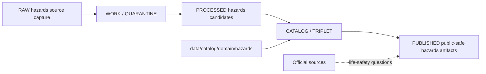

<!-- [KFM_META_BLOCK_V2]
doc_id: kfm://doc/data-catalog-domain-hazards-readme
title: data/catalog/domain/hazards/README.md — Hazards Domain Catalog README
version: v0.1
type: readme; data-lifecycle-sublane; domain-catalog-guide
status: draft; PROPOSED; data-root; catalog-stage; hazards; release-gated; not-life-safety-authority
owners: OWNER_TBD — Hazards steward · Data steward · Catalog steward · Evidence steward · Policy steward · Release steward · Schema steward · Docs steward
created: NEEDS VERIFICATION — blank placeholder existed before v0.1 expansion
updated: 2026-06-25
policy_label: public-doc; data; catalog; hazards; lifecycle; release-gated; not-life-safety-authority
tags: [kfm, data, catalog, hazards, domain-catalog, CATALOG, TRIPLET, EvidenceBundle, SourceDescriptor, ReleaseManifest, CatalogBuildReceipt, not-for-life-safety]
related:
  - ../../README.md
  - ../../../README.md
  - ../../../../docs/domains/hazards/ARCHITECTURE.md
  - ../../../../docs/domains/hazards/DATA_LIFECYCLE.md
  - ../../../../docs/domains/hazards/EXPANSION_PLAN.md
  - ../../../../docs/domains/hazards/EXPANSION_BACKLOG.md
  - ../../../../contracts/domains/hazards/
  - ../../../../schemas/contracts/v1/domains/hazards/
  - ../../../../policy/domains/hazards/
  - ../../../../data/proofs/
  - ../../../../data/receipts/
  - ../../../../release/
notes:
  - "This file replaces a blank placeholder at `data/catalog/domain/hazards/README.md`."
  - "Hazards architecture defines the lane as historical, regulatory, modeled, and operational-context hazard information for analysis and resilience, not emergency alerting."
  - "Hazards lifecycle docs keep warnings, advisories, and watches as context only and route life-safety action to official sources."
  - "This folder is a CATALOG-stage domain catalog lane; it is not RAW, WORK, QUARANTINE, PROCESSED, PUBLISHED, proof storage, release authority, schema authority, policy code, implementation code, or an alerting surface."
  - "Rollback target for this replacement is previous blank blob SHA `8b137891791fe96927ad78e64b0aad7bded08bdc`."
[/KFM_META_BLOCK_V2] -->

# data/catalog/domain/hazards

> Hazards-domain catalog lane for governed catalog records and indexes inside the `CATALOG / TRIPLET` lifecycle stage.

  
  
  
  
  
  

**Status:** draft / PROPOSED  
**Path:** `data/catalog/domain/hazards/README.md`  
**Owning root:** `data/catalog/domain/`  
**Domain segment:** `hazards`  
**Lifecycle stage:** `CATALOG / TRIPLET`  
**Exposure posture:** release-gated; public records must use approved public-safe representation and official-source context where applicable  
**Truth posture:** CONFIRMED target was blank · CONFIRMED parent catalog lane is RELEASED ONLY for public exposure · CONFIRMED Hazards architecture defines the lane as historical/regulatory/modeled/operational context for analysis and resilience · CONFIRMED Hazards lifecycle docs define warnings/advisories/watches as context only and not life-safety authority · NEEDS VERIFICATION for catalog inventory, schemas, validators, policy gates, receipts, release manifests, access controls, and route behavior.

**Quick jumps:** [Purpose](#purpose) · [Lifecycle boundary](#lifecycle-boundary) · [Repo fit](#repo-fit) · [Accepted contents](#accepted-contents) · [Exclusions](#exclusions) · [Catalog requirements](#catalog-requirements) · [Hazards guardrails](#hazards-guardrails) · [Evidence ledger](#evidence-ledger) · [Validation checklist](#validation-checklist) · [Rollback](#rollback)

---

## Purpose

`data/catalog/domain/hazards/` stores or stages Hazards-domain catalog records and indexes that connect hazard event records, regulatory context, scientific observations, remote-sensing detections, modeled derivatives, administrative declarations, exposure summaries, resilience timelines, evidence references, source roles, freshness state, receipts, and release state.

A domain catalog record supports discovery, steward review, catalog closure, and release preparation. It does **not** make a Hazards claim true, public, policy-admitted, evidence-supported, regulatory-authoritative, life-safety-authoritative, or released by itself.

## Lifecycle boundary

`data/catalog/domain/hazards/` is a CATALOG-stage domain lane. Public exposure applies only to records tied to approved release state, governed route, evidence support, source-role support, freshness posture, policy posture, and required receipts.

## Repo fit

| Responsibility | Correct home | Rule |
|---|---|---|
| Hazards domain catalog records | `data/catalog/domain/hazards/` | This lane. |
| Parent catalog stage | `data/catalog/` | Parent CATALOG-stage lane. |
| Hazards STAC records | `data/catalog/stac/hazards/` | Spatiotemporal catalog records, if accepted. |
| Hazards DCAT records | `data/catalog/dcat/hazards/` | Dataset/distribution catalog records, if accepted. |
| Hazards PROV records | `data/catalog/prov/hazards/` | Provenance catalog projection, if accepted. |
| Hazards graph/triplet projections | `data/triplets/.../hazards/` | Paired graph stage. |
| Hazards proof/evidence | `data/proofs/` or accepted proof roots | EvidenceBundle and ProofPack. |
| Hazards receipts | `data/receipts/` or accepted receipt roots | CatalogBuildReceipt, RunReceipt, validation, policy, freshness, review, and correction receipts. |
| Hazards release decisions | `release/` | Publication authority. |
| Hazards schemas and policy | `schemas/contracts/v1/domains/hazards/`, `policy/domains/hazards/` | Separate roots; path status remains PROPOSED/NEEDS VERIFICATION. |

## Accepted contents

| Content | Purpose |
|---|---|
| Hazards domain catalog indexes | Group-level indexes for Hazards catalog records. |
| Historical-event catalog entries | Severe weather, flood, wildfire, earthquake, heat/cold, drought, hail/wind/tornado, and similar event records. |
| Regulatory-context catalog entries | FEMA NFHL and similar regulatory-context records with issuing authority and effective time. |
| Operational-context catalog entries | Warning/advisory/watch context records with source, issue time, expiry time, freshness, and official-source link. |
| Scientific-observation catalog entries | Instrumented or surveyed hazard observations with evidence and source links. |
| Remote-sensing detection catalog entries | Satellite/airborne candidate detections with source-role and uncertainty posture. |
| Modeled derivative and exposure catalog entries | Model outputs, exposure summaries, resilience analysis, and timeline products. |
| Evidence and source pointers | References to EvidenceBundle, SourceDescriptor, receipts, and validation reports. |
| Catalog quality summaries | Summaries that point to validation reports, freshness checks, and receipts. |

## Exclusions

| Do not put here | Correct home |
|---|---|
| RAW hazards source files | `data/raw/hazards/` |
| WORK/intermediate data | `data/work/hazards/` |
| Quarantined data | `data/quarantine/hazards/` |
| Processed datasets | `data/processed/hazards/` |
| STAC/DCAT/PROV records | `data/catalog/stac/hazards/`, `data/catalog/dcat/hazards/`, `data/catalog/prov/hazards/` if accepted |
| Triplets/graph edges | `data/triplets/.../hazards/` |
| EvidenceBundle/proof records | `data/proofs/` |
| Receipts | `data/receipts/` |
| Release decisions | `release/` |
| Published public products | `data/published/.../hazards/` |
| Schemas | `schemas/` |
| Policy rules | `policy/` |
| Validators/tests/code | `tools/validators/`, `tests/`, implementation roots |
| Emergency alerting or life-safety instruction | Official issuing authorities and their direct public channels |

## Catalog requirements

PROPOSED until schemas, validators, and inventory are verified:

| Requirement | Meaning |
|---|---|
| Stable catalog identity | Record has a stable identity linked to source, evidence, derivative, or release object. |
| Knowledge-character class | Record declares whether it is historical, regulatory, operational context, scientific observation, remote-sensing detection, model derivative, exposure summary, or declaration. |
| Evidence reference | Record points to EvidenceBundle/proof context when claims depend on evidence. |
| Source reference | Record points to SourceDescriptor/source catalog where source authority matters. |
| Freshness/expiry posture | Operational-context records carry issue time, expiry time, source identity, and freshness state. |
| Policy reference | Record links to policy posture when public display, sensitivity, freshness, or rights matter. |
| Release reference | Public or release-linked records point to ReleaseManifest and rollback target. |
| Closure compatibility | Hazards domain catalog, STAC, DCAT, and PROV agreement holds where those projections exist. |

## Hazards guardrails

- Hazards catalog records are catalog carriers, not source truth by themselves.
- Historical event, regulatory context, operational context, scientific observation, remote-sensing detection, model derivative, exposure summary, and declaration records must remain distinct.
- Warning, advisory, and watch records are context only; they are not KFM-issued alerts or life-safety instructions.
- Regulatory-context records cite issuing authorities; KFM does not make the legal determination by cataloging them.
- Real-time or low-latency public use requires freshness, expiry, source identity, official-source link, and policy gates; otherwise fail closed.
- Cross-lane joins to Hydrology, Atmosphere, Infrastructure, Roads, Geology, Soil, Agriculture, Archaeology, or People/Land must preserve owning-lane truth and sensitivity posture.
- Unreleased Hazards catalog records are not public merely because they exist under this directory.

## Evidence ledger

| Source | Status | Supports | Limits |
|---|---|---|---|
| `data/catalog/domain/hazards/README.md` previous file | CONFIRMED | Target existed as a blank placeholder. | Did not define lane boundaries. |
| `data/catalog/README.md` | CONFIRMED | Parent catalog lane, domain catalog layout, RELEASED ONLY public posture. | Does not prove Hazards catalog inventory. |
| `docs/domains/hazards/ARCHITECTURE.md` | CONFIRMED doctrine / PROPOSED implementation | Hazards scope, source roles, object families, life-safety boundary, placement pattern. | Does not prove catalog data, validators, or release state. |
| `docs/domains/hazards/DATA_LIFECYCLE.md` | CONFIRMED doctrine / PROPOSED lane application | Hazards lifecycle mission, context-only posture, CATALOG stage, official-source redirect. | Many exact files, validators, and route names remain NEEDS VERIFICATION. |

## Validation checklist

- [ ] Confirm actual child files and Hazards catalog inventory under this lane.
- [ ] Confirm Hazards domain catalog schema/profile location.
- [ ] Confirm access policy, validators, and CI checks.
- [ ] Confirm SourceDescriptor, EvidenceBundle, RunReceipt, ValidationReport, PolicyDecision, freshness receipt, review receipt, and ReleaseManifest references.
- [ ] Confirm knowledge-character separation for historical/regulatory/operational/scientific/remote-sensing/model/declaration records.
- [ ] Confirm expiry, freshness, official-source link, and not-for-life-safety posture for operational-context records.
- [ ] Confirm domain/STAC/DCAT/PROV catalog closure where those projections exist.
- [ ] Confirm correction, withdrawal, supersession, and rollback behavior for stale or failed records.

## Rollback

Rollback is required if this lane becomes a Hazards raw-data root, work area, quarantine store, processed-data store, proof store, release-decision root, published-output root, schema root, policy root, validator root, implementation root, emergency-alerting surface, life-safety instruction source, or public exposure shortcut.

Rollback target for this replacement: previous blank blob SHA `8b137891791fe96927ad78e64b0aad7bded08bdc`.

<a href="#top">Back to top</a>

