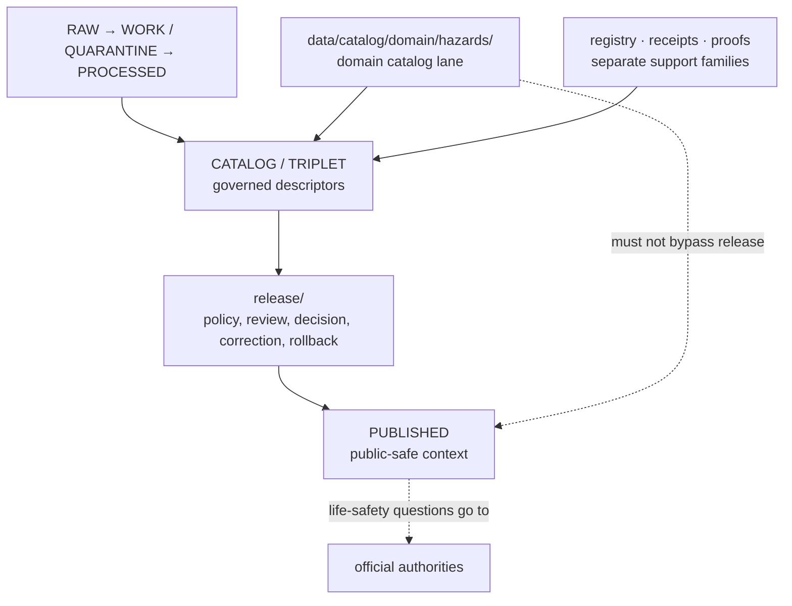

<!-- [KFM_META_BLOCK_V2]
doc_id: kfm://doc/data-catalog-domain-hazards-readme
title: data/catalog/domain/hazards/README.md — Governed Hazards Catalog Lane
version: v0.2.0
type: readme; data-lifecycle-sublane; domain-catalog-guide; release-gated; not-life-safety-authority
status: repository-grounded draft; canonical placement; proposed realization; catalog-stage; release-gated
owners: NEEDS VERIFICATION — Hazards, data, catalog, evidence, source, freshness, policy, release, correction, rollback, schema, and docs stewards
created: NEEDS VERIFICATION — blank placeholder existed before v0.1 expansion
updated: 2026-07-25
policy_label: public-doc; data-catalog; hazards; release-gated; not-life-safety-authority
current_path: data/catalog/domain/hazards/README.md
historical_blank_blob: 8b137891791fe96927ad78e64b0aad7bded08bdc
prepared_under_prompt: KFM Markdown Modernization & GitHub Documentation Implementation Agent v4.0.0
review_packet_id: kfm-hazards-domain-catalog-readme-20260725
truth_posture: >
  CONFIRMED exact path, parent catalog posture, Directory Rules placement,
  Hazards architecture, lifecycle, publication, life-safety, source-role, and
  identity documents, contract and schema-home conflict, present permissive
  schema scaffolds, policy, test, fixture, validator, pipeline, source, receipt,
  proof, rollback, publication, release-candidate, workflow, CODEOWNERS, and
  repository-relative link targets / PROPOSED concrete Hazards catalog profile,
  record realization, deterministic validators, CatalogMatrix closure, and
  enforcement / UNKNOWN recursive record inventory, active producers and
  consumers, runtime reads, hosts, caches, public effects, correction execution,
  and rollback execution / NEEDS VERIFICATION accountable stewardship, accepted
  ADR decisions, canonical operational-context source role, schema/profile
  maturity, official-source and freshness enforcement, release closure, and
  public-client exclusion
evidence_snapshot:
  repository: bartytime4life/Kansas-Frontier-Matrix
  base_ref: main
  base_commit: 88de37a1cfcaf27911996c8c30c3b3c40d7187e4
  initial_preflight_commit: 31cd8a7ed4425c3bfefef60ee8da08d074020fa1
  prior_blob: 73504b51a7530882018a620453a880fc46cc3d90
  historical_blank_blob: 8b137891791fe96927ad78e64b0aad7bded08bdc
  method: complete target read plus bounded governing-neighbor, workflow, branch, pull-request, and repository-path inspection; base drift was reconciled by comparing the initial preflight commit to the final base and confirming only unrelated catalog README paths changed; no recursive clone, catalog-record sampling, runtime, deployment, host-render, or external-store inspection
related:
  - ../README.md
  - ../../README.md
  - ../../../../docs/domains/hazards/README.md
  - ../../../../docs/domains/hazards/ARCHITECTURE.md
  - ../../../../docs/domains/hazards/DATA_LIFECYCLE.md
  - ../../../../docs/domains/hazards/PUBLICATION_AND_BOUNDARY.md
  - ../../../../docs/domains/hazards/LIFE_SAFETY_BOUNDARY.md
  - ../../../../docs/domains/hazards/SOURCE_ROLE_MATRIX.md
  - ../../../../docs/domains/hazards/IDENTITY_MODEL.md
  - ../../../../docs/domains/hazards/RELEASE_INDEX.md
  - ../../../registry/sources/hazards/README.md
  - ../../../receipts/hazards/README.md
  - ../../../proofs/hazards/README.md
  - ../../../rollback/hazards/README.md
  - ../../../published/hazards/README.md
  - ../../../published/layers/hazards/README.md
  - ../../../../contracts/domains/hazards/README.md
  - ../../../../contracts/hazards/README.md
  - ../../../../schemas/contracts/v1/domains/hazards/README.md
  - ../../../../schemas/contracts/v1/hazards/README.md
  - ../../../../policy/domains/hazards/README.md
  - ../../../../tests/domains/hazards/README.md
  - ../../../../fixtures/domains/hazards/README.md
  - ../../../../tools/validators/domains/hazards/README.md
  - ../../../../pipelines/domains/hazards/README.md
  - ../../../../pipeline_specs/hazards/README.md
  - ../../../../release/candidates/hazards/README.md
  - ../../../../docs/adr/ADR-0001-schema-home--schemas-contracts-v1-is-canonical.md
  - ../../../../docs/adr/ADR-0010-deny-by-default-for-dna-rare-species-archaeology-infrastructure.md
  - ../../../../docs/adr/ADR-0011-receipts-vs-proofs-vs-manifests-vs-catalog-separation.md
  - ../../../../docs/adr/ADR-0015-data-published-_domain_-current-alias-is-governed-by-rollback_card.md
  - ../../../../docs/adr/ADR-0022-catalog-matrix--stac-+-dcat-+-prov-must-agree.md
  - ../../../../docs/adr/ADR-0025-public-client-never-reads-canonical-internal-stores.md
  - ../../../../docs/doctrine/directory-rules.md
  - ../../../../.github/workflows/domain-hazards.yml
  - ../../../../.github/workflows/link-check.yml
  - ../../../../.github/CODEOWNERS
tags: [kfm, data, catalog, hazards, domain-catalog, catalog-stage, triplet, evidence-bundle, source-descriptor, catalog-build-receipt, release-manifest, catalog-matrix, freshness, not-for-life-safety, cite-or-abstain]
notes:
  - "Directory Rules section 4 and section 12 support this nested domain placement."
  - "Directory Rules section 15 directly governs canonical and compatibility roots, not this nested lane; its ordered README sections are adopted here as a consistency contract."
  - "All v0.1 heading fragments remain available through headings or explicit legacy anchors."
  - "Hazards doctrine conflicts on the canonical source role for operational warning, advisory, and watch context; this README does not resolve that conflict."
  - "The populated domains schema lane and the non-authoritative compatibility lane coexist under a proposed schema-home ADR; inspected schemas remain permissive PROPOSED scaffolds."
  - "This Markdown-only revision creates no catalog record, projection, schema acceptance, evidence bundle, receipt, policy decision, release, publication, public route, warning service, or rollback execution."
  - "Static badges project verified documentation posture only; they do not assert validator, CI, security, release, publication, or life-safety maturity."
[/KFM_META_BLOCK_V2] -->

# `data/catalog/domain/hazards/` — Governed Hazards Catalog Lane

> **One-line purpose.** Define the governed home for Hazards-domain catalog records and indexes at the `CATALOG / TRIPLET` stage while keeping hazard knowledge character, source role, evidence, freshness, policy, release, correction, rollback, and official life-safety authority independently governed.

> [!IMPORTANT]
> A catalog record supports discovery, review, interoperability, and release closure. Placement here does **not** make a Hazards claim true, current, evidence-supported, policy-admitted, reviewed, released, regulatory-authoritative, life-safety-authoritative, or public. EvidenceBundle, PolicyDecision, ReviewRecord, receipts, ReleaseManifest, correction state, and rollback remain separate governed objects.

<!-- governance-alert-separator -->

> [!CAUTION]
> KFM is not an emergency alert system. Warning, advisory, and watch material may be carried only as time-bounded context with issuing-source identity, issue and expiry semantics, freshness posture, a visible not-for-life-safety boundary, and referral to the official source. KFM does not issue protective-action instructions or replace official authorities.

**Quick navigation:** [Purpose](#purpose) · [Authority](#authority-level) · [Status](#status) · [Belongs](#what-belongs-here) · [Exclusions](#what-does-not-belong-here) · [Inputs](#inputs) · [Outputs](#outputs) · [Validation](#validation) · [Review](#review-burden) · [Related](#related-folders) · [ADRs](#adrs) · [Last reviewed](#last-reviewed) · [Boundary](#lifecycle-and-catalog-boundary) · [Requirements](#hazards-catalog-requirements) · [Guardrails](#hazards-guardrails) · [Projections](#projection-and-catalog-closure) · [Evidence](#evidence-basis) · [Release](#release-correction-and-rollback-closure) · [Rollback](#migration-correction-and-rollback) · [Verification](#open-verification-register) · [Done](#definition-of-done) · [No-loss](#no-loss-ledger)

## Purpose

`data/catalog/domain/hazards/` is the canonical responsibility placement for governed Hazards-domain catalog records and indexes at the `CATALOG / TRIPLET` lifecycle stage. Candidate record families include historical hazard events, regulatory context, operational warning/advisory/watch context, disaster declarations, scientific observations, remote-sensing detections, modeled derivatives, exposure summaries, resilience summaries, timelines, and public-safe Hazards products.

This lane organizes governed references. It does not own source truth, legal determinations, emergency instructions, schemas, policies, evidence, release authority, or public delivery. Listing a record family does not prove that its records, contract, schema, validator, evidence, source activation, freshness enforcement, release state, or public route exist.

## Authority level

**Canonical responsibility placement for Hazards domain catalog records / repository-grounded draft / concrete catalog profile and realization PROPOSED / not truth, regulatory, life-safety, evidence, policy, release, or publication authority.**

This lane may carry catalog descriptors and governed references. It cannot replace Hazards meaning under `contracts/`, machine shape under `schemas/`, admissibility under `policy/`, source identity and activation under `data/registry/`, process memory under `data/receipts/`, EvidenceBundles and proof support under `data/proofs/`, release decisions under `release/`, public-safe carriers under `data/published/`, or the issuing authority for any current hazard.

## Status

| Field | Bounded result |
|---|---|
| Path | `data/catalog/domain/hazards/README.md` |
| Version | `v0.2.0` |
| Base evidence | `main@88de37a1cfcaf27911996c8c30c3b3c40d7187e4` |
| Prior blob | `73504b51a7530882018a620453a880fc46cc3d90` (`v0.1`) |
| Historical blank predecessor | `8b137891791fe96927ad78e64b0aad7bded08bdc` |
| Placement | `CONFIRMED` existing Hazards child under the governed `data/catalog/domain/` responsibility root |
| Concrete domain catalog profile | `PROPOSED / NEEDS VERIFICATION` |
| Recursive catalog-record inventory | `UNKNOWN` |
| Active producers, consumers, runtime reads, hosts, caches, or public effects | `UNKNOWN` |
| Hazards STAC, DCAT, and PROV children | `NOT PRESENT` at the pinned base |
| Hazards triplet child | `NOT PRESENT` at the pinned base |
| Contracts and schema-home maturity | `CONFLICTED / NEEDS ADR`; domain and compatibility documentation coexist under a proposed ADR |
| Inspected machine schemas | `PROPOSED permissive scaffolds`; no catalog-record schema or accepted profile established |
| Policy, validators, tests, fixtures, and pipelines | `DOCUMENTED / SCAFFOLDED`; executable catalog enforcement and passing suites not established |
| Release candidate | Documentation exists; no child candidate dossier, approved PromotionDecision, ReleaseManifest, or release established |
| Public exposure | `RELEASE-GATED / FAIL CLOSED / NOT LIFE-SAFETY AUTHORITY` |
| Human review | `PENDING` |

## What belongs here

| Accepted family | Required posture |
|---|---|
| Hazards domain catalog records | Stable identity, object family, knowledge character, source role, spatial and temporal scope, lifecycle state, and release state |
| Hazards domain catalog indexes | Steward-facing or release-linked discovery; never an ungoverned public or operational shortcut |
| Historical-event descriptors | Event/source identity, observed or valid time, geography, evidence, uncertainty, revision, and correction state |
| Regulatory-context descriptors | Issuing authority, effective/version time, regulatory knowledge character, evidence, and explicit non-observation posture |
| Operational-context descriptors | Warning, advisory, or watch as context only, with issuer, issue time, expiry time, freshness state, official-source link, and not-for-life-safety posture |
| Scientific-observation descriptors | Observation source, measurement time, method, uncertainty, evidence, and owning-lane reference where applicable |
| Remote-sensing detection descriptors | Detection source, acquisition time, confidence or uncertainty, candidate status, and no silent conversion to confirmed event |
| Modeled, exposure, resilience, and timeline descriptors | Model/run identity, inputs, assumptions, bounds, source roles, sensitivity review, evidence, and release context |
| Administrative declaration descriptors | Issuing authority, declaration identity, incident/effective period, and administrative or regulatory role without observed-damage inference |
| Evidence, source, receipt, freshness, and policy pointers | Resolvable governed references without duplicating their authority here |
| Release, correction, and rollback pointers | Immutable governed references without treating catalog placement as release |

Records should be deterministic where practical, bounded in scope, correctable, and explicit about whether they are internal candidates, reviewable records, release-linked records, withdrawn records, superseded records, stale records, or historical records.

## What does NOT belong here

| Prohibited family | Governed home or action |
|---|---|
| Hazards RAW source files | `data/raw/hazards/` |
| Hazards WORK or intermediate data | `data/work/hazards/` |
| Quarantined Hazards data | `data/quarantine/hazards/` |
| Processed Hazards datasets or candidate payloads | `data/processed/hazards/` |
| STAC, DCAT, or PROV records | Governed sibling projection lanes under `data/catalog/` when accepted and created |
| Triplets or graph edges | Governed Hazards lanes under `data/triplets/` when accepted and created |
| Source descriptors, rights, sensitivity, dataset, layer, or crosswalk registry rows | `data/registry/` |
| EvidenceBundles, ProofPacks, attestations, or proof reports | `data/proofs/` |
| Run, catalog-build, validation, freshness, policy, review, correction, or release receipts | `data/receipts/` |
| Policy decisions, contracts, schemas, validators, fixtures, tests, packages, tools, pipelines, or workflows | Their owning responsibility roots |
| ReleaseManifest, PromotionDecision, RollbackCard, CorrectionNotice, withdrawal, supersession, signature, or release authority | `release/` |
| Published layers, reports, stories, downloads, APIs, indexes, tiles, PMTiles, or other public-safe carriers | `data/published/` after governed release |
| Direct public reads, UI caches, search indexes, AI retrieval corpora, or hosting output | Governed interfaces and approved runtime or output stores |
| Current-alert authority, protective-action instruction, evacuation or shelter guidance, or emergency-response routing | Official issuing and emergency authorities, never KFM |
| Precise restricted infrastructure or harmful join outputs | Deny, quarantine, restrict, generalize, aggregate, redact, or withhold under policy and review |

## Inputs

Catalog inputs should be governed references and validated derivatives, not raw truth by placement:

- processed Hazards object identities, versions, digests, knowledge character, and temporal scope;
- source registry references with canonical source role, activation decision, rights, sensitivity, retrieval context, and official-source identity;
- contracts, schemas, catalog profiles, policy decisions, and review records;
- EvidenceRef-to-EvidenceBundle resolution and applicable proof support;
- `CatalogBuildReceipt`, `RunReceipt`, `ValidationReport`, freshness, correction, and release-support receipts;
- STAC, DCAT, PROV, and triplet references when those projections exist;
- immutable release, correction, withdrawal, supersession, and rollback references.

Unknown or conflicted source role, knowledge character, identity, rights, sensitivity, evidence, freshness, expiry, policy, review, release, correction, or rollback state holds a record from public-bound or current-state use.

## Outputs

This lane may emit or support:

- internal or reviewable Hazards catalog records;
- deterministic Hazards domain indexes and catalog subsets;
- release-linked catalog descriptors that reference, but do not replace, release authority;
- inspectable agreement inputs for domain, STAC, DCAT, PROV, triplet, evidence, source, and release closure;
- correction-, withdrawal-, supersession-, stale-state-, and rollback-aware discovery metadata for governed APIs and review tools.

Catalog placement is not publication, real-time readiness, or life-safety authority. Public clients receive only policy-safe, release-approved representations through governed interfaces and public-safe carriers.

## Validation

For README-only changes:

- verify one H1, valid GFM tables, complete fences, supported alerts, stable legacy anchors, and a final newline;
- resolve every introduced repository-relative link at the resulting commit;
- compare the complete baseline and result, preserve document identity and Hazards-specific requirements, and record any intentional consolidation;
- inspect the exact base-to-head diff for one-path scope, conflict markers, credentials, private endpoints, precise sensitive locations, or operational payload data;
- treat static badges as navigation and documentation posture only.

For future catalog records and indexes, executable validation should fail closed on:

- missing or unstable identity, version, digest, object family, knowledge character, source role, spatial or temporal scope;
- unresolved SourceDescriptor, EvidenceRef, EvidenceBundle, contract, schema, policy, review, receipt, release, correction, or rollback references;
- warning, advisory, or watch context missing issuer, issue time, expiry time, freshness, official-source referral, or not-for-life-safety posture;
- expired context presented as current, KFM presented as alert authority, or any protective-action instruction;
- observed, regulatory, modeled, aggregate, administrative, candidate, or synthetic roles silently collapsed or upgraded;
- regulatory areas presented as observed events, detections presented as confirmed events, or models presented as observations;
- sensitive critical-infrastructure or cross-lane detail exposed without reviewed public-safe transformation;
- contradictory identity, digest, role, time, freshness, release, sensitivity, or access state across catalog, evidence, source, and release surfaces;
- candidate, stale, withdrawn, superseded, restricted, expired, or unreleased records reaching a current-state or public surface;
- watcher output, source-head changes, maps, indexes, AI summaries, or generated prose presented as source truth, release authority, or safety guidance.

The inspected [Hazards workflow](../../../../.github/workflows/domain-hazards.yml) and [documentation link-check workflow](../../../../.github/workflows/link-check.yml) are GitHub-hosted, read-only readiness or hold surfaces on pull requests. They explicitly do not establish executable Hazards validation, proof production, release dry-run completion, publication, link resolution, or life-safety enforcement. Their presence or green completion is not enforcement maturity.

## Review burden

At minimum, route changes to:

- the verified GitHub CODEOWNERS route;
- Hazards, data, and catalog review for object meaning, lane placement, knowledge character, and catalog profile;
- appropriate scientific, regulatory, emergency-management, remote-sensing, modeling, resilience, and adjacent-domain specialists;
- source, rights, and freshness review for issuer identity, role, terms, time semantics, endpoint posture, expiry, and official-source referral;
- life-safety boundary review whenever operational context, current-state language, public display, governed API, or AI behavior is involved;
- sensitivity and security review for infrastructure, facility, lifeline, exposure, and re-identifying cross-lane joins;
- evidence, policy, release, correction, and rollback review when records touch those boundaries;
- schema and validator review for machine or enforcement changes.

[`.github/CODEOWNERS`](../../../../.github/CODEOWNERS) routes unmatched paths to `@bartytime4life`. That is **CONFIRMED review routing**, not a StewardshipAssignment, domain approval, life-safety review, independent review, PolicyDecision, release authorization, branch-protection proof, or evidence that review occurred.

## Related folders

| Responsibility | Verified repository path |
|---|---|
| Parent catalog lanes | [`data/catalog/domain/`](../README.md) · [`data/catalog/`](../../README.md) |
| Hazards orientation and architecture | [`README`](../../../../docs/domains/hazards/README.md) · [`ARCHITECTURE`](../../../../docs/domains/hazards/ARCHITECTURE.md) |
| Lifecycle, publication, and life-safety doctrine | [`DATA_LIFECYCLE`](../../../../docs/domains/hazards/DATA_LIFECYCLE.md) · [`PUBLICATION_AND_BOUNDARY`](../../../../docs/domains/hazards/PUBLICATION_AND_BOUNDARY.md) · [`LIFE_SAFETY_BOUNDARY`](../../../../docs/domains/hazards/LIFE_SAFETY_BOUNDARY.md) |
| Source-role and identity doctrine | [`SOURCE_ROLE_MATRIX`](../../../../docs/domains/hazards/SOURCE_ROLE_MATRIX.md) · [`IDENTITY_MODEL`](../../../../docs/domains/hazards/IDENTITY_MODEL.md) |
| Hazards release index | [`RELEASE_INDEX`](../../../../docs/domains/hazards/RELEASE_INDEX.md) |
| Source registry | [`data/registry/sources/hazards/`](../../../registry/sources/hazards/README.md) |
| Process memory and proof support | [`data/receipts/hazards/`](../../../receipts/hazards/README.md) · [`data/proofs/hazards/`](../../../proofs/hazards/README.md) |
| Correction, rollback, and public-safe carriers | [`data/rollback/hazards/`](../../../rollback/hazards/README.md) · [`data/published/hazards/`](../../../published/hazards/README.md) · [`data/published/layers/hazards/`](../../../published/layers/hazards/README.md) |
| Meaning and compatibility guard | [`contracts/domains/hazards/`](../../../../contracts/domains/hazards/README.md) · [`contracts/hazards/`](../../../../contracts/hazards/README.md) |
| Machine-shape candidates and compatibility guard | [`schemas/contracts/v1/domains/hazards/`](../../../../schemas/contracts/v1/domains/hazards/README.md) · [`schemas/contracts/v1/hazards/`](../../../../schemas/contracts/v1/hazards/README.md) |
| Documented admissibility | [`policy/domains/hazards/`](../../../../policy/domains/hazards/README.md) |
| Tests, fixtures, and documented validator lane | [`tests/domains/hazards/`](../../../../tests/domains/hazards/README.md) · [`fixtures/domains/hazards/`](../../../../fixtures/domains/hazards/README.md) · [`tools/validators/domains/hazards/`](../../../../tools/validators/domains/hazards/README.md) |
| Documented pipelines and declarative placeholders | [`pipelines/domains/hazards/`](../../../../pipelines/domains/hazards/README.md) · [`pipeline_specs/hazards/`](../../../../pipeline_specs/hazards/README.md) |
| Release candidates | [`release/candidates/hazards/`](../../../../release/candidates/hazards/README.md) |
| Readiness workflows and review routing | [`domain-hazards.yml`](../../../../.github/workflows/domain-hazards.yml) · [`link-check.yml`](../../../../.github/workflows/link-check.yml) · [`CODEOWNERS`](../../../../.github/CODEOWNERS) |

These links prove that the named paths and documents existed at the evidence snapshot. They do not prove recursive inventory, emitted catalog records, source activation, accepted schemas, executable policy, deterministic validators, catalog closure, release approval, public routes, current-state safety, correction handling, or rollback execution.

## ADRs

| Decision record | Observed state | Relevance |
|---|---:|---|
| [`ADR-0001 — Schema Home`](../../../../docs/adr/ADR-0001-schema-home--schemas-contracts-v1-is-canonical.md) | `PROPOSED` | Identifies the intended schema responsibility surface; it does not resolve all Hazards path documentation or prove accepted catalog schemas. |
| [`ADR-0010 — Deny-by-Default for DNA, Rare Species, Archaeology, and Critical Infrastructure`](../../../../docs/adr/ADR-0010-deny-by-default-for-dna-rare-species-archaeology-infrastructure.md) | `DRAFT` | Supports fail-closed critical-infrastructure handling; it does not prove an accepted evaluator or public transform. |
| [`ADR-0011 — Receipts vs Proofs vs Manifests vs Catalog Separation`](../../../../docs/adr/ADR-0011-receipts-vs-proofs-vs-manifests-vs-catalog-separation.md) | `PROPOSED` | Supports `receipt ≠ proof ≠ catalog ≠ publication`; it does not prove acceptance or enforcement. |
| [`ADR-0015 — Published current alias governed by RollbackCard`](../../../../docs/adr/ADR-0015-data-published-_domain_-current-alias-is-governed-by-rollback_card.md) | `DRAFT` | Supports rollback-aware publication intent; it does not prove a Hazards alias or rollback engine. |
| [`ADR-0022 — Catalog Matrix · STAC + DCAT + PROV Must Agree`](../../../../docs/adr/ADR-0022-catalog-matrix--stac-+-dcat-+-prov-must-agree.md) | `PROPOSED` | Supports release-level identity, digest, source-role, and release-reference agreement; no Hazards projections or executable closure resolver were established. |
| [`ADR-0025 — Public Client Never Reads Canonical Internal Stores`](../../../../docs/adr/ADR-0025-public-client-never-reads-canonical-internal-stores.md) | `DRAFT / PROPOSED` | Supports the intended public-isolation boundary; it does not prove route enforcement or client behavior. |

[`Directory Rules`](../../../../docs/doctrine/directory-rules.md) §4 supports responsibility-first placement and explicitly uses `data/catalog/domain/<domain>/` as a model; §12 applies domain placement uniformly to Hazards; §§13–14 prevent parallel authority and require reversible migration. Section 15 directly defines README contracts for canonical and compatibility **roots**. This nested lane is neither, so the ordered sections above are adopted for repository consistency, not presented as direct §15 compliance.

No accepted ADR governing the concrete realization of this nested Hazards catalog lane, its catalog profile, operational-context source role, or projection closure was established in the bounded review.

## Last reviewed

**2026-07-25** against `main@88de37a1cfcaf27911996c8c30c3b3c40d7187e4`.

Review again after six months, or sooner if the parent catalog contract, Hazards doctrine, operational-context role, source activation, catalog profile, relevant ADR status, workflows, producers, consumers, governed API, public routes, release process, correction process, or rollback path changes.

## Lifecycle and catalog boundary

```mermaid
flowchart TD
    PRE["RAW → WORK / QUARANTINE → PROCESSED"] --> CATALOG["CATALOG / TRIPLET<br/>governed descriptors"]
    DOMAIN["data/catalog/domain/hazards/<br/>domain catalog lane"] --> CATALOG
    SUPPORT["registry · receipts · proofs<br/>separate support families"] --> CATALOG
    CATALOG --> RELEASE["release/<br/>policy, review, decision, correction, rollback"]
    RELEASE --> PUBLIC["PUBLISHED<br/>public-safe context"]
    DOMAIN -. "must not bypass release" .-> PUBLIC
    PUBLIC -. "life-safety questions go to" .-> OFFICIAL["official authorities"]
```

The diagram is a lifecycle and authority map, not proof that complete Hazards records, catalog projections, validators, release assembly, governed routes, corrections, rollback drills, or official-source referrals exist. Promotion is a governed state transition; a file move or successful check is not promotion.

## Hazards catalog requirements

The following are **PROPOSED requirements** until accepted profiles, emitted records, deterministic validators, negative fixtures, required workflows, and observed release behavior prove them:

| Requirement | Minimum meaning |
|---|---|
| Stable catalog identity | Deterministic identifier for the Hazards object or product; version, digest, revision, correction, and supersession remain explicit |
| Knowledge character | Historical event, regulatory context, operational context, scientific observation, remote-sensing detection, modeled derivative, aggregate, declaration, exposure, resilience, or timeline role remains distinct |
| Canonical source role | One of the governed source roles is fixed at admission and preserved; unresolved role quarantines the record |
| Spatial and temporal support | Geography/version, precision, event/observed/valid/issue/expiry/retrieval/release/correction times, and uncertainty remain distinct where material |
| Source and rights reference | SourceDescriptor, issuer/source identity, activation decision, dataset/version, license/terms, retrieval context, and rights decision resolve |
| Evidence reference | Claim-bearing fields resolve EvidenceRef to EvidenceBundle; unsupported claims cite-or-abstain |
| Operational-context boundary | Issuer, issue time, expiry time, freshness state, official-source referral, and not-for-life-safety posture resolve; KFM never becomes alert authority |
| Policy and review reference | PolicyDecision, reason code, sensitivity posture, ReviewRecord, and required specialist review resolve |
| Receipt reference | Build, validation, freshness, policy, correction, and release-support operations remain auditable |
| Catalog closure | Domain, STAC, DCAT, PROV, triplet, evidence, source, and release views agree where accepted projections exist |
| Release and correction reference | Public-bound records point to immutable ReleaseManifest, public scope, correction or withdrawal state, and rollback target |

Candidate catalog records must not masquerade as released or current records. Released records must remain distinguishable from stale, expired, corrected, withdrawn, superseded, or historical records without rewriting prior history.

## Hazards guardrails

| Guardrail | Required posture |
|---|---|
| Catalog carriers are not source truth | Resolve claims to evidence and source records; do not infer truth from directory placement, metadata completeness, or presentation quality |
| KFM is not alert authority | Never issue, originate, relay-as-authority, or imply ownership of a warning, watch, advisory, or protective-action instruction |
| Operational context is time-bounded | Carry issuer, issue time, expiry time, retrieval time, freshness, official-source link, and visible not-for-life-safety posture; expired context cannot appear current |
| Knowledge character cannot collapse | Keep historical, regulatory, operational, observed, detection, modeled, aggregate, administrative, candidate, and synthetic material distinguishable |
| Source role is identity-bearing | Preserve the admitted canonical role through catalog, joins, derivatives, evidence, release, and correction; unresolved role fails closed |
| Regulatory context is not observation | Cite the issuing authority and effective/version time; cataloging does not make KFM the legal decision-maker |
| Detection is not confirmed event | Preserve confidence, uncertainty, sensor/source, acquisition time, candidate state, and corroboration limits |
| Model is not observation | Preserve run identity, inputs, assumptions, uncertainty, bounds, and evidence; do not upgrade a model through promotion |
| Cross-lane ownership remains intact | Cite Hydrology, Atmosphere, Infrastructure, Roads, Geology, Soil, Agriculture, Archaeology, and People/Land truth rather than re-minting it |
| Join-induced sensitivity is real sensitivity | Evaluate infrastructure, facility, lifeline, parcel, population, temporal, and cross-domain combinations for harm and re-identification |
| Watchers do not publish | Source-head checks, watchers, alerts, and candidate builders may propose work; they do not admit, release, or publish catalog records |
| Unreleased is not public | Existence in this directory, a green check, a catalog index, or a render does not create public authority |
| AI remains interpretive | AI summaries and classifications are candidates or carriers, never root truth, release authority, current-warning authority, or safety guidance |

The inspected Hazards doctrine maps operational warnings, advisories, and watches inconsistently across `administrative`, `observed`, and context-posture vocabulary. The canonical seven-role register has no `context` role. Until an accepted decision resolves this, preserve the original role and knowledge-character fields separately, do not normalize the conflict away, and hold public-bound records that cannot satisfy the accepted schema and policy.

## Projection and catalog closure

At the pinned evidence snapshot:

| Prospective lane | Observed repository state | Consequence |
|---|---:|---|
| `data/catalog/stac/hazards/` | `NOT PRESENT` | No Hazards STAC profile, record inventory, validator, or closure can be claimed |
| `data/catalog/dcat/hazards/` | `NOT PRESENT` | No Hazards DCAT profile, distribution inventory, validator, or closure can be claimed |
| `data/catalog/prov/hazards/` | `NOT PRESENT` | No Hazards PROV projection, context, validator, or closure can be claimed |
| `data/triplets/hazards/` | `NOT PRESENT` | No Hazards triplet projection or graph closure can be claimed |

Do not create these paths merely to make the matrix look complete. Add a projection only through accepted placement, contract, schema, source, evidence, policy, receipt, correction, and release work.

Where projections eventually exist, release-level closure should require agreement among the domain catalog, STAC, DCAT, PROV, triplet, evidence, source, receipt, and release views on stable identity, digest, knowledge character, source role, spatial and temporal scope, freshness, sensitivity, access, correction state, and release reference.

`ADR-0022` expresses this closure intent, but it remains proposed. The inspected shared catalog-matrix surface is not established here as an executable Hazards resolver. Missing or contradictory closure holds release; a domain record may remain internal without every projection, but it must not imply release-level agreement that has not been demonstrated.

## Evidence basis

| Evidence | Status | Supports | Does not prove |
|---|---:|---|---|
| Exact target and prior blob | `CONFIRMED` | In-place README upgrade with preserved identity | Recursive record inventory or runtime behavior |
| Parent `data/catalog/README.md` and `data/catalog/domain/README.md` | `CONFIRMED document posture` | Catalog-stage, release-gated parent responsibility and Hazards child placement | Complete child inventory or enforcement |
| Directory Rules §4 and §12 | `CONFIRMED doctrine` | Responsibility-root and domain-segment placement | Full repository compliance or direct §15 applicability to this nested lane |
| Hazards architecture and lifecycle documents | `CONFIRMED documents; PROPOSED implementation` | Scope, object families, lifecycle, role separation, catalog intent, and path evidence | Concrete record validity, accepted producers, or public behavior |
| Publication and life-safety documents | `CONFIRMED documents; mixed enforcement maturity` | Context-only boundary, official-source referral intent, expiry, release, correction, and rollback requirements | Accepted schemas, executable policy, current-route behavior, or safety certification |
| Source-role and identity documents | `CONFIRMED documents; CONFLICTED role application` | Anti-collapse, temporal-role separation, and identity intent | Converged operational-context role or deterministic implementation |
| Contract and schema documentation | `CONFIRMED paths; path posture conflicted` | Domain meaning lane, compatibility guards, and candidate machine-shape responsibility | Accepted catalog profile or schema-home resolution |
| Inspected JSON schemas under `schemas/contracts/v1/domains/hazards/` | `CONFIRMED permissive PROPOSED scaffolds` | Machine-readable candidate files exist | Hazards catalog-record schema, complete constraints, or accepted enforcement |
| Hazards policy, tests, fixtures, validators, pipelines, and pipeline specs | `CONFIRMED paths; documentation/scaffolding` | Intended admissibility, validation, and build surfaces | Executable catalog suite, source activation, successful run, or production behavior |
| Hazards source registry, receipt, proof, rollback, and published READMEs | `CONFIRMED paths; draft/proposed posture` | Separate support, delivery, and recovery responsibilities | Complete records, proof production, publication, or rollback execution |
| Hazards release-candidate README | `CONFIRMED path; no child candidate dossier` | Explicit candidate-lane responsibility and hold posture | PromotionDecision, ReleaseManifest, approval, release, or public route |
| `domain-hazards` workflow | `CONFIRMED readiness-hold surface` | Explicit validation, proof, and publish-dry-run holds | Hazards truth, proof production, promotion, release, or life-safety enforcement |
| `link-check` workflow | `CONFIRMED readiness-hold surface` | Explicit documentation-QA hold | Resolution of any local path, anchor, image, or external URL |
| CODEOWNERS | `CONFIRMED review route` | Default GitHub review routing to `@bartytime4life` | Accepted stewardship, specialist approval, or release authorization |
| Open-pull-request search | `CONFIRMED bounded search` | No open pull request overlapping this exact target was found before branch creation | Historical, renamed, or externally hosted work outside the search |

EvidenceBundle outranks generated language and catalog presentation. Catalog records organize and project governed facts; they do not manufacture evidence, freshness, regulatory force, release state, or life-safety authority.

## Release, correction, and rollback closure

Release authority remains under `release/`. The inspected Hazards release-candidate lane contains documentation but no child candidate dossier or record and establishes no approved PromotionDecision, ReleaseManifest, release, publication, or route. The inspected published-lane READMEs document intended carrier responsibilities; they do not establish emitted artifacts, release linkage, public routes, or current-state safety.

A complete public-bound transition should fail closed unless the record resolves all applicable source, evidence, schema, validation, policy, review, freshness, projection, release, correction, and rollback references. Operational context must additionally preserve issuer, issue time, expiry time, freshness state, official-source referral, and the not-for-life-safety boundary.

A catalog record, workflow result, pull request, merged Markdown file, green check, or public-looking presentation cannot substitute for a release decision. A candidate is not a release.

## Migration, correction, and rollback

Use reversible, receipt-backed change:

1. identify the affected catalog identity, digest, knowledge character, source role, temporal state, projection set, release reference, and public carriers;
2. quarantine or hold contradictory, stale, expired, sensitive, role-unclear, evidence-unclear, or invalid candidates;
3. issue correction, withdrawal, or supersession state without rewriting prior history;
4. regenerate and validate affected domain, projection, evidence, source, receipt, and release references;
5. obtain required domain, source, life-safety, policy, sensitivity, release, correction, and rollback review;
6. publish only through an approved release decision and preserve the prior rollback target.

Rollback is required if this lane becomes a Hazards raw-data root, work area, quarantine store, processed-data store, proof store, release-decision root, published-output root, schema root, policy root, validator root, implementation root, direct public read, emergency-alerting surface, life-safety instruction source, or public-exposure shortcut.

Documentation rollback for this revision is a normal revert of its review commit. Historical rollback target for the v0.1 replacement remains blank blob `8b137891791fe96927ad78e64b0aad7bded08bdc`; restoring that blank state would remove useful governance and should occur only through explicit reviewed history.

## Open verification register

| ID | Open item | Current state | Closure evidence required |
|---|---|---:|---|
| HAZ-CAT-001 | Recursive catalog-record inventory and stable identities | `UNKNOWN` | Reviewed inventory with digests, owners, lifecycle state, source role, temporal state, and release posture |
| HAZ-CAT-002 | Accepted Hazards domain catalog profile and schemas | `PROPOSED / NEEDS VERIFICATION` | Accepted contract/profile, machine schemas, examples, compatibility policy, and ADR state |
| HAZ-CAT-003 | Canonical operational warning/advisory/watch source role | `CONFLICTED` | Accepted ADR or equivalent cross-document resolution with schema, policy, and migration mapping |
| HAZ-CAT-004 | Deterministic validators, negative fixtures, tests, and required CI | `NEEDS VERIFICATION` | Executable commands, pinned dependencies, synthetic fixtures, expected failures, and required checks |
| HAZ-CAT-005 | Source activation, roles, current rights, and official-source referral | `NEEDS VERIFICATION` | Resolvable registry and activation records plus reviewed per-source decisions |
| HAZ-CAT-006 | Freshness, expiry, stale-state, and not-for-life-safety enforcement | `NEEDS VERIFICATION` | Accepted schema/policy, negative fixtures, required checks, and observed governed-route behavior |
| HAZ-CAT-007 | EvidenceBundle, receipt, policy, review, and release references | `NEEDS VERIFICATION` | Sampled valid records plus deterministic referential-integrity results |
| HAZ-CAT-008 | Domain/STAC/DCAT/PROV/triplet closure | `NOT PRESENT / NEEDS VERIFICATION` | Accepted projections, resolver, and positive/negative closure reports tied to exact digests |
| HAZ-CAT-009 | Critical-infrastructure and cross-lane sensitivity handling | `NEEDS VERIFICATION` | Accepted policy, reason codes, transform evidence, negative fixtures, and specialist review |
| HAZ-CAT-010 | Correction, withdrawal, supersession, stale-state, and rollback behavior | `NEEDS VERIFICATION` | Exercised correction and rollback records with immutable before/after references |
| HAZ-CAT-011 | Public-client exclusion and public-safe delivery | `UNKNOWN` | Approved release, route/config evidence, access tests, cache/search review, and no-direct-read proof |
| HAZ-CAT-012 | Accountable stewardship and separation of duties | `NEEDS VERIFICATION` | Accepted assignments, specialist review rules, quorum, and release authorization |

## Definition of done

This lane becomes implementation-ready only when all applicable items below are true:

- [ ] A reviewed recursive inventory distinguishes documentation, candidates, release-linked records, stale or expired records, withdrawn records, and historical records.
- [ ] An accepted Hazards catalog contract and machine profile define identity, knowledge character, source role, time, geography, evidence, freshness, policy, release, correction, and rollback fields.
- [ ] The operational-context source-role conflict is resolved without collapsing role and knowledge-character vocabularies.
- [ ] Deterministic validators and synthetic positive/negative fixtures run through an accepted repository-native command and required CI.
- [ ] SourceDescriptor, EvidenceBundle, PolicyDecision, ReviewRecord, receipt, ReleaseManifest, correction, and rollback references resolve and fail closed when missing.
- [ ] Operational context cannot appear current after expiry, cannot omit official-source referral or not-for-life-safety posture, and cannot present KFM as alert authority.
- [ ] Observed, regulatory, modeled, aggregate, administrative, candidate, and synthetic roles remain distinct through joins, projections, AI, and publication.
- [ ] Domain, STAC, DCAT, PROV, triplet, evidence, source, and release closure is tested where projections exist.
- [ ] Critical-infrastructure and join-induced sensitivity is policy-mapped, reviewed, transformed where allowed, and receipt-backed.
- [ ] Public clients cannot read internal catalog stores directly; released public-safe carriers and current-state denials are tested separately.
- [ ] Correction, withdrawal, supersession, stale-state, cache invalidation, and rollback have been exercised against immutable references.
- [ ] Accountable stewards, required specialist reviewers, separation of duties, and release authority are accepted.
- [ ] Human review closes every material `UNKNOWN`, `CONFLICTED`, and `NEEDS VERIFICATION` item.

## No-loss ledger

v0.1 preservation and modernization map

| v0.1 element | v0.2.0 disposition |
|---|---|
| Stable `doc_id` | Preserved unchanged |
| Created-state uncertainty | Preserved unchanged |
| Historical blank blob | Preserved in metadata, status, evidence, and rollback |
| `# data/catalog/domain/hazards` fragment | Preserved as explicit `datacatalogdomainhazards` anchor |
| `Purpose` | Preserved and expanded without claiming record realization |
| `Lifecycle boundary` | Preserved through explicit legacy anchor and expanded authority map |
| `Repo fit` | Preserved through explicit `repo-fit` anchor and verified related-folder matrix |
| `Accepted contents` | Preserved through explicit `accepted-contents` anchor and expanded belongs table |
| `Exclusions` | Preserved through explicit `exclusions` anchor and expanded responsibility routing |
| `Catalog requirements` | Preserved through explicit anchor and expanded into Hazards-specific proposed requirements |
| `Hazards guardrails` | Preserved and expanded with life-safety, freshness, source-role, anti-collapse, sensitivity, and AI boundaries |
| `Evidence ledger` | Preserved through explicit anchor and expanded with bounded evidence and limits |
| `Validation checklist` | Preserved through explicit anchor; README checks and future record gates separated |
| `Rollback` | Preserved through explicit anchor and expanded with correction, withdrawal, stale-state, and reversible migration |
| Parent, Hazards doctrine, contract, schema, policy, proofs, receipts, and release relationships | Preserved using verified, more specific repository-relative targets |
| Prospective STAC/DCAT/PROV/triplet relationships | Preserved as intended separate responsibilities and corrected to `NOT PRESENT` at the evidence snapshot |
| Static status badges | Replaced with linked, flat-square, source-backed posture badges; no workflow-success, coverage, security, release, publication, or safety-certification badge added |
| v0.1 claim that the target replaced a blank placeholder | Preserved as historical lineage, not presented as evidence of current catalog realization |

No baseline Hazards record family, exclusion, catalog-closure requirement, life-safety warning, freshness concern, source-role distinction, validation concern, or rollback boundary was intentionally removed. Presentation was consolidated where the new authority, status, inputs, outputs, review, projection, release-closure, verification, and definition-of-done sections made the boundary more explicit.

<a href="#top">Back to top</a>

