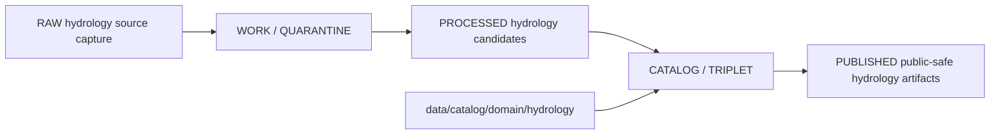

<!-- [KFM_META_BLOCK_V2]
doc_id: kfm://doc/data-catalog-domain-hydrology-readme
title: data/catalog/domain/hydrology/README.md — Hydrology Domain Catalog README
version: v0.1
type: readme; data-lifecycle-sublane; domain-catalog-guide
status: draft; PROPOSED; data-root; catalog-stage; hydrology; release-gated; evidence-bound; source-role-aware
owners: OWNER_TBD — Hydrology steward · Data steward · Catalog steward · Evidence steward · Source steward · Policy steward · Release steward · Schema steward · Docs steward
created: NEEDS VERIFICATION — blank placeholder existed before v0.1 expansion
updated: 2026-06-25
policy_label: public-doc; data; catalog; hydrology; lifecycle; release-gated; evidence-bound; source-role-aware
tags: [kfm, data, catalog, hydrology, domain-catalog, CATALOG, TRIPLET, Watershed, HUCUnit, GaugeSite, FlowObservation, WaterLevelObservation, NFHLZone, EvidenceBundle, SourceDescriptor, ReleaseManifest]
related:
  - ../../README.md
  - ../../../README.md
  - ../../../../contracts/domains/hydrology/README.md
  - ../../../../docs/domains/hydrology/SOURCE_REGISTRY.md
  - ../../../../docs/domains/hydrology/OBJECT_FAMILIES.md
  - ../../../../docs/domains/hydrology/IDENTITY_MODEL.md
  - ../../../../docs/domains/hydrology/API_CONTRACTS.md
  - ../../../../docs/adr/ADR-0009-hydrology-is-the-first-proof-bearing-lane.md
  - ../../../../schemas/contracts/v1/domains/hydrology/
  - ../../../../policy/domains/hydrology/
  - ../../../../data/proofs/
  - ../../../../data/receipts/
  - ../../../../release/
notes:
  - "This file replaces a blank placeholder at `data/catalog/domain/hydrology/README.md`."
  - "Hydrology contracts describe Hydrology object meaning; machine shape, policy, lifecycle data, and release decisions remain in separate responsibility roots."
  - "Source role is fixed at admission and never upgraded by promotion; observed, regulatory, modeled, aggregate, administrative, candidate, and synthetic roles must remain distinct."
  - "NFHL is regulatory context only and must not be presented as observed flooding, forecast inundation, hydraulic-model output, or real-time flood status."
  - "This folder is a CATALOG-stage domain catalog lane; it is not RAW, WORK, QUARANTINE, PROCESSED, PUBLISHED, proof storage, release authority, schema authority, policy code, implementation code, or emergency-warning authority."
  - "Rollback target for this replacement is previous blank blob SHA `8b137891791fe96927ad78e64b0aad7bded08bdc`."
[/KFM_META_BLOCK_V2] -->

# data/catalog/domain/hydrology

> Hydrology-domain catalog lane for governed catalog records and indexes inside the `CATALOG / TRIPLET` lifecycle stage.

  
  
  
  
  
  

**Status:** draft / PROPOSED  
**Path:** `data/catalog/domain/hydrology/README.md`  
**Owning root:** `data/catalog/domain/`  
**Domain segment:** `hydrology`  
**Lifecycle stage:** `CATALOG / TRIPLET`  
**Exposure posture:** release-gated; public records must use approved public-safe representation and source-role boundaries  
**Truth posture:** CONFIRMED target was blank · CONFIRMED parent catalog lane is RELEASED ONLY for public exposure · CONFIRMED Hydrology contracts define the lane as evidence-bound, source-role-aware, release-gated, rollback-aware, and not an emergency flood-warning system · CONFIRMED Hydrology source registry fixes source role at admission and treats rights/role gaps as fail-closed · NEEDS VERIFICATION for catalog inventory, schemas, validators, policy gates, receipts, release manifests, access controls, and route behavior.

**Quick jumps:** [Purpose](#purpose) · [Lifecycle boundary](#lifecycle-boundary) · [Repo fit](#repo-fit) · [Accepted contents](#accepted-contents) · [Exclusions](#exclusions) · [Catalog requirements](#catalog-requirements) · [Hydrology guardrails](#hydrology-guardrails) · [Evidence ledger](#evidence-ledger) · [Validation checklist](#validation-checklist) · [Rollback](#rollback)

---

## Purpose

`data/catalog/domain/hydrology/` stores or stages Hydrology-domain catalog records and indexes that connect watersheds, HUC units, hydrologic features, reaches, gauges, flow and water-level observations, water-quality observations, groundwater context, NFHL regulatory context, observed flood evidence, hydrographs, upstream traces, drought and irrigation links, evidence references, source roles, receipts, and release state.

A domain catalog record supports discovery, steward review, catalog closure, and release preparation. It does **not** make a Hydrology claim true, public, policy-admitted, evidence-supported, regulatory-authoritative, emergency-authoritative, or released by itself.

## Lifecycle boundary

`data/catalog/domain/hydrology/` is a CATALOG-stage domain lane. Public exposure applies only to records tied to approved release state, governed route, evidence support, source-role support, policy posture, and required receipts.

## Repo fit

| Responsibility | Correct home | Rule |
|---|---|---|
| Hydrology domain catalog records | `data/catalog/domain/hydrology/` | This lane. |
| Parent catalog stage | `data/catalog/` | Parent CATALOG-stage lane. |
| Hydrology STAC records | `data/catalog/stac/hydrology/` | Spatiotemporal catalog records, if accepted. |
| Hydrology DCAT records | `data/catalog/dcat/hydrology/` | Dataset/distribution catalog records, if accepted. |
| Hydrology PROV records | `data/catalog/prov/hydrology/` | Provenance catalog projection, if accepted. |
| Hydrology graph/triplet projections | `data/triplets/.../hydrology/` | Paired graph stage. |
| Hydrology proof/evidence | `data/proofs/` or accepted proof roots | EvidenceBundle and ProofPack. |
| Hydrology source registry | `data/registry/sources/hydrology/` | SourceDescriptor entries and admission state. |
| Hydrology receipts | `data/receipts/` or accepted receipt roots | CatalogBuildReceipt, RunReceipt, validation, policy, review, and correction receipts. |
| Hydrology release decisions | `release/` | Publication authority. |
| Hydrology schemas and policy | `schemas/contracts/v1/domains/hydrology/`, `policy/domains/hydrology/` | Separate roots; path status remains PROPOSED/NEEDS VERIFICATION. |

## Accepted contents

| Content | Purpose |
|---|---|
| Hydrology domain catalog indexes | Group-level indexes for Hydrology catalog records. |
| Watershed and HUC catalog entries | Catalog records for watershed/HUC identity products and evidence links. |
| Hydro feature and reach catalog entries | Catalog records for hydrographic network and reach-identity products. |
| Gauge and observation catalog entries | Catalog records for gauge sites, flow observations, water levels, and water quality. |
| Groundwater and aquifer catalog entries | Catalog records for groundwater wells and aquifer observations where policy permits. |
| NFHL and flood-context catalog entries | Regulatory-context or observed-flood evidence records with source-role separation. |
| Hydrograph and upstream-trace catalog entries | Observed or modeled time-series and network traversal products with role flags. |
| Cross-domain link catalog entries | Drought, irrigation, agriculture, soil, hazards, infrastructure, and habitat links with owning-lane boundaries preserved. |
| Evidence and source pointers | References to EvidenceBundle, SourceDescriptor, receipts, and validation reports. |
| Catalog quality summaries | Summaries that point to validation reports and receipts. |

## Exclusions

| Do not put here | Correct home |
|---|---|
| RAW hydrology source files | `data/raw/hydrology/` |
| WORK/intermediate data | `data/work/hydrology/` |
| Quarantined data | `data/quarantine/hydrology/` |
| Processed datasets | `data/processed/hydrology/` |
| STAC/DCAT/PROV records | `data/catalog/stac/hydrology/`, `data/catalog/dcat/hydrology/`, `data/catalog/prov/hydrology/` if accepted |
| Triplets/graph edges | `data/triplets/.../hydrology/` |
| EvidenceBundle/proof records | `data/proofs/` |
| SourceDescriptor records | `data/registry/sources/hydrology/` |
| Receipts | `data/receipts/` |
| Release decisions | `release/` |
| Published public products | `data/published/.../hydrology/` |
| Semantic contracts | `contracts/domains/hydrology/` |
| Schemas | `schemas/` |
| Policy rules | `policy/` |
| Validators/tests/code | `tools/validators/`, `tests/`, implementation roots |
| Emergency flood warnings or life-safety guidance | Official issuing authorities and their direct public channels |

## Catalog requirements

PROPOSED until schemas, validators, and inventory are verified:

| Requirement | Meaning |
|---|---|
| Stable catalog identity | Record has a stable identity linked to source, evidence, derivative, or release object. |
| Source-role class | Record preserves whether material is observed, regulatory, modeled, aggregate, administrative, candidate, or synthetic. |
| Evidence reference | Record points to EvidenceBundle/proof context when claims depend on evidence. |
| Source reference | Record points to SourceDescriptor/source registry where source authority matters. |
| Temporal basis | Record preserves valid time, observation time, retrieval time, release time, and correction time where material. |
| Policy reference | Record links to policy posture when public display, sensitivity, freshness, role, or rights matter. |
| Release reference | Public or release-linked records point to ReleaseManifest and rollback target. |
| Closure compatibility | Hydrology domain catalog, STAC, DCAT, and PROV agreement holds where those projections exist. |

## Hydrology guardrails

- Hydrology catalog records are catalog carriers, not source truth by themselves.
- Observed, regulatory, modeled, aggregate, administrative, candidate, and synthetic records must remain distinct.
- NFHL/FEMA flood-hazard material is regulatory context and must not be treated as observed flooding, forecast inundation, hydraulic-model output, or real-time flood status.
- Gauge observations do not become regulatory determinations; modeled hydrographs do not become observations; HUC rollups do not become per-place truth.
- Hydrology catalog records do not provide emergency flood warnings, evacuation advice, or life-safety guidance.
- Cross-lane joins to Hazards, Soil, Agriculture, Geology, Infrastructure, Habitat, Fauna, Flora, People/Land, or Spatial Foundation must preserve owning-lane truth and sensitivity posture.
- Unreleased Hydrology catalog records are not public merely because they exist under this directory.

## Evidence ledger

| Source | Status | Supports | Limits |
|---|---|---|---|
| `data/catalog/domain/hydrology/README.md` previous file | CONFIRMED | Target existed as a blank placeholder. | Did not define lane boundaries. |
| `data/catalog/README.md` | CONFIRMED | Parent catalog lane, domain catalog layout, RELEASED ONLY public posture. | Does not prove Hydrology catalog inventory. |
| `contracts/domains/hydrology/README.md` | CONFIRMED contract-lane evidence | Hydrology semantic boundaries, object families, not-emergency-warning posture, NFHL source-role rule, and responsibility-root separation. | Contract lane does not prove catalog data exists. |
| `docs/domains/hydrology/SOURCE_REGISTRY.md` | CONFIRMED doctrine / PROPOSED implementation | Source-role discipline, fail-closed source admission, hydrology source families, and registry/data separation. | Source descriptor instances, endpoints, and exact files remain NEEDS VERIFICATION. |

## Validation checklist

- [ ] Confirm actual child files and Hydrology catalog inventory under this lane.
- [ ] Confirm Hydrology domain catalog schema/profile location.
- [ ] Confirm access policy, validators, and CI checks.
- [ ] Confirm SourceDescriptor, EvidenceBundle, RunReceipt, ValidationReport, PolicyDecision, ReviewRecord, transform receipt, and ReleaseManifest references.
- [ ] Confirm source-role separation for observed/regulatory/modeled/aggregate/administrative/candidate/synthetic records.
- [ ] Confirm NFHL regulatory-only posture and observed-flood evidence separation.
- [ ] Confirm time, units, qualifiers, gauge identity, HUC identity, reach identity, and correction/rollback behavior.
- [ ] Confirm domain/STAC/DCAT/PROV catalog closure where those projections exist.

## Rollback

Rollback is required if this lane becomes a Hydrology raw-data root, work area, quarantine store, processed-data store, semantic-contract root, proof store, source-registry root, release-decision root, published-output root, schema root, policy root, validator root, implementation root, emergency-warning surface, life-safety instruction source, or public exposure shortcut.

Rollback target for this replacement: previous blank blob SHA `8b137891791fe96927ad78e64b0aad7bded08bdc`.

<a href="#top">Back to top</a>

