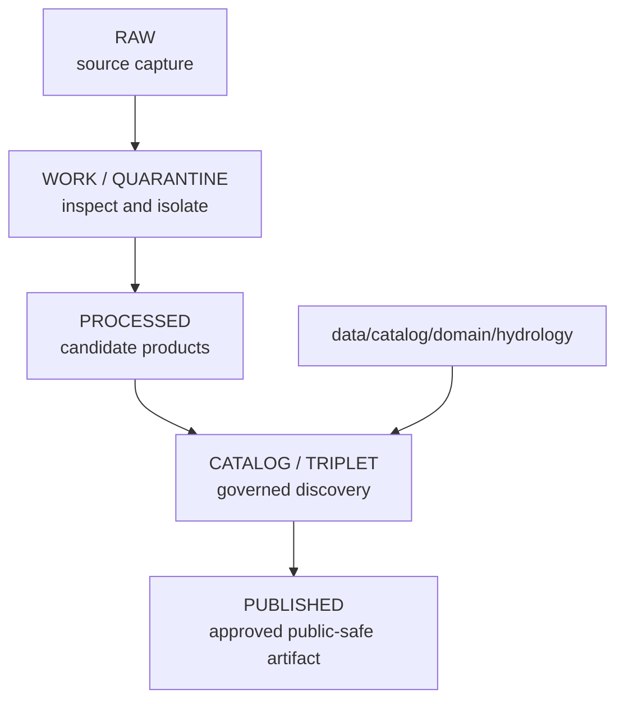

<!-- [KFM_META_BLOCK_V2]
doc_id: kfm://doc/data-catalog-domain-hydrology-readme
title: data/catalog/domain/hydrology/README.md — Governed Hydrology Domain Catalog Lane
version: v0.2.0
type: readme; data-lifecycle-sublane; domain-catalog-guide
status: repository-grounded draft; PROPOSED; catalog-stage; hydrology; release-gated; evidence-bound; source-role-aware; bounded-evidencebundle-shape-validation; broader-validation-held; proof-held; release-held
owners: OWNER_TBD — Hydrology steward · Data steward · Catalog steward · Evidence steward · Source steward · Policy steward · Release steward · Schema steward · Docs steward
created: NEEDS VERIFICATION — blank placeholder existed before v0.1 expansion
updated: 2026-07-29
policy_label: public-doc; data; catalog; hydrology; lifecycle; release-gated; evidence-bound; source-role-aware
tags: [kfm, data, catalog, hydrology, domain-catalog, CATALOG, TRIPLET, Watershed, HUCUnit, GaugeSite, FlowObservation, WaterLevelObservation, NFHLZone, EvidenceBundle, SourceDescriptor, CatalogMatrix, ReleaseManifest]
baseline:
  ref: main@1b131fb5ab7a828cd3f7a6bb88aa33e0cee3d0bf
  target_blob: 1eb7a41eb00ca8737c870d1345b5f781c08c90de
  historical_blank_blob: 8b137891791fe96927ad78e64b0aad7bded08bdc
related:
  - ../../README.md
  - ../../../README.md
  - ../../../../contracts/domains/hydrology/README.md
  - ../../../../docs/domains/hydrology/SOURCE_REGISTRY.md
  - ../../../../docs/domains/hydrology/OBJECT_FAMILIES.md
  - ../../../../docs/domains/hydrology/IDENTITY_MODEL.md
  - ../../../../docs/domains/hydrology/API_CONTRACTS.md
  - ../../../../docs/adr/ADR-0009-hydrology-is-the-first-proof-bearing-lane.md
  - ../../../../docs/adr/ADR-0026-hydrology-source-spine-starts-with-wbd-huc12.md
  - ../../../../schemas/contracts/v1/domains/hydrology/
  - ../../../../policy/domains/hydrology/
  - ../../../../data/proofs/hydrology/
  - ../../../../data/receipts/hydrology/
  - ../../../../release/candidates/hydrology/
notes:
  - "This file preserves the stable identity and safeguards introduced when v0.1 replaced a blank placeholder."
  - "The evidence snapshot confirms lane placement, extensive Hydrology design documentation, and one bounded EvidenceBundle alias shape/polarity validation slice, but not accepted catalog payloads, broader semantic validation, proof closure, release closure, or publication."
  - "Hydrology contracts describe object meaning; machine shape, policy, lifecycle data, evidence, and release decisions remain in separate responsibility roots."
  - "Source role is fixed at admission and never upgraded by promotion; observed, regulatory, modeled, aggregate, administrative, candidate, and synthetic roles remain distinct."
  - "NFHL is regulatory context only and must not be presented as observed flooding, forecast inundation, hydraulic-model output, or real-time flood status."
  - "This folder is a CATALOG-stage domain catalog lane; it is not RAW, WORK, QUARANTINE, PROCESSED, PUBLISHED, proof storage, release authority, schema authority, policy code, implementation code, or emergency-warning authority."
  - "Rollback target for the original blank-to-v0.1 replacement is blob SHA `8b137891791fe96927ad78e64b0aad7bded08bdc`; rollback of this modernization should revert its scoped commit."
[/KFM_META_BLOCK_V2] -->

# data/catalog/domain/hydrology

> Governed Hydrology-domain catalog lane for evidence-linked catalog records and indexes at the `CATALOG / TRIPLET` lifecycle stage.

> [!IMPORTANT]
> A catalog record is a discovery and governance carrier. Its presence here does not prove the underlying Hydrology claim, satisfy policy, close evidence, authorize release, or make an artifact public.

> [!CAUTION]
> KFM Hydrology is not an emergency-warning, flood-forecast, evacuation, navigation, engineering, insurance, or regulatory-determination authority. Use the responsible issuing authority for operational or life-safety decisions.

| Field | Current repository-grounded value |
| --- | --- |
| Path | `data/catalog/domain/hydrology/README.md` |
| Owning root | `data/catalog/domain/` |
| Authority level | Catalog-stage lane guide; not semantic, policy, proof, or release authority |
| Lifecycle stage | `CATALOG / TRIPLET` |
| Domain | Hydrology |
| Public exposure | Released-only through an approved public-safe representation and governed route |
| Current maturity | Repository-grounded draft; implementation and closure gates remain held |
| Accepted catalog payload | None verified in the inspected evidence snapshot |
| Accepted deterministic validator | None verified |
| Accepted proof payload or producer | None verified |
| Accepted release or published Hydrology artifact | None verified |
| Owners | `OWNER_TBD`; repository routing is not stewardship acceptance |
| Last evidence review | 2026-07-25 against `main@1b131fb5ab7a828cd3f7a6bb88aa33e0cee3d0bf` |

**Quick navigation:** [Purpose](#purpose) · [Current status](#current-status) · [Lifecycle boundary](#lifecycle-boundary) · [Repo fit](#repo-fit) · [Accepted contents](#accepted-contents) · [Exclusions](#exclusions) · [Inputs](#inputs) · [Outputs](#outputs) · [Catalog requirements](#catalog-requirements) · [Hydrology guardrails](#hydrology-guardrails) · [Evidence ledger](#evidence-ledger) · [Validation checklist](#validation-checklist) · [Release boundary](#publication-and-release-boundary) · [Open register](#open-verification-register) · [Rollback](#rollback)

---

## Purpose

`data/catalog/domain/hydrology/` is the canonical Hydrology-domain lane inside the repository's CATALOG stage. It is intended to store or index governed catalog records that connect discoverable Hydrology objects to their identities, source roles, temporal bases, evidence references, validation state, receipts, policy posture, corrections, and release state.

The catalog scope can describe or link:

- watersheds and hydrologic-unit identities;
- hydrologic features, reaches, and network relationships;
- gauge sites and flow, water-level, or water-quality observations;
- groundwater and aquifer context;
- NFHL regulatory context and separately governed observed-flood evidence;
- observed or modeled hydrographs and upstream traces;
- drought, irrigation, agriculture, soil, geology, hazards, infrastructure, habitat, fauna, flora, people/land, and spatial-foundation relationships; and
- source descriptors, evidence bundles, receipts, validation reports, catalog projections, corrections, and release records.

A catalog record supports discovery, steward review, catalog closure, and release preparation. It does **not** make a Hydrology claim true, public, policy-admitted, evidence-supported, regulatory-authoritative, emergency-authoritative, or released by itself.

## Current status

The lane exists and its responsibility boundary is documented. The inspected repository also contains a Hydrology workflow, proof-slice workflow, contracts, schemas, source descriptors, fixtures, pipeline specifications, tests, proof and receipt guides, release-candidate guidance, published-lane guides, and rollback guidance. Those surfaces do not have equal maturity.

| Capability | Evidence-backed status | Consequence |
| --- | --- | --- |
| Directory placement | **CONFIRMED** | `data/catalog/domain/hydrology/` is an allowed domain catalog lane. |
| Lane semantics | **CONFIRMED as draft documentation** | The README and Hydrology contracts define intended boundaries; documentation is not implementation. |
| First source spine | **PROPOSED** | ADR-0026 proposes WBD HUC12; it is not an accepted source graduation. |
| HUCUnit semantic contract | **SUBSTANTIVE DRAFT** | Meaning is described, but the paired machine schema remains permissive scaffolding. |
| Source descriptors | **PROPOSED / CONFLICTED** | Canonical-home and legacy-home WBD descriptors coexist; one accepted authority is not established. |
| Fixtures and pipeline specifications | **PLACEHOLDERS** | Files exist but explicitly identify themselves as proposed placeholders. |
| Domain tests | **BOUNDED EXECUTABLE SLICE / BROADER HELD** | The domain test checks only the proposed EvidenceBundle alias schema, valid/invalid fixture polarity, and process-level network denial; the proof-slice end-to-end test remains a placeholder. |
| Domain validators | **BOUNDED SHAPE VALIDATOR / BROADER HELD** | The EvidenceBundle alias wrapper is exercised for local shape polarity. Semantic, source, identity, policy, evidence-closure, proof, and release validators remain unaccepted or held. |
| CatalogMatrix closure | **HELD** | The contract exists, but its schema is permissive and its validator raises `NotImplementedError`. |
| Proof production | **HELD** | No accepted proof producer or non-README Hydrology proof payload was verified. |
| Release dry run | **HELD** | The workflow deliberately refuses promotion while a candidate and release path are unproven. |
| Publication | **NOT VERIFIED** | Published-lane READMEs describe carriers; they do not establish a released Hydrology artifact. |

These states are intentionally fail-closed. A file's existence is not evidence that its described capability is accepted, executable, policy-admissible, or released.

## Lifecycle boundary

```mermaid
flowchart TD
  RAW["RAW<br/>source capture"] --> WQ["WORK / QUARANTINE<br/>inspect and isolate"]
  WQ --> PROCESSED["PROCESSED<br/>candidate products"]
  PROCESSED --> CATALOG["CATALOG / TRIPLET<br/>governed discovery"]
  CATALOG --> PUBLISHED["PUBLISHED<br/>approved public-safe artifact"]
  DOMAIN["data/catalog/domain/hydrology"] --> CATALOG
```

`data/catalog/domain/hydrology/` belongs only to the CATALOG-stage domain projection.

| Transition | Required posture | Current Hydrology state |
| --- | --- | --- |
| RAW → WORK / QUARANTINE | Source identity, rights, role, sensitivity, and retrieval context retained | Specific accepted implementation **NEEDS VERIFICATION** |
| WORK / QUARANTINE → PROCESSED | Deterministic transformation, contract checks, and receipts | Accepted executable closure **NOT VERIFIED** |
| PROCESSED → CATALOG / TRIPLET | Stable identity, source/evidence references, catalog validation, and projection agreement | **HELD**; placeholders and validator gaps remain |
| CATALOG / TRIPLET → PUBLISHED | Policy approval, evidence closure, release manifest, public-safe representation, route governance, and rollback target | **HELD**; no qualifying release verified |

Public exposure applies only to a record tied to an accepted release state, governed route, evidence support, source-role support, policy posture, required receipts, and a tested rollback target. Promotion must not silently change source role or claim class.

## Repo fit

The current [`Directory Rules`](../../../../docs/doctrine/directory-rules.md) place domain catalog material under `data/catalog/domain/<domain>/`; this lane follows that rule. The root README ordering contract is mandatory for canonical and compatibility roots, not for every nested lane. This nested README adopts the same evidence-first ordering where useful without claiming root authority.

| Responsibility | Correct home | Rule |
| --- | --- | --- |
| Hydrology domain catalog records | `data/catalog/domain/hydrology/` | This canonical catalog-stage lane. |
| Compatibility pointer | [`catalog/domain/hydrology/`](../../../../catalog/domain/hydrology/README.md) | Redirect/drift fence only; do not create parallel authority. |
| Parent catalog stage | [`data/catalog/`](../../README.md) | Parent CATALOG-stage lane and released-only public posture. |
| Hydrology STAC records | `data/catalog/stac/hydrology/` | Projection lane only if accepted and present; none was established by this review. |
| Hydrology DCAT records | `data/catalog/dcat/hydrology/` | Projection lane only if accepted and present; none was established by this review. |
| Hydrology PROV records | `data/catalog/prov/hydrology/` | Projection lane only if accepted and present; none was established by this review. |
| Hydrology graph/triplet projections | `data/triplets/.../hydrology/` | Paired graph stage; topology remains governed separately. |
| Hydrology proof/evidence | [`data/proofs/hydrology/`](../../../../data/proofs/hydrology/README.md) or another accepted proof root | EvidenceBundle and ProofPack material; README presence is not proof payload. |
| Hydrology source registry | [`data/registry/sources/hydrology/`](../../../../data/registry/sources/hydrology/README.md) | SourceDescriptor admission state; current WBD topology conflict remains open. |
| Hydrology receipts | [`data/receipts/hydrology/`](../../../../data/receipts/hydrology/README.md) or another accepted receipt root | Process memory; receipts are not proof or release authority. |
| Hydrology release decisions | [`release/candidates/hydrology/`](../../../../release/candidates/hydrology/README.md) and accepted release authority | A candidate is not a release. |
| Hydrology published carriers | [`data/published/hydrology/`](../../../../data/published/hydrology/README.md) and [`data/published/layers/hydrology/`](../../../../data/published/layers/hydrology/README.md) | Published-lane guides; no actual released artifact is asserted here. |
| Semantic contracts | [`contracts/domains/hydrology/`](../../../../contracts/domains/hydrology/README.md) | Object meaning and invariants; contracts do not prove catalog inventory. |
| Machine schemas | [`schemas/contracts/v1/domains/hydrology/`](../../../../schemas/contracts/v1/domains/hydrology/README.md) | Shape authority only after acceptance; inspected schemas remain proposed. |
| Policy | [`policy/domains/hydrology/`](../../../../policy/domains/hydrology/README.md) | Policy posture; current domain policy surface remains scaffolding. |
| Validators and tests | [`tools/validators/domains/hydrology/`](../../../../tools/validators/domains/hydrology/README.md), [`tests/domains/hydrology/`](../../../../tests/domains/hydrology/README.md) | Executable assurance only when accepted implementations exist. |
| Rollback support | [`data/rollback/hydrology/`](../../../../data/rollback/hydrology/README.md) | Data-plane rollback support; not release-decision authority. |

## Accepted contents

Only governed catalog-stage material belongs here.

| Content | Purpose | Minimum admission posture |
| --- | --- | --- |
| Hydrology domain catalog indexes | Group-level discovery indexes for Hydrology catalog records | Stable identity, explicit status, steward route, and resolvable references |
| Watershed and HUC catalog entries | Catalog records for watershed or hydrologic-unit identity products | HUC level, identity basis, source role, version, geometry role, and evidence pointer |
| Hydro feature and reach catalog entries | Catalog records for hydrographic network and reach-identity products | Network identity, source lineage, topology version, and qualifier semantics |
| Gauge and observation catalog entries | Gauge sites, flow observations, water levels, and water quality | Gauge identity, observed-versus-modeled role, units, qualifiers, timestamps, and correction posture |
| Groundwater and aquifer catalog entries | Groundwater wells and aquifer observations where policy permits | Sensitivity review, location precision policy, temporal basis, units, and source authority |
| NFHL and flood-context catalog entries | Regulatory context or observed-flood evidence with strict role separation | Issuing authority, effective date, regulatory role, disclaimers, and no observation/forecast conflation |
| Hydrograph and upstream-trace catalog entries | Observed or modeled time-series and network-traversal products | Role flags, model/observation distinction, time basis, network version, uncertainty, and evidence |
| Cross-domain link catalog entries | Drought, irrigation, agriculture, soil, hazards, geology, infrastructure, habitat, and other governed links | Owning-lane identity, join semantics, sensitivity, evidence, and non-duplication of authority |
| Evidence and source pointers | References to EvidenceBundle, SourceDescriptor, receipts, and validation reports | Resolvable immutable or versioned identifiers; no unsupported closure claim |
| Catalog quality summaries | Summaries that point to validation reports and receipts | Generated from accepted validation; summary cannot substitute for underlying evidence |

A complete recursive payload inventory for this lane remains **NEEDS VERIFICATION**. This README does not certify an uninspected child as accepted content.

## Exclusions

| Do not put here | Correct home or authority |
| --- | --- |
| RAW Hydrology source files | `data/raw/hydrology/` |
| WORK or intermediate data | `data/work/hydrology/` |
| Quarantined data | `data/quarantine/hydrology/` |
| Processed datasets | `data/processed/hydrology/` |
| STAC, DCAT, or PROV projection records | Their accepted projection lanes, if established |
| Triplets or graph edges | `data/triplets/.../hydrology/` |
| EvidenceBundle or proof payloads | Accepted proof roots such as `data/proofs/hydrology/` |
| SourceDescriptor records | `data/registry/sources/hydrology/` |
| Run, validation, policy, review, correction, or build receipts | Accepted receipt roots such as `data/receipts/hydrology/` |
| Release decisions or manifests | Accepted `release/` authority |
| Published public products | Accepted `data/published/.../hydrology/` carrier |
| Semantic contracts | `contracts/domains/hydrology/` |
| Schemas | `schemas/` |
| Policy rules | `policy/` |
| Validators, tests, or implementation code | `tools/validators/`, `tests/`, pipelines, services, or other implementation roots |
| Credentials, restricted access details, or sensitive precise locations | Approved secret, policy, and protected-data systems |
| Emergency flood warnings, evacuation advice, or life-safety guidance | Official issuing authorities and their direct public channels |

## Inputs

Catalog admission can consume references to governed upstream objects, never untracked copies that bypass their owning stage.

| Input class | Required relationship |
| --- | --- |
| Processed Hydrology candidate | Stable identity, transform lineage, schema/profile, units, time basis, source role, and validation receipt |
| SourceDescriptor | Accepted authority, rights, retrieval, freshness, spatial/temporal extent, role, and sensitivity posture |
| EvidenceBundle or ProofPack | Evidence identity, claim scope, provenance, deterministic validation result, and immutability/version |
| Semantic contract and machine schema | Compatible accepted versions; semantic meaning must not be inferred from permissive shape alone |
| Policy decision | Explicit decision, policy version, reason, scope, reviewer or authority, and expiration/review conditions |
| Cross-domain reference | Owning-lane identity and evidence preserved; the Hydrology catalog does not assume foreign truth authority |
| Correction or supersession record | Target identity, reason, effective time, replacement, audit trail, and rollback implication |

Missing, unresolved, or conflicting input authority must produce a hold or quarantine outcome—not a silent default.

## Outputs

An accepted implementation may produce:

- a stable Hydrology domain catalog record or index;
- an evidence-linked CatalogMatrix row;
- aligned STAC, DCAT, PROV, or triplet projections where those projections are accepted;
- validation, build, policy, review, and correction receipts stored in their authoritative roots;
- a release-candidate reference that remains non-public until release authority acts; and
- a public-safe published projection only after proof, policy, release, route, and rollback closure.

This README produces none of those machine artifacts. It documents the lane and its admission boundary.

## Catalog requirements

The requirements below are normative for lane admission but remain **PROPOSED** until accepted schemas, validators, inventory, policy gates, and receipts demonstrate them.

| Requirement | Meaning | Fail-closed condition |
| --- | --- | --- |
| Stable catalog identity | Record has a stable identity linked to a source, evidence, derivative, or release object | Missing, mutable, colliding, or unresolvable identity |
| Object and claim class | Record declares the Hydrology object family and the claim type it can support | Ambiguous semantics or a catalog record presented as source truth |
| Source-role class | Record preserves whether material is observed, regulatory, modeled, aggregate, administrative, candidate, or synthetic | Missing role or promotion that upgrades a role |
| Evidence reference | Record points to accepted proof context when claims depend on evidence | Missing, unresolved, stale, or scope-mismatched evidence |
| Source reference | Record points to an accepted SourceDescriptor where source authority matters | Unknown authority, rights, freshness, sensitivity, or retrieval basis |
| Temporal basis | Record preserves valid, observation, retrieval, release, and correction times where material | Time semantics missing or conflated |
| Spatial basis | Record preserves CRS, extent, precision, geometry role, and uncertainty where material | Unresolved CRS, unsafe precision, invalid geometry role, or uncertainty omitted |
| Units and qualifiers | Measurements retain unit, method, qualifier, censoring, and quality context | Unitless or decontextualized measurement |
| Policy reference | Record links to applicable display, sensitivity, freshness, role, and rights posture | No accepted policy decision for governed exposure |
| Release reference | Public or release-linked records point to a ReleaseManifest and rollback target | Candidate treated as release or rollback target absent |
| Correction lineage | Supersession and correction remain auditable and do not erase prior state | Silent overwrite or orphaned public artifact |
| Closure compatibility | Domain catalog, CatalogMatrix, triplet, STAC, DCAT, and PROV projections agree where accepted | Cross-projection identity, evidence, status, or version mismatch |

## Hydrology guardrails

- Hydrology catalog records are catalog carriers, not source truth by themselves.
- Observed, regulatory, modeled, aggregate, administrative, candidate, and synthetic records must remain distinct.
- Source role is fixed at admission and must not be upgraded by transformation, cataloging, proof assembly, or promotion.
- NFHL/FEMA flood-hazard material is regulatory context and must not be treated as observed flooding, forecast inundation, hydraulic-model output, or real-time flood status.
- Gauge observations do not become regulatory determinations; modeled hydrographs do not become observations; HUC rollups do not become per-place truth.
- A watershed or HUC geometry is accounting and context geometry, not parcel, address, flood, navigation, or site-specific engineering truth.
- Location precision, sensitive infrastructure, private wells, cultural resources, protected habitat, or other protected features must follow policy and public-safe generalization.
- Hydrology catalog records do not provide emergency flood warnings, evacuation advice, navigation instructions, or life-safety guidance.
- Cross-lane joins to Hazards, Soil, Agriculture, Geology, Infrastructure, Habitat, Fauna, Flora, People/Land, or Spatial Foundation must preserve owning-lane truth and sensitivity posture.
- Unreleased Hydrology catalog records are not public merely because they exist under this directory or appear in a candidate, proof guide, or published-lane README.
- A receipt records process; it is not proof. A proof object supports bounded claims; it is not a release. A release candidate is not a release.

## WBD HUC12 source-spine posture

[ADR-0026](../../../../docs/adr/ADR-0026-hydrology-source-spine-starts-with-wbd-huc12.md) proposes WBD HUC12 as the first Hydrology source family to graduate. The ADR is draft/proposed, so the source spine is a bounded implementation target—not an accepted fact of production maturity.

| Surface | Inspected state | Catalog implication |
| --- | --- | --- |
| [`HUCUnit` semantic contract](../../../../contracts/domains/hydrology/huc_unit.md) | Substantive draft | Use its accounting/context and non-per-place-truth distinctions; do not overstate machine enforcement. |
| [`HUCUnit` schema](../../../../schemas/contracts/v1/domains/hydrology/huc_unit.schema.json) | `PROPOSED`; empty `properties`; permissive `additionalProperties` | Cannot establish shape or catalog closure. |
| [WBD HUC12 fixture](../../../../fixtures/domains/hydrology/valid/huc12_kansas_sample.json) | Explicit proposed placeholder | Cannot serve as accepted evidence or a representative production record. |
| [WBD HUC12 pipeline specification](../../../../pipeline_specs/hydrology/wbd_huc12_ingest.yaml) | Explicit proposed placeholder | Does not establish executable ingestion. |
| [Canonical-home WBD descriptor](../../../../data/registry/sources/hydrology/wbd.source.yaml) | Proposed placeholder | Intended home is visible; acceptance and completeness remain unverified. |
| [Legacy-home WBD descriptor](../../../../data/registry/hydrology/sources/wbd_huc12.yaml) | Richer proposed descriptor in conflicting topology | Must not become a second authority; reconciliation remains open. |

No WBD HUC12 catalog record should be admitted as accepted until one authoritative SourceDescriptor, a constraining schema, deterministic fixtures/tests/validators, evidence closure, catalog closure, and steward acceptance agree.

## Validation and current readiness

The [Hydrology readiness workflow](../../../../.github/workflows/domain-hydrology.yml) executes one bounded EvidenceBundle alias shape/polarity check while retaining fail-closed denial gates for all broader readiness claims.

| Gate | Repository behavior | Current result encoded by workflow |
| --- | --- | --- |
| `validate-hydrology` | Executes the proposed EvidenceBundle alias schema against one valid and one deliberately invalid fixture with process-level network denial; inventories remaining placeholders | Bounded shape/polarity slice executable; broader semantics, EvidenceBundle closure, policy, proof, and release remain held |
| `build-proof-hydrology` | Confirms proof guidance and rejects premature proof payloads; no proof implementation target is accepted | Explicit skip/hold — no accepted proof producer |
| `publish-dry-run-hydrology` | Confirms candidate/release guides and rejects premature candidate records; no release dry-run target is accepted | Explicit skip/hold — release dry run is not established |

The [Hydrology proof-slice workflow](../../../../.github/workflows/hydrology-proof-slice.yml) applies the same fail-closed posture to the proposed end-to-end slice. The [domain test](../../../../tests/domains/hydrology/test_hydrology_smoke.py) is now a deterministic but deliberately narrow alias-shape check; the [proof-slice test](../../../../tests/e2e/test_hydrology_proof_slice.py) remains a placeholder. Neither establishes semantic Hydrology assurance or evidence closure.

The following are denied shortcuts:

- treating `assert True` as domain validation;
- treating a README, schema filename, fixture filename, or workflow filename as implemented capability;
- treating a permissive schema as semantic closure;
- treating a process receipt as proof or a proof guide as a proof payload;
- executing the placeholder promotion script and accepting its hard-coded approval output;
- creating a candidate or published path without a qualifying release decision; and
- converting unknown rights, sensitivity, source role, freshness, or evidence into an implicit allow.

## Evidence ledger

This ledger records what the inspected repository surfaces support and what they do not support.

| Source | Evidence status | Supports | Does not prove |
| --- | --- | --- | --- |
| This file's prior blob `1eb7a41e…` | **CONFIRMED baseline** | v0.1 lane boundary, source-role rules, safety posture, and blank-file lineage | Current implementation or closure |
| Historical blank blob `8b137891…` | **CONFIRMED lineage** | Original rollback reference retained from v0.1 | A desirable current rollback state |
| [`Directory Rules`](../../../../docs/doctrine/directory-rules.md) | **CONFIRMED doctrine** | `data/catalog/domain/<domain>/` placement and lifecycle responsibility | Hydrology payload acceptance |
| [Parent catalog README](../../README.md) | **CONFIRMED parent guidance** | CATALOG-stage role and released-only public posture | Domain inventory or release |
| [Hydrology contract index](../../../../contracts/domains/hydrology/README.md) | **CONFIRMED draft contract guidance** | Object boundaries, source roles, NFHL distinction, and not-emergency posture | Machine validation or catalog data |
| [Hydrology source registry guide](../../../../docs/domains/hydrology/SOURCE_REGISTRY.md) | **CONFIRMED doctrine / proposed implementation** | Fail-closed admission and source-role families | Accepted descriptor instances or endpoints |
| [ADR-0009](../../../../docs/adr/ADR-0009-hydrology-is-the-first-proof-bearing-lane.md) | **DRAFT / PROPOSED** | Hydrology proof-lane target and explicit current holds | Accepted proof-bearing status |
| [ADR-0026](../../../../docs/adr/ADR-0026-hydrology-source-spine-starts-with-wbd-huc12.md) | **DRAFT / PROPOSED** | WBD HUC12 graduation target and descriptor-topology conflict | Accepted WBD graduation |
| [Hydrology readiness workflow](../../../../.github/workflows/domain-hydrology.yml) | **CONFIRMED bounded executable check plus denial gates** | EvidenceBundle alias shape/polarity, process-level network denial, placeholder detection, and explicit broader validation/proof/release holds | EvidenceRef resolution, EvidenceBundle closure, semantic Hydrology assurance, proof, catalog closure, or release |
| [Hydrology proof-slice workflow](../../../../.github/workflows/hydrology-proof-slice.yml) | **CONFIRMED executable denial gate** | Proof-slice scope and fail-closed hold behavior | Produced proof or catalog closure |
| [`HUCUnit` schema](../../../../schemas/contracts/v1/domains/hydrology/huc_unit.schema.json) | **PROPOSED scaffold** | Schema path and stated status | Constrained HUCUnit shape |
| [`CatalogMatrix` contract](../../../../contracts/data/catalog_matrix.md) | **SUBSTANTIVE CONTRACT** | Intended catalog closure semantics | Executable validation |
| [`CatalogMatrix` schema](../../../../schemas/contracts/v1/data/catalog_matrix.schema.json) | **PROPOSED / permissive** | Candidate machine-shape surface | Complete closure constraints |
| [`CatalogMatrix` validator](../../../../tools/validators/validate_catalog_matrix.py) | **PLACEHOLDER** | Intended validator path | Any validation; it raises `NotImplementedError` |
| [Hydrology catalog pipeline guide](../../../../pipelines/domains/hydrology/catalog/README.md) | **DRAFT / TODO** | Proposed catalog handoff and checks | Executable catalog build |
| [Hydrology validator guide](../../../../pipelines/domains/hydrology/validate/README.md) | **DRAFT / TODO** | Proposed validation behavior | Accepted validator implementation |
| [Hydrology proof guide](../../../../data/proofs/hydrology/README.md) | **DRAFT GUIDE** | Proof-lane boundary; implementation depth is unknown | A proof object or accepted producer |
| [Hydrology receipt guide](../../../../data/receipts/hydrology/README.md) | **DRAFT GUIDE** | Process-memory boundary | Receipt payload, proof, or release |
| [Hydrology release-candidate guide](../../../../release/candidates/hydrology/README.md) | **DRAFT GUIDE** | Candidate boundary and “candidate is not a release” rule | Candidate record, ReleaseManifest, or release |
| [Hydrology published carrier guide](../../../../data/published/hydrology/README.md) | **DRAFT GUIDE** | Intended published-lane boundary | A released public artifact |
| [Hydrology layer carrier guide](../../../../data/published/layers/hydrology/README.md) | **DRAFT GUIDE** | Intended layer-lane boundary | A released public layer |
| [Hydrology rollback guide](../../../../data/rollback/hydrology/README.md) | **DRAFT GUIDE** | Data-plane rollback support boundary | Release authority or tested end-to-end rollback |

No source in this ledger is used beyond the claim scope it directly supports.

## Validation checklist

### Confirmed in the 2026-07-29 evidence snapshot

- [x] Confirm the canonical directory placement and compatibility redirect.
- [x] Confirm the full lifecycle boundary from RAW through PUBLISHED.
- [x] Confirm source-role separation for observed, regulatory, modeled, aggregate, administrative, candidate, and synthetic records.
- [x] Confirm NFHL regulatory-context-only posture and observed-flood evidence separation.
- [x] Confirm that the inspected HUCUnit and CatalogMatrix schemas are proposed/permissive.
- [x] Confirm that the bounded domain EvidenceBundle alias-shape test executes while the proof-slice test remains a placeholder.
- [x] Confirm that the current workflow executes the bounded shape/polarity slice and retains broader validation, proof, and release holds.
- [x] Confirm that proof, receipt, release-candidate, published, and rollback READMEs are guides rather than closure evidence.
- [x] Confirm that no release or public Hydrology artifact is established by the inspected evidence.

### Required before catalog acceptance or public projection

- [ ] Inventory every child payload recursively and classify its authority, status, rights, sensitivity, and lifecycle stage.
- [ ] Reconcile the canonical-home and legacy-home WBD HUC12 SourceDescriptor conflict.
- [ ] Accept constraining Hydrology and CatalogMatrix schemas with deterministic fixtures.
- [ ] Implement and accept no-network validators and end-to-end tests that exercise real semantics.
- [ ] Validate time, units, qualifiers, gauge identity, HUC identity, reach identity, CRS, uncertainty, and correction behavior.
- [ ] Produce immutable, claim-scoped EvidenceBundle or ProofPack payloads through an accepted producer.
- [ ] Produce and verify RunReceipt, ValidationReport, policy decision, review record, transform/build receipt, and correction lineage as required.
- [ ] Close domain, CatalogMatrix, triplet, STAC, DCAT, and PROV agreement where those projections exist.
- [ ] Resolve rights, freshness, source-role, precision, sensitivity, access-control, and public-route policy.
- [ ] Produce a qualifying ReleaseManifest, public-safe representation, governed route, and tested rollback target.
- [ ] Obtain named steward and release-authority acceptance; CODEOWNERS routing alone is insufficient.

## Publication and release boundary

The presence of a catalog record, proof guide, receipt guide, release-candidate directory, published directory, workflow, or badge is not publication authority.

A Hydrology catalog object may be projected publicly only when all applicable gates close:

1. the source and derivative identities are stable and resolvable;
2. source role, rights, freshness, sensitivity, and precision policies are accepted;
3. semantic contracts and constraining schemas agree;
4. deterministic validators and end-to-end tests pass on representative accepted fixtures;
5. evidence is immutable, claim-scoped, and closed;
6. catalog and projection closure is demonstrated;
7. policy and human-review decisions are recorded;
8. a qualifying release authority issues a ReleaseManifest;
9. the public representation and route are approved; and
10. rollback is specific, tested, and reachable.

If any required gate is absent, conflicting, stale, or unknown, the result remains held, quarantined, candidate-only, or non-public.

## Review burden

| Reviewer | Required focus |
| --- | --- |
| Hydrology steward | Object semantics, source roles, units, temporal meaning, uncertainty, and domain-safe claims |
| Source steward | Authority, descriptor topology, rights, retrieval, freshness, and admission role |
| Data and catalog stewards | Lifecycle placement, identity, CatalogMatrix closure, projections, corrections, and inventory |
| Evidence steward | Claim/evidence scope, proof immutability, validator determinism, and no receipt/proof conflation |
| Policy and sensitivity reviewers | Public-safe precision, protected features, access, disclaimers, and rights |
| Schema and validation reviewers | Constraining schemas, negative fixtures, executable validators, and fail-closed outcomes |
| Release steward | Candidate/release distinction, ReleaseManifest, route approval, and rollback |
| Documentation steward | Link integrity, preserved boundaries, status language, and no unsupported maturity claims |

## Related folders and contracts

- [Hydrology contracts](../../../../contracts/domains/hydrology/README.md)
- [Hydrology object families](../../../../docs/domains/hydrology/OBJECT_FAMILIES.md)
- [Hydrology identity model](../../../../docs/domains/hydrology/IDENTITY_MODEL.md)
- [Hydrology API contracts](../../../../docs/domains/hydrology/API_CONTRACTS.md)
- [Hydrology source registry guide](../../../../docs/domains/hydrology/SOURCE_REGISTRY.md)
- [Hydrology schema lane](../../../../schemas/contracts/v1/domains/hydrology/README.md)
- [Hydrology policy lane](../../../../policy/domains/hydrology/README.md)
- [Hydrology fixtures](../../../../fixtures/domains/hydrology/README.md)
- [Hydrology tests](../../../../tests/domains/hydrology/README.md)
- [Hydrology validators](../../../../tools/validators/domains/hydrology/README.md)
- [Hydrology proofs](../../../../data/proofs/hydrology/README.md)
- [Hydrology receipts](../../../../data/receipts/hydrology/README.md)
- [Hydrology release candidates](../../../../release/candidates/hydrology/README.md)
- [Hydrology published carriers](../../../../data/published/hydrology/README.md)
- [Hydrology rollback support](../../../../data/rollback/hydrology/README.md)

## Architecture decisions

- [ADR-0009 — Hydrology is the first proof-bearing lane](../../../../docs/adr/ADR-0009-hydrology-is-the-first-proof-bearing-lane.md) — draft/proposed; current semantic, proof, catalog, release, and operational holds remain explicit.
- [ADR-0026 — Hydrology source spine starts with WBD HUC12](../../../../docs/adr/ADR-0026-hydrology-source-spine-starts-with-wbd-huc12.md) — draft/proposed; identifies a bounded graduation target and an unresolved descriptor-topology conflict.

Neither ADR is treated here as an accepted production decision.

## Open verification register

| ID | Open item | Blocking effect | Closure evidence |
| --- | --- | --- | --- |
| HYD-CAT-001 | Complete child-payload inventory is not established | Cannot claim lane contents are fully classified | Recursive inventory with authority and status |
| HYD-CAT-002 | WBD HUC12 descriptor authority is split across canonical and legacy homes | Source identity and admission authority remain ambiguous | One accepted descriptor and migration/drift record |
| HYD-CAT-003 | Hydrology and CatalogMatrix schemas remain permissive | Machine shape and closure cannot be enforced | Accepted constraining schemas and negative fixtures |
| HYD-CAT-004 | Only one domain alias-shape slice is executable; end-to-end and semantic test lanes remain placeholders or unverified | No deterministic semantic assurance | Executable representative semantic and end-to-end test suite |
| HYD-CAT-005 | Only the EvidenceBundle alias shape wrapper has bounded acceptance; broader validators are absent, placeholder, or held | Invalid or unsafe semantic records cannot be reliably rejected | Accepted fail-closed semantic, source, identity, policy, and closure validators |
| HYD-CAT-006 | Proof producer and payload are absent | Claims cannot reach evidence closure | Accepted producer plus immutable bounded proof |
| HYD-CAT-007 | Rights, sensitivity, freshness, precision, and route policy are not closed | Public exposure remains denied | Accepted policy decisions and access controls |
| HYD-CAT-008 | Catalog/STAC/DCAT/PROV/triplet agreement is unverified | Projection closure remains unknown | Deterministic cross-projection validation |
| HYD-CAT-009 | No qualifying release or tested rollback is verified | Candidate or published paths cannot be treated as public release | ReleaseManifest, route record, and rollback drill |
| HYD-CAT-010 | Named owners and acceptance are unresolved | Stewardship and review authority remain incomplete | Explicit owner assignments and approval record |

## Definition of done

This lane can be described as implementation-ready only when the open verification register is closed with repository evidence. It can be described as proof-bearing only when an accepted deterministic producer creates claim-scoped proof that passes accepted validation. It can be described as released only when a qualifying release authority approves a public-safe representation and governed route with a tested rollback target.

Until then, the correct status is **repository-grounded draft with validation, proof, and release held**.

## No-loss ledger

| Preserved v0.1 element | v0.2.0 treatment |
| --- | --- |
| Stable `doc_id`, path, type, owner placeholders, creation uncertainty, and blank-file lineage | Preserved in metadata |
| Purpose and Hydrology object-family scope | Preserved and separated from implementation claims |
| RAW → WORK/QUARANTINE → PROCESSED → CATALOG/TRIPLET → PUBLISHED lifecycle | Preserved and made gate-explicit |
| Parent catalog, projections, proofs, source registry, receipts, release, schemas, and policy responsibility split | Preserved in Repo fit, Inputs, Outputs, and Related folders |
| Accepted content classes | Preserved with minimum admission posture |
| Exclusions and correct-home routing | Preserved and expanded for secrets/sensitive precision |
| Stable identity, role, evidence, source, time, policy, release, and projection-closure requirements | Preserved with fail-closed conditions |
| NFHL, gauge, modeled-hydrograph, HUC, cross-lane, non-public, and not-emergency guardrails | Preserved verbatim in substance and strengthened |
| Original evidence sources | Preserved and expanded with current repository evidence and limits |
| Original validation questions | Preserved as confirmed or still-open checklist items |
| Historical blank rollback blob | Preserved as lineage; scoped commit revert is the operational modernization rollback |
| Original section anchors | Preserved directly or through explicit `accepted-contents` and `exclusions` anchors |

## Rollback

Rollback is required if this lane becomes a Hydrology raw-data root, work area, quarantine store, processed-data store, semantic-contract root, proof store, source-registry root, release-decision root, published-output root, schema root, policy root, validator root, implementation root, emergency-warning surface, life-safety instruction source, or public-exposure shortcut.

For this modernization, revert the scoped commit that changes only `data/catalog/domain/hydrology/README.md`. Reverting must not be represented as reversing a data release because this documentation change does not create one.

Historical lineage: v0.1 replaced blank blob `8b137891791fe96927ad78e64b0aad7bded08bdc`. That blank blob remains a provenance reference, not the preferred operational rollback for this modernization.

<a href="#top">Back to top</a>

