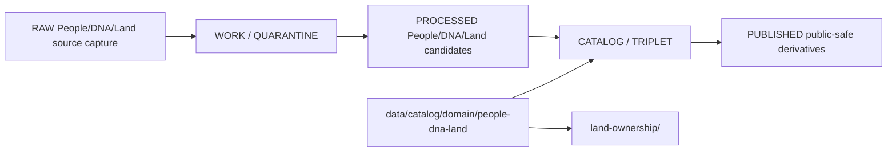

<!-- [KFM_META_BLOCK_V2]
doc_id: kfm://doc/data-catalog-domain-people-dna-land-readme
title: data/catalog/domain/people-dna-land/README.md — People/DNA/Land Domain Catalog README
version: v0.1
type: readme; data-lifecycle-sublane; restricted-domain-catalog-guide
status: draft; PROPOSED; data-root; catalog-stage; people-dna-land; restricted; release-gated; privacy-consent-aware
owners: OWNER_TBD — People/DNA/Land steward · Data steward · Catalog steward · Evidence steward · Source steward · Policy steward · Consent steward · Sensitivity reviewer · Release steward · Docs steward
created: NEEDS VERIFICATION — blank placeholder existed before v0.1 expansion
updated: 2026-06-24
policy_label: restricted-doc; data; catalog; people-dna-land; lifecycle; release-gated; privacy-consent-aware
tags: [kfm, data, catalog, people-dna-land, domain-catalog, CATALOG, TRIPLET, PersonAssertion, DNAEvidence, LandOwnershipAssertion, OwnershipInterval, EvidenceBundle, SourceDescriptor, ConsentGrant, RevocationReceipt, ReleaseManifest]
related:
  - ../../README.md
  - ../../../README.md
  - ./land-ownership/README.md
  - ../../../../docs/domains/people-dna-land/README.md
  - ../../../../docs/domains/people-dna-land/SENSITIVITY.md
  - ../../../../docs/domains/people-dna-land/sublanes/land.md
  - ../../../../docs/domains/people-dna-land/sublanes/genealogy.md
  - ../../../../docs/domains/people-dna-land/sublanes/dna.md
  - ../../../../docs/domains/people-dna-land/sublanes/people.md
  - ../../../../contracts/domains/people-dna-land/
  - ../../../../schemas/contracts/v1/domains/people-dna-land/
  - ../../../../policy/domains/people-dna-land/
  - ../../../../policy/sensitivity/people-dna-land/
  - ../../../../policy/consent/
  - ../../../../data/proofs/
  - ../../../../data/receipts/
  - ../../../../release/
notes:
  - "This file replaces a blank placeholder at `data/catalog/domain/people-dna-land/README.md`."
  - "People/DNA/Land is a high-sensitivity lane; living-person, DNA, private person-parcel joins, and DNA-derived outputs are deny/restrict by default."
  - "This domain has a documented segment-name conflict for some schema/contract/policy roots; catalog placement here uses the Directory Rules-style `people-dna-land` segment and remains PROPOSED/NEEDS VERIFICATION until ADR resolution."
  - "This folder is a CATALOG-stage domain catalog lane; it is not RAW, WORK, QUARANTINE, PROCESSED, PUBLISHED, proof storage, source registry, release authority, schema authority, policy code, consent authority, implementation code, or legal/title authority."
  - "Rollback target for this replacement is previous blank blob SHA `8b137891791fe96927ad78e64b0aad7bded08bdc`."
[/KFM_META_BLOCK_V2] -->

# data/catalog/domain/people-dna-land

> Restricted People/DNA/Land domain catalog lane for governed person, genealogy, DNA, and land-ownership catalog records inside the `CATALOG / TRIPLET` lifecycle stage.

  
  
  
  
  
  

**Status:** draft / PROPOSED  
**Path:** `data/catalog/domain/people-dna-land/README.md`  
**Owning root:** `data/catalog/domain/`  
**Domain segment:** `people-dna-land`  
**Lifecycle stage:** `CATALOG / TRIPLET`  
**Exposure posture:** restricted by default; public use requires explicit policy, consent/review where applicable, transform, and release linkage  
**Truth posture:** CONFIRMED target was blank · CONFIRMED parent catalog lane is RELEASED ONLY for public exposure · CONFIRMED People/DNA/Land doctrine is deny/restrict by default for living-person, DNA, private person-parcel joins, and DNA-derived outputs · CONFIRMED land-ownership child README now exists under this parent lane · NEEDS VERIFICATION for catalog inventory, schemas, validators, policy gates, consent gates, receipts, release manifests, access controls, and route behavior.

**Quick jumps:** [Purpose](#purpose) · [Lifecycle boundary](#lifecycle-boundary) · [Repo fit](#repo-fit) · [Accepted contents](#accepted-contents) · [Exclusions](#exclusions) · [Child lanes](#child-lanes) · [Catalog requirements](#catalog-requirements) · [Privacy, consent, and anti-collapse guardrails](#privacy-consent-and-anti-collapse-guardrails) · [Evidence ledger](#evidence-ledger) · [Validation checklist](#validation-checklist) · [Rollback](#rollback)

---

## Purpose

`data/catalog/domain/people-dna-land/` stores or stages catalog records and indexes for People/Genealogy/DNA/Land records after upstream evidence, source-role, rights, consent, sensitivity, review, and lifecycle gates have enough support for catalog-stage representation.

Likely catalog records include person assertions, relationship assertions, genealogy relationship hypotheses, family group context, DNA evidence references and derivative summaries, consent grants, revocation receipts, land-ownership assertions, ownership intervals, land instruments, parcel versions, legal descriptions, assessor/tax administrative context, public-safe derivatives, review records, and release-linked catalog indexes.

A domain catalog record supports discovery, steward review, catalog closure, and release preparation. It does **not** make a person, genealogy, DNA, land, ownership, title, parcel-boundary, consent, policy, or release claim true by itself.

## Lifecycle boundary

`data/catalog/domain/people-dna-land/` is a CATALOG-stage domain lane. Public exposure applies only to records tied to approved release state, governed route, evidence support, source-role support, rights/consent posture, sensitivity posture, and required receipts.

## Repo fit

| Responsibility | Correct home | Rule |
|---|---|---|
| People/DNA/Land domain catalog records | `data/catalog/domain/people-dna-land/` | This lane. |
| Land-ownership catalog sublane | `data/catalog/domain/people-dna-land/land-ownership/` | Child catalog sublane. |
| Parent catalog stage | `data/catalog/` | Parent CATALOG-stage lane. |
| People/DNA/Land domain doctrine | `docs/domains/people-dna-land/` | Human-facing domain doctrine. |
| Evidence/proof records | `data/proofs/` | EvidenceBundle and proof records. |
| Source registry | `data/registry/` or accepted source registry root | SourceDescriptor entries, rights, role, and activation state. |
| Receipts | `data/receipts/` | CatalogBuildReceipt, ReviewRecord, RedactionReceipt, PolicyDecision, ConsentGrant/RevocationReceipt linkage, correction receipts. |
| Release decisions | `release/` | Publication authority. |
| Schemas and policy | `schemas/`, `policy/` | Separate roots; segment naming remains NEEDS VERIFICATION/CONFLICTED where doctrine says so. |
| Package/helper code | `packages/domains/people-dna-land/` | Implementation support only. |

## Accepted contents

| Content | Purpose |
|---|---|
| Domain-level catalog indexes | Group-level indexes that point to People/DNA/Land catalog records. |
| Person and genealogy catalog entries | Assertion-first person, name, life-event, residence, migration, relationship, and family-group records. |
| DNA catalog entries | Restricted DNA evidence references and public-safe aggregate/derivative summaries where policy and consent allow. |
| Consent and revocation pointers | Links to ConsentGrant, RevocationReceipt, policy decisions, and downstream cleanup obligations. |
| Land-ownership catalog entries | Pointers to child land-ownership catalog records and release-safe derivatives. |
| Public-safe derivative pointers | Links to approved generalized, redacted, aggregated, k-anonymized, or otherwise transformed derivatives. |
| Evidence, source, policy, and receipt pointers | References to EvidenceBundle, SourceDescriptor, PolicyDecision, ReviewRecord, RedactionReceipt, ReleaseManifest, and validation reports. |

## Exclusions

| Do not put here | Correct home |
|---|---|
| RAW source files | `data/raw/people-dna-land/` or source-specific governed home |
| WORK/intermediate data | `data/work/people-dna-land/` |
| Quarantined data | `data/quarantine/people-dna-land/` |
| Processed datasets | `data/processed/people-dna-land/` |
| EvidenceBundle/proof records | `data/proofs/` |
| SourceDescriptor records | `data/registry/` or accepted source registry root |
| Receipts | `data/receipts/` |
| Release decisions | `release/` |
| Published public products | `data/published/.../people-dna-land/` |
| Semantic contracts | `contracts/` or accepted contract root |
| Schemas | `schemas/` |
| Policy, sensitivity, and consent rules | `policy/` |
| Package/helper code | `packages/domains/people-dna-land/` |
| Validators/tests/code | `tools/validators/`, `tests/`, implementation roots |

## Child lanes

| Child lane | Status | Purpose |
|---|---|---|
| `land-ownership/` | draft / PROPOSED | Restricted catalog sublane for land-ownership, parcel-context, title-sensitive, and chain-of-title catalog records. |

Additional child lanes should be added only when source, schema, policy, consent, receipt, release, and rollback expectations are clear enough to avoid misleading authority.

## Catalog requirements

PROPOSED until schemas, validators, inventory, and access controls are verified:

| Requirement | Meaning |
|---|---|
| Stable catalog identity | Record has a stable identity linked to source, evidence, derivative, or release object. |
| Assertion-first posture | Record preserves source assertion, evidence, reviewer state, and uncertainty. |
| Evidence reference | Record points to EvidenceBundle/proof context when claims depend on evidence. |
| Source reference | Record points to SourceDescriptor/source catalog where source authority matters. |
| Sensitivity and consent posture | Record links to sensitivity, rights, consent, revocation, privacy, and access posture when material. |
| Transform receipt | Public derivatives from restricted input link to RedactionReceipt, k-anonymization receipt, aggregation receipt, or equivalent transform receipt. |
| Release reference | Public or release-linked records point to ReleaseManifest and rollback target. |
| Closure compatibility | Domain catalog, STAC, DCAT, PROV, graph, and triplet views agree where those projections exist. |

## Privacy, consent, and anti-collapse guardrails

- People/DNA/Land catalog records are catalog carriers, not person, DNA, title, parcel-boundary, or ownership truth by themselves.
- Living-person, DNA, private person-parcel joins, and DNA-derived outputs are deny/restrict by default unless explicit evidence, policy, review, consent where applicable, and release posture support a derivative.
- Raw DNA segment data, vendor IDs, and triangulation outputs must not become public catalog material.
- Person assertions are evidence-bound assertions, not canonical person truth without review and evidence.
- Land ownership remains temporal and evidence-bound; assessor/tax records and parcel geometry are not title truth.
- Consent revocation requires tombstone/cleanup/embargo handling wherever downstream artifacts depend on consent.
- Neighboring domains may supply context, but they do not weaken person, DNA, title, parcel, consent, or privacy controls.
- Unreleased People/DNA/Land catalog records are not public merely because they exist under this directory.

## Evidence ledger

| Source | Status | Supports | Limits |
|---|---|---|---|
| `data/catalog/domain/people-dna-land/README.md` previous file | CONFIRMED | Target existed as a blank placeholder. | Did not define lane boundaries. |
| `data/catalog/README.md` | CONFIRMED | Parent catalog lane, domain catalog layout, RELEASED ONLY public posture. | Does not prove People/DNA/Land catalog inventory. |
| `docs/domains/people-dna-land/README.md` | CONFIRMED doctrine / PROPOSED implementation | People/DNA/Land sensitivity defaults, evidence-first assertions, DNA and consent controls, assessor/tax and parcel anti-collapse, segment-name conflict. | Implementation details remain NEEDS VERIFICATION. |
| `docs/domains/people-dna-land/SENSITIVITY.md` | CONFIRMED doctrine / PROPOSED implementation | Bounded-context boundary and T4/deny-default posture. | Some path placements remain PROPOSED and conflict-tracked. |
| `data/catalog/domain/people-dna-land/land-ownership/README.md` | CONFIRMED child README | Existing land-ownership child catalog sublane. | Does not prove parent catalog inventory or release state. |

## Validation checklist

- [ ] Confirm actual child files and People/DNA/Land catalog inventory under this lane.
- [ ] Confirm domain catalog schema/profile location and segment naming.
- [ ] Confirm access policy, consent policy, validators, and CI checks.
- [ ] Confirm EvidenceBundle, SourceDescriptor, RunReceipt, ValidationReport, PolicyDecision, ReviewRecord, RedactionReceipt, ConsentGrant/RevocationReceipt, ReleaseManifest, and rollback references.
- [ ] Confirm person assertion, DNA, consent, genealogy, land-ownership, parcel, and public derivative source-role separation.
- [ ] Confirm living-person, DNA, person-parcel join, title-sensitive, rights, consent, privacy, stale-state, and review handling.
- [ ] Confirm correction, withdrawal, tombstone, supersession, revocation, downstream cleanup, and rollback behavior for stale or failed records.

## Rollback

Rollback is required if this lane becomes a People/DNA/Land raw-data root, work area, quarantine store, processed-data store, proof store, source-registry root, release-decision root, published-output root, semantic-contract root, schema root, policy root, consent root, validator root, implementation root, legal/title/person/DNA authority, or public exposure shortcut.

Rollback target for this replacement: previous blank blob SHA `8b137891791fe96927ad78e64b0aad7bded08bdc`.

<a href="#top">Back to top</a>

