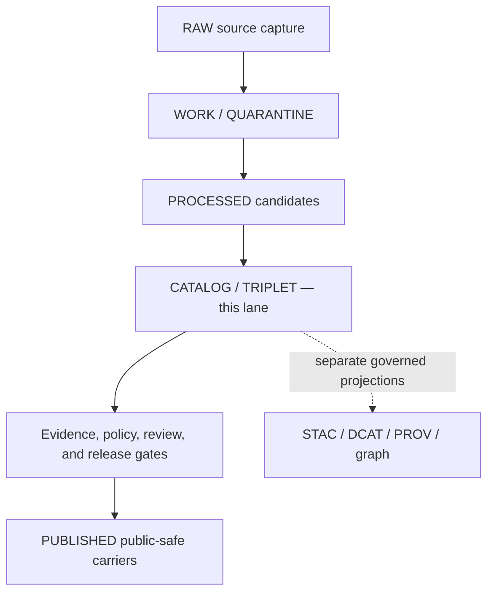

<!-- [KFM_META_BLOCK_V2]
doc_id: kfm://doc/data-catalog-domain-people-dna-land-readme
title: data/catalog/domain/people-dna-land/README.md — Governed People / Genealogy / DNA / Land Catalog Lane
version: v0.2.0
type: readme; data-lifecycle-sublane; restricted-domain-catalog-guide; release-gated; privacy-consent-aware
status: repository-grounded draft; canonical placement; proposed realization; catalog-stage; restricted; privacy-consent-aware; release-gated
owners: NEEDS VERIFICATION — People/DNA/Land, people, genealogy, DNA, land-records, data, catalog, evidence, source, privacy, consent, sensitivity, policy, review, release, correction, rollback, schema, validation, and docs stewards
created: NEEDS VERIFICATION — blank placeholder existed before v0.1 expansion
updated: 2026-07-25
policy_label: restricted-doc; data-catalog; people-dna-land; restricted-domain; privacy-consent-aware; release-gated
current_path: data/catalog/domain/people-dna-land/README.md
historical_blank_blob: 8b137891791fe96927ad78e64b0aad7bded08bdc
prepared_under_prompt: KFM Markdown Modernization & GitHub Documentation Implementation Agent v4.0.0
review_packet_id: kfm-pdl-domain-catalog-readme-20260725
truth_posture: >
  CONFIRMED exact path, stable document identity, Directory Rules placement,
  parent catalog posture, People/DNA/Land doctrine, current child, contract,
  schema, policy, consent, source-registry, fixture, test, validator, pipeline,
  receipt, proof, release-candidate, published-layer, workflow, CODEOWNERS, and
  repository-relative link surfaces / PROPOSED concrete People/DNA/Land catalog
  profile, record realization, deterministic validation, policy and consent
  enforcement, CatalogMatrix closure, release, correction, and rollback
  behavior / CONFLICTED domain-segment, source-role, schema-documentation, and
  consent-placement claims across inspected surfaces / UNKNOWN recursive record
  inventory, active producers and consumers, runtime reads, hosts, caches,
  public effects, emitted projections, released artifacts, and operational
  correction or rollback / NEEDS VERIFICATION accountable stewardship,
  accepted ADR decisions, schema and profile maturity, source activation,
  rights, privacy and consent enforcement, release closure, and public-client
  exclusion
evidence_snapshot:
  repository: bartytime4life/Kansas-Frontier-Matrix
  base_ref: main
  base_commit: 73214c6a6aa6ac14f729e8c15c00014a1ffdd04f
  initial_preflight_commit: 01af6d30466898fb029f2f6e337f11e54d086f1a
  continuity_compare: 01af6d30466898fb029f2f6e337f11e54d086f1a...73214c6a6aa6ac14f729e8c15c00014a1ffdd04f
  prior_blob: 49f9827c175acb7310d440408586e339d95412ce
  historical_blank_blob: 8b137891791fe96927ad78e64b0aad7bded08bdc
  method: complete target read plus bounded governing-neighbor, workflow, branch, pull-request, exact-path, and repository-search inspection; base drift was reconciled by comparing the initial preflight commit to the final evidence base and confirming only Roads/Rail/Trade, Settlement, Soil, and Fauna surfaces changed; no recursive clone, catalog-payload sampling, fixture-payload execution, runtime, deployment, host, cache, external-store, DNA record, living-person record, cadastral record, title record, or legal record inspection
related:
  - ./land-ownership/README.md
  - ../README.md
  - ../../README.md
  - ../../../README.md
  - ../../../../docs/domains/people-dna-land/README.md
  - ../../../../docs/domains/people-dna-land/SENSITIVITY.md
  - ../../../../docs/domains/people-dna-land/CANONICAL_PATHS.md
  - ../../../../docs/domains/people-dna-land/DATA_LIFECYCLE.md
  - ../../../../docs/domains/people-dna-land/sublanes/people.md
  - ../../../../docs/domains/people-dna-land/sublanes/genealogy.md
  - ../../../../docs/domains/people-dna-land/sublanes/dna.md
  - ../../../../docs/domains/people-dna-land/sublanes/land.md
  - ../../../../contracts/domains/people-dna-land/README.md
  - ../../../../schemas/contracts/v1/domains/people-dna-land/README.md
  - ../../../../schemas/contracts/v1/domains/people-dna-land/catalog_matrix.schema.json
  - ../../../../policy/domains/people-dna-land/README.md
  - ../../../../policy/consent/people-dna-land/README.md
  - ../../../../policy/sensitivity/people-dna-land/person_parcel_join.deny.rego
  - ../../../registry/people-dna-land/file_register.yaml
  - ../../../registry/people-dna-land/verification_backlog.yaml
  - ../../../receipts/people-dna-land/README.md
  - ../../../proofs/people-dna-land/README.md
  - ../../../published/layers/people-dna-land/README.md
  - ../../../../fixtures/domains/people-dna-land/README.md
  - ../../../../tests/domains/people-dna-land/README.md
  - ../../../../tests/domains/people-dna-land/test_people_dna_land_smoke.py
  - ../../../../tools/validators/domains/people-dna-land/README.md
  - ../../../../tools/validators/domains/people-dna-land/validate_catalog_matrix.py
  - ../../../../pipelines/domains/people-dna-land/README.md
  - ../../../../pipeline_specs/people-dna-land/README.md
  - ../../../../release/candidates/people-dna-land/README.md
  - ../../../../docs/adr/ADR-0001-schema-home--schemas-contracts-v1-is-canonical.md
  - ../../../../docs/adr/ADR-0010-deny-by-default-for-dna-rare-species-archaeology-infrastructure.md
  - ../../../../docs/adr/ADR-0011-receipts-vs-proofs-vs-manifests-vs-catalog-separation.md
  - ../../../../docs/adr/ADR-0015-data-published-_domain_-current-alias-is-governed-by-rollback_card.md
  - ../../../../docs/adr/ADR-0018-promotion-gate-sequence.md
  - ../../../../docs/adr/ADR-0022-catalog-matrix--stac-+-dcat-+-prov-must-agree.md
  - ../../../../docs/adr/ADR-0024-steward-separation-of-duties-for-release.md
  - ../../../../docs/adr/ADR-0025-public-client-never-reads-canonical-internal-stores.md
  - ../../../../docs/doctrine/directory-rules.md
  - ../../../../.github/workflows/domain-people-dna-land.yml
  - ../../../../.github/workflows/link-check.yml
  - ../../../../.github/CODEOWNERS
tags: [kfm, data, catalog, people-dna-land, domain-catalog, CATALOG, TRIPLET, PersonAssertion, DNAEvidence, LandOwnershipAssertion, OwnershipInterval, EvidenceBundle, SourceDescriptor, ConsentGrant, RevocationReceipt, ReleaseManifest, restricted-domain, privacy, consent, catalog-matrix, cite-or-abstain]
notes:
  - "Directory Rules sections 4 and 12 confirm this data/catalog/domain/<domain> responsibility placement."
  - "Directory Rules section 15 directly governs canonical and compatibility roots, not this nested lane; its ordered README sections are adopted here as a consistency contract."
  - "All v0.1 heading fragments remain available through headings or explicit legacy anchors."
  - "The current catalog path is confirmed; conflicting people-dna-land and people segment guidance elsewhere is preserved for reviewed resolution."
  - "The current source registry and older domain documents use incompatible source-role vocabularies; this README does not normalize that conflict."
  - "Concrete JSON Schema files now exist despite stale schema README language, but sampled domain schemas remain PROPOSED and permissive scaffolds."
  - "This Markdown-only revision creates no catalog record, person or relationship fact, DNA interpretation, consent decision, ownership or title conclusion, source activation, schema acceptance, policy enforcement, projection, receipt, proof, release, publication, public route, correction, or rollback execution."
  - "Static badges project verified documentation posture only; they do not assert validator, CI, security, privacy, consent, legal, release, or publication maturity."
[/KFM_META_BLOCK_V2] -->

# `data/catalog/domain/people-dna-land/` — Governed People / Genealogy / DNA / Land Catalog Lane

> **One-line purpose.** Define the governed home for People, genealogy, DNA, and land catalog records and indexes at the `CATALOG / TRIPLET` stage while keeping identity, source, evidence, rights, privacy, consent, policy, review, release, correction, rollback, and legal authority independently governed.

> [!IMPORTANT]
> A catalog record supports discovery, steward review, interoperability, projection, and release preparation. Placement here does **not** make a person assertion, relationship hypothesis, DNA inference, consent state, ownership assertion, parcel boundary, title conclusion, policy outcome, review, release, or public route true or authoritative. Those responsibilities remain separate governed objects and processes.

<!-- governance-alert-separator -->

> [!CAUTION]
> This lane is restricted and release-gated. Living-person data, raw DNA or genomic material, private person-parcel joins, protected addresses, vendor identifiers, raw DNA segments, and sensitive derivatives must fail closed unless the complete applicable evidence, rights, privacy, consent, policy, review, transformation, release, correction, and rollback posture is established.

**Quick navigation:** [Purpose](#purpose) · [Authority](#authority-level) · [Status](#status) · [Belongs](#what-belongs-here) · [Exclusions](#what-does-not-belong-here) · [Inputs](#inputs) · [Outputs](#outputs) · [Validation](#validation) · [Review](#review-burden) · [Related](#related-folders) · [ADRs](#adrs) · [Boundary](#lifecycle-and-catalog-boundary) · [Children](#child-lanes) · [Requirements](#catalog-requirements) · [Guardrails](#privacy-consent-and-anti-collapse-guardrails) · [Projections](#projection-and-catalog-closure) · [Evidence](#evidence-ledger) · [Release](#release-correction-and-rollback-closure) · [Rollback](#rollback) · [Verification](#open-verification-register) · [Done](#definition-of-done) · [No-loss](#no-loss-ledger) · [Last reviewed](#last-reviewed)

## Purpose

`data/catalog/domain/people-dna-land/` is the canonical responsibility placement for governed People, genealogy, DNA, and land catalog records and indexes within the `CATALOG / TRIPLET` lifecycle stage.

Candidate catalog families include person and relationship assertions, genealogy relationship hypotheses, family-group context, DNA evidence references and public-safe derivative summaries, consent and revocation pointers, land-ownership assertions, ownership intervals, land instruments, parcel versions, legal-description references, assessor and tax administrative context, public-safe derivative pointers, review references, and release-linked indexes. Listing a family here does not prove that its profile, records, sources, evidence, schema, validator, policy, consent control, release, or public representation exists.

This lane organizes governed references. It does not own source truth, canonical person truth, biological or genealogical truth, raw DNA, consent authority, legal or title determinations, cadastral or survey authority, semantic contracts, machine schemas, policy, evidence, release authority, or public delivery.

## Authority level

**Canonical responsibility placement for People/DNA/Land domain catalog records / repository-grounded draft / concrete catalog profile and realization PROPOSED / not source, evidence, identity, consent, policy, legal, title, release, or publication authority.**

This lane may carry catalog descriptors and governed references. It cannot replace semantic meaning under `contracts/`, machine shape under `schemas/`, admissibility under `policy/`, source identity and activation under `data/registry/`, process memory under `data/receipts/`, EvidenceBundles and proof support under `data/proofs/`, release decisions under `release/`, public-safe carriers under `data/published/`, or competent legal, title, survey, court, recorder, tribal, medical, genetic-counseling, or other authoritative processes.

## Status

| Field | Bounded result |
|---|---|
| Path | `data/catalog/domain/people-dna-land/README.md` |
| Version | `v0.2.0` |
| Base evidence | `main@73214c6a6aa6ac14f729e8c15c00014a1ffdd04f` |
| Prior blob | `49f9827c175acb7310d440408586e339d95412ce` (`v0.1`) |
| Historical blank predecessor | `8b137891791fe96927ad78e64b0aad7bded08bdc` |
| Placement | `CONFIRMED` existing People/DNA/Land domain lane under the governed catalog path |
| Concrete catalog profile and records | `PROPOSED / NEEDS VERIFICATION` |
| Bounded path search | The parent README and `land-ownership/README.md` surfaced; no non-README catalog payload surfaced |
| Recursive catalog-record inventory | `UNKNOWN`; bounded search is not a recursive tree proof |
| Active producers, consumers, runtime reads, hosts, caches, or public effects | `UNKNOWN` |
| Child catalog lane | `land-ownership/` is confirmed; its concrete record realization remains proposed |
| People/DNA/Land STAC, DCAT, PROV, graph, and triplet children | No domain-specific child surfaced in bounded inspection; exhaustive absence remains `NEEDS VERIFICATION` |
| Domain segment convention | `CONFLICTED`; the current catalog placement uses `people-dna-land`, while older crosswalk material uses `people` for selected responsibility roots |
| Domain contract lane | Documentation and proposed semantic objects exist; no accepted domain catalog-record contract was established |
| Domain schema lane | Concrete JSON Schema files exist despite stale README language; sampled shapes are `PROPOSED`, permissive scaffolds |
| CatalogMatrix pairing | The sampled schema names `contracts/domains/people-dna-land/catalog_matrix.md`; that exact contract path did not resolve |
| Source registration | File register and verification backlog are empty; sampled source descriptors are templates with material `TBD` fields |
| Source-role vocabulary | `CONFLICTED`; inspected current and older surfaces use incompatible role sets |
| Policy and consent | Domain modules are proposed scaffolds; consent documentation is README-only and placement-conflicted; active enforcement is not established |
| Validators, tests, fixtures, pipelines, and specs | Documentation or scaffolding exists; validators raise `NotImplementedError`, the domain smoke test is a placeholder, pipelines are comments, and no payload fixture surfaced in bounded inspection |
| Proof, receipt, release candidate, and published lanes | Documentation exists; emitted domain outputs, approved candidate, ReleaseManifest, public artifact, and public route remain unproved |
| Domain workflow | Read-only readiness and hold workflow; it deliberately reports that executable validation and consent enforcement are not established |
| Public exposure | `RESTRICTED / RELEASE-GATED / FAIL CLOSED` |
| Human review | `PENDING` |

## What belongs here

| Accepted family | Required posture |
|---|---|
| Domain-level catalog records and indexes | Stable identity, object family, lifecycle state, evidence, source role, sensitivity, rights, policy, review, and release posture |
| Person assertion descriptors | Assertion-first identity, source and evidence references, temporal scope, uncertainty, conflict, review, and correction state |
| Relationship and genealogy hypothesis descriptors | Explicit hypothesis status, participants as governed references, evidence, uncertainty, conflicts, temporal scope, and reviewer state |
| Family-group and historical context descriptors | Bounded context without silently asserting current identity, relationship, household, residence, or living status |
| DNA evidence references | Restricted references to governed evidence; never raw sequence, segment, kit, vendor, triangulation, or living-person disclosure by catalog placement |
| Public-safe DNA derivative pointers | Aggregate, deidentified, policy-admitted, consent-compatible where applicable, reviewed, release-linked derivatives only |
| Consent and revocation pointers | Resolvable governed references plus affected-scope and downstream cleanup obligations; never a substitute for consent authority |
| Land-ownership catalog pointers | References to governed child records and release-safe derivatives with temporal, evidentiary, legal, and title limitations |
| Public-safe derivative pointers | Generalized, aggregated, deidentified, redacted, policy-admitted, review-approved, and release-linked representations only |
| Evidence, source, policy, receipt, and review pointers | Resolvable governed references without duplicating their authority here |
| Release, correction, withdrawal, supersession, and rollback pointers | Immutable governed references without treating catalog placement as release |

Records should be deterministic where practical, bounded in scope, correctable, and explicit about whether they are internal candidates, reviewable records, release-linked records, withdrawn records, superseded records, disputed records, historical records, or public-safe derivatives.

## What does NOT belong here

| Prohibited family | Governed home or action |
|---|---|
| RAW people, genealogy, DNA, land, instrument, assessor, tax, parcel, court, survey, or source captures | `data/raw/people-dna-land/` only when an accepted lane and handling plan exist |
| WORK, intermediate, OCR, geocoding, matching, entity-resolution, relationship-inference, or chain-construction data | `data/work/people-dna-land/` only when accepted |
| Quarantined, conflicted, or policy-held payloads | `data/quarantine/people-dna-land/` only when accepted |
| Processed person, relationship, DNA, ownership, parcel, instrument, or derivative payloads | `data/processed/people-dna-land/` only when accepted |
| STAC, DCAT, PROV, graph, or triplet records | Governed projection lanes when accepted and created |
| Source descriptors, activation decisions, rights terms, sensitivity labels, datasets, layers, or crosswalk rows | `data/registry/` |
| EvidenceBundles, ProofPacks, attestations, or proof reports | `data/proofs/` |
| Run, validation, catalog-build, policy, consent, review, correction, or release receipts | `data/receipts/` |
| Contracts, schemas, policy modules, validators, fixtures, tests, packages, tools, pipelines, or workflows | Their owning responsibility roots |
| ReleaseManifest, PromotionDecision, RollbackCard, CorrectionNotice, withdrawal, supersession, signature, or release authority | `release/` |
| Published layers, reports, stories, downloads, APIs, indexes, tiles, or other public-safe carriers | `data/published/` after governed release |
| Direct public reads, UI caches, search indexes, AI retrieval corpora, or hosting output | Governed interfaces and approved runtime or output stores |
| Canonical person, genealogy, biological, ownership, title, boundary, heirship, legal-effect, or medical conclusions | Competent authoritative processes, never catalog placement |
| Raw DNA, raw vendor identifiers or segments, living-person dossiers, private person-parcel joins, protected addresses, credentials, or precise restricted outputs | Deny, quarantine, restrict, generalize, aggregate, deidentify, redact, or withhold under policy and review |

## Inputs

Catalog inputs should be governed references and validated derivatives, not raw truth by placement:

- processed object identities, versions, digests, object families, temporal roles, jurisdictions, and bounded spatial support;
- source-registry references with admitted source role, activation decision, rights, current terms, sensitivity, retrieval context, and issuing authority identity;
- accepted contracts, schemas, catalog profiles, policy decisions, applicable consent decisions, and review records;
- EvidenceRef-to-EvidenceBundle resolution and applicable proof support;
- `CatalogBuildReceipt`, `RunReceipt`, `ValidationReport`, `RedactionReceipt`, applicable `ConsentGrant` or `RevocationReceipt`, PolicyDecision, correction, and release-support receipts;
- STAC, DCAT, PROV, graph, and triplet references when those projections exist;
- immutable release, correction, withdrawal, supersession, and rollback references.

Unknown or conflicted identity, source role, rights, sensitivity, living status, consent applicability, policy, evidence, review, release, correction, or rollback state holds a record from public-bound or current-state use.

## Outputs

This lane may emit or support:

- internal or reviewable People/DNA/Land catalog records;
- deterministic domain indexes and bounded catalog subsets;
- catalog-side identity, lineage, source-role, temporal, sensitivity, consent-reference, review, correction, and release metadata;
- domain references used by separately governed STAC, DCAT, PROV, graph, and triplet projections;
- release-linked descriptors for public-safe derivatives after all applicable gates close;
- correction, withdrawal, supersession, revocation-impact, and rollback references.

This lane must not emit source-of-truth identity, raw DNA, legal or title conclusions, policy decisions, consent grants, evidence bundles, release decisions, public routes, or mutable `current` state without the separately governed authority that owns each object.

## Validation

### Checks this README revision can support

- one H1, stable document identity, legacy fragments, valid local anchors, balanced fences, and final newline;
- repository-relative links resolved against the pinned base;
- Mermaid syntax parsed;
- static badges linked to explanatory sections;
- no credentials, private endpoints, personal records, precise restricted coordinates, or raw sensitive payloads;
- exact one-file diff, branch-base pin, remote byte readback, and draft review posture.

Passing those checks validates this documentation change only. It does not validate a catalog profile, record, schema, contract, source, fixture, policy, consent decision, privacy control, release candidate, projection, artifact, route, correction, or rollback.

### Future record-level fail-closed checks

| Gate | Hold or reject when |
|---|---|
| Identity and version | Record, object family, version, digest, subject, or temporal role is missing, unstable, or conflicted |
| Contract and schema | Accepted semantic contract, closed schema, schema version, profile, or validator is absent or incompatible |
| Source and rights | SourceDescriptor, activation, role, authority, rights, current terms, retrieval context, or citation is missing or unresolved |
| Evidence | EvidenceRef does not resolve, evidence is insufficient for the claim, or assertion and evidence have been collapsed |
| Sensitivity and privacy | Living status, protected status, join risk, precise-location risk, reidentification risk, or disclosure class is unknown or disallowed |
| Consent | Applicability, grant, scope, purpose, expiry, revocation, affected derivatives, or cleanup state is unresolved |
| DNA | Raw sequence, segment, kit, vendor identifier, triangulation, living-person association, or disallowed inference is present |
| Genealogy and identity | A hypothesis is presented as fact, conflicting assertions are hidden, or uncertain identity is silently collapsed |
| Land and title | Assessor or tax evidence is presented as title, geometry as boundary, or a catalog descriptor as a legal conclusion |
| Transform | Required redaction, aggregation, generalization, deidentification, or other privacy transform lacks an integrity-bound receipt |
| Projection closure | Required domain catalog, STAC, DCAT, PROV, graph, or triplet identity and release state disagree |
| Review and release | Required accountable review, PromotionDecision, ReleaseManifest, correction state, or rollback reference is absent |
| Runtime and public client | Public routing, cache, search, download, UI, AI, or API behavior bypasses governed release resolution |

Current repository code does not establish these record-level checks for this lane. The tracked validator modules are scaffolds and the domain workflow intentionally holds graduation.

## Review burden

`.github/CODEOWNERS` currently routes the default repository path to `@bartytime4life`. That is review routing only; it does not prove accepted stewardship, required approval, independent review, separation of duties, privacy expertise, consent authority, domain expertise, or release authority.

Changes to this lane should request the smallest applicable accountable review set:

- People/DNA/Land domain and catalog stewardship;
- people or genealogy expertise for identity and relationship assertion changes;
- DNA, privacy, sensitivity, and consent review for genomic or living-person surfaces;
- land-records, rights, and legal-domain review for land-ownership surfaces;
- evidence and source-registry review for source-role or authority claims;
- contract, schema, validation, policy, and security review for enforcement changes;
- release, correction, rollback, and public-client review for release-bound changes;
- docs review for identity, placement, links, anchors, and no-loss preservation.

Generated prose, bots, workflow status, CODEOWNERS routing, comments, or multiple usernames do not by themselves prove accountable or independent approval.

## Related folders

| Responsibility | Repository surface | Current bounded posture |
|---|---|---|
| Parent catalog stage | [`data/catalog/`](../../README.md) | Governed catalog responsibility; public use remains release-gated |
| Domain catalog index | [`data/catalog/domain/`](../README.md) | Domain catalog parent |
| Land-ownership child | [`land-ownership/`](./land-ownership/README.md) | Repository-grounded draft; concrete realization proposed |
| Domain doctrine | [`docs/domains/people-dna-land/`](../../../../docs/domains/people-dna-land/README.md) | Draft doctrine and implementation guidance; contains tracked conflicts |
| Sensitivity doctrine | [`SENSITIVITY.md`](../../../../docs/domains/people-dna-land/SENSITIVITY.md) | Deny/restrict posture for high-risk classes |
| Canonical-path register | [`CANONICAL_PATHS.md`](../../../../docs/domains/people-dna-land/CANONICAL_PATHS.md) | Records current and legacy segment tension |
| Semantic contracts | [`contracts/domains/people-dna-land/`](../../../../contracts/domains/people-dna-land/README.md) | Draft/proposed domain semantics |
| Machine schemas | [`schemas/contracts/v1/domains/people-dna-land/`](../../../../schemas/contracts/v1/domains/people-dna-land/README.md) | Concrete but proposed and sampled as permissive scaffolds |
| Domain policy | [`policy/domains/people-dna-land/`](../../../../policy/domains/people-dna-land/README.md) | Greenfield scaffold |
| Consent guidance | [`policy/consent/people-dna-land/`](../../../../policy/consent/people-dna-land/README.md) | README-only, path-conflicted, enforcement unproved |
| Source state | [`file_register.yaml`](../../../registry/people-dna-land/file_register.yaml) and [`verification_backlog.yaml`](../../../registry/people-dna-land/verification_backlog.yaml) | Both empty at the pinned base |
| Domain receipts | [`data/receipts/people-dna-land/`](../../../receipts/people-dna-land/README.md) | Guidance; emitted domain receipts unproved |
| Domain proofs | [`data/proofs/people-dna-land/`](../../../proofs/people-dna-land/README.md) | Proposed guidance; emitted proof files unproved |
| Domain fixtures and tests | [`fixtures/domains/people-dna-land/`](../../../../fixtures/domains/people-dna-land/README.md) and [`tests/domains/people-dna-land/`](../../../../tests/domains/people-dna-land/README.md) | Documentation plus placeholder smoke test; no catalog payload fixture surfaced |
| Domain validators | [`tools/validators/domains/people-dna-land/`](../../../../tools/validators/domains/people-dna-land/README.md) | Placeholder modules; executable catalog validation unestablished |
| Domain pipelines | [`pipelines/domains/people-dna-land/`](../../../../pipelines/domains/people-dna-land/README.md) | Stage files are greenfield comments |
| Pipeline specifications | [`pipeline_specs/people-dna-land/`](../../../../pipeline_specs/people-dna-land/README.md) | Proposed documentation |
| Release candidates | [`release/candidates/people-dna-land/`](../../../../release/candidates/people-dna-land/README.md) | Candidate guidance; an approved candidate is unproved |
| Published carriers | [`data/published/layers/people-dna-land/`](../../../published/layers/people-dna-land/README.md) | Documentation; emitted artifacts and public route unknown |

Compatibility or legacy surfaces such as `catalog/domain/people-dna-land/` and `data/catalog/domain/people/dna/` do not supersede this path. They must remain redirects, compatibility guidance, or migration evidence unless a reviewed decision changes canonical placement.

## ADRs

The following records are relevant design and governance context. Each is `proposed` at the inspected revision; linking it here does not accept it or prove implementation:

| ADR | Proposed relationship to this lane |
|---|---|
| [`ADR-0001`](../../../../docs/adr/ADR-0001-schema-home--schemas-contracts-v1-is-canonical.md) | Canonical schema-home convention |
| [`ADR-0010`](../../../../docs/adr/ADR-0010-deny-by-default-for-dna-rare-species-archaeology-infrastructure.md) | Deny-by-default posture for DNA and other high-risk material |
| [`ADR-0011`](../../../../docs/adr/ADR-0011-receipts-vs-proofs-vs-manifests-vs-catalog-separation.md) | Separation of receipts, proofs, manifests, and catalogs |
| [`ADR-0015`](../../../../docs/adr/ADR-0015-data-published-_domain_-current-alias-is-governed-by-rollback_card.md) | Proposed release alias and rollback relationship |
| [`ADR-0018`](../../../../docs/adr/ADR-0018-promotion-gate-sequence.md) | Proposed ordered promotion gates |
| [`ADR-0022`](../../../../docs/adr/ADR-0022-catalog-matrix--stac-+-dcat-+-prov-must-agree.md) | Proposed catalog/STAC/DCAT/PROV agreement |
| [`ADR-0024`](../../../../docs/adr/ADR-0024-steward-separation-of-duties-for-release.md) | Proposed independently attributable release review |
| [`ADR-0025`](../../../../docs/adr/ADR-0025-public-client-never-reads-canonical-internal-stores.md) | Proposed public-client trust boundary |

## Lifecycle and catalog boundary

```mermaid
flowchart TD
  RAW["RAW source capture"] --> HELD["WORK / QUARANTINE"]
  HELD --> PROCESSED["PROCESSED candidates"]
  PROCESSED --> CATALOG["CATALOG / TRIPLET — this lane"]
  CATALOG --> GATES["Evidence, policy, review, and release gates"]
  GATES --> PUBLISHED["PUBLISHED public-safe carriers"]
  CATALOG -. "separate governed projections" .-> PROJECTIONS["STAC / DCAT / PROV / graph"]
```

This folder owns catalog-stage domain responsibility only. It is not a RAW, WORK, QUARANTINE, PROCESSED, or PUBLISHED store. It is also not a proof store, receipt store, source registry, schema or contract home, policy or consent engine, implementation root, release authority, public API, legal/title authority, or canonical identity store.

Transitions are governed, not implied by file movement:

1. upstream source and processed candidates retain identity, evidence, rights, temporal, uncertainty, and sensitivity context;
2. catalog assembly creates deterministic descriptors and references without collapsing those objects;
3. separately governed projections agree on shared identity and release state where required;
4. validation, policy, consent where applicable, accountable review, release, correction, and rollback gates close;
5. only approved public-safe carriers become eligible for governed public delivery.

A file, schema pass, workflow pass, pull request, merge, generated receipt, or catalog entry cannot skip this sequence.

## Child lanes

| Child lane | Current bounded status | Purpose |
|---|---|---|
| [`land-ownership/`](./land-ownership/README.md) | Repository-grounded draft; concrete profile, records, validators, projection closure, and release remain proposed or unproved | Restricted land-ownership, parcel-context, title-sensitive, temporal, evidentiary, and public-safe derivative catalog guidance |

No separate people, genealogy, or DNA catalog child is established by this README. Additional children should be created only after responsibility, naming, identity, source role, contract, schema, policy, privacy, consent applicability, fixture, validator, projection, release, correction, and rollback expectations are reviewed well enough to avoid false authority or path drift.

## Catalog requirements

The requirements below are a proposed target contract until accepted schemas, profiles, fixtures, validators, policies, access controls, and release integration exist.

| Requirement | Minimum catalog posture |
|---|---|
| Stable identity and version | Durable record identifier, object family, version, digest, lifecycle state, and supersession/correction state |
| Assertion-first meaning | Source assertion, hypothesis, evidence, uncertainty, conflict, reviewer state, and temporal scope remain distinguishable |
| Evidence reference | Claim-bearing records resolve to EvidenceBundle or proof context without embedding proof authority in the catalog |
| Source reference | SourceDescriptor, source role, authority limits, activation state, rights, retrieval context, and citation are resolvable |
| Sensitivity and privacy | Disclosure class, living-status posture, join risk, precision risk, transformation state, and access posture are explicit |
| Consent posture | Applicability, grant or lawful basis where required, purpose, scope, expiry, revocation, affected outputs, and cleanup state are resolvable |
| Temporal posture | Assertion, observation, source, instrument, recording, effective, retrieval, correction, and release times are not silently collapsed |
| Transform receipt | Restricted-to-public derivatives resolve to RedactionReceipt, aggregation, generalization, deidentification, k-anonymization, or equivalent transform evidence |
| Review and policy | Accountable review and PolicyDecision references are bound to the exact record/version and required context |
| Release and rollback | Public-bound records resolve to approved PromotionDecision, ReleaseManifest, immutable artifact identity, correction state, and RollbackCard |
| Projection closure | Domain catalog and required STAC, DCAT, PROV, graph, and triplet projections agree on identity, lineage, sensitivity, and release state |

The sampled `catalog_matrix.schema.json` is a permissive `PROPOSED` scaffold, and its named domain contract path did not resolve. It is not an accepted implementation of these requirements.

## Privacy, consent, and anti-collapse guardrails

- **Catalog is not truth.** A record is a governed carrier, not canonical person, relationship, genealogy, DNA, ownership, title, parcel, boundary, consent, policy, or release truth.
- **Person assertions stay assertions.** Conflicts, source attribution, uncertainty, evidence, time, and reviewer state must remain visible; identity resolution cannot silently fuse people.
- **Genealogy hypotheses stay hypotheses.** A suggested parent, spouse, household, migration, or family relationship must not become fact through indexing, search rank, graph projection, or AI narration.
- **Raw DNA stays out.** Raw sequence, segment, kit, vendor identifier, triangulation output, living-person association, and disallowed inference must not become public catalog material.
- **DNA derivatives remain sensitive.** Aggregation or deidentification does not by itself prove non-reidentification, consent compatibility, policy admission, or release safety.
- **Living persons fail closed.** Unknown living status is not permission. Protected addresses, contact details, private relationships, and person-parcel joins require explicit controls and review.
- **Consent is scoped and revocable.** A consent pointer is not authority by presence. Purpose, scope, affected objects, expiry, revocation, cleanup, tombstone, embargo, and downstream invalidation must remain enforceable.
- **Land evidence is not title.** Assessor and tax records are administrative evidence, parcel geometry is not an adjudicated or surveyed boundary, and KFM does not determine legal ownership, title, heirship, encumbrances, or instrument effect.
- **Source roles do not collapse.** Observed, regulatory, modeled, aggregate, administrative, candidate, synthetic, primary, corroborating, context, and other tracked terms must not be normalized until their conflict is resolved.
- **Time roles do not collapse.** Event, effective, observed, recorded, retrieved, corrected, released, withdrawn, and superseded times are independently meaningful.
- **Neighbor context cannot weaken controls.** Cross-domain joins inherit the strictest applicable sensitivity, rights, consent, precision, evidence, and release posture.
- **AI remains subordinate.** AI may assist search, comparison, explanation, or review, but cannot invent evidence, resolve identity, infer consent, determine title, waive policy, approve release, or override abstention.
- **Existence is not publication.** A catalog file, record, generated receipt, workflow result, PR, merge, or repository URL does not create public authority.

When required support is absent, stale, conflicted, revoked, or unverifiable, the safe outcomes are `DENY`, `ABSTAIN`, hold, quarantine, withdraw, or correct—not silent completion.

## Projection and catalog closure

The inspected repository provides a proposed shared catalog-matrix design, but bounded path inspection did not surface People/DNA/Land-specific STAC, DCAT, PROV, graph, or triplet children. Because the inspection was not a recursive clone, exhaustive absence remains `NEEDS VERIFICATION`.

Projection rules:

- one projection may not invent identity, source, evidence, sensitivity, consent, rights, temporal, correction, or release state absent from the governed record;
- required projections must agree on stable identity, version, lineage, spatial and temporal scope, sensitivity, release state, withdrawal, and supersession;
- a missing optional projection does not make an internal catalog record false, but missing required closure blocks claims of catalog-matrix completion and public release readiness;
- projection disagreement is a hold, not a majority vote;
- new projection paths must follow Directory Rules and an accepted profile; this README does not create them by naming them.

## Evidence ledger

| Evidence surface | Confirmed bounded observation | What it does not prove |
|---|---|---|
| Prior target bytes | Stable `doc_id`, v0.1 expansion, eleven legacy section fragments, and historical blank-blob lineage | Current catalog realization |
| [`data/catalog/README.md`](../../README.md) | Parent catalog responsibility and release-gated public posture | People/DNA/Land record inventory or enforcement |
| [`Directory Rules`](../../../../docs/doctrine/directory-rules.md) | `data/catalog/domain/<domain>/` is the correct lifecycle/domain placement | A record, profile, source, validator, release, or route |
| [Domain doctrine](../../../../docs/domains/people-dna-land/README.md) and [sensitivity doctrine](../../../../docs/domains/people-dna-land/SENSITIVITY.md) | Assertion-first, deny/restrict, DNA, consent, person-parcel, land, and anti-collapse guidance | Accepted implementation or runtime enforcement |
| [`land-ownership/README.md`](./land-ownership/README.md) | One confirmed child README with repository-grounded boundaries | Concrete child records or release |
| [Domain contracts](../../../../contracts/domains/people-dna-land/README.md) | Draft/proposed semantic lane and object guidance | Accepted catalog-record contract |
| [Domain schemas](../../../../schemas/contracts/v1/domains/people-dna-land/README.md) and [`catalog_matrix.schema.json`](../../../../schemas/contracts/v1/domains/people-dna-land/catalog_matrix.schema.json) | Concrete proposed schema files exist; sampled shapes are permissive scaffolds; README inventory is stale | Closed accepted schemas or semantic pairing |
| [Domain policy](../../../../policy/domains/people-dna-land/README.md), [consent guidance](../../../../policy/consent/people-dna-land/README.md), and [person-parcel deny scaffold](../../../../policy/sensitivity/people-dna-land/person_parcel_join.deny.rego) | Proposed modules or guidance exist; selected defaults fail closed | Complete policy coverage, activation, or consent enforcement |
| [Source file register](../../../registry/people-dna-land/file_register.yaml) and [verification backlog](../../../registry/people-dna-land/verification_backlog.yaml) | Both tracked lists are empty | Admitted or activated People/DNA/Land sources |
| [Smoke test](../../../../tests/domains/people-dna-land/test_people_dna_land_smoke.py), [validator](../../../../tools/validators/domains/people-dna-land/validate_catalog_matrix.py), and [workflow](../../../../.github/workflows/domain-people-dna-land.yml) | Placeholder test, `NotImplementedError` validator, and explicit readiness holds | Executable record validation, consent enforcement, proof production, or release |
| [Proof lane](../../../proofs/people-dna-land/README.md), [receipt lane](../../../receipts/people-dna-land/README.md), [release candidates](../../../../release/candidates/people-dna-land/README.md), and [published layer](../../../published/layers/people-dna-land/README.md) | Documentation surfaces exist | Emitted domain proof/receipt, approved candidate, release, artifact, or public route |
| [CODEOWNERS](../../../../.github/CODEOWNERS) | Default review routing is tracked | Accepted stewardship, independent approval, or release authority |

### Evidence labels

| Label | Meaning in this README |
|---|---|
| `CONFIRMED` | Directly observed at the pinned repository revision or in the supplied Directory Rules artifact |
| `PROPOSED` | Intended design, profile, field, record family, control, or path not accepted and operationally proved |
| `NEEDS VERIFICATION` | Checkable state that the bounded inspection could not establish strongly enough to use as fact |
| `UNKNOWN` | Runtime, deployment, recursive inventory, external system, or other state outside the inspection boundary |
| `CONFLICTED` | Inspected surfaces make incompatible claims that require reviewed resolution |
| `HELD` | Current workflow deliberately blocks maturity or release without claiming a complete implementation |

## Release, correction, and rollback closure

Catalog readiness, release readiness, and public availability are distinct:

1. **Catalog readiness** requires an accepted profile, deterministic records, resolvable source/evidence/policy/consent/review references, meaningful fixtures, executable validation, and required projection agreement.
2. **Release readiness** additionally requires an accountable review packet, approved PromotionDecision, ReleaseManifest, immutable artifact identity, rights and sensitivity closure, correction and withdrawal paths, rollback target, and no unresolved hold.
3. **Public availability** additionally requires approved public-safe carriers and a governed API or static-delivery route that does not expose internal stores.

Current bounded evidence proves none of those completion states for this lane. A generated documentation receipt, schema-shape pass, green unrelated workflow, pull request, merge, or file under `data/published/` cannot substitute for them.

Correction, revocation, or new adverse evidence must be able to:

- identify every affected record, projection, derivative, cache, index, public carrier, and explanation;
- preserve the correction reason, actor, time, evidence, prior state, and replacement or withdrawal state;
- invalidate downstream products whose permission, consent, evidence, or source support no longer holds;
- prevent stale `current` resolution and direct public reads;
- retain enough lineage for audit without republishing restricted content.

## Rollback

### Documentation rollback

The predecessor to v0.1 was the blank blob `8b137891791fe96927ad78e64b0aad7bded08bdc`. That SHA is preserved as historical documentation lineage. Restoring a blank README would remove current governance guidance and should occur only through an explicit reviewed documentation revert, not as an operational data rollback.

Revert this documentation revision if it:

- changes the stable `doc_id` or canonical path without approved migration;
- weakens privacy, DNA, living-person, person-parcel, consent, land/title, source-role, evidence, review, release, or public-client boundaries;
- presents proposed scaffolds as accepted or operational;
- introduces broken links, anchors, diagrams, unsafe content, or path drift;
- makes this lane a source, proof, receipt, schema, policy, code, release, published-output, legal, title, identity, or public-delivery authority.

### Record and release rollback

Operational rollback must resolve the exact released object and version, immutable predecessor, RollbackCard, affected projections and derivatives, correction or withdrawal state, public route, cache/index invalidation, revocation impact, evidence, actor, reason, and post-rollback validation. This README neither supplies nor authorizes that process.

## Open verification register

| ID | Question | Required evidence | Current state |
|---|---|---|---|
| PDL-CAT-001 | What is the complete recursive catalog inventory? | Pinned tree inventory and record classification | `UNKNOWN` |
| PDL-CAT-002 | What exact parent catalog profile governs each object family? | Accepted contract, closed schema, versioning rule, fixtures, and validator | `PROPOSED` |
| PDL-CAT-003 | How will the `people-dna-land` versus `people` segment conflict be resolved? | Accepted canonical-path decision and migration plan | `CONFLICTED` |
| PDL-CAT-004 | Which source-role vocabulary is authoritative? | Accepted role contract, source descriptors, crosswalk, and validator | `CONFLICTED` |
| PDL-CAT-005 | Why does the schema README understate concrete files, and where is the named CatalogMatrix contract? | Reconciled schema index and semantic pairing | `CONFLICTED / MISSING PAIR` |
| PDL-CAT-006 | Which sources are admitted and active, with what rights and authority limits? | Non-template SourceDescriptors, activation decisions, and populated registers | `NEEDS VERIFICATION` |
| PDL-CAT-007 | Which concrete catalog records and payload fixtures exist? | Record inventory plus valid, invalid, privacy-negative, consent-negative, and golden fixtures | `NEEDS VERIFICATION` |
| PDL-CAT-008 | Which executable validators and CI jobs enforce the profile? | Non-placeholder validators, tests, and observed fail-closed runs | `HELD` |
| PDL-CAT-009 | Where and how is consent applicability, grant, revocation, and cleanup enforced? | Accepted path, policy, evaluator, fixtures, receipts, and observed revocation | `CONFLICTED / HELD` |
| PDL-CAT-010 | Which STAC, DCAT, PROV, graph, and triplet projections are required? | Accepted matrix profile, domain projections, join checks, and closure receipt | `NEEDS VERIFICATION` |
| PDL-CAT-011 | Who has accountable domain, privacy, consent, evidence, and release authority? | Stewardship assignments, actor identity, required review, and separation-of-duties controls | `NEEDS VERIFICATION` |
| PDL-CAT-012 | Has any domain candidate been approved, released, published, served, corrected, or rolled back? | PromotionDecision, ReleaseManifest, immutable artifact, route, CorrectionNotice, RollbackCard, and observed execution | `UNKNOWN` |
| PDL-CAT-013 | Can public clients bypass release resolution or reach internal stores? | Client/server inventory, boundary tests, deployment config, network policy, and runtime evidence | `UNKNOWN` |

## Definition of done

This lane graduates from repository-grounded draft only when:

- [ ] canonical segment and child-lane decisions are accepted and migration-safe;
- [ ] accountable owners and independent reviewers are verified;
- [ ] object-family semantics, identity, time roles, uncertainty, conflict, sensitivity, rights, consent, correction, and release state are accepted;
- [ ] closed versioned schemas pair with accepted contracts and reject unknown or unsafe shapes;
- [ ] admitted sources have explicit roles, authority limits, current rights, retrieval context, citation, activation, and verification state;
- [ ] valid, invalid, conflict, stale-state, living-person, DNA, consent, person-parcel, title, privacy, release, correction, and rollback fixtures exist;
- [ ] executable validators and CI fail closed for missing or conflicted support;
- [ ] required catalog, STAC, DCAT, PROV, graph, and triplet projections agree;
- [ ] policy and consent controls are active, observable, tested, and revocation-aware;
- [ ] review, proof, receipt, release, correction, withdrawal, and rollback objects bind to exact subject versions;
- [ ] public carriers are immutable, public-safe, release-resolved, and inaccessible through internal-store shortcuts;
- [ ] an end-to-end negative and rollback drill proves no unauthorized public write or stale-current resolution.

Until then, this README is a governed orientation and safety boundary, not a readiness certificate.

## No-loss ledger

v0.1 preservation and modernization map

| v0.1 element | v0.2 disposition |
|---|---|
| Stable `doc_id` | Preserved exactly |
| Title and canonical path identity | Preserved and clarified |
| `created` uncertainty | Preserved |
| Historical blank blob `8b137891…` | Preserved in metadata and rollback lineage |
| `Purpose` | Preserved and evidence-qualified |
| `Lifecycle boundary` | Preserved through explicit legacy anchor and expanded lifecycle section |
| `Repo fit` | Preserved through the related-folders responsibility matrix |
| `Accepted contents` | Preserved through explicit legacy anchor and object-family table |
| `Exclusions` | Preserved through explicit legacy anchor and expanded prohibited-family table |
| `Child lanes` | Preserved; `land-ownership/` remains the only confirmed child |
| `Catalog requirements` | Preserved and separated into proposed requirements and executable-evidence limits |
| `Privacy, consent, and anti-collapse guardrails` | Preserved and strengthened without claiming enforcement |
| `Evidence ledger` | Preserved and expanded with current contracts, schemas, policy, sources, tests, validators, workflow, release, and publication evidence |
| `Validation checklist` | Preserved through explicit legacy anchor, README checks, record-level gates, open verification register, and definition of done |
| `Rollback` | Preserved with documentation versus operational rollback separated |
| Person, relationship, genealogy, family-group, DNA, consent, revocation, land, ownership-interval, instrument, parcel-version, legal-description, assessor/tax, public-derivative, review, and release-index families | Preserved as candidate families; existence and maturity are evidence-qualified |
| EvidenceBundle, SourceDescriptor, PolicyDecision, ReviewRecord, RedactionReceipt, ConsentGrant, RevocationReceipt, ReleaseManifest, and validation references | Preserved as separate governed objects; no implementation inferred |
| Assertion-first, raw-DNA, living-person, person-parcel, assessor-as-title, geometry-as-boundary, consent-revocation, neighboring-domain, and not-public-by-existence guardrails | Preserved and expanded |
| Prior six visual badges | Replaced with linked static badges that state bounded documentation posture |
| Prior Mermaid lifecycle | Preserved conceptually and updated to show release gates and separate projections |

## Last reviewed

**Documentation review date:** 2026-07-25  
**Evidence boundary:** repository bytes pinned at `main@73214c6a6aa6ac14f729e8c15c00014a1ffdd04f`, the complete prior target, bounded repository and workflow inspection, and the supplied Directory Rules artifact.  
**Not exercised:** recursive clone, real catalog records, DNA or living-person data, cadastral/title/legal records, fixtures, validators, policy or consent runtime, release, publication, deployment, host, cache, correction, revocation, or rollback.  
**Next review trigger:** accepted profile or ADR, segment resolution, source activation, schema/contract change, executable validator, policy or consent enforcement, catalog payload, projection, release candidate, public route, correction, revocation, rollback, or canonical-path migration.

<a href="#top">Back to top</a>

