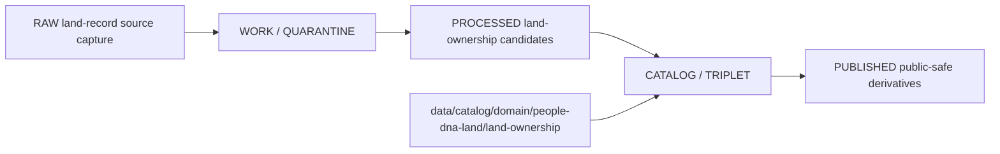

<!-- [KFM_META_BLOCK_V2]
doc_id: kfm://doc/data-catalog-domain-people-dna-land-land-ownership-readme
title: data/catalog/domain/people-dna-land/land-ownership/README.md — People/DNA/Land Land Ownership Catalog README
version: v0.1
type: readme; data-lifecycle-sublane; restricted-domain-catalog-guide
status: draft; PROPOSED; data-root; catalog-stage; people-dna-land; land-ownership; restricted; release-gated; privacy-aware
owners: OWNER_TBD — People/DNA/Land steward · Land ownership steward · Data steward · Catalog steward · Evidence steward · Source steward · Policy steward · Sensitivity reviewer · Release steward · Docs steward
created: NEEDS VERIFICATION — blank placeholder existed before v0.1 expansion
updated: 2026-06-24
policy_label: restricted-doc; data; catalog; people-dna-land; land-ownership; lifecycle; release-gated; privacy-aware
tags: [kfm, data, catalog, people-dna-land, land-ownership, CATALOG, TRIPLET, LandOwnershipAssertion, OwnershipInterval, LandInstrument, LandParcel, EvidenceBundle, SourceDescriptor, ReleaseManifest, RedactionReceipt]
related:
  - ../../../README.md
  - ../../../../README.md
  - ../../../../../docs/domains/people-dna-land/README.md
  - ../../../../../docs/domains/people-dna-land/SENSITIVITY.md
  - ../../../../../docs/domains/people-dna-land/sublanes/land.md
  - ../../../../../packages/domains/people-dna-land/land-ownership/README.md
  - ../../../../../contracts/domains/people-dna-land/
  - ../../../../../schemas/contracts/v1/domains/people-dna-land/
  - ../../../../../policy/domains/people-dna-land/
  - ../../../../../policy/sensitivity/people-dna-land/
  - ../../../../../policy/consent/
  - ../../../../../data/proofs/
  - ../../../../../data/receipts/
  - ../../../../../release/
notes:
  - "This file replaces a blank placeholder at `data/catalog/domain/people-dna-land/land-ownership/README.md`."
  - "People/DNA/Land is a high-sensitivity lane; living-person, DNA, private person-parcel joins, and DNA-derived outputs are deny/restrict by default."
  - "Land ownership is temporal and evidence-bound; assessor/tax records and parcel geometry are not title truth."
  - "This folder is a CATALOG-stage domain catalog sublane; it is not RAW, WORK, QUARANTINE, PROCESSED, PUBLISHED, proof storage, release authority, schema authority, policy code, implementation code, or legal/title authority."
  - "Rollback target for this replacement is previous blank blob SHA `8b137891791fe96927ad78e64b0aad7bded08bdc`."
[/KFM_META_BLOCK_V2] -->

# data/catalog/domain/people-dna-land/land-ownership

> Restricted People/DNA/Land catalog sublane for land-ownership, parcel-context, title-sensitive, and chain-of-title catalog records inside the `CATALOG / TRIPLET` lifecycle stage.

  
  
  
  
  
  
  

**Status:** draft / PROPOSED  
**Path:** `data/catalog/domain/people-dna-land/land-ownership/README.md`  
**Owning root:** `data/catalog/domain/people-dna-land/`  
**Sublane:** `land-ownership`  
**Lifecycle stage:** `CATALOG / TRIPLET`  
**Exposure posture:** restricted by default; public use requires explicit policy, review, transform, and release linkage  
**Truth posture:** CONFIRMED target was blank · CONFIRMED parent catalog lane is RELEASED ONLY for public exposure · CONFIRMED People/DNA/Land doctrine is deny/restrict by default for living-person, DNA, and private person-parcel joins · CONFIRMED land-ownership doctrine says assessor/tax records and parcel geometry are not title truth and ownership is temporal/evidence-bound · CONFIRMED package land-ownership helpers are implementation helpers only, not title, parcel, source, schema, policy, proof, receipt, release, or publication authority · NEEDS VERIFICATION for catalog inventory, schemas, validators, policy gates, receipts, release manifests, access controls, and route behavior.

**Quick jumps:** [Purpose](#purpose) · [Lifecycle boundary](#lifecycle-boundary) · [Repo fit](#repo-fit) · [Accepted contents](#accepted-contents) · [Exclusions](#exclusions) · [Catalog requirements](#catalog-requirements) · [Land ownership guardrails](#land-ownership-guardrails) · [Evidence ledger](#evidence-ledger) · [Validation checklist](#validation-checklist) · [Rollback](#rollback)

---

## Purpose

`data/catalog/domain/people-dna-land/land-ownership/` stores or stages catalog records and indexes for evidence-bound land-ownership assertions, ownership intervals, land instruments, parcel versions, legal descriptions, assessor/tax context, chain-of-title candidates, and public-safe derivatives.

A catalog record in this sublane supports discovery, steward review, catalog closure, and release preparation. It does **not** determine legal ownership, legal title, marketability, heirs, mineral rights, easements, boundary truth, policy admissibility, privacy posture, or release state by itself.

## Lifecycle boundary

`data/catalog/domain/people-dna-land/land-ownership/` is a CATALOG-stage sublane. Public exposure applies only to records tied to approved release state, governed route, evidence support, source-role support, rights/consent posture, sensitivity posture, and required receipts.

## Repo fit

| Responsibility | Correct home | Rule |
|---|---|---|
| Land-ownership catalog records | `data/catalog/domain/people-dna-land/land-ownership/` | This lane. |
| Parent catalog stage | `data/catalog/` | Parent CATALOG-stage lane. |
| People/DNA/Land domain doctrine | `docs/domains/people-dna-land/` | Human-facing domain doctrine. |
| Land sublane doctrine | `docs/domains/people-dna-land/sublanes/land.md` | Human-facing land ownership sublane doctrine. |
| Land-ownership implementation helpers | `packages/domains/people-dna-land/land-ownership/` | Helper implementation orientation only. |
| Evidence/proof records | `data/proofs/` | EvidenceBundle and proof records. |
| Source registry | `data/registry/` or accepted source registry root | SourceDescriptor entries, rights, role, and activation state. |
| Receipts | `data/receipts/` | CatalogBuildReceipt, ReviewRecord, RedactionReceipt, PolicyDecision, correction receipts. |
| Release decisions | `release/` | Publication authority. |
| Schemas and policy | `schemas/`, `policy/` | Separate roots; segment naming remains NEEDS VERIFICATION/CONFLICTED where doctrine says so. |

## Accepted contents

| Content | Purpose |
|---|---|
| Land-ownership catalog indexes | Group-level indexes for land-ownership catalog records. |
| Land Ownership Assertion catalog entries | Evidence-bound ownership-claim catalog records. |
| Ownership Interval catalog entries | Temporal ownership interval records with source and evidence links. |
| LandInstrument catalog entries | Deed, title, probate, mortgage, easement, mineral, water-right, lease, and related instrument records. |
| Parcel Version catalog entries | Versioned parcel or legal-description context records with geometry role and caveats. |
| Assessor/TaxRecord catalog entries | Administrative context records with explicit not-title posture. |
| Chain-of-title candidate catalog entries | Candidate chain, gap, and review records. |
| Public-safe derivative pointers | Links to approved generalized/redacted/aggregated derivatives. |
| Evidence, source, policy, and receipt pointers | References to EvidenceBundle, SourceDescriptor, PolicyDecision, ReviewRecord, RedactionReceipt, ReleaseManifest, and validation reports. |

## Exclusions

| Do not put here | Correct home |
|---|---|
| RAW land-record source files | `data/raw/people-dna-land/` or source-specific governed home |
| WORK/intermediate data | `data/work/people-dna-land/` |
| Quarantined data | `data/quarantine/people-dna-land/` |
| Processed datasets | `data/processed/people-dna-land/` |
| EvidenceBundle/proof records | `data/proofs/` |
| SourceDescriptor records | `data/registry/` or accepted source registry root |
| Receipts | `data/receipts/` |
| Release decisions | `release/` |
| Published public products | `data/published/.../people-dna-land/` |
| Semantic contracts | `contracts/` or accepted contract root |
| Schemas | `schemas/` |
| Policy and consent rules | `policy/` |
| Package helper code | `packages/domains/people-dna-land/land-ownership/` or source package roots |
| Validators/tests/code | `tools/validators/`, `tests/`, implementation roots |

## Catalog requirements

PROPOSED until schemas, validators, and inventory are verified:

| Requirement | Meaning |
|---|---|
| Stable catalog identity | Record has a stable identity linked to source, evidence, derivative, or release object. |
| Evidence reference | Record points to EvidenceBundle/proof context when claims depend on evidence. |
| Source reference | Record points to SourceDescriptor/source catalog where source authority matters. |
| Source-role class | Record declares whether material is instrument evidence, administrative/tax context, parcel geometry context, legal-description context, candidate chain, or public-safe derivative. |
| Temporal basis | Record preserves execution, recording, effective, tax/assessment, retrieval, review, release, and correction time where material. |
| Rights/consent posture | Record links to rights, sensitivity, consent, privacy, and access posture when material. |
| Transform receipt | Public derivatives from restricted or title-sensitive input link to RedactionReceipt or equivalent transform receipt. |
| Release reference | Public or release-linked records point to ReleaseManifest and rollback target. |
| Closure compatibility | Domain catalog, STAC, DCAT, and PROV agreement holds where those projections exist. |

## Land ownership guardrails

- Land-ownership catalog records are catalog carriers, not title truth by themselves.
- Assessor records and tax records are administrative context, not title determinations.
- Parcel geometry is administrative or evidence-bound context, not legal boundary proof by itself.
- A deed, patent, probate record, mortgage, lien, easement, or legal description is evidence; it is not complete chain-of-title proof by itself.
- Name strings on instruments or tax rows must not collapse into canonical person or entity identity without evidence and review.
- Private person-parcel joins, living-person data, title-sensitive assertions, and DNA/genealogy-linked land claims require explicit policy/review posture before public use.
- Unreleased land-ownership catalog records are not public merely because they exist under this directory.

## Evidence ledger

| Source | Status | Supports | Limits |
|---|---|---|---|
| `data/catalog/domain/people-dna-land/land-ownership/README.md` previous file | CONFIRMED | Target existed as a blank placeholder. | Did not define lane boundaries. |
| `data/catalog/README.md` | CONFIRMED | Parent catalog lane, domain catalog layout, RELEASED ONLY public posture. | Does not prove land-ownership catalog inventory. |
| `docs/domains/people-dna-land/README.md` | CONFIRMED doctrine / PROPOSED implementation | People/DNA/Land sensitivity defaults, evidence-first assertions, assessor/tax and parcel anti-collapse, consent/release posture. | Segment naming conflict and implementation details remain NEEDS VERIFICATION. |
| `docs/domains/people-dna-land/sublanes/land.md` | CONFIRMED doctrine / PROPOSED implementation | Land ownership as temporal, evidence-bound assertion; assessor/tax/parcel not title truth. | Sublane convention and exact implementation remain PROPOSED. |
| `packages/domains/people-dna-land/land-ownership/README.md` | CONFIRMED package README | Package helpers are not legal/title/evidence/policy/release authority. | Package code/tests/runtime behavior remain NEEDS VERIFICATION. |

## Validation checklist

- [ ] Confirm actual child files and land-ownership catalog inventory under this lane.
- [ ] Confirm land-ownership catalog schema/profile location and segment naming.
- [ ] Confirm access policy, consent policy, validators, and CI checks.
- [ ] Confirm EvidenceBundle, SourceDescriptor, RunReceipt, ValidationReport, PolicyDecision, ReviewRecord, RedactionReceipt, ConsentGrant/RevocationReceipt where relevant, ReleaseManifest, and rollback references.
- [ ] Confirm source-role separation for instruments, assessor/tax, parcel geometry, legal descriptions, chain candidates, and public derivatives.
- [ ] Confirm living-person, person-parcel join, title-sensitive, rights, consent, privacy, stale-state, and review handling.
- [ ] Confirm correction, withdrawal, tombstone, supersession, revocation, and rollback behavior for stale or failed records.

## Rollback

Rollback is required if this lane becomes a People/DNA/Land raw-data root, work area, quarantine store, processed-data store, proof store, source-registry root, release-decision root, published-output root, semantic-contract root, schema root, policy root, consent root, validator root, implementation root, legal/title authority, or public exposure shortcut.

Rollback target for this replacement: previous blank blob SHA `8b137891791fe96927ad78e64b0aad7bded08bdc`.

<a href="#top">Back to top</a>

