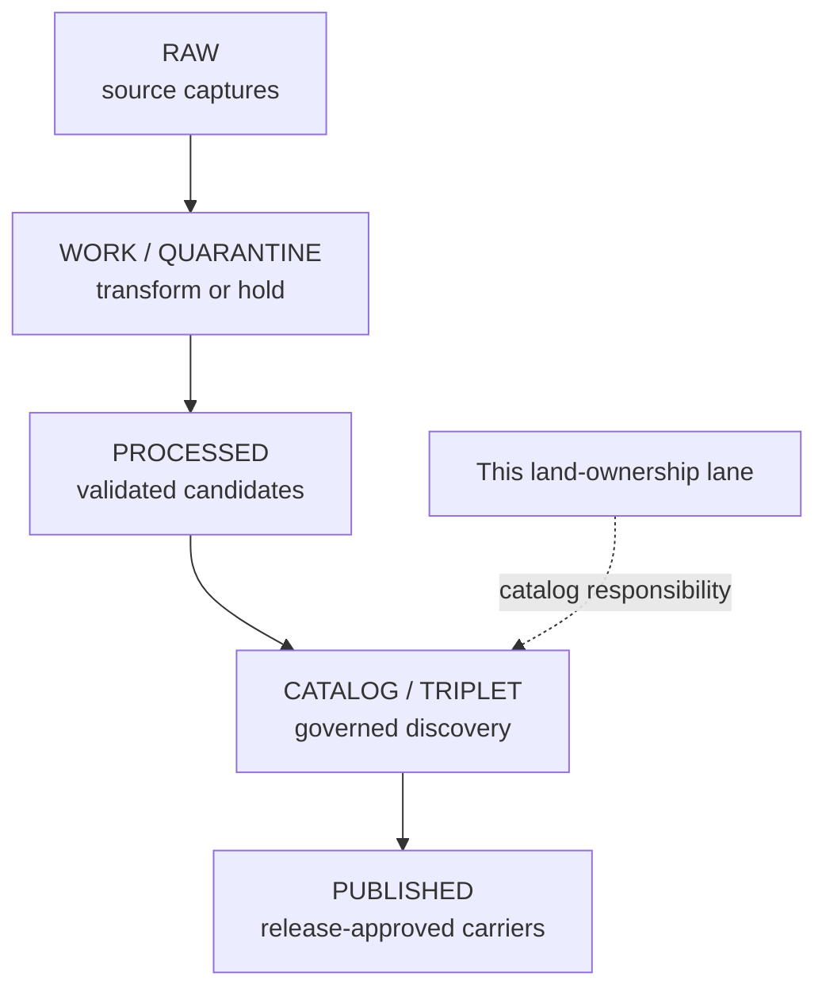

<!-- [KFM_META_BLOCK_V2]
doc_id: kfm://doc/data-catalog-domain-people-dna-land-land-ownership-readme
title: data/catalog/domain/people-dna-land/land-ownership/README.md — Governed Land Ownership Catalog Lane
version: v0.2.0
type: readme; data-lifecycle-sublane; restricted-domain-catalog-guide; land-ownership-catalog-guide; release-gated; not-title-authority
status: repository-grounded draft; canonical placement; proposed realization; catalog-stage; restricted; privacy-aware; release-gated
owners: NEEDS VERIFICATION — People/DNA/Land, land-records, data, catalog, evidence, source, rights, privacy, sensitivity, consent where applicable, policy, release, correction, rollback, schema, validation, and docs stewards
created: NEEDS VERIFICATION — blank placeholder existed before v0.1 expansion
updated: 2026-07-25
policy_label: restricted-doc; data-catalog; people-dna-land; land-ownership; restricted-domain; privacy-aware; release-gated; not-title-authority
current_path: data/catalog/domain/people-dna-land/land-ownership/README.md
historical_blank_blob: 8b137891791fe96927ad78e64b0aad7bded08bdc
prepared_under_prompt: KFM Markdown Modernization & GitHub Documentation Implementation Agent v4.0.0
review_packet_id: kfm-pdl-land-ownership-catalog-readme-20260725
truth_posture: >
  CONFIRMED exact path, stable document identity, parent catalog posture,
  Directory Rules placement, People/DNA/Land and land-ownership doctrine,
  current contract, schema, policy, consent, test, fixture, validator, pipeline,
  source-registry, receipt, proof, release-candidate, published-layer, workflow,
  CODEOWNERS, and repository-relative link surfaces / PROPOSED concrete
  land-ownership catalog profile, record realization, deterministic validators,
  CatalogMatrix closure, policy enforcement, and release behavior / CONFLICTED
  domain segment and source-role vocabulary across inspected documentation /
  UNKNOWN recursive record inventory, concrete source descriptors, active
  producers and consumers, runtime reads, hosts, caches, public effects,
  published artifacts, and correction or rollback execution / NEEDS
  VERIFICATION accountable stewardship, accepted ADR decisions, schema and
  profile maturity, rights and source activation, privacy and consent
  enforcement, release closure, and public-client exclusion
evidence_snapshot:
  repository: bartytime4life/Kansas-Frontier-Matrix
  base_ref: main
  base_commit: b42cd1480e9d995b6b39febf54e2385d86b3bce5
  initial_preflight_commit: 2183afaebbc6cd471e39f614327614f33c27026b
  continuity_compare: 2183afaebbc6cd471e39f614327614f33c27026b...b42cd1480e9d995b6b39febf54e2385d86b3bce5
  prior_blob: d49d2a5a61d1143e869b8762d7993c5782116888
  historical_blank_blob: 8b137891791fe96927ad78e64b0aad7bded08bdc
  method: complete target read plus bounded governing-neighbor, workflow, branch, pull-request, and exact repository-path inspection; base drift was reconciled by comparing the initial preflight commit to the final base and confirming only Fauna, Hydrology, and People/DNA compatibility catalog README paths changed; no recursive clone, catalog-record sampling, fixture-payload inspection, runtime, deployment, host-render, external-store, cadastral-source, title-record, or legal-record inspection
related:
  - ../README.md
  - ../../README.md
  - ../../../README.md
  - ../../../../README.md
  - ../../../../../docs/domains/people-dna-land/README.md
  - ../../../../../docs/domains/people-dna-land/LAND_OWNERSHIP.md
  - ../../../../../docs/domains/people-dna-land/SENSITIVITY.md
  - ../../../../../docs/domains/people-dna-land/CANONICAL_PATHS.md
  - ../../../../../docs/domains/people-dna-land/DATA_LIFECYCLE.md
  - ../../../../../docs/domains/people-dna-land/RELEASE_INDEX.md
  - ../../../../../docs/domains/people-dna-land/sublanes/land.md
  - ../../../../registry/sources/people-dna-land/land-ownership/README.md
  - ../../../../receipts/people-dna-land/README.md
  - ../../../../proofs/people-dna-land/README.md
  - ../../../../published/layers/people-dna-land/land-ownership/README.md
  - ../../../../../contracts/domains/people-dna-land/README.md
  - ../../../../../contracts/domains/people-dna-land/land-ownership/README.md
  - ../../../../../contracts/domains/people-dna-land/LandInstrument.md
  - ../../../../../packages/domains/people-dna-land/land-ownership/README.md
  - ../../../../../schemas/contracts/v1/domains/people-dna-land/README.md
  - ../../../../../schemas/contracts/v1/domains/people-dna-land/land-ownership/README.md
  - ../../../../../policy/domains/people-dna-land/README.md
  - ../../../../../policy/consent/people-dna-land/README.md
  - ../../../../../tests/domains/people-dna-land/README.md
  - ../../../../../tests/domains/people-dna-land/test_people_dna_land_smoke.py
  - ../../../../../fixtures/domains/people-dna-land/README.md
  - ../../../../../fixtures/domains/people-dna-land/land-ownership/README.md
  - ../../../../../tools/validators/domains/people-dna-land/README.md
  - ../../../../../pipelines/domains/people-dna-land/README.md
  - ../../../../../pipelines/domains/people-dna-land/land-ownership/README.md
  - ../../../../../pipeline_specs/people-dna-land/README.md
  - ../../../../../pipeline_specs/people-dna-land/land-ownership/README.md
  - ../../../../../release/candidates/people-dna-land/README.md
  - ../../../../../release/candidates/people-dna-land/land-ownership/README.md
  - ../../../../../docs/adr/ADR-0001-schema-home--schemas-contracts-v1-is-canonical.md
  - ../../../../../docs/adr/ADR-0010-deny-by-default-for-dna-rare-species-archaeology-infrastructure.md
  - ../../../../../docs/adr/ADR-0011-receipts-vs-proofs-vs-manifests-vs-catalog-separation.md
  - ../../../../../docs/adr/ADR-0015-data-published-_domain_-current-alias-is-governed-by-rollback_card.md
  - ../../../../../docs/adr/ADR-0022-catalog-matrix--stac-+-dcat-+-prov-must-agree.md
  - ../../../../../docs/adr/ADR-0025-public-client-never-reads-canonical-internal-stores.md
  - ../../../../../docs/doctrine/directory-rules.md
  - ../../../../../.github/workflows/domain-people-dna-land.yml
  - ../../../../../.github/workflows/link-check.yml
  - ../../../../../.github/CODEOWNERS
tags: [kfm, data, catalog, people-dna-land, land-ownership, CATALOG, TRIPLET, LandOwnershipAssertion, OwnershipInterval, LandInstrument, LandParcel, EvidenceBundle, SourceDescriptor, ReleaseManifest, RedactionReceipt, restricted-domain, catalog-stage, rights, consent, catalog-matrix, not-title-authority, cite-or-abstain]
notes:
  - "Directory Rules sections 4 and 12 support this nested domain and sublane placement."
  - "Directory Rules section 15 directly governs canonical and compatibility roots, not this nested lane; its ordered README sections are adopted here as a consistency contract."
  - "All v0.1 heading fragments remain available through headings or explicit legacy anchors."
  - "Inspected documentation conflicts between the current people-dna-land segment and an older people crosswalk; this README preserves the current confirmed catalog path without resolving other responsibility roots."
  - "Inspected documentation also conflicts between the current seven-role source registry and older observation or authority terms; this README does not normalize that conflict."
  - "The land-ownership schema sublane is a transitional, CONFLICTED index and contains no confirmed concrete schema file."
  - "This Markdown-only revision creates no catalog record, cadastral fact, title conclusion, projection, schema acceptance, source activation, evidence bundle, consent decision, receipt, release, publication, public route, correction, or rollback execution."
  - "Static badges project verified documentation posture only; they do not assert validator, CI, security, legal, title, release, publication, or privacy-enforcement maturity."
[/KFM_META_BLOCK_V2] -->

# `data/catalog/domain/people-dna-land/land-ownership/` — Governed Land Ownership Catalog Lane

> **One-line purpose.** Define the governed home for People/DNA/Land land-ownership catalog records and indexes at the `CATALOG / TRIPLET` stage while keeping source, evidence, identity, temporal semantics, rights, privacy, consent where applicable, release, correction, rollback, and legal or title authority independently governed.

> [!IMPORTANT]
> A catalog record supports discovery, review, interoperability, and release closure. Placement here does **not** make a land-ownership assertion true, complete, current, legally effective, evidence-supported, policy-admitted, consented, reviewed, released, title-authoritative, boundary-authoritative, or public. SourceDescriptor, EvidenceBundle, PolicyDecision, ReviewRecord, receipts, ReleaseManifest, correction state, and rollback remain separate governed objects.

<!-- governance-alert-separator -->

> [!CAUTION]
> KFM does not determine legal ownership, title, marketability, boundary location, heirs, mineral rights, water rights, easements, encumbrances, or the legal effect of an instrument. Assessor and tax records are administrative evidence, not title proof; parcel geometry is a representation, not a surveyed or adjudicated boundary. Chain gaps, conflicts, uncertainty, and adverse evidence must remain visible.

**Quick navigation:** [Purpose](#purpose) · [Authority](#authority-level) · [Status](#status) · [Belongs](#what-belongs-here) · [Exclusions](#what-does-not-belong-here) · [Inputs](#inputs) · [Outputs](#outputs) · [Validation](#validation) · [Review](#review-burden) · [Related](#related-folders) · [ADRs](#adrs) · [Last reviewed](#last-reviewed) · [Boundary](#lifecycle-and-catalog-boundary) · [Requirements](#land-ownership-catalog-requirements) · [Guardrails](#land-ownership-guardrails) · [Projections](#projection-and-catalog-closure) · [Evidence](#evidence-basis) · [Release](#release-correction-and-rollback-closure) · [Rollback](#migration-correction-and-rollback) · [Verification](#open-verification-register) · [Done](#definition-of-done) · [No-loss](#no-loss-ledger)

## Purpose

`data/catalog/domain/people-dna-land/land-ownership/` is the canonical responsibility placement for governed land-ownership catalog records and indexes within the People/DNA/Land domain at the `CATALOG / TRIPLET` lifecycle stage. Candidate families include Land Ownership Assertions, ownership intervals, LandInstrument descriptors, Parcel Version and LegalDescription references, assessor and tax administrative context, chain candidates, conflict notices, and public-safe derivative pointers.

This lane organizes governed references. It does not own source truth, legal or title determinations, cadastral or survey authority, contracts, schemas, policies, evidence, consent, release authority, or public delivery. Listing a record family does not prove that its records, source descriptors, contract, schema, validator, evidence, rights decision, consent decision, release state, or public route exist.

## Authority level

**Canonical responsibility placement for People/DNA/Land land-ownership catalog records / repository-grounded draft / concrete catalog profile and realization PROPOSED / not source, evidence, identity, policy, consent, legal, title, release, or publication authority.**

This lane may carry catalog descriptors and governed references. It cannot replace land-ownership meaning under `contracts/`, machine shape under `schemas/`, admissibility under `policy/`, source identity and activation under `data/registry/`, process memory under `data/receipts/`, EvidenceBundles and proof support under `data/proofs/`, release decisions under `release/`, public-safe carriers under `data/published/`, or official county, recorder, court, survey, title, tribal, federal, state, or other competent authority records.

## Status

| Field | Bounded result |
|---|---|
| Path | `data/catalog/domain/people-dna-land/land-ownership/README.md` |
| Version | `v0.2.0` |
| Base evidence | `main@b42cd1480e9d995b6b39febf54e2385d86b3bce5` |
| Prior blob | `d49d2a5a61d1143e869b8762d7993c5782116888` (`v0.1`) |
| Historical blank predecessor | `8b137891791fe96927ad78e64b0aad7bded08bdc` |
| Placement | `CONFIRMED` existing land-ownership child under the governed People/DNA/Land domain catalog path |
| Concrete catalog profile and records | `PROPOSED / NEEDS VERIFICATION` |
| Recursive catalog-record inventory | `UNKNOWN` |
| Active producers, consumers, runtime reads, hosts, caches, or public effects | `UNKNOWN` |
| Land-ownership STAC, DCAT, and PROV children | `NOT PRESENT` at the pinned base |
| Land-ownership triplet child | `NOT PRESENT` at the pinned base |
| Domain segment convention | `CONFLICTED`; current placement uses `people-dna-land`, while an older crosswalk documents `people` for some responsibility roots |
| Land-ownership contract | Documentation exists and remains `draft / PROPOSED`; no accepted catalog record contract established |
| Land-ownership schema | Transitional `CONFLICTED` README exists; no concrete `.schema.json` file confirmed |
| Source-role vocabulary | `CONFLICTED`; the current seven-role register and older land-ownership terms do not fully agree |
| Policy and consent | Domain policy is a greenfield scaffold; consent sublane is README-only and placement-conflicted; active enforcement is not established |
| Validators, tests, fixtures, pipelines, and specs | Documentation or scaffolding exists; the domain smoke test is a placeholder and executable catalog enforcement is not established |
| Release candidate | Documentation exists; candidate inventory, approved PromotionDecision, ReleaseManifest, and release remain unproven |
| Published layer | Documentation exists; emitted artifacts, release linkage, and public route remain `UNKNOWN` |
| Public exposure | `RESTRICTED / RELEASE-GATED / FAIL CLOSED / NOT TITLE AUTHORITY` |
| Human review | `PENDING` |

## What belongs here

| Accepted family | Required posture |
|---|---|
| Land-ownership domain catalog records | Stable identity, object family, source role, temporal scope, evidence, rights, sensitivity, lifecycle state, and release state |
| Land-ownership catalog indexes | Steward-facing or release-linked discovery; never an ungoverned public, legal, or operational shortcut |
| Land Ownership Assertion descriptors | Assertion identity, interest type, subject and object references, effective interval, recording context, evidence, uncertainty, conflict, and correction state |
| OwnershipInterval descriptors | Bounded effective interval and asserted relationship without implying uninterrupted, exclusive, complete, or current title |
| LandInstrument descriptors | Instrument identity, recording jurisdiction, execution and recording times, parties as governed references, legal-description reference, evidence, and interpretation limits |
| Parcel Version descriptors | Parcel identity and version, jurisdiction, geometry representation reference, effective time, source, and non-boundary-authority posture |
| LegalDescription references | Verbatim or governed reference to the authoritative description; no silent geometry substitution or legal interpretation |
| Assessor and tax administrative descriptors | Administrative source role, assessment or tax period, retrieval context, evidence, and explicit not-title posture |
| Chain candidates and conflict notices | Ordered evidence relationships with visible gaps, overlaps, conflicts, uncertainty, adverse evidence, and unresolved state |
| Public-safe derivative pointers | Generalized, aggregated, deidentified, policy-admitted, review-approved, and release-linked representations only |
| Evidence, source, rights, receipt, policy, consent, and review pointers | Resolvable governed references, including RedactionReceipt and applicable consent or revocation receipts, without duplicating their authority here |
| Release, correction, withdrawal, supersession, and rollback pointers | Immutable governed references without treating catalog placement as release |

Records should be deterministic where practical, bounded in scope, correctable, and explicit about whether they are internal candidates, reviewable records, release-linked records, withdrawn records, superseded records, disputed records, historical records, or public-safe derivatives.

## What does NOT belong here

| Prohibited family | Governed home or action |
|---|---|
| RAW deeds, instruments, assessor exports, tax files, parcel files, court records, surveys, or source captures | `data/raw/people-dna-land/` when an accepted lane and handling plan exist |
| WORK, intermediate, OCR, geocoding, entity-resolution, or chain-construction data | `data/work/people-dna-land/` when accepted |
| Quarantined or conflicted source payloads | `data/quarantine/people-dna-land/` when accepted |
| Processed ownership, parcel, instrument, party, or derivative payloads | `data/processed/people-dna-land/` when accepted |
| STAC, DCAT, or PROV records | Governed sibling projection lanes under `data/catalog/` when accepted and created |
| Triplets or graph edges | Governed People/DNA/Land lanes under `data/triplets/` when accepted and created |
| Source descriptors, activation decisions, rights terms, sensitivity labels, datasets, layers, or crosswalk rows | `data/registry/` |
| EvidenceBundles, ProofPacks, attestations, or proof reports | `data/proofs/` |
| Run, validation, catalog-build, policy, consent, review, correction, or release receipts | `data/receipts/` |
| Contracts, schemas, policy modules, validators, fixtures, tests, packages, tools, pipelines, or workflows | Their owning responsibility roots |
| ReleaseManifest, PromotionDecision, RollbackCard, CorrectionNotice, withdrawal, supersession, signature, or release authority | `release/` |
| Published layers, reports, stories, downloads, APIs, indexes, tiles, PMTiles, or other public-safe carriers | `data/published/` after governed release |
| Direct public reads, UI caches, search indexes, AI retrieval corpora, or hosting output | Governed interfaces and approved runtime or output stores |
| Title opinions, marketability conclusions, legal advice, boundary adjudication, heirship determinations, or legal-effect conclusions | Competent legal, title, survey, court, recorder, or other authoritative processes, never KFM |
| Raw DNA, living-person identity dossiers, private person-parcel joins, protected addresses, credentials, or precise restricted outputs | Deny, quarantine, restrict, generalize, aggregate, deidentify, redact, or withhold under policy and review |

## Inputs

Catalog inputs should be governed references and validated derivatives, not raw truth by placement:

- processed object identities, versions, digests, object families, temporal roles, jurisdiction, and bounded spatial support;
- source registry references with admitted source role, activation decision, rights, current terms, sensitivity, retrieval context, and issuing or recording authority identity;
- accepted contracts, schemas, catalog profiles, policy decisions, consent decisions where applicable, and review records;
- EvidenceRef-to-EvidenceBundle resolution and applicable proof support;
- `CatalogBuildReceipt`, `RunReceipt`, `ValidationReport`, `RedactionReceipt`, applicable `ConsentGrant` or `RevocationReceipt`, policy, correction, and release-support receipts;
- STAC, DCAT, PROV, and triplet references when those projections exist;
- immutable release, correction, withdrawal, supersession, and rollback references.

Unknown or conflicted identity, jurisdiction, source role, rights, sensitivity, legal-description support, temporal role, evidence, consent applicability, policy, review, release, correction, or rollback state holds a record from public-bound or current-state use.

## Outputs

This lane may emit or support:

- internal or reviewable land-ownership catalog records;
- deterministic land-ownership indexes and bounded catalog subsets;
- release-linked catalog descriptors that reference, but do not replace, release authority;
- inspectable agreement inputs for domain, STAC, DCAT, PROV, triplet, evidence, source, policy, consent, and release closure;
- correction-, dispute-, withdrawal-, supersession-, and rollback-aware discovery metadata for governed APIs and review tools.

Catalog placement is not publication, legal notice, title certification, or boundary authority. Public clients receive only policy-safe, review-approved, release-approved representations through governed interfaces and public-safe carriers.

## Validation

For README-only changes:

- verify one H1, valid GFM tables, complete fences, supported alerts, stable legacy anchors, and a final newline;
- resolve every introduced repository-relative link at the resulting commit;
- compare the complete baseline and result, preserve document identity and land-ownership-specific requirements, and record any intentional consolidation;
- inspect the exact base-to-head diff for one-path scope, conflict markers, credentials, private endpoints, precise sensitive locations, personal data, or operational payload data;
- treat static badges as navigation and documentation posture only.

For future catalog records and indexes, executable validation should fail closed on:

- missing or unstable identity, version, digest, object family, jurisdiction, source role, spatial support, or temporal roles;
- unresolved SourceDescriptor, EvidenceRef, EvidenceBundle, contract, schema, policy, consent where applicable, review, receipt, release, correction, or rollback references;
- execution, acknowledgment, recording, effective, assessment, tax, retrieval, review, release, correction, and supersession times silently collapsed;
- assessor or tax records represented as title, parcel geometry represented as surveyed or adjudicated boundary, or a single instrument represented as complete chain;
- party names treated as canonical person identity, automated entity resolution treated as fact, or aliases and same-name people silently merged;
- ownership interests, estates, encumbrances, easements, mineral interests, water interests, leaseholds, beneficial interests, and possession silently collapsed into one owner field;
- chain gaps, overlaps, conflicts, adverse evidence, uncertainty, or unresolved legal effect hidden or smoothed;
- living-person, raw-DNA, private person-parcel, protected-address, or cross-domain joins admitted without applicable deny-default policy, consent, deidentification, review, and receipts;
- contradictory identity, digest, role, time, rights, sensitivity, access, correction, or release state across catalog, evidence, source, policy, consent, and release surfaces;
- candidate, disputed, withdrawn, superseded, restricted, or unreleased records reaching a current-state or public surface;
- AI extraction, OCR, geocoding, entity resolution, chain inference, generated prose, or map presentation treated as evidence, legal interpretation, title authority, or release authority.

The inspected [People/DNA/Land workflow](../../../../../.github/workflows/domain-people-dna-land.yml) and [documentation link-check workflow](../../../../../.github/workflows/link-check.yml) are GitHub-hosted, read-only readiness or hold surfaces on pull requests. The domain workflow detects the current placeholder smoke test rather than establishing an accepted land-ownership validation suite, proof production, release dry run, publication, or privacy enforcement. The link-check workflow explicitly establishes no link resolution. Their presence or green state must not be cited as record validation, release, title assurance, or public safety.

## Review burden

Land ownership combines contested evidence, legal and temporal nuance, jurisdictional variation, person and parcel identity, rights, privacy, consent, and join-induced sensitivity. Material catalog changes therefore need review proportional to risk across:

- People/DNA/Land and land-record semantics;
- recording, assessor, tax, cadastral, survey, and jurisdictional source roles;
- catalog, evidence, identity, temporal modeling, provenance, and schema;
- source activation, citation, license, rights, current terms, and retention;
- privacy, sensitivity, consent where applicable, deidentification, and harmful joins;
- validation, release, correction, withdrawal, supersession, rollback, and public delivery.

[CODEOWNERS](../../../../../.github/CODEOWNERS) currently routes repository review to `@bartytime4life` by default. That routing is not proof of accepted stewardship, specialist review, separation of duties, quorum, legal review, title review, privacy approval, or release authorization. Accountable assignments and required specialist reviewers remain `NEEDS VERIFICATION`.

## Related folders

| Responsibility | Verified repository surface | Relationship |
|---|---|---|
| Parent land-ownership catalog | [People/DNA/Land catalog](../README.md) | Owns the broader domain catalog boundary |
| Domain catalog index | [Domain catalog](../../README.md) | Registers the domain catalog responsibility |
| Catalog root | [Catalog](../../../README.md) | Owns catalog-stage posture and projection families |
| Data root | [Data](../../../../README.md) | Owns lifecycle and data responsibility boundaries |
| Domain doctrine | [People/DNA/Land](../../../../../docs/domains/people-dna-land/README.md) | Defines domain scope, sensitivity, and current implementation posture |
| Land-ownership doctrine | [Land ownership](../../../../../docs/domains/people-dna-land/LAND_OWNERSHIP.md) | Defines evidence-not-title semantics, temporal roles, interests, and anti-collapse rules |
| Land sublane | [Land sublane](../../../../../docs/domains/people-dna-land/sublanes/land.md) | Defines evidence-bound land assertions and correction posture |
| Sensitivity | [Sensitivity](../../../../../docs/domains/people-dna-land/SENSITIVITY.md) | Defines deny-default and public-safe transformation intent |
| Canonical paths | [Canonical paths](../../../../../docs/domains/people-dna-land/CANONICAL_PATHS.md) | Records path decisions and unresolved placement boundaries |
| Lifecycle | [Data lifecycle](../../../../../docs/domains/people-dna-land/DATA_LIFECYCLE.md) | Separates admission, processing, catalog, release, correction, and rollback stages |
| Release index | [Release index](../../../../../docs/domains/people-dna-land/RELEASE_INDEX.md) | Documents release responsibilities without proving a release |
| Source registry | [Land-ownership sources](../../../../registry/sources/people-dna-land/land-ownership/README.md) | Owns source identity, role, rights, and activation intent |
| Receipts | [People/DNA/Land receipts](../../../../receipts/people-dna-land/README.md) | Owns process memory; no land-ownership child is confirmed |
| Proofs | [People/DNA/Land proofs](../../../../proofs/people-dna-land/README.md) | Owns evidence and proof support; no land-ownership child proof is confirmed |
| Published layer | [Land-ownership published layer](../../../../published/layers/people-dna-land/land-ownership/README.md) | Documents intended public-safe layer boundary; artifacts remain unproven |
| Contracts | [Domain contracts](../../../../../contracts/domains/people-dna-land/README.md), [land-ownership contracts](../../../../../contracts/domains/people-dna-land/land-ownership/README.md), and [LandInstrument](../../../../../contracts/domains/people-dna-land/LandInstrument.md) | Own semantic meaning; inspected artifacts remain draft or proposed |
| Package helpers | [Land-ownership helpers](../../../../../packages/domains/people-dna-land/land-ownership/README.md) | Documents proposed implementation-helper boundaries; package code, tests, imports, and runtime behavior remain unproven |
| Schemas | [Domain schema lane](../../../../../schemas/contracts/v1/domains/people-dna-land/README.md) and [land-ownership schema lane](../../../../../schemas/contracts/v1/domains/people-dna-land/land-ownership/README.md) | Own machine shape; child placement is conflicted and no concrete schema is confirmed |
| Policy and consent | [Domain policy](../../../../../policy/domains/people-dna-land/README.md) and [consent sublane](../../../../../policy/consent/people-dna-land/README.md) | Own admissibility and applicable consent; inspected surfaces are scaffolds, not enforcement |
| Tests and fixtures | [Domain tests](../../../../../tests/domains/people-dna-land/README.md), [placeholder smoke test](../../../../../tests/domains/people-dna-land/test_people_dna_land_smoke.py), [domain fixtures](../../../../../fixtures/domains/people-dna-land/README.md), and [land-ownership fixtures](../../../../../fixtures/domains/people-dna-land/land-ownership/README.md) | Own executable checks and synthetic examples; accepted coverage is not established |
| Validators | [Domain validators](../../../../../tools/validators/domains/people-dna-land/README.md) | Own validation tooling; no land-ownership child validator is confirmed |
| Pipelines and specs | [Domain pipelines](../../../../../pipelines/domains/people-dna-land/README.md), [land-ownership pipeline](../../../../../pipelines/domains/people-dna-land/land-ownership/README.md), [domain specs](../../../../../pipeline_specs/people-dna-land/README.md), and [land-ownership spec](../../../../../pipeline_specs/people-dna-land/land-ownership/README.md) | Document intended processing; concrete loader, scheduler, and accepted implementation remain unproven |
| Release candidates | [Domain candidates](../../../../../release/candidates/people-dna-land/README.md) and [land-ownership candidate lane](../../../../../release/candidates/people-dna-land/land-ownership/README.md) | Own release assembly; candidate inventory and approved release remain unproven |
| Directory doctrine | [Directory Rules](../../../../../docs/doctrine/directory-rules.md) | Governs responsibility placement and lifecycle separation |

This table records responsibility and observed documentation surfaces. It does not certify that payloads, schemas, validators, sources, policies, pipelines, releases, or public artifacts exist or are operational.

## ADRs

| ADR | Inspected posture | Relevance here |
|---|---:|---|
| [ADR-0001 — schema home](../../../../../docs/adr/ADR-0001-schema-home--schemas-contracts-v1-is-canonical.md) | `PROPOSED` | Candidate canonical schema root; decision is not accepted |
| [ADR-0010 — deny by default](../../../../../docs/adr/ADR-0010-deny-by-default-for-dna-rare-species-archaeology-infrastructure.md) | `DRAFT / PROPOSED` | Supports fail-closed handling for high-risk People/DNA/Land joins; enforcement is not established |
| [ADR-0011 — receipts, proofs, manifests, and catalogs](../../../../../docs/adr/ADR-0011-receipts-vs-proofs-vs-manifests-vs-catalog-separation.md) | `PROPOSED` | Keeps catalog discovery distinct from process memory, evidence support, and release authority |
| [ADR-0015 — governed current alias](../../../../../docs/adr/ADR-0015-data-published-_domain_-current-alias-is-governed-by-rollback_card.md) | `DRAFT / PROPOSED` | Makes current-state publication contingent on rollback governance |
| [ADR-0022 — CatalogMatrix closure](../../../../../docs/adr/ADR-0022-catalog-matrix--stac-+-dcat-+-prov-must-agree.md) | `PROPOSED` | Defines intended cross-projection agreement; no land-ownership closure is established |
| [ADR-0025 — public clients avoid internal stores](../../../../../docs/adr/ADR-0025-public-client-never-reads-canonical-internal-stores.md) | `DRAFT / PROPOSED` | Supports the public-client boundary; runtime enforcement is not established |

This README accepts none of these decisions. It records their current repository posture and fails closed where acceptance or enforcement is required.

## Last reviewed

- **Substantive documentation review:** 2026-07-25.
- **Evidence boundary:** exact target plus bounded reads of the linked doctrine, responsibility surfaces, workflows, CODEOWNERS, pull requests, branches, and exact prospective paths at the pinned commit.
- **Not inspected:** recursive catalog payload inventory, fixture payload bodies, runtime, deployment, hosts, caches, external stores, county or recorder systems, title plants, court records, surveys, or legal files.
- **Human review:** pending.
- **Re-review triggers:** accepted ADR or schema-home decision; path or segment migration; concrete catalog records or schemas; source activation; rights or consent changes; executable validators; projection creation; release candidate; published artifact; public route; correction; withdrawal; rollback; or material legal, privacy, or sensitivity change.

## Lifecycle and catalog boundary

```mermaid
flowchart TD
    R["RAW<br/>source captures"] --> W["WORK / QUARANTINE<br/>transform or hold"]
    W --> P["PROCESSED<br/>validated candidates"]
    P --> C["CATALOG / TRIPLET<br/>governed discovery"]
    C --> U["PUBLISHED<br/>release-approved carriers"]
    L["This land-ownership lane"] -. "catalog responsibility" .-> C
```

This lane is the catalog-stage responsibility, not a storage shortcut across the lifecycle. RAW captures, working data, quarantined material, processed payloads, source descriptors, evidence, receipts, policies, release decisions, and published carriers remain in their own governed roots.

Promotion into a catalog record should be deterministic, receipt-backed, schema-validated, evidence-linked, policy-admitted, rights-aware, sensitivity-aware, correction-aware, and reviewable. Promotion toward public use additionally requires applicable consent handling, release closure, public-safe transformation, governed routes, and tested rollback. A file move, README, catalog index, rendered map, or successful check is not promotion.

## Land Ownership catalog requirements

The following are **PROPOSED requirements** until accepted profiles, emitted records, deterministic validators, synthetic fixtures, required workflows, and observed release behavior prove them:

| Requirement | Minimum meaning |
|---|---|
| Stable catalog identity | Deterministic identifier for the assertion or catalog object; version, digest, revision, correction, dispute, and supersession remain explicit |
| Object and interest type | Assertion, interval, instrument, parcel version, legal-description reference, assessor record, tax record, chain candidate, conflict notice, or derivative remains typed; property interests do not collapse into one owner field |
| Jurisdiction and authority context | Recording jurisdiction, authority identity, source role, and limits resolve without making KFM the legal decision-maker |
| Temporal support | Execution, acknowledgment, recording, effective, assessment, tax, retrieval, review, release, correction, and supersession times remain distinct where material |
| Spatial and legal-description support | Parcel version, geometry representation, legal-description reference, precision, and uncertainty remain distinct; geometry is not title or boundary proof |
| Source and rights reference | SourceDescriptor, activation decision, dataset/version, license or terms, retrieval context, retention, and rights decision resolve |
| Evidence reference | Claim-bearing fields resolve EvidenceRef to EvidenceBundle; unsupported claims cite-or-abstain |
| Identity boundary | Party references preserve aliases, uncertainty, entity-resolution method, and living-person sensitivity; a name string is not canonical person identity |
| Policy and consent reference | PolicyDecision, reason code, sensitivity posture, ReviewRecord, and ConsentDecision where applicable resolve |
| Receipt reference | Build, validation, redaction, applicable consent grant or revocation, policy, correction, and release-support operations remain auditable |
| Catalog closure | Domain, STAC, DCAT, PROV, triplet, evidence, source, policy, and release views agree where accepted projections exist |
| Release and correction reference | Public-bound records point to immutable ReleaseManifest, public scope, correction or withdrawal state, and rollback target |

Candidate catalog records must not masquerade as released, current, legally complete, or title-authoritative records. Released records must remain distinguishable from disputed, corrected, withdrawn, superseded, restricted, or historical records without rewriting prior history.

## Land Ownership guardrails

| Guardrail | Required posture |
|---|---|
| Evidence is not title | KFM may organize evidence and assertions; it does not render a title opinion, determine marketability, or adjudicate ownership |
| One instrument is not a complete chain | Preserve predecessor and successor references, gaps, overlaps, conflicts, exceptions, adverse evidence, and uncertainty |
| Assessor and tax records are administrative | Do not promote assessment, billing, mailing, situs, or taxpayer fields into title, possession, residency, or beneficial-ownership conclusions |
| Geometry is not legal boundary | Keep parcel geometry, survey evidence, legal descriptions, and adjudicated boundaries distinct |
| Name is not identity | Preserve source spelling, aliases, confidence, and resolution evidence; do not silently merge same-name parties or split one party |
| Interests cannot collapse | Keep fee, life estate, leasehold, easement, mineral, water, lien, encumbrance, beneficial, possessory, and other interests typed and scoped |
| Temporal roles cannot collapse | Keep execution, acknowledgment, recording, effective, assessment, tax, retrieval, review, release, correction, and supersession times distinct |
| Jurisdiction matters | Preserve county, recorder, court, tribal, federal, state, survey, and other authority context and its limits |
| Chain gaps remain visible | Do not infer continuity, exclusivity, priority, completeness, or current ownership across missing or contradictory evidence |
| Source role is identity-bearing | Preserve the admitted role through catalog, joins, derivatives, evidence, release, and correction; unresolved role fails closed |
| Living-person joins are deny-default | Private person-parcel, protected-address, genealogy, DNA, and cross-domain joins require applicable policy, consent, deidentification, review, and receipts |
| Public-safe does not mean harmless by default | Evaluate re-identification, stalking, targeting, discrimination, fraud, trespass, and aggregation risk before release |
| Catalog carriers are not source truth | Resolve claims to evidence and source records; do not infer truth from path, metadata completeness, or presentation quality |
| AI remains interpretive | OCR, extraction, matching, geocoding, chain inference, summaries, and classifications are candidates, never root evidence, legal interpretation, title authority, or release authority |

The inspected source registry defines seven current roles: `observed`, `regulatory`, `modeled`, `aggregate`, `administrative`, `candidate`, and `synthetic`. Older land-ownership documentation also uses `observation` and `authority`. Until an accepted decision resolves the vocabulary, preserve the original source-role value and provenance, do not silently normalize it, and hold records that cannot satisfy the accepted contract and policy.

The current catalog path uses the `people-dna-land` segment required by the inspected Directory Rules. Older documentation maps some contract, schema, policy, sensitivity, and consent surfaces to `people`. This README does not migrate or alias those roots. The conflict remains visible until an accepted placement decision and migration receipt resolve it.

## Projection and catalog closure

At the pinned evidence snapshot:

| Prospective lane | Observed repository state | Consequence |
|---|---:|---|
| `data/catalog/stac/people-dna-land/land-ownership/` | `NOT PRESENT` | No land-ownership STAC profile, record inventory, validator, or closure can be claimed |
| `data/catalog/dcat/people-dna-land/land-ownership/` | `NOT PRESENT` | No land-ownership DCAT profile, distribution inventory, validator, or closure can be claimed |
| `data/catalog/prov/people-dna-land/land-ownership/` | `NOT PRESENT` | No land-ownership PROV projection, context, validator, or closure can be claimed |
| `data/triplets/people-dna-land/land-ownership/` | `NOT PRESENT` | No land-ownership triplet projection or graph closure can be claimed |

No parent People/DNA/Land STAC, DCAT, PROV, or triplet child was confirmed either. Do not create these paths merely to make the matrix look complete. Add a projection only through accepted placement, contract, schema, source, evidence, policy, receipt, correction, and release work.

Where projections eventually exist, release-level closure should require agreement among the domain catalog, STAC, DCAT, PROV, triplet, evidence, source, policy, consent where applicable, receipt, and release views on stable identity, digest, object and interest type, source role, jurisdiction, spatial and temporal scope, rights, sensitivity, access, correction state, and release reference.

`ADR-0022` expresses this closure intent, but it remains proposed. Missing or contradictory closure holds release; a domain record may remain internal without every projection, but it must not imply release-level agreement that has not been demonstrated.

## Evidence basis

| Evidence | Status | Supports | Does not prove |
|---|---:|---|---|
| Exact target and prior blob | `CONFIRMED` | In-place README upgrade with preserved identity | Recursive record inventory or runtime behavior |
| Parent catalog READMEs | `CONFIRMED document posture` | Catalog-stage, release-gated parent responsibility and child placement | Complete child inventory or enforcement |
| Directory Rules §§4, 9, and 12 | `CONFIRMED doctrine` | Responsibility, lifecycle, catalog, release, and People/DNA/Land placement | Full repository compliance or direct §15 applicability to this nested lane |
| People/DNA/Land doctrine | `CONFIRMED documents; PROPOSED implementation` | Scope, object families, sensitivity, identity, lifecycle, release, and anti-collapse intent | Concrete record validity, accepted producers, or public behavior |
| Land-ownership doctrine and land sublane | `CONFIRMED documents; PROPOSED implementation` | Evidence-not-title, temporal roles, interests, chain gaps, correction, and privacy boundaries | Legal conclusions, accepted schemas, title assurance, or executable enforcement |
| Contract documentation | `CONFIRMED paths; draft or proposed` | Semantic responsibility and candidate LandInstrument meaning | Accepted land-ownership catalog contract or complete object family |
| Land-ownership package-helper README | `CONFIRMED path; PROPOSED component` | Implementation helpers remain separate from title, evidence, policy, release, and catalog authority | Package code, tests, imports, or runtime behavior |
| Schema documentation | `CONFIRMED paths; CONFLICTED transitional child` | Candidate machine-shape responsibility and explicit placement hold | Concrete `.schema.json`, accepted profile, or deterministic enforcement |
| Domain policy and consent documentation | `CONFIRMED paths; greenfield or README-only scaffolds` | Intended admissibility, deny-default, and consent responsibility | Executable policy or consent enforcement |
| Tests, fixtures, validators, pipelines, and specs | `CONFIRMED paths; documentation or scaffolding` | Intended validation, examples, and build responsibilities | Accepted land-ownership suite, payload coverage, successful run, loader, or scheduler |
| Source registry documentation | `CONFIRMED paths; CONFLICTED vocabulary` | Separate source identity, role, rights, and activation responsibility | Concrete SourceDescriptors, accepted roles, current terms, or activation decisions |
| Receipt and proof READMEs | `CONFIRMED parent paths; child artifacts unproven` | Separate process-memory and evidence-support responsibilities | Land-ownership receipts, EvidenceBundles, proof production, or closure |
| Release-candidate documentation | `CONFIRMED paths; inventory unknown` | Explicit candidate-lane responsibility and hold posture | PromotionDecision, ReleaseManifest, approval, release, or public route |
| Published-layer documentation | `CONFIRMED path; artifacts unknown` | Intended public-safe carrier responsibility | Emitted artifact, release linkage, public UI load, or current-state behavior |
| `domain-people-dna-land` workflow | `CONFIRMED readiness-hold surface` | Explicit maturity checks and placeholder detection | Catalog truth, proof production, promotion, release, or privacy enforcement |
| `link-check` workflow | `CONFIRMED readiness-hold surface` | Explicit documentation-QA hold | Resolution of any local path, anchor, image, or external URL |
| CODEOWNERS | `CONFIRMED review route` | Default GitHub review routing to `@bartytime4life` | Accepted stewardship, specialist approval, legal review, or release authorization |
| Open-pull-request search | `CONFIRMED bounded search` | No open pull request overlapping this exact target was found before branch creation | Historical, renamed, or externally hosted work outside the search |

EvidenceBundle and authoritative records outrank generated language, inferred chains, catalog presentation, and map appearance. Catalog records organize and project governed assertions; they do not manufacture evidence, identity, legal effect, rights, consent, release state, or title authority.

## Release, correction, and rollback closure

Release authority remains under `release/`. The inspected land-ownership release-candidate lane contains documentation, but candidate inventory, completed dossier, approved PromotionDecision, ReleaseManifest, release, publication, and public route remain unproven. The inspected published-layer README documents an intended carrier boundary; it does not establish emitted artifacts, release linkage, public UI use, current-state aliasing, or public access.

A complete public-bound transition should fail closed unless the record resolves all applicable source, rights, evidence, schema, validation, policy, consent, review, projection, release, correction, and rollback references. It must additionally preserve a visible not-title-authority boundary, public-safe transformation evidence, re-identification review, immutable source and release digests, and correction or withdrawal behavior.

A catalog record, workflow result, pull request, merged Markdown file, green check, public-looking map, assessor display, or published-layer directory cannot substitute for a release decision, legal conclusion, or title opinion. A candidate is not a release.

## Migration, correction, and rollback

Use reversible, receipt-backed change:

1. identify the affected catalog identity, digest, object and interest type, jurisdiction, source role, temporal roles, sensitivity, projection set, release reference, and public carriers;
2. quarantine or hold contradictory, restricted, rights-unclear, identity-unclear, role-unclear, evidence-unclear, consent-unclear, or invalid candidates;
3. issue dispute, correction, withdrawal, tombstone, revocation, or supersession state without rewriting prior history or hiding chain gaps;
4. regenerate and validate affected domain, projection, evidence, source, policy, consent, receipt, and release references;
5. obtain required domain, land-record, source, rights, privacy, sensitivity, consent, schema, release, correction, and rollback review;
6. publish only through an approved release decision and preserve the prior rollback target.

Rollback is required if this lane becomes a raw-data root, work area, quarantine store, processed-data store, source registry, proof store, policy root, schema root, validator root, implementation root, release-decision root, published-output root, direct public read, legal or title authority, private-person lookup, or public-exposure shortcut.

Documentation rollback for this revision is a normal revert of its review commit. Historical rollback target for the v0.1 replacement remains blank blob `8b137891791fe96927ad78e64b0aad7bded08bdc`; restoring that blank state would remove useful governance and should occur only through explicit reviewed history.

## Open verification register

| ID | Open item | Current state | Closure evidence required |
|---|---|---:|---|
| PDL-LO-CAT-001 | Recursive catalog-record inventory and stable identities | `UNKNOWN` | Reviewed inventory with digests, owners, lifecycle state, source role, sensitivity, and release posture |
| PDL-LO-CAT-002 | Accepted land-ownership catalog contract, profile, schemas, and schema home | `CONFLICTED / PROPOSED` | Accepted contract and machine schemas, examples, compatibility policy, ADR state, and migration receipt |
| PDL-LO-CAT-003 | Canonical domain segment across contract, schema, policy, consent, and related roots | `CONFLICTED` | Accepted placement decision, crosswalk, redirects or aliases where allowed, migration plan, and receipt |
| PDL-LO-CAT-004 | Canonical source-role vocabulary | `CONFLICTED` | Accepted vocabulary and lossless mapping for `observed`, `observation`, `authority`, and related roles |
| PDL-LO-CAT-005 | Concrete source descriptors, activation, current rights, and terms | `UNKNOWN / NEEDS VERIFICATION` | Resolvable SourceDescriptors and reviewed activation, license, terms, retention, and citation decisions |
| PDL-LO-CAT-006 | Deterministic validators, negative fixtures, tests, and required CI | `NEEDS VERIFICATION` | Executable commands, pinned dependencies, synthetic fixtures, expected failures, and required checks |
| PDL-LO-CAT-007 | Temporal, identity, interest, chain, parcel, and legal-description semantics | `PROPOSED / NEEDS VERIFICATION` | Accepted schemas and validators with jurisdiction-aware positive and negative examples |
| PDL-LO-CAT-008 | Privacy, sensitivity, consent, revocation, deidentification, and harmful-join controls | `NEEDS VERIFICATION` | Accepted policy and consent modules, reason codes, transforms, negative fixtures, RedactionReceipt and applicable consent or revocation receipts, and specialist review |
| PDL-LO-CAT-009 | EvidenceBundle, receipt, policy, review, release, correction, and rollback references | `NEEDS VERIFICATION` | Sampled valid records plus deterministic referential-integrity results |
| PDL-LO-CAT-010 | Domain, STAC, DCAT, PROV, and triplet closure | `NOT PRESENT / NEEDS VERIFICATION` | Accepted projections, resolver, and positive or negative closure reports tied to exact digests |
| PDL-LO-CAT-011 | Release candidate, ReleaseManifest, and published-layer artifacts | `UNKNOWN` | Completed dossier, approved decisions, immutable manifest, artifact inventory, digests, and route evidence |
| PDL-LO-CAT-012 | Public-client exclusion and public-safe delivery | `UNKNOWN` | Approved release, route and configuration evidence, access tests, cache and search review, and no-direct-read proof |
| PDL-LO-CAT-013 | Dispute, correction, withdrawal, tombstone, revocation, supersession, cache invalidation, and rollback behavior | `NEEDS VERIFICATION` | Exercised records with immutable before and after references and tested carrier invalidation |
| PDL-LO-CAT-014 | Accountable stewardship, specialist review, and separation of duties | `NEEDS VERIFICATION` | Accepted assignments, review rules, quorum, conflict management, and release authorization |

## Definition of done

This lane becomes implementation-ready only when all applicable items below are true:

- [ ] A reviewed recursive inventory distinguishes documentation, candidates, reviewable records, release-linked records, disputed records, withdrawn records, superseded records, restricted records, and historical records.
- [ ] An accepted land-ownership catalog contract and machine profile define identity, jurisdiction, object and interest type, temporal roles, spatial support, source role, rights, evidence, sensitivity, policy, consent, release, correction, and rollback fields.
- [ ] Domain segment and source-role conflicts are resolved through accepted decisions and lossless migration, not silent normalization.
- [ ] Deterministic validators and synthetic positive and negative fixtures run through an accepted repository-native command and required CI.
- [ ] SourceDescriptor, EvidenceBundle, PolicyDecision, ConsentDecision where applicable, ReviewRecord, receipt, ReleaseManifest, correction, and rollback references resolve and fail closed when missing.
- [ ] Assessor and tax records cannot appear as title, parcel geometry cannot appear as adjudicated boundary, and one instrument cannot appear as a complete chain.
- [ ] Names, interests, temporal roles, jurisdiction, legal descriptions, chain gaps, conflicts, adverse evidence, and uncertainty remain distinct through joins, projections, AI, and publication.
- [ ] Living-person, DNA, genealogy, protected-address, and private person-parcel joins are deny-default and cannot bypass applicable policy, consent, deidentification, review, or receipts.
- [ ] Domain, STAC, DCAT, PROV, triplet, evidence, source, policy, and release closure is tested where projections exist.
- [ ] Public-safe transforms are evidence-backed, re-identification-reviewed, release-approved, and distinguishable from internal records.
- [ ] Public clients cannot read internal catalog stores directly; released carriers and current-state denials are tested separately.
- [ ] Dispute, correction, withdrawal, tombstone, revocation, supersession, cache invalidation, and rollback have been exercised against immutable references.
- [ ] Accountable stewards, required specialist reviewers, separation of duties, and release authority are accepted.
- [ ] Human review closes every material `UNKNOWN`, `CONFLICTED`, and `NEEDS VERIFICATION` item.

## No-loss ledger

v0.1 preservation and modernization map

| v0.1 element | v0.2.0 disposition |
|---|---|
| Stable `doc_id` | Preserved unchanged |
| Created-state uncertainty | Preserved unchanged |
| Historical blank blob | Preserved in metadata, status, evidence, and rollback |
| `# data/catalog/domain/people-dna-land/land-ownership` fragment | Preserved as explicit `datacatalogdomainpeople-dna-landland-ownership` and compatibility anchors |
| `Purpose` | Preserved and expanded without claiming record realization |
| `Lifecycle boundary` | Preserved through explicit legacy anchor and expanded authority map |
| `Repo fit` | Preserved through explicit `repo-fit` anchor and verified related-folder matrix |
| `Accepted contents` | Preserved through explicit `accepted-contents` anchor and expanded belongs table |
| `Exclusions` | Preserved through explicit `exclusions` anchor and expanded responsibility routing |
| `Catalog requirements` | Preserved through explicit anchor and expanded into land-ownership-specific proposed requirements |
| `Land ownership guardrails` | Preserved and expanded with evidence-not-title, identity, temporal, interest, chain, rights, privacy, sensitivity, consent, and AI boundaries |
| `Evidence ledger` | Preserved through explicit anchor and expanded with bounded evidence and limits |
| `Validation checklist` | Preserved through explicit anchor; README checks and future record gates separated |
| `Rollback` | Preserved through explicit anchor and expanded with dispute, correction, withdrawal, tombstone, revocation, supersession, cache, and reversible migration behavior |
| Parent, doctrine, package-helper, contract, schema, policy, consent, source, proof, receipt, release, and published relationships | Preserved using verified, more specific repository-relative targets |
| Named `RedactionReceipt`, `ConsentGrant`, and `RevocationReceipt` checks | Preserved as governed receipt requirements without claiming that concrete receipts exist |
| Prospective STAC, DCAT, PROV, and triplet relationships | Preserved as intended separate responsibilities and corrected to `NOT PRESENT` at the evidence snapshot |
| Static status badges | Replaced with linked, flat-square, source-backed posture badges; no workflow-success, coverage, security, legal, title, release, publication, or privacy-certification badge added |
| v0.1 claim that the target replaced a blank placeholder | Preserved as historical lineage, not presented as evidence of current catalog realization |

No baseline land-ownership record family, exclusion, catalog-closure requirement, title warning, chain-gap concern, privacy or sensitivity concern, validation concern, or rollback boundary was intentionally removed. Presentation was consolidated where the new authority, status, inputs, outputs, review, projection, release-closure, verification, and definition-of-done sections made the boundary more explicit.

<a href="#top">Back to top</a>

