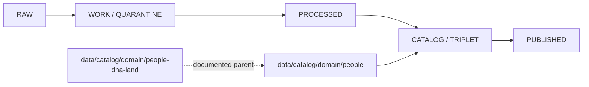

<!-- [KFM_META_BLOCK_V2]
doc_id: kfm://doc/data-catalog-domain-people-readme
title: data/catalog/domain/people/README.md — People Catalog Compatibility README
version: v0.1
type: readme; data-lifecycle-sublane; compatibility-segment-note
status: draft; PROPOSED; CONFLICTED-SEGMENT; data-root; catalog-stage; people; release-gated
owners: OWNER_TBD — People/DNA/Land steward · Data steward · Catalog steward · Evidence steward · Policy steward · Release steward · Docs steward
created: NEEDS VERIFICATION — blank placeholder existed before v0.1 expansion
updated: 2026-06-24
policy_label: restricted-doc; data; catalog; people; lifecycle; release-gated
tags: [kfm, data, catalog, people, people-dna-land, domain-catalog, CATALOG, TRIPLET, EvidenceBundle, SourceDescriptor, ReleaseManifest]
related:
  - ../../README.md
  - ../../../README.md
  - ../people-dna-land/README.md
  - ./dna/README.md
  - ../../../../docs/domains/people-dna-land/README.md
  - ../../../../docs/domains/people-dna-land/sublanes/people.md
  - ../../../../data/proofs/
  - ../../../../data/receipts/
  - ../../../../release/
notes:
  - "This file replaces a blank placeholder at `data/catalog/domain/people/README.md`."
  - "This short `people` segment is PROPOSED/CONFLICTED. The documented parent lane remains `data/catalog/domain/people-dna-land/`."
  - "This folder is a CATALOG-stage compatibility lane; it is not source data, proof storage, source registry, release authority, schema authority, policy authority, consent authority, implementation code, or a public data surface."
  - "Rollback target for this replacement is previous blank blob SHA `8b137891791fe96927ad78e64b0aad7bded08bdc`."
[/KFM_META_BLOCK_V2] -->

# data/catalog/domain/people

> Compatibility catalog index for the short `people` segment. Treat this path as **PROPOSED / CONFLICTED** until the People/DNA/Land segment decision is resolved.

  
  
  
  

**Status:** draft / PROPOSED / CONFLICTED-SEGMENT  
**Path:** `data/catalog/domain/people/README.md`  
**Owning root:** `data/catalog/domain/`  
**Compatibility segment:** `people`  
**Documented parent lane:** `data/catalog/domain/people-dna-land/`  
**Lifecycle stage:** `CATALOG / TRIPLET`  
**Exposure posture:** release-gated; no public use without approved release linkage  
**Truth posture:** CONFIRMED target was blank · CONFIRMED `data/catalog/` is RELEASED ONLY for public exposure · CONFIRMED `data/catalog/domain/people-dna-land/` is the documented parent catalog lane · CONFIRMED `data/catalog/domain/people/dna/` exists as a proposed/conflicted child lane · NEEDS VERIFICATION for whether this short segment should remain, redirect, or migrate.

## Purpose

`data/catalog/domain/people/` may serve as a compatibility index for catalog records that use the short `people` segment. It must remain subordinate to the People/DNA/Land lane and must not become a parallel authority root.

A catalog record helps users and systems discover governed data. It does not prove the underlying assertion, replace EvidenceBundle support, or approve publication.

## Lifecycle boundary

## Repo fit

| Responsibility | Correct home | Rule |
|---|---|---|
| Short-segment compatibility index | `data/catalog/domain/people/` | This lane, if retained. |
| Documented parent catalog lane | `data/catalog/domain/people-dna-land/` | Preferred current parent until ADR/migration says otherwise. |
| DNA child compatibility lane | `data/catalog/domain/people/dna/` | Existing proposed/conflicted child lane. |
| Evidence/proof records | `data/proofs/` | Not this lane. |
| Receipts | `data/receipts/` | Not this lane. |
| Release decisions | `release/` | Not this lane. |
| Schemas and policy | `schemas/`, `policy/` | Not this lane. |
| Code/tests | implementation roots and test roots | Not this lane. |

## Accepted contents

- Compatibility index records that point to the documented `people-dna-land` catalog lane.
- Release-linked pointers to approved public-safe derivatives.
- Evidence, source, policy, receipt, and release references.
- Migration notes or crosswalks for resolving the `people` versus `people-dna-land` segment.

## Exclusions

- RAW, WORK, QUARANTINE, PROCESSED, or PUBLISHED data.
- EvidenceBundle/proof records.
- SourceDescriptor/source-registry records.
- Receipts.
- Release decisions.
- Semantic contracts, schemas, policy rules, validators, tests, or implementation code.
- Any public exposure shortcut around the documented People/DNA/Land controls.

## Child lanes

| Child lane | Status | Purpose |
|---|---|---|
| `dna/` | draft / PROPOSED / CONFLICTED-SEGMENT | Existing short-segment DNA compatibility lane. |

## Guardrails

- Do not treat this path as canonical while the segment conflict remains open.
- Do not duplicate or weaken `data/catalog/domain/people-dna-land/` governance.
- Do not publish from this lane directly.
- Keep evidence, receipts, policy, release, schemas, source registries, and implementation code in their owning roots.
- Mark concrete catalog inventory, schema status, validators, route behavior, and migration status as NEEDS VERIFICATION until checked.

## Evidence ledger

| Source | Status | Supports | Limits |
|---|---|---|---|
| Previous file | CONFIRMED | Target was blank. | No lane boundaries existed. |
| `data/catalog/README.md` | CONFIRMED | CATALOG stage and RELEASED ONLY public posture. | Does not prove People catalog inventory. |
| `data/catalog/domain/people-dna-land/README.md` | CONFIRMED | Current documented parent catalog lane. | Does not resolve short-segment placement. |
| `data/catalog/domain/people/dna/README.md` | CONFIRMED | Existing child compatibility lane. | Does not prove parent inventory. |
| `docs/domains/people-dna-land/README.md` | CONFIRMED doctrine / PROPOSED implementation | Segment conflict and deny/restrict posture. | ADR/migration remains unresolved. |

## Validation checklist

- [ ] Confirm whether `data/catalog/domain/people/` is compatibility, ADR-approved, or a migration candidate.
- [ ] Confirm actual child files and catalog inventory.
- [ ] Confirm schema/profile location and segment naming.
- [ ] Confirm validators, access policy, receipts, release linkage, and route behavior.
- [ ] Confirm migration or redirect plan to avoid parallel catalog authority.

## Rollback

Rollback is required if this lane becomes a source-data root, proof store, source-registry root, release-decision root, published-output root, schema root, policy root, validator root, implementation root, or public exposure shortcut.

Rollback target for this replacement: previous blank blob SHA `8b137891791fe96927ad78e64b0aad7bded08bdc`.

<a href="#top">Back to top</a>

