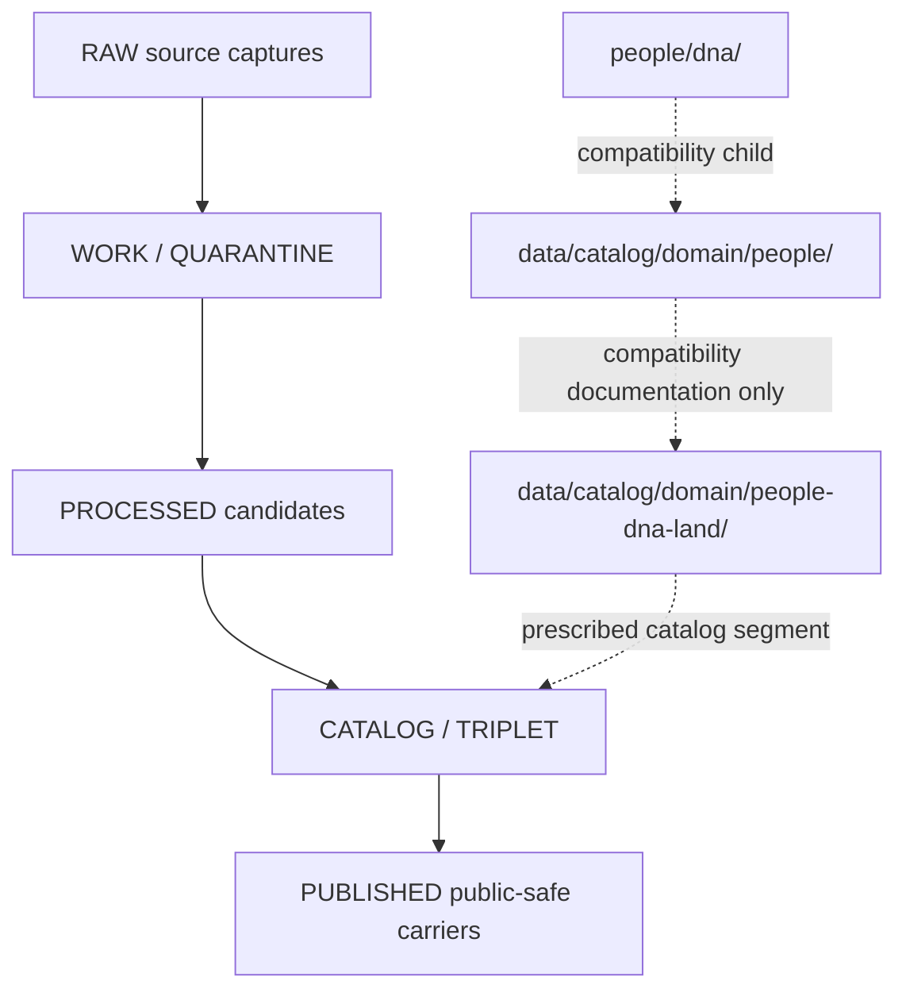

<!-- [KFM_META_BLOCK_V2]
doc_id: kfm://doc/data-catalog-domain-people-readme
title: data/catalog/domain/people/README.md — People Catalog Compatibility README
version: v0.2.0
type: readme; data-lifecycle-sublane; compatibility-segment-note; catalog-crosswalk
status: repository-grounded draft; PROPOSED; CONFLICTED-SEGMENT; compatibility-only; catalog-stage; deny-by-default; release-gated
owners: OWNER_TBD — People/DNA/Land steward · Data steward · Catalog steward · Evidence steward · Source steward · Rights and sensitivity steward · Consent and policy steward · Validation steward · Release steward · Correction and rollback steward · Docs steward
created: NEEDS VERIFICATION — blank placeholder existed before v0.1 expansion
updated: 2026-07-25
supersedes: v0.1 at the same repository path; no catalog record, authority, lifecycle, source, policy, consent, proof, release, publication, or runtime state
policy_label: restricted-doc; data; catalog; people; compatibility; conflicted-segment; deny-by-default; release-gated
current_path: data/catalog/domain/people/README.md
historical_blank_blob: 8b137891791fe96927ad78e64b0aad7bded08bdc
prepared_under_prompt: KFM Markdown Modernization & GitHub Documentation Implementation Agent v4.0.0
review_packet_id: kfm-people-catalog-compatibility-readme-20260725
truth_posture: >
  CONFIRMED exact path, stable document identity, current README, prescribed
  People/DNA/Land catalog segment, short-segment conflict, DNA compatibility
  child, land-ownership canonical child, and bounded contract, schema, policy,
  consent, test, fixture, validator, pipeline, source-registry, receipt, proof,
  candidate, published-layer, workflow, and review-routing documentation /
  PROPOSED retention of this short path as a compatibility-only crosswalk /
  NOT ESTABLISHED concrete People or DNA catalog records, accepted profiles,
  active producers or consumers, deterministic validators, proof production,
  consent enforcement, release approval, published People or DNA artifacts,
  public routes, or accepted path migration / UNKNOWN complete recursive
  catalog inventory, external stores, runtime reads, caches, hosts, and
  deployment effects / NEEDS VERIFICATION accountable stewardship, accepted
  segment disposition, source admission, rights and sensitivity decisions,
  policy and consent enforcement, correction behavior, and release closure
evidence_snapshot:
  repository: bartytime4life/Kansas-Frontier-Matrix
  base_ref: main
  base_commit: 97a8ba580c60e976c27ecf29a573fb5ac41009cf
  initial_evidence_commit: 9e1e26b69e607792712563588ed6bbced7807469
  continuity_compare: 9e1e26b69e607792712563588ed6bbced7807469...97a8ba580c60e976c27ecf29a573fb5ac41009cf
  prior_blob: f59fcbd45b1164319ae80bb0b97317846f56a6f9
  historical_blank_blob: 8b137891791fe96927ad78e64b0aad7bded08bdc
  method: complete target read plus bounded governing-doctrine, parent, child, contract, schema, policy, consent, test, fixture, validator, pipeline, source-registry, receipt, proof, candidate, published-layer, workflow, CODEOWNERS, branch, pull-request, and exact repository-path inspection; base drift was reconciled by commit comparison and changed only Habitat and Roads/Rail/Trade catalog READMEs plus Fauna fixture-safety files and a generated Fauna receipt; no recursive clone, payload sampling, runtime, host, cache, deployment, external-store, person-record, DNA-record, title-record, or legal-record inspection
related:
  - ./dna/README.md
  - ../people-dna-land/README.md
  - ../people-dna-land/land-ownership/README.md
  - ../README.md
  - ../../README.md
  - ../../../README.md
  - ../../../../docs/doctrine/directory-rules.md
  - ../../../../docs/domains/people-dna-land/README.md
  - ../../../../docs/domains/people-dna-land/CANONICAL_PATHS.md
  - ../../../../contracts/domains/people/README.md
  - ../../../../contracts/domains/people-dna-land/README.md
  - ../../../../schemas/contracts/v1/domains/people/README.md
  - ../../../../schemas/contracts/v1/domains/people-dna-land/README.md
  - ../../../../policy/domains/people-dna-land/README.md
  - ../../../../policy/consent/people/README.md
  - ../../../../policy/consent/people-dna-land/README.md
  - ../../../registry/sources/people/README.md
  - ../../../registry/sources/people-dna-land/README.md
  - ../../../receipts/people-dna-land/README.md
  - ../../../proofs/people-dna-land/README.md
  - ../../../../pipelines/domains/people/README.md
  - ../../../../pipeline_specs/people/README.md
  - ../../../../tests/domains/people/README.md
  - ../../../../release/candidates/people/README.md
  - ../../../../release/candidates/people-dna-land/README.md
  - ../../../published/layers/people/README.md
  - ../../../published/layers/people-dna-land/README.md
  - ../../../rollback/people/README.md
  - ../../../../connectors/people/README.md
  - ../../../../runtime/people/README.md
  - ../../../../.github/workflows/domain-people-dna-land.yml
  - ../../../../.github/CODEOWNERS
tags: [kfm, data, catalog, people, people-dna-land, dna, land-ownership, compatibility, catalog-crosswalk, CATALOG, TRIPLET, EvidenceBundle, SourceDescriptor, PolicyDecision, ConsentDecision, ReleaseManifest, deny-by-default, cite-or-abstain]
notes:
  - "This revision upgrades the existing README in place and preserves its stable doc_id, path, created-line uncertainty, historical blank-blob lineage, legacy anchors, and material safeguards."
  - "Directory Rules places the domain segment at `people-dna-land`; this short `people` path remains a documented segment conflict, not a second catalog authority."
  - "Directory Rules section 15 directly governs canonical and compatibility roots; this nested compatibility lane adopts its ordered folder-contract sections for consistency."
  - "The only confirmed direct child in the bounded inspection is `dna/`; a complete recursive payload inventory was not performed."
  - "The inspected `people/dna/` README is a repository-grounded compatibility draft and establishes no active DNA catalog."
  - "The inspected canonical parent has a land-ownership child README, but concrete catalog realization, release, publication, and public routing remain unproven."
  - "Short-segment bridge or compatibility READMEs also exist under contracts, schemas, consent policy, source registry, pipeline specifications, pipelines, tests, release candidates, published layers, rollback, connectors, and runtime; their presence documents migration risk and does not establish one accepted cross-root alias."
  - "The People/DNA/Land workflow is a readiness detector with explicit validation, proof, and release holds; it is not catalog, consent, proof, release, or publication authority."
  - "This Markdown-only revision creates no person record, DNA record, land record, catalog payload, source admission, schema acceptance, policy or consent decision, evidence bundle, receipt, release, publication, route, correction, or rollback execution."
  - "Static badges describe verified documentation posture only; they do not assert CI, security, privacy, consent, validator, proof, release, or publication maturity."
[/KFM_META_BLOCK_V2] -->

# `data/catalog/domain/people/` — People Catalog Compatibility Lane

> **One-line purpose.** Preserve a bounded, deny-by-default crosswalk for the conflicted short `people` catalog segment without creating a parallel authority to `data/catalog/domain/people-dna-land/`.

> [!IMPORTANT]
> This path is **not** the prescribed People/DNA/Land domain segment. Current Directory Rules and the inspected canonical-path register place People/DNA/Land catalog responsibility at [`data/catalog/domain/people-dna-land/`](../people-dna-land/README.md). Until an accepted placement decision and migration record say otherwise, use this folder only for compatibility documentation and crosswalks.

> [!CAUTION]
> Do not place real person, household, address, parcel-person, genealogy, DNA, genomic, kit, vendor, match, segment, consent, revocation, title, or other restricted payloads here. Path presence, consent language, catalog metadata, evidence links, a workflow result, or a merged README does not make sensitive data admissible, safe, true, released, or public.

**Quick navigation:** [Purpose](#purpose) · [Authority](#authority-level) · [Status](#status) · [Belongs](#what-belongs-here) · [Exclusions](#what-does-not-belong-here) · [Inputs](#inputs) · [Outputs](#outputs) · [Validation](#validation) · [Review](#review-burden) · [Related](#related-folders) · [ADRs](#adrs) · [Last reviewed](#last-reviewed) · [Lifecycle](#lifecycle-boundary) · [Repo fit](#repo-fit) · [Children](#child-lanes) · [Guardrails](#guardrails) · [Evidence](#evidence-ledger) · [Checklist](#validation-checklist) · [Rollback](#rollback) · [No-loss](#no-loss-ledger)

## Purpose

`data/catalog/domain/people/` is an existing short-segment catalog path with an unresolved placement conflict. Its current defensible role is a compatibility index for maintainers evaluating links, redirects, migration, or retirement of historical `people` references. It must remain subordinate to the prescribed [`people-dna-land`](../people-dna-land/README.md) domain segment.

This README is for repository maintainers, People/DNA/Land domain reviewers, catalog and source stewards, privacy and sensitivity reviewers, consent and policy reviewers, evidence reviewers, release reviewers, and documentation reviewers. It explains what the path may and may not mean while the conflict remains open.

A catalog record can support discovery, review, interoperability, and release preparation. It cannot manufacture source identity, person identity, relationship truth, DNA meaning, ownership truth, legal effect, consent, evidence, admissibility, review, release, correction, or public authority. This compatibility README is weaker still: it does not establish a concrete People catalog record family.

## Authority level

**Existing compatibility path / repository-grounded documentation / segment placement CONFLICTED / retention PROPOSED / no independent catalog authority.**

| Question | Bounded answer |
| --- | --- |
| Owning responsibility root | [`data/`](../../../README.md) |
| Lifecycle home | [`data/catalog/`](../../README.md) |
| Prescribed domain segment | [`people-dna-land`](../people-dna-land/README.md) |
| This path's current role | Compatibility documentation and segment crosswalk only |
| Semantic authority | Accepted contracts under the prescribed [`people-dna-land`](../../../../contracts/domains/people-dna-land/README.md) home; the inspected [`people` contract path](../../../../contracts/domains/people/README.md) is a short-segment bridge, not independent authority |
| Machine-shape authority | Accepted schemas under the selected governed schema home; the inspected [`people-dna-land`](../../../../schemas/contracts/v1/domains/people-dna-land/README.md) and short [`people`](../../../../schemas/contracts/v1/domains/people/README.md) indexes remain proposed, conflicted, or incomplete |
| Source authority | Accepted `SourceDescriptor` and activation decisions under `data/registry/`; the inspected short [`people` source registry](../../../registry/sources/people/README.md) and [`people-dna-land` guide](../../../registry/sources/people-dna-land/README.md) do not prove admitted descriptors |
| Admissibility and consent authority | Accepted policy and consent evaluation under `policy/`; the inspected short [`people` consent lane](../../../../policy/consent/people/README.md) and [`people-dna-land` lane](../../../../policy/consent/people-dna-land/README.md) remain placement-conflicted or non-executable |
| Evidence authority | EvidenceBundles and governed proof under [`data/proofs/`](../../../proofs/people-dna-land/README.md), not a catalog pointer |
| Release authority | Accepted decisions under `release/`; the short [`people` candidate lane](../../../../release/candidates/people/README.md) is compatibility-only and the [`people-dna-land` candidate parent](../../../../release/candidates/people-dna-land/README.md) does not establish approval |
| Public-serving authority | Governed interfaces and released public-safe carriers only; never this directory |

The current [Directory Rules](../../../../docs/doctrine/directory-rules.md) place lifecycle material beneath `data/`, catalog material beneath `data/catalog/`, and the composite domain under the `people-dna-land` segment. The inspected [canonical-path register](../../../../docs/domains/people-dna-land/CANONICAL_PATHS.md) records the short `people` segment as a conflict to resolve, not an alternate authority to expand.

No accepted ADR or migration receipt resolving retention, redirect, aliasing, or removal of this exact short catalog path was confirmed in the bounded evidence snapshot. That decision remains **NEEDS VERIFICATION**.

## Status

| Surface | Truth status | Current bounded finding |
| --- | ---: | --- |
| Exact path and README | `CONFIRMED` | This path and stable `doc_id` exist at `main@97a8ba580c60e976c27ecf29a573fb5ac41009cf`. |
| Prior version | `CONFIRMED` | Blob `f59fcbd45b1164319ae80bb0b97317846f56a6f9` is the inspected v0.1 baseline. |
| Historical blank predecessor | `CONFIRMED lineage` | Blob `8b137891791fe96927ad78e64b0aad7bded08bdc` is retained as history, not recommended as the normal rollback target. |
| Lifecycle placement | `CONFIRMED` | The path sits inside the catalog responsibility root. |
| Domain-segment placement | `CONFLICTED` | Directory Rules prescribe `people-dna-land`; this short `people` segment is not independently authorized. |
| Compatibility disposition | `PROPOSED / NEEDS VERIFICATION` | No accepted retain, redirect, migrate, or remove decision was confirmed. |
| Confirmed direct child | `CONFIRMED file / compatibility draft` | [`dna/README.md`](./dna/README.md) exists and explicitly establishes no active DNA catalog. |
| Complete recursive inventory | `UNKNOWN` | The review used bounded exact-path reads rather than a recursive clone or payload inventory. |
| People or DNA catalog records | `NOT ESTABLISHED` | No accepted concrete record family, profile, or emitted payload was confirmed. |
| People/DNA/Land semantic contracts | `CONFIRMED documentation / draft or proposed` | The prescribed parent documentation and a short-segment People bridge exist; neither establishes an accepted People catalog contract or concrete DNA catalog contract. |
| Machine schemas | `CONFIRMED bridge indexes / implementation incomplete` | Both `people-dna-land` and short `people` schema indexes exist; the short path is explicitly conflicted, and no accepted People or DNA catalog schema was confirmed. |
| Sources and rights | `CONFIRMED guide surfaces / payloads unknown` | A short People registry README and People/DNA/Land registry guidance exist; concrete admitted descriptors, activation decisions, and current rights were not established. |
| Pipelines and specifications | `CONFIRMED compatibility docs plus inert scaffolds` | The short specification lane is README-only, the short executable lane is draft compatibility guidance, and five parent stage specifications use empty `stages` lists; accepted loaders, schedulers, or catalog builders were not established. |
| Tests and fixtures | `CONFIRMED competing documentation or stub posture` | A short People test index and DNA child documentation exist, while the workflow-governed People/DNA/Land test index remains a greenfield stub and expects no executable test functions; no real sensitive fixture payload was inspected. |
| Validators | `CONFIRMED documentation posture` | The validator index is documentary; accepted deterministic People or DNA catalog enforcement was not established. |
| Policy and consent | `CONFIRMED scaffold / conflicting README surfaces` | Domain policy is a greenfield scaffold; short People and People/DNA/Land consent READMEs exist, but placement, executable rules, evaluator binding, active bundle, revocation, receipts, cache invalidation, and production enforcement remain unestablished. |
| Receipts and proofs | `CONFIRMED guide surfaces / artifacts unproven` | Parent guides exist; emitted People or DNA receipts, EvidenceBundles, or deterministic proof production were not established. |
| Release candidates | `CONFIRMED short compatibility and prescribed-parent documentation` | The short People lane is compatibility-only and reports its candidate inventory as unknown; no governed People or DNA dossier, approved PromotionDecision, ReleaseManifest, or release was confirmed. |
| Published carriers | `CONFIRMED short placeholder and prescribed-parent documentation` | The short People published-layer README and DNA child placeholder exist, but emitted artifacts, manifest linkage, validation, rollback, and governed routes remain unknown or unproven. |
| Rollback support | `CONFIRMED short compatibility documentation` | `data/rollback/people/` documents proposed data-plane support; it does not prove a released People artifact, accepted RollbackCard, alias transition, derivative invalidation, or executed rollback. |
| Domain workflow | `CONFIRMED readiness holds` | The workflow checks for maturity and deliberately holds executable validation, proof production, and release dry run. |
| Review routing | `CONFIRMED routing only` | CODEOWNERS routes review to `@bartytime4life`; accountable domain, privacy, consent, legal, and release stewardship remains `NEEDS VERIFICATION`. |
| Public use | `DENY BY DEFAULT` | No public-safe People or DNA release path is established by this lane. |

The land-ownership catalog README in the final evidence snapshot is a repository-grounded draft at the prescribed parent segment. It confirms canonical responsibility placement for that sublane while keeping concrete catalog realization, source activation, policy, consent, validation, proof, release, publication, legal effect, and title authority unproven. It does not legitimize the short `people` segment.

## What belongs here

While the segment decision remains unresolved, keep this lane documentation-only.

| Allowed content | Required posture |
| --- | --- |
| This compatibility README | Stable identity, explicit conflict status, bounded evidence, and no authority inflation |
| Crosswalks from historical short paths | Point toward the prescribed `people-dna-land` responsibility without duplicating its content or authority |
| Proposed redirect or migration notes | Clearly marked `PROPOSED`; identify decision owner, compatibility risk, validation, rollback, and required receipt |
| Deprecation or supersession notices | Preserve old identifiers and links; identify accepted replacement and effective state only after approval |
| Child compatibility indexes | Documentation-only, deny-by-default, and subordinate to an accepted parent placement |
| Links to governed authority objects | References only; do not copy contracts, schemas, SourceDescriptors, EvidenceBundles, policy decisions, consent decisions, receipts, release records, or published payloads here |
| Open verification records | Concrete question, evidence needed, accountable reviewer, and fail-closed default |

If maintainers later accept real catalog records at this path, that would be an authority-changing decision beyond this README. It requires an accepted placement decision, explicit migration plan, deterministic validation, conflict-free identity and routing, evidence and policy review, rollback support, and updates across every affected authority surface.

## What does NOT belong here

| Prohibited content or interpretation | Governed home or action |
| --- | --- |
| RAW, WORK, QUARANTINE, PROCESSED, or PUBLISHED payloads | Their accepted lifecycle roots under `data/` |
| Real names, household records, addresses, contact details, protected addresses, person identifiers, or identity-resolution dossiers | Deny, quarantine, restrict, minimize, deidentify, or handle only in an explicitly accepted protected system |
| DNA, genomic, kit, vendor, match, segment, haplogroup, phenotype, health, kinship, or genealogy payloads | Deny by default; require accepted contracts, consent and revocation enforcement, policy, sensitivity review, evidence, and protected handling |
| Private person-parcel, person-title, person-tax, person-address, genealogy-land, or DNA-land joins | Deny by default; never infer authority from catalog adjacency |
| Land-ownership records, assessor exports, instruments, parcel files, title material, or legal conclusions | Accepted People/DNA/Land and land-ownership lanes; KFM is not title, boundary, or legal authority |
| SourceDescriptor records or activation decisions | [`data/registry/`](../../../registry/sources/people-dna-land/README.md) |
| EvidenceBundles, proofs, attestations, or claim support | [`data/proofs/`](../../../proofs/people-dna-land/README.md) |
| Run, validation, policy, consent, review, correction, release, or migration receipts | [`data/receipts/`](../../../receipts/people-dna-land/README.md) or another accepted receipt lane |
| Semantic contracts or machine schemas | [`contracts/`](../../../../contracts/domains/people-dna-land/README.md) and [`schemas/`](../../../../schemas/contracts/v1/domains/people-dna-land/README.md) |
| Policy modules, consent evaluators, revocation services, or access-control rules | [`policy/`](../../../../policy/domains/people-dna-land/README.md) and governed implementation roots |
| Fixtures, tests, validators, packages, tools, pipelines, specifications, workflows, or runtime code | Their owning responsibility roots |
| PromotionDecision, ReleaseManifest, RollbackCard, or release approval | [`release/`](../../../../release/candidates/people-dna-land/README.md) |
| Public downloads, APIs, tiles, indexes, search corpora, vector stores, AI retrieval collections, or UI caches | Governed public interfaces and released public-safe carriers only |
| Credentials, access tokens, private endpoints, restricted access instructions, or secret material | Approved secret-management and protected operations systems |

## Inputs

This compatibility lane may consume documentation evidence only:

- current Directory Rules and accepted repository placement doctrine;
- the prescribed People/DNA/Land catalog parent and its confirmed child indexes;
- the short-path DNA compatibility README;
- accepted ADRs, migration decisions, deprecation notices, and supersession records if they later exist;
- exact repository path and blob identity;
- bounded contract, schema, source, rights, policy, consent, validation, proof, receipt, release, publication, workflow, and review-routing evidence;
- issue or review outcomes that explicitly decide retention, redirect, migration, or removal; and
- correction and rollback requirements for preserving links and avoiding parallel authority.

Do not feed real People, DNA, genealogy, household, parcel-person, title, consent, or other sensitive payloads into a compatibility-documentation change. A metadata sample can still identify or expose a person; “documentation” is not a sensitivity exemption.

## Outputs

Allowed outputs are limited to:

- a clear compatibility README at this exact path;
- stable links toward the prescribed People/DNA/Land authorities;
- explicit conflict, maturity, sensitivity, and release posture;
- a reviewable migration or redirect proposal, when authorized;
- bounded evidence and open-verification ledgers; and
- reversible documentation change history.

This lane must not emit or imply:

- a Person, DNA, Genealogy, Household, LandOwnership, or other domain record;
- an accepted catalog profile, STAC item, DCAT record, PROV record, triplet, graph edge, or CatalogMatrix closure;
- source admission, rights clearance, identity resolution, policy admission, consent, revocation, validation, proof, review, release, publication, correction, or deletion;
- a public route, API response, download, map, search index, AI answer corpus, or deployed runtime effect; or
- a legal, title, boundary, relationship, identity, ancestry, health, or genetic conclusion.

## Validation

Validation for this path has two separate layers.

### Documentation validation

This README revision should pass:

- one H1 and a logical heading hierarchy;
- valid KFM metadata, UTF-8 text, LF endings, and a final newline;
- stable legacy fragments and explicit anchors;
- balanced Markdown tables, links, fences, HTML tags, and alert blocks;
- Mermaid source parsing;
- repository-relative link resolution against the pinned base;
- secret-like text, credential, precise-location, and real-person-data screening;
- exact remote byte readback after commit; and
- a base-to-head comparison containing only this requested file.

Documentation checks establish source quality only. They do not establish domain maturity, consent enforcement, privacy safety, proof, release, or public readiness.

### Domain and release validation

The inspected [`domain-people-dna-land` workflow](../../../../.github/workflows/domain-people-dna-land.yml) is a bounded readiness detector:

- validation holds because an accepted executable People/DNA/Land suite and consent enforcement are not established;
- proof production holds because no accepted proof producer or deterministic proof command is established; and
- release dry run holds because no accepted release command or candidate-manifest contract is established.

Those holds are evidence of fail-closed behavior, not evidence that a People or DNA catalog exists. Do not weaken, bypass, relabel, or interpret them as passing domain validation.

## Review burden

Any change beyond wording and link maintenance has a high review burden because path placement can silently create authority and because People/DNA/Land joins can create material privacy, safety, legal, consent, re-identification, discrimination, stalking, fraud, or targeting risks.

| Change class | Minimum review concern |
| --- | --- |
| Documentation wording or links | Catalog, docs, and People/DNA/Land domain review |
| Segment redirect, alias, migration, or removal | Repository architecture, affected path owners, compatibility, link, CI, release, and rollback review |
| Person, household, genealogy, or identity semantics | Domain, privacy, sensitivity, evidence, policy, legal, and correction review |
| DNA or genomic semantics | Domain, consent, revocation, privacy, security, ethics, evidence, policy, legal, retention, deletion, and release review |
| Land-ownership relationship or person-parcel join | Land-record, privacy, sensitivity, identity, evidence, policy, legal, title-boundary, correction, and release review |
| Source activation or rights change | Source, rights, license, access, retention, sensitivity, and policy review |
| Public-safe derivative or route | Deidentification, aggregation, precision, re-identification, evidence, consent where applicable, release, public-interface, and rollback review |

CODEOWNERS provides a default GitHub routing signal only. It does not prove that the necessary accountable stewards or specialist reviewers have accepted a change.

## Related folders

| Responsibility | Current repository surface | Boundary |
| --- | --- | --- |
| Prescribed domain catalog parent | [`data/catalog/domain/people-dna-land/`](../people-dna-land/README.md) | Current catalog placement; its README remains draft documentation |
| Short-segment DNA compatibility child | [`data/catalog/domain/people/dna/`](./dna/README.md) | Repository-grounded compatibility draft; no active DNA catalog |
| Canonical land-ownership catalog child | [`data/catalog/domain/people-dna-land/land-ownership/`](../people-dna-land/land-ownership/README.md) | Canonical responsibility placement; concrete realization and release remain unproven |
| Catalog parent | [`data/catalog/`](../../README.md) | Lifecycle parent; not proof or release authority |
| Domain index | [`data/catalog/domain/`](../README.md) | Catalog domain routing |
| People/DNA/Land doctrine | [`docs/domains/people-dna-land/`](../../../../docs/domains/people-dna-land/README.md) | Domain documentation and proposed architecture |
| Canonical-path register | [`CANONICAL_PATHS.md`](../../../../docs/domains/people-dna-land/CANONICAL_PATHS.md) | Records current placement conflicts; does not itself execute migration |
| Short semantic bridge | [`contracts/domains/people/`](../../../../contracts/domains/people/README.md) | Compatibility contract orientation; not an accepted parallel domain |
| Semantic contracts | [`contracts/domains/people-dna-land/`](../../../../contracts/domains/people-dna-land/README.md) | Object meaning, not catalog existence |
| Short schema bridge | [`schemas/contracts/v1/domains/people/`](../../../../schemas/contracts/v1/domains/people/README.md) | Explicitly proposed and conflicted; no accepted catalog shape |
| Machine schemas | [`schemas/contracts/v1/domains/people-dna-land/`](../../../../schemas/contracts/v1/domains/people-dna-land/README.md) | Shape responsibility; inspected maturity is incomplete |
| Domain policy | [`policy/domains/people-dna-land/`](../../../../policy/domains/people-dna-land/README.md) | Greenfield policy scaffold |
| Short People consent | [`policy/consent/people/`](../../../../policy/consent/people/README.md) | README-only, placement-conflicted, non-executable posture |
| Consent policy | [`policy/consent/people-dna-land/`](../../../../policy/consent/people-dna-land/README.md) | README-only, placement-conflicted scaffold; not enforcement |
| Short People source registry | [`data/registry/sources/people/`](../../../registry/sources/people/README.md) | Experimental short-slug guide; concrete descriptor inventory and activation unproven |
| Source registry | [`data/registry/sources/people-dna-land/`](../../../registry/sources/people-dna-land/README.md) | Source identity and activation responsibility; concrete payloads unproven |
| Receipts | [`data/receipts/people-dna-land/`](../../../receipts/people-dna-land/README.md) | Process memory; emitted People/DNA receipts unproven |
| Proofs | [`data/proofs/people-dna-land/`](../../../proofs/people-dna-land/README.md) | Evidence support; emitted People/DNA proofs unproven |
| Tests | [`tests/domains/people-dna-land/`](../../../../tests/domains/people-dna-land/README.md) | Greenfield stub; accepted suite unproven |
| Fixtures | [`fixtures/domains/people-dna-land/`](../../../../fixtures/domains/people-dna-land/README.md) | Synthetic-fixture documentation; sensitive payload bodies were not inspected |
| Validators | [`tools/validators/domains/people-dna-land/`](../../../../tools/validators/domains/people-dna-land/README.md) | Documentation index; accepted deterministic enforcement unproven |
| Short People tests | [`tests/domains/people/`](../../../../tests/domains/people/README.md) | Proposed parent index with DNA documentation; executable coverage and canonical naming unproven |
| Short People pipeline | [`pipelines/domains/people/`](../../../../pipelines/domains/people/README.md) | Draft alias guidance; executable behavior and wiring unproven |
| Pipelines | [`pipelines/domains/people-dna-land/`](../../../../pipelines/domains/people-dna-land/README.md) | Planning documentation; executable behavior unproven |
| Short People specification alias | [`pipeline_specs/people/`](../../../../pipeline_specs/people/README.md) | README-only compatibility alias; no active alias specification |
| Pipeline specifications | [`pipeline_specs/people-dna-land/`](../../../../pipeline_specs/people-dna-land/README.md) | Five inert stage-list scaffolds at the pinned base |
| Short People candidate lane | [`release/candidates/people/`](../../../../release/candidates/people/README.md) | Compatibility-only; inventory unknown and no independent release authority |
| Release candidates | [`release/candidates/people-dna-land/`](../../../../release/candidates/people-dna-land/README.md) | Candidate documentation; a candidate is not a release |
| Short People published-layer lane | [`data/published/layers/people/`](../../../published/layers/people/README.md) | Restricted placeholder; emitted artifacts and release linkage unproven |
| Published layers | [`data/published/layers/people-dna-land/`](../../../published/layers/people-dna-land/README.md) | Carrier documentation; People/DNA artifacts and routes unproven |
| Short People rollback support | [`data/rollback/people/`](../../../rollback/people/README.md) | Compatibility data-plane guide; no accepted or executed rollback established |
| Connector migration consumer | [`connectors/people/`](../../../../connectors/people/README.md) | README-only short-name compatibility boundary; no active connector established |
| Runtime migration consumer | [`runtime/people/`](../../../../runtime/people/README.md) | README-only sensitive-runtime compatibility index; executable runtime unproven |
| Domain workflow | [`.github/workflows/domain-people-dna-land.yml`](../../../../.github/workflows/domain-people-dna-land.yml) | Readiness and hold reporting; not authority |
| Review routing | [`.github/CODEOWNERS`](../../../../.github/CODEOWNERS) | Default routing; not stewardship or approval |

## ADRs

| Decision surface | Inspected posture | Relevance |
| --- | ---: | --- |
| [Directory Rules](../../../../docs/doctrine/directory-rules.md) | Current doctrine | Prescribes the `people-dna-land` domain segment and catalog responsibility placement |
| [People/DNA/Land canonical paths](../../../../docs/domains/people-dna-land/CANONICAL_PATHS.md) | Current path register with open conflict | Records the short `people` path conflict and preferred current placement |
| [ADR-0001 — schema home](../../../../docs/adr/ADR-0001-schema-home--schemas-contracts-v1-is-canonical.md) | `PROPOSED` | Separates machine shape from this catalog compatibility lane |
| [ADR-0010 — deny by default](../../../../docs/adr/ADR-0010-deny-by-default-for-dna-rare-species-archaeology-infrastructure.md) | `DRAFT / PROPOSED` | Supports fail-closed DNA and high-risk join handling; enforcement remains unproven |
| [ADR-0011 — receipts, proofs, manifests, and catalogs](../../../../docs/adr/ADR-0011-receipts-vs-proofs-vs-manifests-vs-catalog-separation.md) | `PROPOSED` | Keeps discovery, process memory, evidence support, and release authority separate |
| [ADR-0015 — governed current alias](../../../../docs/adr/ADR-0015-data-published-_domain_-current-alias-is-governed-by-rollback_card.md) | `DRAFT / PROPOSED` | Describes a two-plane alias rollback concept; no People alias transition or execution was established |
| [ADR-0022 — CatalogMatrix closure](../../../../docs/adr/ADR-0022-catalog-matrix--stac-+-dcat-+-prov-must-agree.md) | `PROPOSED` | Expresses projection-agreement intent; no People or DNA closure was established |
| [ADR-0025 — public clients avoid internal stores](../../../../docs/adr/ADR-0025-public-client-never-reads-canonical-internal-stores.md) | `DRAFT / PROPOSED` | Supports the no-direct-public-read boundary; runtime enforcement remains unproven |
| Exact short-path disposition | `NOT FOUND in bounded evidence` | An accepted retain, redirect, migrate, alias, or remove decision is still required |

This README accepts none of the proposed ADRs and does not invent a missing path decision. Where acceptance or enforcement matters, the lane fails closed.

## Last reviewed

- **Substantive documentation review:** 2026-07-25.
- **Evidence base:** `main@97a8ba580c60e976c27ecf29a573fb5ac41009cf`.
- **Target baseline:** blob `f59fcbd45b1164319ae80bb0b97317846f56a6f9`.
- **Evidence boundary:** exact target plus bounded reads of linked doctrine, parent and child catalog indexes, contracts, schemas, policy, consent, tests, fixtures, validators, pipelines, specifications, source registry, receipts, proofs, candidates, published carriers, workflow, CODEOWNERS, open pull requests, branches, and exact prospective paths.
- **Not inspected:** a recursive catalog payload inventory, fixture payload bodies, external stores, runtime processes, deployments, hosts, caches, county or recorder systems, title records, legal files, real person records, DNA records, consent systems, or revocation systems.
- **Human review:** pending.
- **Re-review triggers:** accepted path ADR; segment migration; redirect or deprecation; new child; concrete People or DNA catalog profile; source activation; rights, sensitivity, privacy, or consent change; executable validator; proof producer; release candidate; published artifact; public route; correction; withdrawal; supersession; revocation; deletion request; or rollback.

## Lifecycle boundary

```mermaid
flowchart TD
  RAW["RAW source captures"] --> WQ["WORK / QUARANTINE"]
  WQ --> PROC["PROCESSED candidates"]
  PROC --> CAT["CATALOG / TRIPLET"]
  CAT --> PUB["PUBLISHED public-safe carriers"]
  CAN["data/catalog/domain/people-dna-land/"] -. "prescribed catalog segment" .-> CAT
  COMP["data/catalog/domain/people/"] -. "compatibility documentation only" .-> CAN
  DNA["people/dna/"] -. "compatibility child" .-> COMP
```

This path does not provide a shortcut through the lifecycle. Source identity, rights, sensitivity, purpose limitation, evidence, identity resolution, policy, consent where applicable, receipts, review, correction, release, and rollback must remain independently governed.

A file move, crosswalk, redirect, catalog entry, Git commit, pull request, merge, workflow result, badge, map, index, API shape, or generated narrative is not lifecycle promotion. Public consumers must use governed interfaces and released public-safe carriers, never this compatibility directory or another canonical internal store directly.

## Repo fit

| Responsibility | Correct home | Compatibility rule |
| --- | --- | --- |
| People/DNA/Land catalog responsibility | [`data/catalog/domain/people-dna-land/`](../people-dna-land/README.md) | Prescribed current segment |
| Short `people` catalog references | `data/catalog/domain/people/` | Documentation crosswalk only until accepted disposition |
| Short DNA catalog references | [`data/catalog/domain/people/dna/`](./dna/README.md) | Compatibility documentation; no active DNA catalog |
| Land-ownership catalog responsibility | [`data/catalog/domain/people-dna-land/land-ownership/`](../people-dna-land/land-ownership/README.md) | Canonical sublane placement; not title authority |
| Source captures and working data | Accepted RAW, WORK, QUARANTINE, and PROCESSED People/DNA/Land lanes | Never this catalog compatibility path |
| Catalog projections | Accepted STAC, DCAT, PROV, or triplet lanes if deliberately created | Do not create empty projections to imply closure |
| Source identity and activation | Short [`people`](../../../registry/sources/people/README.md) and [`people-dna-land`](../../../registry/sources/people-dna-land/README.md) registry guides | Catalog references sources; neither guide proves admission |
| Evidence and proof | [`data/proofs/`](../../../proofs/people-dna-land/README.md) | Evidence supports claims; catalog placement does not |
| Process memory | [`data/receipts/`](../../../receipts/people-dna-land/README.md) | Receipts do not prove truth or release |
| Semantic meaning | Prescribed [`people-dna-land`](../../../../contracts/domains/people-dna-land/README.md) home and short [`people` bridge](../../../../contracts/domains/people/README.md) | Catalog paths do not define meaning; the bridge does not settle placement |
| Machine shape | Prescribed [`people-dna-land`](../../../../schemas/contracts/v1/domains/people-dna-land/README.md) index and short [`people` bridge](../../../../schemas/contracts/v1/domains/people/README.md) | Catalog paths do not accept schemas; neither index proves an accepted catalog shape |
| Policy and consent | Domain [`policy`](../../../../policy/domains/people-dna-land/README.md), short [`people` consent](../../../../policy/consent/people/README.md), and [`people-dna-land` consent](../../../../policy/consent/people-dna-land/README.md) | Catalog paths do not decide admissibility or consent; current execution is unproven |
| Release decisions | `release/`, including the short [`people` compatibility lane](../../../../release/candidates/people/README.md) and prescribed [`people-dna-land` parent](../../../../release/candidates/people-dna-land/README.md) | A catalog record or candidate is not a release |
| Public-safe carriers | Short [`people` placeholder](../../../published/layers/people/README.md) and prescribed [`people-dna-land` carriers](../../../published/layers/people-dna-land/README.md) | Only after accepted release; no direct read from this lane |
| Data-plane rollback support | Short [`data/rollback/people/`](../../../rollback/people/README.md) compatibility lane | Support documentation does not authorize or prove rollback |

## Child lanes

### Confirmed direct compatibility child

| Child | Repository-grounded posture | Consequence |
| --- | --- | --- |
| [`dna/`](./dna/README.md) | Existing `PROPOSED / CONFLICTED` compatibility lane; no accepted catalog contract, schema, source admission, validator, consent enforcement, proof, release candidate, published artifact, or public route established | Keep deny-by-default and documentation-only |

The complete recursive inventory of `data/catalog/domain/people/` remains `UNKNOWN` because this review did not perform a recursive clone or payload inspection. The table records the child confirmed by exact reads; it is not a completeness claim.

### Adjacent prescribed-segment child

[`data/catalog/domain/people-dna-land/land-ownership/`](../people-dna-land/land-ownership/README.md) is a child of the prescribed parent, not of this short compatibility lane. Its repository-grounded draft confirms placement while retaining fail-closed catalog, source, evidence, privacy, consent, legal, title, release, publication, correction, and rollback boundaries.

Do not mirror that sublane beneath `people/`, create a second authority, or infer that a land-ownership child authorizes People, DNA, genealogy, household, or private person-parcel catalogs.

## Guardrails

| Guardrail | Required posture |
| --- | --- |
| Path is not authority | The short `people` path remains conflicted until an accepted disposition and migration receipt resolve it |
| Catalog is not truth | Discovery metadata cannot establish a person, relationship, ancestry, DNA, ownership, address, parcel, consent, or legal claim |
| Name is not identity | Preserve source spelling, aliases, uncertainty, and evidence; do not silently merge same-name people or split one person |
| Person is not household | Do not infer co-residence, family, dependency, or relationship from an address, parcel, tax, contact, or proximity record |
| DNA is not identity by default | A kit, vendor, match, segment, marker, haplogroup, or generated classification cannot silently become a canonical person |
| DNA is not consent | Collection, processing, matching, inference, retention, sharing, publication, deletion, and revocation require separately governed scope |
| Consent is not universal permission | Preserve purpose, subject, scope, data class, recipient, time, revocation, deletion, and downstream effects; fail closed when unresolved |
| Revocation must propagate | A README or catalog record cannot implement revocation, cache invalidation, deletion, withdrawal, or downstream correction |
| Evidence is not release | EvidenceBundle support, if present, does not establish policy admission, review, consent, release, or public safety |
| Administrative record is not title | Assessor, tax, parcel, mailing, or recorder context cannot establish legal ownership, residency, possession, beneficial interest, marketability, or boundary |
| Geometry is not legal boundary | Parcel geometry, geocoding, map display, or spatial join is not surveyed or adjudicated boundary authority |
| One instrument is not a chain | Preserve chain gaps, conflicts, temporal scope, interests, adverse evidence, uncertainty, and correction state |
| Source role cannot silently upgrade | Observed, regulatory, modeled, aggregate, administrative, candidate, and synthetic roles remain distinct through every derivative |
| Temporal roles cannot collapse | Collection, observation, effective, recording, retrieval, processing, review, consent, release, correction, revocation, and supersession times remain distinct |
| Precision is governed | Generalize, aggregate, deidentify, redact, restrict, or withhold sensitive location and relationship detail according to accepted policy |
| Cross-domain joins are new claims | A join needs its own purpose, contract, evidence, source-role, rights, sensitivity, policy, consent where applicable, validation, review, release, correction, and rollback |
| Public-safe is not harmless by default | Evaluate re-identification, linkage, stalking, targeting, fraud, discrimination, trespass, and aggregation risk |
| AI is interpretive | Extraction, entity resolution, kinship inference, ancestry narrative, title-chain inference, summaries, and classifications remain candidates, never root evidence or decision authority |
| Cite or abstain | Unsupported or conflicting consequential claims remain visible as uncertainty, conflict, denial, or abstention |
| Public clients avoid internal stores | Do not expose this lane through UI, API, download, search, vector index, graph, AI retrieval, cache, tile, or direct repository read |

## Evidence ledger

| Evidence | Observed status | Supports | Does not prove |
| --- | ---: | --- | --- |
| Exact target and prior blob | `CONFIRMED` | Same-path modernization, stable identity, and v0.1 baseline | Recursive inventory, runtime, or domain maturity |
| [Directory Rules](../../../../docs/doctrine/directory-rules.md) | `CONFIRMED current doctrine` | `data/catalog/` responsibility and `people-dna-land` segment placement | Full repository compliance or path migration execution |
| [Canonical-path register](../../../../docs/domains/people-dna-land/CANONICAL_PATHS.md) | `CONFIRMED document posture` | Short `people` conflict and preferred current placement | Accepted migration, redirect, or deletion |
| [People/DNA/Land catalog parent](../people-dna-land/README.md) | `CONFIRMED path / draft documentation` | Prescribed catalog parent and restricted posture | Concrete catalog records, complete inventory, or release |
| [DNA compatibility child](./dna/README.md) | `CONFIRMED repository-grounded draft` | Existing conflicted child and explicit no-active-catalog posture | DNA record, contract, schema, consent, proof, release, or public route |
| [Land-ownership catalog child](../people-dna-land/land-ownership/README.md) | `CONFIRMED repository-grounded draft` | Canonical parent-child placement and not-title boundary | Concrete record realization, title, legal effect, release, or public behavior |
| [Contract documentation](../../../../contracts/domains/people-dna-land/README.md) and [short bridge](../../../../contracts/domains/people/README.md) | `CONFIRMED paths / draft or proposed` | Separate semantic authority, current documented families, and the unresolved short bridge | Accepted short People or DNA catalog contract |
| [Schema documentation](../../../../schemas/contracts/v1/domains/people-dna-land/README.md) and [short bridge](../../../../schemas/contracts/v1/domains/people/README.md) | `CONFIRMED paths / proposed or conflicted` | Separate machine-shape responsibility and the unresolved short bridge | Accepted People or DNA catalog schema or validation |
| [Domain policy](../../../../policy/domains/people-dna-land/README.md) | `CONFIRMED greenfield scaffold` | Separate admissibility responsibility | Executable policy, decision, or enforcement |
| [Short People consent](../../../../policy/consent/people/README.md) and [People/DNA/Land consent](../../../../policy/consent/people-dna-land/README.md) | `CONFIRMED README-only conflicts` | Intended consent, revocation, and decision responsibility | Consent evaluator, active bundle, receipt propagation, deletion, or enforcement |
| [Short People tests](../../../../tests/domains/people/README.md) and [People/DNA/Land tests](../../../../tests/domains/people-dna-land/README.md) | `CONFIRMED proposed index plus greenfield stub` | Test responsibility and naming conflict exist | Accepted executable People/DNA/Land validation |
| [Fixture documentation](../../../../fixtures/domains/people-dna-land/README.md) | `CONFIRMED documentation` | Intended synthetic-fixture responsibility | Real payload, coverage, privacy safety, or successful tests |
| [Validator documentation](../../../../tools/validators/domains/people-dna-land/README.md) | `CONFIRMED documentation` | Validator responsibility exists | Executable deterministic People or DNA catalog enforcement |
| [Short pipeline](../../../../pipelines/domains/people/README.md) and [parent pipeline](../../../../pipelines/domains/people-dna-land/README.md) | `CONFIRMED compatibility and planning posture` | Intended executable responsibility and naming conflict | Loader, scheduler, catalog build, consent wiring, or runtime behavior |
| [Short specification alias](../../../../pipeline_specs/people/README.md) and [parent specifications](../../../../pipeline_specs/people-dna-land/README.md) | `CONFIRMED README-only alias plus inert scaffolds` | Five named parent stage specifications and alias boundary exist | Accepted stage graph, implementation, or run |
| [Short source registry](../../../registry/sources/people/README.md) and [People/DNA/Land registry](../../../registry/sources/people-dna-land/README.md) | `CONFIRMED guides / payloads unknown` | Separate source identity, role, rights, activation responsibility, and topology conflict | Concrete SourceDescriptors, rights clearance, or activation |
| [Receipts](../../../receipts/people-dna-land/README.md) | `CONFIRMED guide / artifacts unproven` | Separate process-memory responsibility | People or DNA run, consent, correction, or release receipts |
| [Proofs](../../../proofs/people-dna-land/README.md) | `CONFIRMED guide / artifacts unproven` | Separate evidence-support responsibility | EvidenceBundle, proof producer, deterministic validation, or closure |
| [Short People candidate lane](../../../../release/candidates/people/README.md) and [People/DNA/Land candidates](../../../../release/candidates/people-dna-land/README.md) | `CONFIRMED compatibility and parent documentation` | Candidate responsibility, short-path conflict, and land-ownership child | Governed People or DNA dossier, approved decision, manifest, release, or publication |
| [Short People published layer](../../../published/layers/people/README.md) and [People/DNA/Land published layers](../../../published/layers/people-dna-land/README.md) | `CONFIRMED placeholder and parent documentation` | Public-carrier responsibility, short-path conflict, and documented children | Emitted artifact, release linkage, route, or current public state |
| [Short People rollback support](../../../rollback/people/README.md) | `CONFIRMED compatibility documentation` | Proposed data-plane rollback support and alias risk | Accepted RollbackCard, released input, derivative invalidation, or executed rollback |
| [Short connector](../../../../connectors/people/README.md) and [short runtime](../../../../runtime/people/README.md) | `CONFIRMED README-only compatibility surfaces` | Known migration consumers and sensitive-domain guardrails | Active connector, executable runtime, accepted alias resolver, deployment, or public route |
| [Domain workflow](../../../../.github/workflows/domain-people-dna-land.yml) | `CONFIRMED readiness and hold surface` | Explicit missing-validation, proof, and release posture | Domain truth, consent enforcement, proof, promotion, release, or privacy safety |
| [CODEOWNERS](../../../../.github/CODEOWNERS) | `CONFIRMED routing` | Default GitHub review request | Accepted stewardship, specialist review, consent, legal review, or release approval |
| Open pull-request and branch search | `CONFIRMED bounded preflight` | No exact target overlap or reserved branch was found before drafting | Historical, renamed, external, or future work outside the search |

Repository evidence outranks presentation. Authoritative source records and accepted EvidenceBundles outrank inferred identities, catalog convenience, map appearance, generated prose, and model output. Conflicts and gaps remain visible; this README does not resolve them by wording.

## Validation checklist

### Documentation change

- [x] Preserve the exact repository path and stable `doc_id`.
- [x] Preserve the historical created-line uncertainty and blank-blob lineage.
- [x] Preserve legacy anchors for Purpose, Lifecycle boundary, Repo fit, Accepted contents, Exclusions, Child lanes, Guardrails, Evidence ledger, Validation checklist, and Rollback.
- [x] Keep the short segment explicitly subordinate to `people-dna-land`.
- [x] Record known short-segment bridge and compatibility surfaces without treating them as one accepted alias or parallel authority.
- [x] Keep catalog, source, evidence, receipt, schema, policy, consent, release, published, code, and public-serving authorities separate.
- [x] Preserve deny-by-default handling for People, DNA, genealogy, land, and sensitive joins.
- [ ] Obtain accountable human review and approval.

### Placement and implementation closure

- [ ] Accept an explicit retain, redirect, migrate, alias, or remove decision for `data/catalog/domain/people/`.
- [ ] Identify every affected reference and consumer before changing the path.
- [ ] Establish conflict-free identities, redirects, link validation, migration receipts, and rollback behavior.
- [ ] Confirm the complete recursive catalog inventory without exposing sensitive payloads.
- [ ] Establish accepted People or DNA catalog contracts and machine schemas before admitting records.
- [ ] Establish source admission, rights, sensitivity, purpose limitation, and retention decisions.
- [ ] Establish executable policy, consent, revocation, deletion, cache-invalidation, and downstream-correction behavior where applicable.
- [ ] Establish deterministic validators, synthetic fixtures, tests, catalog builders, and no-network CI.
- [ ] Establish EvidenceBundle and receipt production with deterministic validation.
- [ ] Establish correction, dispute, withdrawal, supersession, and rollback behavior.
- [ ] Establish an approved PromotionDecision, immutable ReleaseManifest, public-safe derivative, governed route, and tested rollback before public use.

Unresolved checklist items are holds, not optional documentation debt.

## Rollback

Rollback for this Markdown modernization is documentation rollback only:

1. before merge, leave the review branch unmerged or close its pull request under the appropriate repository authority;
2. after merge, revert the scoped implementation commit or restore the prior target blob `f59fcbd45b1164319ae80bb0b97317846f56a6f9`;
3. re-run metadata, Markdown, link, anchor, Mermaid, secret, sensitive-data, and one-file-scope checks; and
4. confirm that the restored README still fails closed and does not create a parallel authority.

The historical blank blob `8b137891791fe96927ad78e64b0aad7bded08bdc` is preserved for lineage. Restoring a blank file is not the preferred normal rollback because it would remove explicit authority, sensitivity, evidence, release, and migration guardrails.

Operational rollback or corrective action is required if this lane becomes a source-data root, working-data store, quarantine area, processed-data store, catalog payload authority, source registry, proof store, receipt store, schema root, policy or consent root, validator root, implementation root, release-decision root, published-output root, public route, private-person lookup, DNA lookup, identity-resolution service, person-parcel join surface, legal or title authority, or shortcut around an accepted migration.

## No-loss ledger

| Baseline element | Treatment in v0.2.0 |
| --- | --- |
| Stable `doc_id` and exact path | **Kept** unchanged |
| v0.1 title, created uncertainty, and blank-blob lineage | **Kept** in metadata and rollback history |
| Draft, proposed, conflicted, catalog-stage, and release-gated posture | **Kept and clarified** with repository evidence |
| Purpose as a compatibility index subordinate to `people-dna-land` | **Kept and narrowed** to documentation-only use |
| Lifecycle boundary | **Kept and enriched** with prescribed-parent and compatibility-child relationships |
| Repo-fit separation | **Kept and expanded** across source, evidence, receipt, schema, policy, consent, release, published, and public-serving authorities |
| Accepted contents | **Kept** at legacy anchor `accepted-contents` and constrained to documentation/crosswalk material |
| Exclusions | **Kept** at legacy anchor `exclusions` and expanded for sensitive People, DNA, genealogy, land, identity, and public-route risks |
| DNA child | **Kept and updated** to the child's current repository-grounded no-active-catalog posture |
| Guardrails | **Kept and expanded** with identity, consent, revocation, source-role, temporal, precision, join, AI, and cite-or-abstain controls |
| Evidence ledger | **Kept and upgraded** from generic uncertainty to pinned, bounded findings |
| Validation checklist | **Kept and split** into documentation quality and authority-changing implementation closure |
| Rollback | **Kept and corrected** so the prior v0.1 blob is the normal documentation target while the blank blob remains lineage |
| Back-to-top navigation | **Kept** |

<a href="#top">Back to top</a>

