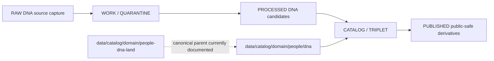

<!-- [KFM_META_BLOCK_V2]
doc_id: kfm://doc/data-catalog-domain-people-dna-readme
title: data/catalog/domain/people/dna/README.md — People DNA Catalog Compatibility Sublane README
version: v0.1
type: readme; data-lifecycle-sublane; restricted-domain-catalog-guide; compatibility-segment-note
status: draft; PROPOSED; CONFLICTED-SEGMENT; data-root; catalog-stage; people; dna; restricted; release-gated; consent-aware
owners: OWNER_TBD — People/DNA/Land steward · DNA steward · Data steward · Catalog steward · Evidence steward · Source steward · Consent steward · Policy steward · Sensitivity reviewer · Release steward · Docs steward
created: NEEDS VERIFICATION — blank placeholder existed before v0.1 expansion
updated: 2026-06-24
policy_label: restricted-doc; data; catalog; people; dna; lifecycle; release-gated; consent-aware
tags: [kfm, data, catalog, people, dna, people-dna-land, domain-catalog, CATALOG, TRIPLET, DNAMatchEvidence, DNASegment, DNAKitToken, ConsentGrant, RevocationReceipt, EvidenceBundle, SourceDescriptor, ReleaseManifest]
related:
  - ../../../README.md
  - ../../../../README.md
  - ../../people-dna-land/README.md
  - ../../../../docs/domains/people-dna-land/README.md
  - ../../../../docs/domains/people-dna-land/SENSITIVITY.md
  - ../../../../docs/domains/people-dna-land/sublanes/dna.md
  - ../../../../policy/consent/
  - ../../../../data/proofs/
  - ../../../../data/receipts/
  - ../../../../release/
notes:
  - "This file replaces a blank placeholder at `data/catalog/domain/people/dna/README.md`."
  - "This path uses the short `people/dna` segment form. People/DNA/Land doctrine records a segment-name conflict: Directory Rules examples use `people-dna-land`, while the Atlas crosswalk uses `people` for some schema/contract/policy roots. Treat this catalog path as PROPOSED/CONFLICTED until ADR resolution."
  - "The canonical domain catalog parent currently documented in this repo is `data/catalog/domain/people-dna-land/`; this file must not silently supersede it."
  - "DNA evidence is restricted by default; raw kit/vendor identifiers, raw genotype data, segment data, and triangulation outputs must not become public catalog material."
  - "This folder is a CATALOG-stage domain catalog sublane; it is not RAW, WORK, QUARANTINE, PROCESSED, PUBLISHED, proof storage, source registry, release authority, schema authority, policy code, consent authority, implementation code, or relationship/person authority."
  - "Rollback target for this replacement is previous blank blob SHA `8b137891791fe96927ad78e64b0aad7bded08bdc`."
[/KFM_META_BLOCK_V2] -->

# data/catalog/domain/people/dna

> Restricted DNA catalog compatibility sublane for governed DNA evidence references and DNA-derived public-safe derivatives inside the `CATALOG / TRIPLET` lifecycle stage.

  
  
  
  
  
  
  

**Status:** draft / PROPOSED / CONFLICTED-SEGMENT  
**Path:** `data/catalog/domain/people/dna/README.md`  
**Owning root:** `data/catalog/domain/`  
**Compatibility segment:** `people/dna`  
**Canonical parent lane currently documented:** `data/catalog/domain/people-dna-land/`  
**Lifecycle stage:** `CATALOG / TRIPLET`  
**Exposure posture:** restricted by default; public use requires explicit consent scope, policy/review posture, transform receipt, and release linkage  
**Truth posture:** CONFIRMED target was blank · CONFIRMED parent catalog lane is RELEASED ONLY for public exposure · CONFIRMED People/DNA/Land doctrine records segment conflict · CONFIRMED DNA sublane is restricted by default and raw kit/vendor IDs, raw genotype data, and DNA-derived outputs must not cross the publication boundary without scoped consent and approved derivatives · NEEDS VERIFICATION for why this short `people/dna` catalog path exists, whether it should redirect/migrate to `people-dna-land`, catalog inventory, schemas, validators, consent gates, receipts, release manifests, access controls, and route behavior.

**Quick jumps:** [Purpose](#purpose) · [Lifecycle boundary](#lifecycle-boundary) · [Repo fit](#repo-fit) · [Accepted contents](#accepted-contents) · [Exclusions](#exclusions) · [Catalog requirements](#catalog-requirements) · [DNA guardrails](#dna-guardrails) · [Evidence ledger](#evidence-ledger) · [Validation checklist](#validation-checklist) · [Rollback](#rollback)

---

## Purpose

`data/catalog/domain/people/dna/` stores or stages catalog records and indexes for DNA evidence references and DNA-derived public-safe derivatives **only if** the short `people/dna` catalog path is retained as a compatibility lane or ADR-approved catalog segment.

This lane must remain subordinate to the People/DNA/Land domain. It does not replace `data/catalog/domain/people-dna-land/`, does not resolve the segment-name conflict, and does not create a second sovereign DNA truth root.

A DNA catalog record supports discovery, steward review, consent validation, catalog closure, and release preparation. It does **not** make a DNA claim true, public, consented, policy-admitted, relationship-confirmed, person-confirmed, or released by itself.

## Lifecycle boundary

`data/catalog/domain/people/dna/` is a CATALOG-stage compatibility/proposed sublane. Public exposure applies only to records tied to approved release state, governed route, EvidenceBundle support, source-role support, rights/consent posture, sensitivity posture, transform receipt, and required rollback target.

## Repo fit

| Responsibility | Correct home | Rule |
|---|---|---|
| DNA catalog compatibility records | `data/catalog/domain/people/dna/` | This lane only if retained after ADR/migration decision. |
| Current People/DNA/Land catalog parent | `data/catalog/domain/people-dna-land/` | Current documented parent catalog lane. |
| People/DNA/Land doctrine | `docs/domains/people-dna-land/` | Human-facing domain doctrine. |
| DNA sublane doctrine | `docs/domains/people-dna-land/sublanes/dna.md` | Human-facing DNA restrictions and consent posture. |
| Evidence/proof records | `data/proofs/` | EvidenceBundle and proof records. |
| Source registry | `data/registry/` or accepted source registry root | SourceDescriptor entries, rights, role, and activation state. |
| Consent and revocation records | consent/receipt/policy roots as accepted | ConsentGrant, RevocationReceipt, and downstream cleanup state. |
| Receipts | `data/receipts/` | CatalogBuildReceipt, ReviewRecord, RedactionReceipt, PolicyDecision, correction receipts. |
| Release decisions | `release/` | Publication authority. |
| Schemas and policy | `schemas/`, `policy/` | Separate roots; segment naming remains NEEDS VERIFICATION/CONFLICTED where doctrine says so. |

## Accepted contents

| Content | Purpose |
|---|---|
| DNA catalog indexes | Group-level indexes for DNA catalog records. |
| DNAMatchEvidence catalog entries | Restricted evidence-reference catalog records, not public evidence. |
| DNASegment catalog references | Restricted segment references only; raw segment material belongs in governed lifecycle/proof homes, not public catalog. |
| DNAKitToken catalog references | Tokenized kit references without public-facing vendor identifier. |
| RelationshipHypothesis pointers | Links to hypotheses that cite DNA evidence without treating DNA as relationship adjudication. |
| Consent and revocation pointers | Links to ConsentGrant, RevocationReceipt, policy decisions, tombstone/cleanup obligations. |
| Aggregate or k-anonymized derivative entries | Release-candidate or released public-safe derivative catalog records with receipt links. |
| Evidence, source, policy, and receipt pointers | References to EvidenceBundle, SourceDescriptor, PolicyDecision, ReviewRecord, RedactionReceipt, ReleaseManifest, and validation reports. |

## Exclusions

| Do not put here | Correct home |
|---|---|
| RAW DNA/genotype/vendor exports | `data/raw/people-dna-land/` or source-specific governed home |
| WORK/intermediate DNA data | `data/work/people-dna-land/` |
| Quarantined DNA data | `data/quarantine/people-dna-land/` |
| Processed DNA datasets | `data/processed/people-dna-land/` |
| EvidenceBundle/proof records | `data/proofs/` |
| SourceDescriptor records | `data/registry/` or accepted source registry root |
| Consent policy/rules | `policy/consent/`, `policy/` or accepted consent policy root |
| Receipts | `data/receipts/` |
| Release decisions | `release/` |
| Published public products | `data/published/.../people-dna-land/` |
| Semantic contracts | `contracts/` or accepted contract root |
| Schemas | `schemas/` |
| Policy and sensitivity rules | `policy/` |
| Validators/tests/code | `tools/validators/`, `tests/`, implementation roots |

## Catalog requirements

PROPOSED until schemas, validators, inventory, access controls, and segment placement are verified:

| Requirement | Meaning |
|---|---|
| Stable catalog identity | Record has a stable identity linked to source, evidence, derivative, or release object. |
| Segment decision | Record path must not obscure whether the canonical segment is `people`, `people-dna-land`, or a compatibility bridge. |
| Evidence reference | Record points to EvidenceBundle/proof context when claims depend on evidence. |
| Source reference | Record points to SourceDescriptor/source catalog where source authority matters. |
| Consent posture | Record links to ConsentGrant, consent scope, expiry, revocation endpoint/state, and downstream cleanup duties when material. |
| Sensitivity posture | Record links to sensitivity classification, rights, privacy, access posture, and obligations. |
| Transform receipt | Public derivatives from restricted DNA input link to RedactionReceipt, k-anonymization receipt, aggregation receipt, differential-privacy receipt, or equivalent transform receipt. |
| Release reference | Public or release-linked records point to ReleaseManifest and rollback target. |

## DNA guardrails

- DNA catalog records are catalog carriers, not DNA truth by themselves.
- Raw kit/vendor identifiers, raw genotype data, segment data, and triangulation outputs must not become public catalog material.
- DNA evidence may support a relationship hypothesis; it does not become a confirmed canonical relationship without separate review.
- Living-person screening and consent posture are domain-wide gates, not optional DNA metadata.
- Public derivatives must be consent-scoped, redacted, aggregated, k-anonymized, differentially private where required, and rollback-aware.
- Revocation requires tombstone, cleanup, embargo, and downstream invalidation wherever consent-backed outputs depend on the revoked material.
- This `people/dna` path must not create a parallel authority root that weakens the `people-dna-land` governance lane.
- Unreleased DNA catalog records are not public merely because they exist under this directory.

## Evidence ledger

| Source | Status | Supports | Limits |
|---|---|---|---|
| `data/catalog/domain/people/dna/README.md` previous file | CONFIRMED | Target existed as a blank placeholder. | Did not define lane boundaries. |
| `data/catalog/README.md` | CONFIRMED | Parent catalog lane, RELEASED ONLY public posture, and catalog-not-release/proof/schema/policy boundary. | Does not prove DNA catalog inventory. |
| `data/catalog/domain/people-dna-land/README.md` | CONFIRMED | Current documented People/DNA/Land parent catalog lane and restricted/release-gated posture. | Does not resolve short-segment `people/dna` placement. |
| `docs/domains/people-dna-land/README.md` | CONFIRMED doctrine / PROPOSED implementation | People/DNA/Land sensitivity defaults and segment-name conflict. | Implementation and segment migration remain NEEDS VERIFICATION. |
| `docs/domains/people-dna-land/sublanes/dna.md` | CONFIRMED doctrine / PROPOSED implementation | DNA restricted-by-default posture, consent scope, raw DNA/publication boundary, DNA object families. | Sublane convention and exact data path remain PROPOSED. |

## Validation checklist

- [ ] Confirm why `data/catalog/domain/people/dna/` exists instead of or alongside `data/catalog/domain/people-dna-land/dna/`.
- [ ] Confirm whether this path is a compatibility bridge, ADR-approved short-segment lane, or migration candidate.
- [ ] Confirm actual child files and DNA catalog inventory under this lane.
- [ ] Confirm DNA catalog schema/profile location and segment naming.
- [ ] Confirm access policy, consent policy, validators, and CI checks.
- [ ] Confirm EvidenceBundle, SourceDescriptor, RunReceipt, ValidationReport, PolicyDecision, ReviewRecord, RedactionReceipt, ConsentGrant, RevocationReceipt, ReleaseManifest, and rollback references.
- [ ] Confirm DNA, living-person, relationship-hypothesis, privacy, consent, revocation, stale-state, and review handling.
- [ ] Confirm correction, withdrawal, tombstone, supersession, downstream cleanup, and rollback behavior for stale or revoked records.

## Rollback

Rollback is required if this lane becomes a People/DNA raw-data root, work area, quarantine store, processed-data store, proof store, source-registry root, release-decision root, published-output root, semantic-contract root, schema root, policy root, consent root, validator root, implementation root, relationship/person/DNA authority, or public exposure shortcut.

Rollback target for this replacement: previous blank blob SHA `8b137891791fe96927ad78e64b0aad7bded08bdc`.

<a href="#top">Back to top</a>

