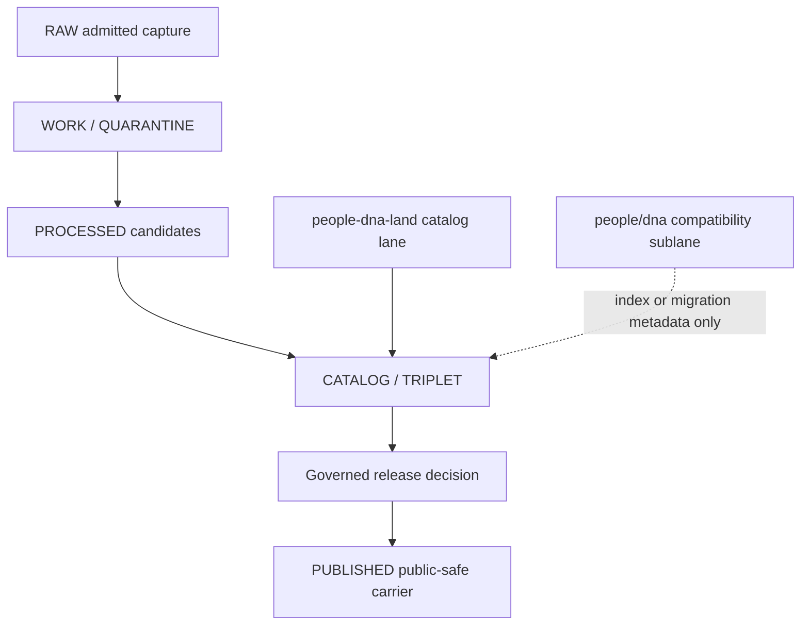

<!-- [KFM_META_BLOCK_V2]
doc_id: kfm://doc/data-catalog-domain-people-dna-readme
title: data/catalog/domain/people/dna/README.md - Restricted DNA Catalog Compatibility Sublane
version: v0.2.0
type: readme; data-lifecycle-sublane; restricted-domain-catalog-guide; compatibility-segment-note
status: repository-grounded draft; PROPOSED; CONFLICTED-SEGMENT; compatibility-sublane; catalog-stage; restricted; deny-by-default; release-gated; no-active-dna-catalog-established
owners: NEEDS VERIFICATION - People/DNA/Land, DNA/genomics, data, catalog, evidence, source, consent, privacy, sensitivity, policy, review, release, correction, rollback, schema, validation, and docs stewardship roles are not assigned; GitHub review routing is defined separately in .github/CODEOWNERS
created: NEEDS VERIFICATION - a blank placeholder existed before the v0.1 expansion
updated: 2026-07-25
policy_label: restricted-doc; no-sensitive-payload; data-catalog; people-dna-land; dna-genomic; compatibility; deny-by-default; consent-aware; revocation-aware; release-gated; no-direct-public-path
current_path: data/catalog/domain/people/dna/README.md
prepared_under_prompt: KFM Markdown Modernization & GitHub Documentation Implementation Agent v4.0.0
review_packet_id: kfm-people-dna-catalog-readme-20260725
tags: [kfm, data, catalog, people, dna, people-dna-land, domain-catalog, compatibility, CATALOG, TRIPLET, DNAMatchEvidence, DNASegment, DNAKitToken, RelationshipHypothesis, ConsentGrant, RevocationReceipt, EvidenceBundle, SourceDescriptor, PolicyDecision, ReviewRecord, RedactionReceipt, CatalogBuildReceipt, RunReceipt, ValidationReport, ReleaseManifest]
truth_posture: >
  CONFIRMED exact target path and prior blob, Directory Rules placement, the
  repository-present short people compatibility parent, the documented
  people-dna-land catalog parent, People/DNA/Land canonical-path conflict, DNA
  deny-by-default doctrine, consent and release separation, parent contract and
  schema indexes, inert parent pipeline specifications, documentation-only test
  and validator maturity, receipt/proof/release/publication guidance, workflow
  readiness holds, CODEOWNERS routing, and repository-relative link targets /
  PROPOSED any retained DNA compatibility catalog profile, record realization,
  schema, validator, transform profile, consent binding, catalog-closure packet,
  migration, redirect, or retirement plan / UNKNOWN recursive catalog contents,
  external or restricted stores, active producers and consumers, runtime reads,
  deployed consent or revocation enforcement, public effects, correction
  execution, and rollback execution / NEEDS VERIFICATION accountable
  stewardship, accepted path ADR, canonical sublane disposition, admitted
  sources, rights, consent authority, schema and contract maturity, deterministic
  validation, release closure, public-client isolation, and operational
  correction and rollback
evidence_snapshot:
  repository: bartytime4life/Kansas-Frontier-Matrix
  base_ref: main
  base_commit: 1b131fb5ab7a828cd3f7a6bb88aa33e0cee3d0bf
  initial_preflight_commit: 2183afaebbc6cd471e39f614327614f33c27026b
  continuity_compare: 2183afaebbc6cd471e39f614327614f33c27026b...1b131fb5ab7a828cd3f7a6bb88aa33e0cee3d0bf
  prior_blob: 131b118c6e05c58603629943de3f9eca39a4bf3a
  historical_blank_blob: 8b137891791fe96927ad78e64b0aad7bded08bdc
  method: complete target read plus bounded governing-neighbor, contract, schema, policy, consent, source, pipeline, specification, fixture, test, validator, receipt, proof, release, publication, workflow, CODEOWNERS, branch, and pull-request inspection; base drift was reconciled by comparing the initial preflight commit to the final base and confirming that only the unrelated Fauna catalog README changed; no recursive clone, sensitive payload access, external-store inspection, runtime inspection, deployment inspection, or release execution
related:
  - ../README.md
  - ../../people-dna-land/README.md
  - ../../README.md
  - ../../../README.md
  - ../../../../README.md
  - ../../../../../docs/doctrine/directory-rules.md
  - ../../../../../docs/domains/people-dna-land/CANONICAL_PATHS.md
  - ../../../../../docs/domains/people-dna-land/DNA_HANDLING.md
  - ../../../../../docs/domains/people-dna-land/CONSENT_MODEL.md
  - ../../../../../docs/domains/people-dna-land/RELEASE_INDEX.md
  - ../../../../../docs/domains/people-dna-land/sublanes/dna.md
  - ../../../../../contracts/domains/people-dna-land/README.md
  - ../../../../../schemas/contracts/v1/domains/people-dna-land/README.md
  - ../../../../../policy/domains/people-dna-land/README.md
  - ../../../../../policy/consent/people-dna-land/README.md
  - ../../../../registry/sources/people-dna-land/README.md
  - ../../../../receipts/people-dna-land/README.md
  - ../../../../proofs/people-dna-land/README.md
  - ../../../../../fixtures/domains/people-dna-land/README.md
  - ../../../../../tests/domains/people-dna-land/README.md
  - ../../../../../tools/validators/domains/people-dna-land/README.md
  - ../../../../../pipelines/domains/people-dna-land/README.md
  - ../../../../../pipeline_specs/people-dna-land/README.md
  - ../../../../../release/candidates/people-dna-land/README.md
  - ../../../../published/people-dna-land/README.md
  - ../../../../published/layers/people-dna-land/README.md
  - ../../../../../.github/workflows/domain-people-dna-land.yml
  - ../../../../../.github/CODEOWNERS
notes:
  - "Directory Rules sections 4, 9, and 12 support the data/catalog/domain responsibility and lifecycle placement but use people-dna-land as the domain segment."
  - "Directory Rules section 15 directly governs canonical and compatibility roots, not this nested sublane; its ordered README sections are adopted here as a consistency contract."
  - "The repository-present data/catalog/domain/people/ parent and this dna child are short-segment compatibility surfaces; neither supersedes data/catalog/domain/people-dna-land/."
  - "The v0.1 headings and their stable fragments remain available through headings or explicit legacy anchors."
  - "This Markdown-only revision creates no catalog record, DNA evidence, consent grant, revocation receipt, schema acceptance, validator, fixture, proof, receipt, release candidate, publication, public route, migration, redirect, correction, or rollback execution."
  - "No real person, DNA, genomic, kit, vendor, segment, consent, revocation, or person-parcel payload was opened or added."
  - "Static badges project verified documentation posture only; they do not assert policy, validator, CI, security, consent, release, publication, or privacy maturity."
[/KFM_META_BLOCK_V2] -->

# `data/catalog/domain/people/dna/` - Restricted DNA Catalog Compatibility Sublane

> **One-line purpose.** Define the fail-closed compatibility boundary for DNA-related catalog metadata under the short `people/dna` segment while keeping the documented `people-dna-land` lane, DNA evidence, consent, privacy, policy, release, correction, rollback, and public delivery independently governed.

> [!IMPORTANT]
> This path is repository-present, but its short `people/dna` segment is **PROPOSED / CONFLICTED**. The current People/DNA/Land path register uses `data/catalog/domain/people-dna-land/`. This README does not resolve that conflict, establish a DNA catalog, or create a second authority lane.

<!-- governance-alert-separator -->

> [!CAUTION]
> Real living-person identifiers, raw genotype data, raw DNA segments, raw kit or vendor identifiers, individual match tables, consent credentials, revocation secrets, and private person-to-parcel joins do not belong in this public repository catalog lane, examples, logs, screenshots, issue text, or pull-request text. Missing classification, rights, consent, revocation, sensitivity, or release evidence fails closed.

<!-- governance-alert-separator -->

> [!NOTE]
> Consent is necessary where policy requires it, but consent is never evidence, proof, review, release approval, or publication. A catalog entry is likewise not DNA truth, kinship truth, identity truth, or public permission.

**Quick navigation:** [Purpose](#purpose) · [Authority](#authority-level) · [Status](#status) · [Belongs](#what-belongs-here) · [Exclusions](#what-does-not-belong-here) · [Inputs](#inputs) · [Outputs](#outputs) · [Validation](#validation) · [Review](#review-burden) · [Related](#related-folders) · [ADRs](#adrs) · [Last reviewed](#last-reviewed) · [Lifecycle](#lifecycle-and-catalog-boundary) · [Path decision](#compatibility-and-path-decision) · [Requirements](#minimum-dna-catalog-record-expectations) · [Guardrails](#dna-anti-collapse-and-exposure-rules) · [Consent](#consent-revocation-correction-and-rollback) · [Release gates](#catalog-closure-and-release-gates) · [Evidence](#evidence-basis) · [Verification](#open-verification-register) · [Rollback](#migration-and-operational-rollback) · [Done](#definition-of-done) · [No-loss](#no-loss-ledger)

## Purpose

`data/catalog/domain/people/dna/` is a repository-present compatibility sublane inside the `CATALOG / TRIPLET` lifecycle stage. Its bounded purpose is to explain or, after a reviewed path decision, index DNA-related catalog metadata that must remain subordinate to the People/DNA/Land domain and its deny-by-default controls.

Until the path conflict is resolved, the safest accepted role is documentation, migration metadata, compatibility crosswalks, and release-linked pointers that resolve back to governed objects in their owning roots. A concrete DNA catalog record family, active producer, active consumer, public route, and retained short-segment profile are **not established** by the inspected evidence.

A catalog entry may support discovery, review, catalog closure, correction tracing, and release preparation. It does **not**:

- establish person identity, biological relationship, kinship, ancestry, or consent;
- upgrade DNA evidence into a canonical relationship;
- make restricted material public-safe;
- activate a source, schema, policy, validator, or pipeline;
- authorize release or publication; or
- replace evidence, proof, receipt, review, correction, withdrawal, or rollback objects.

## Authority level

**Compatibility / transitional sublane within the canonical `data/catalog/` responsibility root; repository-present; segment authority conflicted; no independent truth, consent, policy, release, or publication authority.**

Directory Rules place domain catalog material under `data/catalog/domain/<domain>/` and explicitly name `people-dna-land` as the domain segment. The repository also contains the short-segment compatibility parent `data/catalog/domain/people/` and this `dna/` child. Those facts establish repository presence, not canonical promotion.

| Authority question | Owning surface | This sublane's limit |
|---|---|---|
| Canonical People/DNA/Land catalog placement | [`data/catalog/domain/people-dna-land/`](../../people-dna-land/README.md) pending accepted path governance | May point to it; must not supersede it. |
| DNA and genomic handling doctrine | [`DNA_HANDLING.md`](../../../../../docs/domains/people-dna-land/DNA_HANDLING.md) | May preserve references; cannot redefine restrictions. |
| Semantic object meaning | [`contracts/domains/people-dna-land/`](../../../../../contracts/domains/people-dna-land/README.md) | Catalog metadata cannot create contract meaning. |
| Machine-checkable shape | [`schemas/contracts/v1/domains/people-dna-land/`](../../../../../schemas/contracts/v1/domains/people-dna-land/README.md) after accepted schema governance | This README is not a schema. |
| Source identity, role, rights, and activation | [`data/registry/sources/people-dna-land/`](../../../../registry/sources/people-dna-land/README.md) and accepted activation records | A source pointer is not source admission. |
| Consent evaluation and revocation | [`policy/consent/people-dna-land/`](../../../../../policy/consent/people-dna-land/README.md) plus accepted consent records and runtime enforcement | A consent reference is not active authorization. |
| Policy outcome and obligations | [`policy/domains/people-dna-land/`](../../../../../policy/domains/people-dna-land/README.md) plus accepted policy surfaces | Catalog placement cannot allow exposure. |
| Process memory and proof support | [`data/receipts/people-dna-land/`](../../../../receipts/people-dna-land/README.md) and [`data/proofs/people-dna-land/`](../../../../proofs/people-dna-land/README.md) | References do not become receipts or proofs. |
| Release decision | [`release/candidates/people-dna-land/`](../../../../../release/candidates/people-dna-land/README.md) and accepted release records | Candidate or catalog presence is not release. |
| Public-safe artifact delivery | [`data/published/people-dna-land/`](../../../../published/people-dna-land/README.md) and governed interfaces | Public clients must not read this directory directly. |

## Status

The following is a bounded repository-state statement for this documentation revision. It does not claim knowledge of ignored files, LFS content, external or restricted stores, local-only artifacts, runtime systems, deployments, or future branches.

| Surface | Bounded status | Evidence-based meaning |
|---|---:|---|
| Target README | `CONFIRMED` | Present at `main@1b131fb5ab7a828cd3f7a6bb88aa33e0cee3d0bf`; prior blob `131b118c6e05c58603629943de3f9eca39a4bf3a`. |
| Responsibility and lifecycle placement | `CONFIRMED` | `data/` owns lifecycle material and `catalog/` is the catalog stage. |
| Short `people/dna` segment | `PROPOSED / CONFLICTED` | Repository-present compatibility path; current path register uses `people-dna-land`. |
| Direct or recursive catalog payload inventory | `UNKNOWN` | No catalog-record inventory was established by the bounded inspection; absence is not asserted without a recursive tree and external-store review. |
| DNA catalog semantic contract | `NOT ESTABLISHED` | The inspected parent contract index has documentation children for people, genealogy, and land ownership; no accepted DNA catalog contract was established. |
| DNA catalog machine schema | `NOT ESTABLISHED` | The domain schema index reports no confirmed concrete `.schema.json` inventory; no DNA catalog schema or accepted profile was established. |
| Source admission | `UNKNOWN` | Source-registry guidance exists; admitted DNA `SourceDescriptor` records, rights, and activation decisions were not established. |
| Parent pipeline specifications | `INERT SCAFFOLDS` | `ingest.yaml`, `normalize.yaml`, `validate.yaml`, `catalog.yaml`, and `publish.yaml` are documented with `stages: []`; `dna_evidence.yaml` is recorded absent in the inspected spec index. |
| Executable tests | `NOT ESTABLISHED` | The domain tests README is a greenfield stub; the readiness workflow reports no collected People/DNA/Land test functions or classes. |
| Fixture payloads | `NOT ESTABLISHED` | The fixture index reports no verified payload inventory; the workflow refuses to open a newly surfaced payload automatically. |
| Executable validator | `NOT ESTABLISHED` | The domain validator lane is documentation-only; the readiness workflow reports no accepted executable body. |
| Consent and revocation enforcement | `NOT ESTABLISHED` | Consent doctrine and policy guidance exist; accepted executable modules, evaluator binding, domain fixtures/tests, receipt emission, revocation introspection, cache invalidation, and production enforcement remain unproved. |
| Emitted receipts and proofs | `NOT ESTABLISHED` | Parent guidance exists; emitted DNA receipt/proof inventories and a DNA receipt child are not established. The proof job is an explicit hold. |
| Release candidate | `NO ACTIVE DNA CANDIDATE ESTABLISHED` | The candidate README identifies only `land-ownership/`; the workflow requires no child candidate record and reports a release dry-run hold. |
| Published DNA artifact | `NOT ESTABLISHED` | Published guidance exists, but the inspected layer index confirms only `land-ownership/`; no DNA child or released DNA artifact was established. |
| Public readiness | `DENY BY DEFAULT` | This internal catalog path is not a public data surface. |
| Human review and stewardship | `PENDING / NEEDS VERIFICATION` | CODEOWNERS provides repository routing, not assigned stewardship or approval evidence. |

## What belongs here

Until an accepted path decision says otherwise, keep this lane limited to documentation and compatibility metadata. The candidate families below are **PROPOSED**, not proof of files, accepted object meaning, or schema fields.

| Candidate content | Bounded purpose | Minimum posture |
|---|---|---|
| Compatibility index | Maps legacy or short-segment references to the governed People/DNA/Land catalog identity without copying authority. | Versioned, deterministic, reviewable, and reversible. |
| Migration or disposition note | Records retain, consolidate, redirect, or retire analysis for this path. | Accepted decision reference, affected-link inventory, correction plan, and rollback target. |
| DNA evidence catalog descriptor | References a governed `DNAMatchEvidence` or `DNASegment` evidence object without embedding raw DNA, segment endpoints, kit IDs, or vendor IDs. | Restricted, evidence-bound, consent-aware, non-public. |
| Relationship-hypothesis pointer | Points to a reviewed hypothesis that cites DNA among multiple evidence kinds. | Must remain a hypothesis; never canonical kinship by catalog placement. |
| Consent and revocation reference | Carries an opaque pointer to the current governed `ConsentGrant`, `RevocationReceipt`, or accepted equivalent where required. | No credential, secret, raw grant, or perpetual-authorization implication. |
| Public-safe aggregate descriptor | Points to an approved aggregated, k-anonymized, differentially private, redacted, or otherwise transformed derivative. | `RedactionReceipt`, `AggregationReceipt`, or accepted transform receipt, reconstruction-risk review, release reference, correction path, and rollback target required. |
| Release-linked public pointer | Resolves to an immutable released carrier and its release state. | No direct source, proof, receipt, policy, or internal-store exposure. |
| Catalog quality summary | Summarizes bounded validation state while resolving to the underlying `CatalogBuildReceipt`, `RunReceipt`, `ValidationReport`, or accepted equivalents. | Summary is never proof or release approval. |

README-local indexes, inventories, migration maps, and correction notes may explain the lane without carrying sensitive payloads or becoming a parallel catalog authority.

## What does NOT belong here

| Prohibited material or authority | Correct home or action |
|---|---|
| Real living-person identifiers or private person-to-parcel joins | Do not place in a public repository catalog; use governed restricted systems and fail closed pending approved handling. |
| Raw genotype exports, individual match tables, segment endpoints, raw `DNASegment`, raw `DNAKitToken`, kit IDs, or vendor IDs | Governed restricted RAW or quarantine handling only; never this catalog lane or a public artifact. |
| Consent credentials, access tokens, revocation secrets, private endpoints, or re-identification keys | Approved secret or restricted operational systems; never Git, catalog metadata, logs, screenshots, or examples. |
| RAW, WORK, QUARANTINE, or PROCESSED payloads | The corresponding `data/<phase>/people-dna-land/` lifecycle lane after placement and access review. |
| Semantic contracts | [`contracts/domains/people-dna-land/`](../../../../../contracts/domains/people-dna-land/README.md) after accepted contract placement. |
| Machine schemas | [`schemas/contracts/v1/domains/people-dna-land/`](../../../../../schemas/contracts/v1/domains/people-dna-land/README.md) after accepted schema governance. |
| Source descriptors, rights determinations, or source activation | [`data/registry/sources/people-dna-land/`](../../../../registry/sources/people-dna-land/README.md) and accepted source-governance records. |
| Policy or consent rules | [`policy/domains/people-dna-land/`](../../../../../policy/domains/people-dna-land/README.md) and accepted consent/policy surfaces. |
| Consent grants, revocation receipts, review records, or policy-decision instances | Their accepted consent, receipt, proof, policy, and review object homes; this lane may hold opaque references only. |
| EvidenceBundles, ProofPacks, or validation-proof objects | [`data/proofs/people-dna-land/`](../../../../proofs/people-dna-land/README.md) under approved restricted handling. |
| Run, validation, transform, review, correction, or release receipts | [`data/receipts/people-dna-land/`](../../../../receipts/people-dna-land/README.md) under approved restricted handling. |
| Synthetic fixtures and executable tests | [`fixtures/domains/people-dna-land/`](../../../../../fixtures/domains/people-dna-land/README.md) and [`tests/domains/people-dna-land/`](../../../../../tests/domains/people-dna-land/README.md); synthetic and public-safe only. |
| Validator, pipeline, API, UI, renderer, or model code | Its implementation responsibility root, never `data/catalog/`. |
| Release candidates, decisions, manifests, correction notices, withdrawal notices, or rollback cards | [`release/`](../../../../../release/README.md) and its accepted sublanes. |
| Public API payloads, reports, tiles, layers, or exports | Released public-safe carriers under `data/published/` through governed interfaces. |
| A second canonical DNA, consent, person, genealogy, proof, policy, or release authority | Stop, record the conflict, and require an accepted ADR or migration plan. |

## Inputs

Inputs are catalog-stage metadata and stable references derived from governed upstream work. They may be considered only after the applicable source, evidence, identity, time, rights, consent, revocation, sensitivity, validation, policy, review, and lifecycle conditions are resolved.

Expected input classes, if this compatibility lane is retained, include:

- deterministic object and catalog identifiers;
- source and source-role references;
- evidence references that resolve to EvidenceBundles;
- contract and schema version references;
- privacy and sensitivity classifications;
- consent and revocation references for the exact operation, audience, purpose, field or relation, precision, and time window;
- transformation, aggregation, redaction, or public-safe-derivative receipts;
- validation and review references;
- immutable artifact and release references;
- correction, withdrawal, supersession, and rollback references; and
- compatibility or migration mapping from the short segment to the accepted domain identity.

Raw DNA, direct identifiers, credentials, secrets, unresolved rights material, and public-facing bytes are never inputs to this README lane.

## Outputs

Permitted outputs are internal compatibility metadata, catalog indexes, migration crosswalks, and release-linked pointers that preserve the authoritative objects in their owning roots.

An output from this lane is not:

- a DNA, identity, relationship, ancestry, or consent finding;
- an EvidenceBundle or proof;
- a PolicyDecision, ReviewRecord, or ReleaseManifest;
- a released artifact;
- a public endpoint; or
- permission for a client, model, map, or analyst to read an internal store directly.

Ordinary public clients may consume only governed API responses or immutable, release-resolved public-safe carriers. They must not traverse this catalog directory, source registries, consent internals, proofs, receipts, candidates, or canonical stores.

## Validation

### Current executable posture

[`domain-people-dna-land.yml`](../../../../../.github/workflows/domain-people-dna-land.yml) is a bounded readiness workflow, not a DNA catalog validator:

- it checks required responsibility boundaries;
- it reports no collected People/DNA/Land tests;
- it refuses to inspect newly surfaced fixture payloads automatically;
- it reports no accepted executable validator body;
- it confirms current policy scaffolding markers;
- it fails if executable maturity appears without deliberate graduation; and
- it records explicit validation, proof, and release dry-run holds.

The current hold is a safety boundary. A green readiness check does not prove DNA support, consent validity, revocation execution, privacy safety, EvidenceBundle closure, release readiness, or public eligibility.

### Documentation validation

For this README revision, validate:

1. UTF-8, LF line endings, one H1, and a final newline;
2. KFM Meta Block v2 delimiters and stable `doc_id`;
3. same canonical file path and one-file scope;
4. Directory Rules placement and first-twelve-H2 consistency;
5. all repository-relative links and internal fragments;
6. Markdown tables, alerts, HTML, code fences, and Mermaid syntax;
7. accessible badge alternative text and evidence-backed labels;
8. preservation of every legacy heading fragment and governance-bearing baseline statement;
9. absence of real DNA, living-person, consent, credential, or private person-land data;
10. exact remote byte read-back after commit;
11. branch, commit, pull-request, and changed-file scope; and
12. relevant documentation and People/DNA/Land workflow results without interpreting a readiness hold as implementation.

### Future capability validation

Before any DNA catalog profile is activated, deterministic no-network tests and synthetic public-safe fixtures must cover at least:

- missing, expired, revoked, suspended, disputed, stale, ambiguous, or unverifiable consent;
- unreachable revocation introspection and incomplete cache invalidation;
- raw genotype, raw segment, kit/vendor ID, and living-person disclosure denial;
- DNA-evidence-to-relationship and catalog-to-truth anti-collapse;
- operation-, purpose-, audience-, precision-, field/relation-, and time-scoped consent;
- multi-party disclosure and inference risk;
- evidence, rights, source-role, sensitivity, and release gaps;
- aggregation, k-anonymity, differential-privacy, and linkage/reconstruction risk;
- compatibility-path identity, redirect, correction, and rollback behavior;
- catalog, proof, receipt, release, and public-carrier separation; and
- public-client denial for internal or unreleased stores.

Passing checks prove only their declared scope.

## Review burden

This is one of KFM's highest-risk documentation lanes.

[`CODEOWNERS`](../../../../../.github/CODEOWNERS) routes repository review to `@bartytime4life` through the default pattern. That routing is not a StewardshipAssignment, sensitivity review, rights-holder representation, independent approval, ReviewRecord, PolicyDecision, or release decision.

At minimum, substantive review needs the applicable People/DNA/Land domain, DNA/genomics, privacy, consent, rights, source, evidence, catalog, schema, validation, policy, security, release, correction, rollback, and documentation perspectives. Accepted identities, quorum, recusal, and separation-of-duties controls remain **NEEDS VERIFICATION**.

The following changes require expanded specialist and independent review:

- adding or exposing catalog payloads;
- changing the domain-segment disposition;
- adding a DNA contract, schema, validator, fixture, or pipeline;
- activating a source or consent evaluator;
- changing privacy, sensitivity, transform, retention, revocation, or access behavior;
- creating a candidate, manifest, correction, withdrawal, or rollback object; or
- connecting this path to a governed API, static-delivery edge, model, map, UI, search, graph, or public client.

## Related folders

| Relationship | Repository surface | Bounded posture |
|---|---|---|
| Short-segment parent | [`data/catalog/domain/people/`](../README.md) | Repository-present compatibility lane; PROPOSED / CONFLICTED. |
| Documented domain catalog parent | [`data/catalog/domain/people-dna-land/`](../../people-dna-land/README.md) | Current path register's domain lane; concrete catalog maturity remains unproved. |
| Domain catalog index | [`data/catalog/domain/`](../../README.md) | Index and catalog-stage boundary. |
| Parent catalog | [`data/catalog/`](../../../README.md) | Canonical catalog responsibility; not publication by placement. |
| Data lifecycle root | [`data/`](../../../../README.md) | Lifecycle authority boundary. |
| Path governance | [`CANONICAL_PATHS.md`](../../../../../docs/domains/people-dna-land/CANONICAL_PATHS.md) | Uses `people-dna-land`; records the segment conflict. |
| DNA handling | [`DNA_HANDLING.md`](../../../../../docs/domains/people-dna-land/DNA_HANDLING.md) | Deny-by-default doctrine; implementation remains partly proposed. |
| DNA sublane doctrine | [`sublanes/dna.md`](../../../../../docs/domains/people-dna-land/sublanes/dna.md) | Restricted DNA guidance; the documentation sublane convention is itself proposed. |
| Consent model | [`CONSENT_MODEL.md`](../../../../../docs/domains/people-dna-land/CONSENT_MODEL.md) | Consent is revocable and does not publish data. |
| Release guidance | [`RELEASE_INDEX.md`](../../../../../docs/domains/people-dna-land/RELEASE_INDEX.md) | Deny-by-default release doctrine; not a release ledger. |
| Contract and schema indexes | [`contracts/.../people-dna-land/`](../../../../../contracts/domains/people-dna-land/README.md) · [`schemas/.../people-dna-land/`](../../../../../schemas/contracts/v1/domains/people-dna-land/README.md) | Documentation-heavy; no accepted DNA catalog contract/schema established. |
| Policy and consent | [`policy/domains/people-dna-land/`](../../../../../policy/domains/people-dna-land/README.md) · [`policy/consent/people-dna-land/`](../../../../../policy/consent/people-dna-land/README.md) | Domain policy scaffold and consent guidance; activation unproved. |
| Source, receipt, and proof | [`registry/sources/people-dna-land/`](../../../../registry/sources/people-dna-land/README.md) · [`receipts/people-dna-land/`](../../../../receipts/people-dna-land/README.md) · [`proofs/people-dna-land/`](../../../../proofs/people-dna-land/README.md) | Guidance exists; emitted DNA closure not established. |
| Fixtures, tests, and validators | [`fixtures/domains/people-dna-land/`](../../../../../fixtures/domains/people-dna-land/README.md) · [`tests/domains/people-dna-land/`](../../../../../tests/domains/people-dna-land/README.md) · [`tools/validators/domains/people-dna-land/`](../../../../../tools/validators/domains/people-dna-land/README.md) | Documentation-backed readiness; executable DNA suite not established. |
| Pipelines and specs | [`pipelines/domains/people-dna-land/`](../../../../../pipelines/domains/people-dna-land/README.md) · [`pipeline_specs/people-dna-land/`](../../../../../pipeline_specs/people-dna-land/README.md) | Executable behavior unproved; five parent specs are inert scaffolds. |
| Candidate and published surfaces | [`release/candidates/people-dna-land/`](../../../../../release/candidates/people-dna-land/README.md) · [`data/published/people-dna-land/`](../../../../published/people-dna-land/README.md) · [`data/published/layers/people-dna-land/`](../../../../published/layers/people-dna-land/README.md) | No active DNA candidate or published DNA artifact established. |

## ADRs

The following repository decisions are relevant and remain unaccepted at the pinned evidence snapshot:

| ADR | Effective status | Relevance |
|---|---:|---|
| [`ADR-0001`](../../../../../docs/adr/ADR-0001-schema-home--schemas-contracts-v1-is-canonical.md) | `proposed` | Proposes `schemas/contracts/v1/` as the default machine-schema home. |
| [`ADR-0010`](../../../../../docs/adr/ADR-0010-deny-by-default-for-dna-rare-species-archaeology-infrastructure.md) | `proposed` | Proposes operation-specific deny-by-default exposure controls for DNA and other protected classes. |
| [`ADR-0011`](../../../../../docs/adr/ADR-0011-receipts-vs-proofs-vs-manifests-vs-catalog-separation.md) | `proposed` | Separates process receipts, proof support, catalog records, release governance, and published artifacts. |
| [`ADR-0022`](../../../../../docs/adr/ADR-0022-catalog-matrix--stac-+-dcat-+-prov-must-agree.md) | `proposed` | Proposes release-level catalog agreement; current shared schema and closure tooling remain incomplete. |
| [`ADR-0025`](../../../../../docs/adr/ADR-0025-public-client-never-reads-canonical-internal-stores.md) | `proposed` | Proposes the public-client/internal-store boundary; static carriers remain release-resolved. |

This README accepts none of these ADRs. A reviewed ADR or migration record is required before this short segment is promoted, redirected, consolidated, or retired as an authority-bearing path.

No accepted ADR resolving `people` versus `people-dna-land`, or specifically retaining `people/dna`, was established by the bounded inspection.

## Last reviewed

- **Date:** 2026-07-25
- **Evidence boundary:** `main@1b131fb5ab7a828cd3f7a6bb88aa33e0cee3d0bf`
- **Prior target blob:** `131b118c6e05c58603629943de3f9eca39a4bf3a`
- **Historical blank predecessor:** `8b137891791fe96927ad78e64b0aad7bded08bdc`
- **Review type:** complete target read plus bounded governing-neighbor, workflow, branch, and pull-request inspection
- **Sensitive payload access:** none
- **Recursive tree, LFS, external store, runtime, deployment, and release execution:** not inspected
- **Human approval and accepted stewardship:** pending / needs verification

Re-review after any path/ADR, contract, schema, source, consent, policy, fixture, test, validator, pipeline, catalog payload, release, public delivery, correction, withdrawal, or rollback change - or within six months.

## Lifecycle and catalog boundary

```mermaid
flowchart TD
  RAW["RAW admitted capture"] --> HOLD["WORK / QUARANTINE"]
  HOLD --> PROCESSED["PROCESSED candidates"]
  PROCESSED --> CATALOG["CATALOG / TRIPLET"]
  CATALOG --> RELEASE["Governed release decision"]
  RELEASE --> PUBLISHED["PUBLISHED public-safe carrier"]
  CANON["people-dna-land catalog lane"] --> CATALOG
  SHORT["people/dna compatibility sublane"] -. "index or migration metadata only" .-> CATALOG
```

Promotion is a governed state transition, not a file move. For DNA-related material, every transition preserves the most restrictive applicable posture and requires independent closure of:

- source identity, role, rights, and activation;
- object identity, contract, and schema;
- evidence and citation support;
- living-person, relationship-inference, DNA/genomic, and linkage risk;
- consent scope, expiry, revocation, dispute, retention, and downstream obligations;
- sensitivity classification and public-safe transform;
- deterministic validation and auditable receipts;
- policy outcome and obligation enforcement;
- review and separation of duties;
- catalog and release closure;
- correction, withdrawal, invalidation, and rollback; and
- governed public delivery.

No material becomes public merely because it appears under `data/catalog/`, passes a schema check, receives consent for one use, is tokenized, or is aggregated.

## Compatibility and path decision

The current path evidence supports one conclusion: the path is present, but its long-term disposition is unsettled.

| Possible disposition | Status | Minimum required evidence |
|---|---:|---|
| Retain `people/dna` as an explicit compatibility bridge | `PROPOSED` | Accepted ADR or migration decision, bounded authority, identity mapping, no independent payload authority, tests, correction path, and rollback. |
| Consolidate compatibility metadata into `data/catalog/domain/people-dna-land/` | `PROPOSED` | Reference inventory, migration map, stable links, redirect/tombstone plan, consumer tests, correction notice where needed, and rollback. |
| Create a governed DNA sublane under the accepted domain parent | `PROPOSED` | Accepted sublane convention and path, contract/schema/policy pairing, synthetic fixtures, validator, release integration, and no parallel short-segment authority. |
| Retire this path | `PROPOSED` | Proven no-consumer or migrated-consumer state, archived lineage, durable successor pointer, reference closure, correction plan, and reversible deletion process. |
| Treat this path as canonical now | `DENY` | Current evidence does not support canonical promotion. |

Until a decision is accepted:

- do not add real or sensitive payloads;
- do not create a second schema, consent, policy, proof, receipt, release, or publication authority;
- do not infer that `people/dna` is canonical from repository presence;
- do not silently rewrite consumers or stable identities; and
- keep all claims bounded to documented compatibility behavior.

## Minimum DNA catalog record expectations

These are documentation-level acceptance expectations, not an accepted object contract or field schema. Do not serialize these labels as canonical fields until paired contracts and schemas are accepted.

| Concern | Minimum expectation before reliance |
|---|---|
| Catalog identity | Deterministic, versioned identity bound to the accepted domain and object identity, content digest, and compatibility mapping. |
| Object and claim class | DNA evidence, segment evidence, aggregate derivative, relationship hypothesis, and released public-safe pointer remain distinct. |
| Source and role | Resolving `SourceDescriptor`, source role, authority limit, rights, terms, activation state, retrieval state, and source version. |
| Evidence | Consequential claims resolve through `EvidenceRef` to an admissible EvidenceBundle; summaries never substitute for the bundle. |
| Subject and living-person state | Subject binding, living/deceased/unknown posture, confidence, review state, and dispute state remain explicit and fail closed when unresolved. |
| Consent | Exact operation, purpose, audience, field/relation, precision, derivation, export, time window, expiry, revocation, and multi-party impact are resolved. |
| DNA minimization | No raw genotype, segment endpoint, kit/vendor ID, individual match table, credential, or re-identification key enters a public or catalog-visible record. |
| Sensitivity and rights | Highest applicable sensitivity, rights, sovereignty, privacy, access class, retention, and obligation state travels with the record. |
| Transform | Aggregation, k-anonymity, differential privacy, redaction, tokenization, or other transform resolves to its profile, parameters, receipt, reviewer, limitations, and reconstruction-risk assessment. |
| Time | Source, observed, retrieval, processing, consent issuance/expiry/revocation, review, release, correction, supersession, and withdrawal times remain distinct where material. |
| Validation | Contract/schema, identity, source role, evidence, consent, privacy, sensitivity, transform, compatibility, catalog closure, and public-surface checks resolve to auditable reports or receipts. |
| Release | Any public-facing pointer resolves to immutable artifact identity, ReleaseManifest or accepted equivalent, PolicyDecision, ReviewRecord, field allowlist, correction path, withdrawal path, and rollback target. |
| Compatibility | Short and canonical identifiers, successor/predecessor links, migration state, redirect behavior, consumer state, and rollback remain inspectable. |

## DNA anti-collapse and exposure rules

1. **DNA evidence is not identity or kinship truth.** A match or segment may support a `RelationshipHypothesis`; it does not become a confirmed relationship through cataloging.
2. **A catalog record is not evidence, policy, review, release, or publication.** Each remains a separate governed object.
3. **Consent does not publish data.** Consent is operation-specific and independent of evidence, rights, sensitivity, review, release, correction, and rollback gates.
4. **Tokenization and pseudonymization do not make data anonymous or public.** Linkage and reconstruction risk remain review obligations.
5. **Raw genotype, raw segments, kit/vendor IDs, and individual match tables never become public catalog material.**
6. **Living-person ambiguity fails closed.** Unknown or disputed living status cannot become implicit public permission.
7. **A DNA-only relationship inference remains a hypothesis.** Catalog metadata must preserve uncertainty, source role, evidence diversity, and review state.
8. **Aggregation is not a universal allow path.** K-anonymity, differential privacy, generalization, and redaction require accepted profiles, receipts, reconstruction-risk review, and release closure.
9. **A neighboring domain may supply context, not weaker controls.** Geography, settlement, parcel, land, archaeology, agriculture, or other joins inherit the most restrictive applicable policy.
10. **Public clients never read this lane directly.** UI hiding, style filtering, private-looking URLs, or model refusal prompts cannot repair an unsafe delivered payload.
11. **Missing or stale support narrows or denies use.** Missing evidence, rights, consent, revocation state, sensitivity, review, correction, release, or rollback never becomes a plausible default.
12. **Generated language is interpretive only.** An AI summary cannot create DNA evidence, consent, policy approval, relationship truth, or release state.

## Consent, revocation, correction, and rollback

Consent must be explicit, machine-verifiable, immutable as an event, revocable, and bounded to the precise use under evaluation. A valid grant for one source, purpose, audience, field, relation, precision, derivative, export, or time window does not authorize another.

Fail closed when consent is missing, stale, unverifiable, expired, suspended, revoked, disputed, ambiguous, broader than the requested use, or affected by another person's rights.

Revocation or later-discovered risk requires the applicable:

1. deny or hold at the access and render gate;
2. immutable revocation or supersession event;
3. downstream dependency inventory;
4. cache, tile, search, graph, vector, API, model-context, and static-carrier invalidation;
5. correction, withdrawal, or tombstone record;
6. release-state update;
7. public notice where required;
8. revalidation of remaining derivatives; and
9. rollback to the last known-safe release or complete withdrawal.

The repository documents this intent, but the inspected evidence does not establish deployed revocation introspection, receipt emission, dependency tracing, cache invalidation, or rollback automation. Treat those capabilities as **NOT ESTABLISHED**, not implied.

## Catalog closure and release gates

A DNA-related catalog descriptor is eligible for release review only when all required gates close independently.

| Gate | Required closure | Fail-closed result |
|---|---|---|
| Path and identity | Accepted domain/sublane disposition, stable identity, digest, version, and compatibility mapping | Hold; do not create parallel authority. |
| Source and rights | Admitted source, explicit role, current terms, rights, attribution, and authority limit | Quarantine, deny, or abstain. |
| Evidence | Resolvable EvidenceRef/EvidenceBundle appropriate to claim significance | Abstain or deny the claim. |
| Living-person and DNA sensitivity | Classification, minimization, inference risk, join risk, and reviewer state | Deny public exposure. |
| Consent and revocation | Exact-scope current consent where required, reachable revocation state, multi-party and downstream obligations | Deny or hold. |
| Transform | Accepted profile, deterministic execution, receipt, limits, and reconstruction-risk review | Deny the derivative. |
| Contract, schema, and validation | Accepted paired meaning/shape, synthetic fixtures, negative tests, validator report, and finite outcome | Hold; no promotion. |
| Policy and review | PolicyDecision, obligations, assigned reviewers, independent approval, recusal, and version binding | Deny or hold. |
| Catalog closure | Domain, STAC/DCAT/PROV where applicable, artifact identity, evidence, and release references agree | Hold; no release claim. |
| Release | Immutable candidate/artifact pointer, release decision/manifest, correction, withdrawal, and rollback | No publication. |
| Public delivery | Governed API or immutable release-resolved carrier, field allowlist, integrity, expiry, and invalidation | Deny direct client access. |

Present repository maturity remains below these gates:

- no accepted DNA catalog contract or schema is established;
- no deterministic DNA catalog test or validator suite is established;
- the parent pipeline specifications are inert;
- consent and revocation runtime enforcement are unproved;
- no emitted DNA receipt/proof closure is established;
- no active DNA candidate or released DNA artifact is established; and
- the domain workflow reports explicit readiness holds.

Catalog placement must therefore remain internal, restricted, compatibility-scoped, and non-public.

## Evidence basis

| Evidence | Status | Supports | Does not prove |
|---|---:|---|---|
| Prior target blob `131b118c6e05c58603629943de3f9eca39a4bf3a` | `CONFIRMED` | Existing v0.1 scope, stable identity, legacy anchors, conflict posture, DNA restrictions, and historical blank rollback lineage. | Current operational maturity or canonical segment acceptance. |
| [`Directory Rules`](../../../../../docs/doctrine/directory-rules.md) plus supplied PDF | `CONFIRMED doctrine` | `data/` responsibility, `catalog` lifecycle stage, domain-lane pattern, `people-dna-land` segment, migration discipline, and README consistency contract. | Repo presence or acceptance of the short segment. |
| [`data/catalog/`](../../../README.md), [`domain/`](../../README.md), and [`people/`](../README.md) READMEs | `CONFIRMED repository docs` | Catalog-not-release boundary and short-segment compatibility posture. | Complete catalog inventory or public readiness. |
| [`data/catalog/domain/people-dna-land/`](../../people-dna-land/README.md) | `CONFIRMED repository doc` | Documented parent catalog lane and restricted/release-gated posture. | Concrete DNA catalog records or accepted sublane topology. |
| [`CANONICAL_PATHS.md`](../../../../../docs/domains/people-dna-land/CANONICAL_PATHS.md) | `CONFIRMED draft doctrine` | Uses `people-dna-land` for catalog placement and records the segment conflict. | Accepted ADR resolution or runtime consumers. |
| [`DNA_HANDLING.md`](../../../../../docs/domains/people-dna-land/DNA_HANDLING.md) and [`sublanes/dna.md`](../../../../../docs/domains/people-dna-land/sublanes/dna.md) | `CONFIRMED draft doctrine / PROPOSED implementation` | Raw-genotype non-public rule, DNA evidence anti-collapse, consent/revocation posture, and object vocabulary. | Executable enforcement or accepted concrete shapes. |
| [`CONSENT_MODEL.md`](../../../../../docs/domains/people-dna-land/CONSENT_MODEL.md) and [`policy/consent/...`](../../../../../policy/consent/people-dna-land/README.md) | `CONFIRMED draft docs / activation unproved` | Consent is necessary, scoped, revocable, and not publication. | Active evaluator, revocation service, receipts, cache invalidation, or production enforcement. |
| Contract and schema indexes | `CONFIRMED docs / concrete DNA profile not established` | Separate meaning and machine-shape responsibilities. | Accepted DNA catalog contract, schema, fixture parity, or validator coverage. |
| [`pipeline_specs/people-dna-land/`](../../../../../pipeline_specs/people-dna-land/README.md) | `CONFIRMED mixed scaffold` | Five root YAML scaffolds with empty `stages`; absent `dna_evidence.yaml` in its bounded inventory. | Active source-bound, parser-bound, scheduled, receipt-emitting, or release-linked execution. |
| Fixture, test, and validator lanes | `CONFIRMED docs / executable DNA suite not established` | Synthetic-only posture and current readiness boundary. | Behavioral enforcement or real-data safety. |
| Receipt and proof lanes | `CONFIRMED docs / emitted closure not established` | Process-memory/proof separation and restricted handling. | Emitted DNA receipts, proofs, signatures, or release closure. |
| Candidate and published lanes | `CONFIRMED docs / no DNA release established` | Release-gated delivery and correction/rollback expectations. | Active DNA candidate, manifest, public route, or published artifact. |
| [`domain-people-dna-land.yml`](../../../../../.github/workflows/domain-people-dna-land.yml) | `CONFIRMED readiness workflow` | Structural checks and explicit validation, proof, and release holds. | DNA validation, consent validity, rights, policy approval, or release readiness. |
| Relevant proposed ADRs | `CONFIRMED repository decisions; unaccepted` | Tracked schema, deny-default, artifact-separation, catalog-closure, and public-client proposals. | Binding accepted governance. |

## Open verification register

| Item | Current label | Evidence required to close |
|---|---:|---|
| Why this path exists | `UNKNOWN` | Origin commit/issue/ADR, intended consumer, compatibility contract, and owner. |
| `people` vs `people-dna-land` segment | `CONFLICTED` | Accepted ADR, updated path register, migration/disposition plan, and rollback. |
| Direct and recursive catalog contents | `UNKNOWN` | Pinned recursive tree, LFS/submodule/external-store inventory, sensitivity scan, and ownership review without opening restricted payloads. |
| Active producers and consumers | `UNKNOWN` | Code/spec/workflow/runtime search, registry binding, API/UI/static delivery review, and deployed-consumer evidence. |
| DNA catalog contract and schema | `NOT ESTABLISHED` | Accepted semantic contract, Draft 2020-12 schema, registry entry, compatibility policy, and versioning/migration plan. |
| Admitted DNA sources and rights | `UNKNOWN` | SourceDescriptors, role/authority limits, current terms, rights/consent review, activation decisions, and retrieval receipts. |
| Consent and revocation enforcement | `NOT ESTABLISHED` | Accepted objects/schemas, evaluator, reason codes, obligations, negative fixtures/tests, introspection, receipts, cache invalidation, and drills. |
| Synthetic fixtures and deterministic tests | `NOT ESTABLISHED` | Reviewed public-safe fixtures, valid/invalid expected outcomes, no-network suite, and CI binding. |
| DNA catalog validator | `NOT ESTABLISHED` | Accepted command, contract/schema/profile binding, reports, reason codes, fixture parity, and graduated workflow. |
| Receipt, proof, and catalog closure | `NOT ESTABLISHED` | Emitted instances, stable reference/digest agreement, signatures where required, CatalogMatrix validation, and independent review. |
| Active release candidate and manifest | `NOT ESTABLISHED` | Candidate dossier, immutable artifact pointer, source/evidence/rights/consent/privacy closure, ReviewRecord, PromotionDecision, ReleaseManifest, and rollback. |
| Public delivery isolation | `UNKNOWN` | Governed route or static carrier, allowlist, integrity, access tests, cache/invalidation behavior, and proof no client reads internal stores. |
| Correction, withdrawal, and rollback execution | `UNKNOWN` | Dependency inventory, rehearsed correction/withdrawal flow, invalidation evidence, rollback card, recovery objective, and drill receipt. |
| Accountable stewards and independent reviewers | `NEEDS VERIFICATION` | Approved assignments, GitHub identities, scoped authority, recusal rules, quorum, version binding, and separation of duties. |

Unknowns narrow claims and block higher-risk transitions. They do not invite plausible defaults.

## Migration and operational rollback

### This documentation change

- **Pre-merge rollback:** close the draft pull request or delete its review branch.
- **Post-merge rollback:** revert the focused commit, restoring prior blob `131b118c6e05c58603629943de3f9eca39a4bf3a`.
- **Historical lineage:** the v0.1 expansion recorded blank predecessor `8b137891791fe96927ad78e64b0aad7bded08bdc`; that blank is historical provenance, not the normal v0.2 rollback target.

### Future path migration

Any consolidation, redirect, rename, or retirement must:

1. identify every producer, consumer, link, stable ID, release, proof, receipt, cache, index, graph, model context, and external reference;
2. choose one surviving authority and prohibit dual writes;
3. preserve object identity, source role, evidence, consent, revocation, sensitivity, release, correction, and rollback state;
4. provide compatibility mapping and deterministic read behavior;
5. migrate only reviewed public-safe metadata;
6. leave restricted payloads in approved systems;
7. update contracts, schemas, policy, fixtures, tests, validators, pipelines, docs, and release records together where affected;
8. issue correction or withdrawal notices for released references where required;
9. validate caches and downstream invalidation; and
10. retain a reversible rollback target until closure is independently reviewed.

### Rollback triggers

Rollback, quarantine, or deny the affected change if this lane:

- becomes a raw DNA, living-person, consent-secret, or private person-land store;
- is treated as a second canonical People/DNA/Land authority;
- bypasses source, evidence, consent, revocation, policy, review, release, correction, or rollback gates;
- exposes unreleased catalog or internal-store material to a public client;
- treats DNA evidence as identity or kinship truth;
- treats tokenization, pseudonymization, aggregation, or directory placement as public safety;
- breaks stable references without a migration map;
- claims implementation maturity that repository evidence does not prove; or
- cannot be reversed without losing lineage, correction state, or public safety.

## Definition of done

### Documentation revision

- [x] Same canonical file path and stable `doc_id` preserved.
- [x] Complete v0.1 baseline inspected before drafting.
- [x] Directory Rules responsibility, lifecycle, domain, and README-contract implications checked.
- [x] Repository-present compatibility and documented parent lanes distinguished.
- [x] DNA, living-person, consent, revocation, privacy, release, correction, and rollback controls preserved or strengthened.
- [x] Current contract, schema, pipeline-spec, test, fixture, validator, receipt, proof, release, publication, workflow, and CODEOWNERS maturity bounded by evidence.
- [x] Legacy fragments preserved.
- [x] No real or sensitive payload accessed or added.
- [ ] Human review complete.
- [ ] Draft pull-request checks complete.
- [ ] Merge explicitly authorized after re-verification.

### Operational DNA catalog readiness

- [ ] Path authority accepted and migration/compatibility state resolved.
- [ ] Accountable stewards and independent reviewers assigned.
- [ ] Recursive inventory and active producers/consumers verified.
- [ ] Admitted sources, rights, consent, and revocation authority accepted.
- [ ] DNA catalog contract, schema, registry entry, and compatibility profile accepted.
- [ ] Synthetic public-safe fixtures and deterministic no-network tests accepted.
- [ ] Validator and workflow graduated from readiness hold.
- [ ] Receipt, proof, policy, review, catalog, release, correction, and rollback closure demonstrated.
- [ ] Governed public delivery and internal-store denial demonstrated.
- [ ] Correction, withdrawal, revocation, invalidation, and rollback drills passed.

This README revision does not satisfy the operational checklist.

## No-loss ledger

| v0.1 element | v0.2 disposition |
|---|---|
| Stable path and `doc_id` | Preserved. |
| Blank-placeholder lineage | Preserved as historical blob `8b137891791fe96927ad78e64b0aad7bded08bdc`. |
| Short-segment conflict | Preserved and sharpened against current `CANONICAL_PATHS.md`; no ADR decision invented. |
| Canonical parent posture | Preserved; `people-dna-land` remains the documented parent, not silently superseded. |
| Catalog-stage boundary | Preserved and expanded through Directory Rules lifecycle/authority separation. |
| Accepted contents | Preserved as bounded candidate catalog/compatibility metadata; proposed names are not implementation claims. |
| Exclusions | Preserved and strengthened for real DNA, living-person, consent-secret, and public-repository risk. |
| Catalog requirements | Preserved and expanded without declaring a canonical schema. |
| DNA guardrails | Preserved and strengthened with anti-collapse, linkage, consent, revocation, and public-client rules. |
| Evidence ledger | Preserved as a commit-pinned evidence basis with explicit limits. |
| Validation checklist | Preserved as current validation plus an open verification register. |
| Rollback | Preserved; operational rollback now targets the immediate v0.1 blob, while the historical blank remains lineage. |
| Source, evidence, consent, policy, review, release, correction, and rollback separation | Preserved and made explicit. |
| Public exposure posture | Preserved as restricted, release-gated, and no-direct-public-path. |
| Payload, schema, policy, workflow, release, publication, path move, redirect, or deletion | None. Markdown only. |

### Change history

#### v0.2.0 - 2026-07-25

- grounded the README in the current repository state and Directory Rules;
- adopted the ordered root README contract as a nested-lane consistency model;
- clarified that `people/dna` is a conflicted compatibility sublane, not a second canonical domain;
- bounded contract, schema, pipeline, test, fixture, validator, consent, proof, receipt, release, and publication maturity;
- strengthened DNA, living-person, consent, revocation, privacy, correction, and rollback controls;
- corrected repository-relative routing for this deeper sublane;
- preserved legacy anchors and the prior no-loss surface; and
- changed Markdown only.

[Back to top](#top)
