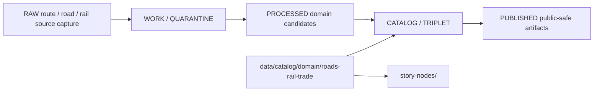

<!-- [KFM_META_BLOCK_V2]
doc_id: kfm://doc/data-catalog-domain-roads-rail-trade-readme
title: data/catalog/domain/roads-rail-trade/README.md — Roads/Rail/Trade Domain Catalog README
version: v0.1
type: readme; data-lifecycle-sublane; domain-catalog-guide
status: draft; PROPOSED; data-root; catalog-stage; roads-rail-trade; release-gated; source-role-aware; graph-projection-aware
owners: OWNER_TBD — Roads/Rail/Trade steward · Roads steward · Rail steward · Historic/trade routes steward · Data steward · Catalog steward · Evidence steward · Policy steward · Release steward · Docs steward
created: NEEDS VERIFICATION — blank placeholder existed before v0.1 expansion
updated: 2026-06-24
policy_label: public-doc; data; catalog; roads-rail-trade; lifecycle; release-gated; source-role-aware; graph-projection-aware
tags: [kfm, data, catalog, roads-rail-trade, roads, rail, trade-routes, transport, domain-catalog, CATALOG, TRIPLET, EvidenceBundle, SourceDescriptor, ReleaseManifest, RollbackCard]
related:
  - ../../README.md
  - ../../../README.md
  - ./story-nodes/README.md
  - ../../../../contracts/domains/roads-rail-trade/README.md
  - ../../../../contracts/domains/roads-rail-trade/movement_story_node.md
  - ../../../../contracts/domains/roads-rail-trade/road_segment.md
  - ../../../../contracts/domains/roads-rail-trade/rail_segment.md
  - ../../../../contracts/domains/roads-rail-trade/trade_route_corridor.md
  - ../../../../contracts/domains/roads-rail-trade/historic_route_claim.md
  - ../../../../contracts/domains/roads-rail-trade/network_node.md
  - ../../../../contracts/domains/roads-rail-trade/network_edge.md
  - ../../../../docs/domains/roads-rail-trade/README.md
  - ../../../../docs/domains/roads-rail-trade/DATA_LIFECYCLE.md
  - ../../../../docs/domains/roads-rail-trade/GRAPH_PROJECTIONS.md
  - ../../../../data/proofs/
  - ../../../../data/receipts/
  - ../../../../release/
notes:
  - "This file replaces a blank placeholder at `data/catalog/domain/roads-rail-trade/README.md`."
  - "Roads/Rail/Trade contracts report a slug conflict between `roads-rail-trade` and `transport`; this catalog path preserves the observed/requested `roads-rail-trade` segment and does not resolve the ADR question."
  - "This folder is a CATALOG-stage domain catalog lane; it is not source data, proof storage, release authority, schema authority, policy authority, graph truth, map truth, or implementation code."
  - "Graph projections, route narratives, and story nodes remain derived/evidence-subordinate and must not replace canonical segment, route, source, proof, receipt, or release records."
  - "Rollback target for this replacement is previous blank blob SHA `8b137891791fe96927ad78e64b0aad7bded08bdc`."
[/KFM_META_BLOCK_V2] -->

# data/catalog/domain/roads-rail-trade

> Roads/Rail/Trade domain catalog lane for governed catalog records and indexes inside the `CATALOG / TRIPLET` lifecycle stage.

  
  
  
  
  
  

**Status:** draft / PROPOSED  
**Path:** `data/catalog/domain/roads-rail-trade/README.md`  
**Owning root:** `data/catalog/domain/`  
**Domain segment:** `roads-rail-trade`  
**Lifecycle stage:** `CATALOG / TRIPLET`  
**Exposure posture:** release-gated; public use requires evidence, policy, validation, receipt, and release linkage  
**Truth posture:** CONFIRMED target was blank · CONFIRMED `data/catalog/` is CATALOG-stage and RELEASED ONLY for public exposure · CONFIRMED Roads/Rail/Trade contract lane is semantic-only and not schema, policy, data, proof, release, API, map, or runtime authority · CONFIRMED `story-nodes/` child README now exists as a CATALOG-stage story-node sublane · NEEDS VERIFICATION for catalog inventory, schemas, validators, source registry records, policy gates, receipts, release manifests, graph outputs, map/API behavior, and runtime behavior.

**Quick jumps:** [Purpose](#purpose) · [Lifecycle boundary](#lifecycle-boundary) · [Repo fit](#repo-fit) · [Accepted contents](#accepted-contents) · [Exclusions](#exclusions) · [Child lanes](#child-lanes) · [Catalog requirements](#catalog-requirements) · [Roads/Rail/Trade guardrails](#roads-rail-trade-guardrails) · [Evidence ledger](#evidence-ledger) · [Validation checklist](#validation-checklist) · [Rollback](#rollback)

---

## Purpose

`data/catalog/domain/roads-rail-trade/` stores or stages Roads/Rail/Trade catalog records and indexes that connect roads, rail, historic routes, trade corridors, route memberships, crossings, facilities, operators, status/restriction events, freight context, graph projections, story nodes, evidence references, source roles, receipts, and release state.

A domain catalog record supports discovery, steward review, catalog closure, and release preparation. It does **not** make a route, segment, graph, movement, trade, operator, legal-status, map, or narrative claim true by itself.

## Lifecycle boundary

`data/catalog/domain/roads-rail-trade/` is a CATALOG-stage domain lane. Public exposure applies only to records tied to approved release state, governed route, EvidenceBundle support, source-role support, validation, policy/review posture, and rollback target.

## Repo fit

| Responsibility | Correct home | Rule |
|---|---|---|
| Roads/Rail/Trade domain catalog records | `data/catalog/domain/roads-rail-trade/` | This lane. |
| Story-node catalog records | `data/catalog/domain/roads-rail-trade/story-nodes/` | Child catalog sublane. |
| Parent catalog stage | `data/catalog/` | Parent CATALOG-stage lane. |
| Semantic contracts | `contracts/domains/roads-rail-trade/` | Meaning only, not data. |
| Evidence/proof records | `data/proofs/` | EvidenceBundle and proof records. |
| Source registry | `data/registry/sources/roads-rail-trade/` or accepted registry root | Source role, cadence, rights, and caveats. |
| Receipts | `data/receipts/` | CatalogBuildReceipt, validation, policy, review, correction, and AI/citation receipts where applicable. |
| Release decisions | `release/` | Publication authority. |
| Schemas and policy | `schemas/`, `policy/` | Separate roots; slug/schema status remains NEEDS VERIFICATION. |
| Graph, map, API, UI, package code | selected implementation/delivery roots | Downstream surfaces, not this lane. |

## Accepted contents

| Content | Purpose |
|---|---|
| Domain catalog indexes | Group-level indexes for Roads/Rail/Trade catalog records. |
| Road and rail segment catalog entries | Catalog records for segment products with source, time, evidence, and release pointers. |
| Historic route and trade corridor catalog entries | Catalog records for corridor/claim products that preserve uncertainty and source role. |
| Route membership catalog entries | Time-scoped links between segments and routes/corridors. |
| Crossing, facility, and operator catalog entries | Catalog records for transport-side crossing/facility/operator products. |
| Status and restriction catalog entries | Time-bound status/restriction records with source-role and validity posture. |
| Network graph catalog entries | Pointers to derived graph products, not graph truth. |
| Story-node child indexes | Pointers to `story-nodes/` catalog records. |
| Evidence, source, policy, receipt, and release pointers | References to EvidenceBundle, SourceDescriptor, PolicyDecision, ReviewRecord, ReleaseManifest, RollbackCard, and validation reports. |

## Exclusions

| Do not put here | Correct home |
|---|---|
| RAW source files | `data/raw/roads-rail-trade/` or source-specific governed home |
| WORK/intermediate data | `data/work/roads-rail-trade/` |
| Quarantined data | `data/quarantine/roads-rail-trade/` |
| Processed datasets | `data/processed/roads-rail-trade/` |
| EvidenceBundle/proof records | `data/proofs/` |
| SourceDescriptor records | `data/registry/sources/roads-rail-trade/` or accepted registry root |
| Receipts | `data/receipts/` |
| Release decisions | `release/` |
| Published public products | `data/published/.../roads-rail-trade/` |
| Semantic contracts | `contracts/domains/roads-rail-trade/` |
| Schemas | `schemas/` |
| Policy rules | `policy/` |
| Graph canonical data | graph/triplet roots selected by doctrine/ADR |
| Map/UI/API/AI implementation | application, UI, map, API, or package roots |

## Child lanes

| Child lane | Status | Purpose |
|---|---|---|
| `story-nodes/` | draft / PROPOSED | Catalog records for Movement Story Node records used by Focus Mode or Evidence Drawer explanations. |

Additional child lanes should be added only when source, schema, policy, receipt, release, and rollback expectations are clear enough to avoid misleading authority.

## Catalog requirements

PROPOSED until schemas, validators, inventory, and release behavior are verified:

| Requirement | Meaning |
|---|---|
| Stable catalog identity | Record has a stable identity linked to source, evidence, derivative, or release object. |
| Object-family class | Record declares whether it describes road, rail, route, corridor, crossing, facility, operator, event, restriction, graph, or story-node material. |
| Evidence reference | Record points to EvidenceBundle/proof context when claims depend on evidence. |
| Source reference | Record points to SourceDescriptor/source catalog where source authority matters. |
| Temporal and spatial scope | Record preserves valid time, observation/source time, geometry posture, uncertainty, and public-safe shape. |
| Derived-output posture | Graph, map, route narrative, and Focus Mode records remain derivative and cited. |
| Policy/review state | Record links to policy/review state where sensitivity, rights, uncertainty, or public display matter. |
| Release reference | Public or Focus Mode-linked records point to ReleaseManifest and rollback target. |

## Roads/Rail/Trade guardrails

- Catalog records are catalog carriers, not route, segment, graph, map, or narrative truth roots.
- Road segments, rail segments, routes, route memberships, operators, restrictions, facilities, and graph edges remain distinct object families.
- Historic route claims preserve uncertainty and source-role limits.
- Graph projections are derived and cited; they do not replace canonical segment or route evidence.
- Story nodes and AI-assisted explanations remain downstream of EvidenceBundle, policy, review, citation validation, and release state.
- Cross-lane joins to Hydrology, Settlements/Infrastructure, Archaeology, Hazards, Agriculture, People/Land, or Map/UI surfaces must preserve owning-lane truth and sensitivity posture.
- Unreleased catalog records are not public merely because they exist under this directory.

## Evidence ledger

| Source | Status | Supports | Limits |
|---|---|---|---|
| `data/catalog/domain/roads-rail-trade/README.md` previous file | CONFIRMED | Target existed as a blank placeholder. | Did not define lane boundaries. |
| `data/catalog/README.md` | CONFIRMED | CATALOG-stage and RELEASED ONLY public posture. | Does not prove Roads/Rail/Trade catalog inventory. |
| `contracts/domains/roads-rail-trade/README.md` | CONFIRMED contract-lane evidence | Semantic contract boundaries, object families, source-role posture, slug conflict. | Contract lane does not prove catalog data exists. |
| `contracts/domains/roads-rail-trade/movement_story_node.md` | CONFIRMED semantic-contract evidence | Movement Story Node meaning and evidence-subordinate Focus Mode relation. | Schema, validators, fixtures, release manifests, runtime, and catalog inventory remain NEEDS VERIFICATION. |
| `data/catalog/domain/roads-rail-trade/story-nodes/README.md` | CONFIRMED child README | Existing story-node child catalog sublane. | Does not prove parent inventory or release state. |

## Validation checklist

- [ ] Confirm actual child files and Roads/Rail/Trade catalog inventory under this lane.
- [ ] Confirm catalog schema/profile location and slug selection.
- [ ] Confirm access policy, validators, citation checks, and CI checks.
- [ ] Confirm SourceDescriptor, EvidenceBundle, RunReceipt, ValidationReport, PolicyDecision, ReviewRecord, ReleaseManifest, and RollbackCard references.
- [ ] Confirm object-family separation for segments, routes, memberships, crossings, facilities, operators, restrictions, graphs, and story nodes.
- [ ] Confirm graph projection, map context, Focus Mode, cultural/archaeology, living-person, land/title, source-role, stale-state, and review handling.
- [ ] Confirm correction, withdrawal, supersession, and rollback behavior for stale or failed records.

## Rollback

Rollback is required if this lane becomes a Roads/Rail/Trade raw-data root, work area, quarantine store, processed-data store, proof store, source-registry root, release-decision root, published-output root, semantic-contract root, schema root, policy root, validator root, implementation root, graph-truth root, AI-truth root, map-truth root, or public exposure shortcut.

Rollback target for this replacement: previous blank blob SHA `8b137891791fe96927ad78e64b0aad7bded08bdc`.

<a href="#top">Back to top</a>

