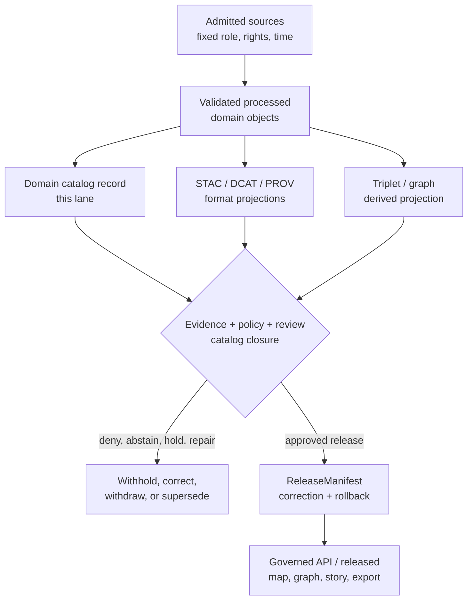

<!-- [KFM_META_BLOCK_V2]
doc_id: kfm://doc/data-catalog-domain-roads-rail-trade-readme
title: data/catalog/domain/roads-rail-trade/README.md — Roads / Rail / Trade Domain Catalog Lane
version: v0.2.0
type: readme; nested-directory-readme; data-lifecycle-sublane; domain-catalog-guide
status: repository-grounded draft; catalog-stage; release-gated; source-role-aware; graph-projection-aware; semantic-validation-hold
owners: NEEDS VERIFICATION — Roads/Rail/Trade, data, catalog, source, evidence, rights/sensitivity, policy, validation, release, correction, rollback, and docs stewards
created: NEEDS VERIFICATION — v0.1 records that a blank placeholder preceded the expanded README
updated: 2026-07-25
prepared_under_prompt: KFM Markdown Modernization & GitHub Documentation Implementation Agent v4.0.0
policy_label: public-doc; data; catalog; roads-rail-trade; release-gated; no-direct-public-path; source-role-aware; graph-derived; sensitive-route-aware
current_path: data/catalog/domain/roads-rail-trade/README.md
responsibility: document the canonical Roads/Rail/Trade domain catalog lane and its catalog-stage acceptance boundary without turning catalog, graph, map, story, AI, or workflow surfaces into truth or publication authority
truth_posture: >
  CONFIRMED current path and README, canonical data/catalog parent, singular domain index,
  story-nodes child, plural compatibility alias, semantic contract lane, source-registry lane,
  permissive catalog-matrix schema stub, placeholder catalog validator and emitter, assert-true
  smoke test, proposed policy scaffold, release-candidate guidance, and static-readiness workflow /
  PROPOSED catalog record acceptance contract, closure gates, review model, and correction flow /
  CONFLICTED roads-rail-trade versus transport and domains-versus-flat contract/schema topology /
  UNKNOWN exhaustive catalog record inventory, active writers and consumers, accepted release
  inventory, governed public consumers, hosting, caches, and runtime behavior /
  NEEDS VERIFICATION accountable owners, accepted schema/contract pairing, substantive validators
  and tests, source-rights and sensitivity closure, EvidenceBundle and receipt linkage, policy
  evaluation, review, release, correction propagation, and rollback drills
evidence_snapshot:
  repository: bartytime4life/Kansas-Frontier-Matrix
  base_ref: main
  base_commit: 01af6d30466898fb029f2f6e337f11e54d086f1a
  baseline_blob: 4f036cfe8eaf2dfa94fa5d7e51fc0d42ef346a6b
  catalog_parent_blob: b878b6156fdeea4f02143b39e6cb617a2b69ebc6
  domain_index_blob: 9ee3b634387ebfc5768893eb02ca6e9bc3b57dbe
  story_nodes_blob: 49da13738d0e5a6a275f7f08a883b31b540f7d78
  plural_alias_blob: d60e1f3eb35be14fd9c99a6aa07f62291c8c2c98
  contract_lane_blob: 79422f2b9fddd8a2755f54e43f94890881223b98
  catalog_index_blob: bbef737b194b062fc4e6a531e31adc8bee1a5eea
  catalog_schema_blob: 551216b5289055a282870d2d07ac14dc0cbffb52
  workflow_blob: 92692e7a10eff86c4e72958c52173dce15b43458
related:
  - ../README.md
  - ../../README.md
  - ./story-nodes/README.md
  - ../../domains/roads-rail-trade/README.md
  - ../../../registry/sources/roads-rail-trade/README.md
  - ../../../receipts/README.md
  - ../../../proofs/README.md
  - ../../../triplets/README.md
  - ../../../published/README.md
  - ../../../../contracts/domains/roads-rail-trade/README.md
  - ../../../../schemas/contracts/v1/domains/roads-rail-trade/catalog_matrix.schema.json
  - ../../../../policy/domains/roads-rail-trade/README.md
  - ../../../../docs/domains/roads-rail-trade/README.md
  - ../../../../docs/domains/roads-rail-trade/CANONICAL_PATHS.md
  - ../../../../docs/domains/roads-rail-trade/CATALOG_INDEX.md
  - ../../../../docs/doctrine/directory-rules.md
  - ../../../../release/candidates/roads-rail-trade/README.md
  - ../../../../.github/workflows/domain-roads-rail-trade.yml
tags: [kfm, data, catalog, roads-rail-trade, roads, rail, trade-routes, transport, domain-catalog, CATALOG, TRIPLET, EvidenceBundle, SourceDescriptor, CatalogBuildReceipt, ReleaseManifest, RollbackCard]
notes:
  - "This v0.2.0 revision upgrades the existing README in place; it creates no catalog record and changes no lifecycle, policy, release, or publication state."
  - "The singular data/catalog/domain/roads-rail-trade/ lane is governing; data/catalog/domains/roads-rail-trade/ remains compatibility-only."
  - "The roads-rail-trade versus transport and domains-versus-flat contract/schema conflict remains unresolved and is not silently normalized here."
  - "The previous blank blob remains lineage evidence only. The documentation rollback target for this revision is the v0.1 baseline blob."
[/KFM_META_BLOCK_V2] -->

<a id="top"></a>

# `data/catalog/domain/roads-rail-trade/` — Roads / Rail / Trade Domain Catalog Lane

[](#status-and-evidence-boundary)
[](#lifecycle-boundary)
[](../../../../.github/workflows/domain-roads-rail-trade.yml)
[](../../../../release/candidates/roads-rail-trade/README.md)
[](#catalog-object-and-authority-split)

> **One-line purpose.** Govern the catalog-stage discovery records and indexes for Roads, Rail, and Trade Routes while preserving source role, time, uncertainty, sensitivity, evidence, release, correction, and rollback boundaries.

> [!IMPORTANT]
> A catalog record is a discovery and interoperability carrier. It does not make a road, rail line, route, corridor, crossing, restriction, graph edge, movement story, legal-access statement, or operational-status claim true, current, safe, or released.

> [!CAUTION]
> This repository is public. Do not commit precise restricted routes, private-access details, living-person or land/title joins, Indigenous or cultural corridor details, archaeological locations, critical-infrastructure vulnerabilities, credentials, or reconstructive derivatives to this lane. Withhold, generalize, redact, quarantine outside public Git, or deny according to the governing policy.

**Path:** `data/catalog/domain/roads-rail-trade/README.md`  
**Canonical relationship:** nested under the singular [`data/catalog/domain/`](../README.md) index  
**Lifecycle posture:** `CATALOG / TRIPLET`; public use requires an approved release and governed interface  
**Current implementation posture:** catalog documentation and scaffolds exist; substantive semantic validation, proof closure, release inventory, and runtime/public use are not established  
**Documentation rollback target:** v0.1 baseline blob `4f036cfe8eaf2dfa94fa5d7e51fc0d42ef346a6b`

**Quick navigation:** [Purpose](#purpose) · [Status](#status-and-evidence-boundary) · [Repo fit](#repo-fit) · [Belongs](#accepted-contents) · [Exclusions](#exclusions) · [Inputs](#inputs) · [Outputs](#outputs) · [Authority split](#catalog-object-and-authority-split) · [Children](#child-lanes) · [Catalog contract](#catalog-requirements) · [Lifecycle](#lifecycle-boundary) · [Guardrails](#roads-rail-trade-guardrails) · [Validation](#validation-checklist) · [Review](#review-burden) · [Related](#related-folders) · [ADRs](#adrs-and-unresolved-topology) · [Open items](#open-verification-register) · [Evidence](#evidence-ledger) · [Rollback](#rollback) · [No-loss](#change-history-and-no-loss-ledger)

---

## Purpose

`data/catalog/domain/roads-rail-trade/` is the canonical domain-scoped catalog lane for discoverable Roads / Rail / Trade records inside the broader [`data/catalog/`](../../README.md) responsibility root.

It may describe released or release-candidate road and rail segments, routes and corridors, route memberships, crossings and transport facilities, time-bound restriction or status context, operators, freight context, historic route claims, derived network views, and Movement Story Nodes. It owns the **catalog boundary and indexing posture**, not the underlying source records, processed domain truth, proof objects, release decisions, public artifacts, or client behavior.

A catalog record supports discovery, steward review, cross-format catalog closure, and release preparation. It must preserve the identity, source role, spatial and temporal scope, uncertainty, evidence, policy, review, correction, and rollback posture of the object it describes.

## Status and evidence boundary

| Surface | Current evidence | Safe conclusion |
|---|---|---|
| Exact lane | **CONFIRMED** at `main@01af6d30466898fb029f2f6e337f11e54d086f1a` | The README remains at the requested same path. |
| Bounded lane inventory | This README and the [`story-nodes/`](./story-nodes/README.md) child are confirmed | An exhaustive record, file, generated-output, or externally hosted inventory remains `UNKNOWN`. |
| Parent catalog authority | **CONFIRMED** canonical [`data/catalog/`](../../README.md) and singular [`data/catalog/domain/`](../README.md) contracts | Catalog responsibility and release-gated exposure are established; active writers and consumers are not. |
| Plural alias | **CONFIRMED** [`data/catalog/domains/roads-rail-trade/`](../../domains/roads-rail-trade/README.md) compatibility README | It is not a second catalog record home; retention or retirement remains unresolved. |
| Semantic contracts | **CONFIRMED** draft [`contracts/domains/roads-rail-trade/`](../../../../contracts/domains/roads-rail-trade/README.md) lane | Meaning surfaces exist; the `roads-rail-trade` / `transport` topology remains conflicted. |
| Catalog schema | **CONFIRMED** `PROPOSED` [`catalog_matrix.schema.json`](../../../../schemas/contracts/v1/domains/roads-rail-trade/catalog_matrix.schema.json) | It requires only `id` and permits additional properties; it does not provide semantic catalog closure. |
| Validator and emitter | **CONFIRMED** placeholders | The validator raises `NotImplementedError`; the emitter contains documentation-only placeholder text. |
| Tests | **CONFIRMED** one `assert True` smoke scaffold | No substantive Roads/Rail/Trade catalog or domain suite is established. |
| Policy | **CONFIRMED** `PROPOSED (greenfield scaffold)` README | Presence does not establish accepted policy inputs, decisions, fixtures, tests, or evaluator wiring. |
| Domain workflow | **CONFIRMED** read-only static-readiness workflow | It intentionally records semantic-validation, proof, and release-dry-run holds; it is not a publisher. |
| Release/public use | Release-candidate guidance exists; accepted release inventory and public consumers are `UNKNOWN` | A path, badge, check, commit, PR, merge, or catalog write is not publication. |

<a id="repo-fit"></a>

## Repo fit and Directory Rules basis

Directory Rules select this path by **responsibility**, **lifecycle phase**, and **domain segment**:

| Path segment | Encoded responsibility |
|---|---|
| `data/` | Lifecycle material and emitted trust-support families |
| `catalog/` | Catalog-stage discovery and interoperability projections |
| `domain/` | Domain-scoped catalog records and indexes |
| `roads-rail-trade/` | Roads / Rail / Trade domain lane |

This is the verified form of the Domain Placement Law for this catalog lane:

```text
data/catalog/domain/roads-rail-trade/
```

The path does not create a new root or lifecycle phase. It also does not resolve the separate `roads-rail-trade` versus `transport` and `domains/` versus flat contract/schema conflict. Catalog records must cite the exact accepted contract and schema version for their object family; this README must not invent a hybrid path or treat parallel candidates as interchangeable.

<a id="accepted-contents"></a>

## What belongs here

Future tracked records are admissible only after their schema, validation, policy, review, evidence, release, correction, and rollback requirements are closed.

| Content | Catalog role |
|---|---|
| Domain catalog indexes and inventories | Enumerate Roads/Rail/Trade catalog records without upgrading their truth, policy, review, or release state. |
| Road and rail segment catalog records | Describe source-bound, time-bounded segment products and their evidence/release references. |
| Route, corridor, and historic-route catalog records | Describe route/corridor products while preserving source role, uncertainty, geometry lineage, and cultural sensitivity. |
| Route-membership catalog records | Record time-scoped, evidence-backed links between segments and routes/corridors. |
| Crossing and transport-facility catalog records | Describe transport-side crossings, bridges, ferries, depots, sidings, yards, and related facilities without replacing Hydrology or Settlements/Infrastructure truth. |
| Operator, status, and restriction catalog records | Describe time-bound assertions with official-source limits, freshness, stale-state, and legal/operational caveats. |
| Network and triplet projection pointers | Point to derived graph products that remain reversible to source-bound objects and evidence. |
| Movement Story Node indexes | Point to the governed [`story-nodes/`](./story-nodes/README.md) sublane without turning narrative or UI projections into truth. |
| Cross-format and release pointers | Link matching domain, STAC, DCAT, PROV, triplet, evidence, receipt, policy, review, release, correction, and rollback objects. |
| Public-safe migration or correction notes | Preserve identity and lineage without embedding restricted payloads or creating alternate authority. |

<a id="exclusions"></a>

## What does NOT belong here

| Excluded material | Governing home or behavior |
|---|---|
| RAW captures, WORK intermediates, quarantined values, or processed domain records | Corresponding `data/<phase>/roads-rail-trade/` lane |
| Canonical road, rail, route, corridor, crossing, facility, operator, restriction, or event geometry/data | Owning processed/domain object lane |
| STAC, DCAT, or PROV records | Format homes under `data/catalog/stac/`, `data/catalog/dcat/`, and `data/catalog/prov/` |
| Graph or triplet payloads | [`data/triplets/`](../../../triplets/README.md) or an accepted governed projection lane |
| SourceDescriptor and source-admission records | [`data/registry/sources/roads-rail-trade/`](../../../registry/sources/roads-rail-trade/README.md) |
| EvidenceBundles, ProofPacks, validation proof, or integrity material | [`data/proofs/`](../../../proofs/README.md) |
| Process, transform, catalog-build, AI, or citation receipts | [`data/receipts/`](../../../receipts/README.md) |
| Release decisions, manifests, corrections, withdrawals, signatures, or rollback cards | [`release/`](../../../../release/README.md) |
| Published tiles, APIs, reports, stories, graph exports, or UI payloads | Accepted [`data/published/`](../../../published/README.md) lane after governed release |
| Semantic contracts, JSON Schemas, policy, validators, tests, pipeline code, packages, or applications | Their responsibility roots |
| Duplicate records in plural `data/catalog/domains/roads-rail-trade/` | Keep the plural lane compatibility-only; do not mirror payloads |
| Uncited generated prose, maps, screenshots, graph paths, model confidence, or search results used as proof | Resolve governed evidence or abstain |
| Live routing, closure, detour, legal-access, right-of-way, bridge-condition, rail-status, emergency, regulatory, or safe-passage guidance | Use the applicable official or operational authority; KFM does not claim this role |
| Restricted, precise, private, or reconstructive content | Deny, generalize, redact, quarantine outside public Git, or use an approved access-controlled system |

## Inputs

Catalog records may reference, but must not absorb, the following governed inputs:

- validated processed Roads/Rail/Trade objects with stable identity and declared object family;
- admitted SourceDescriptors with fixed source role, rights, terms, cadence, authority limits, freshness, and sensitivity posture;
- resolvable EvidenceRefs and EvidenceBundles;
- validation, transform, catalog-build, generalization, citation, review, and correction receipts;
- PolicyDecisions and ReviewRecords where rights, sensitivity, uncertainty, current status, public representation, or cultural context are material;
- release-candidate and immutable release references;
- prior catalog identity, supersession, correction, withdrawal, and rollback lineage.

Missing, stale, conflicted, rights-unclear, sensitivity-unclear, or evidence-incomplete inputs must keep the record held, narrowed, withdrawn, superseded, or absent from public use according to its governing contract.

## Outputs

This lane may support:

- internal or release-approved domain catalog records;
- domain indexes and cross-format relationship pointers;
- steward-facing catalog quality summaries that cite the underlying reports;
- catalog records consumed through governed APIs after release;
- correction, supersession, withdrawal, and rollback navigation.

It emits no source truth, route truth, graph truth, legal-access decision, PolicyDecision, EvidenceBundle, ProofPack, ReleaseManifest, public API, map layer, AI answer, or KFM publication by directory placement.

## Catalog object and authority split

Similar names and relationships do not make these objects interchangeable:

| Object or surface | Governing role | Must not be treated as |
|---|---|---|
| Road or Rail Segment | Source-bound domain object with geometry, identity, time, and evidence | Route designation, operator status, legal access, or routing truth by itself |
| Route or Corridor | Named or interpreted movement corridor | Segment geometry, confirmed membership, current condition, or legal right-of-way |
| RouteMembership | Time-scoped relation between a segment and route/corridor | The route or segment itself |
| OperatorAssignment / OperatorStatus | Time-bound administrative or operational assertion | Permanent ownership, current operation, or legal authority beyond its source scope |
| StatusEvent / RestrictionEvent | Time-bounded status or restriction context | Emergency guidance, guaranteed current closure, or safe-passage advice |
| Crossing / TransportFacility | Transport-side relation or facility context | Hydrology, settlement, infrastructure, ownership, or vulnerability truth |
| Network node or edge | Derived graph projection | Canonical route, legal-access, closure, or passability truth |
| HistoricRouteClaim | Evidence-bounded historical interpretation | Precise alignment, modern route, ownership, access, or confirmed cultural meaning |
| Movement Story Node | Evidence-subordinate narrative, spatial, temporal, and provenance unit | UI schema, evidence, route truth, cultural truth, or release approval |
| Catalog record | Discovery, citation, review, and release-preparation carrier in this lane | Processed record, proof object, release decision, or published artifact |
| STAC / DCAT / PROV projection | Format-specific catalog facet | Independent truth or an alternate domain catalog home |
| ReleaseManifest | Approved release identity and artifact binding under `release/` | Catalog entry, StoryManifest, or evidence itself |

<a id="child-lanes"></a>

## Child and compatibility lanes

| Lane | Current posture | Boundary |
|---|---|---|
| [`story-nodes/`](./story-nodes/README.md) | Repository-grounded draft; semantic validation and public release held | Movement Story Node catalog specialization; record inventory and accepted runtime use remain unverified |
| [`data/catalog/domains/roads-rail-trade/`](../../domains/roads-rail-trade/README.md) | `COMPATIBILITY-ALIAS` | README and migration guidance only; never a second catalog record home |

Additional child lanes must not be created merely for topical convenience. A new sublane requires a distinct catalog responsibility, verified need, stable identity, contract/schema posture, source and evidence closure, policy and sensitivity handling, validation, release dependencies, correction path, and rollback plan.

<a id="catalog-requirements"></a>

## Proposed catalog record contract

The current `catalog_matrix.schema.json` is a permissive `PROPOSED` stub. Until an accepted schema and substantive validator exist, the following is a documentation-level acceptance contract rather than machine-enforced field shape:

| Concern | Minimum closure before reliance |
|---|---|
| Identity | Stable record ID, object ID, version, deterministic content/spec digest, and supersession lineage |
| Object family | Explicit segment, route, corridor, membership, crossing, facility, operator, event, restriction, graph, historic claim, or story-node classification |
| Contract and schema | Exact accepted semantic contract and schema version; no silent `roads-rail-trade` / `transport` hybrid |
| Source role | Resolvable SourceDescriptor with fixed observed, regulatory, administrative, modeled, aggregate, candidate, context, synthetic, or restricted role |
| Evidence | Resolvable EvidenceRef/EvidenceBundle support; catalog metadata must not upgrade evidence authority |
| Time | Separate valid, observed/source, retrieval, build, release, correction, and stale-state times where material |
| Space and uncertainty | Evidence-supported geometry scope, CRS/lineage, scale, uncertainty, and reviewed public-safe generalization |
| Rights and sensitivity | Rights, attribution, cultural/sovereignty, archaeology, living-person, land/title, private-access, and infrastructure posture |
| Derivation | Clear distinction between canonical processed objects and derived graph, map, story, summary, or AI projections |
| Policy and review | Applicable PolicyDecision and ReviewRecord references, including specialist review when required |
| Receipts and closure | CatalogBuildReceipt and applicable validation, transform, generalization, citation, or review receipts |
| Cross-format agreement | Domain catalog, STAC, DCAT, PROV, and triplet identifiers and lineage agree where those projections exist |
| Release | Immutable approved release reference; catalog placement alone is insufficient |
| Correction and rollback | Correction, withdrawal, supersession, dependency invalidation, and tested rollback target |
| Limitations | Plain-language statement of what the record cannot prove or authorize |

Do not invent a universal machine outcome vocabulary in this README. Use the finite disposition defined by the applicable contract and policy surface.

## Lifecycle boundary


```mermaid
flowchart TD
    S["Admitted sources<br/>fixed role, rights, time"] --> P["Validated processed<br/>domain objects"]
    P --> C["Domain catalog record<br/>this lane"]
    P --> T["STAC / DCAT / PROV<br/>format projections"]
    P --> G["Triplet / graph<br/>derived projection"]
    C --> Q{"Evidence + policy + review<br/>catalog closure"}
    T --> Q
    G --> Q
    Q -- "deny, abstain, hold, repair" --> H["Withhold, correct,<br/>withdraw, or supersede"]
    Q -- "approved release" --> R["ReleaseManifest<br/>correction + rollback"]
    R --> U["Governed API / released<br/>map, graph, story, export"]
```

The diagram is a responsibility map, not proof that every projection, validator, or release currently exists. Public clients may consume only approved public-safe releases through governed interfaces; they must not read internal catalog records, source registries, proofs, receipts, candidates, or canonical stores directly.

<a id="roads-rail-trade-guardrails"></a>

## Roads / Rail / Trade guardrails

- **Catalog is not truth.** A record describes and links; it cannot make a segment, route, event, graph, or narrative claim true.
- **Source roles do not collapse.** Observed, regulatory, administrative, modeled, aggregate, candidate, context, synthetic, and restricted sources retain their admitted role downstream.
- **Object families stay separate.** Segments, routes, memberships, crossings, facilities, operators, events, restrictions, graph edges, historic claims, and story nodes are not interchangeable.
- **Time stays explicit.** Historical validity, source time, current operational status, retrieval time, release time, and correction time must not be flattened.
- **Geometry is not legal access.** A mapped line or crossing does not prove ownership, public access, current passability, safety, legality, or operating status.
- **Historic and cultural claims stay bounded.** Interpretation, oral history, Indigenous and cultural corridors, archaeological relations, and uncertain alignments retain uncertainty, authority, sensitivity, and steward review.
- **Graph stays derived.** Connectivity and route projections remain reversible to source-bound segments, memberships, catalog records, and EvidenceBundles.
- **Cross-domain joins preserve ownership.** Hydrology, Settlements/Infrastructure, Archaeology, Hazards, Agriculture, People/Land, and other lanes retain their identity, evidence, policy, sensitivity, correction, and rollback authority.
- **AI stays subordinate.** Generated language cannot upgrade evidence, source role, uncertainty, policy, review, release, or sensitivity state.
- **Public Git is public.** “Unreleased,” “review-only,” or “restricted” wording does not make tracked bytes confidential.
- **Publication remains separate.** A successful build, badge, check, commit, PR, merge, catalog write, or rendered map is not a release.

<a id="validation-checklist"></a>

## Validation and current implementation

### Current bounded implementation evidence

| Check surface | Observed state | What it does not prove |
|---|---|---|
| [`catalog_matrix.schema.json`](../../../../schemas/contracts/v1/domains/roads-rail-trade/catalog_matrix.schema.json) | `PROPOSED`; requires only `id`; `additionalProperties: true` | Semantic catalog identity, evidence closure, sensitivity, release readiness |
| [`validate_catalog_matrix.py`](../../../../tools/validators/domains/roads-rail-trade/validate_catalog_matrix.py) | Raises `NotImplementedError` | Any catalog record validation |
| [`emit_catalog_records.py`](../../../../pipelines/domains/roads-rail-trade/emit_catalog_records.py) | Placeholder module text only | Catalog writing, deterministic identity, receipts, or output |
| [`test_roads_rail_trade_smoke.py`](../../../../tests/domains/roads-rail-trade/test_roads_rail_trade_smoke.py) | One `assert True` placeholder | Domain or catalog behavior |
| [`policy/domains/roads-rail-trade/`](../../../../policy/domains/roads-rail-trade/README.md) | `PROPOSED (greenfield scaffold)` | Accepted policy inputs, evaluation, decisions, tests, or release enforcement |
| [`domain-roads-rail-trade.yml`](../../../../.github/workflows/domain-roads-rail-trade.yml) | Read-only static-readiness checks and explicit holds | Semantic validation, proof production, routing, legal access, public safety, release, or publication |
| [`release/candidates/roads-rail-trade/`](../../../../release/candidates/roads-rail-trade/README.md) | Candidate-review guidance; publication not authorized | Accepted candidate, release inventory, public artifact, or governed consumer |
| [`story-nodes/`](./story-nodes/README.md) | Detailed v0.2 boundary; paired schema, substantive validator/test, release inventory, and runtime use held | Parent catalog inventory or accepted story-node records |

### Required before catalog records are relied on

- [ ] Resolve the contract/schema topology through the accepted decision path without creating a hybrid or mirror authority.
- [ ] Inventory the direct lane, child lanes, generated outputs, external stores, writers, and consumers at a pinned revision.
- [ ] Replace the permissive catalog schema stub with an accepted versioned contract pairing.
- [ ] Replace placeholder validator, emitter, and smoke test with a bounded deterministic no-network suite.
- [ ] Add public-safe valid, invalid, denied, abstained, held, stale, superseded, corrected, withdrawn, and error fixtures as applicable.
- [ ] Enforce object-family separation, identity, source role, time, geometry lineage, uncertainty, rights, sensitivity, evidence, citation, policy, review, release, correction, and rollback rules.
- [ ] Prove historic/cultural overprecision, private access, living-person/land-title, and infrastructure combination-risk cases fail closed.
- [ ] Establish domain catalog, STAC, DCAT, PROV, and triplet agreement without treating projections as canonical truth.
- [ ] Prove public clients use only governed APIs and approved public-safe release artifacts.
- [ ] Exercise correction, withdrawal, supersession, cache/dependency invalidation, and rollback.

Passing Markdown, JSON parsing, structural schema checks, or held workflows does not close these items.

## Review burden

A README-only boundary change requires Roads/Rail/Trade, data/catalog, and documentation review.

Any catalog payload, schema/contract pairing, source activation, source-role change, rights/sensitivity decision, historical/cultural interpretation, current-status field, graph or story projection, producer/consumer change, public exposure, release, correction, withdrawal, or rollback additionally requires the owning source, evidence, domain, rights/sensitivity, cultural/sovereignty, policy, validation, operations, UI/API, release, correction, and rollback reviewers.

CODEOWNERS routing, a green check, a receipt, a commit, a pull request, or a merge is not stewardship, independent approval, release authorization, or KFM publication.

## Related folders

| Responsibility | Governed home |
|---|---|
| Parent domain catalog index | [`data/catalog/domain/`](../README.md) |
| Catalog responsibility root | [`data/catalog/`](../../README.md) |
| Movement Story Node catalog lane | [`story-nodes/`](./story-nodes/README.md) |
| Plural compatibility alias | [`data/catalog/domains/roads-rail-trade/`](../../domains/roads-rail-trade/README.md) |
| Source identity, role, rights, and cadence | [`data/registry/sources/roads-rail-trade/`](../../../registry/sources/roads-rail-trade/README.md) |
| Process memory | [`data/receipts/`](../../../receipts/README.md) |
| Evidence and proof support | [`data/proofs/`](../../../proofs/README.md) |
| Graph and relationship projections | [`data/triplets/`](../../../triplets/README.md) |
| Released public-safe carriers | [`data/published/`](../../../published/README.md) |
| Semantic contracts | [`contracts/domains/roads-rail-trade/`](../../../../contracts/domains/roads-rail-trade/README.md) |
| Machine shape | [`schemas/contracts/v1/domains/roads-rail-trade/`](../../../../schemas/contracts/v1/domains/roads-rail-trade/README.md) — topology conflicted |
| Policy | [`policy/domains/roads-rail-trade/`](../../../../policy/domains/roads-rail-trade/README.md) |
| Domain doctrine and path registry | [`docs/domains/roads-rail-trade/`](../../../../docs/domains/roads-rail-trade/README.md) · [`CANONICAL_PATHS.md`](../../../../docs/domains/roads-rail-trade/CANONICAL_PATHS.md) |
| Catalog-content reference | [`CATALOG_INDEX.md`](../../../../docs/domains/roads-rail-trade/CATALOG_INDEX.md) |
| Release-candidate review | [`release/candidates/roads-rail-trade/`](../../../../release/candidates/roads-rail-trade/README.md) |
| Placement doctrine | [Directory Rules](../../../../docs/doctrine/directory-rules.md) |

## ADRs and unresolved topology

No accepted decision was verified in this packet that resolves all of the following:

1. the repo-wide `domains/` versus flat contract/schema form;
2. the lane-specific `roads-rail-trade` versus `transport` slug;
3. the plural `data/catalog/domains/roads-rail-trade/` compatibility alias disposition;
4. the future domain-owned versus shared ownership of Movement Story Nodes;
5. catalog/triplet naming drift outside this lane.

This README preserves the verified singular catalog path and does not select, copy, rename, merge, or retire another authority surface.

Relevant doctrine and proposed decisions include ADR-0001 schema-home guidance, receipt/proof/manifest/catalog separation, lifecycle and public-client trust-membrane decisions, and the open Roads/Rail/Trade questions in [`CANONICAL_PATHS.md`](../../../../docs/domains/roads-rail-trade/CANONICAL_PATHS.md). Any resolution that moves paths, changes authority, creates a mirror, or retires a lane requires the accepted decision, migration map, producer/consumer cutover, correction plan, rollback plan, and post-change verification.

## Open verification register

| ID | Item | Status | Evidence that would close it |
|---|---|---|---|
| RRT-CAT-01 | Exhaustive direct-lane and external record inventory | `UNKNOWN` | Pinned recursive tree, generated/LFS/external classification, and record inventory |
| RRT-CAT-02 | Active catalog writers and consumers | `UNKNOWN` | Code, pipeline, workflow, runtime, API/UI, host, cache, export, and search inventory |
| RRT-CAT-03 | Accepted contract/schema topology and versions | `CONFLICTED` | Accepted ADR/decision, migration map, compatibility tests, and rollback plan |
| RRT-CAT-04 | Catalog record schema and semantic validator | `NEEDS VERIFICATION` | Accepted schema, validator, fixtures, reports, and observed no-network run |
| RRT-CAT-05 | Source, rights, sensitivity, and review closure | `NEEDS VERIFICATION` | Admitted SourceDescriptors, policy decisions, review records, and negative cases |
| RRT-CAT-06 | Evidence, receipt, proof, and catalog closure | `NEEDS VERIFICATION` | Resolvable record examples, receipts, ProofPack/EvidenceBundle support, and closure validator |
| RRT-CAT-07 | Cross-format and triplet agreement | `NEEDS VERIFICATION` | STAC/DCAT/PROV/domain/triplet identity-parity reports |
| RRT-CAT-08 | Accepted release inventory and governed public consumers | `UNKNOWN` | ReleaseManifest, public-safe artifacts, governed routes, and integration tests |
| RRT-CAT-09 | Correction propagation and rollback rehearsal | `NEEDS VERIFICATION` | Correction/withdrawal record, dependency invalidation, cache handling, and rollback evidence |
| RRT-CAT-10 | Accountable owners and independent approval rules | `NEEDS VERIFICATION` | Verified stewardship assignments and repository rules |
| RRT-CAT-11 | Plural compatibility alias disposition | `NEEDS VERIFICATION` | Accepted retention/retirement decision, zero-duplication proof, migration, and rollback |
| RRT-CAT-12 | Movement Story Node ownership and accepted catalog family | `CONFLICTED` | Open-question resolution, paired schema, consumer analysis, and migration plan |

## Evidence ledger

| Evidence | Status | Supports | Limit |
|---|---|---|---|
| Current README at baseline blob `4f036cfe…` | `CONFIRMED` | Existing purpose, lifecycle, object-family, source-role, graph, story-node, release, and rollback posture | Does not prove record inventory or implementation |
| [`data/catalog/README.md`](../../README.md) | `CONFIRMED` canonical catalog boundary | Catalog responsibility, release-gated exposure, validation and anti-collapse rules | Writers, payloads, consumers, and public serving remain incompletely verified |
| [`data/catalog/domain/README.md`](../README.md) | `CONFIRMED` singular domain index | Domain-lane placement and child-lane pattern | Parent remains v0.1 and does not prove child completeness |
| [`CATALOG_INDEX.md`](../../../../docs/domains/roads-rail-trade/CATALOG_INDEX.md) | `CONFIRMED` doctrine/reference text | Domain versus format homes, object families, keying, evidence, triplet, and closure expectations | It explicitly did not inspect a mounted repository |
| [`CANONICAL_PATHS.md`](../../../../docs/domains/roads-rail-trade/CANONICAL_PATHS.md) | `CONFIRMED` path-registry text | Verified lane form and explicit two-dimensional contract/schema conflict | Proposed paths and open questions are not accepted decisions |
| [`contracts/domains/roads-rail-trade/`](../../../../contracts/domains/roads-rail-trade/README.md) | `CONFIRMED` draft semantic lane | Object-family and authority boundaries | Most contracts remain draft; schema and runtime enforcement are separate |
| [`data/registry/sources/roads-rail-trade/`](../../../registry/sources/roads-rail-trade/README.md) | `CONFIRMED` source-registry boundary | Source role, rights, freshness, access, historic uncertainty, and no-navigation posture | Registry topology and source activation remain unresolved |
| [`story-nodes/`](./story-nodes/README.md) | `CONFIRMED` current child README | Story/UI authority split, sensitivity boundary, scaffold status, and correction flow | Does not prove accepted story-node records or parent inventory |
| [`catalog_matrix.schema.json`](../../../../schemas/contracts/v1/domains/roads-rail-trade/catalog_matrix.schema.json) | `CONFIRMED` permissive schema stub | A catalog-shaped schema surface exists | Requires only `id`; does not close semantics, policy, evidence, or release |
| Validator, emitter, and smoke test | `CONFIRMED` placeholders | Current implementation maturity is bounded | No substantive catalog validation or generation |
| [`domain-roads-rail-trade.yml`](../../../../.github/workflows/domain-roads-rail-trade.yml) | `CONFIRMED` implementation-bearing readiness check | Read-only triggers, structural checks, placeholder detection, and explicit holds | Does not validate catalog truth, proof, policy, release, routing, or safety |
| [`release/candidates/roads-rail-trade/`](../../../../release/candidates/roads-rail-trade/README.md) | `CONFIRMED` review guidance | Candidate-not-release, rights/sensitivity, evidence, review, correction, and rollback boundaries | Accepted candidate and public release inventory remain unknown |

<a id="rollback"></a>

## Correction, supersession, and rollback

### Catalog records

If a source, object identity, geometry, time, EvidenceBundle, policy decision, review, sensitivity state, release, or limitation changes:

1. stop serving the dependent catalog projection through governed consumers;
2. mark the record held, corrected, withdrawn, superseded, or otherwise disposed according to its governing contract;
3. preserve the prior identity, digest, source role, and lineage rather than rewriting history;
4. invalidate or rebuild dependent STAC, DCAT, PROV, triplet, graph, map, search, export, StoryNode, API, cache, and generated-summary surfaces;
5. issue any required correction or withdrawal through the release authority; and
6. restore only an approved public-safe prior target with a valid rollback reference.

### This README

Before merge, rollback means leaving the review branch unmerged. After merge, use a transparent revert commit or focused revert PR against the actual merged commit; do not rewrite shared history.

The rollback target for this revision is the v0.1 baseline blob `4f036cfe8eaf2dfa94fa5d7e51fc0d42ef346a6b`. The older blank blob `8b137891791fe96927ad78e64b0aad7bded08bdc` remains lineage evidence, not the normal rollback target for this documentation correction.

## Change history and no-loss ledger

### v0.2.0 — 2026-07-25

- grounded status against current parent contracts, singular/plural catalog lanes, source registry, semantic contracts, schema stub, placeholders, workflow holds, release guidance, and story-node child;
- clarified domain catalog versus format catalog, triplet, source, proof, receipt, release, and published-artifact responsibilities;
- added public-repository sensitivity, live-routing/legal-access, object-family, review, correction, supersession, and open-verification controls;
- replaced the historical blank-blob rollback instruction with the immediate v0.1 baseline while retaining lineage;
- changed Markdown only.

### v0.1 — 2026-06-24

Expanded the prior blank placeholder into a CATALOG-stage Roads/Rail/Trade domain catalog README.

| v0.1 element | v0.2.0 disposition |
|---|---|
| `doc_id`, same path, catalog-stage role, and release-gated posture | **KEEP / CLARIFY** |
| Object families and accepted catalog contents | **KEEP / ENRICH** with authority separation and acceptance boundaries |
| Source-role, time, uncertainty, graph, story-node, and cross-domain guardrails | **KEEP / STRENGTHEN** |
| Story-node child relationship | **KEEP / UPDATE** against the repository-grounded v0.2 child README |
| Plural alias and schema/contract conflict | **ENRICH / SURFACE CONFLICT** |
| Evidence ledger and validation checklist | **ENRICH** with current schemas, placeholders, workflow, release, and open items |
| Rollback to the historical blank blob | **REPAIR** to the immediate v0.1 baseline; blank blob retained as lineage |
| Payload, schema, policy, workflow, code, data, release, or publication state | **UNCHANGED** |

<p align="right"><a href="#top">Back to top</a></p>
